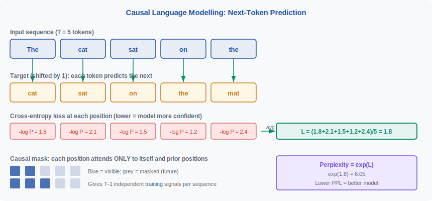
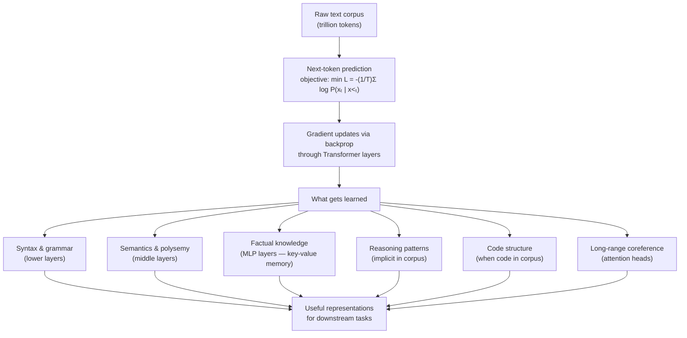
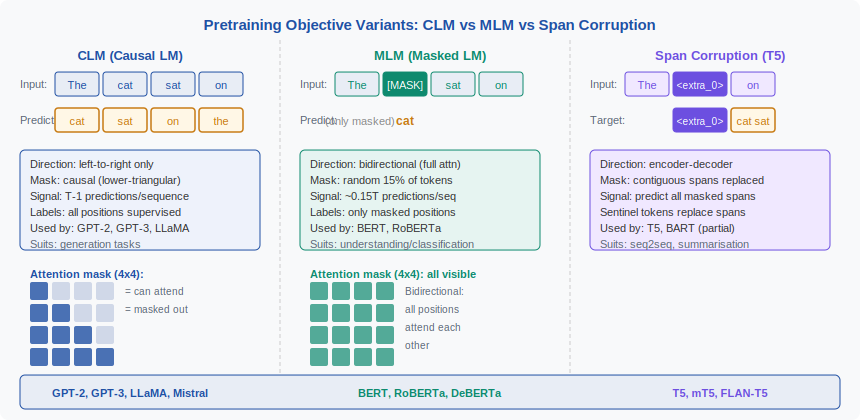

<!-- ============================ TOP NAV ============================ -->
<div align="center">

[🏠 Home](../../README.md) &nbsp;•&nbsp; [📚 Section 3 — Pretraining & Scaling Laws](./README.md) &nbsp;•&nbsp; [Q3‑02 — Scaling Laws (Kaplan) ➡️](./q02-scaling-laws-kaplan.md)

</div>

---

# Q3‑01 · What is language model pretraining? What objective is minimised and what does a model learn?

<div align="center">


</div>

> [!IMPORTANT]
> **The 20‑second answer.** Language model pretraining is **self-supervised learning on raw text**: the model learns to predict the next token given all previous tokens, with no human-provided labels. The objective minimised is the **average negative log-likelihood** (cross-entropy) across every position in every training sequence. Formally: $L = -\frac{1}{T}\sum_{t=1}^{T}\log P_\theta(x_t \mid x_{<t})$. This is equivalent to minimising **perplexity** $= \exp(L)$. To predict the next token well across billions of diverse examples, the model is forced to learn syntax, semantics, world knowledge, reasoning patterns, and stylistic variation — all from the prediction signal alone.

---

## Table of contents

1. [First principles](#1--first-principles)
2. [The problem, told as a story](#2--the-problem-told-as-a-story)
3. [The objective function, precisely](#3--the-objective-function-precisely)
4. [Why next-token prediction works](#4--why-next-token-prediction-works)
5. [What the model actually learns](#5--what-the-model-actually-learns)
6. [The training process](#6--the-training-process)
7. [Algorithm & pseudocode](#7--algorithm--pseudocode)
8. [Reference implementation](#8--reference-implementation)
9. [Worked numerical example](#9--worked-numerical-example)
10. [Objective variants: CLM, MLM, span corruption](#10--objective-variants-clm-mlm-span-corruption)
11. [Perplexity: the standard metric](#11--perplexity-the-standard-metric)
12. [Interview drill](#12--interview-drill)
13. [Common misconceptions](#13--common-misconceptions)
14. [One‑screen summary](#14--one-screen-summary)
15. [References](#15--references)

---

## 1 · First principles

A language model is a **probability distribution over sequences of tokens**. Given a vocabulary $\mathcal{V}$, a language model assigns a probability to every finite sequence $(x_1, x_2, \ldots, x_T)$ with $x_t \in \mathcal{V}$.

By the chain rule of probability, any joint distribution over a sequence factors as:

$$P(x_1, x_2, \ldots, x_T) = \prod_{t=1}^{T} P(x_t \mid x_1, \ldots, x_{t-1}) = \prod_{t=1}^{T} P(x_t \mid x_{<t})$$

A **neural language model** (Bengio et al., 2003) parameterises each conditional $P_\theta(x_t \mid x_{<t})$ with a neural network with parameters $\theta$. Pretraining is the process of fitting $\theta$ to a large text corpus by **maximum likelihood estimation** — that is, finding $\theta$ that assigns the highest probability to the observed text.

> [!NOTE]
> **Plain-English version.** Imagine you are handed every webpage, book, and article ever written and asked to become so good at "guess the next word" that you can play this game for any text domain — legal documents, Python code, scientific papers, casual conversations. The only feedback you ever receive is whether your guess was right. Pretraining is that process of practising across the entire internet-scale corpus, using every token in every document as a simultaneous training signal.

---

## 2 · The problem, told as a story

Before pretraining, every NLP system required **task-specific labelled data**: sentiment annotations for sentiment analysis, named-entity spans for NER, question–answer pairs for QA. Labels are expensive and each labelled dataset covers only one narrow distribution.

The key insight — developed through the neural language modelling lineage from Bengio et al. (2003) through ELMo (Peters et al., 2018), GPT (Radford et al., 2018), and BERT (Devlin et al., 2019) — is that **text predicts itself**. Every sentence in existence contains its own supervision: "The cat sat on the ___" — the answer is right there in the source document. No annotation required.

This makes pretraining a **self-supervised** objective. Given a corpus of $N$ sequences each of length $T$, there are approximately $N \times (T - 1)$ individual prediction problems, all freely available from the raw text. A single Wikipedia dump provides hundreds of millions of such problems; a trillion-token pretraining corpus provides a trillion.

The practical effect is that the amount of training signal available scales with the **amount of text on the internet**, not with the budget for human annotators.

<div align="center">

<br><sub><b>Figure 1.</b> Causal LM in action. Each position t contributes one cross-entropy term -log P(x_t | x_{&lt;t}). The loss L is the average over all T positions. Perplexity = exp(L). The causal mask (lower-triangular, shown bottom-left) ensures no position sees future tokens, giving T-1 independent prediction targets per sequence.</sub>
</div>

---

## 3 · The objective function, precisely

**Notation.** Let $\mathbf{x} = (x_1, x_2, \ldots, x_T)$ be a training sequence of token IDs. Let $P_\theta(\cdot \mid \cdot)$ be the model's conditional distribution parameterised by $\theta$.

The **negative log-likelihood** (NLL) for a single sequence is:

$$\mathcal{L}(\mathbf{x}; \theta) = -\sum_{t=1}^{T} \log P_\theta(x_t \mid x_{<t})$$

The **average NLL** (also called cross-entropy loss) normalised over sequence length is:

$$L = -\frac{1}{T} \sum_{t=1}^{T} \log P_\theta(x_t \mid x_{<t})$$

Averaged over a dataset $\mathcal{D}$ of $N$ sequences each of length $T$:

$$\mathcal{L}(\mathcal{D}; \theta) = -\frac{1}{N \cdot T} \sum_{n=1}^{N} \sum_{t=1}^{T} \log P_\theta(x_t^{(n)} \mid x_{<t}^{(n)})$$

This is identical to the **cross-entropy** between the one-hot distribution over the true next token and the model's predicted distribution. In practice, the model's final layer is a linear projection from hidden state $h_t \in \mathbb{R}^d$ to logits $z_t \in \mathbb{R}^{|\mathcal{V}|}$, followed by softmax:

$$P_\theta(x_t = v \mid x_{<t}) = \frac{\exp(z_{t,v})}{\sum_{v'} \exp(z_{t,v'})}$$

The cross-entropy loss at position $t$ for true token $y_t$ is then:

$$\ell_t = -z_{t,y_t} + \log \sum_{v'} \exp(z_{t,v'})$$

which is the **log-sum-exp minus the true logit** — a numerically stable form. Modern implementations (PyTorch `F.cross_entropy`) handle this in a single fused kernel.

**Key property: the objective provides $T - 1$ gradient signals per sequence.** For a sequence of length $T$, positions $1$ through $T-1$ each contribute one prediction (position $T$ has no next token to predict). A batch of $B$ sequences of length $T$ therefore provides $B \times (T-1)$ loss terms in a single forward pass.

> [!NOTE]
> **Why not use sequence-level perplexity as the training loss?** Perplexity is $\exp(L)$, which is a monotone function of $L$. Minimising $L$ (cross-entropy) is exactly equivalent to minimising perplexity. We use $L$ in practice because it is differentiable and numerically stable; perplexity is reported as a human-readable evaluation metric.

---

## 4 · Why next-token prediction works

At first glance it seems implausible that a single "guess the next word" objective could teach a model about the world. The reason it works is captured by the **predictive coding** view of representation learning (Bell & Sejnowski, 1997; extended to language by Oord et al., 2018 with Contrastive Predictive Coding):

> **To predict the next token reliably across all domains in the corpus, the model must build internal representations that capture the structure of the domain.**

This creates a powerful implicit curriculum:

| What the model must learn to predict well | Why it requires that skill |
|---|---|
| "The cat sat on the ___" → "mat" | Requires world knowledge (cats sit on mats) |
| "def factorial(n):\n    if n == 0:" → "return" | Requires syntactic and semantic knowledge of Python |
| "The Battle of Hastings was in ___" → "1066" | Requires retrieval of stored factual knowledge |
| "He went to the bank to deposit his ___" → "cheque" | Requires disambiguating polysemy from context |
| "If A > B and B > C, then A > ___" → "C" | Requires elementary logical reasoning |

The key observation from Radford et al. (2019) and Brown et al. (2020) is that this implicit curriculum, applied at sufficient scale, spontaneously produces **emergent capabilities** well beyond simple next-word accuracy — translation, summarisation, arithmetic, code generation — none of which were explicitly in the training objective.

Formally, Shalev-Shwartz & Ben-David (2014) frame this through **sample complexity**: the corpus provides $O(|\mathcal{D}|)$ supervision examples at zero marginal cost. Each additional token in the corpus contributes one more gradient step's worth of signal. The effective supervision density is therefore vastly higher than any labelled dataset, which is why scale so dramatically improves capability.

---

## 5 · What the model actually learns

After pretraining, the model's weights encode several qualitatively distinct types of knowledge:

**Contextualised word representations.** The embeddings produced by a pretrained transformer are sensitive to context in a way that static embeddings (word2vec, GloVe) are not. "Bank" near "river" and "bank" near "mortgage" produce different hidden states because the model learned that these uses predict different continuations. This was first demonstrated at scale by Peters et al. (2018) with ELMo.

**Syntactic structure.** Probing experiments (Tenney et al., 2019) show that lower layers encode part-of-speech tags and phrase structure, while middle layers encode dependency parses. The model never sees parse trees; it infers syntax because syntactic structure is predictive of what comes next.

**Factual and world knowledge.** Petroni et al. (2019) showed that pretrained LMs can fill in factual cloze queries ("Dante was born in ___" → "Florence") with high accuracy. This knowledge is stored primarily in the **MLP (feed-forward) layers** of the transformer, as demonstrated by Geva et al. (2021), who showed that MLP layers act as key-value memories.

**Long-range dependencies.** Attention patterns in pretrained transformers capture long-range coreference ("The trophy didn't fit in the suitcase because _it_ was too big" requires tracking which antecedent "it" refers to across many tokens).

**Reasoning patterns.** Chain-of-thought reasoning patterns are present in pretraining data (books, academic papers, step-by-step tutorials) and are absorbed implicitly. Wei et al. (2022) showed that models trained on enough text spontaneously exhibit multi-step reasoning, suggesting it is latent in the corpus.

**Code structure.** Models trained on code (Chen et al., 2021; Roziere et al., 2023) learn variable scoping, function signatures, algorithmic patterns, and even program semantics — because all of these determine what tokens come next in syntactically and semantically valid code.

**Stylistic register.** The model learns to maintain coherent authorial voice, genre conventions, and formality level because these affect word choice throughout a document.



---

## 6 · The training process

Pretraining is **mini-batch stochastic gradient descent** (in practice, Adam or AdamW) on the cross-entropy loss.

**Data representation.** The training corpus is tokenized and stored as a flat array of token IDs. For a context window of length $T$, we carve this flat array into non-overlapping (or sliding-window) chunks of length $T$. Each chunk becomes one training example.

**Batch layout.** A mini-batch has shape $[B, T]$ — $B$ sequences each of $T$ token IDs. This is fed to the model as input; the targets are the same batch shifted by one position: $[B, T]$ where target$[b, t] = \text{input}[b, t+1]$ (the last token in each sequence has no target and is ignored).

**Forward pass.** The Transformer processes all $B \times T$ input tokens in parallel. At each position $t$, the causal mask ensures the hidden state $h_t$ depends only on $x_1, \ldots, x_t$. The output head maps $h_t$ to a distribution over $|\mathcal{V}|$ tokens.

**Loss computation.** Cross-entropy is computed over all $B \times (T-1)$ valid positions. Padding tokens (if sequences are variable-length within a batch) are masked out of the loss — they do not contribute gradients.

**Backward pass.** Gradients flow back through all layers. The gradient of the loss with respect to the logits is simply $\hat{p}_t - e_{y_t}$, where $\hat{p}_t$ is the softmax probability vector and $e_{y_t}$ is the one-hot true distribution — a clean signal with magnitude proportional to the model's miscalibration.

**Parameter update.** Adam (Kingma & Ba, 2015) maintains first and second moment estimates of gradients. AdamW (Loshchilov & Hutter, 2019) decouples weight decay from the gradient update, which is critical for LLM pretraining. Learning rate follows a cosine schedule with linear warmup (see Q3‑06).

**Compute cost.** Training a transformer with $N$ parameters on $D$ tokens requires approximately $C \approx 6ND$ floating-point operations (Kaplan et al., 2020) — 2 for the forward pass (multiply + add at each parameter), 4 for the backward pass (gradient of loss w.r.t. input and weight at each parameter). For a 7B-parameter model on 1T tokens: $C \approx 6 \times 7 \times 10^9 \times 10^{12} = 4.2 \times 10^{22}$ FLOPs.

---

## 7 · Algorithm & pseudocode

```text
===== LANGUAGE MODEL PRETRAINING =====
INPUT : tokenized corpus (flat array of token IDs), model θ, hyperparameters
OUTPUT: trained model θ*

1.  INITIALISE θ with random weights (small Gaussian or scaled init)
    INITIALISE Adam optimizer state (m=0, v=0)

2.  FOR each training step k = 1, 2, ..., K:
    a.  SAMPLE a mini-batch of B sequences each of length T
        batch_x ← tensor[B, T]   (input tokens)
        batch_y ← batch_x[:, 1:] (target = next token at each pos)

    b.  FORWARD PASS:
        logits ← Transformer(batch_x)   # shape [B, T, |V|]
        Apply causal mask inside attention (lower-triangular)

    c.  LOSS:
        loss ← cross_entropy(logits[:, :-1, :], batch_y)
              = -(1/B(T-1)) Σ_b Σ_t log P_θ(y_{b,t} | x_{b,<t})

    d.  BACKWARD PASS:
        grads ← ∂loss / ∂θ  (backprop through Transformer)
        Clip gradient norm: if ||grads|| > clip_val, rescale

    e.  PARAMETER UPDATE (AdamW):
        m ← β₁·m + (1-β₁)·grads
        v ← β₂·v + (1-β₂)·grads²
        θ ← θ - lr · m̂ / (√v̂ + ε) - lr · λ · θ   (weight decay)
        Update lr per cosine schedule with warmup

    f.  LOG loss, gradient norm, learning rate every 100 steps
        CHECKPOINT θ every N_ckpt steps

3.  RETURN θ
```

---

## 8 · Reference implementation

```python
"""
Minimal causal language model pretraining loop.
Demonstrates the core objective, data layout, and training step.
"""

import math
import torch
import torch.nn as nn
import torch.nn.functional as F
from torch.optim import AdamW


# ---------------------------------------------------------------------------
# Minimal Causal Transformer (for illustration — use a real model in practice)
# ---------------------------------------------------------------------------

class CausalSelfAttention(nn.Module):
    """Single-head causal self-attention."""

    def __init__(self, d_model: int, context_len: int):
        super().__init__()
        self.qkv = nn.Linear(d_model, 3 * d_model, bias=False)
        self.proj = nn.Linear(d_model, d_model, bias=False)
        self.d = d_model
        # Register causal mask (lower-triangular) as a buffer
        mask = torch.tril(torch.ones(context_len, context_len))
        self.register_buffer("mask", mask.view(1, 1, context_len, context_len))

    def forward(self, x: torch.Tensor) -> torch.Tensor:
        B, T, C = x.shape
        q, k, v = self.qkv(x).split(C, dim=-1)  # each [B, T, C]
        scale = 1.0 / math.sqrt(C)
        attn = (q @ k.transpose(-2, -1)) * scale        # [B, T, T]
        attn = attn.masked_fill(self.mask[:, :, :T, :T] == 0, float("-inf"))
        attn = F.softmax(attn, dim=-1)
        return self.proj(attn @ v)


class MiniLM(nn.Module):
    """Two-layer causal transformer for illustration."""

    def __init__(self, vocab_size: int, d_model: int = 128, n_layers: int = 2,
                 context_len: int = 256):
        super().__init__()
        self.embed = nn.Embedding(vocab_size, d_model)
        self.pos_embed = nn.Embedding(context_len, d_model)
        self.layers = nn.ModuleList([
            nn.Sequential(
                nn.LayerNorm(d_model),
                CausalSelfAttention(d_model, context_len),
            )
            for _ in range(n_layers)
        ])
        self.ln_f = nn.LayerNorm(d_model)
        self.head = nn.Linear(d_model, vocab_size, bias=False)
        # Weight tying: embedding and output projection share weights
        self.head.weight = self.embed.weight

    def forward(self, idx: torch.Tensor) -> torch.Tensor:
        B, T = idx.shape
        positions = torch.arange(T, device=idx.device).unsqueeze(0)
        x = self.embed(idx) + self.pos_embed(positions)
        for layer in self.layers:
            x = x + layer(x)          # residual connection
        return self.head(self.ln_f(x))  # logits: [B, T, vocab_size]


# ---------------------------------------------------------------------------
# Core training step: computes the CLM loss
# ---------------------------------------------------------------------------

def clm_loss(logits: torch.Tensor, targets: torch.Tensor) -> torch.Tensor:
    """
    Causal language modelling cross-entropy loss.

    Args:
        logits:  [B, T, V]  — model output at each position
        targets: [B, T]     — ground-truth next tokens (same sequence, shifted)

    Returns:
        scalar loss (average NLL per token)
    """
    B, T, V = logits.shape
    # Flatten to [B*T, V] and [B*T] for F.cross_entropy
    loss = F.cross_entropy(
        logits.view(B * T, V),
        targets.view(B * T),
        ignore_index=-1,    # -1 = padding / no target
        reduction="mean",
    )
    return loss


def pretraining_step(
    model: nn.Module,
    batch: torch.Tensor,          # [B, T+1] token IDs (extra token for target)
    optimizer: torch.optim.Optimizer,
    clip_grad_norm: float = 1.0,
) -> float:
    """
    One gradient update step of CLM pretraining.

    The input is batch[:, :-1] and the target is batch[:, 1:].
    Both have shape [B, T].
    """
    model.train()
    input_ids = batch[:, :-1]   # [B, T]
    target_ids = batch[:, 1:]   # [B, T]  — next-token targets

    # Forward pass
    logits = model(input_ids)   # [B, T, V]

    # Compute average cross-entropy (the CLM objective)
    loss = clm_loss(logits, target_ids)

    # Backward pass
    optimizer.zero_grad()
    loss.backward()

    # Gradient clipping — essential for training stability (see Q3-07)
    torch.nn.utils.clip_grad_norm_(model.parameters(), clip_grad_norm)

    optimizer.step()
    return loss.item()


# ---------------------------------------------------------------------------
# Minimal training loop
# ---------------------------------------------------------------------------

def train(
    token_ids: list[int],
    vocab_size: int,
    context_len: int = 64,
    batch_size: int = 8,
    n_steps: int = 1000,
    lr: float = 3e-4,
    weight_decay: float = 0.1,
) -> MiniLM:
    device = "cuda" if torch.cuda.is_available() else "cpu"
    model = MiniLM(vocab_size, d_model=128, n_layers=2,
                   context_len=context_len).to(device)
    optimizer = AdamW(model.parameters(), lr=lr, weight_decay=weight_decay,
                      betas=(0.9, 0.95))

    token_tensor = torch.tensor(token_ids, dtype=torch.long, device=device)
    n_tokens = len(token_tensor)
    step_len = context_len + 1  # +1 so we have context_len input + 1 target

    for step in range(n_steps):
        # Sample B random starting positions
        starts = torch.randint(0, n_tokens - step_len, (batch_size,))
        batch = torch.stack([token_tensor[s:s + step_len] for s in starts])

        loss = pretraining_step(model, batch, optimizer)

        if step % 100 == 0:
            ppl = math.exp(loss)
            print(f"step {step:5d} | loss {loss:.4f} | ppl {ppl:.2f}")

    return model


# ---------------------------------------------------------------------------
# Perplexity evaluation
# ---------------------------------------------------------------------------

@torch.no_grad()
def compute_perplexity(
    model: nn.Module,
    token_ids: list[int],
    context_len: int = 64,
) -> float:
    """
    Compute perplexity on a held-out token sequence using a sliding window.
    PPL = exp(average NLL per token).
    """
    model.eval()
    device = next(model.parameters()).device
    tokens = torch.tensor(token_ids, dtype=torch.long, device=device)
    total_nll = 0.0
    total_tokens = 0

    for start in range(0, len(tokens) - 1, context_len):
        chunk = tokens[start:start + context_len + 1]
        if len(chunk) < 2:
            break
        input_ids = chunk[:-1].unsqueeze(0)   # [1, T]
        target_ids = chunk[1:].unsqueeze(0)    # [1, T]
        logits = model(input_ids)
        loss = clm_loss(logits, target_ids)
        T = input_ids.shape[1]
        total_nll += loss.item() * T
        total_tokens += T

    avg_nll = total_nll / total_tokens
    return math.exp(avg_nll)
```

> [!WARNING]
> This implementation omits features required for production pretraining: mixed-precision (BF16), gradient checkpointing, tensor parallelism, Flash Attention, and fused kernels. For real pretraining, use a framework such as Megatron-LM, NanoGPT, or the HuggingFace Trainer with accelerate.

---

## 9 · Worked numerical example

We walk through the CLM loss computation on a single 5-token sequence step by step.

**Setup.** Sequence: "The cat sat on the mat" (we use 5 input tokens and predict 5 targets).

| Position $t$ | Input token $x_t$ | Target $x_{t+1}$ | Model prob $P_\theta$ | NLL = $-\log P_\theta$ |
|---|---|---|---|---|
| 1 | The | cat | 0.165 | 1.80 |
| 2 | cat | sat | 0.122 | 2.10 |
| 3 | sat | on  | 0.223 | 1.50 |
| 4 | on  | the | 0.301 | 1.20 |
| 5 | the | mat | 0.091 | 2.40 |

**Average NLL (cross-entropy loss):**

$$L = \frac{1}{5}(1.80 + 2.10 + 1.50 + 1.20 + 2.40) = \frac{9.00}{5} = 1.80$$

**Perplexity:**

$$\text{PPL} = e^L = e^{1.80} \approx 6.05$$

**Interpretation.** A perplexity of 6.05 means the model is, on average, as uncertain as if it were choosing uniformly among 6 equally likely tokens at each step. A random model over a 50,000-word vocabulary would have PPL ≈ 50,000; a character-unigram model of English has PPL ≈ 26; GPT-2 (1.5B) on Penn Treebank has PPL ≈ 35 (Radford et al., 2019); GPT-3 (175B) reaches ~20 on the same benchmark (Brown et al., 2020).

**What if one token is perfectly predicted?** If $P_\theta(x_3 \mid x_{<3}) = 1.0$, its NLL contribution is $-\log(1.0) = 0$ — it contributes no loss and no gradient. The loss is dominated by the positions where the model is most uncertain.

**Gradient intuition.** At position $t$, the gradient of the loss with respect to the logit for the true token $y_t$ is:

$$\frac{\partial \ell_t}{\partial z_{t,y_t}} = P_\theta(y_t \mid x_{<t}) - 1$$

This is negative (pushes the true-token logit up) with magnitude equal to the model's own confidence error. At position 5 where $P = 0.091$, the gradient magnitude is $0.091 - 1 = -0.909$ — a strong signal. At position 4 where $P = 0.301$, it is $-0.699$ — weaker but still substantial. The model spends most gradient budget correcting its worst predictions.

---

## 10 · Objective variants: CLM, MLM, span corruption

The causal language modelling objective is not the only way to pretrain on text. Three major variants are used in practice:

<div align="center">

<br><sub><b>Figure 2.</b> Three pretraining objective variants. CLM (left) uses a causal lower-triangular mask and predicts every position — T-1 signals per sequence. MLM (centre) uses full bidirectional attention but only supervises the ~15% of masked positions. Span corruption (right) replaces contiguous spans with sentinel tokens and trains an encoder-decoder to reconstruct them. Model families adopting each variant are shown at the bottom.</sub>
</div>

### Causal Language Modelling (CLM)

Also called **autoregressive language modelling** or **next-token prediction**.

- **Mask:** lower-triangular (each token sees only itself and prior tokens)
- **Supervision:** every position is a training target ($T-1$ signals per sequence)
- **Architecture:** decoder-only transformer
- **Strengths:** directly optimises generation; inference is simple left-to-right sampling; context window can be arbitrary (limited only by memory)
- **Weakness:** context at position $t$ is one-directional — no future context available during representation building
- **Used by:** GPT-2 (Radford et al., 2019), GPT-3 (Brown et al., 2020), LLaMA-1/2/3 (Touvron et al., 2023; Meta AI, 2024), Mistral (Jiang et al., 2023), Falcon, Gemma, Phi

### Masked Language Modelling (MLM)

Introduced by Devlin et al. (2019) in **BERT**.

- **Mask:** 15% of tokens replaced with [MASK] (80%), random token (10%), or left unchanged (10%). The model predicts only the masked positions.
- **Supervision:** approximately $0.15T$ signals per sequence (about 6× less efficient per sequence than CLM)
- **Architecture:** encoder-only transformer with full bidirectional attention
- **Strengths:** richer contextual representations because every token can attend to all others; strong for understanding tasks (classification, NER, QA)
- **Weakness:** the [MASK] token is artificial — never appears at inference time (train-test mismatch). Cannot naturally generate sequences autoregressively.
- **Used by:** BERT, RoBERTa (Liu et al., 2019), DeBERTa (He et al., 2021)

### Span Corruption (T5 / Prefix LM)

Introduced by Raffel et al. (2020) in **T5** (Text-to-Text Transfer Transformer).

- **Input transformation:** randomly select 15% of tokens, group them into contiguous spans of mean length 3, replace each span with a single sentinel token (e.g., `<extra_0>`, `<extra_1>`, ...).
- **Target:** the decoder reconstructs the original spans interleaved with their sentinel tokens
- **Architecture:** full encoder-decoder (BERT-style encoder, GPT-style decoder)
- **Strengths:** trains the encoder bidirectionally and the decoder autoregressively; natural fit for sequence-to-sequence tasks; the "text-to-text" framing unifies every NLP task into one format
- **Weakness:** higher architectural complexity; two-pass inference (encoder then decoder)
- **Used by:** T5, mT5, FLAN-T5

### Summary comparison

| Property | CLM (GPT) | MLM (BERT) | Span Corruption (T5) |
|---|---|---|---|
| Attention pattern | Causal | Bidirectional | Enc: Bidir; Dec: Causal |
| Training signal density | $T-1$ / sequence | $\approx 0.15T$ / sequence | $\approx 0.15T$ spans |
| Inference mode | Autoregressive | Non-generative | Encoder → Decoder |
| Best suited for | Generation, few-shot | Classification, understanding | Seq2seq, summarisation |
| Representative models | GPT-3, LLaMA | BERT, RoBERTa | T5, FLAN-T5 |

> [!NOTE]
> **UL2 (Tay et al., 2022)** introduces a unified pretraining objective that mixes CLM, MLM-style, and span corruption with a special mode token indicating which objective is active. This allows a single model to be competitive on both generation and understanding benchmarks.

---

## 11 · Perplexity: the standard metric

**Definition.** Perplexity (PPL) is the exponentiation of the average NLL loss:

$$\text{PPL} = e^{L} = \exp\!\left( -\frac{1}{T} \sum_{t=1}^{T} \log P_\theta(x_t \mid x_{<t}) \right)$$

Equivalently, it is the **geometric mean of the per-token inverse probability**:

$$\text{PPL} = \left(\prod_{t=1}^{T} \frac{1}{P_\theta(x_t \mid x_{<t})}\right)^{1/T}$$

**Intuition.** PPL is the "effective vocabulary size" the model is choosing between at each step — if the model treats all tokens as equally likely it would have PPL = $|\mathcal{V}|$. A well-trained model concentrates probability mass on likely continuations, drastically reducing effective PPL.

**Reference values (approximate, dataset-dependent):**

| Model | Benchmark | PPL |
|---|---|---|
| Uniform random | Any | $\approx |\mathcal{V}|$ (50,000+) |
| 5-gram KN LM | PTB | $\approx 141$ |
| LSTM (large) | PTB | $\approx 55$ |
| GPT-2 (117M) | PTB | $\approx 35$ |
| GPT-2 (1.5B) | PTB | $\approx 18$ |
| GPT-3 (175B) | PTB | $\approx 20$ |
| LLaMA-2 70B | WikiText-103 | $\approx 3.3$ |

> [!IMPORTANT]
> **PPL is not comparable across tokenizers.** A model with a 128K vocabulary that tokenizes "running" as one token has a different PPL baseline than a model with a 32K vocabulary that tokenizes it as "run" + "ning". Always compare PPL on the same tokenization and the same evaluation set. Bits-per-character (BPC) or bits-per-byte (BPB) are tokenizer-agnostic alternatives.

**Bits-per-character (BPC).** Converting NLL (nats) to bits: BPC $= L / \ln 2$. LLaMA-2 70B achieves approximately 0.9–1.1 BPC on standard English text benchmarks (Touvron et al., 2023), close to estimates of English entropy (~1.0 bit/char from Shannon's experiments).

---

## 12 · Interview drill

<details>
<summary><b>Q: What is the connection between cross-entropy loss and maximum likelihood estimation?</b></summary>

Minimising cross-entropy is identical to maximising the log-likelihood of the training data under the model. Given data $\mathcal{D}$ and parameters $\theta$:

$$\hat\theta_{\text{MLE}} = \arg\max_\theta \log P_\theta(\mathcal{D}) = \arg\max_\theta \sum_{n,t} \log P_\theta(x_t^{(n)} \mid x_{<t}^{(n)})$$

Dividing by $-N \cdot T$ turns this into the minimisation of average NLL (cross-entropy). Pretraining is therefore ordinary MLE — no tricks required. The self-supervised framing just means the labels are derived from the input itself (the next token) rather than provided externally.
</details>

<details>
<summary><b>Q: Why does CLM give T-1 training signals per sequence while MLM gives only ~0.15T?</b></summary>

In CLM, every position (except the last) is a valid prediction target because the causal mask ensures no target token leaks into the context. Position $t$ predicts $x_t$ using only $x_1, \ldots, x_{t-1}$. All $T-1$ predictions are simultaneously valid and non-overlapping, so they all contribute gradients in a single forward pass.

In MLM, only the approximately 15% of positions that were masked contribute to the loss. The unmasked positions have their true tokens visible to both themselves and all other positions — if you tried to supervise them, the model would simply copy the token from its own position (it is not masked) rather than learn anything meaningful. The restricted supervision is the price of bidirectional context.

This training-signal density difference means CLM models generally converge faster in tokens-per-loss-curve-unit than MLM models of the same size.
</details>

<details>
<summary><b>Q: Is perplexity comparable across different models if they use different tokenizers?</b></summary>

No — and this is a common interview trap. If model A tokenizes a corpus into 1M tokens and model B tokenizes the same text into 2M tokens (finer granularity), their PPL values are on different scales even if the models have identical text-modelling quality. Model B's per-token predictions are "easier" (shorter subwords are more predictable), so its PPL will appear lower even if it is a worse model of the text.

The tokenizer-agnostic alternative is **bits-per-byte** (BPB) or **bits-per-character** (BPC), which normalise by the number of UTF-8 bytes or characters in the text rather than the number of model tokens. These are directly comparable across any tokenizer.
</details>

<details>
<summary><b>Q: Can a model overfit during pretraining if the corpus is large enough?</b></summary>

In practice, for the corpus sizes used in modern LLM pretraining (hundreds of billions to trillions of tokens), a single epoch over the data is standard and overfitting to exact training sequences is not a primary concern. The model generalises through the structure it learns, not through memorisation of individual sequences.

However, Carlini et al. (2021) showed that GPT-2 does memorise a non-trivial fraction of training examples verbatim, particularly long or repeated sequences. Deduplication (Lee et al., 2022) reduces memorisation and slightly improves downstream quality. Repeating data for more than ~4 epochs (Muennighoff et al., 2023) on a fixed corpus does begin to show diminishing returns and mild overfitting effects. The Chinchilla recipe (Hoffmann et al., 2022) recommends training on approximately 20 tokens per parameter on a diverse corpus to stay in the well-generalising regime.
</details>

<details>
<summary><b>Q: Why does the gradient of the CLM loss have a clean closed form?</b></summary>

For a single position with softmax output $\hat{p} = \text{softmax}(z)$ and one-hot target $e_y$, the cross-entropy loss is $\ell = -\log \hat{p}_y = -z_y + \log \sum_v \exp(z_v)$.

The gradient with respect to logit $z_v$ is:

$$\frac{\partial \ell}{\partial z_v} = \hat{p}_v - \mathbb{1}[v = y]$$

In vector form: $\nabla_z \ell = \hat{p} - e_y$ — simply the predicted distribution minus the true one-hot distribution. This is the "residual" or "probability error" signal. It is bounded in $[-1, 1]$, does not vanish for confident incorrect predictions, and pushes exactly toward the true token. The Jacobian of softmax combining with the derivative of log produces this elegant cancellation, which is one reason cross-entropy is the canonical loss for classification.
</details>

<details>
<summary><b>Q: GPT-2 was claimed to be an "unsupervised multitask learner." How does a single objective learn multiple tasks?</b></summary>

Radford et al. (2019) observed that GPT-2, trained only on CLM, performs reasonably on summarisation, translation, and QA **without any task-specific training**. The explanation is that the pretraining corpus contains implicit demonstrations of all these tasks. A webpage might say "In summary: ..." (implicit summarisation), "The French word for cat is _" (implicit translation), "Q: ... A: ..." (implicit QA). 

Because CLM trains the model to continue any text faithfully, it implicitly learns to recognise these task-framing patterns and continue them appropriately. The model has not been trained on separate labelled datasets for each task; it has been trained on a distribution of text that includes all these tasks as sub-distributions. At scale, the model generalises to new instances of these task templates from the pretraining distribution alone. This is the foundation of the in-context learning ability exploited by GPT-3 (Brown et al., 2020).
</details>

---

## 13 · Common misconceptions

| Misconception | Reality |
|---|---|
| "Pretraining is supervised learning — the labels are the next tokens." | It is **self-supervised**: labels are derived from the input data, requiring no human annotation. The distinction matters because the supply of labels is essentially unlimited. |
| "Cross-entropy and perplexity are different objectives." | They are monotone transformations of each other. Minimising cross-entropy $L$ is identical to minimising PPL $= e^L$. PPL is reported for human interpretability only. |
| "MLM (BERT) is better than CLM (GPT) because it uses bidirectional context." | Better for what? MLM models excel at understanding/classification; CLM models excel at generation and few-shot prompting. Neither is universally better. |
| "PPL on different models can be compared directly." | Only if the same tokenizer and the same evaluation set are used. Different tokenizers produce incomparable PPL values. Use BPB for cross-model comparison. |
| "A model with lower training loss necessarily answers questions better." | Loss is a proxy for capability, not a direct measure of it. Downstream task accuracy depends on the alignment between the pretraining distribution and the task, not just on final loss. |
| "The model learns explicit facts as key-value pairs." | Factual knowledge is distributed across the weight matrices, not stored in an explicit lookup table. The MLP layers act as soft associative memories (Geva et al., 2021) but there is no discrete database. |
| "Pretraining on more data always helps indefinitely." | Scaling laws (Hoffmann et al., 2022) show diminishing returns: the marginal gain from additional tokens decreases as a power law. There is also a Chinchilla-optimal allocation between parameters and tokens for a fixed compute budget. |

---

## 14 · One‑screen summary

> **What:** Language model pretraining is self-supervised training on raw text using the **causal language modelling** objective: predict the next token at every position. No human labels are required — the next token is always available from the source text.
>
> **Objective minimised:** Average negative log-likelihood (cross-entropy) $L = -\frac{1}{T}\sum_t \log P_\theta(x_t \mid x_{<t})$. Equivalent to minimising perplexity $\text{PPL} = e^L$.
>
> **Why it works:** To predict the next token well across a trillion-token diverse corpus, the model must internalise syntax, semantics, world knowledge, reasoning patterns, and coding conventions — all from prediction signal alone (predictive coding view).
>
> **What is learned:** contextualised representations (lower layers), syntactic structure (middle layers), factual knowledge in MLP weights (Geva et al., 2021), long-range coreference in attention heads, reasoning patterns latent in the corpus, code semantics.
>
> **Variants:** CLM (GPT family — all positions supervised, causal mask), MLM (BERT — 15% masked, bidirectional), Span Corruption (T5 — spans replaced by sentinels, enc-dec), Prefix LM / UL2 (mixture).
>
> **Caveats:** PPL is not tokenizer-agnostic; use BPB for cross-model comparison. Pretraining loss does not directly predict downstream task accuracy without further calibration.

---

## 15 · References

1. Bengio, Y., Ducharme, R., Vincent, P., Jauvin, C. — **A Neural Probabilistic Language Model**. *JMLR 3, 2003.* — foundational neural LM: learned word embeddings + MLP predict next word; demonstrated that neural LMs can outperform n-gram models on PPL.

2. Radford, A., Narasimhan, K., Salimans, T., Sutskever, I. — **Improving Language Understanding by Generative Pre-Training** (GPT-1). *OpenAI 2018.* — first demonstration that CLM pretraining followed by task-specific fine-tuning yields strong NLP results across diverse benchmarks.

3. Devlin, J., Chang, M.-W., Lee, K., Toutanova, K. — **BERT: Pre-training of Deep Bidirectional Transformers for Language Understanding**. *NAACL 2019 / arXiv:1810.04805.* — introduced Masked LM pretraining (MLM); established bidirectional pretraining as the standard for understanding tasks; BERT variants dominated NLP leaderboards for 2+ years.

4. Radford, A., Wu, J., Child, R., Luan, D., Amodei, D., Sutskever, I. — **Language Models are Unsupervised Multitask Learners** (GPT-2). *OpenAI 2019.* — scaled CLM to 1.5B parameters; showed zero-shot task performance across summarisation, translation, QA without any fine-tuning; coined "unsupervised multitask learner."

5. Brown, T. et al. — **Language Models are Few-Shot Learners** (GPT-3). *NeurIPS 2020 / arXiv:2005.14165.* — 175B-parameter CLM model; demonstrated that scale unlocks in-context learning (few-shot prompting) as an emergent capability; reference PPL values across benchmarks.

6. Raffel, C. et al. — **Exploring the Limits of Transfer Learning with a Unified Text-to-Text Transformer** (T5). *JMLR 2020 / arXiv:1910.10683.* — introduced span corruption pretraining and the text-to-text framework; systematic ablation of pretraining objectives, architectures, and dataset sizes.

7. Peters, M. et al. — **Deep Contextualized Word Representations** (ELMo). *NAACL 2018 / arXiv:1802.05365.* — demonstrated that contextualised representations from a pretrained LSTM LM improve every downstream NLP benchmark; precursor to transformer pretraining.

8. Petroni, F. et al. — **Language Models as Knowledge Bases?** *EMNLP 2019 / arXiv:1909.01066.* — showed pretrained LMs can answer factual cloze queries, suggesting factual knowledge is stored in model weights during CLM pretraining.

9. Geva, M., Schuster, R., Berant, J., Levy, O. — **Transformer Feed-Forward Layers Are Key-Value Memories**. *EMNLP 2021 / arXiv:2012.14913.* — mechanistic analysis showing MLP layers in pretrained transformers function as key-value associative memories that store and retrieve factual associations.

10. Oord, A. v. d., Li, Y., Vinyals, O. — **Representation Learning with Contrastive Predictive Coding** (CPC). *arXiv:1807.03748, 2018.* — formalises the "predictive coding" view of self-supervised learning; theoretical framework explaining why next-token prediction forces useful representation learning.

11. Liu, Y. et al. — **RoBERTa: A Robustly Optimized BERT Pretraining Approach**. *arXiv:1907.11692, 2019.* — ablations on BERT's MLM objective; showed dynamic masking, larger batches, and more data substantially improve pretrained quality.

12. Touvron, H. et al. — **LLaMA 2: Open Foundation and Fine-Tuned Chat Models**. *arXiv:2307.09288, 2023.* — open-weight CLM models trained on 2T tokens; detailed pretraining recipe including data mix, hyperparameters, and PPL benchmarks.

---

<!-- ============================ BOTTOM NAV ============================ -->
<div align="center">

[📚 Back to Section 3](./README.md) &nbsp;|&nbsp; [🏠 Home](../../README.md) &nbsp;|&nbsp; [Q3‑02 — Scaling Laws (Kaplan) ➡️](./q02-scaling-laws-kaplan.md)

<sub>Found an error or have a sharper intuition? See <a href="../../CONTRIBUTING.md">CONTRIBUTING</a> — answers follow the <a href="../../_TEMPLATE.md">answer template</a>.</sub>

</div>
