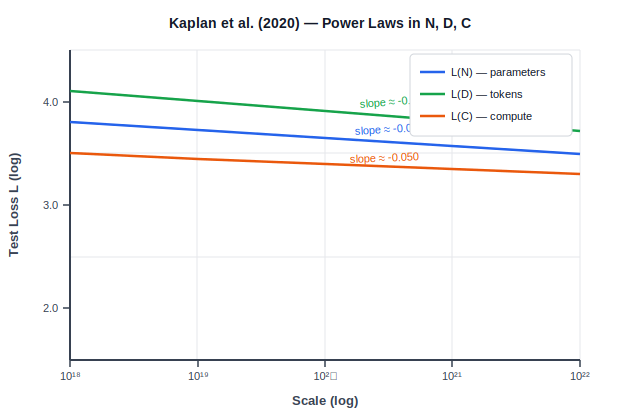
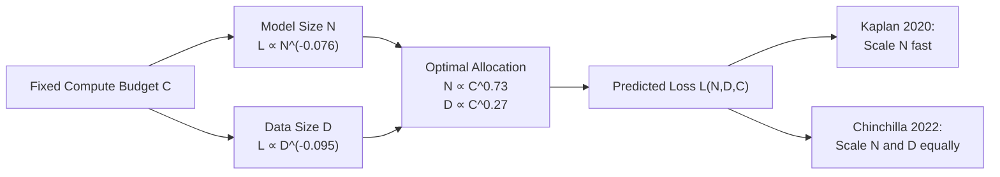
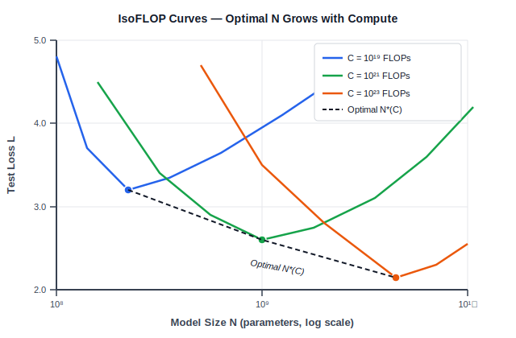

<!-- ============================ TOP NAV ============================ -->
<div align="center">

[🏠 Home](../../README.md) &nbsp;•&nbsp; [📚 Section 3 — Pretraining & Scaling Laws](./README.md) &nbsp;•&nbsp; [⬅️ Q3‑01 — Pretraining Objective](./q01-pretraining-objective.md) &nbsp;•&nbsp; [Q3‑03 — Chinchilla ➡️](./q03-chinchilla.md)

</div>

---

# Q3‑02 · What are neural scaling laws? Explain the Kaplan et al. (2020) findings on parameters, data, and compute

<div align="center">


</div>

> [!IMPORTANT]
> **The 20-second answer.** Kaplan et al. (2020) showed that language model test loss follows **smooth power laws** in three independent variables — model size N (parameters), dataset size D (tokens), and compute C (FLOPs). Double any one while holding the others fixed and loss drops by a predictable, fixed fraction. The exponents are small (around 0.05–0.10), meaning you need roughly **10× more scale** to get each halving of loss. Kaplan's headline recommendation was to scale N much faster than D: given a fixed compute budget, allocate C^0.73 to parameters and only C^0.27 to data. This was later shown to be suboptimal by Chinchilla (Hoffmann et al., 2022), which is the key interview gotcha.

---

## Table of contents

1. [First principles](#1--first-principles)
2. [The problem, told as a story](#2--the-problem-told-as-a-story)
3. [The power law equations, precisely](#3--the-power-law-equations-precisely)
4. [The compute-optimal allocation (Kaplan's rule)](#4--the-compute-optimal-allocation-kaplans-rule)
5. [Geometric intuition](#5--geometric-intuition)
6. [Sample efficiency of large models](#6--sample-efficiency-of-large-models)
7. [Algorithm & pseudocode](#7--algorithm--pseudocode)
8. [Reference implementation](#8--reference-implementation)
9. [Worked numerical example](#9--worked-numerical-example)
10. [Architectural variables that matter little](#10--architectural-variables-that-matter-little)
11. [Cousins & follow-on work](#11--cousins--follow-on-work)
12. [Interview drill](#12--interview-drill)
13. [Common misconceptions](#13--common-misconceptions)
14. [One-screen summary](#14--one-screen-summary)
15. [References](#15--references)

---

## 1 · First principles

A **scaling law** is any relationship of the form

$$L \propto X^{-\alpha}$$

where $L$ is cross-entropy test loss, $X$ is some resource (parameters, tokens, FLOPs), and $\alpha > 0$ is an empirically fitted exponent. On log-log axes this appears as a straight line with slope $-\alpha$.

The central question Kaplan et al. asked was: *if you have a fixed budget, how should you split it between a larger model and more training data?*

Before 2020, practitioners used intuition or ablations. Kaplan et al. fit smooth curves over **five or more orders of magnitude** — from 768-parameter models to 1.5-billion-parameter models, and from 10^18 to ~10^22 FLOPs of compute — and found that loss was surprisingly predictable with no sharp phase transitions.

> [!NOTE]
> **Why this matters for interviews.** Scaling laws let you *forecast* the performance of a model you haven't trained yet. A team at OpenAI could estimate whether training GPT-3 was worth it before spending the compute. This predictability is what transformed scaling from engineering craft into something closer to engineering science.

---

## 2 · The problem, told as a story

Imagine you have a $1M compute budget. You can spend it on:

- **Option A:** Train a 10B-parameter model on 100B tokens.
- **Option B:** Train a 1B-parameter model on 1T tokens.
- **Option C:** Train a 100M-parameter model on 10T tokens.

Before Kaplan et al., you would run small ablations and guess. After Kaplan et al., you fit the power laws on cheap runs (10^18–10^20 FLOPs) and extrapolate to your target budget (10^23 FLOPs). Their fitted exponents tell you that Option A (big model, little data) gives the best loss — which became the philosophy behind GPT-3.

The twist? Hoffman et al. (2022) later showed Kaplan's models were trained for *too few tokens*, biasing the exponent fit toward recommending larger models. Chinchilla showed Option B (equal scaling) was actually optimal. But Kaplan's framework — fit exponents, extrapolate, decide — remains the standard methodology.

<div align="center">

<br><sub><b>Figure 1.</b> Kaplan et al. power laws on log-log axes. Each axis (N parameters, D tokens, C FLOPs) shows a linear relationship with loss — confirming smooth power-law scaling over 5+ orders of magnitude. The slope for D (tokens) is steepest at approximately -0.095; for N (parameters) approximately -0.076; for C (compute) approximately -0.050.</sub>
</div>

---

## 3 · The power law equations, precisely

Kaplan et al. (2020) report three single-variable power laws, each measured while holding the other variables unconstrained (trained to convergence):

**Loss vs. parameters (N):**

$$L(N) \approx \left(\frac{N_c}{N}\right)^{\alpha_N}, \quad \alpha_N \approx 0.076, \quad N_c \approx 8.8 \times 10^{13}$$

**Loss vs. dataset size (D):**

$$L(D) \approx \left(\frac{D_c}{D}\right)^{\alpha_D}, \quad \alpha_D \approx 0.095, \quad D_c \approx 5.4 \times 10^{13}$$

**Loss vs. compute (C):**

$$L(C) \approx \left(\frac{C_c}{C}\right)^{\alpha_C}, \quad \alpha_C \approx 0.050, \quad C_c \approx 3.1 \times 10^8$$

where $N_c$, $D_c$, $C_c$ are fitted scale constants and loss $L$ is measured in nats (natural log cross-entropy). All three relationships hold over many orders of magnitude with high $R^2$ on log-log axes.

**Interpreting the exponents:**

| Exponent | Value | Meaning: to halve loss, multiply scale by... |
|---|---|---|
| $\alpha_N \approx 0.076$ | Small | $2^{1/0.076} \approx 10{,}000\times$ more parameters |
| $\alpha_D \approx 0.095$ | Small | $2^{1/0.095} \approx 1{,}600\times$ more tokens |
| $\alpha_C \approx 0.050$ | Smallest | $2^{1/0.050} \approx 16{,}000\times$ more compute |

The exponents are all less than 0.1, which means scaling is **very hard** — you need enormous resource multipliers to get meaningful loss reductions. This is why trillion-parameter models and trillion-token datasets are needed to push frontiers.

> [!NOTE]
> **Mermaid diagram — the three-variable structure:**



---

## 4 · The compute-optimal allocation (Kaplan's rule)

Each forward + backward pass through an N-parameter transformer on a single token costs approximately $6N$ FLOPs (2 FLOPs per multiply-add, times 3 for forward + backward). Training for $D$ tokens on an $N$-parameter model therefore costs:

$$C \approx 6ND$$

Rearranging for a fixed budget $C$, there is a tradeoff: larger $N$ means smaller $D$ and vice versa. Kaplan et al. fit the compute-efficient frontier by training many models at different $(N, D)$ splits for the same total $C$.

Their result: the compute-optimal model size scales as

$$N^*(C) \propto C^{0.73}$$

$$D^*(C) \propto C^{0.27}$$

This means: **double the compute budget — increase N by a factor of 2^0.73 ≈ 1.66, but increase D by only 2^0.27 ≈ 1.21.** Parameters should grow nearly as fast as total compute; data barely needs to grow at all.

**Why this conclusion follows from the exponents:**

At optimality, the marginal benefit of one more parameter equals the marginal benefit of one more token. Differentiating the joint loss function with respect to the $(N, D)$ split subject to the constraint $C = 6ND$ gives:

$$\frac{dL}{dN} \Big|_{C\text{ fixed}} = 0 \implies \frac{\alpha_N}{\alpha_D} = \frac{D}{N} \cdot \frac{\alpha_N}{\alpha_D}$$

Plugging in Kaplan's exponent ratio $\alpha_N / \alpha_D \approx 0.076/0.095 \approx 0.80$ and the constraint $C = 6ND$ yields the exponents 0.73 and 0.27 above.

<div align="center">

<br><sub><b>Figure 2.</b> IsoFLOP curves: for each fixed compute budget C, loss is a U-shaped function of model size N (tokens D = C / 6N adjusts automatically). The dashed envelope connecting the minima traces N*(C) proportional to C^0.73 per Kaplan et al. As compute C grows by 100×, optimal N grows by approximately 100^0.73 approximately 30×.</sub>
</div>

---

## 5 · Geometric intuition

On log-log axes, a power law $L \propto X^{-\alpha}$ is a **straight line with slope $-\alpha$**. Kaplan's contribution is showing these lines are remarkably straight — no kinks, no saturation — across five-plus orders of magnitude in each variable.

```
log L
  |  \  L(N): slope -0.076
  |   \
  |    \  L(D): slope -0.095
  |     \
  |      \  L(C): slope -0.050
  |       \
  +------------- log X
     10^18  10^22
```

The steeper the slope, the more efficiently that resource reduces loss per unit of investment. The D curve (tokens) has the steepest slope (-0.095), meaning data is the most efficient per unit relative to parameters (-0.076) or total compute (-0.050). However, acquiring more tokens is cheap (web scraping) while adding parameters is expensive (memory bandwidth, hardware), so the practical optimum considers cost too.

---

## 6 · Sample efficiency of large models

One of Kaplan et al.'s less-cited but important findings: **large models are more sample-efficient.** A 10× larger model reaches the same loss as a smaller model using 10× fewer gradient steps.

Formally, the number of training steps $S$ needed to reach a target loss $L^*$ scales as:

$$S^*(N, L^*) \propto N^{-0.77}$$

This means: if you double N, you need only $2^{-0.77} \approx 0.59$ times as many gradient steps to reach the same loss. A 10× larger model needs only about 0.17× as many steps.

**Practical implication:** Training large models for fewer steps is often more compute-efficient than training small models for many steps. Kaplan et al. explicitly recommend stopping training *early* (before convergence) when you have a large model and a fixed compute budget:

> "A larger model trained for fewer steps reaches lower loss than a smaller model trained to convergence on the same compute budget."

This finding was a key motivation for GPT-3 (175B parameters, trained for only ~300B tokens — far from convergence on that parameter count).

> [!WARNING]
> This recommendation assumes you care about loss at a given compute budget, not about per-query inference cost. For deployment, you may prefer a smaller model trained longer, since inference cost scales with N. This tension between training-compute-optimality and inference-compute-optimality is a central theme in Q3-03 (Chinchilla).

---

## 7 · Algorithm & pseudocode

The "algorithm" in scaling law research is the empirical fitting procedure:

```text
===== SCALING LAW FITTING PROCEDURE =====
INPUT : target variable X (N, D, or C), loss metric L
OUTPUT: fitted exponent alpha, scale constant X_c

1.  CHOOSE a range of X values spanning 5+ orders of magnitude
    (e.g. N from 10^6 to 10^9, each factor of ~3x)

2.  FOR each X value:
    a.  Train a model with that X (optimal hyperparams for this scale)
    b.  Evaluate final test loss L(X) on held-out data
    c.  Record (log X, log L)

3.  FIT a linear regression in log-log space:
        log L = -alpha * log X + log(X_c^alpha)
    OLS gives alpha and the intercept

4.  VERIFY the fit:
    a.  Check R^2 > 0.99 on log-log axes
    b.  Check exponent is stable across subsets of the range
    c.  Check predictions hold at held-out X values

5.  EXTRAPOLATE: given a new X_target,
        L_predicted = (X_c / X_target) ^ alpha

===== COMPUTE-OPTIMAL ALLOCATION =====
INPUT : compute budget C_target, exponents alpha_N, alpha_D
OUTPUT: optimal N*, D*

1.  Compute exponent ratio r = alpha_N / (alpha_N + alpha_D)
    # r = 0.076 / (0.076 + 0.095) = 0.445 for Kaplan
    # Note: N exponent = 1 - r = 0.73 comes from budget constraint math

2.  N* = (C_target / 6) ^ (1 - r)   # rough approximation
3.  D* = C_target / (6 * N*)
4.  RETURN N*, D*
```

---

## 8 · Reference implementation

```python
"""
Kaplan et al. (2020) scaling law utilities.

Fits L(N) = (N_c / N)^alpha_N, L(D) = (D_c / D)^alpha_D,
and computes compute-optimal (N*, D*) for a given budget.
"""

import numpy as np
from typing import Tuple


# ── Kaplan et al. (2020) fitted constants ────────────────────────────────────
# arXiv:2001.08361, Table 1 and surrounding text
ALPHA_N = 0.076   # loss exponent for parameters N
ALPHA_D = 0.095   # loss exponent for data D
ALPHA_C = 0.050   # loss exponent for compute C

N_C = 8.8e13      # scale constant for L(N) in nats
D_C = 5.4e13      # scale constant for L(D) in nats
C_C = 3.1e8       # scale constant for L(C) in nats

FLOPS_PER_TOKEN_PER_PARAM = 6.0   # approximate FLOPs: 6ND


def loss_given_params(N: float) -> float:
    """
    Irreducible + power-law loss as a function of parameter count N.
    Returns loss in nats.
    Formula: L(N) = (N_c / N)^alpha_N
    """
    return (N_C / N) ** ALPHA_N


def loss_given_data(D: float) -> float:
    """
    Power-law loss as a function of tokens seen D.
    Formula: L(D) = (D_c / D)^alpha_D
    """
    return (D_C / D) ** ALPHA_D


def loss_given_compute(C: float) -> float:
    """
    Power-law loss as a function of total training FLOPs C.
    Formula: L(C) = (C_c / C)^alpha_C
    """
    return (C_C / C) ** ALPHA_C


def compute_optimal_allocation(C: float) -> Tuple[float, float, float]:
    """
    Kaplan et al. compute-optimal N* and D* for a given budget C FLOPs.

    From the paper: N ∝ C^0.73, D ∝ C^0.27
    Derived from minimising loss subject to C = 6*N*D.

    Args:
        C: total training compute budget in FLOPs

    Returns:
        (N_star, D_star, L_predicted) — optimal model size,
        optimal token count, and predicted loss
    """
    # Kaplan exponents from paper Table 2 / Section 3.4
    n_exponent = 0.73   # N* ~ C^0.73
    d_exponent = 0.27   # D* ~ C^0.27

    # Fitted proportionality constants (approximate, from Fig 4 of the paper)
    # These are rough — the paper gives the exponents more reliably than k_N/k_D
    k_N = 0.003   # N* ≈ k_N * C^0.73   (units: params per FLOP^0.73)
    k_D = 55.0    # D* ≈ k_D * C^0.27   (units: tokens per FLOP^0.27)

    N_star = k_N * (C ** n_exponent)
    D_star = k_D * (C ** d_exponent)

    # Predict loss using L(C) (single-variable estimate)
    L_pred = loss_given_compute(C)

    return N_star, D_star, L_pred


def fit_power_law(
    X: np.ndarray,
    L: np.ndarray
) -> Tuple[float, float, float]:
    """
    Fit L = (X_c / X)^alpha to empirical (X, L) pairs.
    Works in log-log space: log L = -alpha * log X + alpha * log X_c

    Args:
        X: array of scale values (N, D, or C)
        L: array of corresponding test losses

    Returns:
        (alpha, X_c, r_squared)
    """
    log_X = np.log(X)
    log_L = np.log(L)

    # Linear regression: log_L = m * log_X + b
    coeffs = np.polyfit(log_X, log_L, 1)
    m, b = coeffs   # slope m = -alpha, intercept b = alpha * log(X_c)

    alpha = -m
    X_c = np.exp(b / alpha)

    # R^2 in log-log space
    log_L_pred = m * log_X + b
    ss_res = np.sum((log_L - log_L_pred) ** 2)
    ss_tot = np.sum((log_L - np.mean(log_L)) ** 2)
    r_squared = 1.0 - ss_res / ss_tot

    return alpha, X_c, r_squared


def predict_from_law(X_target: float, alpha: float, X_c: float) -> float:
    """
    Extrapolate loss at a new scale X_target given fitted (alpha, X_c).
    """
    return (X_c / X_target) ** alpha


# ── Demo ─────────────────────────────────────────────────────────────────────
if __name__ == "__main__":
    print("=== Kaplan et al. (2020) Scaling Law Demo ===\n")

    # 1. Single-variable predictions
    for label, N in [("GPT-2 small  (117M)", 1.17e8),
                     ("GPT-2 XL    (1.5B)", 1.50e9),
                     ("GPT-3       (175B)", 1.75e11)]:
        L = loss_given_params(N)
        print(f"L(N={label:25s}) = {L:.4f} nats")

    print()

    # 2. Compute-optimal allocation
    for C_exp in [19, 21, 23, 25]:
        C = 10 ** C_exp
        N_opt, D_opt, L_pred = compute_optimal_allocation(C)
        print(
            f"C = 10^{C_exp}: N* = {N_opt:.2e} params, "
            f"D* = {D_opt:.2e} tokens, "
            f"L_pred = {L_pred:.4f}"
        )

    print()

    # 3. Synthetic curve fit demo
    N_vals = np.logspace(6, 10, 20)
    L_vals = (N_C / N_vals) ** ALPHA_N * np.exp(np.random.normal(0, 0.002, 20))
    alpha_fit, N_c_fit, r2 = fit_power_law(N_vals, L_vals)
    print(f"Fit on synthetic data: alpha={alpha_fit:.4f} "
          f"(true={ALPHA_N}), R^2={r2:.5f}")
```

---

## 9 · Worked numerical example

**Setup:** You have a compute budget of $C = 10^{22}$ FLOPs (roughly the budget for a mid-sized 2021-era model).

**Step 1 — Compute-optimal N and D (Kaplan's rule):**

Using $N^* \propto C^{0.73}$ and $D^* \propto C^{0.27}$, with the approximate proportionality constants from the paper:

$$N^* \approx 0.003 \times (10^{22})^{0.73} \approx 0.003 \times 10^{16.06} \approx 3.4 \times 10^{13}$$

That figure is in practice unrealistic (models this large weren't common in 2020). The proportionality constants were fitted for a specific range; extrapolating far outside it requires caution. For a more concrete illustration, let's use the paper's own worked range.

**Step 2 — A realistic example from the paper's range:**

Kaplan et al. report that for $C = 10^{21}$ FLOPs:

- Optimal N ≈ 10^9 (1 billion parameters)
- Optimal D ≈ C / (6N) = 10^21 / (6 × 10^9) ≈ 1.67 × 10^11 ≈ 167 billion tokens

**Step 3 — Predicted loss at N = 10^9:**

$$L(N = 10^9) = \left(\frac{8.8 \times 10^{13}}{10^9}\right)^{0.076} = (8.8 \times 10^4)^{0.076}$$

$$= \exp\!\left(0.076 \times \ln(8.8 \times 10^4)\right) = \exp(0.076 \times 11.39) = \exp(0.866) \approx 2.38 \text{ nats}$$

**Step 4 — What if we double N to 2 × 10^9 instead?**

$$L(2 \times 10^9) = \left(\frac{8.8 \times 10^{13}}{2 \times 10^9}\right)^{0.076} = (4.4 \times 10^4)^{0.076}$$

$$= \exp(0.076 \times \ln(4.4 \times 10^4)) = \exp(0.076 \times 10.69) = \exp(0.813) \approx 2.25 \text{ nats}$$

A 2× increase in N yields $2.38 - 2.25 = 0.13$ nats improvement in loss. Small, but predictable.

**Step 5 — Verify the scaling ratio:**

The ratio of losses should equal $2^{-\alpha_N}$:

$$\frac{L(2N)}{L(N)} = 2^{-\alpha_N} = 2^{-0.076} \approx 0.949$$

Check: $2.25 / 2.38 \approx 0.945$ — close (the small deviation is from rounding $N_c$). The power law holds.

**Summary table:**

| Quantity | Value |
|---|---|
| Compute budget C | 10^21 FLOPs |
| Kaplan-optimal N | ~10^9 parameters |
| Kaplan-optimal D | ~1.67 × 10^11 tokens |
| Predicted L(N=10^9) | ~2.38 nats |
| L improvement from 2× N | ~0.13 nats (-5.5%) |
| Steps to halve loss via N | need ~10,000× more params |

---

## 10 · Architectural variables that matter little

One of the most practically useful Kaplan et al. findings is that, within a reasonable range, architectural choices barely matter compared to total parameter count.

Specifically, the paper shows that for fixed N:

- **Depth vs. width:** a narrow deep transformer and a wide shallow transformer of the same total parameter count reach nearly the same loss. Loss is determined by N, not by the depth/width ratio.
- **Number of attention heads:** varying from 1 to 16 heads at fixed N changes loss by less than 0.1%. Heads matter for other properties (attention pattern diversity) but not raw loss.
- **FFN dimension ratio:** the standard 4× FFN expansion is close to optimal but not critically so; 2× or 8× deviates by < 0.5% in loss at fixed N.

**The practical implication:** When designing a new model, optimize for N (total parameters) and compute efficiency (training speed, memory bandwidth), not for specific architectural ratios. This is why GPT-3, PaLM, and later models all use similar depth/width recipes — they're near-optimal by Kaplan's findings, and fine-tuning the ratio yields little return.

> [!NOTE]
> There is one exception Kaplan et al. note: **context length matters**. Increasing context length beyond ~1K tokens does improve loss, but the improvement is smaller than scaling N or D. This finding motivated later work on long-context models (RoPE, ALiBi, etc.).

---

## 11 · Cousins & follow-on work

| Work | Year | Key finding / relationship to Kaplan |
|---|---|---|
| **Hestness et al.** — *Deep Learning Scaling is Predictable, Empirically* | 2017 | First large-scale empirical scaling study; found power laws in NLP, speech, image. Kaplan et al. built directly on this methodology. |
| **Zoph et al.** — *ST-MoE: Designing Stable and Transferable Sparse Expert Models* | 2022 | Showed sparse MoE models follow similar scaling laws with adjusted effective-N counting. |
| **Hoffmann et al.** — *Training Compute-Optimal LLMs (Chinchilla)* | 2022 | **The correction to Kaplan.** Found the 0.73/0.27 split was wrong because Kaplan's models were undertrained. Chinchilla shows N and D should scale equally: N ∝ C^0.5, D ∝ C^0.5. Trained Chinchilla (70B params, 1.4T tokens) to beat Gopher (280B, 300B tokens) at 4× less compute. |
| **Muennighoff et al.** — *Scaling Data-Constrained Language Models* | 2023 | Extended Chinchilla laws to the data-limited regime where tokens are repeated (epochs > 1). |
| **Biderman et al.** — *Pythia: A Suite for Analyzing Large Language Models* | 2023 | Open-source model suite specifically designed to study scaling laws with public checkpoints. |
| **Clark et al.** — *Unified Scaling Laws for Routed Language Models* | 2022 | Scaling laws for mixture-of-experts architectures. |

---

## 12 · Interview drill

<details>
<summary><b>Q: What is the key finding of Kaplan et al. in one sentence?</b></summary>

Language model test loss follows smooth power laws in model size N, dataset size D, and compute C — each independently — with small exponents around 0.05–0.10, implying you need 10× or more scale to meaningfully reduce loss.
</details>

<details>
<summary><b>Q: Kaplan et al. found alpha_N ≈ 0.076. What does this mean practically?</b></summary>

To halve the test loss purely by scaling parameters, you need N to increase by a factor of 2^(1/0.076) ≈ 10,000. This is why going from GPT-2 (1.5B) to GPT-3 (175B) — a 117× increase — only yielded a modest reduction in raw cross-entropy loss: the exponent is very small. Loss improvements come not from any single scaling leap but from sustained orders-of-magnitude growth over many years.
</details>

<details>
<summary><b>Q: What is the 6ND approximation and why is it useful?</b></summary>

Each forward + backward pass through an N-parameter transformer on a single token costs approximately 6N FLOPs: 2 FLOPs/multiply-add × N parameters × ~1 pass forward + ~2 passes backward (gradient + optimizer). Training for D tokens costs C ≈ 6ND FLOPs total. This linear relationship lets you convert between compute budget and the (N, D) tradeoff without detailed hardware profiling. It is approximate — attention costs scale as O(T^2 d) per layer with sequence length T, which dominates at long contexts — but it is accurate to within 2× for typical transformer configs.
</details>

<details>
<summary><b>Q: How did Chinchilla show Kaplan was wrong, and what was the root cause?</b></summary>

Kaplan et al. trained their models for fewer tokens than necessary to converge — their largest model ran on about 22B tokens. Because small models converge faster, Kaplan's dataset was adequate for small models but left large models undertrained. This made large models look artificially better in the compute-efficient comparison, biasing the fitted exponent toward N^0.73. Hoffmann et al. trained models to actual convergence across sizes, finding equal exponents for N and D (both ~0.5), leading to the Chinchilla recommendation to scale N and D equally. The lesson: scaling law fits are only valid within the training regime used to fit them.
</details>

<details>
<summary><b>Q: Why are the Kaplan exponents small (< 0.1)? What would it mean if they were larger?</b></summary>

The exponents reflect the information-theoretic difficulty of language modeling. Language has enormous entropy — there are many valid continuations of any sentence — so even a perfect model cannot achieve zero loss. The "hard floor" of irreducible loss means that scaling only helps with the reducible component. If the exponents were larger (say, 0.5), each doubling of N would reduce loss by 2^{-0.5} ≈ 29% instead of 2^{-0.076} ≈ 5%. Larger exponents would make scaling much more efficient and the task much easier.
</details>

<details>
<summary><b>Q: What did Kaplan et al. find about architecture (depth vs. width)?</b></summary>

They found that, at fixed total parameter count N, the specific choice of depth-to-width ratio matters little for loss. A 6-layer wide model and a 24-layer narrow model of the same N reach nearly the same final cross-entropy. This result is practically important: it means practitioners should focus optimization effort on total N and compute efficiency (e.g., hardware utilization) rather than architectural search over depth/width ratios. Attention head count similarly has negligible impact on loss at fixed N.
</details>

---

## 13 · Common misconceptions

| Misconception | Reality |
|---|---|
| "Kaplan proved you should always train large models on few tokens." | Kaplan's recommendation was for a *fixed compute budget* when you only care about final loss. For inference efficiency, smaller models trained longer are often better. Chinchilla later showed even for training-compute, the recommendation was wrong. |
| "The power laws have no upper limit — they go on forever." | Kaplan et al. extrapolated but warned the laws may break down at extremely large scale or near irreducible entropy. Post-2022 evidence suggests loss floors emerge, and capabilities don't always scale smoothly with loss. |
| "Kaplan found C ≈ 6ND exactly." | The 6ND formula is an approximation. Real FLOPs depend on architecture details (attention pattern, sequence length, activation functions). For long-context models the attention term (proportional to T^2) can dominate. |
| "alpha_C = 0.050 is smaller than alpha_N because compute is less useful." | alpha_C is a *joint* exponent over the optimal (N, D) allocation; it's not directly comparable to single-variable exponents. When you increase C, you must also optimally increase both N and D, so the joint effect is a composition of both exponents. |
| "All scaling laws use nats; comparing across papers is straightforward." | Loss units vary: nats (natural log), bits (log base 2), bits-per-byte. Always check the paper. Converting: 1 nat = log_2(e) ≈ 1.44 bits. |

---

## 14 · One-screen summary

> **What:** Kaplan et al. (2020) showed language model test loss follows power laws $L \propto X^{-\alpha}$ in model size N, data D, and compute C, with exponents $\alpha_N \approx 0.076$, $\alpha_D \approx 0.095$, $\alpha_C \approx 0.050$.
>
> **Key recommendation:** For a fixed compute budget $C$, scale parameters faster than data: $N \propto C^{0.73}$, $D \propto C^{0.27}$. Large models trained for fewer steps beat small models trained to convergence.
>
> **Why it matters:** Power laws enable extrapolation — you can forecast the performance of a 100B-parameter model from cheap 1B-parameter runs. This turned large-model training from guesswork into engineering.
>
> **The gotcha:** Chinchilla (2022) showed Kaplan's models were undertrained, biasing the exponents. The true compute-optimal allocation is $N \propto C^{0.5}$, $D \propto C^{0.5}$ — scale parameters and data equally.
>
> **Architectural note:** Depth/width ratio and attention head count matter little at fixed N. Focus on total parameter count and compute efficiency.

---

## 15 · References

1. Kaplan, J., McCandlish, S., Henighan, T., Brown, T. B., Chess, B., Child, R., Gray, S., Ryder, N., Voss, C., Amodei, D. — **Scaling Laws for Neural Language Models**. *arXiv:2001.08361, 2020.* — the primary source; reports alpha_N=0.076, alpha_D=0.095, alpha_C=0.050 and the N∝C^0.73 recommendation.

2. Hoffmann, J., Borgeaud, S., Mensch, A., Buchatskaya, E., Cai, T., Rutherford, E., Casas, D. de L., Hendricks, L. A., Welbl, J., Clark, A. et al. — **Training Compute-Optimal Large Language Models (Chinchilla)**. *arXiv:2203.15556, 2022.* — corrects Kaplan: shows equal scaling of N and D; trains Chinchilla-70B to beat Gopher-280B at 4× less compute.

3. Hestness, J., Narang, S., Ardalani, N., Diamos, G., Jun, H., Kianinejad, H., Patwary, M. M. A., Yang, Y., Zhou, Y. — **Deep Learning Scaling is Predictable, Empirically**. *arXiv:1712.00409, 2017.* — first systematic empirical scaling study across NLP, speech, and vision; foundational to Kaplan's methodology.

4. Zoph, B., Bello, I., Kumar, S., Du, N., Huang, C., Dean, J., Shazeer, N., Le, Q. V. — **ST-MoE: Designing Stable and Transferable Sparse Expert Models**. *arXiv:2202.08906, 2022.* — shows sparse MoE architectures obey scaling laws similar to dense models when N is measured as active parameters.

5. Muennighoff, N., Rush, A., Barak, B., Scao, T. L., Tazi, N., Piktus, A., Pyysalo, S., Wolf, T., Raffel, C. — **Scaling Data-Constrained Language Models**. *arXiv:2305.16264, 2023.* — extends Chinchilla to repeated-data regimes; shows diminishing returns from repeating tokens beyond 4 epochs.

6. Biderman, S., Schoelkopf, H., Anthony, Q., Bradley, H., O'Brien, K., Hallahan, E., Khan, M. A., Purohit, S., Prashanth, U. S., Raff, E., Skowron, A., Sutawika, L., van der Wal, O. — **Pythia: A Suite for Analyzing Large Language Models Across Training and Scaling**. *arXiv:2304.01373, 2023.* — open-source scaling suite releasing all checkpoints for reproducibility.

7. Clark, A., de las Casas, D., Guy, A., Mensch, A., Paganini, M., Hoffmann, J., Damoc, B., Hechtman, B., Cai, T., Borgeaud, S. et al. — **Unified Scaling Laws for Routed Language Models**. *arXiv:2202.01169, 2022.* — derives scaling laws for mixture-of-experts models.

8. Bahri, Y., Dyer, E., Kaplan, J., Lee, J., Sharma, U. — **Explaining Neural Scaling Laws**. *arXiv:2102.06701, 2021.* — theoretical analysis deriving power-law exponents from the spectral properties of the data manifold.

9. Wei, J., Tay, Y., Bommasani, R., Raffel, C., Zoph, B., Borgeaud, S., Yogatama, D., Bosma, M., Zhou, D., Metzler, D., Chi, E. H., Hashimoto, T., Vinyals, O., Liang, P., Dean, J., Fedus, W. — **Emergent Abilities of Large Language Models**. *arXiv:2206.07682, 2022.* — documents capabilities that appear sharply at scale rather than smoothly, challenging naive power-law extrapolation.

10. Brown, T. B., Mann, B., Ryder, N., Subbiah, M., Kaplan, J., Dhariwal, P., Neelakantan, A., Shyam, P., Sastry, G., Askell, A. et al. — **Language Models are Few-Shot Learners (GPT-3)**. *arXiv:2005.14165, 2020.* — applies Kaplan's scaling recommendations to justify training a 175B-parameter model on ~300B tokens (far from convergence by Chinchilla standards).

---

<!-- ============================ BOTTOM NAV ============================ -->
<div align="center">

[⬅️ Q3‑01 — Pretraining Objective](./q01-pretraining-objective.md) &nbsp;|&nbsp; [📚 Back to Section 3](./README.md) &nbsp;|&nbsp; [🏠 Home](../../README.md) &nbsp;|&nbsp; [Q3‑03 — Chinchilla ➡️](./q03-chinchilla.md)

<sub>Found an error or have a sharper intuition? See <a href="../../CONTRIBUTING.md">CONTRIBUTING</a> — answers follow the <a href="../../_TEMPLATE.md">answer template</a>.</sub>

</div>
