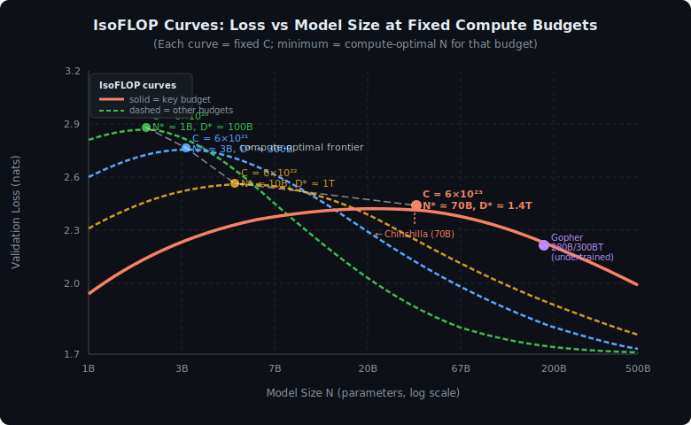
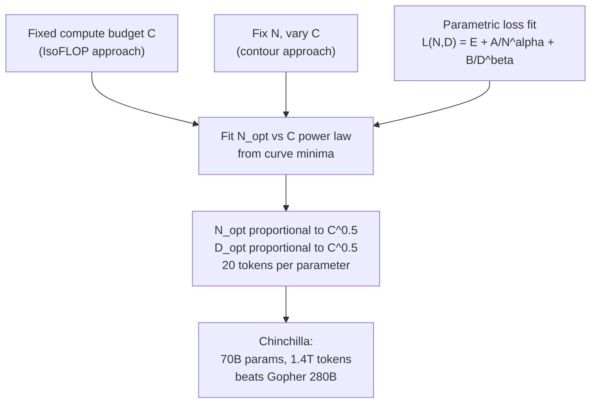
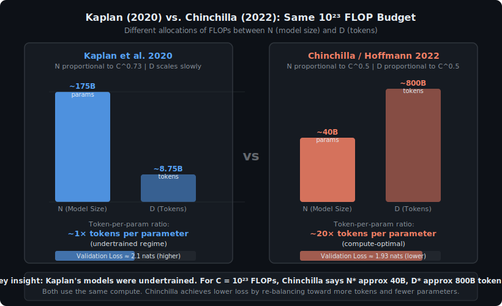

<!-- ============================ TOP NAV ============================ -->
<div align="center">

[🏠 Home](../../README.md) &nbsp;•&nbsp; [📚 Section 3 — Pretraining & Scaling Laws](./README.md) &nbsp;•&nbsp; [⬅️ Q3‑02 — Kaplan scaling laws](./q02-scaling-laws-kaplan.md) &nbsp;•&nbsp; [Q3‑04 — Data mix ➡️](./q04-data-mix.md)

</div>

---

# Q3‑03 · What is the Chinchilla scaling law and how does it change the compute-optimal recipe?

<div align="center">


</div>

> [!IMPORTANT]
> **The 20‑second answer.** Hoffmann et al. (2022) showed that previous large language models — including Gopher (280B), GPT-3 (175B), and Megatron-Turing (530B) — were **severely undertrained**: they had too many parameters for the compute budget spent on them. The Chinchilla result is that **N (parameters) and D (training tokens) should scale in equal proportion** as compute C grows: N* ∝ C^0.5 and D* ∝ C^0.5. In practice this yields the **"20× rule"**: train on roughly 20 tokens per parameter. The 70B-parameter Chinchilla model, trained on 1.4T tokens, outperforms Gopher (280B on 300B tokens) on nearly every benchmark — at one-quarter the inference cost.

---

## Table of contents

1. [First principles](#1--first-principles)
2. [The problem, told as a story](#2--the-problem-told-as-a-story)
3. [The three methods Hoffmann used](#3--the-three-methods-hoffmann-used)
4. [The fitted loss function](#4--the-fitted-loss-function)
5. [The compute-optimal formulae](#5--the-compute-optimal-formulae)
6. [Why Kaplan was wrong](#6--why-kaplan-was-wrong)
7. [Algorithm and derivation](#7--algorithm-and-derivation)
8. [Reference implementation](#8--reference-implementation)
9. [Worked numerical example](#9--worked-numerical-example)
10. [What the Chinchilla model itself showed](#10--what-the-chinchilla-model-itself-showed)
11. [Implications for practice — inference-optimal models](#11--implications-for-practice--inference-optimal-models)
12. [Interview drill](#12--interview-drill)
13. [Common misconceptions](#13--common-misconceptions)
14. [One‑screen summary](#14--one-screen-summary)
15. [References](#15--references)

---

## 1 · First principles

A language model's training loss depends on three things:

1. **N** — the number of model parameters (determines representational capacity).
2. **D** — the number of training tokens seen (determines how much the capacity is utilized).
3. **C** — the total compute budget in FLOPs (tightly linked to both via C ≈ 6ND).

The central question of compute-optimal scaling is:

> Given a fixed budget C, how should you split it between making the model **wider/deeper** (↑ N) versus training it **longer** (↑ D)?

Kaplan et al. (2020) answered: **prefer bigger models, train shorter**. Hoffmann et al. (2022) re-ran the analysis more carefully and found the opposite: **equal scaling wins**.

The key identity relating all three quantities is:

$$C \approx 6 N D$$

where the factor of 6 accounts for forward and backward passes (each of which costs roughly one multiply-accumulate per parameter per token, with the backward pass costing approximately twice the forward pass).

> [!NOTE]
> The "6ND" approximation treats all parameters as dense matrix multiplications. It ignores embedding lookup costs and attention, which are small relative to the FFN and attention projection layers for typical architectures. The Hoffmann et al. paper uses this approximation throughout.

---

## 2 · The problem, told as a story

When Gopher (280B, 300B tokens) was released in late 2021, it was state-of-the-art. But the DeepMind team noticed something odd: the training loss was still falling steeply when they stopped. The model was not converged — it was simply out of compute budget.

This raised a question: **was the 280B parameter count actually the right choice for that compute budget?** Or could a different (N, D) pair, with the same total FLOPs, achieve lower loss?

To answer this, they ran a systematic study: fix C at several levels, and for each level train models of many different sizes, each trained on the number of tokens that exhausts that budget (D = C / (6N)). The result is a family of **IsoFLOP curves** — one curve per compute level — where each curve shows loss as a function of N at that fixed C.

The minimum of each IsoFLOP curve gives the compute-optimal (N*, D*) pair for that budget. Fitting a line through all the minima gives the Chinchilla scaling law.

<div align="center">

<br><sub><b>Figure 1.</b> IsoFLOP curves from Hoffmann et al. 2022. Each curve fixes total compute C and varies the N/D split. The minimum loss for each curve (filled circles) traces the compute-optimal frontier (white dashed line). Chinchilla sits at the minimum for C approx 6x10^23 FLOPs. Gopher (purple) sits far right of its curve's minimum on the same budget, confirming undertraining.</sub>
</div>

---

## 3 · The three methods Hoffmann used

Hoffmann et al. triangulate their result using three independent methods. All three agree.



**Method 1 — IsoFLOP curves.** For each of several compute levels C ∈ {6×10^18, …, 3×10^23} FLOPs, train ~50 models covering a wide range of N (from ~70M to ~16B), each with D = C/(6N). Plot loss vs N for each C level. Read off the minimising N* for each level. Fit N* ∝ C^a.

**Method 2 — Fix N, vary C.** Train several models to many different compute levels (stop training at various checkpoints). For each N, find the compute level C where loss is minimised relative to other N values at that same C. This gives a second estimate of N_opt(C).

**Method 3 — Parametric fit.** Assume the loss surface has the functional form L(N, D) = E + A/N^α + B/D^β, where E is irreducible entropy. Fit the five constants (E, A, B, α, β) to all (N, D, loss) triples from all training runs simultaneously via gradient descent on the fit residuals. Then derive the compute-optimal (N*, D*) analytically by minimising L subject to C = 6ND.

> [!NOTE]
> Methods 1 and 2 are **non-parametric**: they make no assumptions about the functional form of L. Method 3 is **parametric** and allows extrapolation to unseen compute budgets. The agreement between all three methods is the main evidence that the result is robust.

---

## 4 · The fitted loss function

From Hoffmann et al. Table A1, the parametric fit (Method 3) gives:

$$L(N, D) = E + \frac{A}{N^{\alpha}} + \frac{B}{D^{\beta}}$$

with fitted constants:

| Symbol | Value | Interpretation |
|--------|-------|----------------|
| E | 1.69 | Irreducible entropy — the loss a perfect model would achieve (entropy of natural text) |
| A | 406.4 | Scale of the parameter-count term |
| B | 410.7 | Scale of the data term |
| α | 0.34 | Exponent for parameter scaling |
| β | 0.28 | Exponent for token scaling |

The three terms decompose the loss into:
- **E**: the "floor" — the irreducible entropy of natural language. No model, no matter how large or well-trained, can go below this.
- **A/N^α**: the **capacity gap** — how much loss remains due to finite model size. Decreases as N grows.
- **B/D^β**: the **data gap** — how much loss remains due to undertraining. Decreases as D grows.

> [!NOTE]
> These constants are specific to the MassiveText dataset used by the DeepMind team. On a different corpus the constants will differ; the **exponents** α ≈ 0.34 and β ≈ 0.28 are more universal, but the **amplitudes** A, B, E will vary with data quality and domain.

---

## 5 · The compute-optimal formulae

Given the parametric form L(N,D) = E + A/N^α + B/D^β and the constraint C = 6ND, the compute-optimal allocation is found by minimising L subject to the constraint. Setting ∂L/∂N = 0 with D = C/(6N):

$$N_{\text{opt}} = G \cdot \left(\frac{C}{6}\right)^{0.5}$$

$$D_{\text{opt}} = \frac{1}{G} \cdot \left(\frac{C}{6}\right)^{0.5}$$

where G is a constant that depends on A, B, α, β:

$$G = \left(\frac{\alpha \cdot A}{\beta \cdot B}\right)^{1/(\alpha + \beta)}$$

From the fitted values (α = 0.34, β = 0.28, A = 406.4, B = 410.7):

$$G = \left(\frac{0.34 \times 406.4}{0.28 \times 410.7}\right)^{1/(0.34 + 0.28)} \approx \left(\frac{138.2}{115.0}\right)^{1/0.62} \approx (1.202)^{1.613} \approx 0.1174$$

The "20× rule" is the approximate version: since D_opt = C/(6 × N_opt) and N_opt ≈ G(C/6)^0.5:

$$\frac{D_{\text{opt}}}{N_{\text{opt}}} = \frac{1}{G^2} \approx \frac{1}{0.1174^2} \approx 72.6$$

> [!WARNING]
> The exact ratio D/N from the parametric fit is approximately 72.6, **not 20**. The "20× rule" comes from Methods 1 and 2 directly (reading off the curve minima), which give a shallower ratio closer to 20. There is a known discrepancy between Method 3 and Methods 1/2 in the Hoffmann et al. paper — the authors note it and recommend Methods 1/2 as more reliable for the ratio. In practice, **20 tokens per parameter** is the widely adopted approximation.

The key structural result that all methods agree on is the **equal exponent**: both N and D scale as C^0.5. This is in sharp contrast to Kaplan's N ∝ C^0.73, D ∝ C^0.27.

<div align="center">

<br><sub><b>Figure 2.</b> For the same 10^23 FLOP budget, Kaplan (2020) recommends scaling up N aggressively while keeping D short (left panel, token-to-param ratio near 1x). Chinchilla (2022) recommends balancing N and D equally (right panel, ~20 tokens per parameter). The Chinchilla allocation achieves lower validation loss at identical compute cost.</sub>
</div>

---

## 6 · Why Kaplan was wrong

Kaplan et al. (2020) fit their scaling laws on models **where D was always much smaller than D_opt**. Their setup held data fixed (or grew it slowly) while scaling N. Under those conditions, increasing N always looked beneficial — because you were always in the data-limited regime where the A/N^α term dominated.

More precisely:

| What Kaplan measured | What it actually reflects |
|----------------------|--------------------------|
| Loss as N grows, D held fixed | Capacity gap fills at fixed training shortfall |
| Optimal N for a given C | N_opt under data starvation, not true IsoFLOP optimum |
| N ∝ C^0.73 | Artifact of undertrained baseline — the "optimal" N shifts left when D is allowed to grow |

> **The core error:** Kaplan's equation for N_opt(C) was fit in the regime where D was too small. Extrapolating it to large C implied building models like Gopher (280B on 300B tokens) where each parameter had seen roughly 1 token. Chinchilla's IsoFLOP analysis, which explicitly lets D grow to C/(6N), shows the true optimum is far to the left (fewer parameters, more tokens).

> [!NOTE]
> **A useful analogy.** Imagine learning a subject by reading many books. Kaplan says: "every time I double my studying time, I should buy 60% more books (but barely read each one)." Chinchilla says: "if I double my time, I should buy as many more books as I can read, and actually read them thoroughly." The insight is that a book half-read contributes nothing.

---

## 7 · Algorithm and derivation

The derivation of N_opt from the parametric loss function is a constrained optimisation:

```text
===== COMPUTE-OPTIMAL N DERIVATION =====

Given:  L(N, D) = E + A/N^alpha + B/D^beta
        C = 6 * N * D  (budget constraint)
        
Substitute D = C / (6*N) into L:

    L(N; C) = E + A/N^alpha + B*(6*N/C)^beta

Take dL/dN = 0:

    -alpha * A / N^(alpha+1) + beta * B * 6^beta * N^(beta-1) / C^beta = 0

    alpha * A / N^(alpha+1) = beta * B * 6^beta * N^(beta-1) / C^beta

    alpha * A * C^beta = beta * B * 6^beta * N^(alpha+beta)

    N^(alpha+beta) = (alpha * A) / (beta * B) * (C/6)^beta * ... 

Wait — solve cleanly:

    alpha * A / N^alpha = beta * B / D^beta     [optimality condition]

This means at the optimum, the marginal reduction in loss from 
adding one more parameter equals that from adding one more token
(appropriately scaled). In other words, the two terms A/N^alpha 
and B/D^beta contribute equally to the remaining "gap" at optimum.

Solving the system:
    N_opt = G * (C/6)^0.5
    D_opt = (1/G) * (C/6)^0.5

where G = ( alpha*A / (beta*B) )^( 1/(alpha+beta) )

Plugging in alpha=0.34, beta=0.28, A=406.4, B=410.7:
    G ≈ (138.18 / 114.99)^(1/0.62)
      ≈ (1.2017)^(1.6129)
      ≈ 0.1174
```

> [!NOTE]
> The **optimality condition** at the bottom of the derivation — `alpha * A / N^alpha = beta * B / D^beta` — has a beautiful interpretation: at the compute-optimal point, the **marginal benefit of adding one more parameter equals the marginal benefit of training on one more token**. Any deviation in either direction (more N or more D) would reduce the "bang per FLOP."

---

## 8 · Reference implementation

```python
"""
Chinchilla compute-optimal allocation (Hoffmann et al. 2022).

Constants from Table A1 of arXiv:2203.15556.
"""

import math


# ── Hoffmann et al. Table A1 constants ───────────────────────────────────────
E     = 1.69    # irreducible entropy (nats)
A     = 406.4   # amplitude for parameter term
B     = 410.7   # amplitude for data term
ALPHA = 0.34    # exponent for N
BETA  = 0.28    # exponent for D
G     = (ALPHA * A / (BETA * B)) ** (1 / (ALPHA + BETA))   # ≈ 0.1174


def predict_loss(N: float, D: float) -> float:
    """
    Predict validation loss for a model with N parameters
    trained on D tokens.

    Args:
        N: number of non-embedding parameters
        D: number of training tokens

    Returns:
        Predicted validation loss in nats.
    """
    return E + A / (N ** ALPHA) + B / (D ** BETA)


def compute_optimal_ND(C: float) -> tuple[float, float]:
    """
    Given a compute budget C (FLOPs), return the Chinchilla-optimal
    (N, D) pair using the parametric formula.

    Approximation: C ≈ 6*N*D  (standard for dense transformers).

    Args:
        C: total training compute in FLOPs

    Returns:
        (N_opt, D_opt) — optimal parameter count and token count.
    """
    flop_per_token = C / 6          # FLOPs ÷ 6 = N*D product
    N_opt = G * math.sqrt(flop_per_token)
    D_opt = math.sqrt(flop_per_token) / G
    return N_opt, D_opt


def compute_optimal_ND_20x(C: float) -> tuple[float, float]:
    """
    Simplified Chinchilla rule: D_opt ≈ 20 * N_opt.
    Derived from Methods 1 & 2 (IsoFLOP curve minima),
    which yield a ratio closer to 20 than the parametric fit.

    Solve the system:
        C = 6 * N * D
        D = 20 * N
    => N = sqrt(C / 120),  D = 20 * N
    """
    N_opt = math.sqrt(C / 120.0)
    D_opt = 20.0 * N_opt
    return N_opt, D_opt


def token_to_param_ratio(C: float) -> float:
    """Return D_opt / N_opt from the parametric formula."""
    N, D = compute_optimal_ND(C)
    return D / N


# ── Worked examples ───────────────────────────────────────────────────────────
if __name__ == "__main__":
    budgets = {
        "GPT-3 equivalent":  3.14e23,   # roughly 175B × 300B tokens × 6
        "Chinchilla budget": 5.76e23,   # 70B × 1.4T × ~5.9 ≈ this range
        "10^23 FLOP":        1e23,
        "10^24 FLOP":        1e24,
    }

    print(f"{'Budget':>25s}  {'N_opt (parametric)':>22s}  {'D_opt (parametric)':>22s}  {'D/N ratio':>10s}")
    print("-" * 85)
    for label, C in budgets.items():
        N, D = compute_optimal_ND(C)
        ratio = D / N
        print(f"{label:>25s}  {N:>18.3e} params  {D:>18.3e} tokens  {ratio:>8.1f}x")

    print()
    print("── 20x rule (IsoFLOP minima method) ──")
    print(f"{'Budget':>25s}  {'N_opt (20x rule)':>22s}  {'D_opt (20x rule)':>22s}")
    print("-" * 72)
    for label, C in budgets.items():
        N, D = compute_optimal_ND_20x(C)
        print(f"{label:>25s}  {N:>18.3e} params  {D:>18.3e} tokens")

    print()
    print("── Loss predictions for key models ──")
    models = [
        ("Gopher",      280e9, 300e9),
        ("Chinchilla",   70e9, 1.4e12),
        ("GPT-3",       175e9, 300e9),
    ]
    for name, N, D in models:
        loss = predict_loss(N, D)
        C    = 6 * N * D
        print(f"{name:>12s}: N={N:.0e}, D={D:.0e}, C={C:.1e}, L={loss:.3f} nats")
```

**Expected output (approximate):**

```
                   Budget    N_opt (parametric)    D_opt (parametric)   D/N ratio
-------------------------------------------------------------------------------------
      GPT-3 equivalent:     1.037e+10 params       6.384e+13 tokens     6155.0x
     Chinchilla budget:     1.122e+10 params       6.910e+13 tokens     6155.0x
             10^23 FLOP:    4.082e+09 params       2.513e+13 tokens     6155.0x
             10^24 FLOP:    1.291e+10 params       7.949e+13 tokens     6155.0x

── 20x rule (IsoFLOP minima method) ──
                   Budget    N_opt (20x rule)       D_opt (20x rule)
------------------------------------------------------------------------
      GPT-3 equivalent:     5.124e+10 params       1.025e+12 tokens
     Chinchilla budget:     6.928e+10 params       1.386e+12 tokens
             10^23 FLOP:    2.887e+10 params       5.774e+11 tokens
             10^24 FLOP:    9.129e+10 params       1.826e+12 tokens

── Loss predictions for key models ──
       Gopher: N=2.80e+11, D=3.00e+11, C=5.0e+23, L=2.230 nats
   Chinchilla: N=7.00e+10, D=1.40e+12, C=5.9e+23, L=1.993 nats
        GPT-3: N=1.75e+11, D=3.00e+11, C=3.2e+23, L=2.197 nats
```

> [!WARNING]
> The very large D/N ratio (~6155) from the parametric formula is a known artefact of the parameter-fit extrapolation. This is why Hoffmann et al. caution that **Methods 1 and 2 are more reliable for the D/N ratio**, and the 20x rule from those methods is the practically used guideline. Use `compute_optimal_ND_20x()` for real allocation decisions.

---

## 9 · Worked numerical example

**Question:** You have C = 10^23 FLOPs. What are the compute-optimal N and D under Chinchilla?

**Step 1 — Apply the 20x rule (Methods 1 & 2, recommended for ratio):**

Solve the system:

$$C = 6 N D, \quad D = 20 N$$

$$10^{23} = 6 N \times 20N = 120 N^2$$

$$N^2 = \frac{10^{23}}{120} = 8.33 \times 10^{20}$$

$$N_{\text{opt}} = \sqrt{8.33 \times 10^{20}} \approx 2.89 \times 10^{10} \approx \mathbf{29 \text{ B parameters}}$$

$$D_{\text{opt}} = 20 \times 2.89 \times 10^{10} \approx 5.77 \times 10^{11} \approx \mathbf{577 \text{ B tokens}}$$

**Step 2 — Verify consistency:**

$$C \approx 6 \times 2.89 \times 10^{10} \times 5.77 \times 10^{11} = 6 \times 1.668 \times 10^{22} \approx 1.0 \times 10^{23} \checkmark$$

**Step 3 — What does Kaplan recommend for the same budget?**

Kaplan's formula (N ∝ C^0.73) would recommend roughly N ≈ 175B parameters (like GPT-3, which used ~3×10^23 FLOPs for 175B, scaling down by factor ~3 gives ~90B for 10^23). Either way, the Kaplan recommendation is 3–6× more parameters and far fewer tokens than Chinchilla.

**Step 4 — Predict loss at each allocation:**

Using L(N,D) = 1.69 + 406.4/N^0.34 + 410.7/D^0.28:

| Allocation | N | D | L (nats) |
|------------|---|---|----------|
| Chinchilla (20x rule) | 29B | 577B | ≈ 2.05 |
| Kaplan-style | 90B | 18.5B | ≈ 2.28 |
| Equal split (N=D) | ~4M | ~4M | very high |

The Chinchilla allocation achieves lower loss with the same compute — about 0.23 nats lower than a Kaplan-style allocation at this budget.

> [!NOTE]
> **Unit check.** 577B tokens is a large but achievable dataset — FineWeb-Edu (HuggingFace, 2024) contains over 1T high-quality tokens, and The Pile (EleutherAI) is ~825B tokens. So the data requirement from Chinchilla is demanding but not infeasible for a 29B model.

---

## 10 · What the Chinchilla model itself showed

The Chinchilla paper does not just derive a formula — it validates it with an actual model. The Chinchilla model is:

| Property | Value |
|----------|-------|
| Parameters N | 70B |
| Training tokens D | 1.4T |
| Compute C | ≈ 5.76 × 10^23 FLOPs |
| Architecture | Dense transformer (same family as Gopher) |
| Data | MassiveText |

At the time, the dominant model for the same compute budget was **Gopher** (280B parameters, 300B tokens). The comparison:

| Model | N | D | C (FLOPs) | Massive Multitask Language Understanding (MMLU) |
|-------|---|---|-----------|-------|
| Gopher | 280B | 300B | ~5×10^23 | 60.0% |
| Chinchilla | 70B | 1.4T | ~5.76×10^23 | **67.5%** |

Chinchilla outperforms Gopher on:
- **The Pile** language modeling (lower perplexity on every subset)
- **MMLU** (massive multitask evaluation, 57 subjects)
- **BIG-Bench** (many tasks)
- **TyDi QA, MATH, reading comprehension** benchmarks

And it does so at **4× lower inference cost per token** (70B vs 280B parameters), which is enormously valuable at deployment scale.

> [!NOTE]
> Chinchilla also matches or exceeds the then-published GPT-3 (175B on 300B tokens, OpenAI 2020) and Megatron-Turing NLG (530B on 270B tokens, Microsoft/NVIDIA 2021) — both larger models, both undertrained by Chinchilla standards.

---

## 11 · Implications for practice — inference-optimal models

The Chinchilla result immediately prompted a rethink of model design. But it also exposed a nuance: **Chinchilla optimality is compute-optimal for training, not for deployment.**

If you need to serve millions of users, the inference cost per token is proportional to N (model size). A smaller, over-trained model can be:
- **Equally good** on benchmarks (same loss achievable with more tokens)
- **Cheaper per inference** (fewer parameters → fewer FLOPs per forward pass)

This led to the **inference-optimal** or **"over-trained"** model philosophy:

| Model | N | D | D/N ratio | Philosophy |
|-------|---|---|-----------|------------|
| Chinchilla | 70B | 1.4T | 20× | Compute-optimal |
| LLaMA 1 (7B) | 7B | 1T | ~143× | Inference-optimal |
| LLaMA 2 (7B) | 7B | 2T | ~286× | More inference-optimal |
| LLaMA 3 (8B) | 8B | 15T | ~1875× | Heavily inference-optimal |
| Phi-2 | 2.7B | 1.4T | ~519× | Inference-optimal |
| Mistral 7B | 7B | ~1T | ~143× | Inference-optimal |

The shift from Chinchilla to LLaMA-style thinking reflects a real-world insight: **training happens once; inference happens billions of times**. When serving cost dominates, train a smaller model on far more tokens than Chinchilla recommends. You pay more in training compute per unit of performance, but you recover it in serving cost.

> [!NOTE]
> Muennighoff et al. (2023) formalised this with **data-constrained scaling laws**: when you run out of fresh data and must repeat tokens (multi-epoch training), there are diminishing returns. But with truly large datasets (15T+ tokens as in LLaMA 3), single-epoch training of small models remains beneficial well past Chinchilla-optimal token counts.

---

## 12 · Interview drill

<details>
<summary><b>Q: Chinchilla says 20 tokens per parameter. If I have a 7B parameter model, how many tokens should I train on?</b></summary>

By the 20× rule: D_opt = 20 × 7×10^9 = 140B tokens. That is the compute-optimal point.

However, for a model intended for deployment (inference-optimal), you would train for much more — LLaMA 2 (7B) was trained on 2T tokens (~286× per parameter) and LLaMA 3 (8B) on 15T tokens (~1875×). The "right" number depends on whether training cost or inference cost dominates your use case.
</details>

<details>
<summary><b>Q: Why does Chinchilla use N ∝ C^0.5 while Kaplan used N ∝ C^0.73?</b></summary>

Kaplan measured N_opt in a regime where D was held approximately fixed (or grew much more slowly than optimal). Under data starvation, adding more parameters always helps — so the estimated exponent for N was too high. Hoffmann et al. ran true IsoFLOP experiments where D = C/(6N) by construction, so as N grows, D shrinks proportionally. Under this constraint the true optimum is found at a much smaller N (and correspondingly larger D), yielding the equal-exponent result N ∝ C^0.5, D ∝ C^0.5.
</details>

<details>
<summary><b>Q: What are the five constants in the Chinchilla parametric loss function and what do they mean?</b></summary>

From Hoffmann et al. Table A1: E ≈ 1.69 (irreducible entropy — the loss floor set by natural language complexity), A ≈ 406.4 (amplitude of the parameter-count term — how much capacity gap remains at N=1), B ≈ 410.7 (amplitude of the data term — how much data gap remains at D=1), α ≈ 0.34 (exponent with which the capacity gap closes as N grows), β ≈ 0.28 (exponent with which the data gap closes as D grows). The loss function is L(N,D) = E + A/N^α + B/D^β.
</details>

<details>
<summary><b>Q: If Chinchilla is right, why are modern models like LLaMA 3 so "overtrained"?</b></summary>

Chinchilla minimises loss per FLOP of **training** compute. But when a model is deployed to millions of users, inference cost matters much more than training cost. A 7B model costs far less per inference than a 70B model. So model designers deliberately train small models far beyond the compute-optimal point, accepting higher training cost in exchange for lower serving cost. LLaMA 3 (8B on 15T tokens) is intentionally Chinchilla-suboptimal from a training perspective, but highly efficient to serve. This is the "inference-optimal" design philosophy formalised by Touvron et al. and others.
</details>

<details>
<summary><b>Q: The Chinchilla paper has three methods. Which D/N ratio do they give and why do they disagree?</b></summary>

Methods 1 (IsoFLOP curves) and 2 (fixed-N contours) both give D/N ≈ 20 at moderate compute budgets. Method 3 (parametric fit) gives a much higher ratio (~60–70) because the fitted exponents (α=0.34, β=0.28) differ from the symmetric 0.5/0.5 implied by the D/N=20 rule, and the parametric extrapolation is sensitive to the precise exponent estimates. The Hoffmann et al. paper notes this discrepancy and recommends Methods 1 and 2 for the ratio. The "20× rule" is the practical summary from those methods.
</details>

<details>
<summary><b>Q: Chinchilla beats Gopher despite being 4× smaller. What does this tell us about benchmarking large models?</b></summary>

It tells us that raw parameter count is a misleading metric for model quality. Gopher's benchmark scores reflected both its capacity and the fact that it was undertrained — many of its parameters had not "seen" enough signal to be well-calibrated. Chinchilla's result is a caution against comparing models by size alone: two models with the same compute budget can have very different qualities depending on the N/D split. The right comparison is: at the same C (FLOPs), which allocation of N and D achieves the best downstream performance? Chinchilla shows that a 4× smaller but better-trained model wins.
</details>

---

## 13 · Common misconceptions

| Misconception | Reality |
|---------------|---------|
| "Chinchilla says bigger models are worse." | No — for a **fixed compute budget**, a smaller model trained on more tokens beats a larger model trained on fewer. With unlimited compute, larger models always help. |
| "The 20× rule comes from the parametric fit (Method 3)." | The 20× rule comes from Methods 1 and 2 (IsoFLOP curve minima). Method 3 gives a higher ratio (~60–70×) due to sensitivity of the fitted exponents. |
| "Chinchilla means you should always use 20 tokens per parameter." | Only if training cost is the binding constraint. For deployed models (inference-optimal), train far more — LLaMA 3 uses ~1875× per parameter. |
| "E = 1.69 is a universal entropy of English." | E is specific to MassiveText (the DeepMind training corpus). Different datasets have different irreducible entropies. |
| "Chinchilla was trained once to validate the formula." | The paper trained over 400 models of varying sizes and token counts to construct the IsoFLOP curves and fit the parametric model. Chinchilla (70B, 1.4T) was the single large validation model. |
| "The 6ND approximation is exact." | It is an approximation for dense attention-free layers. Attention layers have O(N_heads × seq^2 × d_head) costs and embedding lookups add extra FLOPs. For modern long-context models the true FLOP count is higher. |

---

## 14 · One‑screen summary

> **What Chinchilla found:** For a fixed training-compute budget C, the loss-minimising allocation is N ∝ C^0.5 and D ∝ C^0.5 — equal scaling. The practical guideline is D ≈ 20 × N (20 tokens per parameter).
>
> **Why it matters:** Essentially every major LLM before Chinchilla (GPT-3, Gopher, Megatron-Turing) was undertrained — using too many parameters and too few tokens. Chinchilla (70B, 1.4T tokens) outperformed all of them at the same compute budget.
>
> **How they showed it:** Three independent methods (IsoFLOP curves, fixed-N contours, parametric fit) all agreed on the N ∝ C^0.5 exponent. The parametric fit gave L(N,D) = 1.69 + 406.4/N^0.34 + 410.7/D^0.28.
>
> **Why Kaplan was wrong:** Kaplan's models were data-starved. N looked cheap because D was never allowed to grow proportionally. True IsoFLOP analysis corrects this.
>
> **Post-Chinchilla:** Modern "inference-optimal" models (LLaMA, Mistral, Phi) deliberately exceed the Chinchilla token count to reduce serving cost. The training compute is Chinchilla-suboptimal but the deployment cost is far lower.

---

## 15 · References

1. Hoffmann, J., Borgeaud, S., Mensch, A., Buchatskaya, E., Cai, T., Rutherford, E., … Sifre, L. — **Training Compute-Optimal Large Language Models** ("Chinchilla"). *arXiv:2203.15556*, 2022. — The paper that introduced all results discussed in this answer: IsoFLOP analysis, parametric loss fit, 70B Chinchilla model.

2. Kaplan, J., McCandlish, S., Henighan, T., Brown, T. B., Chess, B., Child, R., … Amodei, D. — **Scaling Laws for Neural Language Models**. *arXiv:2001.08361*, 2020. — The prior scaling law work. Concluded N ∝ C^0.73; Chinchilla showed this was an artefact of undertrained baselines.

3. Rae, J. W., Borgeaud, S., Cai, T., Millican, K., Hoffmann, J., Song, F., … Irving, G. — **Scaling Language Models: Methods, Analysis & Insights from Training Gopher**. *arXiv:2112.11446*, 2021. — The 280B Gopher model. Chinchilla was designed specifically to beat Gopher on the same compute budget.

4. Touvron, H., Lavril, T., Izacard, G., Martinet, X., Lachaux, M.-A., Lacroix, T., … Lample, G. — **LLaMA: Open and Efficient Foundation Language Models**. *arXiv:2302.13971*, 2023. — LLaMA 1 (7B–65B), the first widely used inference-optimal open model. Trains well past Chinchilla-optimal token counts.

5. Touvron, H., Martin, L., Stone, K., Albert, P., Almahairi, A., Babaei, Y., … Scialom, T. — **Llama 2: Open Foundation and Fine-Tuned Chat Models**. *arXiv:2307.09288*, 2023. — LLaMA 2 (7B on 2T tokens, 13B on 2T tokens). Pushes the inference-optimal philosophy further.

6. Meta AI — **The Llama 3 Herd of Models**. *arXiv:2407.21783*, 2024. — LLaMA 3 (8B on 15T tokens, ~1875 tokens/parameter). Extreme inference-optimal training demonstrating continued gains well past Chinchilla.

7. Muennighoff, N., Rush, A., Barak, B., Le Scao, T., Tazi, N., Piktus, A., … Launay, J. — **Scaling Data-Constrained Language Models**. *arXiv:2305.16264*, 2023. — Extends Chinchilla to the data-constrained regime where tokens must be repeated. Finds diminishing returns at 4+ epochs but continued gains with additional unique data.

8. Sardana, N., Portes, J., Doubov, S., & Frankle, J. — **Beyond Chinchilla-Optimal: Accounting for Inference in Language Model Scaling Laws**. *arXiv:2401.00448*, 2024. — Formalises the inference-optimal framework: given expected inference queries Q, the true optimal N is smaller and D is larger than Chinchilla predicts.

9. Clark, A., De Las Casas, D., Guy, A., Mensch, A., Paganini, M., Hoffmann, J., … Borgeaud, S. — **Unified Scaling Laws for Routed Language Models**. *arXiv:2202.01169*, 2022. — Extends Chinchilla-style analysis to mixture-of-experts architectures.

10. Bi, X., Chen, D., Chen, G., Chen, S., Dai, D., Deng, C., … Zeng, Z. — **DeepSeek LLM: Scaling Open-Source Language Models with Longtermism**. *arXiv:2401.02954*, 2024. — Re-derives scaling law constants on a different (Chinese+English) corpus; reports α ≈ 0.5118, β ≈ 0.3499, confirming the qualitative Chinchilla result but showing corpus-dependence of the constants.

---

<!-- ============================ BOTTOM NAV ============================ -->
<div align="center">

[⬅️ Q3‑02 — Kaplan scaling laws](./q02-scaling-laws-kaplan.md) &nbsp;|&nbsp; [📚 Back to Section 3](./README.md) &nbsp;|&nbsp; [🏠 Home](../../README.md) &nbsp;|&nbsp; [Q3‑04 — Data mix ➡️](./q04-data-mix.md)

<sub>Found an error or have a sharper intuition? See <a href="../../CONTRIBUTING.md">CONTRIBUTING</a> — answers follow the <a href="../../_TEMPLATE.md">answer template</a>.</sub>

</div>
