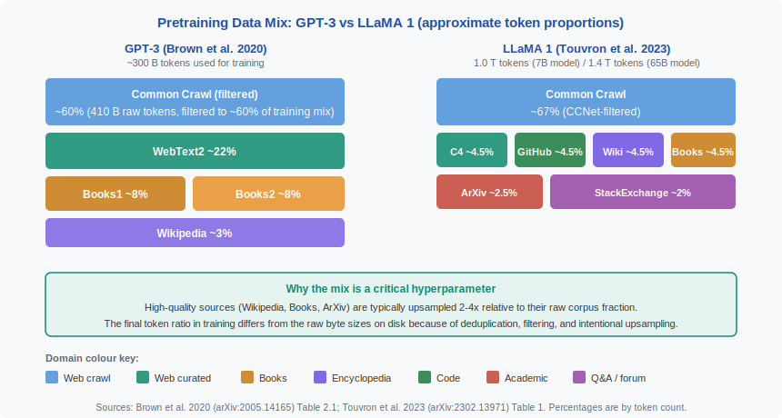
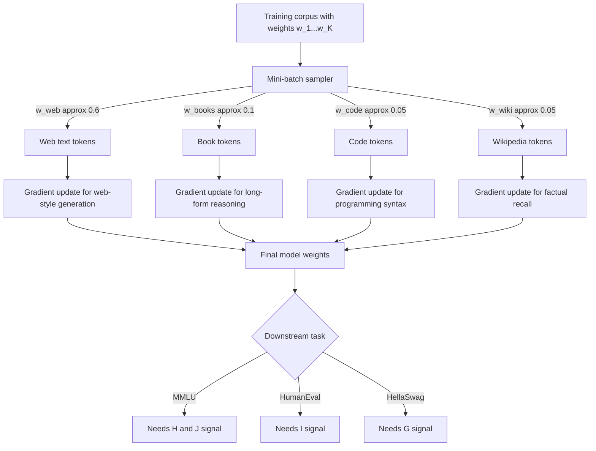

<!-- ============================ TOP NAV ============================ -->
<div align="center">

[🏠 Home](../../README.md) &nbsp;•&nbsp; [📚 Section 3 — Pretraining & Scaling Laws](./README.md) &nbsp;•&nbsp; [⬅️ Q3‑03 — Chinchilla scaling](./q03-chinchilla.md) &nbsp;•&nbsp; [Q3‑05 — Emergent abilities ➡️](./q05-emergent-abilities.md)

</div>

---

# Q3‑04 · What is a pretraining data mix and why does the mixture of domains matter for downstream quality?

<div align="center">


</div>

> [!IMPORTANT]
> **The 20-second answer.** A pretraining data mix is the set of **proportional sampling weights** assigned to different text source domains (web crawl, books, code, Wikipedia, academic papers, etc.) during training. At every mini-batch, tokens are drawn from each domain according to these weights. The mixture matters because **a model's parametric knowledge is exactly what it was trained to predict**: training only on web text produces poor math and code; training only on books degrades conversational quality. Published models show large variation — GPT-3 weighted ~60% Common Crawl and ~22% WebText2; LLaMA 1 weighted ~67% Common Crawl but also included GitHub code and ArXiv. Domain weighting is a first-class hyperparameter that governs what knowledge is stored in the model's weights.

---

## Table of contents

1. [First principles](#1--first-principles)
2. [What a data mix actually is](#2--what-a-data-mix-actually-is)
3. [Why domain composition drives downstream quality](#3--why-domain-composition-drives-downstream-quality)
4. [Published data mixes with real numbers](#4--published-data-mixes-with-real-numbers)
5. [Data quality filtering](#5--data-quality-filtering)
6. [Deduplication](#6--deduplication)
7. [Domain upsampling](#7--domain-upsampling)
8. [Data mix as a learnable hyperparameter — DoReMi](#8--data-mix-as-a-learnable-hyperparameter--doremi)
9. [Algorithm and pseudocode](#9--algorithm-and-pseudocode)
10. [Reference implementation](#10--reference-implementation)
11. [Worked numerical example](#11--worked-numerical-example)
12. [Interview drill](#12--interview-drill)
13. [Common misconceptions](#13--common-misconceptions)
14. [One-screen summary](#14--one-screen-summary)
15. [References](#15--references)

---

## 1 · First principles

A language model trained with next-token prediction learns a distribution over text:

$$P_\theta(x_1, x_2, \ldots, x_T) = \prod_{t=1}^{T} P_\theta(x_t \mid x_1, \ldots, x_{t-1})$$

The gradient signal at every training step comes from the document the model is currently reading. If 99% of documents are low-quality web pages about celebrity gossip, then 99% of the gradient steps push the model toward predicting celebrity gossip well, and almost none push it toward predicting correct Python or LaTeX.

> **Core insight:** The parametric knowledge encoded in a model's weights is a direct reflection of what text it was trained to compress. The data mix is the control dial for *which knowledge* the model acquires.

This is why data mix decisions sit at the intersection of data engineering and model architecture choices — getting it wrong by even 10 percentage points on a key domain can measurably degrade a specific capability.

---

## 2 · What a data mix actually is

A pretraining data mix is a discrete probability distribution over $K$ text source domains:

$$\mathbf{w} = (w_1, w_2, \ldots, w_K), \quad w_k \geq 0, \quad \sum_{k=1}^{K} w_k = 1$$

During training, each mini-batch of $B$ tokens is assembled by:

1. For each token slot in the batch, sampling a domain index $k \sim \text{Categorical}(\mathbf{w})$.
2. Drawing the next token from a stream over domain $k$ (random document, random position within that document).

In practice this is implemented as a **weighted dataset sampler** that over-samples or under-samples each domain's iterator. The weights are set once before training begins and held fixed throughout (unless a dynamic scheme like DoReMi is used).

The total token budget seen during training is:

$$N_{\text{total}} = \sum_{k=1}^{K} N_k, \quad \text{where } N_k = w_k \cdot N_{\text{total}}$$

If $w_k > s_k$ (where $s_k$ is domain $k$'s share of the raw on-disk corpus), domain $k$ is **upsampled** — documents are repeated. If $w_k < s_k$, domain $k$ is **downsampled** — many documents are never seen.

<div align="center">

<br><sub><b>Figure 1.</b> Approximate pretraining data mix for GPT-3 (Brown et al. 2020, Table 2.1) and LLaMA 1 (Touvron et al. 2023, Table 1) by percentage of training tokens. Note that LLaMA 1 includes GitHub code and ArXiv academic text, which GPT-3 does not, reflecting different capability targets. All percentages are as reported in the original papers.</sub>
</div>

---

## 3 · Why domain composition drives downstream quality

The connection between domain proportion and downstream performance is empirically robust and theoretically expected.

**Transfer from in-distribution domains is near-perfect; transfer from out-of-distribution domains is weak.**

If domain $k$ never appears in training, the model has no gradient signal to learn domain-specific vocabulary, syntax, or reasoning patterns. Even if those patterns share surface-level overlap with other domains, the model's weight updates never corrected for domain-specific errors.

Consider three concrete examples:

| Capability | Key source domain | Effect of removing it |
|---|---|---|
| Multi-step arithmetic | Math textbooks, ArXiv | Model fails chain-of-thought math steps |
| Python generation | GitHub code | Model generates syntactically broken code |
| Instruction following style | Curated web/books | Model output is stilted or incoherent |
| Factual grounding | Wikipedia | Model hallucinates entity attributes |

A useful mental model: **the data mix is a capability portfolio.** Each domain is an asset; its weight is the allocation. Zero weight means zero parametric investment in that capability.

**Domain-specific tokenization efficiency** also matters. A BPE tokenizer trained on web text may tokenize mathematical symbols into many fragments, consuming context budget inefficiently — but this is a tokenization concern that compounds the data mix effect.

**Mermaid flowchart — how domain weights affect gradient signal:**



---

## 4 · Published data mixes with real numbers

### GPT-3 (Brown et al. 2020, arXiv:2005.14165)

Brown et al. report data mix proportions in Table 2.1. All percentages below are **token proportions used during training**, not raw corpus sizes on disk. The 175B parameter model was trained for approximately 300B tokens.

| Dataset | Token proportion | Notes |
|---|---|---|
| Common Crawl (filtered) | 60% | 410B raw tokens, filtered and fuzzy-deduped |
| WebText2 | 22% | Outbound links from Reddit with ≥3 karma |
| Books1 | 8% | Internet-sourced books corpus |
| Books2 | 8% | Separate books corpus |
| Wikipedia | 3% | English Wikipedia |

> [!NOTE]
> The Common Crawl slice was filtered using a classifier trained on WebText2 as a positive signal — documents similar to high-quality web text were retained. This is an important quality step, not just raw Common Crawl.

### LLaMA 1 (Touvron et al. 2023, arXiv:2302.13971)

LLaMA 1's data mix is reported in Table 1. The 7B model was trained on 1.0T tokens; the 65B model on 1.4T tokens.

| Dataset | Token proportion | Preprocessing |
|---|---|---|
| CommonCrawl | 67% | CCNet pipeline (Wenzek et al. 2020) |
| C4 | 4.5% | Raffel et al. (2020) heuristic filter |
| GitHub | 4.5% | License-filtered open-source code |
| Wikipedia | 4.5% | 20 languages in Latin/Cyrillic scripts |
| Gutenberg + Books3 | 4.5% | Books corpora |
| ArXiv | 2.5% | LaTeX source, custom cleaning |
| StackExchange | 2% | HTML to text, upvote filtered |

A key difference from GPT-3: LLaMA 1 explicitly includes **code (GitHub)** and **academic text (ArXiv)**. This reflects a design choice to improve reasoning and technical generation without separate fine-tuning.

### The Pile (Gao et al. 2020, arXiv:2101.00027)

The Pile is a 825 GiB dataset assembled from 22 diverse subsets with explicit mixing weights. Some notable weights from Table 1 of Gao et al.:

| Subset | Sampling weight | Size (GiB) |
|---|---|---|
| Pile-CC (Common Crawl) | 18.11% | 227.12 |
| PubMed Central | 14.40% | 90.27 |
| Books3 | 12.07% | 100.96 |
| OpenWebText2 | 10.01% | 62.77 |
| ArXiv | 8.96% | 56.21 |
| GitHub | 7.59% | 95.16 |
| FreeLaw | 6.12% | 51.15 |
| StackExchange | 5.13% | 32.20 |
| USPTO Backgrounds | 3.65% | 22.90 |
| PubMed Abstracts | 2.99% | 19.26 |

The Pile demonstrates that 22 domains are manageable and that **academic/medical text (PubMed, ArXiv) can be given substantial weight** relative to their raw byte size.

---

## 5 · Data quality filtering

Raw web crawl data contains enormous noise: malware pages, template boilerplate, non-linguistic content, encoding errors, and duplicate spam. Two major filtering systems define the field.

### C4 / Colossal Clean Crawled Corpus (Raffel et al. 2020, arXiv:1910.10683)

The C4 dataset applies heuristic rules to Common Crawl:

1. **Keep only lines that end with terminal punctuation** (period, exclamation mark, question mark, closing quotation).
2. **Remove lines with fewer than 3 words.**
3. **Remove pages with fewer than 5 sentences.**
4. **Remove pages containing any word from a list of profanity/offensive terms** (English-language filtering).
5. **Remove pages containing "Javascript must be enabled"** or similar boilerplate.
6. **Remove pages where any line contains "lorem ipsum"** (placeholder text).
7. **Deduplicate three-sentence spans** across the corpus.
8. **Keep only pages detected as English** by langdetect.

These rules remove the majority of raw Common Crawl and produce a much cleaner subset. C4 is ~750 GiB of English text and is used directly as a training source in LLaMA 1 (at 4.5% of tokens).

### CCNet (Wenzek et al. 2020, arXiv:1911.00359)

CCNet is a more principled pipeline used by LLaMA for its dominant Common Crawl slice:

1. **Language identification:** Run fastText language classifier on each paragraph. Retain only paragraphs above a confidence threshold for the target language.
2. **Perplexity filtering:** Train a small n-gram language model (5-gram KenLM) on a high-quality reference corpus (Wikipedia). Compute perplexity of each document under this model. Documents with perplexity above a threshold (i.e., text that looks nothing like Wikipedia) are removed. Documents are binned into low/medium/high perplexity buckets; only low and medium are typically used.
3. **Deduplication:** Paragraph-level and document-level exact-match deduplication via SHA-1 hashing.

The perplexity filter is the key insight: if a small Wikipedia-trained LM assigns high perplexity to a document, the document is likely low-quality (random character sequences, encoding errors, non-natural language). This is a cheap unsupervised quality signal.

<div align="center">

<br><sub><b>Figure 2.</b> Quality filtering pipeline from raw Common Crawl to final training corpus. The left path (web crawl) passes through language identification (fastText, CCNet), perplexity filtering (KenLM trained on Wikipedia), heuristic filtering (C4 rules), and deduplication (MinHash/SimHash). High-quality curated sources bypass these filters and are added directly. A mixing stage assigns domain weights, which may be set manually or learned via DoReMi (Xie et al. 2023).</sub>
</div>

---

## 6 · Deduplication

Deduplication is one of the highest-leverage data quality interventions available. Lee et al. (2022, arXiv:2107.06499) show in "Deduplicating Training Data Makes Language Models Better" that near-duplicate removal:

- **Improves downstream evaluation scores** on perplexity and few-shot benchmarks.
- **Reduces verbatim memorization** — models trained on deduplicated data are less likely to regurgitate training documents verbatim (a privacy and IP concern).
- **Allows more efficient use of the token budget** — seeing the same document 50 times adds almost no new gradient information after the first few exposures.

### MinHash deduplication

MinHash is the standard approximate near-duplicate detection algorithm for large text corpora.

**Key ideas:**

1. Represent each document as a set of character $n$-grams (typically $n = 5$ or $n = 13$).
2. Apply $h$ independent hash functions to the $n$-gram set to produce a MinHash signature of length $h$.
3. Use **Locality Sensitive Hashing (LSH)** to bucket documents with similar signatures together — only pairs in the same bucket need exact comparison.
4. Cluster documents above a Jaccard similarity threshold (e.g., $J > 0.8$) and keep one representative per cluster.

The Jaccard similarity between two documents $A$ and $B$ is:

$$J(A, B) = \frac{|A \cap B|}{|A \cup B|}$$

For two documents sharing 80% of their 5-grams, $J = 0.8$. MinHash estimates this without computing the full set intersection.

**Computational cost:** $O(N \cdot h)$ to compute signatures for $N$ documents with signature length $h$. LSH reduces pairwise comparison from $O(N^2)$ to near-$O(N)$.

Lee et al. find that **GPT-2 WebText** contains 1–6% near-duplicate documents depending on the threshold, and removing them improves held-out perplexity by measurable margins. For trillion-token corpora the deduplication rate can be 10–30% of raw data.

---

## 7 · Domain upsampling

Raw on-disk corpus sizes do not equal ideal training proportions. High-quality but small corpora (Wikipedia at ~20 GB, ArXiv at ~56 GB) would receive negligible gradient signal if used at their natural fraction of a 10 TB crawl. Instead, they are **upsampled** — their documents are repeated multiple times.

**Typical upsampling factors (approximate, from published practice):**

| Domain | Raw size | Natural fraction of 1 T tokens | Typical trained weight | Effective repeats |
|---|---|---|---|---|
| Wikipedia (English) | ~20 GB | ~0.2% | ~3–5% | ~15–25x |
| Project Gutenberg books | ~20 GB | ~0.2% | ~2–4% | ~10–20x |
| ArXiv papers | ~56 GB | ~0.5% | ~2–3% | ~4–6x |
| GitHub code | ~95 GB | ~1% | ~4–5% | ~4–5x |
| Common Crawl (filtered) | ~500+ GB | ~50%+ | ~60–67% | ~1–1.3x |

> [!WARNING]
> Excessive upsampling causes **overfitting on small high-quality corpora**. If Wikipedia is upsampled 100x, the model memorizes Wikipedia articles verbatim and loses generalization. The Pile (Gao et al.) reports that 1–2 epochs through each subset is generally safe; beyond ~3–4 epochs, memorization effects become measurable.

**Chinchilla connection:** Hoffmann et al. (2022) show that for a given compute budget, there is an optimal model size / token count tradeoff. For very large models trained on 1–2T tokens, some small high-quality corpora are inevitably seen many times, making upsampling a necessity rather than a choice.

---

## 8 · Data mix as a learnable hyperparameter — DoReMi

Manual tuning of domain weights requires expensive ablation studies. Xie et al. (2023, arXiv:2305.10429) propose **DoReMi (Domain Reweighting with Minimax Optimization)**, which uses a small proxy model to learn domain weights automatically.

**Setup:**

- Let $\mathcal{D} = \{D_1, \ldots, D_K\}$ be $K$ domains.
- Let $\boldsymbol{\alpha} = (\alpha_1, \ldots, \alpha_K)$ be the reference (uniform or natural) domain weights.
- Goal: find training weights $\mathbf{w}^*$ that minimize the **worst-case excess loss** across domains.

**Objective:**

$$\mathbf{w}^* = \arg\min_{\mathbf{w} \in \Delta_K} \max_{k} \;\mathbb{E}_{x \sim D_k}\!\left[\ell_{\theta(\mathbf{w})}(x) - \ell_{\theta(\boldsymbol{\alpha})}(x)\right]$$

where $\Delta_K$ is the probability simplex, $\ell_\theta(x)$ is the per-token cross-entropy loss of model $\theta$ on document $x$, and $\theta(\mathbf{w})$ denotes a model trained with weights $\mathbf{w}$.

**Algorithm:**

1. Train a small **reference model** $\theta_\text{ref}$ on uniform domain weights.
2. Train a small **proxy model** $\theta_\text{proxy}$ with online mirror-descent updates to domain weights, maximizing the difference in per-domain loss from $\theta_\text{ref}$.
3. Extract the converged proxy weights $\mathbf{w}^*$.
4. Train the **full-size model** on $\mathbf{w}^*$.

**Result:** In experiments with a 280M proxy model and 8B target model, DoReMi improves average few-shot accuracy by ~6.5% over uniform weights and matches or outperforms weights tuned by grid search, at a fraction of the cost.

> [!NOTE]
> DoReMi finds that **downweighting the dominant web crawl domain** relative to naive proportional weighting consistently improves aggregate downstream performance — consistent with the intuition that raw web text has high volume but low per-token information density.

---

## 9 · Algorithm and pseudocode

```text
===== WEIGHTED DOMAIN SAMPLER (training loop) =====
INPUT : domain datasets D_1 ... D_K
        domain weights w_1 ... w_K (sum to 1)
        total training token budget N_total
        batch size B
OUTPUT: stream of training batches

1.  Compute per-domain token budget:  N_k = w_k * N_total  for each k

2.  Build iterators:
    FOR each domain k:
        iter_k = infinite_shuffle_stream(D_k)   # repeat if corpus exhausted

3.  WHILE tokens_seen < N_total:
    a.  FOR position i = 1 to B:
            k ~ Categorical(w_1, ..., w_K)      # sample domain
            token = next(iter_k)                 # draw next token
            batch[i] = token
    b.  YIELD batch
    c.  tokens_seen += B

===== MINHASH DEDUPLICATION =====
INPUT : document corpus C, Jaccard threshold tau, num_hashes h
OUTPUT: deduplicated corpus C'

1.  FOR each document d in C:
        ngrams_d = set of character-5grams(d)
        sig_d = [min(hash_j(ngrams_d)) for j in 1..h]   # MinHash signature

2.  LSH bucketing:
    Band each signature into b bands of r rows (h = b*r)
    Two documents collide in same band bucket <=> candidate pair

3.  FOR each candidate pair (d_i, d_j):
        est_jaccard = count(sig_i == sig_j) / h
        IF est_jaccard >= tau:
            mark d_j as duplicate of d_i   # keep earlier doc

4.  RETURN C' = {d : d not marked as duplicate}
```

---

## 10 · Reference implementation

```python
import random
from collections import defaultdict
from typing import Iterator, List, Tuple
import hashlib


# ─────────────────────────────────────────────────────────────────
#  Weighted domain sampler
# ─────────────────────────────────────────────────────────────────

class DomainSampler:
    """
    Samples tokens from K domains according to fixed mixture weights.

    Args:
        domains:  list of (name, token_list) pairs
        weights:  sampling probabilities (must sum to 1.0)
        seed:     random seed for reproducibility
    """
    def __init__(
        self,
        domains: List[Tuple[str, List[int]]],
        weights: List[float],
        seed: int = 42,
    ) -> None:
        assert len(domains) == len(weights), "domains and weights must have same length"
        assert abs(sum(weights) - 1.0) < 1e-6, "weights must sum to 1"
        self.domains = domains
        self.weights = weights
        self.rng = random.Random(seed)
        # Build infinite iterators per domain
        self._iters = [self._cycle(tokens) for _, tokens in domains]

    @staticmethod
    def _cycle(tokens: List[int]) -> Iterator[int]:
        """Infinite cycling iterator over a token list."""
        idx = 0
        while True:
            yield tokens[idx % len(tokens)]
            idx += 1

    def sample_batch(self, batch_size: int) -> List[int]:
        """Draw batch_size tokens according to domain weights."""
        domain_indices = self.rng.choices(
            range(len(self.domains)),
            weights=self.weights,
            k=batch_size,
        )
        batch = []
        for k in domain_indices:
            batch.append(next(self._iters[k]))
        return batch

    def token_budget(self, total_tokens: int) -> dict:
        """Report expected token counts per domain for a given total budget."""
        return {
            name: round(w * total_tokens)
            for (name, _), w in zip(self.domains, self.weights)
        }


# ─────────────────────────────────────────────────────────────────
#  MinHash deduplication (simplified, educational)
# ─────────────────────────────────────────────────────────────────

def get_ngrams(text: str, n: int = 5) -> set:
    """Character n-grams of a document."""
    return {text[i:i+n] for i in range(len(text) - n + 1)}


def minhash_signature(ngrams: set, num_hashes: int = 128) -> List[int]:
    """
    Compute MinHash signature using num_hashes independent hash functions.
    Uses a simple universal-hash family: h(x) = (a*hash(x) + b) mod p.
    """
    p = (1 << 61) - 1  # Mersenne prime
    rng = random.Random(0)
    params = [(rng.randint(1, p - 1), rng.randint(0, p - 1)) for _ in range(num_hashes)]
    sig = []
    for a, b in params:
        min_val = min(
            (a * int(hashlib.md5(ng.encode()).hexdigest(), 16) + b) % p
            for ng in ngrams
        ) if ngrams else 0
        sig.append(min_val)
    return sig


def estimate_jaccard(sig_a: List[int], sig_b: List[int]) -> float:
    """Estimate Jaccard similarity from two MinHash signatures."""
    matches = sum(a == b for a, b in zip(sig_a, sig_b))
    return matches / len(sig_a)


def deduplicate(
    documents: List[str],
    threshold: float = 0.8,
    num_hashes: int = 128,
) -> List[str]:
    """
    Remove near-duplicate documents using MinHash similarity.

    Args:
        documents:  list of text documents
        threshold:  Jaccard similarity above which docs are considered duplicates
        num_hashes: signature length (higher = more accurate, slower)

    Returns:
        Deduplicated list of documents (one representative per cluster kept).
    """
    sigs = [minhash_signature(get_ngrams(doc), num_hashes) for doc in documents]
    kept = []
    removed = set()
    for i, doc_i in enumerate(documents):
        if i in removed:
            continue
        kept.append(doc_i)
        for j in range(i + 1, len(documents)):
            if j in removed:
                continue
            if estimate_jaccard(sigs[i], sigs[j]) >= threshold:
                removed.add(j)
    return kept


# ─────────────────────────────────────────────────────────────────
#  Demo
# ─────────────────────────────────────────────────────────────────

if __name__ == "__main__":
    # Approximate LLaMA 1 token proportions
    domains = [
        ("CommonCrawl", list(range(1000))),   # large domain — placeholder tokens
        ("C4",          list(range(200))),
        ("GitHub",      list(range(200))),
        ("Wikipedia",   list(range(200))),
        ("Books",       list(range(200))),
        ("ArXiv",       list(range(100))),
        ("StackExchange", list(range(100))),
    ]
    weights = [0.670, 0.045, 0.045, 0.045, 0.045, 0.025, 0.020]
    # Remaining 10.5% unassigned in this simplified demo — normalise
    total = sum(weights)
    weights = [w / total for w in weights]

    sampler = DomainSampler(domains, weights)
    budget = sampler.token_budget(total_tokens=1_000_000_000_000)  # 1 T tokens
    print("Expected token budget per domain (LLaMA-1 style, 1T total):")
    for name, count in budget.items():
        print(f"  {name:16s}: {count:>15,} tokens")

    batch = sampler.sample_batch(batch_size=2048)
    # Count domain representation in one batch
    # (Not directly observable from token IDs in real usage — illustrative only)
    print(f"\nSampled batch of {len(batch)} tokens (first 10): {batch[:10]}")

    # Deduplication example
    corpus = [
        "The quick brown fox jumps over the lazy dog",
        "The quick brown fox jumps over the lazy dog",   # exact dup
        "The quick brown fox leaps over the lazy dog",   # near-dup
        "A completely different sentence about machine learning",
    ]
    deduped = deduplicate(corpus, threshold=0.6, num_hashes=64)
    print(f"\nDeduplication: {len(corpus)} docs -> {len(deduped)} docs")
    for d in deduped:
        print(f"  Kept: {d}")
```

> [!WARNING]
> The MinHash implementation above is educational and $O(N^2)$ in the number of document pairs. Production systems (e.g., the deduplication pipeline in Lee et al. 2022) use Locality Sensitive Hashing (LSH) with banded signatures to reduce pairwise comparison to near-$O(N)$, and operate on byte-level 13-grams rather than character 5-grams.

---

## 11 · Worked numerical example

**Scenario:** You are training a 7B parameter model on a 1T token budget (consistent with LLaMA 1). You have assembled the following raw corpora:

| Domain | Raw tokens on disk | Raw fraction |
|---|---|---|
| Common Crawl (filtered) | 670 B | 67.0% |
| C4 | 45 B | 4.5% |
| GitHub | 45 B | 4.5% |
| Wikipedia | 4.5 B | 0.45% |
| Books | 6 B | 0.60% |
| ArXiv | 25 B | 2.5% |
| StackExchange | 20 B | 2.0% |
| **Total raw** | **815.5 B** | — |

**Step 1: Compute desired training token counts.**

Using Touvron et al.'s reported proportions for the 1T budget:

$$N_{\text{Wikipedia}} = 0.045 \times 1\text{T} = 45\text{B tokens}$$

$$N_{\text{Books}} = 0.045 \times 1\text{T} = 45\text{B tokens}$$

**Step 2: Compute effective repeat factors.**

$$r_{\text{Wikipedia}} = \frac{N_{\text{Wikipedia}}}{|\text{Wikipedia}|} = \frac{45\text{B}}{4.5\text{B}} = 10\times$$

$$r_{\text{Books}} = \frac{N_{\text{Books}}}{|\text{Books}|} = \frac{45\text{B}}{6\text{B}} = 7.5\times$$

$$r_{\text{Common Crawl}} = \frac{N_{\text{CC}}}{|\text{CC}|} = \frac{670\text{B}}{670\text{B}} = 1\times$$

**Step 3: Verify the budget closes.**

Total training tokens from all domains at Touvron et al. proportions:

$$N_{\text{total}} = 670\text{B} + 45\text{B} + 45\text{B} + 45\text{B} + 45\text{B} + 25\text{B} + 20\text{B} = 895\text{B}$$

The published 1T budget implies some domains run slightly over 1 epoch, or the remaining ~105B tokens are filled by proportional extension. This illustrates that **the proportions in the paper represent the training mix target, not exact on-disk sizes**.

**Step 4: Estimate per-domain gradient steps.**

At batch size $B = 4{,}096$ tokens with sequence length $L = 2{,}048$:

$$\text{steps per domain } k = \frac{N_k}{B} = \frac{N_k}{4{,}096}$$

$$\text{Wikipedia steps} = \frac{45 \times 10^9}{4096} \approx 10.99 \times 10^6 \text{ steps}$$

$$\text{Common Crawl steps} = \frac{670 \times 10^9}{4096} \approx 163.6 \times 10^6 \text{ steps}$$

Wikipedia contributes roughly 1 gradient step for every 15 from Common Crawl, despite being upsampled 10x.

**Step 5: Back-of-envelope quality impact.**

A model trained without ArXiv (0% weight) versus with ArXiv at 2.5% weight, trained for 1T tokens:

$$\Delta N_{\text{ArXiv}} = 0.025 \times 10^{12} = 2.5 \times 10^{10} \text{ tokens of scientific text}$$

That is 25 billion tokens of LaTeX, equations, and scientific reasoning — roughly 10 million academic papers. Removing this signal explains why GPT-3 (no explicit ArXiv) performs noticeably worse on GSM8K and MATH benchmarks compared to LLaMA variants and models trained with mathematical pretraining data.

---

## 12 · Interview drill

<details>
<summary><b>Q: If you double the weight of Wikipedia in your data mix, what are the two competing effects?</b></summary>

**Positive effect:** More gradient signal from high-quality, factually dense text improves factual recall and encyclopaedic knowledge. Wikipedia is already filtered and coherent, so each token provides a high signal-to-noise gradient update.

**Negative effect:** Wikipedia tokens now displace other domain tokens. If Wikipedia was 3% and you raise it to 6%, something else must drop by 3%. If that is Common Crawl, the model sees less diversity in writing style, register, and topic. More critically, the Wikipedia corpus is finite (~4 GB for English); upsampling it 20x instead of 10x means the model sees the same Wikipedia article 20 times — the marginal information from the 20th pass is near zero, but the backward pass is not free (still costs compute). At some upsampling multiple, you cross from beneficial signal to harmful memorization.
</details>

<details>
<summary><b>Q: What is the difference between data quality filtering and domain upsampling? Can you do one without the other?</b></summary>

**Quality filtering** decides which documents to include at all — it is a binary keep/remove decision. Documents failing language ID or perplexity thresholds are discarded and never appear in training.

**Domain upsampling** decides how often kept documents are seen — it adjusts the proportion of each domain in the training stream without discarding any document.

You can do filtering without upsampling: take all kept documents and sample them in proportion to their natural on-disk sizes. But this leaves high-quality small corpora (Wikipedia) statistically invisible against a large crawl.

You can do upsampling without filtering: repeat Wikipedia documents many times, but still mix in noisy crawl data. The noisy signal may overwhelm the upsampled quality signal.

In practice both are needed: filter first to raise per-document quality, then upsample to correct corpus size imbalances.
</details>

<details>
<summary><b>Q: Why does deduplication improve downstream evaluation scores, not just reduce memorization?</b></summary>

Lee et al. (2022) identify two mechanisms:

1. **Improved generalization.** Duplicate documents cause gradient updates to be applied to the same example repeatedly. This is equivalent to having a higher effective learning rate on those examples — the model overfit to them compared to single-occurrence documents. Removing duplicates balances gradient signal and reduces overfitting to high-frequency training patterns.

2. **Evaluation data contamination.** Many evaluation benchmarks (LAMBADA, BooksCorpus test set) have near-duplicates in Common Crawl. A model trained on these near-duplicates achieves artificially high scores by near-memorization rather than generalization. Deduplication removes this contamination and produces honest evaluation numbers.

The implication is that published benchmark scores on non-deduplicated models may be inflated relative to their true generalization capability.
</details>

<details>
<summary><b>Q: How does DoReMi differ from simply grid-searching over domain weights?</b></summary>

**Grid search** trains a separate model for each candidate weight vector. With $K = 7$ domains and even just 3 candidate values per domain, that is $3^7 = 2{,}187$ training runs — wildly infeasible at any non-trivial model scale.

**DoReMi** solves the same problem with two small training runs: one reference model (uniform weights) and one proxy model (with online weight updates via mirror descent). The proxy run produces the optimized weight vector in a single pass. The total compute cost is roughly 2× the cost of training a small proxy model, regardless of $K$.

The key insight is that domain weights can be treated as Lagrange multipliers in a minimax game, and mirror descent on the weight simplex converges efficiently. The resulting weights are then transferred to the large target model.
</details>

<details>
<summary><b>Q: Why does including code in the pretraining mix improve reasoning on non-code tasks like math?</b></summary>

Several hypotheses are consistent with experimental evidence:

1. **Structural reasoning chains.** Code enforces explicit step-by-step logic with variable binding, conditionals, and loops. Training on code teaches the model to produce structured multi-step reasoning in its internal representations, which transfers to mathematical chain-of-thought.

2. **Formal precision.** Code is exact — a missing bracket causes a parse error. Training on millions of correct programs teaches the model to be precise about syntax and semantics, a useful inductive bias for exact calculation.

3. **Comments and docstrings.** Code repositories contain natural language explanations adjacent to formal specifications (docstrings, inline comments). This creates paired examples of informal intent and formal implementation.

Empirically, Liang et al. (2022) and ablation studies for Codex, LLaMA, and PaLM all show that adding code to the pretraining mix improves few-shot math performance even on problems that require no code generation.
</details>

<details>
<summary><b>Q: A model is deployed for medical question answering but was trained with only 0.5% PubMed. How would you fix this without retraining from scratch?</b></summary>

Several options in roughly increasing cost:

1. **Continued pretraining on medical text.** Take the existing checkpoint and run additional pretraining steps on a medical-heavy mixture (PubMed, clinical notes, medical textbooks). This is much cheaper than training from scratch and effectively up-weights the medical domain post hoc. Risk: learning rate must be small to avoid catastrophic forgetting of general capabilities.

2. **Domain-adaptive pretraining (DAPT).** Gururangan et al. (2020) show that continued pretraining on in-domain unlabeled text before fine-tuning consistently improves task performance. Apply DAPT on PubMed, then fine-tune on medical QA pairs.

3. **Retrieval augmentation.** Attach a retrieval module that fetches relevant PubMed abstracts at inference time. This avoids any retraining but adds latency and the retrieved text competes with context window space.

4. **Mixture-of-experts or adapter layers.** Train a medical-specific adapter or expert module that activates for medical queries, blending with the base model's general knowledge.

Option 1 is generally preferred for production models when the performance gap is large; option 3 is preferred when factual currency (new papers) is critical.
</details>

---

## 13 · Common misconceptions

| Misconception | Reality |
|---|---|
| "The data mix percentages are the on-disk corpus size fractions." | No — they are token proportions during training, which differ because of deduplication, filtering (reduces size), and upsampling (inflates small corpora). |
| "More Common Crawl is always better because more data improves models." | Beyond a point, unfiltered crawl data dilutes quality signal. DoReMi and ablations consistently show that reducing crawl weight below its natural fraction improves aggregate performance. |
| "Deduplication only matters for privacy, not quality." | Lee et al. (2022) show measurable quality improvements from deduplication independent of any privacy concern. Duplicate documents cause effective overfitting. |
| "You need to set data mix weights once and they are fixed." | DoReMi (Xie et al. 2023) and earlier works show that dynamic or learned weights can outperform fixed manual weights. Weights can in principle be updated during training. |
| "Adding code to the mix only helps code tasks." | Multiple studies show code pretraining improves reasoning and structured generation on non-code tasks (math, logic, instruction following). |
| "High perplexity under a small LM means a document is bad." | High perplexity means the document is unlike Wikipedia (the reference corpus). That could mean it is noisy OR that it is a specialized technical domain. CCNet uses perplexity as a heuristic, not a ground truth — some valid specialized text gets discarded. |

---

## 14 · One-screen summary

> **What it is:** A pretraining data mix is a probability distribution $\mathbf{w} = (w_1, \ldots, w_K)$ over $K$ text source domains. At each training step, tokens are sampled proportionally from each domain.
>
> **Why it matters:** The model's parametric knowledge is what it was trained to predict. Zero weight on a domain means zero gradient signal for that capability. GPT-3 (60% CC, 22% WebText2, 3% Wikipedia) and LLaMA 1 (67% CC, 4.5% each for C4/GitHub/Wikipedia/Books) reflect explicit capability prioritization choices.
>
> **Quality filtering:** Raw web crawl is noisy. C4 heuristics (terminal punctuation, no lorem ipsum, dedup 3-grams) and CCNet (fastText language ID + KenLM perplexity filter) remove the majority of low-quality pages before mixing.
>
> **Deduplication:** MinHash near-duplicate removal improves downstream quality and reduces memorization (Lee et al. 2022). Production pipelines target Jaccard threshold ~0.8 on character 5-gram or 13-gram representations.
>
> **Upsampling:** High-quality small corpora (Wikipedia, Books, ArXiv) are upsampled 2–25x above their natural fraction; raw crawl is sampled at approximately its natural proportion.
>
> **Learnable weights:** DoReMi (Xie et al. 2023) uses a minimax proxy-model framework to learn domain weights that minimize worst-case excess loss across domains, outperforming manual grid search.

---

## 15 · References

1. Brown, T. et al. — **Language Models are Few-Shot Learners** (GPT-3). *NeurIPS 2020 / arXiv:2005.14165.* — Table 2.1 reports GPT-3's data mix with explicit token proportions for each source.

2. Touvron, H. et al. — **LLaMA: Open and Efficient Foundation Language Models**. *arXiv:2302.13971, 2023.* — Table 1 reports LLaMA 1's data mix including GitHub, ArXiv, and StackExchange sources.

3. Gao, L. et al. — **The Pile: An 800GB Dataset of Diverse Text for Language Modeling**. *arXiv:2101.00027, 2020.* — Defines 22 subsets with explicit mixing weights; demonstrates the value of diverse academic and domain-specific text.

4. Raffel, C. et al. — **Exploring the Limits of Transfer Learning with a Unified Text-to-Text Transformer** (T5 / C4). *JMLR 2020 / arXiv:1910.10683.* — Section 2.2 describes C4 heuristic filtering rules (terminal punctuation, lorem ipsum, deduplication of 3-sentence spans).

5. Wenzek, G. et al. — **CCNet: Extracting High Quality Monolingual Datasets from Web Crawl Data**. *LREC 2020 / arXiv:1911.00359.* — Introduces the CCNet pipeline (fastText language ID + KenLM perplexity filter) used as the primary filter for LLaMA 1's dominant data source.

6. Lee, K. et al. — **Deduplicating Training Data Makes Language Models Better**. *ACL 2022 / arXiv:2107.06499.* — Shows that MinHash near-duplicate removal improves downstream perplexity and few-shot benchmarks while reducing verbatim memorization.

7. Xie, S. M. et al. — **DoReMi: Optimizing Data Mixtures Speeds Up Language Model Pretraining**. *NeurIPS 2023 / arXiv:2305.10429.* — Proposes the minimax domain reweighting framework; proxy model learns optimal weights with ~2x small-model compute overhead.

8. Hoffmann, J. et al. — **Training Compute-Optimal Large Language Models** (Chinchilla). *NeurIPS 2022 / arXiv:2203.15556.* — Motivates data volume vs. model size tradeoffs that directly constrain upsampling decisions for small high-quality corpora.

9. Gururangan, S. et al. — **Don't Stop Pretraining: Adapt Language Models to Domains and Tasks**. *ACL 2020 / arXiv:2004.10964.* — Domain-adaptive pretraining (DAPT) shows that continued pretraining on in-domain text post hoc partially compensates for suboptimal initial data mix.

10. Longpre, S. et al. — **A Pretrainer's Guide to Training Data: Measuring the Effects of Data Age, Domain Coverage, Quality, and Toxicity**. *arXiv:2305.13169, 2023.* — Systematic ablation of data mix components; quantifies the downstream impact of varying domain proportions for 3B and 7B scale models.

---

<!-- ============================ BOTTOM NAV ============================ -->
<div align="center">

[⬅️ Q3‑03 — Chinchilla scaling](./q03-chinchilla.md) &nbsp;|&nbsp; [📚 Back to Section 3](./README.md) &nbsp;|&nbsp; [🏠 Home](../../README.md) &nbsp;|&nbsp; [Q3‑05 — Emergent abilities ➡️](./q05-emergent-abilities.md)

<sub>Found an error or have a sharper intuition? See <a href="../../CONTRIBUTING.md">CONTRIBUTING</a> — answers follow the <a href="../../_TEMPLATE.md">answer template</a>.</sub>

</div>
