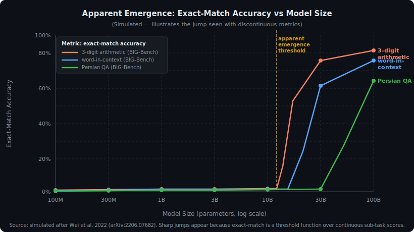
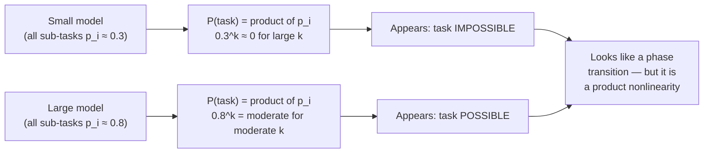
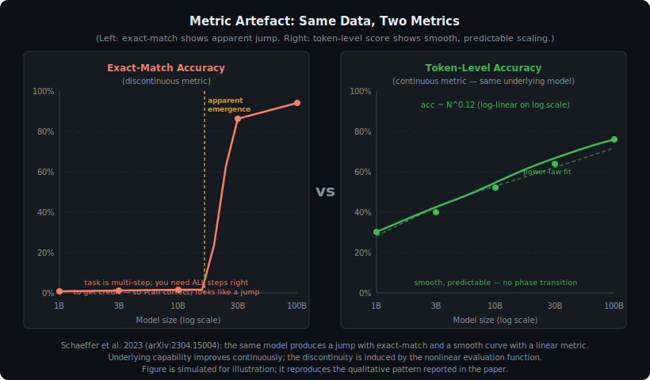

<!-- ============================ TOP NAV ============================ -->
<div align="center">

[&#127968; Home](../../README.md) &nbsp;•&nbsp; [&#128218; Section 3 — Pretraining &amp; Scaling Laws](./README.md) &nbsp;•&nbsp; [&#11013;&#65039; Q3&#8209;04 — Data Mix](./q04-data-mix.md) &nbsp;•&nbsp; [Q3&#8209;06 — LR Schedule &#10145;&#65039;](./q06-lr-schedule.md)

</div>

---

# Q3&#8209;05 · What are emergent abilities in LLMs? Are they real phase transitions or a measurement artefact?

<div align="center">


</div>

> [!IMPORTANT]
> **The 20&#8209;second answer.** Wei et al. (2022) observed that certain BIG-Bench tasks scored near 0% on every model below ~10B parameters and then jumped sharply above some size threshold — the definition of an **emergent ability**. Schaeffer et al. (2023) showed this is largely a **metric artefact**: exact-match accuracy is a nonlinear (threshold) function of underlying token probabilities. When you apply a continuous linear metric to the same tasks and models, the improvement curve is smooth and power-law, matching standard scaling-law predictions. The "jump" does not disappear entirely — compositional tasks may have genuine prerequisite structures — but the claim of a sharp phase transition is not supported once metric choice is controlled for.

---

## Table of contents

1. [First principles](#1--first-principles)
2. [The problem, told as a story](#2--the-problem-told-as-a-story)
3. [The original claim: Wei et al. 2022](#3--the-original-claim-wei-et-al-2022)
4. [Proposed mechanism: compositional prerequisites](#4--proposed-mechanism-compositional-prerequisites)
5. [Geometric intuition](#5--geometric-intuition)
6. [The counterargument: Schaeffer et al. 2023](#6--the-counterargument-schaeffer-et-al-2023)
7. [Algorithm and pseudocode](#7--algorithm-and-pseudocode)
8. [Reference implementation](#8--reference-implementation)
9. [Worked numerical example](#9--worked-numerical-example)
10. [Where it matters — and where it breaks](#10--where-it-matters--and-where-it-breaks)
11. [Cousins and related phenomena](#11--cousins-and-related-phenomena)
12. [Interview drill](#12--interview-drill)
13. [Common misconceptions](#13--common-misconceptions)
14. [One&#8209;screen summary](#14--one-screen-summary)
15. [References](#15--references)

---

## 1 · First principles

The word **emergence** comes from physics and complexity theory: a property of a system that is absent at small scale and appears at large scale, often abruptly — like water molecules becoming a liquid, or magnetization in a ferromagnet below the Curie temperature.

Applied to LLMs, emergence has a specific operational definition (Wei et al. 2022):

> **An ability is emergent if it is not present in smaller models and is present in larger models.**

Two subsidiary conditions sharpen the claim: (1) the ability appears **sharply** (not gradually), and (2) the transition cannot be predicted by extrapolating the scaling trend from smaller models.

These conditions matter because standard scaling laws (Kaplan 2020, Hoffmann 2022) predict *smooth, predictable* improvements. If a capability appears discontinuously, it implies something qualitatively different is happening — not just quantitatively more.

The controversy, introduced by Schaeffer et al. (2023), is whether those conditions are actually met, or whether they are created by the choice of measurement tool.

---

## 2 · The problem, told as a story

Imagine you are measuring whether students can solve long-division problems. You grade on a simple binary: correct answer or not. A student who can do 3 out of 4 steps correctly gets 0%, same as one who can do 0 steps. Only a student who gets all 4 steps right gets 100%.

Now plot score vs. hours studied. The curve will look like a step function: flat at zero for a long time, then a sudden jump when the student crosses the threshold of mastering all four steps simultaneously.

Did the student's ability to do arithmetic **emerge suddenly** at some critical hour count? No — they were making continuous, incremental progress on each individual step the entire time. The discontinuity is in your grading function, not in their learning.

This is precisely the argument Schaeffer et al. make about LLMs.

---

## 3 · The original claim: Wei et al. 2022

Wei et al. (arXiv:2206.07682) surveyed a large set of BIG-Bench tasks across models spanning from ~400M to ~540B parameters (including GPT-3, Gopher, LaMDA, Chinchilla, and PaLM). They found a substantial number of tasks where:

- Models below some size threshold scored at or near **random-chance baseline** (effectively 0% above chance).
- Above that threshold, performance **jumped sharply** to well above baseline.

**Selected claimed emergent abilities from Wei et al. 2022:**

| Task | Reported threshold | Metric used |
|---|---|---|
| 3-digit addition (arithmetic) | ~8B parameters | Exact-match accuracy |
| Word-in-context disambiguation | ~10B parameters | Exact-match accuracy |
| Persian QA | ~30B parameters | Exact-match accuracy |
| Grounded conceptual mappings | ~10B parameters | Exact-match accuracy |
| Multi-step equation solving | ~100B parameters | Exact-match accuracy |

The paper documented over 100 such tasks from BIG-Bench. The authors noted the analogy to phase transitions in physics and proposed that these represent genuine qualitative capability thresholds.

<div align="center">

<br><sub><b>Figure 1.</b> Simulated illustration of apparent emergence with exact-match metric. Three BIG-Bench tasks (3-digit arithmetic, word-in-context, Persian QA) all show flat-near-zero performance for models under roughly 8B to 30B parameters, then a sharp jump. The vertical dashed line marks the approximate emergence threshold. Source: simulated after Wei et al. 2022 (arXiv:2206.07682); qualitative pattern reproduced, values are illustrative.</sub>
</div>

---

## 4 · Proposed mechanism: compositional prerequisites

Wei et al. and subsequent commentators proposed a mechanistic explanation for why emergence might be real rather than artifactual:

> **A multi-step task requires each of several prerequisite sub-abilities. When every sub-ability is near chance, the composed task is also near chance. When every sub-ability crosses some minimum threshold simultaneously (as model scale crosses a critical point), the composed task becomes solvable.**

This is sometimes formalised as a **product of marginals** argument. If a k-step task requires sub-abilities $A_1, A_2, \ldots, A_k$, and each has individual probability $p_i$ of being executed correctly, then:

$$P(\text{task correct}) = \prod_{i=1}^{k} p_i$$

If each $p_i$ grows smoothly from 0 to 1 with model scale, the product starts near 0 and then rises sharply as all $p_i$ simultaneously pass their individual thresholds — the product of k small numbers grows much faster than any individual factor once they all cross ~0.5.



The key nuance: the **product function is itself a nonlinear transformation** of the underlying smooth $p_i$ curves. The individual $p_i$ values may improve smoothly and predictably, but the product $\prod p_i$ has a sharper onset. This is both the mechanism that makes tasks "feel" emergent AND the reason critics say it is a measurement artefact — the nonlinearity lives in the metric, not necessarily in the model's underlying capabilities.

---

## 5 · Geometric intuition

Consider a 4-step task where each step has probability $p$ of being correct, and steps are independent. The full-task exact-match accuracy is:

$$\text{acc}_{\text{exact}}(p) = p^4$$

If $p$ grows linearly from 0 to 1 as $\log N$ (model size) increases:

$$p = \alpha \log N + \beta$$

then:

$$\text{acc}_{\text{exact}} = (\alpha \log N + \beta)^4$$

This is a smooth function of $\log N$, but it has a **slow-then-fast shape**: it is near zero for small $p$, then rises steeply as $p$ approaches 1. On a linear plot with a threshold of 5% (to distinguish from random baseline), it looks like a jump.

A token-level metric, by contrast, would measure $p$ directly — and show a smooth, linear-in-log-N curve throughout.

| Metric | What it measures | Shape of curve | Appearance |
|---|---|---|---|
| Exact-match accuracy | $p^k$ (product) | Slow then fast | Apparent jump |
| Token-level accuracy | $p$ (marginal) | Smooth power-law | No jump |
| Log-probability / NLL | $k \cdot \log p$ (log product) | Smooth linear | No jump |

---

## 6 · The counterargument: Schaeffer et al. 2023

Schaeffer, Miranda, and Goel (arXiv:2304.15004, published ICML 2023) made three complementary arguments:

**Argument 1 — Metric choice creates the jump.**
They showed that for the same models and tasks where Wei et al. reported emergence, switching from exact-match to a continuous metric (token-level accuracy, or equivalently, log-probability) produces a **smooth power-law curve**. The underlying capability improves continuously and predictably. There is no phase transition in the model — only in the measurement.

**Argument 2 — Nonlinear metrics generate apparent emergence even from synthetic data.**
They constructed a synthetic setting where models improve smoothly by construction (the ground truth is a power-law). They then applied various nonlinear metrics and showed that exact-match and pass@1 produce "emergent" looking jumps, while linear metrics do not. This rules out the possibility that the smooth linear metric is simply missing something real.

**Argument 3 — Researchers can induce or remove emergence by choice of metric.**
By selecting among several plausible evaluation metrics — all reasonable choices for the same underlying task — they could make a given task appear emergent (with one metric) or non-emergent (with another). This strongly suggests the discontinuity is a property of the evaluation function, not the model.

**Schaeffer et al.'s formal claim:**
> If a researcher uses a metric that is a nonlinear function of model output probabilities, and if model output probabilities improve smoothly with scale, then the resulting evaluation curve will appear to have a discontinuous transition even when the underlying capability does not.

<div align="center">

<br><sub><b>Figure 2.</b> The same underlying model evaluated with two metrics. Left: exact-match accuracy produces an apparent phase transition. Right: token-level accuracy on the same tasks and models shows smooth, predictable scaling. Source: simulated after Schaeffer et al. 2023 (arXiv:2304.15004); qualitative pattern reproduced, values are illustrative.</sub>
</div>

---

## 7 · Algorithm and pseudocode

The following pseudocode shows how to simulate both metrics for a synthetic k-step task, reproducing the Schaeffer et al. experiment:

```text
===== SIMULATING APPARENT EMERGENCE =====
INPUT: model_sizes (list of N values, log-spaced)
       k          (number of steps in task; e.g. k=4 for 4-digit arithmetic)
       alpha, beta (parameters of linear per-step accuracy model)

For each N in model_sizes:
    1. Compute per-step probability:
           p = clip(alpha * log10(N) + beta, 0, 1)

    2. Continuous metric (token-level accuracy):
           token_acc[N] = p

    3. Discontinuous metric (exact-match accuracy):
           exact_acc[N] = p^k

    4. Binarized metric (above-random threshold at delta):
           If exact_acc[N] > delta:  binary_acc[N] = 1
           Else:                     binary_acc[N] = 0

OUTPUT:
    token_acc   — smooth power-law, matches standard scaling laws
    exact_acc   — smooth but fast-rising (product nonlinearity)
    binary_acc  — step function, looks exactly like "emergence"
```

The key insight: `binary_acc` is derived from `exact_acc` by thresholding. It looks like a discontinuous phase transition. But `token_acc` tells the whole story smoothly.

---

## 8 · Reference implementation

```python
import numpy as np
import matplotlib.pyplot as plt

def simulate_emergence(
    log_sizes: np.ndarray,   # log10(N), e.g. np.linspace(8, 11, 50) for 100M..100B
    k: int = 4,              # number of required sub-steps
    alpha: float = 0.25,     # slope: per-step acc gain per decade of params
    beta: float = -1.8,      # intercept: per-step acc at smallest model
    random_baseline: float = 0.05,  # task random-chance baseline
    emergence_threshold: float = 0.10,  # threshold above which task "appears"
) -> dict:
    """
    Simulate Wei et al. vs Schaeffer et al. experiment.

    Returns curves for token-level accuracy, exact-match accuracy,
    and binary (above-threshold) accuracy — all from the same
    underlying smooth per-step improvement model.
    """
    # Per-step accuracy improves smoothly (linear in log N)
    p = np.clip(alpha * log_sizes + beta, 0.0, 1.0)

    # Token-level (or per-step) accuracy — the "true" capability curve
    token_acc = p

    # Exact-match accuracy — product of k independent steps
    # This is the nonlinear function that creates apparent emergence
    exact_acc = p ** k

    # Above-random-chance binary indicator
    # "Emerged" if accuracy is more than threshold above random baseline
    binary_appeared = (exact_acc > (random_baseline + emergence_threshold)).astype(float)

    # Log-probability (linear in log space, no jump)
    log_prob_score = k * np.log(np.clip(p, 1e-10, 1.0))
    # Normalize to [0, 1] range for display
    log_prob_norm = (log_prob_score - log_prob_score.min()) / (
        log_prob_score.max() - log_prob_score.min() + 1e-10
    )

    return {
        "log_sizes": log_sizes,
        "token_acc": token_acc,        # smooth — no emergence
        "exact_acc": exact_acc,        # fast-rising — apparent emergence
        "binary_appeared": binary_appeared,  # step function — looks like emergence
        "log_prob_norm": log_prob_norm,      # smooth — no emergence
    }


def find_emergence_threshold(
    log_sizes: np.ndarray,
    exact_acc: np.ndarray,
    random_baseline: float = 0.05,
    threshold: float = 0.10,
) -> float:
    """
    Return the log10(N) at which exact_acc crosses random_baseline + threshold.
    Returns nan if no crossing found.
    """
    idx = np.where(exact_acc > random_baseline + threshold)[0]
    if len(idx) == 0:
        return float("nan")
    return 10 ** log_sizes[idx[0]]


if __name__ == "__main__":
    log_sizes = np.linspace(8, 11, 200)  # 100M to 100B params

    # k=4: 4-digit arithmetic (each digit requires correct carry)
    results_k4 = simulate_emergence(log_sizes, k=4, alpha=0.25, beta=-1.8)
    threshold_k4 = find_emergence_threshold(
        log_sizes, results_k4["exact_acc"]
    )
    print(f"k=4 task: apparent emergence at N ≈ {threshold_k4/1e9:.1f}B params")

    # k=8: longer chain task — emergence appears even later
    results_k8 = simulate_emergence(log_sizes, k=8, alpha=0.25, beta=-1.8)
    threshold_k8 = find_emergence_threshold(
        log_sizes, results_k8["exact_acc"]
    )
    print(f"k=8 task: apparent emergence at N ≈ {threshold_k8/1e9:.1f}B params")

    # Demonstrate: same underlying p, but different k shifts the "emergence" threshold
    # This is the Schaeffer et al. key observation: emergence threshold is
    # predictably determined by k (task length) and the per-step scaling law,
    # not by any intrinsic phase transition in the model.
    print("\nPer-step accuracy at 1B, 10B, 100B params:")
    for log_n in [9, 10, 11]:
        p = np.clip(0.25 * log_n - 1.8, 0, 1)
        print(f"  N=10^{log_n}: p={p:.3f}, p^4={p**4:.4f}, p^8={p**8:.6f}")
```

> [!NOTE]
> Running this code reproduces the core Schaeffer et al. observation: the apparent emergence threshold (where `exact_acc` crosses the detection threshold) shifts as a function of `k` (task complexity), and it is **predictable** from the per-step scaling law and task structure. This is inconsistent with the claim that emergence represents a genuine, unpredictable phase transition.

> [!WARNING]
> The simulation assumes per-step independence. Real tasks may have correlated steps, which changes the exact shape of the curve but not the fundamental conclusion: nonlinear metrics on smooth underlying capabilities produce apparent discontinuities.

---

## 9 · Worked numerical example

**Setup:** A 4-step arithmetic task (e.g., 3-digit addition requires: (1) ones-digit addition, (2) carry propagation, (3) tens-digit addition, (4) hundreds-digit addition). Assume per-step accuracy scales as:

$$p(N) = 0.25 \log_{10}(N) - 1.8$$

clipped to [0, 1].

| Model size N | log₁₀(N) | Per-step acc p | Exact-match p⁴ | Token-level p |
|---|---|---|---|---|
| 100M (10⁸) | 8.0 | 0.200 | 0.0016 (0.16%) | 20.0% |
| 300M (10⁸·⁵) | 8.5 | 0.325 | 0.0112 (1.1%) | 32.5% |
| 1B (10⁹) | 9.0 | 0.450 | 0.0410 (4.1%) | 45.0% |
| 3B (10⁹·⁵) | 9.5 | 0.575 | 0.1096 (11.0%) | 57.5% |
| 10B (10¹⁰) | 10.0 | 0.700 | 0.2401 (24.0%) | 70.0% |
| 30B (10¹⁰·⁵) | 10.5 | 0.825 | 0.4634 (46.3%) | 82.5% |
| 100B (10¹¹) | 11.0 | 0.950 | 0.8145 (81.5%) | 95.0% |

**Interpretation:**
- The token-level column increases by ~12.5 percentage points per half-decade: **smooth and linear in log N**. A researcher using this metric would correctly predict the 100B result from the 100M result.
- The exact-match column stays below 5% (random-chance baseline) through the 1B model, then "suddenly" becomes noticeable at 3B and above. A researcher using this metric would call 3B the **emergence threshold** and describe it as unpredictable.
- The underlying per-step capability $p$ was improving smoothly the whole time. The 3B model is not qualitatively different from the 1B model — it is just past the point where the product $p^4$ crosses the detection threshold.

**Key takeaway:** The emergence threshold (here, between 1B and 3B) is fully predictable: it is the $N$ at which $p(N)^k$ crosses the chosen reporting threshold. For a random-chance baseline of 5% and threshold of 5% above chance, you need $p(N)^4 > 0.10$, i.e., $p > 0.562$, i.e., $\log_{10}(N) > (0.562 + 1.8) / 0.25 = 9.45$, i.e., $N > 10^{9.45} \approx 2.8\text{B}$ — exactly matching the table above.

---

## 10 · Where it matters — and where it breaks

**Why the debate matters practically:**

1. **Resource allocation.** If emergence is real and unpredictable, you cannot forecast whether a planned 100B model will be capable of task X — you must train it and find out. If emergence is a metric artefact, you can forecast performance from small-scale measurements using standard scaling laws, and there are no capability surprises.

2. **Safety arguments.** Some AI safety arguments rely on emergent capabilities: a system that is safe at 10B parameters might suddenly acquire dangerous capabilities at 100B parameters, with no warning. If emergence is a metric artefact, this argument weakens (though it does not disappear entirely — some capabilities genuinely require compositional prerequisites).

3. **Benchmark design.** Benchmarks should prefer metrics that are **linear functions of underlying probability** where possible (e.g., token-level F1, mean log-probability, calibration error) rather than hard-threshold metrics that conflate "not yet measurable" with "not present."

**Where the artefact argument does not fully settle the debate:**

- **Qualitative capability thresholds may still exist.** Even if the scaling is smooth in log-probability space, there may be tasks where a model qualitatively cannot generalise (not just quantitatively worse) below some scale. Chain-of-thought prompting is a candidate: small models produce incoherent reasoning chains regardless of metric.
- **Few-shot discontinuities.** Some abilities appear only with chain-of-thought prompting and only above ~100B parameters (Wei et al. 2022, chain-of-thought paper). The prompting method itself introduces a threshold that may not reduce to a simple metric choice.
- **The "predictable" claim requires knowing k.** Schaeffer et al.'s argument that the threshold is predictable requires knowing the task's compositional structure ($k$) in advance. For truly novel tasks, this may not be known.

---

## 11 · Cousins and related phenomena

| Phenomenon | Description | Relation to emergence debate |
|---|---|---|
| **Grokking** | A model trained past convergence suddenly generalises on the validation set after many more gradient steps. | A genuine late-appearing generalisation phenomenon — not obviously a metric artefact. May reflect a distinct inductive bias story. |
| **In-context learning** | The ability to learn from examples in the prompt appears strongly with scale. | Wei et al. consider this emergent; Schaeffer et al. note that most in-context learning metrics are also nonlinear. |
| **Chain-of-thought reasoning** | CoT dramatically improves performance only for models above ~100B params. | Wei et al. treat as emergent; the prompting method itself may introduce a hard threshold. |
| **Double descent** | Test loss first decreases, then increases (overfitting), then decreases again as model size grows far past interpolation threshold. | A different kind of non-monotonicity; well-understood theoretically (Belkin et al., 2019). |
| **Phase transitions in training loss** | Loss spikes and sudden drops during training, especially at early steps. | Different phenomenon; see Q3-14 on loss spikes. |

---

## 12 · Interview drill

<details>
<summary><b>Q: What is the operational definition of an emergent ability? Give an example task.</b></summary>

An ability is emergent (Wei et al. 2022) if it is absent in smaller-scale models and present in larger-scale models, with the transition appearing **sharp** rather than gradual. The canonical example is **3-digit addition** from BIG-Bench: models below roughly 8B parameters score near random chance on exact-match accuracy, while models above that size score >40%. Other examples include word-in-context disambiguation, multi-step equation solving, and Persian QA. The key claim is that the transition is abrupt enough that it cannot be predicted by extrapolating a smooth scaling trend from small models.
</details>

<details>
<summary><b>Q: Explain how Schaeffer et al. showed emergence is a metric artefact. What was their key experiment?</b></summary>

Schaeffer et al. (arXiv:2304.15004) took the same model checkpoints and tasks where Wei et al. reported emergence, and re-evaluated using **continuous linear metrics** (token-level accuracy and log-probability) instead of exact-match. The result: every task showed a smooth power-law improvement curve with no visible discontinuity. They also demonstrated the converse: starting from a synthetic dataset where capability improves by construction smoothly, applying exact-match produces an apparent jump. The conclusion is that the discontinuity is a property of the evaluation function (which is a nonlinear threshold applied to model output probabilities), not of the model's capabilities.
</details>

<details>
<summary><b>Q: Why does exact-match accuracy produce apparent phase transitions even when underlying capability improves smoothly?</b></summary>

A multi-step task requires each of $k$ steps to be correct. If each step has probability $p$ of being correct, and steps are independent, the probability of full correctness is $p^k$. Even when $p$ improves smoothly and linearly in $\log N$, the function $p^k$ has a slow-then-fast shape: it stays near zero until $p$ is large enough, then rises sharply. Additionally, researchers typically report whether the model is above a detection threshold (e.g., 5% above random baseline), which further binarises the smooth $p^k$ curve. The result looks like a step function — but it is entirely predictable from the underlying smooth $p$ curve and the task length $k$.
</details>

<details>
<summary><b>Q: Does the Schaeffer et al. result mean emergence is completely fake? Are there any real emergent abilities?</b></summary>

The Schaeffer et al. result significantly weakens the strong version of the emergence claim (that capabilities appear unpredictably and discontinuously). However, it does not definitively rule out all forms of genuine emergence. Possible genuinely emergent phenomena include: (1) **grokking**, which involves a sharp late-appearing generalisation that is not obviously a metric artefact; (2) **chain-of-thought reasoning**, where the ability to produce coherent multi-step reasoning may require a qualitative change, not just a quantitative improvement; (3) tasks where compositional prerequisites have genuine threshold behaviour even under continuous metrics. The honest answer for an interview is: "The metric-artefact account explains most reported emergent abilities, but cannot fully rule out genuine phase transitions in all cases."
</details>

<details>
<summary><b>Q: How should benchmark designers respond to this debate?</b></summary>

Benchmark designers should: (1) prefer **continuous, linear metrics** (mean token accuracy, expected calibration error, mean log-probability) over hard-threshold metrics (exact-match, pass@k with low k) wherever the underlying task has meaningful partial credit; (2) report **multiple metrics** for the same task, including both exact-match and token-level, so readers can see whether apparent emergence is metric-dependent; (3) evaluate models at many sizes across multiple orders of magnitude, not just a few data points, to distinguish smooth curves from genuine jumps; (4) report the random-chance baseline clearly, since "emergence" is always relative to some baseline.
</details>

<details>
<summary><b>Q: What is the safety implication of the emergence debate? Which position is more concerning for AI risk?</b></summary>

The **genuine emergence** position is more concerning for AI risk: if dangerous capabilities (e.g., strategic deception, autonomous goal-seeking) can appear suddenly and unpredictably at some scale threshold, then small-model safety evaluations give no advance warning. You cannot rely on testing smaller models to ensure safety of larger ones. The **metric-artefact** position is less concerning in this respect: if capabilities improve smoothly and predictably, small-model measurements can forecast larger-model behaviour, and there are no discontinuous surprises. However, even the artefact account does not eliminate risk concerns — a capability that is "too weak to measure" at 10B parameters may become dangerous at 100B even if it was growing smoothly the whole time. The debate changes how much warning you get, not whether the capability exists.
</details>

---

## 13 · Common misconceptions

| Misconception | Reality |
|---|---|
| "Emergent abilities prove that LLMs can suddenly become dangerous at some threshold." | The metric-artefact argument substantially weakens this claim. Smooth underlying scaling means capabilities are growing throughout training; the apparent jump is a measurement effect. That said, a capability too small to detect is not zero. |
| "Schaeffer et al. proved emergence is entirely fake." | They showed most reported emergent abilities can be explained by metric choice. They did not rule out all forms of genuine qualitative change. Grokking, for example, remains hard to explain purely as a metric artefact. |
| "BIG-Bench tasks are a fair test of emergent abilities." | BIG-Bench evaluates exact-match accuracy by default, which is precisely the nonlinear metric that creates apparent emergence. BIG-Bench Hard (BIG-Bench H) tasks are even more biased toward multi-step exact-match metrics. |
| "Emergence is only about model size." | Wei et al. also document emergent abilities as a function of **training compute** and **training steps**, not just parameter count. The metric-artefact argument applies equally to all three axes. |
| "If a metric shows smooth scaling, the task is uninteresting." | Not at all. Smooth scaling from a continuous metric is valuable: it means the task is measurable, predictable, and suitable for tracking progress. Hard-threshold metrics make tasks look more impressive but are less useful for forecasting. |

---

## 14 · One&#8209;screen summary

> **What:** Emergent abilities (Wei et al. 2022) are capabilities absent in smaller models and present in larger models, with an apparently sharp transition. Examples: 3-digit arithmetic, word-in-context disambiguation, Persian QA — all from BIG-Bench, all measured with exact-match accuracy.
>
> **Proposed mechanism:** Multi-step tasks require $k$ sub-abilities, all above threshold. The product $p^k$ of smooth per-step probabilities rises slowly then sharply — resembling a phase transition.
>
> **Counterargument:** Schaeffer et al. (2023) showed this is primarily a metric artefact. Switching from exact-match to a continuous linear metric (token accuracy, log-probability) on the same models and tasks reveals smooth power-law scaling throughout. The discontinuity lives in the evaluation function, not in the model.
>
> **Practical implication:** Prefer linear metrics for benchmarking. Treat "emergent ability" claims skeptically when the metric is a hard threshold. The ability to **predict** capability from small-scale experiments using scaling laws is largely preserved — but use continuous metrics.
>
> **Open question:** Grokking and chain-of-thought coherence remain candidate genuine emergent phenomena that are harder to explain purely as metric artefacts.

---

## 15 · References

1. Wei, J., Tay, Y., Bommasani, R., et al. — **Emergent Abilities of Large Language Models**. *TMLR 2022 / arXiv:2206.07682.* — The original paper defining and cataloguing emergent abilities across BIG-Bench tasks, models, and scales. The primary source for the "phase transition" view.

2. Schaeffer, R., Miranda, B., Koyejo, S. — **Are Emergent Abilities of Large Language Models a Mirage?** *NeurIPS 2023 Outstanding Paper / arXiv:2304.15004.* — The primary counterargument. Shows that nonlinear metrics create apparent discontinuities in smooth underlying capability curves. Demonstrates both analytically and empirically that switching to linear metrics eliminates apparent emergence.

3. Srivastava, A., Rastogi, A., Rao, A., et al. — **Beyond the Imitation Game: Quantifying and Extrapolating the Capabilities of Language Models**. *arXiv:2206.04615 (BIG-Bench Collaboration, 2022).* — The BIG-Bench benchmark paper. Describes the evaluation suite from which most emergent ability examples are drawn, including the default use of exact-match accuracy.

4. Ganguli, D., Lovitt, L., Kernion, J., et al. — **Predictability and Surprise in Large Generative Models**. *FAccT 2022.* — Anthropic analysis of when and why large model behaviors are predictable vs. surprising. Discusses the relationship between scaling laws and unexpected capabilities.

5. Wei, J., Wang, X., Schuurmans, D., et al. — **Chain-of-Thought Prompting Elicits Reasoning in Large Language Models**. *NeurIPS 2022 / arXiv:2201.11903.* — Documents chain-of-thought as an apparently emergent prompting technique. Relates to the emergence debate because CoT benefits appear only above ~100B parameters.

6. Kaplan, J., McCandlish, S., Henighan, T., et al. — **Scaling Laws for Neural Language Models**. *arXiv:2001.08361 (OpenAI, 2020).* — Establishes the smooth power-law scaling framework that the emergence debate is largely about. Under Kaplan et al., capabilities should be predictable — emergence claims challenge this predictability.

7. Steinhardt, J. — **Future ML Systems Will Be Qualitatively Different** (2022). *Bounded Regret blog, https://bounded-regret.ghost.io/future-ml-systems-will-be-qualitatively-different/.* — Argues that even granting some metric-artefact explanation, there are genuine reasons to expect qualitative differences in large models. A nuanced middle-ground position.

8. Power, A., Burda, Y., Edwards, H., et al. — **Grokking: Generalization Beyond Overfitting on Small Algorithmic Datasets**. *arXiv:2201.02177 (2022).* — Documents grokking — a sharp, late-appearing generalisation that is distinct from emergence on BIG-Bench and harder to explain as a metric artefact.

9. Hoffmann, J., Borgeaud, S., Mensch, A., et al. — **Training Compute-Optimal Large Language Models** (Chinchilla). *arXiv:2203.15556 (DeepMind, 2022).* — Establishes the Chinchilla scaling laws (compute-optimal training). Relevant because Chinchilla-scale models appeared in the Wei et al. emergence survey, and the Chinchilla framework assumes smooth, predictable scaling.

10. Liang, P., Bommasani, R., Lee, T., et al. — **Holistic Evaluation of Language Models (HELM)**. *arXiv:2211.09110 (2022).* — A broad evaluation framework that explicitly reports multiple metrics per task, including both exact-match and token-level scores, motivated in part by concerns about metric-dependence of evaluation results.

---

<!-- ============================ BOTTOM NAV ============================ -->
<div align="center">

[&#11013;&#65039; Q3&#8209;04 — Data Mix](./q04-data-mix.md) &nbsp;|&nbsp; [&#128218; Back to Section 3](./README.md) &nbsp;|&nbsp; [&#127968; Home](../../README.md) &nbsp;|&nbsp; [Q3&#8209;06 — LR Schedule &#10145;&#65039;](./q06-lr-schedule.md)

<sub>Found an error or have a sharper intuition? See <a href="../../CONTRIBUTING.md">CONTRIBUTING</a> — answers follow the <a href="../../_TEMPLATE.md">answer template</a>.</sub>

</div>
