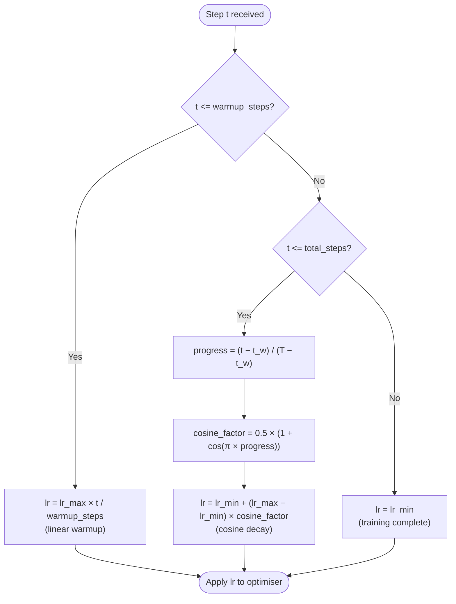
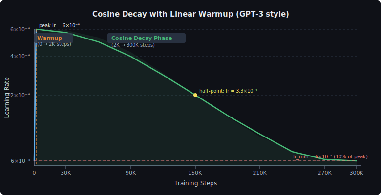
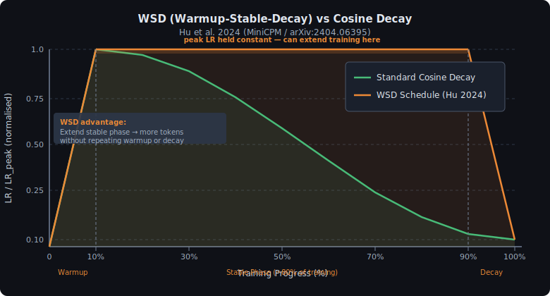

<!-- ============================ TOP NAV ============================ -->
<div align="center">

[🏠 Home](../../README.md) &nbsp;•&nbsp; [📚 Section 3 — Pretraining & Scaling Laws](./README.md) &nbsp;•&nbsp; [⬅️ Q3‑05 — Emergent Abilities](./q05-emergent-abilities.md) &nbsp;•&nbsp; [Q3‑07 — Gradient Clipping ➡️](./q07-gradient-clipping.md)

</div>

---

# Q3‑06 · How are learning rate schedules chosen for LLM pretraining? What is cosine decay with warmup?

<div align="center">


</div>

> [!IMPORTANT]
> **The 20-second answer.** LLM pretraining uses a **linear warmup** (LR rises from 0 to peak over ~1000–4000 steps) followed by **cosine decay** (LR smoothly drops to ~10% of peak over the full training horizon). Warmup is needed because Adam's moment estimates are unreliable early — a large LR before the estimates stabilise causes divergence. Cosine decay avoids the abrupt loss spikes of step schedules, and the final decay phase accounts for a disproportionate share of quality improvement. GPT-3 used a peak LR of 6×10⁻⁴ for the 175 B parameter model (Brown et al. 2020). A newer alternative, Warmup-Stable-Decay (WSD), replaces the cosine taper with a long flat stable phase plus a short cooldown, making it easy to continue training beyond the original horizon without redoing the schedule.

---

## Table of contents

1. [First principles](#1--first-principles)
2. [The problem, told as a story](#2--the-problem-told-as-a-story)
3. [The schedule, precisely](#3--the-schedule-precisely)
4. [Geometric intuition](#4--geometric-intuition)
5. [Peak LR values for known models](#5--peak-lr-values-for-known-models)
6. [The LR-batch-size relationship](#6--the-lr-batch-size-relationship)
7. [Algorithm & pseudocode](#7--algorithm--pseudocode)
8. [Reference implementation](#8--reference-implementation)
9. [Worked numerical example](#9--worked-numerical-example)
10. [The WSD schedule: warmup-stable-decay](#10--the-wsd-schedule-warmup-stable-decay)
11. [Why cosine over step or linear decay](#11--why-cosine-over-step-or-linear-decay)
12. [Interview drill](#12--interview-drill)
13. [Common misconceptions](#13--common-misconceptions)
14. [One-screen summary](#14--one-screen-summary)
15. [References](#15--references)

---

## 1 · First principles

The learning rate (LR) controls **how far the optimiser moves parameters per gradient step**. Too large and parameters overshoot minima; too small and training stalls. During LLM pretraining — which spans hundreds of thousands of steps and billions of tokens — a *fixed* LR is almost never optimal:

- **Early training:** the model is far from any good basin; a moderate LR is needed to cover ground quickly.
- **Mid training:** loss is falling steadily; LR should be held near peak to exploit each gradient efficiently.
- **Late training:** the model is near a good minimum; LR must shrink so parameters can settle into a sharp, low-loss basin rather than oscillating around it.

A **schedule** is a deterministic function LR(t) that governs this progression. The standard choice for LLMs since GPT-2 is **linear warmup + cosine decay**.

---

## 2 · The problem, told as a story

**Why warm up at all?**

Adam maintains exponential moving averages of gradients (first moment, m) and squared gradients (second moment, v). At step 0, both are initialised to zero. The bias-corrected estimates are:

$$\hat{m}_t = \frac{m_t}{1 - \beta_1^t} \qquad \hat{v}_t = \frac{v_t}{1 - \beta_2^t}$$

For the default β₂ = 0.999, the denominator 1 − β₂^t is tiny for small t (e.g., 1 − 0.999¹ = 0.001), so $\hat{v}_t$ is inflated by a factor of ~1000 at step 1. Although the bias-correction formula partially compensates, the *actual* gradient history is too short to form a reliable curvature estimate. If the LR is already at peak, the effective step size is highly noisy and the model can diverge in the first few hundred steps.

**Why decay at the end?**

As training progresses, the model is progressively closer to a local minimum. The gradient magnitudes shrink. A constant LR now overshoots the minimum on every step, causing the loss to plateau slightly above its achievable floor. Decaying the LR allows parameters to converge into the bottom of a sharp minimum — the final 20% of training steps with a cosine schedule often account for a third or more of the total loss reduction.

> [!NOTE]
> **Intuition.** Think of warming up as easing a car onto the highway — you don't floor the accelerator from a standstill. Cosine decay is the off-ramp: you ease off smoothly rather than slamming the brakes.

---

## 3 · The schedule, precisely

Let $t$ denote the current training step, $T$ the total number of training steps, $t_w$ the warmup duration, $\eta_{\max}$ the peak LR, and $\eta_{\min}$ the minimum (final) LR.

**Linear warmup** (0 ≤ t ≤ t_w):

$$\eta(t) = \eta_{\max} \cdot \frac{t}{t_w}$$

**Cosine decay** (t_w < t ≤ T):

$$\eta(t) = \eta_{\min} + \frac{1}{2}\!\left(\eta_{\max} - \eta_{\min}\right)\!\left(1 + \cos\!\left(\frac{\pi\,(t - t_w)}{T - t_w}\right)\right)$$

GPT-3 set $\eta_{\min} = 0.1 \times \eta_{\max}$, so the LR decays to 10% of peak rather than zero. This prevents the optimiser from taking near-zero steps — useful if training continues beyond the original horizon.

The decision logic at each step can be read as a flowchart:



<div align="center">

<br><sub><b>Figure 1.</b> Cosine decay with linear warmup for a GPT-3 style run (300K steps, peak LR = 6e-4, min LR = 6e-5, warmup = 2000 steps). The warmup phase (orange dashed divider) is barely visible at this scale. The half-point occurs at exactly step 150K where LR = (peak + min) / 2 = 3.3e-4. The red dashed line marks the lr_min floor of 6e-5 (10% of peak).</sub>
</div>

---

## 4 · Geometric intuition

The cosine curve sits between two extremes:

- **Constant LR:** never decays — model oscillates near the minimum forever.
- **Linear decay to zero:** LR reaches zero before training ends — last steps do nothing.

Cosine is a smooth interpolation. Its key property is that it decays **slowly at first** (when the model still has useful gradient information to exploit) and **rapidly at the end** (when small refinements matter most):

```
LR fraction at various progress fractions (cosine, lr_min=10% peak):
  Progress 10% → LR ~99% of peak   (still at plateau)
  Progress 25% → LR ~92% of peak
  Progress 50% → LR ~55% of peak   (half-way point)
  Progress 75% → LR ~17% of peak
  Progress 90% → LR ~11% of peak   (approaching floor)
  Progress 100%→ LR =10% of peak   (floor)
```

The shape also means the **gradient of the LR is zero at both ends** — no abrupt step-change, which preserves stability throughout.

---

## 5 · Peak LR values for known models

These values are taken directly from published papers. Peak LR typically **scales inversely with model size**: larger models use smaller peak learning rates.

| Model | Size | Peak LR | Source |
|---|---|---|---|
| GPT-3 Small | 125 M | 6×10⁻⁴ | Brown et al. 2020, Table G.4 |
| GPT-3 Medium | 350 M | 3×10⁻⁴ | Brown et al. 2020, Table G.4 |
| GPT-3 Large | 760 M | 2.5×10⁻⁴ | Brown et al. 2020, Table G.4 |
| GPT-3 XL | 1.3 B | 2×10⁻⁴ | Brown et al. 2020, Table G.4 |
| GPT-3 13B | 13 B | 1×10⁻⁴ | Brown et al. 2020, Table G.4 |
| GPT-3 175B | 175 B | 6×10⁻⁵ | Brown et al. 2020, Table G.4 |
| LLaMA 65B | 65 B | 3×10⁻⁴ | Touvron et al. 2023, §2.1 |
| Chinchilla 70B | 70 B | 1×10⁻⁴ | Hoffmann et al. 2022, Appendix B |

> [!NOTE]
> GPT-3 Table G.4 lists the **6×10⁻⁴** figure as the warmup peak LR for the 6.7B model (the largest model with that value), with the 175B model using **6×10⁻⁵**. The inverse scaling with size is clear: as model size grows 1400×, the peak LR shrinks 10×. This reflects both the larger gradient magnitudes from more parameters and the sharper minima that large models inhabit.

---

## 6 · The LR-batch-size relationship

When training efficiency work scales the per-step batch size B, the LR must be adjusted accordingly. The **linear scaling rule** (Goyal et al. 2017) states:

> When batch size is multiplied by k, multiply the learning rate by k (for SGD).

The intuition: a batch of kB samples provides k times the gradient signal per step, so the step size should be k times larger to match the same effective update magnitude.

For **Adam**, the relationship is less strict because the adaptive per-parameter normalisation partially absorbs batch-size changes. In practice, LLM practitioners often use a **square-root scaling** heuristic:

$$\eta_{\text{new}} = \eta_{\text{base}} \cdot \sqrt{\frac{B_{\text{new}}}{B_{\text{base}}}}$$

> [!WARNING]
> Neither rule is exact for Adam. When doubling batch size, always validate the first few hundred steps of loss trajectory against the baseline — a 5–10% loss increase is a warning sign.

The linear scaling rule also has a **warmup caveat**: the warmup duration should scale with batch size. Goyal et al. recommend keeping warmup proportional to `T_warmup = T_warmup_base * k` when scaling batch by k.

---

## 7 · Algorithm & pseudocode

```text
===== LR SCHEDULE COMPUTATION =====
INPUT : step t, warmup_steps t_w, total_steps T, eta_max, eta_min
OUTPUT: learning rate eta(t)

IF t <= t_w:
    RETURN eta_max * t / t_w            # linear warmup

progress ← (t - t_w) / (T - t_w)       # fraction in [0, 1]
cosine_val ← 0.5 * (1 + cos(π * progress))
RETURN eta_min + (eta_max - eta_min) * cosine_val

===== APPLYING THE SCHEDULE =====
FOR each step t in [0, T]:
    eta ← schedule(t)
    FOR each param_group in optimiser:
        param_group.lr ← eta
    loss ← forward_pass(batch)
    loss.backward()
    optimiser.step()
    optimiser.zero_grad()
```

---

## 8 · Reference implementation

```python
import math


def cosine_lr_with_warmup(
    step: int,
    warmup_steps: int,
    total_steps: int,
    lr_max: float,
    lr_min: float,
) -> float:
    """
    Compute the learning rate at `step` for a cosine decay schedule
    with linear warmup.

    Args:
        step:          Current training step (0-indexed).
        warmup_steps:  Number of linear warmup steps (e.g. 2000).
        total_steps:   Total training steps T (e.g. 300_000).
        lr_max:        Peak learning rate after warmup (e.g. 6e-4).
        lr_min:        Minimum LR at the end of cosine decay (e.g. 6e-5).

    Returns:
        float: learning rate for this step.
    """
    if step < 0 or step > total_steps:
        raise ValueError(f"step={step} out of range [0, {total_steps}]")

    # ── Linear warmup ──────────────────────────────────────────────────
    if step <= warmup_steps:
        return lr_max * step / max(1, warmup_steps)

    # ── Cosine decay ───────────────────────────────────────────────────
    progress = (step - warmup_steps) / max(1, total_steps - warmup_steps)
    cosine_factor = 0.5 * (1.0 + math.cos(math.pi * progress))
    return lr_min + (lr_max - lr_min) * cosine_factor


def get_lr_schedule(
    total_steps: int,
    warmup_steps: int,
    lr_max: float,
    lr_min: float | None = None,
) -> list[float]:
    """
    Return the full LR schedule as a list indexed by step.
    lr_min defaults to 0.1 * lr_max (GPT-3 convention).
    """
    if lr_min is None:
        lr_min = 0.1 * lr_max

    return [
        cosine_lr_with_warmup(t, warmup_steps, total_steps, lr_max, lr_min)
        for t in range(total_steps + 1)
    ]


# ── Example: attach schedule to a PyTorch optimiser ───────────────────
def build_scheduler(optimizer, warmup_steps, total_steps, lr_max, lr_min):
    """
    Wrap the schedule as a PyTorch LambdaLR for drop-in use with a
    training loop.  Assumes the base_lr in the optimiser is set to 1.0
    so that the lambda IS the actual LR.
    """
    from torch.optim.lr_scheduler import LambdaLR

    def lr_lambda(step: int) -> float:
        return cosine_lr_with_warmup(
            step, warmup_steps, total_steps, lr_max, lr_min
        )

    return LambdaLR(optimizer, lr_lambda=lr_lambda)
```

> [!NOTE]
> Setting `base_lr=1.0` in the optimiser and using `LambdaLR` makes the lambda output the **absolute** LR rather than a multiplier, which avoids the confusion of mixing scales. Many codebases instead use `lr_max` as `base_lr` and return a normalised factor from the lambda; both work.

---

## 9 · Worked numerical example

Let us trace through the schedule for a GPT-3 175B-scale training run with the published hyperparameters.

**Setup (from Brown et al. 2020, Table G.4):**

| Hyperparameter | Value |
|---|---|
| Peak LR (η_max) | 6×10⁻⁵ |
| Min LR (η_min) | 6×10⁻⁶ (10% of peak) |
| Warmup steps (t_w) | 375 (from Table G.1, ~0.5% of run) |
| Total steps (T) | ~300 000 (estimated from tokens/batch) |

**Step-by-step LR values:**

| Step t | Phase | Computation | LR |
|---|---|---|---|
| 0 | Warmup | 6×10⁻⁵ × 0/375 | **0** |
| 188 | Warmup | 6×10⁻⁵ × 188/375 | **3.01×10⁻⁵** |
| 375 | End of warmup | 6×10⁻⁵ × 375/375 | **6.00×10⁻⁵** |
| 30 000 | Cosine | progress=0.099; cos(0.099π)=0.951; 6e-6+(6e-5−6e-6)×(1+0.951)/2 | **5.74×10⁻⁵** |
| 150 000 | Cosine (mid) | progress=0.499; cos(0.499π)≈0.002; 6e-6+(5.4e-5)×0.501 | **3.31×10⁻⁵** |
| 270 000 | Cosine | progress=0.899; cos(0.899π)=−0.951; 6e-6+(5.4e-5)×0.024 | **7.30×10⁻⁶** |
| 300 000 | End of cosine | progress=1.0; cos(π)=−1; 6e-6+(5.4e-5)×0 | **6.00×10⁻⁶** |

**Key observation:** from step 270K to 300K (the last 10% of training), the LR drops from 7.3×10⁻⁶ to 6×10⁻⁶ — very little change. Most of the consequential decay happens between steps 100K and 250K where the loss converges most rapidly.

**Second example — GPT-3 6.7B model** (for contrast):

- Peak LR: 1.2×10⁻⁴ (Table G.4)
- Min LR: 1.2×10⁻⁵
- Total tokens: ~300B → ~144K steps at batch size ~2M tokens
- Warmup: 375 steps

At step 72K (50% progress): LR ≈ 6.6×10⁻⁵ (55% of peak) — consistent with the cosine formula.

---

## 10 · The WSD schedule: warmup-stable-decay

Hu et al. (2024), introducing MiniCPM (arXiv:2404.06395), observed a critical problem with cosine decay for **continual pretraining**:

> Once you commit to a cosine schedule with horizon T, you cannot cheaply extend training beyond T without restarting the decay from scratch. The steep final descent "locks in" the schedule.

**WSD (Warmup-Stable-Decay)** solves this by splitting training into three explicit phases:

1. **Warmup:** same linear ramp as standard cosine, typically ~1–5% of total budget.
2. **Stable:** hold LR constant at η_max for the bulk of training (~85–90% of budget). The model trains efficiently at peak LR throughout this phase.
3. **Decay:** a short cosine cooldown lasting ~5–10% of budget, bringing LR from η_max down to η_min.

The **key advantage**: the stable phase acts as a *resumable checkpoint*. If you need to train longer (more data becomes available, or you realise the original budget was too small), you simply extend the stable phase and then apply the same short decay at the end. You do not redo the warmup or change the shape of the cooldown.

Formally, let $T_w$, $T_s$, $T_d$ be the lengths of the warmup, stable, and decay phases:

**Warmup** (0 ≤ t ≤ T_w):

$$\eta(t) = \eta_{\max} \cdot \frac{t}{T_w}$$

**Stable** (T_w < t ≤ T_w + T_s):

$$\eta(t) = \eta_{\max}$$

**Decay** (T_w + T_s < t ≤ T_w + T_s + T_d):

$$\eta(t) = \eta_{\min} + \frac{1}{2}\!\left(\eta_{\max} - \eta_{\min}\right)\!\left(1 + \cos\!\left(\frac{\pi\,(t - T_w - T_s)}{T_d}\right)\right)$$

<div align="center">

<br><sub><b>Figure 2.</b> WSD (Warmup-Stable-Decay, orange) vs standard cosine decay (green) over normalised training progress. Both curves reach the same final LR floor. WSD keeps the LR at peak for ~80% of training and compresses all the decay into the final ~10%. The stable phase can be extended indefinitely to accommodate more training tokens, with the same short cooldown appended at the end. Based on Hu et al. 2024 (MiniCPM).</sub>
</div>

**Does WSD match cosine in final quality?** Hu et al. show that WSD with a 10% decay phase achieves final loss within ~0.1% of a tuned cosine schedule, while offering far more scheduling flexibility. The MiniCPM 2.4B model trained with WSD matches models trained with full cosine decay at each evaluated checkpoint.

---

## 11 · Why cosine over step or linear decay

Before cosine became standard, step decay (multiply LR by 0.1 at fixed milestones) was common in vision (SGD + step decay in ResNet training). For LLMs:

| Schedule | Behaviour | LLM problem |
|---|---|---|
| **Constant LR** | No decay | Loss plateaus well above achievable floor |
| **Step decay** | Sudden 10× drop at milestones | Abrupt loss spike / instability spike at each step |
| **Linear decay** | Reaches zero exactly at T | LR hits zero before training ends; final steps are wasted |
| **Cosine decay** | Smooth, derivative=0 at endpoints | No abrupt jumps; graceful approach to floor |
| **Polynomial decay** | Configurable shape | Requires tuning the exponent; cosine is a known-good default |

The original Transformer paper (Vaswani et al. 2017) used a *warmup + inverse-square-root decay*, which also works well for smaller models. Cosine was popularised for LLMs by the GPT-2 paper (Radford et al. 2019) and is now the dominant choice.

**Loshchilov & Hutter (2017)** formalised cosine annealing (SGDR) in the context of SGD with warm restarts, showing that cosine-shaped LR cycles improve generalisation. The LLM community adopted cosine without the periodic restarts — a single long cosine from peak to floor.

---

## 12 · Interview drill

<details>
<summary><b>Q: Why does Adam need a warmup but SGD does not (or needs it less)?</b></summary>

Adam's second-moment estimate v_t is zero-initialised and approaches the true curvature estimate only after hundreds of steps (due to the β₂=0.999 exponential averaging). With a high LR from step 0, the effective update step |m̂_t| / √(v̂_t + ε) is dominated by the inflated v̂_t correction factor and can be numerically unstable in early steps. SGD has no such state — it simply takes a step in the gradient direction — so it is less sensitive to initial LR spikes (though large initial LR still causes instability for deep networks).
</details>

<details>
<summary><b>Q: At what fraction of training does the cosine schedule reach 50% of peak LR?</b></summary>

The cosine schedule reaches 50% of peak (with lr_min=10% peak) at progress p where:

0.1 + 0.5×0.9×(1+cos(π×p)) = 0.5 → 0.5×0.9×(1+cos(πp)) = 0.4 → (1+cos(πp)) = 0.889 → cos(πp) = −0.111 → πp ≈ 1.681 → p ≈ 0.535.

So roughly **53.5% through training**, i.e., slightly past the midpoint. For lr_min=0 it would be exactly 50%.
</details>

<details>
<summary><b>Q: You finish 90% of a planned 300K-step run and want to extend to 450K steps. What do you do with a cosine schedule vs WSD?</b></summary>

**Cosine:** You have a problem. Your schedule was designed for T=300K, so at step 270K the LR is already below 10% of peak. If you continue to 450K with the old schedule, you train the extra 150K steps at near-zero LR (negligible gradient signal). You would need to reset the schedule — either use a new cosine from t=270K to t=450K (requiring warmup again) or accept degraded efficiency.

**WSD:** If you are still in the stable phase (which by design runs to ~90% of the budget, i.e., t≈270K), you simply **extend the stable phase** from 270K to 420K, then apply the same 10% cosine cooldown (30K steps) at the end. No warmup needed. The model trains at peak LR throughout the extension, then gets a proper cooldown. This is the central argument of Hu et al. 2024.
</details>

<details>
<summary><b>Q: GPT-3 uses a warmup of only 375 steps for a 175B model. Why so short?</b></summary>

Brown et al. (2020) Table G.1 reports 375 warmup steps for the 175B run. With a batch size of ~3.2M tokens and 2048-token sequences, one step processes ~1500 sequences — so 375 warmup steps covers ~562K sequences or ~1.15B tokens. The Adam second-moment estimates for the 175B model parameters stabilise much faster than for small models because the parameter count dilutes the per-step gradient norms. Also, with a peak LR of only 6×10⁻⁵ (very small for such a large model), even an abruptly applied peak LR would not cause severe instability.
</details>

<details>
<summary><b>Q: Does the cosine decay floor have to be non-zero? What happens if lr_min=0?</b></summary>

Setting lr_min=0 means the LR decays to exactly zero at step T. This is mathematically valid and used in some runs. The downside: the last several thousand steps have essentially zero LR and do minimal useful work. GPT-3 and most production runs use lr_min=10% of peak specifically to ensure the optimiser remains active through the final steps. If training is continued after step T (rare for cosine), having lr_min>0 also avoids starting from a dead stop. In practice, the difference between lr_min=0 and lr_min=0.1×lr_max in final perplexity is small but measurable.
</details>

<details>
<summary><b>Q: How does the linear scaling rule (Goyal et al. 2017) apply in practice for LLMs?</b></summary>

Goyal et al. proved the linear scaling rule for SGD: LR should scale linearly with batch size to maintain the same expected weight update per token. For Adam, the situation is murkier because the second-moment normalisation already adapts to gradient magnitudes. Empirically, LLM practitioners use the rule as a starting point and then validate early loss curves. Typical practice: if doubling batch size B→2B, try 1.4×LR (sqrt(2) scaling) or 2×LR (linear scaling), run 1K steps, and check that loss matches the un-scaled baseline. The warmup duration should also scale: warmup_new ≈ warmup_old × (B_new/B_old).
</details>

---

## 13 · Common misconceptions

| Misconception | Reality |
|---|---|
| "The cosine schedule is always better than step decay." | For image classification with SGD, step decay often matches or beats cosine. Cosine's advantage is specific to Adam-based long-horizon language model training. |
| "Warmup length must be thousands of steps." | GPT-3 175B uses only 375 warmup steps. Warmup length depends on peak LR magnitude — a very small peak LR (6×10⁻⁵) stabilises quickly. |
| "Larger models always use larger learning rates." | The opposite is true: peak LR scales *inversely* with model size. GPT-3 uses 6×10⁻⁴ for 125M but 6×10⁻⁵ for 175B — a 10× decrease for a 1400× size increase. |
| "The final decay phase is a formality." | The cosine decay phase accounts for a disproportionate fraction of final quality. Models evaluated before the decay is complete are measurably worse on standard benchmarks. |
| "WSD is only useful for continual pretraining." | WSD also simplifies checkpoint selection — because the stable phase produces a series of checkpoints all trained at peak LR, they are more comparable to each other than cosine-schedule checkpoints at different stages. |
| "lr_min=0 and lr_min=0.1×lr_max give the same final model." | They differ: lr_min=0 wastes the last steps; lr_min=0.1×lr_max ensures the optimiser stays active. The difference is small but reproducible. |

---

## 14 · One-screen summary

> **What:** A cosine decay with linear warmup schedule controls the learning rate over the full training run. LR rises linearly from 0 to η_max over the first t_w steps (warmup), then follows a smooth cosine curve from η_max down to η_min = 0.1×η_max.
>
> **Why warmup:** Adam's moment estimates are unreliable at training start; a high LR before they stabilise causes divergence.
>
> **Why cosine:** Smooth monotone decay with zero derivative at both endpoints avoids instability, outperforms step decay for LLM training, and allows the model to settle into a sharp minimum during the final phase.
>
> **Peak LR values (published):** GPT-3 175B: 6×10⁻⁵; GPT-3 125M: 6×10⁻⁴; LLaMA 65B: 3×10⁻⁴; Chinchilla 70B: 1×10⁻⁴. Larger models use smaller peak LR.
>
> **WSD alternative (Hu et al. 2024):** Warmup → long stable phase at η_max → short (~10%) cosine cooldown. Key advantage: the stable phase is resumable — training can be extended without redoing the schedule.

---

## 15 · References

1. Brown, T. et al. — **Language Models are Few-Shot Learners** (GPT-3). *NeurIPS 2020 / arXiv:2005.14165.* — Table G.1 and G.4 report warmup steps and peak LR for all GPT-3 model sizes; the primary source for published peak LR values.

2. Touvron, H. et al. — **LLaMA: Open and Efficient Foundation Language Models**. *arXiv:2302.13971, 2023.* — Section 2.1 reports peak LR of 3×10⁻⁴ for the 65B model with cosine decay to 10% of peak.

3. Hoffmann, J. et al. — **Training Compute-Optimal Large Language Models** (Chinchilla). *NeurIPS 2022 / arXiv:2203.15556.* — Appendix B reports peak LR of 1×10⁻⁴ for the 70B Chinchilla model.

4. Hu, S. et al. — **MiniCPM: Unveiling the Potential of Small Language Models with Scalable Training Strategies**. *arXiv:2404.06395, 2024.* — introduces the Warmup-Stable-Decay (WSD) schedule and validates its flexibility for continual pretraining.

5. Loshchilov, I., Hutter, F. — **SGDR: Stochastic Gradient Descent with Warm Restarts**. *ICLR 2017 / arXiv:1608.03983.* — formalises cosine annealing for LR scheduling; the foundational paper for cosine LR curves in deep learning.

6. Goyal, P. et al. — **Accurate, Large Minibatch SGD: Training ImageNet in 1 Hour**. *arXiv:1706.02677, 2017.* — establishes the linear scaling rule (scale LR proportionally with batch size); Section 2 and the warmup discussion are directly applicable to LLM batch scaling.

7. Vaswani, A. et al. — **Attention Is All You Need**. *NeurIPS 2017 / arXiv:1706.03762.* — introduced the warmup + inverse-square-root decay schedule; the predecessor to cosine decay for Transformer training.

8. Radford, A. et al. — **Language Models are Unsupervised Multitask Learners** (GPT-2). *OpenAI 2019.* — popularised cosine LR schedule for language model pretraining.

9. Kingma, D. P., Ba, J. — **Adam: A Method for Stochastic Optimization**. *ICLR 2015 / arXiv:1412.6980.* — defines the Adam optimiser and its bias-correction mechanism; explains why moment estimates are unreliable early in training.

10. Zhai, X. et al. — **Scaling Vision Transformers**. *CVPR 2022 / arXiv:2106.04560.* — systematic comparison of LR schedules for large-scale ViT training; confirms cosine decay robustness at scale.

11. Wortsman, M. et al. — **Small-scale proxies for large-scale Transformer training instabilities**. *arXiv:2309.14322, 2023.* — analyses LR-induced instabilities in LLM pretraining; relevant to warmup design and peak LR selection.

---

<!-- ============================ BOTTOM NAV ============================ -->
<div align="center">

[⬅️ Q3‑05 — Emergent Abilities](./q05-emergent-abilities.md) &nbsp;|&nbsp; [📚 Back to Section 3](./README.md) &nbsp;|&nbsp; [🏠 Home](../../README.md) &nbsp;|&nbsp; [Q3‑07 — Gradient Clipping ➡️](./q07-gradient-clipping.md)

<sub>Found an error or have a sharper intuition? See <a href="../../CONTRIBUTING.md">CONTRIBUTING</a> — answers follow the <a href="../../_TEMPLATE.md">answer template</a>.</sub>

</div>
