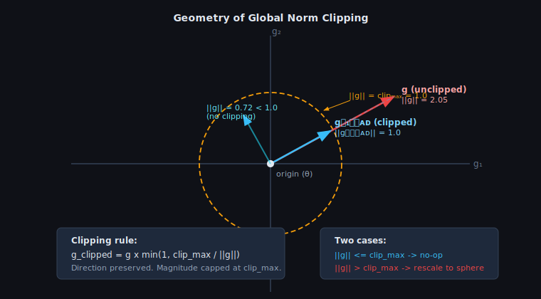
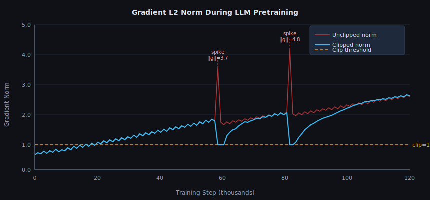
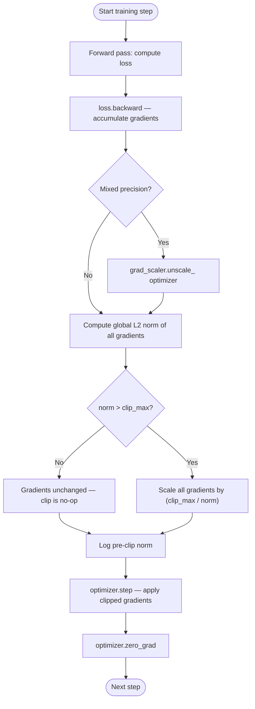

<!-- ============================ TOP NAV ============================ -->
<div align="center">

[🏠 Home](../../README.md) &nbsp;•&nbsp; [📚 Section 3 — Pretraining & Scaling Laws](./README.md) &nbsp;•&nbsp; [⬅️ Q3‑06 — Learning Rate Schedules](./q06-lr-schedule.md) &nbsp;•&nbsp; [Q3‑08 — Chinchilla Derivation ➡️](./q08-chinchilla-derivation.md)

</div>

---

# Q3‑07 · What is gradient clipping and why is it essential for LLM training stability?

<div align="center">


</div>

> [!IMPORTANT]
> **The 20-second answer.** Gradient clipping prevents **exploding gradients** from destroying a training run. If the global L2 norm of all parameter gradients exceeds a threshold (universally set to **1.0** in GPT-3, LLaMA, Chinchilla, and PaLM), every gradient is rescaled so the norm equals exactly that threshold — the **direction is preserved, only the magnitude is capped**. Without clipping, a single bad batch can push parameters into a broken region from which the loss never recovers. With clipping, the maximum step size in parameter space is bounded regardless of how large the raw gradient is.

---

## Table of contents

1. [First principles](#1--first-principles)
2. [The problem: gradient explosion in deep networks](#2--the-problem-gradient-explosion-in-deep-networks)
3. [Global norm clipping — the standard algorithm](#3--global-norm-clipping--the-standard-algorithm)
4. [How clipping interacts with Adam](#4--how-clipping-interacts-with-adam)
5. [Clip values used in major LLMs](#5--clip-values-used-in-major-llms)
6. [Gradient norm as a monitoring signal](#6--gradient-norm-as-a-monitoring-signal)
7. [Value clipping vs norm clipping](#7--value-clipping-vs-norm-clipping)
8. [Connection to loss spikes and recovery](#8--connection-to-loss-spikes-and-recovery)
9. [Algorithm and pseudocode](#9--algorithm-and-pseudocode)
10. [Reference implementation](#10--reference-implementation)
11. [Worked numerical example](#11--worked-numerical-example)
12. [Interview drill](#12--interview-drill)
13. [Common misconceptions](#13--common-misconceptions)
14. [One-screen summary](#14--one-screen-summary)
15. [References](#15--references)

---

## 1 · First principles

A neural network is trained by gradient descent: at each step the optimizer uses the gradient of the loss with respect to every parameter to decide how to update those parameters. The key assumption is that the gradient is a **reliable local signal** — it points in the direction of steepest ascent, and taking a small step in the opposite direction will reduce the loss.

This assumption breaks when the gradient is **abnormally large**. If the gradient norm is hundreds of times its typical value, the "small step" becomes a large step, overshooting the loss landscape region where the gradient was informative. The result is a **loss spike**: the loss jumps upward, parameters land in a bad region, and the model may never fully recover.

For large language models trained over hundreds of billions of tokens, even a single such event can compromise the entire run. Gradient clipping is a lightweight, one-line fix: **cap the norm before passing the gradient to the optimizer**.

---

## 2 · The problem: gradient explosion in deep networks

**Why do gradients explode?** Backpropagation through a deep network multiplies Jacobian matrices at each layer. If those Jacobians have singular values greater than 1, repeated multiplication causes exponential growth in the gradient norm — the same mechanism as compound interest. Pascanu et al. (2013) formalized this for RNNs, but Transformers are not immune.

In LLM pretraining, gradient explosions arise from several causes:

- **Rare or adversarial token sequences.** A batch that contains an unusual distribution (e.g., a document full of rare Unicode characters, a corrupted web page, or a code snippet with deeply nested structures) can produce gradients that are far outside the normal distribution.
- **Data quality issues.** Near-duplicate data or mislabelled documents can create an inconsistent loss signal that the optimizer interprets as a large gradient.
- **Training near saddle points.** The loss landscape of a Transformer has regions where the curvature changes rapidly. Passing through such a region can transiently produce very large gradients.
- **Learning rate too high early in training.** Before the second moment estimate in Adam has warmed up, the effective learning rate per parameter is poorly calibrated. A large gradient in this regime can produce a destructive update.

The consequence is the same regardless of cause: the gradient has a very large L2 norm, the optimizer takes a large step, and the parameters land somewhere unhelpful. For SGD this is bad; for Adam, as we will see in Section 4, it is potentially even worse.

---

## 3 · Global norm clipping — the standard algorithm

**Definition.** Let $\mathbf{g}$ be the concatenation of all gradient tensors for all parameters, treated as a single flat vector. Its **global L2 norm** is:

$$\|\mathbf{g}\|_2 = \sqrt{\sum_{i} g_i^2}$$

**Clipping rule.** Given a threshold $c$ (the "clip value"), the clipped gradient is:

$$\mathbf{g}_{\text{clipped}} = \mathbf{g} \cdot \min\!\left(1,\; \frac{c}{\|\mathbf{g}\|_2}\right)$$

In words: if the norm is already at or below $c$, do nothing. If it exceeds $c$, rescale the entire gradient vector so its norm equals exactly $c$.

**Key property:** the clipping operation is a **projection onto an L2 ball** of radius $c$. It changes the magnitude but not the direction. The ratio of any two gradient components is preserved:

$$\frac{(g_{\text{clipped}})_i}{(g_{\text{clipped}})_j} = \frac{g_i}{g_j}$$

This is why norm clipping is preferred over elementwise clipping — see Section 7.

<div align="center">

<br><sub><b>Figure 2.</b> Geometry of global norm clipping. The unclipped gradient (red) has ||g|| = 2.05, well outside the clip sphere at radius 1.0. The clipped gradient (blue) points in exactly the same direction but has ||g|| = 1.0. A vector already inside the sphere (cyan, ||g|| = 0.72) passes through unchanged.</sub>
</div>

---

## 4 · How clipping interacts with Adam

Adam (Kingma and Ba, 2015) maintains a **second moment estimate** $\mathbf{v}_t$ that approximates $\mathbb{E}[g_t^2]$ with exponential decay:

$$\mathbf{v}_t = \beta_2\, \mathbf{v}_{t-1} + (1 - \beta_2)\, \mathbf{g}_t^2$$

The effective per-parameter learning rate is $\alpha / \sqrt{\hat{\mathbf{v}}_t}$, where $\hat{\mathbf{v}}_t$ is the bias-corrected second moment. Adam's key property is that it normalizes gradients by their own historical variance — parameters with historically large gradients get a smaller effective learning rate, providing natural per-parameter scale invariance.

**The problem with unclipped spikes under Adam.** Suppose at step $t$ a spike occurs and $g_t$ for some parameter is suddenly 100× its typical value. The second moment estimate $v_t$ adapts only as fast as $1 - \beta_2$; with $\beta_2 = 0.95$ (used in PaLM) or $\beta_2 = 0.999$, the estimate barely moves in one step. The update for that parameter is:

$$\Delta\theta = -\alpha \cdot \frac{g_t}{\sqrt{v_{t-1}} + \epsilon}$$

Since $v_{t-1}$ reflects the **pre-spike** distribution, the denominator is small, and the numerator is 100× larger than usual. The effective update is enormous — Adam's normalization, which normally protects against large gradients, fails precisely when the gradient is largest because the denominator hasn't adapted yet.

**Clipping prevents this.** By capping $\|\mathbf{g}\|_2$ before Adam sees it, we ensure the numerator in Adam's update is bounded regardless of the raw gradient. The second moment estimate is also updated with the clipped gradient, so the next step's denominator reflects the clipped value rather than the spike.

> [!NOTE]
> This interaction is part of why gradient clipping is considered **mandatory** rather than optional for LLM training. SGD would partially self-correct because the next gradient would cancel part of the bad step. Adam does not have this self-correcting property — a bad step under Adam can permanently shift parameter values into a poor region.

---

## 5 · Clip values used in major LLMs

Virtually every large language model uses a clip value of **1.0**. This is not a coincidence — it reflects the community's convergence on a value that is tight enough to prevent spikes but loose enough that routine gradients are never clipped.

| Model | Clip value | Source |
|---|---|---|
| GPT-3 (175B) | 1.0 | Brown et al. (2020), §A |
| LLaMA 1 & 2 (7B–70B) | 1.0 | Touvron et al. (2023a, 2023b) |
| Chinchilla (70B) | 1.0 | Hoffmann et al. (2022) |
| PaLM (540B) | 1.0 | Chowdhery et al. (2022), §A |
| Gopher (280B) | 1.0 | Rae et al. (2021) |
| GPT-NeoX-20B | 1.0 | Black et al. (2022) |

There is no known large LLM that uses a clip value above 1.0 for the global norm. Smaller values (e.g., 0.5) have been used in some fine-tuning recipes, but pretraining universally uses 1.0.

> [!WARNING]
> The clip value refers to the **global gradient norm**, not per-layer norms or elementwise values. Setting `max_norm=1.0` in PyTorch's `clip_grad_norm_` clips the norm of all parameters jointly, not each parameter individually.

---

## 6 · Gradient norm as a monitoring signal

Beyond its role in preventing explosions, the gradient norm is one of the most informative signals for **diagnosing training health**.

<div align="center">

<br><sub><b>Figure 1.</b> Gradient L2 norm during LLM pretraining. Unclipped norm (red) shows spikes at training steps ~44k (||g|| = 3.7) and ~88k (||g|| = 4.8). The clipped norm (blue) is bounded at 1.0 during spike events. Overall, the typical norm decreases as the model converges. Routine fluctuation of +/- 20% around the baseline is normal; spikes exceeding 3x baseline warrant investigation of recent data batches.</sub>
</div>

**Interpreting gradient norm behaviour:**

| Observed pattern | Likely interpretation |
|---|---|
| Steady decrease over training | Normal convergence — the loss basin is becoming flatter |
| Routine fluctuations up to 2× baseline | Normal — batch-to-batch variation in gradient magnitude |
| Spike to 3–5× baseline, norm recovers quickly | Occasional hard batch; clipping handles it gracefully |
| Spike to >10× baseline | Likely data quality issue or near-saddle-point; worth logging the batch |
| Persistent high norm with no decrease | Possible learning rate too high, or fundamental instability |
| Norm suddenly drops to near zero | Possible vanishing gradient (check layer norms, attention weights) |

In practice, every major LLM training infrastructure logs the pre-clip gradient norm at every step. It is treated as the **primary diagnostic for training instability**.

---

## 7 · Value clipping vs norm clipping

There are two flavours of gradient clipping. They look similar but behave very differently:

**Elementwise value clipping** clips each gradient component independently:

$$g_i^{\text{clipped}} = \text{clip}(g_i,\, -c,\, c) = \max(-c,\, \min(c,\, g_i))$$

**Global norm clipping** (the LLM standard) scales the entire gradient vector:

$$\mathbf{g}^{\text{clipped}} = \mathbf{g} \cdot \min\!\left(1,\, \frac{c}{\|\mathbf{g}\|_2}\right)$$

The difference matters:

| Property | Value clipping | Norm clipping |
|---|---|---|
| Direction preserved? | No — components with large magnitude are clipped, others are not; the direction changes | Yes — all components scaled by the same factor |
| Simple to implement | Yes | Yes (one extra norm computation) |
| Handles correlated large gradients | Poor — treats each gradient independently | Well — scales the joint gradient vector |
| Risk of inconsistent updates | High — different parameters see different scales | Low — all parameters scaled identically |
| Standard for LLMs | No | Yes |

> [!NOTE]
> Value clipping was common in early RNN training (particularly LSTMs) where it was used as a quick fix. Norm clipping became the standard as the community understood that preserving gradient direction is important for optimization geometry.

---

## 8 · Connection to loss spikes and recovery

A **loss spike** is an abrupt upward jump in training loss — typically 0.1–0.5 nats above the smooth loss curve — followed by a slow (often incomplete) recovery. Loss spikes are a major concern in LLM pretraining: they waste compute, can corrupt the model's learned representations, and at worst can cause divergence.

**How clipping prevents spikes.** Gradient clipping bounds the maximum displacement in parameter space per step. If the gradient is clipped at $c = 1.0$ and the learning rate is $\alpha$, the maximum norm of the parameter update under SGD is:

$$\|\Delta\theta\|_2 \leq \alpha \cdot c = \alpha$$

Under Adam the bound is softer (because of the normalization by $\sqrt{v}$), but clipping still prevents the most extreme updates.

**When spikes still occur despite clipping.** Clipping at 1.0 does not guarantee zero spikes. A sustained period of high-norm gradients (where the norm is, say, 1.0 every step for 1000 consecutive steps in a consistently difficult region of the loss landscape) can still produce net drift. In practice, spikes that survive clipping at 1.0 are almost always caused by:

1. A learning rate that is too high for the current phase of training.
2. A corrupted or anomalous data shard.
3. An interaction with the learning rate schedule (e.g., the moment the cosine decay bottoms out and restarts, or a warmup that is too aggressive).

**Standard recovery procedure.** When a loss spike is detected:

1. Roll back to the last clean checkpoint (typically the one saved just before the spike).
2. Identify and remove the offending data batch if possible.
3. Restart training from the checkpoint, skipping the bad batch.
4. Consider temporarily halving the learning rate for a few thousand steps.

Gradient clipping is the first line of defence; checkpoint rollback is the fallback. Together they are the industry-standard protocol for training stability (see Chowdhery et al., 2022; Hoffmann et al., 2022).

---

## 9 · Algorithm and pseudocode

The training step with gradient clipping follows a strict ordering — the clip must happen after backward but before the optimizer step:



```text
===== GLOBAL NORM CLIPPING =====
INPUT : parameter list params, clip threshold c
OUTPUT: params with clipped gradients (in place)

1.  total_norm ← 0
    FOR p IN params:
        IF p.grad IS NOT None:
            total_norm ← total_norm + sum(p.grad ** 2)
    total_norm ← sqrt(total_norm)         # global L2 norm

2.  IF total_norm > c:
        scale ← c / total_norm
        FOR p IN params:
            IF p.grad IS NOT None:
                p.grad ← p.grad * scale   # rescale in place

3.  RETURN total_norm                     # log this value

===== TRAINING STEP WITH CLIPPING =====
1.  loss = model(batch)                   # forward pass
2.  loss.backward()                       # compute gradients
3.  norm = clip_grad_norm(params, c=1.0)  # clip and record norm
4.  optimizer.step()                      # apply (clipped) gradient
5.  optimizer.zero_grad()                 # reset for next step
6.  log("grad_norm", norm)                # monitor for spikes
```

> [!NOTE]
> Step 6 — logging the norm — is not optional in production training. The norm time series is the primary diagnostic for detecting data quality issues, learning rate problems, and incipient instability. Logging it costs negligible compute (one scalar per step).

---

## 10 · Reference implementation

```python
import torch
import torch.nn as nn
from torch.optim import AdamW
from typing import Iterable

def compute_global_norm(parameters: Iterable[nn.Parameter]) -> float:
    """
    Compute the global L2 norm of all parameter gradients.

    This replicates what PyTorch does internally in clip_grad_norm_,
    exposed here for monitoring purposes.

    Returns:
        total_norm (float): the global gradient norm before clipping.
    """
    total_norm_sq = 0.0
    for p in parameters:
        if p.grad is not None:
            total_norm_sq += p.grad.detach().float().norm(2).item() ** 2
    return total_norm_sq ** 0.5


def training_step_with_clipping(
    model: nn.Module,
    optimizer: AdamW,
    batch: dict,
    clip_max: float = 1.0,
    grad_scaler=None,  # optional: torch.cuda.amp.GradScaler for BF16/FP16
) -> dict:
    """
    One training step with global norm clipping.

    Args:
        model:       the language model (nn.Module).
        optimizer:   AdamW optimizer (or any torch optimizer).
        batch:       dict with 'input_ids' and 'labels'.
        clip_max:    gradient clipping threshold (default 1.0 — matches
                     GPT-3, LLaMA, Chinchilla, PaLM).
        grad_scaler: optional GradScaler for mixed-precision training.

    Returns:
        dict with 'loss' and 'grad_norm' for logging.
    """
    # ---- Forward pass ------------------------------------------------
    outputs = model(**batch)
    loss = outputs.loss

    # ---- Backward pass -----------------------------------------------
    if grad_scaler is not None:
        grad_scaler.scale(loss).backward()
        # Must unscale before clipping so the norm is in the original
        # gradient space, not the scaled space.
        grad_scaler.unscale_(optimizer)
    else:
        loss.backward()

    # ---- Gradient clipping -------------------------------------------
    # Returns the norm BEFORE clipping (useful for logging).
    # All gradients are rescaled in place if norm > clip_max.
    grad_norm = torch.nn.utils.clip_grad_norm_(
        model.parameters(),
        max_norm=clip_max,
        norm_type=2.0,  # L2 norm (standard for LLMs)
    ).item()

    # ---- Optimizer step ----------------------------------------------
    if grad_scaler is not None:
        grad_scaler.step(optimizer)
        grad_scaler.update()
    else:
        optimizer.step()

    optimizer.zero_grad()

    return {"loss": loss.item(), "grad_norm": grad_norm}


# ---- Minimal usage example ------------------------------------------
if __name__ == "__main__":
    from transformers import AutoModelForCausalLM, AutoTokenizer

    model = AutoModelForCausalLM.from_pretrained("gpt2")
    optimizer = AdamW(model.parameters(), lr=3e-4, weight_decay=0.1)
    tokenizer = AutoTokenizer.from_pretrained("gpt2")

    text = "Gradient clipping stabilizes LLM training."
    enc = tokenizer(text, return_tensors="pt")
    enc["labels"] = enc["input_ids"].clone()

    metrics = training_step_with_clipping(model, optimizer, enc, clip_max=1.0)
    print(f"loss={metrics['loss']:.4f}  grad_norm={metrics['grad_norm']:.4f}")
    # If grad_norm > 1.0 before clip, it will be reported as the pre-clip value.
    # The gradients applied to the optimizer will already be rescaled.
```

> [!WARNING]
> When using mixed-precision training (BF16 or FP16 with a `GradScaler`), **always call `grad_scaler.unscale_(optimizer)` before `clip_grad_norm_`**. If you clip the scaled gradients, you are clipping a gradient that has been multiplied by the loss scale (often 65536), making the clip threshold meaningless. The call to `unscale_` converts gradients back to the original scale first.

---

## 11 · Worked numerical example

### Setup

Consider a small model with 3 parameter tensors. After a backward pass on a difficult batch, the raw (pre-clip) gradients have the following L2 norms per tensor:

| Parameter tensor | Shape | Gradient L2 norm |
|---|---|---|
| `embedding.weight` | (32000, 512) | 0.72 |
| `transformer.h.0.attn.c_attn.weight` | (512, 1536) | 1.61 |
| `lm_head.weight` | (32000, 512) | 0.44 |

### Step 1: Compute global norm

$$\|\mathbf{g}\|_2 = \sqrt{0.72^2 + 1.61^2 + 0.44^2}$$

$$= \sqrt{0.5184 + 2.5921 + 0.1936}$$

$$= \sqrt{3.3041}$$

$$\approx 1.818$$

### Step 2: Check against threshold

The global norm is 1.818, which exceeds `clip_max = 1.0`. Clipping will fire.

### Step 3: Compute scale factor

$$\text{scale} = \frac{c}{\|\mathbf{g}\|_2} = \frac{1.0}{1.818} \approx 0.550$$

### Step 4: Apply scale to every gradient tensor

| Parameter tensor | Original norm | Scaled norm | Clipped? |
|---|---|---|---|
| `embedding.weight` | 0.72 | 0.72 × 0.550 = **0.396** | Yes (scaled down) |
| `transformer.h.0.attn.c_attn.weight` | 1.61 | 1.61 × 0.550 = **0.885** | Yes (scaled down) |
| `lm_head.weight` | 0.44 | 0.44 × 0.550 = **0.242** | Yes (scaled down) |

### Step 5: Verify global norm after clipping

$$\|\mathbf{g}_{\text{clipped}}\|_2 = \sqrt{0.396^2 + 0.885^2 + 0.242^2}$$

$$= \sqrt{0.1568 + 0.7832 + 0.0586}$$

$$= \sqrt{0.9986}$$

$$\approx 0.999 \approx 1.0 \checkmark$$

### Interpretation

- The attn weight gradient, which was responsible for most of the global norm, was reduced from 1.61 to 0.885 — still the largest, but now a proportional share of a bounded total.
- The **direction** of each gradient tensor is unchanged: only the magnitude was scaled.
- The optimizer (Adam) sees gradients with the same relative structure, just uniformly smaller.

### Counter-example: no clipping fires

If instead the per-tensor norms were 0.42, 0.71, and 0.38, the global norm would be:

$$\|\mathbf{g}\|_2 = \sqrt{0.42^2 + 0.71^2 + 0.38^2} = \sqrt{0.1764 + 0.5041 + 0.1444} = \sqrt{0.8249} \approx 0.908$$

Since 0.908 < 1.0, `min(1, 1.0/0.908) = min(1, 1.101) = 1` — no scaling occurs. This is the typical case during most steps of a healthy training run.

---

## 12 · Interview drill

<details>
<summary><b>Q: Why does norm clipping preserve gradient direction while value clipping does not?</b></summary>

Norm clipping multiplies every component of the gradient vector by the same scalar factor `min(1, c / ||g||)`. Since all components are scaled identically, the unit vector `g / ||g||` is unchanged — the direction is preserved. Value clipping clips each component independently to `[-c, c]`. If one component is large and gets clipped while another is small and does not, the ratio between them changes, which changes the direction of the gradient vector. In optimization geometry, the direction of the gradient carries information about which parameters need to move relative to each other; changing it can steer the model in the wrong direction.
</details>

<details>
<summary><b>Q: Why does gradient clipping interact badly with Adam if you clip after the optimizer step?</b></summary>

Clipping must happen **before** the optimizer step, not after. The optimizer receives the gradient and uses it to update parameters. If you clip after the optimizer has already applied the gradient, the parameters have already moved — the clip is a no-op for the current step. Additionally, Adam's second moment estimate `v_t` is updated with the **raw** (unclipped) gradient; if the spike is not clipped before Adam sees it, both the parameter update and the running second moment estimate will reflect the anomalous spike value. The standard convention in PyTorch is: backward → clip_grad_norm_ → optimizer.step().
</details>

<details>
<summary><b>Q: What clip value should you use? Why is 1.0 universal for LLMs?</b></summary>

The value 1.0 has become universal for a few reasons. First, empirically it works — every major LLM from GPT-3 through LLaMA 2, Chinchilla, and PaLM uses it, and none of these papers report the clip firing frequently during healthy training. Second, 1.0 is a natural scale: with the AdamW parameter initialization and learning rates used in practice (1e-4 to 3e-4), a norm of 1.0 corresponds to a modest but meaningful gradient signal. A value of 0.1 would clip too aggressively and slow learning; a value of 10.0 would not protect against the spikes that actually occur in practice. Third, the LLM community has converged on 1.0 as a default, so it is well-tested and any deviation from it should be justified.
</details>

<details>
<summary><b>Q: Can gradient clipping hurt training? Are there downsides?</b></summary>

In principle, clipping reduces the gradient magnitude whenever the norm exceeds the threshold, which can slow learning if the threshold is too tight. In practice this is rarely a problem with `clip_max=1.0` because healthy training gradients have norms well below 1.0 for most of training. The main downside is that clipping can mask a structural problem: if the gradient norm is persistently at or above the clip threshold, that is a signal the model or optimizer is poorly configured — clipping suppresses the symptom without fixing the cause. Logging the pre-clip norm is essential for catching this situation.
</details>

<details>
<summary><b>Q: What is the difference between gradient clipping and gradient penalty (as in Wasserstein GAN)?</b></summary>

These are related but distinct techniques. Gradient clipping is a training-time intervention: it rescales the gradient before each optimizer step to prevent large updates. Gradient penalty (used in WGAN-GP, Gulrajani et al. 2017) is a **loss function term** that adds a penalty for gradient norms far from 1.0, encouraging the network to learn a Lipschitz-1 function. Gradient penalty changes what the network learns; gradient clipping only changes how fast it learns at each step. For LLMs, only gradient clipping is used.
</details>

<details>
<summary><b>Q: A colleague says "our gradient norms are always 0.3, way below 1.0 — we can disable clipping." How do you respond?</b></summary>

Disable it only if you can guarantee that norm will never spike. In practice, "always 0.3" describes the **median** behaviour, not the tail. Over a training run of 500 billion tokens, even a 0.01% probability of a spike implies 500,000 bad batches. LLM training corpora are noisy; data quality is never perfect. The cost of gradient clipping is essentially zero (one extra norm computation per step), while the cost of a single unclipped spike can be hours or days of wasted compute plus a difficult recovery. Leaving clipping on is the correct engineering decision even when it never fires.
</details>

---

## 13 · Common misconceptions

| Misconception | Reality |
|---|---|
| "Gradient clipping is only needed for RNNs." | It was first proposed for RNNs (Pascanu et al. 2013) but is universally used for Transformer LLMs. GPT-3, LLaMA, PaLM, and Chinchilla all use it. |
| "Clipping the gradient means the model learns more slowly." | Only if the clip fires frequently. In healthy training, the norm is below 1.0 most of the time and clipping is a no-op. |
| "Value clipping and norm clipping are equivalent." | They are not. Value clipping changes gradient direction; norm clipping preserves it. LLMs use norm clipping. |
| "Gradient clipping prevents all loss spikes." | It reduces their severity and frequency but cannot eliminate all spikes. Checkpoint rollback is still needed for major spikes. |
| "You should tune the clip value carefully for each run." | In practice 1.0 is used without tuning across models ranging from 7B to 540B parameters, and it works. |
| "Clipping before Adam vs after the optimizer step doesn't matter." | It matters critically. Clipping must happen before `optimizer.step()`. Clipping after is a no-op for parameter updates. |

---

## 14 · One-screen summary

> **What:** Gradient clipping rescales the gradient vector when its global L2 norm exceeds a threshold, preserving direction but capping magnitude.
>
> **Standard formula:** g_clipped = g × min(1, clip_max / ||g||_2), with clip_max = 1.0 universally in large LLMs.
>
> **Why it matters:** Prevents gradient spikes — caused by rare data, quality issues, or landscape geometry — from pushing parameters into broken regions. Especially important with Adam, which cannot self-correct after a spike because its second moment estimate adapts slowly.
>
> **Monitoring:** Always log the pre-clip gradient norm. Routine norms are below the clip threshold. Spikes to >3× baseline correlate with loss spikes and indicate data or optimizer issues.
>
> **Cost:** One extra norm computation per step — effectively free.

---

## 15 · References

1. Pascanu, R., Mikolov, T., Bengio, Y. — **On the difficulty of training recurrent neural networks**. *ICML 2013 / arXiv:1211.5063.* — The foundational paper proving gradient explosion for RNNs and proposing norm clipping as the solution.

2. Brown, T. et al. — **Language Models are Few-Shot Learners** (GPT-3). *NeurIPS 2020 / arXiv:2005.14165.* — GPT-3 training details: gradient clip = 1.0, AdamW with β₂ = 0.95.

3. Hoffmann, J. et al. — **Training Compute-Optimal Large Language Models** (Chinchilla). *NeurIPS 2022 / arXiv:2203.15556.* — Chinchilla training procedure; gradient clipping at 1.0 applied throughout.

4. Chowdhery, A. et al. — **PaLM: Scaling Language Modeling with Pathways**. *JMLR 2023 / arXiv:2204.02311.* — PaLM training details including gradient clipping at 1.0; discusses loss spike recovery via checkpoint rollback.

5. Touvron, H. et al. — **LLaMA: Open and Efficient Foundation Language Models**. *arXiv:2302.13971, 2023.* — LLaMA training procedure: gradient clipping at 1.0, cosine LR schedule.

6. Touvron, H. et al. — **Llama 2: Open Foundation and Fine-Tuned Chat Models**. *arXiv:2307.09288, 2023.* — LLaMA 2 confirms clip = 1.0, same as LLaMA 1.

7. Rae, J. et al. — **Scaling Language Models: Methods, Analysis & Insights from Training Gopher**. *arXiv:2112.11446, 2021.* — Gopher (280B) training details; gradient clipping at 1.0.

8. Goodfellow, I., Bengio, Y., Courville, A. — **Deep Learning**. *MIT Press, 2016.* Chapter 10, Section 10.11 — Exploding and vanishing gradients; textbook treatment of gradient clipping for RNNs.

9. Zhang, J., He, T., Sra, S., Jadbabaie, A. — **Why Gradient Clipping Accelerates Training: A Theoretical Justification for Adaptivity**. *ICLR 2020 / arXiv:1905.11881.* — Theoretical analysis showing that gradient clipping implicitly adapts the learning rate to local geometry, providing convergence guarantees even in non-smooth loss landscapes.

10. Kingma, D. P., Ba, J. — **Adam: A Method for Stochastic Optimization**. *ICLR 2015 / arXiv:1412.6980.* — The Adam optimizer; the second-moment estimate mechanism that makes unclipped gradient spikes particularly dangerous.

11. Black, S. et al. — **GPT-NeoX-20B: An Open-Source Autoregressive Language Model**. *BigScience Workshop at ACL 2022 / arXiv:2204.06745.* — Open-source 20B model confirming clip = 1.0 as the standard across the community.

---

<!-- ============================ BOTTOM NAV ============================ -->
<div align="center">

[⬅️ Q3‑06 — Learning Rate Schedules](./q06-lr-schedule.md) &nbsp;|&nbsp; [📚 Back to Section 3](./README.md) &nbsp;|&nbsp; [🏠 Home](../../README.md) &nbsp;|&nbsp; [Q3‑08 — Chinchilla Derivation ➡️](./q08-chinchilla-derivation.md)

<sub>Found an error or have a sharper intuition? See <a href="../../CONTRIBUTING.md">CONTRIBUTING</a> — answers follow the <a href="../../_TEMPLATE.md">answer template</a>.</sub>

</div>
