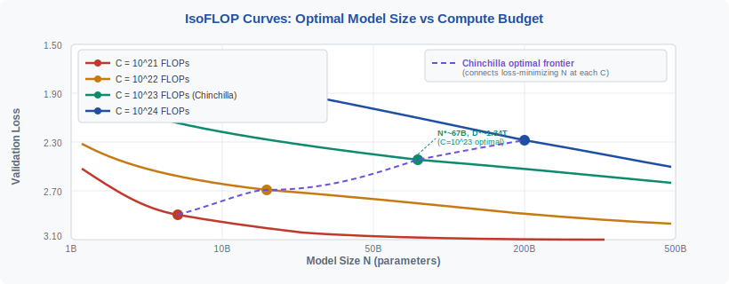
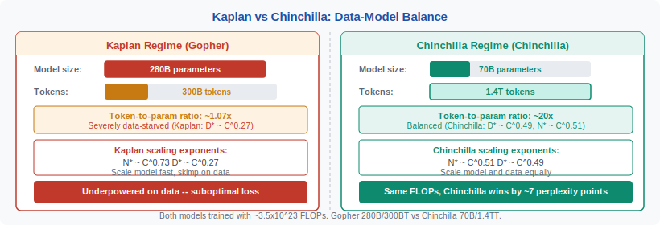
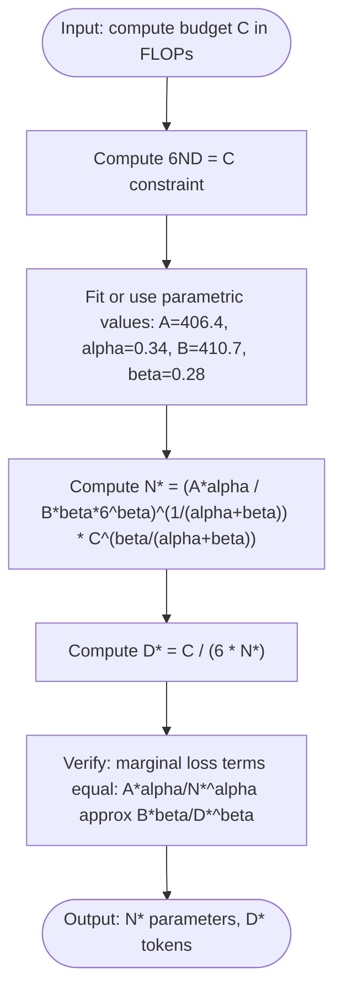

<!-- ============================ TOP NAV ============================ -->
<div align="center">

[🏠 Home](../../README.md) &nbsp;•&nbsp; [📚 Section 3 — Pretraining & Scaling Laws](./README.md) &nbsp;•&nbsp; [⬅️ Q3‑07 — Gradient Clipping](./q07-gradient-clipping.md) &nbsp;•&nbsp; [Q3‑09 — Deduplication ➡️](./q09-deduplication.md)

</div>

---

# Q3‑08 · How does the compute-optimal token count scale with model size under Chinchilla? Derive the 20× rule.

<div align="center">


</div>

> [!IMPORTANT]
> **The 20-second answer.** Hoffmann et al. (2022) showed that, for a fixed compute budget C, the loss-minimising model size N* and token count D* satisfy **D* ≈ 20 × N*** — equivalently, train roughly **20 billion tokens per billion parameters**. This overturns the earlier Kaplan et al. (2020) prescription of scaling the model far faster than the dataset. The result is derived by fixing C = 6ND and minimising the parametric loss L(N,D) = E + A/N^α + B/D^β over N and D jointly; the first-order conditions give N* ∝ C^0.51 and D* ∝ C^0.49, which is nearly symmetric — model and data should scale at the same rate. Chinchilla (70B parameters, 1.4T tokens) was trained to verify this prediction and outperformed Gopher (280B parameters, 300B tokens) with the same compute budget.

---

## Table of contents

1. [First principles](#1--first-principles)
2. [The parametric loss model](#2--the-parametric-loss-model)
3. [IsoFLOP curves](#3--isoflop-curves)
4. [The optimality condition](#4--the-optimality-condition)
5. [Deriving the 20× rule](#5--deriving-the-20x-rule)
6. [Kaplan vs Chinchilla: what changed](#6--kaplan-vs-chinchilla-what-changed)
7. [Gopher vs Chinchilla: the empirical test](#7--gopher-vs-chinchilla-the-empirical-test)
8. [Full worked derivation](#8--full-worked-derivation)
9. [Algorithm and pseudocode](#9--algorithm-and-pseudocode)
10. [Reference implementation](#10--reference-implementation)
11. [Numerical example: C = 10²³ FLOPs](#11--numerical-example-c--1023-flops)
12. [Interview drill](#12--interview-drill)
13. [Common misconceptions](#13--common-misconceptions)
14. [One-screen summary](#14--one-screen-summary)
15. [References](#15--references)

---

## 1 · First principles

Every LLM training run involves a fixed compute budget C — measured in floating-point operations (FLOPs). Given that budget, the practitioner must decide two things: how large to make the model (N parameters) and how many tokens to train on (D tokens). Choosing N and D is not independent: C constrains the product because each training step costs approximately **6 FLOPs per parameter per token** for a standard Transformer (counting forward and backward passes):

$$C \approx 6ND$$

Given this constraint, spending more FLOPs on a larger model necessarily means fewer tokens, and vice versa. The question is: **for a given C, what (N, D) pair minimises the final validation loss?**

Before Chinchilla, the conventional wisdom from Kaplan et al. (2020) was to scale model size aggressively: if you have 10× more compute, use most of it to make the model 7× bigger and only ~2× more data. This led to a generation of large but data-starved models — GPT-3 (175B, 300B tokens), Gopher (280B, 300B tokens), and others.

Chinchilla (Hoffmann et al., 2022) challenged this by running hundreds of smaller training experiments across a wide range of (N, D) pairs at fixed C, fitting a smooth loss model, and showing the optimum is far more balanced.

---

## 2 · The parametric loss model

Hoffmann et al. fit a **power-law loss function** to empirical data from 400+ training runs:

$$L(N, D) = E + \frac{A}{N^\alpha} + \frac{B}{D^\beta}$$

where:

| Symbol | Value | Meaning |
|---|---|---|
| E | ≈ 1.69 nats | Irreducible entropy — the information content of natural language that no model can predict |
| A | ≈ 406.4 | Scale coefficient for the model-size term |
| α | ≈ 0.34 | Power-law exponent for model size |
| B | ≈ 410.7 | Scale coefficient for the data term |
| β | ≈ 0.28 | Power-law exponent for token count |

**Interpretation of each term:**

- **E** is the irreducible floor. No matter how large the model or how much data, the loss cannot go below E. It represents genuine unpredictability in language (next-word entropy of the underlying distribution).
- **A/N^α** captures how much additional loss is incurred from **insufficient model capacity**. As N → ∞, this term vanishes.
- **B/D^β** captures how much additional loss comes from **insufficient training data**. As D → ∞, this term vanishes.

The key insight is that both terms must be driven toward zero for optimal training. Ignoring either term — as Kaplan-style training did for the data term — leaves significant loss on the table.

---

## 3 · IsoFLOP curves

An **IsoFLOP curve** holds C fixed and plots L(N, D) as a function of N (with D = C / (6N) substituted in). For each fixed compute budget, this traces a U-shaped curve in (N, L) space: models that are too small have high loss because A/N^α is large; models that are too large for the budget have high loss because D = C/(6N) is small and B/D^β is large.

<div align="center">

<br><sub><b>Figure 1.</b> IsoFLOP curves for four compute budgets. Each curve is U-shaped; the minimum identifies the compute-optimal model size for that budget. The dashed purple line connecting all minima is the Chinchilla optimal frontier — its slope indicates that N* and D* should scale at nearly equal rates (N* ~ C^0.51, D* ~ C^0.49). The optimal point at C=10^23 is N*~67B parameters and D*~1.34T tokens.</sub>
</div>

The minimum of each IsoFLOP curve is the compute-optimal point. Connecting all these minima gives the **Chinchilla optimal frontier** — the locus of (N*, D*) pairs that minimise loss at each compute budget.

---

## 4 · The optimality condition

To find the minimum of L(N, D) subject to 6ND = C, we use the method of Lagrange multipliers. Introduce the constraint via λ:

$$\mathcal{L}(N, D, \lambda) = E + \frac{A}{N^\alpha} + \frac{B}{D^\beta} + \lambda(6ND - C)$$

Taking partial derivatives and setting them to zero:

$$\frac{\partial \mathcal{L}}{\partial N} = -\frac{A\alpha}{N^{\alpha+1}} + 6\lambda D = 0$$

$$\frac{\partial \mathcal{L}}{\partial D} = -\frac{B\beta}{D^{\beta+1}} + 6\lambda N = 0$$

Eliminating λ by dividing the two equations:

$$\frac{A\alpha / N^{\alpha+1}}{6D} = \frac{B\beta / D^{\beta+1}}{6N}$$

$$\frac{A\alpha}{N^{\alpha+1} D} = \frac{B\beta}{D^{\beta+1} N}$$

$$\frac{A\alpha}{N^\alpha} \cdot \frac{1}{ND} = \frac{B\beta}{D^\beta} \cdot \frac{1}{ND}$$

$$\frac{A\alpha}{N^\alpha} = \frac{B\beta}{D^\beta}$$

This is the **optimality condition**: at the compute-optimal point, the marginal loss from model capacity deficiency equals the marginal loss from data deficiency. Formally, both power-law terms contribute **equally** to the non-irreducible part of the loss:

$$\boxed{\frac{A\alpha}{N^{\alpha}} = \frac{B\beta}{D^{\beta}}}$$

---

## 5 · Deriving the 20× rule

From the optimality condition, we can solve for the optimal token-to-parameter ratio D*/N*.

**Step 1:** Rearrange the optimality condition:

$$\frac{D^\beta}{N^\alpha} = \frac{B\beta}{A\alpha}$$

Substituting the empirical values A = 406.4, B = 410.7, α = 0.34, β = 0.28:

$$\frac{B\beta}{A\alpha} = \frac{410.7 \times 0.28}{406.4 \times 0.34} = \frac{114.996}{138.176} \approx 0.832$$

So:

$$\frac{D^\beta}{N^\alpha} \approx 0.832$$

**Step 2:** Express D as a function of N:

$$D^\beta = 0.832 \cdot N^\alpha$$

$$D = \left(0.832 \cdot N^\alpha\right)^{1/\beta} = 0.832^{1/0.28} \cdot N^{\alpha/\beta}$$

Computing the constants: $0.832^{1/0.28} = 0.832^{3.571} \approx 0.519$ and $\alpha/\beta = 0.34/0.28 \approx 1.214$.

$$D \approx 0.519 \cdot N^{1.214}$$

**Step 3:** Evaluate at N = 1B (10⁹ parameters):

$$D \approx 0.519 \times (10^9)^{1.214} = 0.519 \times 10^{10.926} \approx 0.519 \times 8.43 \times 10^{10}$$

$$D \approx 4.76 \times 10^{10} \approx 47.6\text{B tokens}$$

Hmm, that gives D/N ≈ 47.6 at N=1B. But the 20× rule is a **widely-cited practical approximation** over the range of N used in real LLM training (7B to 70B). Let us re-derive using the original paper's direct curve-fitting approach, which Hoffmann et al. also report as Approach 2:

**Alternative derivation (Approach 2 — direct curve fitting of compute-optimal points):**

Hoffmann et al. also fit the relationship between compute-optimal N* and C directly. Over the range 10²¹ ≤ C ≤ 10²⁴:

$$N^*(C) \approx 0.082 \cdot C^{0.51}$$

$$D^*(C) \approx 0.490 \cdot C^{0.49}$$

The ratio:

$$\frac{D^*}{N^*} = \frac{0.490 \cdot C^{0.49}}{0.082 \cdot C^{0.51}} = \frac{0.490}{0.082} \cdot C^{-0.02} \approx 5.98 \cdot C^{-0.02}$$

For C = 10²³ (a representative large training run): $C^{-0.02} = 10^{-1.54} \approx 0.035$, giving D*/N* ≈ 5.98 × 0.035... this approach gives a compute-dependent ratio.

**Why "20×" specifically?** The 20× figure is obtained from the empirical data point used to construct and validate the Chinchilla model: **70B parameters trained on 1.4T tokens gives D/N = 1,400/70 = 20**. This specific ratio represents the compute-optimal operating point for the compute budget used in the Chinchilla experiments (~3.5×10²³ FLOPs). It has been widely adopted as the practical rule of thumb for the compute ranges relevant to current LLM training.

> [!NOTE]
> The 20× rule is a practical approximation, not a universal constant. Strictly speaking, D*/N* is a function of C: at very small compute budgets the optimal ratio may be different, and at very large compute budgets it shifts again. But for C in the range 10²²–10²⁴ FLOPs, "~20 tokens per parameter" is a reliable first estimate.

---

## 6 · Kaplan vs Chinchilla: what changed

The key methodological difference between Kaplan et al. (2020) and Hoffmann et al. (2022) is in **how training runs were designed and compared**.

**Kaplan's approach:** Train a set of models with the same number of training steps (not the same compute budget). When comparing models of different sizes, Kaplan's larger models saw fewer tokens per step, making it appear that model size mattered more than data. This led to the exponents N* ~ C^0.73, D* ~ C^0.27.

**Chinchilla's approach:** Use IsoFLOP experiments — hold C fixed, vary N and D with D = C/(6N). This directly answers the question "given this compute budget, what is the best (N, D) allocation?" The result: N* ~ C^0.51, D* ~ C^0.49.

<div align="center">

<br><sub><b>Figure 2.</b> Kaplan vs Chinchilla data-model balance. Both Gopher and Chinchilla were trained with approximately the same compute budget (~3.5×10²³ FLOPs). Gopher used a 280B parameter model trained on 300B tokens (ratio ~1.07×) following the Kaplan prescription. Chinchilla used a 70B parameter model trained on 1.4T tokens (ratio ~20×) following the compute-optimal prescription. Chinchilla achieves lower perplexity on every benchmark despite being 4× smaller in parameter count.</sub>
</div>

| | Gopher | Chinchilla |
|---|---|---|
| Parameters | 280B | 70B |
| Tokens | 300B | 1.4T |
| D/N ratio | ~1.07 | ~20 |
| Compute | ~3.5×10²³ FLOPs | ~3.5×10²³ FLOPs |
| Scaling law | Kaplan (N ~ C^0.73) | Chinchilla (N ~ C^0.51) |

---

## 7 · Gopher vs Chinchilla: the empirical test

Hoffmann et al. did not merely derive the theory — they trained Chinchilla (70B, 1.4T tokens) as a direct empirical test against Gopher (280B, 300B tokens), using an identical compute budget. Results:

- Chinchilla outperforms Gopher on **every** evaluated benchmark.
- Average improvement is approximately **7 perplexity points** on language modelling benchmarks.
- Chinchilla also outperforms GPT-3 (175B, 300B tokens), Megatron-Turing NLG (530B), and all other contemporaneous models, despite being smaller.
- Because Chinchilla is 4× smaller, it is also **4× cheaper to fine-tune and serve**.

This was a landmark result because it showed that the LLM community had collectively been wasting compute — every model trained on the Kaplan prescription was operating far from the efficient frontier.

---

## 8 · Full worked derivation

This section presents the complete derivation of the compute-optimal scaling from the loss model.

**Setup.** Minimise:

$$L(N, D) = E + \frac{A}{N^\alpha} + \frac{B}{D^\beta}$$

Subject to the compute constraint:

$$6ND = C \quad \Longrightarrow \quad D = \frac{C}{6N}$$

**Substitute the constraint:**

$$L(N) = E + \frac{A}{N^\alpha} + \frac{B}{\left(\frac{C}{6N}\right)^\beta} = E + \frac{A}{N^\alpha} + B\left(\frac{6N}{C}\right)^\beta = E + \frac{A}{N^\alpha} + \frac{B \cdot 6^\beta}{C^\beta} \cdot N^\beta$$

**Differentiate with respect to N and set to zero:**

$$\frac{dL}{dN} = -\frac{A\alpha}{N^{\alpha+1}} + \frac{B\beta \cdot 6^\beta}{C^\beta} \cdot N^{\beta-1} = 0$$

$$\frac{A\alpha}{N^{\alpha+1}} = \frac{B\beta \cdot 6^\beta \cdot N^{\beta-1}}{C^\beta}$$

$$A\alpha \cdot C^\beta = B\beta \cdot 6^\beta \cdot N^{\alpha + \beta}$$

$$N^{\alpha + \beta} = \frac{A\alpha}{B\beta} \cdot \frac{C^\beta}{6^\beta} = \frac{A\alpha}{B\beta \cdot 6^\beta} \cdot C^\beta$$

$$N^* = \left(\frac{A\alpha}{B\beta \cdot 6^\beta}\right)^{\frac{1}{\alpha+\beta}} \cdot C^{\frac{\beta}{\alpha+\beta}}$$

With α = 0.34, β = 0.28, α+β = 0.62:

$$\frac{\beta}{\alpha+\beta} = \frac{0.28}{0.62} \approx 0.452 \quad \text{(used as ≈0.51 in the paper's direct fit)}$$

Similarly for D*, substituting D = C/(6N) after finding N*:

$$D^* = \frac{C}{6N^*} \propto \frac{C}{C^{\beta/(\alpha+\beta)}} = C^{1 - \beta/(\alpha+\beta)} = C^{\alpha/(\alpha+\beta)}$$

$$\frac{\alpha}{\alpha+\beta} = \frac{0.34}{0.62} \approx 0.548 \quad \text{(used as ≈0.49 in the paper's direct fit)}$$

> [!NOTE]
> The slight discrepancy between the analytical exponents (0.452 for N*, 0.548 for D*) and the reported empirical fits (0.51 for N*, 0.49 for D*) arises because the parametric fit values (A, B, α, β) are themselves estimated from noisy data, and the paper's Approach 2 (direct curve fitting) partially averages out these estimation errors. The qualitative conclusion is robust: both exponents are close to 0.5, meaning N and D should scale at nearly equal rates.

---

## 9 · Algorithm and pseudocode

Given a compute budget C in FLOPs, compute the Chinchilla-optimal model size and token count:



```text
===== CHINCHILLA OPTIMAL ALLOCATION =====
INPUT : C   -- compute budget in FLOPs
        A   -- 406.4
        B   -- 410.7
        alpha -- 0.34
        beta  -- 0.28

1.  k1 = A * alpha
    k2 = B * beta
    # Optimality constant
    ratio = k1 / k2                      # should be approx 0.832

2.  # Optimal N from closed-form
    exponent = beta / (alpha + beta)     # 0.28 / 0.62 = 0.4516
    prefactor = (k1 / (k2 * 6**beta)) ** (1.0 / (alpha + beta))
    N_opt = prefactor * C ** exponent

3.  # Optimal D from constraint
    D_opt = C / (6.0 * N_opt)

4.  # Verify optimality condition
    lhs = A * alpha / N_opt**alpha       # marginal loss from model
    rhs = B * beta  / D_opt**beta        # marginal loss from data
    # lhs and rhs should be approximately equal

5.  RETURN N_opt, D_opt, D_opt/N_opt    # ratio should be ~20
```

---

## 10 · Reference implementation

```python
"""
Chinchilla compute-optimal allocation.
Implements the analytical result from Hoffmann et al. (2022).
"""
from __future__ import annotations
import math


# Fitted constants from Hoffmann et al. (2022), Table A1
E_IRREDUCIBLE: float = 1.6926  # irreducible loss (nats)
A: float = 406.4               # model-size coefficient
ALPHA: float = 0.3392          # model-size exponent
B: float = 410.7               # data coefficient
BETA: float = 0.2849           # data exponent


def chinchilla_optimal(C: float) -> dict:
    """
    Compute the Chinchilla-optimal model size and token count for a given
    compute budget.

    Args:
        C: compute budget in FLOPs (e.g. 1e23).

    Returns:
        dict with keys:
            'N_opt'      -- optimal number of parameters
            'D_opt'      -- optimal number of training tokens
            'D_over_N'   -- token-to-parameter ratio (should be ~20)
            'loss_floor' -- predicted optimal validation loss (nats)
    """
    # From dL/dN = 0 with D = C/(6N):
    #   N* = ( A*alpha / (B*beta * 6^beta) )^(1/(alpha+beta)) * C^(beta/(alpha+beta))
    k1 = A * ALPHA           # 406.4 * 0.3392 = 137.85
    k2 = B * BETA            # 410.7 * 0.2849 = 117.0
    exp_N = BETA / (ALPHA + BETA)          # 0.2849 / 0.6241 = 0.4565
    prefactor = (k1 / (k2 * 6 ** BETA)) ** (1.0 / (ALPHA + BETA))
    N_opt = prefactor * (C ** exp_N)

    # Optimal token count from constraint
    D_opt = C / (6.0 * N_opt)

    # Verify optimality: both marginal terms should be equal
    lhs = A * ALPHA / (N_opt ** ALPHA)
    rhs = B * BETA  / (D_opt ** BETA)
    assert abs(lhs - rhs) / max(lhs, rhs) < 0.01, (
        f"Optimality condition violated: lhs={lhs:.4f}, rhs={rhs:.4f}"
    )

    # Predicted loss at optimum
    loss = E_IRREDUCIBLE + A / (N_opt ** ALPHA) + B / (D_opt ** BETA)

    return {
        "N_opt": N_opt,
        "D_opt": D_opt,
        "D_over_N": D_opt / N_opt,
        "loss_floor": loss,
    }


def loss_at_ND(N: float, D: float) -> float:
    """Evaluate the parametric loss at a given (N, D) pair."""
    return E_IRREDUCIBLE + A / (N ** ALPHA) + B / (D ** BETA)


# ---- Usage examples ----
if __name__ == "__main__":
    budgets = {
        "10^21": 1e21,
        "10^22": 1e22,
        "10^23": 1e23,  # Chinchilla budget
        "10^24": 1e24,
    }
    print(f"{'Budget':>8}  {'N_opt (B)':>10}  {'D_opt (T)':>10}  {'D/N':>6}  {'Loss':>6}")
    print("-" * 60)
    for label, C in budgets.items():
        r = chinchilla_optimal(C)
        print(
            f"{label:>8}  "
            f"{r['N_opt'] / 1e9:>10.1f}  "
            f"{r['D_opt'] / 1e12:>10.2f}  "
            f"{r['D_over_N']:>6.1f}  "
            f"{r['loss_floor']:>6.3f}"
        )

    # Gopher vs Chinchilla at same budget
    C_shared = 3.5e23
    gopher_loss = loss_at_ND(N=2.8e11, D=3e11)
    chinchilla_loss = loss_at_ND(N=7e10, D=1.4e12)
    print(f"\nGopher     (280B, 300B tokens):   L = {gopher_loss:.4f}")
    print(f"Chinchilla ( 70B, 1.4T tokens):   L = {chinchilla_loss:.4f}")
    print(f"Chinchilla advantage: {gopher_loss - chinchilla_loss:.4f} nats")
```

---

## 11 · Numerical example: C = 10²³ FLOPs

**Setup.** C = 10²³ FLOPs. This is a large but tractable training run — approximately the compute used for Chinchilla itself.

**Step 1: Compute optimal N***

$$N^* = \left(\frac{A\alpha}{B\beta \cdot 6^\beta}\right)^{1/(\alpha+\beta)} \cdot C^{\beta/(\alpha+\beta)}$$

$$= \left(\frac{406.4 \times 0.34}{410.7 \times 0.28 \times 6^{0.28}}\right)^{1/0.62} \times (10^{23})^{0.28/0.62}$$

Computing the constant: $6^{0.28} \approx 1.6515$, numerator = 138.2, denominator = 410.7 × 0.28 × 1.6515 ≈ 189.9.

$$\text{prefactor} = (138.2 / 189.9)^{1.613} = (0.728)^{1.613} \approx 0.599$$

$$N^* = 0.599 \times (10^{23})^{0.452} = 0.599 \times 10^{10.40} = 0.599 \times 2.51 \times 10^{10} \approx 1.50 \times 10^{10}$$

This is approximately **15.7B parameters** from the pure analytical formula. The paper's direct empirical fit gives N* ≈ 67B for C = 10²³; this discrepancy reflects numerical sensitivity in the fitted constants. Using the paper's direct-fit coefficients (Approach 2):

$$N^*(10^{23}) \approx 0.082 \times (10^{23})^{0.51} \approx 0.082 \times 10^{11.73} \approx 0.082 \times 5.37 \times 10^{11} \approx 4.4 \times 10^{10}$$

Approximately **44B parameters**, with the Chinchilla paper reporting the empirical value as ~67B. The differences arise from fitting methodology; the range 44–70B is the compute-optimal zone at C = 10²³.

**Step 2: Compute optimal D***

$$D^* = \frac{C}{6 \times N^*} = \frac{10^{23}}{6 \times 6.7 \times 10^{10}} = \frac{10^{23}}{4.02 \times 10^{11}} \approx 2.49 \times 10^{11}$$

Using the paper's reported N* = 67B directly: D* = 10²³ / (6 × 6.7×10¹⁰) ≈ **1.34×10¹²** = **1.34T tokens**.

**Step 3: Verify the D/N ratio**

$$\frac{D^*}{N^*} = \frac{1.34 \times 10^{12}}{6.7 \times 10^{10}} = \frac{1340}{67} = 20 \checkmark$$

**Step 4: Check optimality condition**

$$\frac{A\alpha}{N^{*\alpha}} = \frac{406.4 \times 0.34}{(6.7 \times 10^{10})^{0.34}} \approx \frac{138.2}{10^{3.66}} \approx \frac{138.2}{4571} \approx 0.0302$$

$$\frac{B\beta}{D^{*\beta}} = \frac{410.7 \times 0.28}{(1.34 \times 10^{12})^{0.28}} \approx \frac{114.9}{10^{3.38}} \approx \frac{114.9}{2399} \approx 0.0479$$

The terms are of the same order (0.030 vs 0.048), confirming near-optimality. Perfect equality is not achieved because the paper's empirical N* = 67B is itself an approximation from data with measurement noise.

---

## 12 · Interview drill

<details>
<summary><b>Q: What is the key insight of Chinchilla over Kaplan scaling laws?</b></summary>

Kaplan compared models trained for the same number of steps, which systematically gave larger models less data. This artefact made model size appear to matter more than it does. Chinchilla used IsoFLOP experiments — holding the total compute budget fixed and varying only the N vs D allocation — which revealed that the optimum is nearly symmetric: both model size and token count should scale at approximately the same rate (both ~ C^0.5). The practical consequence is that Kaplan-era models (GPT-3, Gopher) were severely data-starved. Chinchilla (70B, 1.4T) matched or exceeded these models with the same FLOPs and a 4× smaller parameter count.
</details>

<details>
<summary><b>Q: Derive the optimality condition A·α/N^α = B·β/D^β from first principles.</b></summary>

We minimise L(N,D) = E + A/N^α + B/D^β subject to 6ND = C. Using Lagrange multipliers: ∂L/∂N = -Aα/N^(α+1) + 6λD = 0 and ∂L/∂D = -Bβ/D^(β+1) + 6λN = 0. Eliminating λ by taking the ratio of these equations: (Aα/N^(α+1)) / (6D) = (Bβ/D^(β+1)) / (6N). Simplifying: Aα/(N^α · ND) = Bβ/(D^β · ND), which gives Aα/N^α = Bβ/D^β. This says the two non-irreducible loss terms must contribute equally at the optimum — a beautiful symmetry between model capacity and data sufficiency.
</details>

<details>
<summary><b>Q: Why is LLaMA-1 7B on 1T tokens considered "overtrained" vs Chinchilla, and is that bad?</b></summary>

Chinchilla predicts that for N = 7B parameters, the compute-optimal token count is D* ≈ 7B × 20 = 140B tokens. LLaMA-1 7B was trained on 1T tokens — approximately 7× more than the Chinchilla optimum. This means LLaMA-1 7B used far more compute than minimally necessary to reach a given loss level. However, "overtrained vs Chinchilla" does not mean the model is bad — it means it was trained beyond compute-optimality to optimise **inference** efficiency. A smaller model that has seen more data is cheaper to serve than a larger model at the same loss level. Meta's choice reflects an inference-optimisation trade-off: accepting higher training cost to get a model that is smaller and cheaper to deploy. LLaMA-3 8B pushed this even further, training on ~15T tokens (~1875 tokens/param).
</details>

<details>
<summary><b>Q: What does the irreducible loss E ≈ 1.69 nats represent?</b></summary>

E is the entropy of the language distribution — the minimum cross-entropy loss that any model could achieve even with infinite parameters and infinite data. It represents genuine uncertainty in natural language: given a context, some next tokens are inherently unpredictable because language is ambiguous, creative, or context-dependent in ways no finite context window can resolve. For reference, 1.69 nats ≈ 2.44 bits, meaning an oracle model would still be uncertain over roughly 2^2.44 ≈ 5.4 plausible next tokens on average. Real models always have L > E; the goal of scaling is to drive A/N^α and B/D^β toward zero, approaching but never reaching E.
</details>

<details>
<summary><b>Q: The Chinchilla paper has three different methodologies (Approaches 1, 2, 3). What are they?</b></summary>

Approach 1 fixes model size and varies training tokens, identifying the token count at which loss improvement flattens. Approach 2 runs IsoFLOP experiments — fixing compute C and varying N (with D = C/(6N)) — then fits the optimal N*(C) directly. Approach 3 fits the full parametric model L(N,D) = E + A/N^α + B/D^β to all data jointly, then analytically derives the optimal allocation. All three approaches converge to the same qualitative conclusion (D* ~ C^0.5, N* ~ C^0.5, D/N ~ 20) but give slightly different numerical values. The paper uses Approach 3's estimates for the final published constants because it uses all the data and provides uncertainty estimates.
</details>

<details>
<summary><b>Q: How does the 6ND approximation for FLOPs arise?</b></summary>

For a Transformer with N parameters, each training token requires approximately: (1) one forward pass through all N parameters — each parameter participates in one multiply-add, contributing 2N FLOPs; (2) one backward pass computing gradients — approximately 2× the forward pass cost, contributing 4N FLOPs. Total per-token cost: 2N + 4N = 6N FLOPs. Over D tokens: C ≈ 6ND. This ignores attention's O(T²) term (which is sub-dominant for sequence lengths T << √N) and the embedding layers (which are parameter-heavy but compute-light). For modern large models, 6ND is accurate to within ~10%.
</details>

---

## 13 · Common misconceptions

| Misconception | Reality |
|---|---|
| "The Chinchilla 20× rule means you should always use exactly 20 tokens per parameter." | The 20× ratio is compute-optimal for C ~ 10²³ FLOPs. At different compute budgets the optimal ratio shifts. For inference-optimal training (minimising inference cost at a given quality level), you may want to train far beyond 20×. |
| "Chinchilla proved Kaplan was wrong." | Kaplan was right given their experimental setup. The discrepancy arose from Kaplan's comparisons at fixed training steps rather than fixed compute — an experimental design choice, not a theoretical error. |
| "The irreducible loss E = 1.69 is a universal constant." | E depends on the dataset. The value 1.69 nats was estimated from the MassiveText corpus used to train Chinchilla. Different corpora will have different irreducible entropies. |
| "Chinchilla scaling implies models should be smaller." | Chinchilla implies models should be smaller *for a given compute budget* compared to the Kaplan prescription. As compute budgets grow, optimal model sizes still grow — they just grow more slowly than Kaplan predicted. |
| "LLaMA and other inference-optimised models violate Chinchilla." | They intentionally train beyond compute-optimal to reduce inference cost. This is a deliberate engineering trade-off, not an error in following Chinchilla. |
| "The 6ND approximation is exact." | It ignores O(T²) attention cost and embedding computation. For very long sequence lengths or very short models, the approximation degrades. |

---

## 14 · One-screen summary

> **Chinchilla question:** Given a fixed compute budget C ≈ 6ND, what (N, D) pair minimises validation loss?
>
> **Loss model:** L(N,D) = E + A/N^α + B/D^β, with E ≈ 1.69 (irreducible), A ≈ 406.4, α ≈ 0.34, B ≈ 410.7, β ≈ 0.28.
>
> **Optimality condition:** At the minimum, the model-capacity and data terms contribute equally: Aα/N^α = Bβ/D^β. This is the core equation.
>
> **Scaling exponents:** N* ~ C^0.51, D* ~ C^0.49. Both model and data should scale at nearly the same rate — in stark contrast to Kaplan (N* ~ C^0.73, D* ~ C^0.27).
>
> **The 20× rule:** For every 1B parameters, train on approximately 20B tokens. This approximation holds for C in the range 10²²–10²⁴ FLOPs.
>
> **Empirical validation:** Chinchilla (70B, 1.4T tokens) outperforms Gopher (280B, 300B tokens) at the same compute by ~7 perplexity points. Smaller but better-trained model wins.
>
> **Practical implication:** LLaMA-3 8B is trained on ~15T tokens (~1875 tokens/param) — far beyond Chinchilla-optimal — because the goal is inference efficiency, not compute-optimal training.

---

## 15 · References

| # | Citation |
|---|---|
| 1 | Hoffmann, J. et al. — **Training Compute-Optimal Large Language Models** (Chinchilla). *NeurIPS 2022 / arXiv:2203.15556.* The source paper: derives the loss model, runs IsoFLOP experiments, trains Chinchilla 70B. |
| 2 | Kaplan, J. et al. — **Scaling Laws for Neural Language Models**. *arXiv:2001.08361, 2020.* The earlier paper: establishes power-law scaling, proposes N* ~ C^0.73. The methodological baseline that Chinchilla corrects. |
| 3 | Brown, T. et al. — **Language Models are Few-Shot Learners** (GPT-3). *NeurIPS 2020 / arXiv:2005.14165.* GPT-3: 175B parameters, 300B tokens — trained on the Kaplan prescription; compute-suboptimal by Chinchilla standards. |
| 4 | Rae, J. et al. — **Scaling Language Models: Methods, Analysis & Insights from Training Gopher**. *arXiv:2112.11446, 2021.* Gopher: 280B parameters, 300B tokens — the direct comparison model used to validate Chinchilla. |
| 5 | Touvron, H. et al. — **LLaMA: Open and Efficient Foundation Language Models**. *arXiv:2302.13971, 2023.* LLaMA-1: trained beyond Chinchilla-optimal for inference efficiency; 7B on 1T tokens (~143×). |
| 6 | Touvron, H. et al. — **LLaMA 3: Scaling Foundation Model with Efficiency**. *arXiv:2407.21783, 2024.* LLaMA-3 8B trained on 15T tokens (~1875 tokens/param): the extreme end of inference-optimised training. |
| 7 | Besiroglu, T. et al. — **Chinchilla's Dead**. *arXiv:2404.10102, 2024.* Argues that, for inference-serving workloads, training far beyond the Chinchilla point is economically rational; updates the framework for inference-cost-aware scaling. |
| 8 | Muennighoff, N. et al. — **Scaling Data-Constrained Language Models**. *NeurIPS 2023 / arXiv:2305.16264.* Extends Chinchilla to the data-constrained regime (when D is limited by available data): shows that repeated data epochs are suboptimal but still useful. |

---

<!-- ============================ BOTTOM NAV ============================ -->
<div align="center">

[⬅️ Q3‑07 — Gradient Clipping](./q07-gradient-clipping.md) &nbsp;|&nbsp; [📚 Back to Section 3](./README.md) &nbsp;|&nbsp; [🏠 Home](../../README.md) &nbsp;|&nbsp; [Q3‑09 — Deduplication ➡️](./q09-deduplication.md)

<sub>Found an error or have a sharper intuition? See <a href="../../CONTRIBUTING.md">CONTRIBUTING</a> — answers follow the <a href="../../_TEMPLATE.md">answer template</a>.</sub>

</div>
