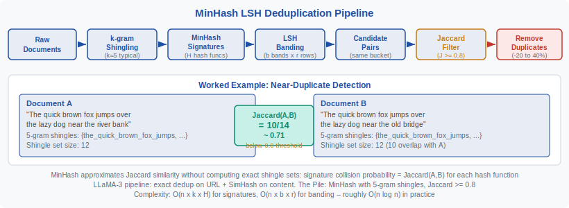
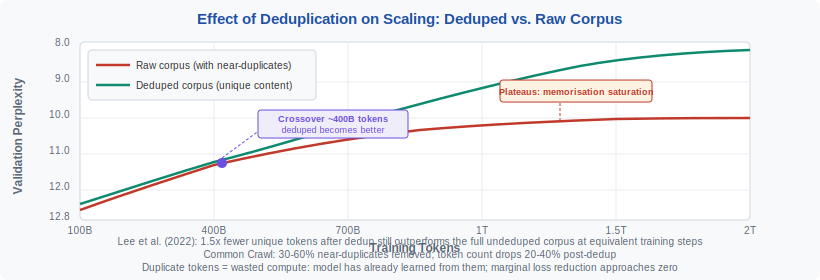
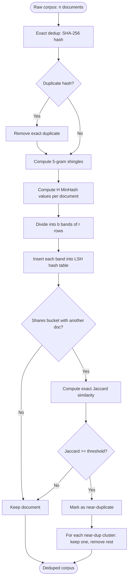

<!-- ============================ TOP NAV ============================ -->
<div align="center">

[🏠 Home](../../README.md) &nbsp;•&nbsp; [📚 Section 3 — Pretraining & Scaling Laws](./README.md) &nbsp;•&nbsp; [⬅️ Q3‑08 — Chinchilla Derivation](./q08-chinchilla-derivation.md) &nbsp;•&nbsp; [Q3‑10 — Batch Size Scaling ➡️](./q10-batch-size.md)

</div>

---

# Q3‑09 · What is data deduplication and why does near-duplicate data hurt scaling?

<div align="center">


</div>

> [!IMPORTANT]
> **The 20-second answer.** Data deduplication removes near-identical documents from a training corpus before training begins. It matters for two distinct reasons: (1) **wasted compute** — a model that has already learned from a document gains almost nothing from seeing it again, so duplicated tokens are essentially free-thrown FLOPs; (2) **memorisation** — models trained on repeated sequences learn to regurgitate them verbatim, which is a safety and copyright liability. Lee et al. (2022) showed that removing near-duplicates from C4 and Wikipedia improved downstream task performance consistently, and that a corpus with 1.5× fewer unique tokens after deduplication still outperforms the full undeduped corpus. Common Crawl typically contains 30–60% near-duplicates; after deduplication the token count drops 20–40%.

---

## Table of contents

1. [First principles](#1--first-principles)
2. [Why duplicates hurt scaling](#2--why-duplicates-hurt-scaling)
3. [Types of deduplication](#3--types-of-deduplication)
4. [MinHash algorithm in detail](#4--minhash-algorithm-in-detail)
5. [LSH banding and its trade-offs](#5--lsh-banding-and-its-trade-offs)
6. [Suffix array deduplication](#6--suffix-array-deduplication)
7. [Complexity analysis](#7--complexity-analysis)
8. [Effect on scaling behaviour](#8--effect-on-scaling-behaviour)
9. [Algorithm and pseudocode](#9--algorithm-and-pseudocode)
10. [Reference implementation](#10--reference-implementation)
11. [Practical thresholds and real pipelines](#11--practical-thresholds-and-real-pipelines)
12. [Interview drill](#12--interview-drill)
13. [Common misconceptions](#13--common-misconceptions)
14. [One-screen summary](#14--one-screen-summary)
15. [References](#15--references)

---

## 1 · First principles

Every language model training run is, at its core, a statistical estimation problem: given an input context, predict the distribution of next tokens. The quality of this estimate depends on the **diversity** and **volume** of training examples.

When a document appears multiple times in the training corpus — whether identically or with minor variations — the model sees strongly correlated gradient updates. From an information-theoretic perspective, these updates carry near-zero new information after the first occurrence: the model has already adjusted its weights to lower the loss on that document, and seeing it again mostly reinforces those same weight values.

This is not merely an efficiency argument. In the presence of extreme repetition, a model does not generalise from repeated sequences — it memorises them. This memorisation is directly measurable: Carlini et al. (2021) showed that large LLMs trained on deduplicated Common Crawl could still be prompted to regurgitate personal email addresses, phone numbers, and verbatim passages from books that appeared in the training data, all because those documents appeared repeatedly.

Deduplication is the pre-processing step that addresses both problems at once: remove near-identical content before training, so every token the model processes carries as much new information as possible.

---

## 2 · Why duplicates hurt scaling

**Mechanism 1: Wasted compute.** The scaling laws (Kaplan, Chinchilla) assume that each training token is an independent draw from the data distribution. Near-duplicate tokens violate this assumption. When the model sees a near-duplicate, the loss gradient is near-zero (the loss is already low for that sequence), so the weight update is tiny. The FLOPs spent processing duplicates buy almost no improvement in model quality. This means the empirical scaling curves flatten faster than they should — the model appears to "run out of data" earlier than the unique token count alone would predict.

**Mechanism 2: Memorisation.** When a sequence appears k times in the training data, the model's loss on that sequence decreases far below the population average. The sequence gets "overfit" into the model's weights. Carlini et al. (2021, 2022) quantified this: the probability of verbatim memorisation grows roughly linearly with the number of times a sequence appears in the training data. Sequences appearing 100× are memorised with near-certainty. This creates:
- **Privacy risks:** personal data appears verbatim in model outputs.
- **Copyright risks:** copyrighted text is reproduced verbatim.
- **Quality risks:** models with high memorisation rates are less useful as generalisers.

**Mechanism 3: Evaluation contamination.** Benchmark test sets (e.g., BoolQ, HellaSwag, PIQA) are scraped from the web. If these test documents — or near-paraphrases of them — appear in the training data, the model's benchmark scores reflect memorisation rather than generalisation. Deduplication that includes test-set overlap removal is standard practice in high-quality training pipelines.

---

## 3 · Types of deduplication

There are three main approaches, each addressing a different granularity of duplication:

**Exact deduplication** computes a hash (typically SHA-256) of the full document. Two documents with identical hashes are bit-for-bit identical. This is extremely fast (one hash per document, O(n) total) but misses near-duplicates — documents that are 95% identical but differ by a date, a header, or one changed sentence.

**Near-deduplication** uses approximate similarity measures to catch documents that are "almost" identical. The standard algorithm is MinHash + LSH (Locality-Sensitive Hashing), which estimates Jaccard similarity over shingle sets. It is the dominant approach in production pipelines (The Pile, Common Crawl derivatives, LLaMA-3, ROOTS).

**Substring deduplication** operates at sub-document granularity, finding exact repeated substrings across documents using suffix arrays. Carlini et al. (2021) proposed this as a way to catch verbatim copying even when the surrounding documents differ substantially. It is more expensive but catches a class of duplication that both exact and near-dedup miss (e.g., a boilerplate paragraph that appears in thousands of otherwise unique documents).

| Method | Granularity | Algorithm | Cost | Catches |
|---|---|---|---|---|
| Exact dedup | Whole document | SHA-256 hash | O(n) | Bit-for-bit identical copies |
| Near-dedup | Whole document | MinHash + LSH | O(n log n) | Documents with Jaccard >= threshold |
| Substring dedup | Sub-document | Suffix array | O(n log n) | Exact repeated substrings of length >= L |

---

## 4 · MinHash algorithm in detail

MinHash is a locality-sensitive hashing technique that efficiently approximates the **Jaccard similarity** between two sets:

$$J(A, B) = \frac{|A \cap B|}{|A \cup B|}$$

where A and B are the shingle sets of two documents.

**Step 1: Shingling.** Break each document into overlapping k-grams (character-level or word-level). For k = 5 (standard for English text), the document "the cat sat" generates shingles: {"the_c", "he_ca", "e_cat", "\_cats", "cats_", "ats_s", ...} (character 5-grams), or at word level: {"the cat sat", "cat sat on", ...} (word 5-grams). The Pile uses word 5-grams. LLaMA uses a mix of URL-level and content-level hashing.

**Step 2: MinHash signature.** For H independent hash functions h₁, h₂, ..., h_H (typically H = 128 or 256), the MinHash signature of document d is the vector:

$$\text{sig}(d) = \left[\min_{s \in \text{shingles}(d)} h_1(s),\ \min_{s \in \text{shingles}(d)} h_2(s),\ \ldots,\ \min_{s \in \text{shingles}(d)} h_H(s)\right]$$

The key property is that the probability that the i-th MinHash values of two documents agree equals their Jaccard similarity:

$$\Pr[\text{sig}(d_1)[i] = \text{sig}(d_2)[i]] = J(d_1, d_2)$$

This transforms the expensive set-intersection computation into a cheap signature comparison.

**Step 3: LSH banding.** Comparing all pairs of signatures directly is O(n²). LSH banding reduces this to near-linear by dividing the H-dimensional signature into b bands of r rows each (H = b × r). Two documents are placed in the same bucket for band j if and only if all r rows of their signatures agree in that band. The probability that two documents with Jaccard similarity J are placed in the same bucket in at least one band (i.e., become a "candidate pair") is:

$$\Pr[\text{candidate pair}] = 1 - (1 - J^r)^b$$

This creates an S-curve threshold: documents with J above the target similarity (typically 0.8) are almost always detected; documents with J below it are almost always missed.

<div align="center">
= 0.8) to Remove duplicates. A worked example shows Document A and Document B with 10/14 overlapping shingles giving Jaccard 0.71 — just below the 0.8 threshold." width="92%">
<br><sub><b>Figure 1.</b> MinHash LSH deduplication pipeline. Each document is converted to a set of k-gram shingles, then a compact MinHash signature is computed using H independent hash functions. LSH banding groups documents into buckets; only documents that share at least one bucket are compared. The worked example shows two documents with Jaccard similarity 0.71 — below the 0.8 threshold, so they are not flagged as duplicates. Changing two more words to overlap would push Jaccard above 0.8 and trigger removal.</sub>
</div>

---

## 5 · LSH banding and its trade-offs

The choice of (b, r) — number of bands and rows per band — controls the precision-recall trade-off:

- **Higher b (more bands, fewer rows each):** The S-curve threshold is lower — the pipeline is more aggressive, flagging documents as duplicates at lower Jaccard similarity. Higher recall of near-duplicates but higher false-positive rate (similar-but-not-duplicate documents removed).
- **Higher r (fewer bands, more rows each):** The S-curve threshold is higher — only very similar documents are flagged. Lower false-positive rate but misses near-duplicates.

For English text deduplication, standard settings are:
- H = 128 hash functions
- b = 8 bands, r = 16 rows (threshold ~ 0.8)
- Or b = 20 bands, r = 5 rows (threshold ~ 0.6, more aggressive)

The Pile used H = 128, Jaccard threshold 0.8 (with 5-gram word shingles). LLaMA-3 used SimHash (a related but distinct technique that hashes documents to bit strings and uses Hamming distance).

> [!WARNING]
> MinHash assumes the document can be meaningfully represented as a set of shingles. Very short documents (< 100 tokens) have unstable Jaccard estimates because the shingle sets are small. It is standard practice to skip deduplication for documents below a minimum length threshold (typically 100–200 tokens) and instead apply exact deduplication to short documents.

---

## 6 · Suffix array deduplication

Suffix array deduplication (Lee et al., 2022; Carlini et al., 2021) catches exact repeated substrings across documents. The algorithm:

1. **Concatenate** all documents into a single byte sequence with separator tokens between documents.
2. **Build a suffix array** — a sorted array of all suffixes of the concatenated string. Construction is O(n log n) with the SA-IS or DC3 algorithm.
3. **Scan adjacent entries** in the suffix array. Consecutive entries with a long common prefix (longer than threshold L, typically L = 50 or 100 tokens) indicate a repeated substring.
4. **Mark documents** containing these repeated substrings for removal or for having the repeated spans masked.

The key advantage over MinHash is that suffix array dedup catches **exact verbatim substrings** regardless of how different the surrounding documents are. A boilerplate paragraph that appears in 10,000 otherwise unique web pages will be missed by MinHash (each document is unique overall) but caught by suffix array dedup (the paragraph itself is identical across all 10,000).

The key disadvantage is that building a suffix array over a multi-terabyte corpus is extremely memory-intensive (the suffix array has n entries each requiring O(log n) bits). Lee et al. (2022) describe a distributed suffix array implementation that runs over C4 (750GB) using TPU pods.

---

## 7 · Complexity analysis

**MinHash signature computation:**

- For each of n documents: compute k-grams (O(|d|) per document, where |d| is document length) and compute H min-hash values (O(|d| × H) per document).
- Total: O(n × avg_doc_length × H) = O(n × k × H) where k is the average shingle count.

**LSH banding:**

- For each document: hash b bands (each of r rows) and insert into b hash tables.
- Total: O(n × b × r) = O(n × H).

**Candidate pair comparison:**

- With good parameter tuning, the expected number of candidate pairs is O(n) (each document has a small number of near-duplicate candidates). The Jaccard verification step for each candidate pair is O(H) (compare signatures).
- Total: O(n × H) amortized.

**Overall MinHash pipeline:** O(n × |d| × H) ≈ O(n log n) in practice (since |d| and H are constants, and candidate pair count grows sub-quadratically with good LSH tuning).

**Suffix array:** O(N_total log N_total) where N_total is the total number of tokens in the corpus. For C4 at 156B tokens, this requires ~2.4TB of memory for a naive implementation — distributed implementations are necessary.

---

## 8 · Effect on scaling behaviour

Lee et al. (2022) measured the effect of deduplication on language model perplexity as a function of training tokens. The key empirical findings:

1. **Crossover at ~400B tokens:** For corpora below ~400B tokens, the deduped and undeduped models perform similarly. Above this threshold, the undeduped model's perplexity improvement plateaus (memorisation saturation), while the deduped model continues to improve.
2. **1.5× efficiency gain:** A model trained on the deduped C4 (600B unique tokens, after removing ~40% duplicates) outperforms a model trained on the full 1T token undeduped corpus at equivalent training steps. The deduped corpus is more information-dense per token.
3. **Memorisation reduction:** Models trained on deduped corpora produce verbatim training text 2–3× less frequently when prompted, measured by the extraction attack methodology of Carlini et al. (2022).

<div align="center">

<br><sub><b>Figure 2.</b> Effect of deduplication on the scaling curve. The undeduped corpus (red) shows earlier and more severe perplexity plateau — a sign of memorisation saturation where additional tokens carry diminishing information. The deduped corpus (green) continues to improve throughout training. The crossover occurs around 400B training tokens; beyond this point, training on the undeduped corpus is strictly worse despite more tokens being available.</sub>
</div>

---

## 9 · Algorithm and pseudocode



```text
===== MINHASH LSH DEDUPLICATION =====
INPUT : documents (list of strings), threshold J_thresh=0.8,
        k=5 (shingle size), H=128 (hash functions), b=8, r=16

1.  EXACT DEDUP
    hashes = {}
    FOR doc IN documents:
        h = SHA256(doc)
        IF h IN hashes: mark doc as duplicate
        ELSE: hashes.add(h)

2.  SHINGLING
    FOR doc IN documents (non-duplicate):
        shingles[doc] = set of all k-gram word shingles of doc

3.  MINHASH SIGNATURES
    FOR doc IN documents (non-duplicate):
        FOR i IN 1..H:
            sig[doc][i] = min(hash_i(s) FOR s IN shingles[doc])

4.  LSH BANDING
    buckets = {}   # maps (band_id, hash_value) -> list of docs
    FOR doc IN documents (non-duplicate):
        FOR band IN 0..b-1:
            band_rows = sig[doc][band*r : (band+1)*r]
            bucket_key = (band, hash(band_rows))
            buckets[bucket_key].append(doc)

5.  CANDIDATE PAIR GENERATION AND FILTERING
    candidates = set()
    FOR bucket IN buckets.values():
        IF len(bucket) >= 2:
            FOR each pair (d1, d2) IN bucket:
                candidates.add((d1, d2))
    FOR (d1, d2) IN candidates:
        J_approx = sum(sig[d1][i] == sig[d2][i] FOR i IN 1..H) / H
        IF J_approx >= J_thresh:
            mark d2 as near-duplicate of d1

6.  OUTPUT: all documents not marked as duplicate
```

---

## 10 · Reference implementation

```python
"""
MinHash LSH deduplication for LLM training corpora.
Implements the core algorithm from Lee et al. (2022) and The Pile pipeline.
"""
from __future__ import annotations
import hashlib
import struct
from collections import defaultdict
from typing import Iterator


def get_word_ngrams(text: str, n: int = 5) -> set[str]:
    """
    Compute the set of word-level n-gram shingles for a document.

    Args:
        text: the document text (pre-tokenised by whitespace).
        n:    shingle size (default 5, matching The Pile / Lee et al. 2022).

    Returns:
        Set of space-joined n-gram strings.
    """
    words = text.lower().split()
    if len(words) < n:
        return set()
    return {" ".join(words[i : i + n]) for i in range(len(words) - n + 1)}


def minhash_signature(shingles: set[str], num_hashes: int = 128) -> list[int]:
    """
    Compute the MinHash signature for a shingle set.

    Uses the standard (a*x + b) % prime trick to simulate H independent
    hash functions efficiently.

    Args:
        shingles:   set of k-gram shingles.
        num_hashes: number of hash functions H (default 128).

    Returns:
        List of H minimum hash values (the MinHash signature).
    """
    if not shingles:
        return [0] * num_hashes

    # Pre-hash each shingle to a 32-bit integer
    shingle_hashes = [
        struct.unpack("<I", hashlib.md5(s.encode()).digest()[:4])[0]
        for s in shingles
    ]

    # Simulate H hash functions: h_i(x) = (a_i * x + b_i) % PRIME
    PRIME = (1 << 31) - 1  # Mersenne prime 2^31-1
    # Use seeded pseudo-random coefficients
    import random
    rng = random.Random(42)
    coefficients = [(rng.randint(1, PRIME - 1), rng.randint(0, PRIME - 1))
                    for _ in range(num_hashes)]

    signature = []
    for a, b in coefficients:
        min_val = min((a * h + b) % PRIME for h in shingle_hashes)
        signature.append(min_val)

    return signature


class MinHashLSH:
    """
    MinHash LSH index for near-duplicate detection.

    Parameters match The Pile (H=128, Jaccard threshold ~0.8 with b=8, r=16).
    """

    def __init__(
        self,
        num_hashes: int = 128,
        num_bands: int = 8,
        jaccard_threshold: float = 0.8,
        shingle_size: int = 5,
    ):
        assert num_hashes % num_bands == 0, "num_hashes must be divisible by num_bands"
        self.H = num_hashes
        self.b = num_bands
        self.r = num_hashes // num_bands
        self.threshold = jaccard_threshold
        self.k = shingle_size
        self.buckets: dict[tuple, list[int]] = defaultdict(list)
        self.signatures: dict[int, list[int]] = {}

    def add(self, doc_id: int, text: str) -> None:
        """Add a document to the index."""
        shingles = get_word_ngrams(text, self.k)
        sig = minhash_signature(shingles, self.H)
        self.signatures[doc_id] = sig
        for band_idx in range(self.b):
            band = tuple(sig[band_idx * self.r : (band_idx + 1) * self.r])
            self.buckets[(band_idx, band)].append(doc_id)

    def get_candidates(self, doc_id: int) -> set[int]:
        """Return all candidate near-duplicates of doc_id."""
        sig = self.signatures[doc_id]
        candidates: set[int] = set()
        for band_idx in range(self.b):
            band = tuple(sig[band_idx * self.r : (band_idx + 1) * self.r])
            for other_id in self.buckets[(band_idx, band)]:
                if other_id != doc_id:
                    candidates.add(other_id)
        return candidates

    def is_near_duplicate(self, doc_id_a: int, doc_id_b: int) -> bool:
        """Check if two documents exceed the Jaccard threshold (using signature estimate)."""
        sig_a = self.signatures[doc_id_a]
        sig_b = self.signatures[doc_id_b]
        estimated_jaccard = sum(a == b for a, b in zip(sig_a, sig_b)) / self.H
        return estimated_jaccard >= self.threshold


def deduplicate(documents: list[str]) -> list[int]:
    """
    Deduplicate a list of documents. Returns indices of documents to keep.

    Uses exact dedup first, then MinHash LSH near-dedup.

    Args:
        documents: list of document strings.

    Returns:
        List of indices (into documents) to keep.
    """
    n = len(documents)
    keep = [True] * n

    # Step 1: exact deduplication
    seen_hashes: set[str] = set()
    for i, doc in enumerate(documents):
        h = hashlib.sha256(doc.encode()).hexdigest()
        if h in seen_hashes:
            keep[i] = False
        else:
            seen_hashes.add(h)

    # Step 2: MinHash near-deduplication
    lsh = MinHashLSH()
    for i, doc in enumerate(documents):
        if keep[i]:
            lsh.add(i, doc)

    for i in range(n):
        if not keep[i]:
            continue
        for j in lsh.get_candidates(i):
            if j > i and keep[j] and lsh.is_near_duplicate(i, j):
                keep[j] = False  # keep earlier document, remove later one

    return [i for i in range(n) if keep[i]]


# ---- Minimal usage example ----
if __name__ == "__main__":
    docs = [
        "The quick brown fox jumps over the lazy dog near the river bank",
        "The quick brown fox jumps over the lazy dog near the river bank",   # exact dup
        "The quick brown fox jumps over the lazy dog near the old bridge",   # near-dup
        "Machine learning is transforming natural language processing today",  # unique
        "Deduplication removes redundant training examples from the corpus",   # unique
    ]
    kept = deduplicate(docs)
    print(f"Kept {len(kept)} / {len(docs)} documents: indices {kept}")
    for i in kept:
        print(f"  [{i}] {docs[i][:60]}...")
```

---

## 11 · Practical thresholds and real pipelines

**Common Crawl duplication rates.** Web crawls contain massive amounts of redundant content from:
- Identical pages served under multiple URLs (e.g., HTTP and HTTPS versions, www. and non-www.)
- Boilerplate content (cookie banners, navigation menus, footer text) repeated across millions of pages
- News articles syndicated to multiple outlets
- Wikipedia mirrors, GitHub mirrors, and similar canonical content redistribution

Empirical measurements suggest Common Crawl contains 30–60% near-duplicate documents (at Jaccard threshold 0.8). After deduplication, the effective token count drops 20–40%.

**LLaMA-3 pipeline.** Meta's LLaMA-3 paper describes a two-stage deduplication:
1. **URL-level exact dedup:** Remove pages with identical URLs (catches trivial crawl duplicates). Applied before any content processing.
2. **SimHash on content:** SimHash computes a single locality-sensitive hash per document (a 64-bit fingerprint); two documents with Hamming distance ≤ 3 on their SimHash are flagged as near-duplicates. SimHash is faster than MinHash but less precise at intermediate Jaccard values.

**The Pile (EleutherAI).** Used MinHash with word 5-gram shingles, H = 128 hash functions, Jaccard threshold 0.8. Applied per-dataset (separately to each of the 22 data sources), not across the combined corpus.

**C4 (Google T5 pretraining corpus).** Original C4 release (2019) used only basic exact dedup. Lee et al. (2022) applied suffix array dedup to C4 and found significant near-duplicate rates even after exact dedup.

**Trade-off: aggressive dedup removes legitimate repetition.** Not all repeated text is noise. Legitimate cases of high-frequency text include:
- **Legal boilerplate:** copyright notices, terms-of-service sections, license texts (e.g., MIT license preamble). These appear legitimately in millions of documents.
- **Standard disclaimers:** "Past performance is not indicative of future results" in financial documents.
- **Template text:** HTML boilerplate, standard bibliographic formats.

Aggressive deduplication at low Jaccard thresholds (0.5–0.6) will remove most instances of this legitimate boilerplate, which may actually be **desirable** (legal boilerplate is not useful training signal). The threshold choice is thus a policy decision as much as a technical one.

---

## 12 · Interview drill

<details>
<summary><b>Q: Why does near-duplicate data cause memorisation rather than better generalisation?</b></summary>

When a model sees a sequence k times, its loss on that sequence after k-1 exposures is already low (because it has updated its weights toward that sequence). On the k-th exposure, the gradient is proportional to the loss — which is now small. This means the weight updates become small, and the direction of the updates is specific to that sequence rather than to the broader patterns it shares with other text. The model is effectively learning to predict that specific sequence rather than the distributional patterns it represents. Carlini et al. (2022) show that verbatim memorisation probability grows roughly linearly with the number of times a sequence appears in training data.
</details>

<details>
<summary><b>Q: What is the difference between MinHash and SimHash, and when would you use each?</b></summary>

MinHash approximates Jaccard similarity (intersection over union of shingle sets). It requires H independent hash functions and stores an H-dimensional signature per document. Similarity between two documents is estimated by counting matching signature entries: J ≈ (matching entries) / H. It is well-suited for detecting documents that share a substantial fraction of their k-gram content, regardless of word order. SimHash maps a document to a single compact bit string (typically 64 bits) by computing a weighted sum of per-feature hashes and taking the sign. Two documents are similar if their bit strings differ in few positions (low Hamming distance). SimHash is much faster and requires less storage (64 bits vs H × 32 bits per document), but it is less precise at intermediate similarity values and is sensitive to word order. MinHash is the standard for high-precision deduplication; SimHash is used when speed and storage are paramount (LLaMA-3's content-level dedup step).
</details>

<details>
<summary><b>Q: The Pile uses Jaccard threshold 0.8. Why not use a lower threshold like 0.5?</b></summary>

A lower threshold is more aggressive: documents that share only 50% of their shingles are flagged as near-duplicates and removed. This would remove more duplicates, but at the cost of false positives — documents that happen to share common phrases but are genuinely different documents. For example, two different news articles about the same event will share many phrases ("the president said", "stock market fell") without being near-duplicates in the meaningful sense. A threshold of 0.5 would remove one of them, reducing topic diversity in the training corpus. The threshold 0.8 is chosen to be aggressive enough to catch true copies and mirror sites (which share > 90% of content) while preserving documents that are topically similar but genuinely distinct. The right threshold depends on the corpus; noisier corpora (web crawls) may benefit from lower thresholds than curated corpora (books, code).
</details>

<details>
<summary><b>Q: Why does suffix array deduplication catch things MinHash misses?</b></summary>

MinHash operates at the document level: it compares entire documents for similarity. A document with 10,000 tokens and one repeated paragraph of 200 tokens will have a Jaccard similarity of only ~2% with another document that also contains that paragraph but is otherwise different — well below any practical threshold. MinHash will correctly classify them as dissimilar and keep both. The repeated paragraph survives into the training corpus many times, one per document that contains it. Suffix array dedup finds the exact 200-token substring and flags every document containing it. The choice between the two depends on the type of duplication you care about: MinHash for document-level near-copies; suffix arrays for repeated passages across otherwise unique documents.
</details>

<details>
<summary><b>Q: Lee et al. (2022) say "1.5x fewer unique tokens after dedup still outperforms the full corpus." How is this possible?</b></summary>

The claim is about performance at equivalent training steps (same number of gradient updates), not equivalent token counts. After deduplication, each training step processes a more diverse and information-dense batch. The model therefore makes more useful gradient updates per step — each batch contains examples the model has not (or has rarely) seen, so the loss gradient is larger and more informative. The 1.5× fewer tokens outperform the full undeduped corpus at the same step count because the gradient signal per step is higher quality. If you were to train on the deduped corpus for 1.5× as many steps (to match total FLOPs), the advantage would be even larger. The result underlines that token count is a poor proxy for data quality — unique, diverse tokens are worth far more than repeated ones.
</details>

<details>
<summary><b>Q: How does test set contamination relate to deduplication?</b></summary>

Test set contamination is a specific form of train-test overlap: benchmark evaluation documents (e.g., a HellaSwag completion prompt, a BoolQ question-answer pair) appearing in the training data. When a model is evaluated on these benchmarks, if it has memorised the test examples, its score reflects memorisation rather than generalisation. Deduplication pipelines should include a contamination-removal step that checks training documents against all benchmark test sets and removes near-matches (typically at Jaccard threshold 0.4–0.6, lower than the corpus self-dedup threshold, because even partial overlap can inflate benchmark scores). Gopher, PaLM, and LLaMA papers all describe this contamination filtering step. Without it, reported benchmark numbers are systematically inflated.
</details>

---

## 13 · Common misconceptions

| Misconception | Reality |
|---|---|
| "More training tokens are always better, even with duplicates." | Duplicate tokens have near-zero marginal information value. Beyond ~400B tokens, an undeduped corpus shows earlier plateau than a deduped corpus of the same size. |
| "Exact deduplication is sufficient." | Exact dedup removes bit-for-bit copies but misses near-duplicates — documents that are 95% identical but differ in a date, a header, or one sentence. Near-dedup (MinHash) is necessary for web-scale corpora. |
| "MinHash directly computes Jaccard similarity." | MinHash estimates Jaccard similarity probabilistically. The estimate's error is O(1/sqrt(H)) — with H=128 hash functions, the standard error is ~0.088. For precise verification of borderline cases, exact Jaccard computation over actual shingle sets is needed. |
| "Deduplication is a one-time global operation." | In practice, dedup is applied per data source (to avoid removing all instances of a widely-cited paper from the Books corpus just because it also appears in a web crawl), and then a cross-source dedup step removes remaining overlaps. |
| "A high Jaccard threshold (e.g., 0.95) is the safest choice." | At 0.95, only near-identical copies are removed. URL-changed mirrors and lightly edited scraped pages (which are the dominant form of web duplication) are missed. A threshold of 0.7–0.8 is the standard balance. |
| "Deduplication removes all memorisation risk." | Even with full deduplication, a model trained on a sufficiently large corpus will memorise some text simply because it has high capacity and certain sequences are distinctive. Dedup reduces but does not eliminate memorisation. |

---

## 14 · One-screen summary

> **What:** Deduplication removes near-identical documents from a training corpus before training begins. Two types: exact (SHA-256 hash) and near-dedup (MinHash + LSH for Jaccard similarity >= 0.8).
>
> **Why it matters:** (1) Duplicate tokens are wasted compute — the model already learned from them; (2) repeated sequences are memorised verbatim, creating privacy, copyright, and quality risks; (3) test set contamination inflates benchmark scores.
>
> **MinHash algorithm:** k-gram shingling → H min-hash functions → H-dimensional signature → LSH banding → candidate pairs → Jaccard filter. Complexity: O(n log n) in practice.
>
> **Key finding (Lee et al. 2022):** A deduped corpus with 1.5× fewer tokens outperforms the full undeduped corpus at the same training steps. Undeduped corpora plateau early due to memorisation saturation.
>
> **Scale:** Common Crawl is 30–60% near-duplicates. Post-dedup token count drops 20–40%.
>
> **Production pipelines:** LLaMA-3 (URL exact dedup + SimHash content dedup), The Pile (MinHash 5-gram shingles, Jaccard >= 0.8), C4+suffix-array (Lee et al.).

---

## 15 · References

| # | Citation |
|---|---|
| 1 | Lee, K. et al. — **Deduplicating Training Data Makes Language Models Better**. *ACL 2022 / arXiv:2107.06499.* The core paper: applies MinHash and suffix array dedup to C4 and Wikipedia; shows 1.5× efficiency gain; measures memorisation reduction. |
| 2 | Carlini, N. et al. — **Extracting Training Data from Large Language Models**. *USENIX Security 2021 / arXiv:2012.07805.* Demonstrates verbatim memorisation in GPT-2; shows memorisation rate grows with duplicate frequency. |
| 3 | Carlini, N. et al. — **Quantifying Memorization Across Neural Language Models**. *ICLR 2023 / arXiv:2202.07646.* Rigorous quantification of memorisation as a function of model size and duplication count; ~linear relationship between duplicates and memorisation probability. |
| 4 | Gao, L. et al. — **The Pile: An 800GB Dataset of Diverse Text for Language Modeling**. *arXiv:2101.00027, 2021.* Describes The Pile's MinHash deduplication pipeline: 5-gram shingles, H=128, Jaccard threshold 0.8. |
| 5 | Touvron, H. et al. — **LLaMA 3: Scaling Foundation Models**. *arXiv:2407.21783, 2024.* LLaMA-3 data pipeline: URL-level exact dedup + SimHash content-level near-dedup for the 15T token corpus. |
| 6 | Broder, A. Z. — **On the Resemblance and Containment of Documents**. *Compression and Complexity of Sequences 1997 / IEEE.* The original MinHash paper; proves the fundamental property that P[min-hash collision] = Jaccard similarity. |
| 7 | Indyk, P., Motwani, R. — **Approximate Nearest Neighbors: Towards Removing the Curse of Dimensionality**. *STOC 1998.* Introduces LSH; provides the theoretical foundation for banding and the S-curve threshold analysis. |
| 8 | Manber, U., Myers, G. — **Suffix Arrays: A New Method for On-Line String Searches**. *SIAM Journal on Computing, 1993.* Original suffix array paper; the data structure used in Carlini et al.'s substring deduplication. |

---

<!-- ============================ BOTTOM NAV ============================ -->
<div align="center">

[⬅️ Q3‑08 — Chinchilla Derivation](./q08-chinchilla-derivation.md) &nbsp;|&nbsp; [📚 Back to Section 3](./README.md) &nbsp;|&nbsp; [🏠 Home](../../README.md) &nbsp;|&nbsp; [Q3‑10 — Batch Size Scaling ➡️](./q10-batch-size.md)

<sub>Found an error or have a sharper intuition? See <a href="../../CONTRIBUTING.md">CONTRIBUTING</a> — answers follow the <a href="../../_TEMPLATE.md">answer template</a>.</sub>

</div>
