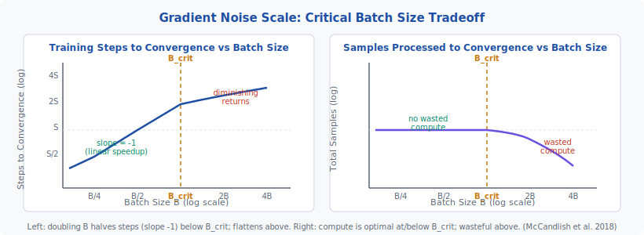
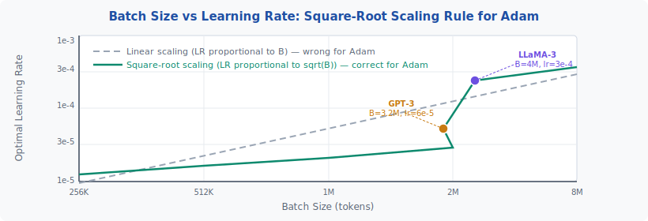

<!-- ============================ TOP NAV ============================ -->
<div align="center">

[🏠 Home](../../README.md) &nbsp;•&nbsp; [📚 Section 3 — Pretraining & Scaling Laws](./README.md) &nbsp;•&nbsp; [⬅️ Q3‑09 — Deduplication](./q09-deduplication.md) &nbsp;•&nbsp; [Q3‑11 — Mixed Precision ➡️](./q11-mixed-precision.md)

</div>

---

# Q3‑10 · What is the role of batch size in LLM pretraining? How does gradient noise scale relate to the critical batch size?

<div align="center">


</div>

> [!IMPORTANT]
> **The 20-second answer.** Batch size controls the trade-off between **statistical efficiency** (how much new information each sample adds) and **hardware efficiency** (GPU utilization). The **critical batch size B_crit** — defined as gradient variance divided by squared gradient mean (McCandlish et al. 2018) — is the inflection point: below it, doubling B roughly halves the training steps needed (linear speedup, no wasted compute); above it, doubling B gives diminishing returns in step reduction while burning more compute. Modern LLMs use tokens as the batch unit: GPT-3 used 3.2M tokens/batch, LLaMA 4M, Chinchilla ~1.5M. Learning rate must scale as **√B** (not linearly) when using Adam.

---

## Table of contents

1. [First principles](#1--first-principles)
2. [Gradient noise scale — the theory](#2--gradient-noise-scale--the-theory)
3. [Critical batch size — definition and formula](#3--critical-batch-size--definition-and-formula)
4. [Below vs above B_crit — the two regimes](#4--below-vs-above-b_crit--the-two-regimes)
5. [Batch size in tokens vs sequences](#5--batch-size-in-tokens-vs-sequences)
6. [Batch sizes in major LLMs](#6--batch-sizes-in-major-llms)
7. [Learning rate scaling with batch size](#7--learning-rate-scaling-with-batch-size)
8. [Gradient accumulation](#8--gradient-accumulation)
9. [Throughput and GPU utilization](#9--throughput-and-gpu-utilization)
10. [Batch size schedules — ramping strategies](#10--batch-size-schedules--ramping-strategies)
11. [Worked numerical example](#11--worked-numerical-example)
12. [Interview drill](#12--interview-drill)
13. [Common misconceptions](#13--common-misconceptions)
14. [One-screen summary](#14--one-screen-summary)
15. [References](#15--references)

---

## 1 · First principles

Training a neural network requires computing the gradient of the loss with respect to all parameters. In theory you could compute this gradient over the **entire dataset** (batch gradient descent), but that is computationally prohibitive. Instead, you approximate the true gradient using a **mini-batch** — a random subset of the data.

This approximation introduces **gradient noise**: the mini-batch gradient is an unbiased estimator of the true gradient, but with variance that decreases as batch size grows. The fundamental question in batch size selection is: **how large does the batch need to be before the extra samples stop reducing gradient noise fast enough to justify their cost?**

The answer depends on the current state of the model. Early in training, the loss landscape is rough and gradients vary enormously between different data points — small batches already capture the dominant signal. Late in training, the model has converged to a region where gradients are more consistent — larger batches are needed to get meaningful updates.

This intuition was formalized by McCandlish et al. (2018) through the **gradient noise scale**, giving us a principled way to choose batch size at any point during training.

---

## 2 · Gradient noise scale — the theory

McCandlish et al. (2018) introduce the **gradient noise scale** (GNS) as a data-driven quantity that characterizes how much a model benefits from larger batches at any given moment in training.

**Setup.** Let $\mathbf{g}$ denote the gradient estimated from the full dataset (the "true" gradient), and let $\tilde{\mathbf{g}}_B$ denote the gradient estimated from a mini-batch of size $B$. The noise in the gradient estimate has two components:

- **Signal:** the mean squared norm of the true gradient, $\|\mathbf{g}\|^2 = \mathbf{g}^T \mathbf{g}$.
- **Noise:** the trace of the gradient covariance matrix, $\text{tr}(\Sigma)$, which measures how much individual samples disagree with the mean gradient.

The **gradient noise scale** is defined as:

$$B_{\text{simple}} = \frac{\text{tr}(\Sigma)}{\|\mathbf{g}\|^2} = \frac{\text{gradient variance}}{\text{gradient mean}^2}$$

This has units of **samples**, and it equals the critical batch size $B_{\text{crit}}$ under a key simplifying assumption (that the noise-to-signal ratio is the same for all gradient directions). The quantity is related to the noise-to-signal ratio of gradient estimation: the gradient variance measures how noisy the estimates are, and the gradient mean squared measures how strong the true signal is.

**Intuition.** When $B_{\text{simple}}$ is large (strong signal relative to noise), individual samples contribute highly informative gradients — small batches are efficient. When $B_{\text{simple}}$ is small (weak signal, high noise), you need larger batches to average away the noise. As training progresses and the model improves, $B_{\text{simple}}$ typically **grows** — the gradient becomes smaller in magnitude (we're near a minimum) but more consistent, so larger batches become increasingly beneficial.

---

## 3 · Critical batch size — definition and formula

The **critical batch size** $B_{\text{crit}}$ is the inflection point at which the marginal benefit of increasing batch size transitions from linear to sublinear speedup.

**Formal definition:**

$$B_{\text{crit}} = \frac{\text{tr}(\Sigma)}{\|\mathbf{g}\|^2}$$

where:
- $\text{tr}(\Sigma)$ is the trace of the per-sample gradient covariance matrix — equivalently, the sum of per-parameter gradient variances
- $\|\mathbf{g}\|^2$ is the squared L2 norm of the true mean gradient

**Practical consequences.** For a mini-batch of size $B$, the number of gradient descent steps needed to reach a given loss level (relative to single-sample SGD) scales approximately as:

$$S(B) \approx S_{\min} \cdot \frac{1 + B_{\text{crit}} / B}{1} = S_{\min} \cdot \left(1 + \frac{B_{\text{crit}}}{B}\right)$$

where $S_{\min}$ is the minimum number of steps achievable (with infinite batch size). In the two limiting regimes:

- **$B \ll B_{\text{crit}}$:** $S(B) \approx S_{\min} \cdot B_{\text{crit}} / B$ — doubling $B$ halves steps needed. Linear speedup.
- **$B \gg B_{\text{crit}}$:** $S(B) \approx S_{\min}$ — increasing $B$ gives almost no step reduction. Diminishing returns.

The total number of samples processed (= $S(B) \times B$) is minimized when $B = B_{\text{crit}}$, confirming it as the compute-optimal batch size.

<div align="center">

<br><sub><b>Figure 1.</b> Gradient Noise Scale and the critical batch size tradeoff. Left: on a log-log plot, training steps decrease with slope -1 (doubling B halves steps) below B_crit, then flatten above B_crit. Right: total samples processed are constant (compute-optimal) below B_crit and rise (wasted compute) above it. The optimal operating point is at B = B_crit. (McCandlish et al. 2018)</sub>
</div>

---

## 4 · Below vs above B_crit — the two regimes

The behavior on either side of B_crit is starkly different, and understanding both regimes determines practical batch size choices.

**Regime 1: $B < B_{\text{crit}}$ (sample-limited)**

Each additional sample provides substantial new gradient information. In this regime:

- Doubling B ≈ halving the number of training steps (linear speedup in wall-clock time if compute scales linearly)
- Total compute consumed (steps × B) is approximately constant — you are not wasting compute
- GPU utilization may be suboptimal (small batches underutilize memory bandwidth on modern accelerators)
- Gradients are noisy; variance reduction from averaging is the dominant effect

This is the regime where **data parallelism across many devices genuinely accelerates convergence** — adding devices to increase effective batch size yields near-linear speedup in wall-clock time per loss unit.

**Regime 2: $B > B_{\text{crit}}$ (compute-limited)**

Additional samples add diminishing marginal information. In this regime:

- Doubling B gives fewer than 2× fewer steps needed — sublinear speedup
- Total compute increases (you are paying for samples that contribute little new signal)
- GPU utilization is high (large batches maximize memory bandwidth efficiency)
- The optimizer is making fewer but higher-quality steps

Most production LLM training operates in this regime because the GPU hardware forces large batch sizes to achieve sufficient throughput. The art is choosing a batch size that balances statistical efficiency (close to B_crit) against hardware efficiency (large enough to saturate GPU compute).

> [!NOTE]
> B_crit is not a fixed number — it changes throughout training. It tends to be **smaller early in training** (when gradients are diverse and noisy) and **larger late in training** (when the model has converged to a region with more consistent gradients). Some training recipes exploit this by using **batch size schedules** — see Section 10.

---

## 5 · Batch size in tokens vs sequences

Modern LLMs always express batch size in **tokens**, not sequences, because sequence lengths vary significantly across documents.

**Conversion:**

$$B_{\text{tokens}} = B_{\text{sequences}} \times L_{\text{context}}$$

where $L_{\text{context}}$ is the context length (typically fixed during pretraining, e.g. 2048 or 4096 tokens).

**Why tokens are the natural unit:**
- The loss is summed (or averaged) over tokens, not sequences — comparing batch sizes in sequences across runs with different context lengths is misleading
- Hardware utilization depends on total token count processed per step, not sequence count
- The gradient noise scale $B_{\text{crit}}$ is most naturally expressed in tokens

**Example.** GPT-3 used a context length of 2048 tokens and a batch size of 3.2 million tokens per step:

$$B_{\text{sequences}} = \frac{3.2 \times 10^6}{2048} \approx 1562 \text{ sequences per batch}$$

At 300 billion training tokens total, GPT-3 performed approximately $300 \times 10^9 / 3.2 \times 10^6 \approx 93{,}750$ gradient steps.

---

## 6 · Batch sizes in major LLMs

The trend in large model pretraining has been toward progressively larger batch sizes in tokens, reflecting both larger model sizes (more parameters, smoother loss landscape → larger B_crit) and better hardware (need large batches to saturate thousands of GPUs).

| Model | Batch size (tokens) | Context length | Approx. sequences/step | Source |
|---|---|---|---|---|
| GPT-2 (1.5B) | 512K | 1024 | 500 | Radford et al. (2019) |
| GPT-3 (175B) | 3.2M | 2048 | ~1562 | Brown et al. (2020) |
| Chinchilla (70B) | ~1.5M | 2048 | ~732 | Hoffmann et al. (2022) |
| LLaMA 1 (7B–65B) | 4M | 2048 | ~1953 | Touvron et al. (2023a) |
| LLaMA 2 (7B–70B) | 4M | 4096 | ~977 | Touvron et al. (2023b) |
| PaLM (540B) | 2.24M | 2048 | ~1094 | Chowdhery et al. (2022) |
| LLaMA 3 (8B–70B) | 4M | 8192 | ~488 | Meta AI (2024) |

The general pattern: **larger models use larger token batch sizes**, reflecting their higher B_crit values. Note that LLaMA 3 kept the same 4M token batch size as LLaMA 1/2 while increasing context length to 8192, which means fewer sequences per step but the same token-level statistical efficiency.

> [!NOTE]
> Chinchilla's batch size (~1.5M tokens) is notably smaller than GPT-3 (3.2M) despite being trained on far more tokens. This reflects the Chinchilla hypothesis that smaller models trained on more tokens are more compute-efficient — a smaller model has a smaller B_crit.

---

## 7 · Learning rate scaling with batch size

When the batch size changes, the optimal learning rate must change to maintain equivalent optimization dynamics. The wrong scaling rule is one of the most common errors in LLM training.

**For SGD: linear scaling rule (Goyal et al. 2017)**

$$\eta \propto B$$

Doubling the batch size doubles the learning rate. This works because each SGD update uses a gradient estimated with twice as many samples, reducing the gradient variance by half — the equivalent of taking two steps with the original batch, so one step with double the batch should move twice as far.

**For Adam: square-root scaling rule**

$$\eta \propto \sqrt{B}$$

Adam normalizes gradients by their second moment, which already partially accounts for batch size effects. The correct scaling for Adam is the **square root** of batch size, not linear. This was established empirically by McCandlish et al. (2018) and is used in every major LLM training recipe.

**Why the difference matters:** If you scale LR linearly with B for Adam (as you would for SGD), you will set the learning rate too high for large batches, causing instability. If you don't scale at all, you underexploit the larger batch and learning is too slow.

**Practical example.** Suppose you run a baseline with $B = 256\text{K}$ tokens and $\eta = 1 \times 10^{-4}$. When scaling to $B = 4\text{M}$ tokens:

$$\eta_{\text{new}} = \eta_{\text{base}} \times \sqrt{\frac{B_{\text{new}}}{B_{\text{base}}}} = 1 \times 10^{-4} \times \sqrt{\frac{4 \times 10^6}{256 \times 10^3}} = 1 \times 10^{-4} \times \sqrt{15.6} \approx 3.95 \times 10^{-4}$$

<div align="center">

<br><sub><b>Figure 2.</b> Batch size vs optimal learning rate for Adam. Linear scaling (dashed gray) overestimates the required LR at large batch sizes and causes instability. Square-root scaling (solid teal) is the empirically and theoretically correct rule for Adam. GPT-3 (B=3.2M, lr=6e-5) and LLaMA-3 (B=4M, lr=3e-4) are annotated as reference points.</sub>
</div>

---

## 8 · Gradient accumulation

Hardware memory limits often prevent fitting the desired batch size in a single GPU forward/backward pass. **Gradient accumulation** solves this by splitting one logical batch into $N$ **micro-batches** and accumulating gradients across them before applying the optimizer update.

**Algorithm:**

```text
optimizer.zero_grad()
for i in range(N_accum):                          # N micro-batches
    micro_loss = model(micro_batch[i]) / N_accum  # normalize
    micro_loss.backward()                          # accumulate grads
clip_grad_norm_(model.parameters(), 1.0)          # clip on full batch
optimizer.step()                                   # one logical step
```

**Effective batch size:**

$$B_{\text{effective}} = B_{\text{micro}} \times N_{\text{accum}} \times N_{\text{GPUs}}$$

**Important correctness detail.** When using gradient accumulation with mixed-precision training (BF16), the loss scaling and gradient casting must be applied consistently across all micro-batches, and the unscaling must happen before the single clip+step. Most frameworks (Hugging Face Accelerate, PyTorch FSDP, DeepSpeed) handle this automatically via context managers.

**Distributed training note.** In data-parallel training across $N_{\text{GPUs}}$ devices, each GPU processes $B_{\text{micro}}$ samples independently, and gradients are all-reduced (averaged) across devices before the optimizer step. The effective batch size is $B_{\text{micro}} \times N_{\text{GPUs}}$, which adds another dimension of parallelism on top of gradient accumulation.

**Performance cost.** Gradient accumulation adds no computational overhead (same number of FLOPs), but it increases the time between optimizer steps proportionally to $N_{\text{accum}}$. On single devices with no data parallelism, it is the standard way to simulate large batch training on limited memory hardware.

---

## 9 · Throughput and GPU utilization

Batch size has a direct and significant impact on GPU utilization efficiency, measured as **Model FLOP Utilization (MFU)** — the fraction of the GPU's theoretical peak FLOP/s that are actually used for useful computation.

**Why larger batches improve throughput:**

1. **Memory bandwidth utilization.** GPUs have large SRAM (L2 cache) and high-bandwidth memory (HBM). Reading model weights once and processing many tokens in parallel amortizes the memory read cost over more useful computations. Very small batches spend most time on memory reads, not arithmetic.

2. **Tensor core efficiency.** Modern accelerators (A100, H100) use tensor cores that require matrix multiplications of a certain minimum size to operate efficiently. Batches that are too small produce matrix shapes that don't align with tensor core dimensions, leaving capacity idle.

3. **Kernel launch overhead.** Each GPU operation has a fixed overhead for kernel launch and synchronization. Larger batches amortize this overhead over more tokens.

**Diminishing returns above MFU saturation.** Once the GPU is fully utilized (MFU > 50-60% is considered good for LLM training), increasing batch size further does not improve throughput. The point of MFU saturation depends on the model size, precision (BF16 vs FP32), and hardware. For large models (7B+) on A100 GPUs, this typically occurs at batch sizes of a few hundred sequences.

**The tension:** statistical efficiency (B_crit) and hardware efficiency (MFU saturation) pull in different directions at different scales. In practice, the batch size for large LLMs is determined by:

1. The minimum batch size needed to saturate GPU utilization
2. Adjusted upward until B ≈ B_crit (to avoid wasted compute)
3. Increased further only if scale of parallelism requires it

---

## 10 · Batch size schedules — ramping strategies

Several major LLM training runs have used **batch size schedules** — starting training with a small batch size and increasing it during training — motivated by the observation that B_crit grows as the model improves.

**Rationale for increasing batch size during training:**

- Early in training: B_crit is small (loss is high, gradients are diverse). Small batches are statistically efficient and GPU cost per step is lower.
- Late in training: B_crit has grown (loss is lower, gradients are more consistent). Larger batches are needed to match the optimal operating point.

**GPT-4 batch schedule (reported in Brown et al. and later literature):** OpenAI's training of large models uses a batch size warm-up that ramps from a small initial batch size to the target batch size over the first portion of training. The intuition is identical to learning rate warm-up — avoid large, potentially destructive steps early when the optimizer's state (Adam's second moment estimate) has not yet adapted.

**LLaMA 3 schedule:** Meta reports using a fixed 4M token batch size for LLaMA 3 pretraining — no ramp, consistent throughout. This reflects confidence that 4M is near or above B_crit for their model size throughout training.

**Linear ramp protocol (common in practice):**

```text
for step in range(total_steps):
    B = min(B_final, B_initial + (B_final - B_initial) * step / ramp_steps)
    # Adjust LR proportionally: lr = lr_final * sqrt(B / B_final)
    train_step(batch_size=B)
```

The LR must be adjusted alongside B to maintain the correct LR-B relationship (√B scaling).

---

## 11 · Worked numerical example

### Setup: computing B_crit from first principles

Consider a small language model being trained on a dataset where we can measure gradient statistics at a particular training checkpoint.

**Given measurements (mid-training checkpoint):**

- Mean gradient norm: $\|\mathbf{g}\|_2 = 0.045$ (global L2 norm of full-dataset gradient)
- Per-sample gradient variance (trace of covariance): $\text{tr}(\Sigma) = 180{,}000$ (in token-normalized units)

### Step 1: Compute B_crit

$$B_{\text{crit}} = \frac{\text{tr}(\Sigma)}{\|\mathbf{g}\|^2} = \frac{180{,}000}{0.045^2} = \frac{180{,}000}{0.002025} \approx 88{,}900 \text{ tokens}$$

### Step 2: Analyze different batch size choices

At this training checkpoint, with $B_{\text{crit}} \approx 89\text{K}$ tokens:

| Batch size (tokens) | Regime | Expected speedup vs B=1K | Total compute multiplier |
|---|---|---|---|
| 8K | Well below B_crit | ~8× fewer steps | ~1.0× (optimal) |
| 89K (= B_crit) | At B_crit | ~45× fewer steps than B=1K | ~1.0× (optimal) |
| 256K | Above B_crit | ~55× fewer steps (not 256×) | ~1.14× (slightly wasteful) |
| 1M | Far above B_crit | ~60× fewer steps (not 1000×) | ~2.8× (very wasteful) |

### Step 3: Optimal learning rate for a 256K batch

Starting from a known baseline: at $B = 8\text{K}$, optimal $\eta = 5 \times 10^{-5}$ for Adam.

$$\eta_{\text{256K}} = 5 \times 10^{-5} \times \sqrt{\frac{256{,}000}{8{,}000}} = 5 \times 10^{-5} \times \sqrt{32} = 5 \times 10^{-5} \times 5.66 \approx 2.83 \times 10^{-4}$$

### Interpretation

- At 8K (well below B_crit): each gradient step is informationally rich, but the GPU is likely underutilized.
- At 89K (= B_crit): compute-optimal operating point — every token contributes meaningful gradient signal.
- At 256K (3× B_crit): only ~3% more steps needed than at infinity batch size, but 14% more total compute. Acceptable if GPU utilization requires this batch size.
- At 1M (11× B_crit): 2.8× total compute wasted vs the optimal point. Only justified if parallelism constraints force it.

---

## 12 · Interview drill

<details>
<summary><b>Q: What is the gradient noise scale and why does it equal the critical batch size?</b></summary>

The gradient noise scale is $B_{\text{simple}} = \text{tr}(\Sigma) / \|\mathbf{g}\|^2$, the ratio of gradient variance (how much individual sample gradients disagree with the mean) to gradient signal (how strong the mean gradient is). It equals the critical batch size because at $B = B_{\text{crit}}$, the noise in the mini-batch gradient estimate exactly equals the signal. Below this, adding more samples significantly reduces noise faster than the cost of processing them — linear speedup. Above it, the gradient estimate is already good enough and adding more samples adds only marginal benefit.
</details>

<details>
<summary><b>Q: Why does LR scale as √B for Adam but linearly for SGD?</b></summary>

For SGD, the gradient update is $\theta \leftarrow \theta - \eta \mathbf{g}_B$ where $\mathbf{g}_B$ is the mini-batch gradient. Doubling $B$ halves the gradient variance but keeps the mean constant — the same as doing two half-steps with the original batch. To maintain the same effective step size, you double $\eta$: linear scaling. For Adam, the update is $\theta \leftarrow \theta - \eta \hat{\mathbf{g}} / \sqrt{\hat{v} + \epsilon}$ where $\hat{v}$ estimates $\mathbb{E}[g^2]$. Adam normalizes by the gradient magnitude, partially absorbing the batch size effect. The residual dependence on batch size is through the noise in the gradient estimate, which scales as $1/\sqrt{B}$ — hence $\eta$ should scale as $\sqrt{B}$.
</details>

<details>
<summary><b>Q: If you double the batch size, what happens to the number of training steps and total compute?</b></summary>

It depends on which regime you are in. Below B_crit: doubling B roughly halves the steps needed (linear speedup), so total compute (steps × B) stays approximately constant — no waste. At B_crit: doubling B reduces steps by slightly less than half (the curve begins to flatten). Above B_crit: doubling B gives fewer than 2× fewer steps — sublinear speedup — so total compute increases. This is the key insight from McCandlish et al.: there is an optimal batch size (B_crit) below which you waste time (too many steps), and above which you waste compute (too many samples per useful step).
</details>

<details>
<summary><b>Q: GPT-3 uses B=3.2M tokens. Is that above or below B_crit? How would you know?</b></summary>

You cannot directly compute B_crit for GPT-3 without access to the per-sample gradient covariance, which is never published. However, empirical evidence suggests that 3.2M is likely above B_crit for most of GPT-3's training (the model has 175B parameters, and larger models tend to have smaller B_crit early in training relative to their size). OpenAI likely chose 3.2M for hardware efficiency — to saturate their GPU cluster — while accepting some compute waste beyond B_crit. The fact that Chinchilla (70B, much smaller) used ~1.5M tokens/batch is consistent with this interpretation: the smaller model has a smaller B_crit.
</details>

<details>
<summary><b>Q: What is gradient accumulation and when do you use it?</b></summary>

Gradient accumulation divides one logical training step into $N$ micro-batches. Each micro-batch runs forward and backward, accumulating gradients into the parameter gradient buffers. After $N$ micro-batches, the optimizer takes one step using the accumulated gradients (which approximate the gradient from a batch $N$ times larger). You use gradient accumulation when GPU memory can only fit $B_{\text{micro}}$ samples per forward pass but you want the statistical properties of a larger batch $B = N \times B_{\text{micro}}$. It has the same total compute as running the large batch directly but fits in less memory, at the cost of $N$ sequential forward/backward passes per optimizer step.
</details>

<details>
<summary><b>Q: How does B_crit change during training? What are the practical implications?</b></summary>

B_crit generally increases during training. Early in training, the gradient is large (far from a minimum) and highly variable between samples (different directions for different data points) — B_crit is relatively small, and even a few samples provide a good gradient direction. As training progresses, the gradient magnitude decreases (we're closer to a minimum) but the gradient becomes more consistent across samples — B_crit grows. The practical implication is that a batch size schedule (starting small and ramping up) can be more compute-efficient than a fixed batch size. Starting with the final large batch size wastes compute early when B > B_crit; starting too small wastes GPU utilization late when B << B_crit.
</details>

---

## 13 · Common misconceptions

| Misconception | Reality |
|---|---|
| "Larger batch size always trains faster." | Larger batch size uses more GPU throughput per step but requires fewer steps — the total compute optimum is at B_crit. Above B_crit, you are paying for samples that add little information. |
| "Learning rate should scale linearly with batch size for Adam." | Linear scaling is the SGD rule. For Adam, LR scales as √B. Using linear scaling causes instability at large batch sizes. |
| "Gradient accumulation is slower than using a larger physical batch." | Gradient accumulation has the same total FLOPs as the equivalent large batch. It is slower in wall-clock time (sequential micro-batches) but not in compute efficiency. |
| "The critical batch size is a fixed constant for a given model." | B_crit changes throughout training, typically growing as the model converges and gradient variance structure changes. |
| "Chinchilla used a smaller batch than GPT-3 because it's a worse model." | Chinchilla deliberately used ~1.5M tokens/batch as part of its compute-optimal recipe. A smaller batch matched its smaller B_crit (70B vs 175B parameters). |
| "Token batch size and sequence batch size are interchangeable metrics." | They are only interchangeable when context length is fixed. When comparing models with different context lengths, always normalize to tokens. |

---

## 14 · One-screen summary

> **What batch size controls:** The trade-off between statistical efficiency (gradient quality per token) and hardware efficiency (GPU utilization). The sweet spot is the critical batch size B_crit.
>
> **Critical batch size formula:** B_crit = tr(Σ) / ||g||², the ratio of gradient variance to squared gradient mean (McCandlish et al. 2018). Below B_crit: linear speedup (doubling B halves steps). Above B_crit: diminishing returns.
>
> **LLM practice:** Batch size is measured in tokens. GPT-3: 3.2M; LLaMA: 4M; Chinchilla: ~1.5M. Larger models tend to have larger B_crit. Batch sizes are typically above B_crit for hardware efficiency reasons.
>
> **Learning rate rule:** For Adam, LR ∝ √B (not linear). Incorrect scaling causes instability (too high) or slow convergence (no scaling at all).
>
> **Gradient accumulation:** Simulate large batches on memory-constrained hardware by running N sequential micro-batches before each optimizer step. Effective B = B_micro × N_accum × N_GPUs.

---

## 15 · References

1. McCandlish, S., Kaplan, J., Amodei, D., OpenAI — **An Empirical Model of Large-Batch Training**. *arXiv:1812.06162, 2018.* — Introduces the gradient noise scale, the critical batch size formula, and the empirical two-regime model of batch size effects.

2. Brown, T. et al. — **Language Models are Few-Shot Learners** (GPT-3). *NeurIPS 2020 / arXiv:2005.14165.* — GPT-3 training details: 3.2M token batch size, AdamW with specific LR schedule.

3. Hoffmann, J. et al. — **Training Compute-Optimal Large Language Models** (Chinchilla). *NeurIPS 2022 / arXiv:2203.15556.* — Chinchilla batch size ~1.5M tokens; key reference for how batch size interacts with compute-optimal training.

4. Touvron, H. et al. — **LLaMA: Open and Efficient Foundation Language Models**. *arXiv:2302.13971, 2023.* — LLaMA training with 4M token batch size, 2048 context length.

5. Touvron, H. et al. — **Llama 2: Open Foundation and Fine-Tuned Chat Models**. *arXiv:2307.09288, 2023.* — LLaMA 2 training; 4M tokens/batch at 4096 context length.

6. Goyal, P. et al. — **Accurate, Large Minibatch SGD: Training ImageNet in 1 Hour**. *arXiv:1706.02677, 2017.* — The linear scaling rule for SGD learning rate with batch size; the reference that established the convention that Adam requires a different rule.

7. Chowdhery, A. et al. — **PaLM: Scaling Language Modeling with Pathways**. *JMLR 2023 / arXiv:2204.02311.* — PaLM training: 2.24M token batch size, training infrastructure for 540B model.

8. Shallue, C. J. et al. — **Measuring the Effects of Data Parallelism on Neural Network Training**. *JMLR 2019 / arXiv:1811.03600.* — Systematic empirical study confirming the two-regime batch size effect across architectures and datasets.

9. Rajbhandari, S. et al. — **ZeRO: Memory Optimizations Toward Training Trillion Parameter Models**. *SC 2020 / arXiv:1910.02054.* — DeepSpeed ZeRO optimizer; the primary system for enabling large batch training across thousands of GPUs through gradient and parameter sharding.

10. Meta AI — **The Llama 3 Herd of Models**. *arXiv:2407.21783, 2024.* — LLaMA 3 training details: 4M token batch size, 8192 context length, ~15T token training corpus.

11. Loshchilov, I., Hutter, F. — **Decoupled Weight Decay Regularization** (AdamW). *ICLR 2019 / arXiv:1711.05101.* — The AdamW optimizer used universally in LLM pretraining; important baseline for LR-batch-size scaling.

---

<!-- ============================ BOTTOM NAV ============================ -->
<div align="center">

[⬅️ Q3‑09 — Deduplication](./q09-deduplication.md) &nbsp;|&nbsp; [📚 Back to Section 3](./README.md) &nbsp;|&nbsp; [🏠 Home](../../README.md) &nbsp;|&nbsp; [Q3‑11 — Mixed Precision ➡️](./q11-mixed-precision.md)

<sub>Found an error or have a sharper intuition? See <a href="../../CONTRIBUTING.md">CONTRIBUTING</a> — answers follow the <a href="../../_TEMPLATE.md">answer template</a>.</sub>

</div>
