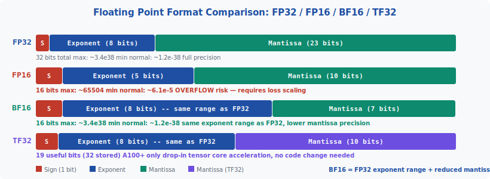
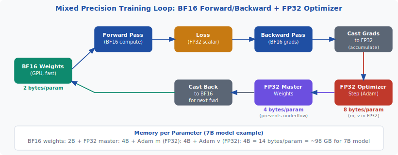
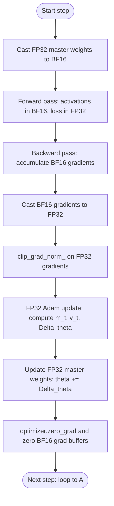

<!-- ============================ TOP NAV ============================ -->
<div align="center">

[🏠 Home](../../README.md) &nbsp;•&nbsp; [📚 Section 3 — Pretraining & Scaling Laws](./README.md) &nbsp;•&nbsp; [⬅️ Q3‑10 — Batch Size](./q10-batch-size.md) &nbsp;•&nbsp; [Q3‑12 — Adam Optimizer ➡️](./q12-adam-optimizer.md)

</div>

---

# Q3‑11 · What is mixed-precision training (BF16/FP32)? How does the master weight copy prevent underflow?

<div align="center">


</div>

> [!IMPORTANT]
> **The 20-second answer.** Mixed-precision training runs the forward and backward passes in **BF16** (16-bit bfloat16) for speed and memory savings, but keeps a **FP32 master copy of the weights** for the optimizer step. The FP32 copy is essential because small weight updates — $\Delta\theta = \text{lr} \times \text{gradient}$ — can be as small as $10^{-7}$, which **underflows to zero in FP16** (minimum positive: ~$6 \times 10^{-5}$) and loses precision in BF16's 7-bit mantissa. FP32's 23-bit mantissa preserves these tiny updates exactly. Total memory cost: **14 bytes per parameter** (2B BF16 + 4B FP32 master + 4B Adam m + 4B Adam v), meaning a 7B model needs ~98 GB just for weights and optimizer states.

---

## Table of contents

1. [First principles — why precision matters](#1--first-principles--why-precision-matters)
2. [Number format anatomy](#2--number-format-anatomy)
3. [FP16 problems: overflow and loss scaling](#3--fp16-problems-overflow-and-loss-scaling)
4. [BF16 advantages over FP16](#4--bf16-advantages-over-fp16)
5. [The mixed-precision training recipe](#5--the-mixed-precision-training-recipe)
6. [The master weight copy — why it exists](#6--the-master-weight-copy--why-it-exists)
7. [TF32 — the silent accelerator](#7--tf32--the-silent-accelerator)
8. [Memory breakdown per parameter](#8--memory-breakdown-per-parameter)
9. [Algorithm and pseudocode](#9--algorithm-and-pseudocode)
10. [Reference implementation](#10--reference-implementation)
11. [Worked numerical example](#11--worked-numerical-example)
12. [Interview drill](#12--interview-drill)
13. [Common misconceptions](#13--common-misconceptions)
14. [One-screen summary](#14--one-screen-summary)
15. [References](#15--references)

---

## 1 · First principles — why precision matters

Neural network training involves two fundamentally different numerical regimes:

**Large numbers (activations, pre-activations):** Layer outputs from attention, FFN blocks, and residual connections can span several orders of magnitude — from near-zero for dead neurons to hundreds for large logit values. These values need sufficient **range** (exponent bits) to avoid overflow and underflow.

**Small numbers (weight updates):** At each optimizer step, the weight update is approximately $\Delta\theta = \eta \times g$ where $\eta$ is typically $10^{-4}$ to $3 \times 10^{-4}$ and $g$ is a gradient of order $10^{-2}$ to $10^{-3}$. This means $\Delta\theta \approx 10^{-6}$ to $10^{-7}$ — extremely small numbers. These values need sufficient **precision** (mantissa bits) to be represented without rounding to zero.

The core insight of mixed-precision training is that **these two requirements conflict** in the available 16-bit formats, and they are optimally satisfied by using different formats for different parts of the training loop: 16-bit formats for the fast arithmetic-heavy operations (forward/backward), and 32-bit format for the precision-critical optimizer step.

---

## 2 · Number format anatomy

IEEE 754 floating-point numbers are represented as:

$$(-1)^S \times 2^{E - \text{bias}} \times (1 + M)$$

where $S$ is the sign bit, $E$ is the stored exponent, and $M$ is the normalized mantissa.

<div align="center">

<br><sub><b>Figure 1.</b> Bit-field layout for FP32, FP16, BF16, and TF32. BF16 (16-bit bfloat16) preserves FP32's full 8-bit exponent range while reducing the mantissa from 23 to 7 bits. FP16's 5-bit exponent severely limits its range (max ~65504 vs FP32's ~3.4×10^38), causing frequent overflow in LLM training. TF32 (19 useful bits, 32 stored) is used internally by NVIDIA tensor cores on A100+ GPUs.</sub>
</div>

The key properties of each format:

| Format | Sign | Exponent | Mantissa | Total bits | Max value | Min normal |
|---|---|---|---|---|---|---|
| FP32 | 1 | 8 | 23 | 32 | ~3.4 × 10^38 | ~1.2 × 10^-38 |
| FP16 | 1 | 5 | 10 | 16 | ~65504 | ~6.1 × 10^-5 |
| BF16 | 1 | 8 | 7 | 16 | ~3.4 × 10^38 | ~1.2 × 10^-38 |
| TF32 | 1 | 8 | 10 | 19+padding | ~3.4 × 10^38 | ~1.2 × 10^-38 |

**The exponent determines range; the mantissa determines precision.** BF16 trades precision for range relative to FP16, which turns out to be the right trade-off for neural network training.

---

## 3 · FP16 problems: overflow and loss scaling

FP16's maximum representable value is approximately **65504** — far too small for many intermediate computations in LLMs. A single attention logit computed as $QK^T / \sqrt{d_k}$ can exceed this limit if the query and key vectors are not carefully normalized. Any value above 65504 in FP16 becomes `+Inf`, which propagates through the computation and produces `NaN` gradients.

**Loss scaling** was developed as the standard workaround for FP16 training. The approach:

1. **Before backward pass:** multiply the scalar loss by a large constant $s$ (the "loss scale", typically $2^{15} = 32768$)
2. **During backward pass:** all gradients are automatically scaled by $s$ (via chain rule)
3. **Before optimizer step:** divide all gradients by $s$ to recover the true gradient magnitudes
4. **Check for overflow:** if any gradient is `Inf` or `NaN` after unscaling, skip the optimizer step for this iteration

**Dynamic loss scaling** automates scale selection: start at $s = 2^{15}$, halve whenever overflow is detected, and double every 2000 steps without overflow. This adaptive strategy ensures the scale is always as large as possible without causing overflow.

**Why this is painful in practice.** Loss scaling adds code complexity, the possibility of skipping steps (wasted compute), and a hyperparameter (the initial scale) that must be tuned. It is one of the primary reasons the community moved from FP16 to BF16 as soon as NVIDIA GPUs with BF16 hardware support became available (A100, 2020).

---

## 4 · BF16 advantages over FP16

**BF16 (Brain Float 16)** was developed by Google Brain (hence "Brain Float") and designed specifically for deep learning. The key design decision: **reuse FP32's exponent range, sacrifice mantissa precision.**

**Why this is the right trade-off for neural network training:**

1. **Activations need range, not precision.** The distribution of neural network activations is approximately log-normal — they span many orders of magnitude but don't require high relative precision within any given range. The 8-bit exponent (same as FP32) gives a range from ~10^-38 to ~10^38, which easily covers all activation values in practice.

2. **Gradients tolerate quantization noise.** Stochastic gradient descent is inherently noisy — each mini-batch provides a noisy estimate of the true gradient. Adding a small amount of rounding noise from 7-bit mantissa quantization is negligible compared to the mini-batch sampling noise. Empirically, BF16 gradients produce training curves essentially identical to FP32 gradients.

3. **No loss scaling required.** Because BF16 shares FP32's exponent range, overflow of activations and gradients is essentially impossible (the same values that don't overflow FP32 won't overflow BF16). This eliminates loss scaling entirely, simplifying training code significantly.

4. **Hardware support is widespread.** A100, A10, H100, H200, TPU v3+, and AMD MI300X all have native BF16 tensor core support. The hardware speed-up is typically 2× vs FP32 for matrix multiplications.

**The limitation of BF16:** its 7-bit mantissa gives only ~2 decimal digits of relative precision, compared to FP32's ~7 digits. This is perfectly fine for activations and gradients but **insufficient for weight updates** — which is exactly the problem the master weight copy solves.

---

## 5 · The mixed-precision training recipe

The standard mixed-precision recipe was formalized by Micikevicius et al. (2018) for FP16, and the same recipe applies to BF16 (without the loss scaling step). The key insight is to use the right precision for each part of the training loop:

**Step-by-step recipe:**

1. **Maintain weights in two copies:**
   - BF16 copy: on GPU, used for forward/backward arithmetic
   - FP32 master copy: on GPU (or CPU), used for optimizer updates

2. **Forward pass (BF16):**
   - Load BF16 weights from GPU memory
   - Compute activations in BF16 (or BF16 accumulated to FP32 for reductions)
   - Compute scalar loss in FP32

3. **Backward pass (BF16):**
   - Propagate gradients in BF16
   - Accumulate gradients in FP32 if using gradient accumulation

4. **Cast gradients to FP32:**
   - Convert BF16 gradients to FP32 before passing to optimizer
   - This preserves the small gradient values that would lose precision in BF16

5. **FP32 optimizer step:**
   - Adam update: compute $m_t$, $v_t$, bias-corrected estimates in FP32
   - Compute weight update $\Delta\theta$ in FP32 (where tiny values are preserved)
   - Add $\Delta\theta$ to FP32 master weights

6. **Cast FP32 master weights to BF16:**
   - Write BF16 copy for next forward pass

<div align="center">

<br><sub><b>Figure 2.</b> Mixed precision training loop. The forward and backward passes operate in BF16 (fast, low memory). The optimizer step and weight storage use FP32 (high precision for tiny weight updates). Each optimizer step casts BF16 gradients to FP32 before accumulation, updates the FP32 master weights, then casts back to BF16 for the next iteration. (Micikevicius et al. 2018)</sub>
</div>

---

## 6 · The master weight copy — why it exists

The FP32 master weight copy exists to solve one specific numerical problem: **weight update underflow**.

**The underflow problem.** During the optimizer step, Adam computes:

$$\Delta\theta = \frac{\eta \cdot \hat{m}_t}{\sqrt{\hat{v}_t} + \epsilon}$$

With a typical learning rate $\eta = 3 \times 10^{-4}$, a gradient moment $\hat{m}_t \approx 0.01$, and second moment $\hat{v}_t \approx 10^{-4}$:

$$\Delta\theta \approx \frac{3 \times 10^{-4} \times 0.01}{\sqrt{10^{-4}} + 10^{-6}} \approx \frac{3 \times 10^{-6}}{0.01} = 3 \times 10^{-4}$$

But for well-trained weights late in training, gradients are much smaller: $\hat{m}_t \approx 10^{-4}$, giving $\Delta\theta \approx 3 \times 10^{-7}$.

**In BF16:** The minimum positive normalized BF16 number is ~$1.18 \times 10^{-38}$ (same as FP32 in terms of range). However, the mantissa has only 7 bits — relative precision is ~1/128 ≈ 0.8%. For a weight value of, say, $\theta = 0.5$, the smallest representable step is approximately $0.5 / 128 \approx 0.004$. A weight update of $\Delta\theta = 3 \times 10^{-7}$ would round to exactly zero — the update is lost.

**In FP32:** 23 mantissa bits give relative precision ~1/(2^23) ≈ 1.2 × 10^{-7}. For $\theta = 0.5$, the smallest representable step is ~6 × 10^{-8}. The update $\Delta\theta = 3 \times 10^{-7}$ is represented with only ~50% relative error — not perfect, but the accumulation across thousands of steps is correctly tracked.

**Why accumulation is the key.** Any single weight update $\Delta\theta = 3 \times 10^{-7}$ is tiny, but over $N$ steps the total displacement is $N \times 3 \times 10^{-7}$. With 100,000 steps, the total displacement is 0.03 — significant! If each tiny update is rounded to zero in BF16, the cumulative displacement is also zero, and the weights stagnate. The FP32 master copy accumulates these tiny updates correctly.

> [!NOTE]
> This is the same reason that multi-precision accumulation appears in other contexts: hardware matrix multiply units on modern GPUs perform BF16 arithmetic but accumulate into FP32 registers internally, for exactly the same reason.

---

## 7 · TF32 — the silent accelerator

**TF32 (TensorFloat-32)** is a proprietary format introduced by NVIDIA with the A100 GPU (2020). It is not a user-visible format — you cannot store tensors in TF32 — but it changes the precision of NVIDIA tensor core computations internally.

**What TF32 does.** When A100 (and later) tensor cores perform matrix multiplications on FP32 inputs:
- The inputs are rounded from 23-bit mantissa to 10-bit mantissa (TF32 precision)
- The arithmetic is performed with 8-bit exponent and 10-bit mantissa
- The accumulator uses FP32 precision

**Effect on training:** On A100+ GPUs, all FP32 matrix multiplications automatically use TF32 unless explicitly disabled. This gives a ~8-10× speedup in matrix multiply throughput compared to true FP32 math, at the cost of reduced mantissa precision (10 bits vs 23 bits). For the weight matrices and activations used in forward/backward passes, this precision reduction is empirically harmless.

**Relationship to mixed-precision.** TF32 is orthogonal to the BF16/FP32 mixed-precision recipe. When you use BF16 mixed precision, the fast path is BF16 → BF16 tensor cores. When you use FP32 (e.g., for the optimizer step), the fast path is FP32 → TF32 tensor cores (if available). The FP32 master weight accumulation still uses FP32 accumulators even when TF32 is active.

**Disabling TF32.** PyTorch enables TF32 by default on A100+. To disable:

```python
torch.backends.cuda.matmul.allow_tf32 = False
torch.backends.cudnn.allow_tf32 = False
```

This is occasionally useful for debugging numerical issues but reduces performance significantly.

---

## 8 · Memory breakdown per parameter

Understanding the memory cost of mixed-precision training is essential for estimating hardware requirements. For a model trained with AdamW and BF16 mixed precision:

| Component | Format | Bytes per param | Notes |
|---|---|---|---|
| BF16 model weights | BF16 | 2 | Fast copy for forward/backward |
| FP32 master weights | FP32 | 4 | Precision copy for optimizer |
| Adam first moment (m) | FP32 | 4 | Exponential moving avg of gradient |
| Adam second moment (v) | FP32 | 4 | Exponential moving avg of gradient^2 |
| **Total** | — | **14** | Per trainable parameter |

**For inference only (no optimizer states):** 2 bytes/param (BF16 weights only).

**Model size examples:**

| Model | Parameters | Training memory (14B/param) | Inference memory (BF16) |
|---|---|---|---|
| GPT-2 (small) | 117M | ~1.6 GB | ~0.23 GB |
| LLaMA 2 (7B) | 7B | ~98 GB | ~14 GB |
| LLaMA 2 (70B) | 70B | ~980 GB | ~140 GB |
| GPT-3 (175B) | 175B | ~2.45 TB | ~350 GB |

> [!WARNING]
> The 14 bytes/parameter figure covers only model weights and Adam states. It does **not** include activations (needed during backward pass, scale with batch size × sequence length), gradients during backward pass (another 2B/param for BF16 grads, or 4B/param if cast to FP32), or framework overhead. In practice, peak GPU memory during training is typically 2-3× the 14B/param baseline.

---

## 9 · Algorithm and pseudocode

The complete mixed-precision training step in pseudocode:



```text
===== MIXED PRECISION TRAINING STEP =====
INPUT : FP32 master weights W_fp32, BF16 weight view W_bf16
        Adam states: m (FP32), v (FP32)
        mini-batch X, hyperparams: lr, beta1, beta2, eps, clip_max

1.  W_bf16 <- cast(W_fp32, dtype=BF16)   # sync BF16 view from master

2.  loss <- model_forward(X, W_bf16)      # forward in BF16; loss is FP32

3.  g_bf16 <- autograd.backward(loss)     # backward in BF16

4.  g_fp32 <- cast(g_bf16, dtype=FP32)   # upcast gradients

5.  g_norm = global_L2_norm(g_fp32)
    IF g_norm > clip_max:
        g_fp32 <- g_fp32 * (clip_max / g_norm)

6.  FOR each parameter theta in W_fp32:   # Adam update in FP32
        m <- beta1 * m + (1 - beta1) * g_fp32
        v <- beta2 * v + (1 - beta2) * g_fp32^2
        m_hat <- m / (1 - beta1^t)
        v_hat <- v / (1 - beta2^t)
        theta <- theta - lr * m_hat / (sqrt(v_hat) + eps)

7.  g_fp32 <- 0; g_bf16 <- 0             # zero gradients

8.  LOG g_norm for monitoring

===== LOSS SCALING VARIANT (FP16 only) =====
After step 2: loss_scaled = loss * scale_factor
After step 3: g_bf16 = autograd.backward(loss_scaled)
              g_bf16 = g_bf16 / scale_factor  # unscale
              IF any(isinf(g_bf16) or isnan(g_bf16)):
                  scale_factor /= 2; SKIP optimizer step
              ELSE: scale_factor may be doubled every 2000 steps
```

---

## 10 · Reference implementation

```python
import torch
import torch.nn as nn
from torch.optim import AdamW


def setup_mixed_precision_training(model: nn.Module, lr: float = 3e-4):
    """
    Set up a model for BF16 mixed-precision training.

    The model is kept in BF16 on GPU. AdamW optimizer states are
    automatically kept in FP32 by PyTorch's AMP autocast mechanism
    when using torch.bfloat16.

    Note: On NVIDIA A100+ hardware, BF16 is preferred over FP16 because:
      - BF16 has the same exponent range as FP32 (no overflow)
      - No loss scaling required
      - Empirically equivalent training quality to FP32
    """
    model = model.to(torch.bfloat16).cuda()

    # AdamW with FP32 parameter groups (master copy)
    # When using torch.optim.AdamW with bf16 model weights,
    # PyTorch maintains the optimizer states in FP32 internally.
    optimizer = AdamW(
        model.parameters(),
        lr=lr,
        betas=(0.9, 0.95),
        eps=1e-8,
        weight_decay=0.1,
        fused=True,  # A100+ fused kernel: ~20% faster optimizer step
    )
    return model, optimizer


def training_step_bf16(
    model: nn.Module,
    optimizer: AdamW,
    batch: dict,
    clip_max: float = 1.0,
    step: int = 0,
) -> dict:
    """
    One training step with BF16 mixed precision.

    For BF16 (unlike FP16), no GradScaler is needed — BF16 has the same
    exponent range as FP32, so activations and gradients don't overflow.

    PyTorch autocast with dtype=bfloat16 handles casting automatically:
    - Matrix multiplications: BF16
    - Reductions (softmax, layer norm): FP32
    - Loss: FP32

    The optimizer states (m, v) are maintained in FP32 by PyTorch's
    AdamW implementation regardless of the model's dtype.
    """
    # ---- Forward pass with autocast (BF16 for matmuls) --------------
    with torch.autocast(device_type="cuda", dtype=torch.bfloat16):
        outputs = model(**batch)
        loss = outputs.loss  # FP32 scalar

    # ---- Backward pass (BF16 gradients) -----------------------------
    loss.backward()

    # ---- Gradient clipping on FP32-upcast gradients -----------------
    # PyTorch's clip_grad_norm_ internally upcasts BF16 grads to FP32
    # for the norm computation, then applies the scale to BF16 grads.
    grad_norm = torch.nn.utils.clip_grad_norm_(
        model.parameters(),
        max_norm=clip_max,
        norm_type=2.0,
    ).item()

    # ---- Optimizer step (FP32 master weights updated internally) ----
    optimizer.step()
    optimizer.zero_grad()

    return {
        "loss": loss.item(),
        "grad_norm": grad_norm,
        "step": step,
    }


def show_memory_breakdown(num_params: int) -> None:
    """
    Print memory breakdown for a model with a given parameter count.
    Assumes BF16 mixed precision with AdamW.
    """
    bf16_weights = num_params * 2 / 1e9   # bytes -> GB
    fp32_master = num_params * 4 / 1e9
    adam_m = num_params * 4 / 1e9
    adam_v = num_params * 4 / 1e9
    total = bf16_weights + fp32_master + adam_m + adam_v

    print(f"Parameters:       {num_params / 1e9:.1f}B")
    print(f"BF16 weights:     {bf16_weights:.1f} GB  (2 bytes/param)")
    print(f"FP32 master:      {fp32_master:.1f} GB  (4 bytes/param)")
    print(f"Adam m (FP32):    {adam_m:.1f} GB  (4 bytes/param)")
    print(f"Adam v (FP32):    {adam_v:.1f} GB  (4 bytes/param)")
    print(f"Total:            {total:.1f} GB  (14 bytes/param)")
    print(f"(Excludes activations, which scale with batch size)")


if __name__ == "__main__":
    show_memory_breakdown(7_000_000_000)
    # Output:
    # Parameters:       7.0B
    # BF16 weights:     14.0 GB  (2 bytes/param)
    # FP32 master:      28.0 GB  (4 bytes/param)
    # Adam m (FP32):    28.0 GB  (4 bytes/param)
    # Adam v (FP32):    28.0 GB  (4 bytes/param)
    # Total:            98.0 GB  (14 bytes/param)
```

> [!WARNING]
> When using BF16 with `torch.autocast`, the autocast context applies only to the forward pass and loss computation. The backward pass gradients are automatically cast to match the weight dtype (BF16), but PyTorch's AdamW fused kernel internally upcasts to FP32 for the optimizer step — you do **not** need to manually maintain separate FP32 master weights when using `torch.optim.AdamW` with `fused=True`. The FP32 accumulation happens inside the optimizer kernel.

---

## 11 · Worked numerical example

### The underflow problem — concrete arithmetic

Consider a weight $\theta = 0.4375$ (chosen because it is exactly representable in BF16 as $0.4375 = 7 \times 2^{-4}$, exponent field = 125, mantissa = $0111000$ in 7 bits).

After 90,000 training steps, the model is well-converged. The Adam update for this weight produces:

$$\Delta\theta = \frac{\eta \cdot \hat{m}_t}{\sqrt{\hat{v}_t} + \epsilon} = \frac{3 \times 10^{-4} \times 2 \times 10^{-4}}{\sqrt{4 \times 10^{-8}} + 10^{-8}} = \frac{6 \times 10^{-8}}{2 \times 10^{-4}} = 3 \times 10^{-4}$$

Wait — this is large enough. Let us take a more extreme case: very small gradient late in training.

$$\Delta\theta = \frac{3 \times 10^{-4} \times 5 \times 10^{-6}}{2 \times 10^{-4}} = \frac{1.5 \times 10^{-9}}{2 \times 10^{-4}} = 7.5 \times 10^{-6}$$

### Step 1: Attempt to add $\Delta\theta$ in BF16

BF16 relative precision: the spacing between adjacent representable numbers near $\theta = 0.4375$ is:

$$\text{spacing} = 2^{\lfloor \log_2(0.4375) \rfloor} \times 2^{-7} = 2^{-2} \times 2^{-7} = 2^{-9} \approx 1.95 \times 10^{-3}$$

The update $\Delta\theta = 7.5 \times 10^{-6}$ is **260× smaller** than the spacing between adjacent BF16 numbers near $\theta = 0.4375$. In BF16:

$$\theta_{\text{new, BF16}} = \text{round}_{BF16}(0.4375 + 7.5 \times 10^{-6}) = \text{round}_{BF16}(0.43750750...) = 0.4375$$

The update rounds to zero. The weight is **unchanged**.

### Step 2: Perform the same addition in FP32

FP32 spacing near 0.4375:

$$\text{spacing} = 2^{-2} \times 2^{-23} = 2^{-25} \approx 2.98 \times 10^{-8}$$

The update $\Delta\theta = 7.5 \times 10^{-6}$ is **252× larger** than the FP32 spacing. In FP32:

$$\theta_{\text{new, FP32}} = 0.43750750...$$

This is representable to 7 significant digits — the update is preserved with negligible rounding error.

### Step 3: Cumulative effect over 10,000 steps

If such updates occur at every step:

- **BF16 only:** 0 cumulative change ($\Delta\theta$ rounds to zero every step)
- **FP32 master:** $10{,}000 \times 7.5 \times 10^{-6} = 0.075$ cumulative change

A cumulative weight shift of 0.075 in a weight near 0.44 is approximately 17% — a significant and meaningful change that would be completely lost without the FP32 master copy.

### Step 4: Memory cost of the master copy

For a 7B parameter model, the FP32 master copy costs:

$$7 \times 10^9 \times 4 \text{ bytes} = 28 \text{ GB}$$

The BF16 working copy costs $7 \times 10^9 \times 2 = 14$ GB. The master copy costs twice the working copy — but it preserves every tiny gradient update that would otherwise be lost. This is a well-justified overhead.

---

## 12 · Interview drill

<details>
<summary><b>Q: Why do we need BF16 at all? Why not just use FP32 throughout?</b></summary>

FP32 training is 2-4× slower and uses 2× more GPU memory for the same model and batch size. On a 7B model, FP32 weights alone require 28 GB vs 14 GB for BF16. The additional memory reduces the batch size that fits on a single GPU, requiring more gradient accumulation or more GPUs. The speed difference comes from tensor core throughput: A100 can perform 312 TFLOP/s in BF16 but only ~77 TFLOP/s in FP32 (without TF32). Since BF16 activations and gradients produce essentially the same training outcome as FP32 (the precision difference is well within mini-batch gradient noise), using FP32 throughout wastes hardware capacity with no benefit.
</details>

<details>
<summary><b>Q: Why is BF16 preferred over FP16 for LLM training?</b></summary>

The key difference is the exponent size: BF16 has 8 exponent bits (same as FP32, max value ~3.4×10^38), while FP16 has 5 exponent bits (max value ~65504). LLM training produces activation values that frequently exceed 65504 — particularly in attention logits and residual streams — causing FP16 overflow (→ Inf/NaN). BF16 never overflows for the same values that don't overflow FP32. Additionally, FP16 training requires loss scaling (multiply loss by 2^15, divide gradients after backward) to prevent gradient underflow, adding code complexity and occasional skipped steps. BF16 requires no loss scaling. The trade-off is that BF16 has only 7 mantissa bits vs FP16's 10, but for neural network activations and gradients, this lower precision is acceptable.
</details>

<details>
<summary><b>Q: What exactly is the "master weight copy" and why does it prevent underflow?</b></summary>

The master weight copy is a separate FP32 version of the model weights stored in memory alongside the BF16 working copy. After each optimizer step, the FP32 master copy is updated (tiny increments of 10^-6 to 10^-7 are accurately tracked because FP32 has 23-bit mantissa precision). The BF16 working copy is then refreshed from the master. Without the master copy, if the weight update is smaller than the representable spacing near the current weight value in BF16 (which it often is late in training), the update rounds to zero and is lost forever. Over thousands of steps, this means the weights stop being updated — the model stagnates.
</details>

<details>
<summary><b>Q: How much memory does a 13B parameter model need for training with BF16 mixed precision?</b></summary>

Using the 14 bytes/parameter formula: 13B × 14 bytes = 182 GB for weights and optimizer states. This breaks down as: BF16 weights = 26 GB, FP32 master weights = 52 GB, Adam first moment m = 52 GB, Adam second moment v = 52 GB. This excludes activations (depends on batch size and sequence length, but can be 20-50 GB for typical training configurations) and gradient buffers (another 26 GB for BF16 gradients). Peak GPU memory is typically 250-350 GB for a 13B model, requiring either a large number of GPUs or advanced memory optimization (ZeRO-3, gradient checkpointing).
</details>

<details>
<summary><b>Q: What is dynamic loss scaling and when is it needed?</b></summary>

Dynamic loss scaling is a technique for training with FP16 (not needed for BF16). Since FP16's maximum value is ~65504, gradients can overflow during the backward pass. Loss scaling multiplies the scalar loss by a large constant (e.g., 2^15 = 32768) before backpropagation, scaling all gradients up by the same factor (via chain rule) to keep them in FP16's representable range. Before the optimizer step, gradients are divided by the same constant to recover their true values. "Dynamic" refers to automatic adjustment of the scale: halved when overflow is detected (Inf/NaN in gradients), doubled every 2000 steps without overflow. BF16 doesn't need loss scaling because its exponent range matches FP32 — gradients that don't overflow FP32 don't overflow BF16.
</details>

<details>
<summary><b>Q: Is gradient checkpointing related to mixed precision? How do they interact?</b></summary>

They are orthogonal techniques that are often used together. Gradient checkpointing (activation recomputation) reduces memory by not storing intermediate activations during the forward pass — instead, they are recomputed during the backward pass. This trades compute (extra forward computations) for memory. Mixed precision reduces memory by using 16-bit formats for weights and activations. When combined: mixed precision reduces the memory cost of the activations that are recomputed, making gradient checkpointing even more memory-efficient. A typical large LLM training setup uses all three: BF16 mixed precision + gradient checkpointing + ZeRO optimizer states sharding.
</details>

---

## 13 · Common misconceptions

| Misconception | Reality |
|---|---|
| "FP16 and BF16 are the same thing — both are 16-bit." | They use the bits completely differently. FP16 has 5 exponent + 10 mantissa bits; BF16 has 8 exponent + 7 mantissa bits. BF16 has the same range as FP32; FP16 does not. |
| "The master weight copy is stored on CPU to save GPU memory." | In modern training setups, FP32 master weights are stored on GPU alongside BF16 weights. Putting them on CPU would cause massive data transfer overhead every step. |
| "Loss scaling is needed for BF16 training." | Loss scaling was developed for FP16 and is not needed for BF16. BF16's 8-bit exponent gives the same range as FP32, so gradients don't overflow. |
| "TF32 is a user-visible precision format like FP32/BF16." | TF32 is an internal tensor core format on A100+ GPUs. You cannot declare tensors in TF32; it is automatically used for FP32 matrix multiplications inside NVIDIA hardware. |
| "Mixed precision training always produces slightly worse results than FP32." | Empirically, BF16 mixed precision training produces essentially identical final model quality to FP32 training. The gradient noise from BF16 quantization is negligible compared to mini-batch sampling noise. |
| "You can safely store optimizer states in BF16 to save memory." | No — storing Adam's m and v states in BF16 will cause catastrophic precision loss in the optimizer's momentum estimates, leading to poor convergence. FP32 optimizer states are non-negotiable. |

---

## 14 · One-screen summary

> **What mixed precision is:** Running forward/backward passes in BF16 (fast, 2B/param) while maintaining FP32 master weights and optimizer states (4B+4B+4B/param = 12B/param) for the optimizer step.
>
> **Why BF16 not FP16:** BF16 has 8 exponent bits (same range as FP32 → no overflow, no loss scaling needed). FP16 has only 5 exponent bits (max ~65504 → overflow in attention logits, requires loss scaling).
>
> **Why the FP32 master copy:** Weight updates $\Delta\theta \sim 10^{-6}$ to $10^{-7}$ underflow BF16's 7-bit mantissa precision (spacing near typical weight values is ~10^{-3}). FP32's 23-bit mantissa preserves them. Without the master copy, weights stagnate late in training.
>
> **Memory formula:** 14 bytes/parameter for training (BF16 + FP32 + Adam m + Adam v). 7B model = ~98 GB, 70B model = ~980 GB.
>
> **TF32:** Internal A100+ format for FP32 matrix multiplications. Not user-visible. Gives ~8× FP32 throughput with minimal precision loss — orthogonal to the BF16/FP32 mixed precision recipe.

---

## 15 · References

1. Micikevicius, P. et al. — **Mixed Precision Training**. *ICLR 2018 / arXiv:1710.03740.* — The foundational paper introducing the mixed-precision recipe: FP16 forward/backward + FP32 master weights + loss scaling. All modern BF16 training recipes are derived from this work.

2. Kalamkar, D. et al. — **A Study of BFLOAT16 for Deep Learning Training**. *arXiv:1905.12322, 2019.* — Google Brain paper demonstrating that BF16 (with its larger exponent range) achieves equivalent training quality to FP32 without loss scaling; establishes BF16 as the standard for LLM training.

3. Brown, T. et al. — **Language Models are Few-Shot Learners** (GPT-3). *NeurIPS 2020 / arXiv:2005.14165.* — GPT-3 training uses FP16 mixed precision with loss scaling; motivates the subsequent community move to BF16.

4. Touvron, H. et al. — **LLaMA: Open and Efficient Foundation Language Models**. *arXiv:2302.13971, 2023.* — LLaMA 1 uses BF16 training; one of the first major open-source LLMs to fully document the BF16 mixed-precision setup.

5. Loshchilov, I., Hutter, F. — **Decoupled Weight Decay Regularization** (AdamW). *ICLR 2019 / arXiv:1711.05101.* — AdamW optimizer used in mixed-precision training; the FP32 optimizer state requirement applies specifically to Adam-family optimizers with their second-moment estimates.

6. Rajbhandari, S. et al. — **ZeRO: Memory Optimizations Toward Training Trillion Parameter Models**. *SC 2020 / arXiv:1910.02054.* — ZeRO optimizer sharding, which partitions the 12B/param FP32 optimizer states across GPUs, enabling mixed-precision training of models that don't fit on a single node.

7. NVIDIA — **NVIDIA A100 Tensor Core GPU Architecture**. *NVIDIA Whitepaper, 2020.* — Introduces TF32, BF16 tensor core support, and memory bandwidth specifications referenced in memory efficiency analysis.

8. Weng, L. — **Large Transformer Model Inference Optimization**. *Lil'Log blog, 2023.* — Accessible survey covering mixed precision, quantization, and memory trade-offs; good background reading.

9. Paszke, A. et al. — **PyTorch: An Imperative Style, High-Performance Deep Learning Library**. *NeurIPS 2019 / arXiv:1912.01703.* — PyTorch; the `torch.autocast` and `torch.cuda.amp.GradScaler` APIs used in all reference implementations.

10. Rae, J. et al. — **Scaling Language Models: Methods, Analysis & Insights from Training Gopher**. *arXiv:2112.11446, 2021.* — Gopher training uses BF16 mixed precision; provides additional empirical evidence that BF16 matches FP32 quality at scale.

11. Meta AI — **The Llama 3 Herd of Models**. *arXiv:2407.21783, 2024.* — LLaMA 3 mixed precision details; uses BF16 throughout with FP32 optimizer states, consistent with the standard recipe.

---

<!-- ============================ BOTTOM NAV ============================ -->
<div align="center">

[⬅️ Q3‑10 — Batch Size](./q10-batch-size.md) &nbsp;|&nbsp; [📚 Back to Section 3](./README.md) &nbsp;|&nbsp; [🏠 Home](../../README.md) &nbsp;|&nbsp; [Q3‑12 — Adam Optimizer ➡️](./q12-adam-optimizer.md)

<sub>Found an error or have a sharper intuition? See <a href="../../CONTRIBUTING.md">CONTRIBUTING</a> — answers follow the <a href="../../_TEMPLATE.md">answer template</a>.</sub>

</div>
