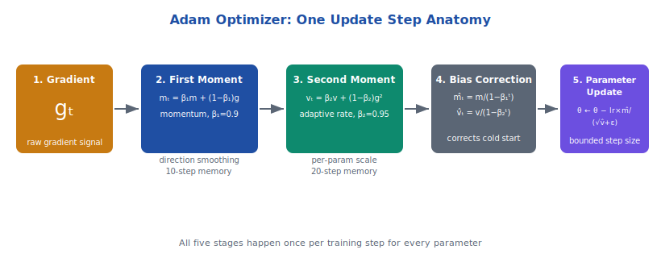
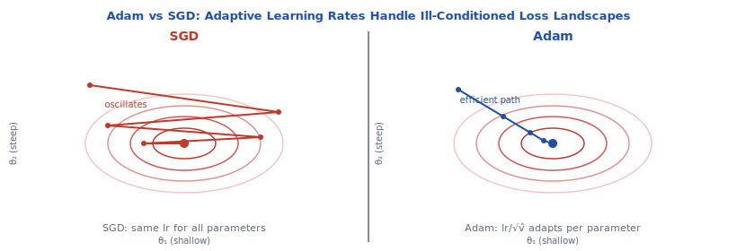

<!-- ============================ TOP NAV ============================ -->
<div align="center">

[🏠 Home](../../README.md) &nbsp;•&nbsp; [📚 Section 3 — Pretraining & Scaling Laws](./README.md) &nbsp;•&nbsp; [⬅️ Q3‑11 — Mixed Precision Training](./q11-mixed-precision.md) &nbsp;•&nbsp; [Q3‑13 — AdamW & Weight Decay ➡️](./q13-adamw-weight-decay.md)

</div>

---

# Q3‑12 · What is the Adam optimizer and why is it the default for LLM pretraining? What do the β₁, β₂, ε hyperparameters control?

<div align="center">


</div>

> [!IMPORTANT]
> **The 20-second answer.** Adam (Adaptive Moment Estimation, Kingma & Ba 2015) maintains two running statistics for each parameter: **m_t** (EMA of gradients, controlled by β₁ = 0.9) and **v_t** (EMA of squared gradients, controlled by β₂ = 0.95 for LLMs). The update is θ ← θ − lr × m̂_t / (√v̂_t + ε), where ε ≈ 1e-8 prevents division by zero. Adam is the default for LLM pretraining because LLMs have **heterogeneous gradient scales** across layers and **sparse embedding gradients** — per-parameter adaptive learning rates handle both far better than SGD.

---

## Table of contents

1. [First principles — why adaptive optimizers exist](#1--first-principles--why-adaptive-optimizers-exist)
2. [The Adam algorithm step by step](#2--the-adam-algorithm-step-by-step)
3. [β₁: momentum and the first moment](#3--β₁-momentum-and-the-first-moment)
4. [β₂: adaptive learning rate and the second moment](#4--β₂-adaptive-learning-rate-and-the-second-moment)
5. [Bias correction — why it matters at startup](#5--bias-correction--why-it-matters-at-startup)
6. [ε: numerical stability and the SGD connection](#6--ε-numerical-stability-and-the-sgd-connection)
7. [Why Adam is the default for LLM pretraining](#7--why-adam-is-the-default-for-llm-pretraining)
8. [LLM hyperparameter choices across major models](#8--llm-hyperparameter-choices-across-major-models)
9. [Why LLMs use β₂ = 0.95 not β₂ = 0.999](#9--why-llms-use-β₂--095-not-β₂--0999)
10. [Warm-up is critical — the cold-start instability](#10--warm-up-is-critical--the-cold-start-instability)
11. [Reference implementation](#11--reference-implementation)
12. [Worked numerical example](#12--worked-numerical-example)
13. [Interview drill](#13--interview-drill)
14. [Common misconceptions](#14--common-misconceptions)
15. [References](#15--references)

---

## 1 · First principles — why adaptive optimizers exist

Standard stochastic gradient descent (SGD) updates every parameter using the same global learning rate α:

$$\theta_t = \theta_{t-1} - \alpha \cdot g_t$$

This uniformity is a fundamental limitation. In deep neural networks — and especially in large Transformer language models — different parameters have **wildly different gradient scales**:

- **Embedding rows** for rare tokens may go entire batches without receiving any gradient signal (sparse gradients). When they finally do receive a gradient, it can be small because the token appeared in only one or two positions.
- **Output projection weights** in attention layers accumulate gradients from every token in every sequence and tend to have much larger gradient magnitudes.
- **Layer norm scales (γ, β)** are scalar parameters that affect the entire residual stream; their gradients are often larger per-parameter than those of weight matrices.

With a single learning rate, you face an impossible tradeoff: setting α large enough for sparse embedding rows means taking catastrophically large steps for the output projection; setting α small enough for the projection means the embedding rows never meaningfully update.

**Adaptive optimizers** solve this by maintaining per-parameter estimates of gradient scale and using those estimates to compute effective per-parameter learning rates. Each parameter gets a learning rate that is inversely proportional to the square root of its historical gradient magnitude — large-gradient parameters get smaller effective rates, small-gradient parameters get larger effective rates.

Adam (Kingma & Ba, 2015) is the dominant adaptive optimizer. It combines:

1. **Momentum** (first moment): a running average of gradients that smooths the update direction, reducing oscillation and noise.
2. **Adaptive learning rates** (second moment): a running average of squared gradients that provides per-parameter scaling.
3. **Bias correction**: a startup correction that ensures the two moments are properly calibrated from the very first step.

This combination produces an optimizer that is robust to heterogeneous gradient scales, handles sparse parameters gracefully, and converges reliably across a wide range of hyperparameter settings — properties that made it the default for LLM pretraining from GPT-3 onward.

---

## 2 · The Adam algorithm step by step

At each training step $t$, given parameters $\theta$ and gradient $g_t = \nabla_\theta \mathcal{L}$:

**Step 1: Update the first moment (gradient EMA)**

$$m_t = \beta_1 \cdot m_{t-1} + (1 - \beta_1) \cdot g_t$$

This is an exponential moving average of the raw gradient. $m_t$ tracks the expected gradient direction, smoothed over recent steps. It plays the role of momentum in classical SGD.

**Step 2: Update the second moment (squared gradient EMA)**

$$v_t = \beta_2 \cdot v_{t-1} + (1 - \beta_2) \cdot g_t^2$$

This is an exponential moving average of the squared gradient. $v_t$ tracks the expected per-parameter gradient variance. The square root of $v_t$ estimates the typical gradient magnitude for each parameter.

**Step 3: Bias-correct the first moment**

$$\hat{m}_t = \frac{m_t}{1 - \beta_1^t}$$

Because both moments are initialized at zero, they are systematically underestimated early in training. Dividing by $(1 - \beta^t)$ corrects this cold-start bias. See Section 5 for the full derivation.

**Step 4: Bias-correct the second moment**

$$\hat{v}_t = \frac{v_t}{1 - \beta_2^t}$$

Same correction applied to the second moment.

**Step 5: Compute the parameter update**

$$\theta_t = \theta_{t-1} - \alpha \cdot \frac{\hat{m}_t}{\sqrt{\hat{v}_t} + \varepsilon}$$

The numerator $\hat{m}_t$ provides the smoothed gradient direction. The denominator $\sqrt{\hat{v}_t} + \varepsilon$ normalizes by the per-parameter gradient scale. The ratio $\hat{m}_t / \sqrt{\hat{v}_t}$ has magnitude roughly $\pm 1$ — Adam takes approximately **unit-scale steps in parameter space**, regardless of the raw gradient magnitude. The global learning rate $\alpha$ then scales this unit step.

This last property is critical: Adam implements **implicit per-parameter normalization**. It does not just accelerate convergence — it fundamentally changes the geometry of parameter updates, making training far more robust to differences in parameter scale and gradient magnitude across layers.

<div align="center">

<br><sub><b>Figure 1.</b> Adam Optimizer: One Update Step Anatomy. The five-stage pipeline from raw gradient g_t to parameter update. Stage 1 (amber): raw gradient g_t. Stage 2 (navy): first moment m_t = β₁m_{t-1} + (1−β₁)g_t, controls gradient direction (β₁=0.9, 10-step memory). Stage 3 (teal): second moment v_t = β₂v_{t-1} + (1−β₂)g_t², controls step size per parameter (β₂=0.95, 20-step memory). Stage 4 (gray): bias-corrected m̂_t and v̂_t rescale early-step estimates. Stage 5 (purple): update θ ← θ − lr × m̂_t / (√v̂_t + ε).</sub>
</div>

---

## 3 · β₁: momentum and the first moment

**Default value:** β₁ = 0.9 (universal across all major LLMs).

β₁ is the exponential decay rate for the first moment — the gradient EMA. It controls how quickly the memory of past gradients fades. The **effective memory timescale** is:

$$\tau_1 = \frac{1}{1 - \beta_1} = \frac{1}{1 - 0.9} = 10 \text{ steps}$$

Gradients from more than 10 steps ago have a weight below $1/e \approx 0.37$ in the current estimate. After 20 steps, the weight is below $e^{-2} \approx 0.14$.

**Effect of β₁ on training dynamics:**

| β₁ value | Memory timescale | Effect |
|---|---|---|
| 0.0 | 1 step | No momentum — pure stochastic gradient descent |
| 0.9 (default) | 10 steps | Smooth gradient direction; standard for LLMs |
| 0.95 | 20 steps | Heavier smoothing; occasionally used for fine-tuning |
| 0.99 | 100 steps | Very heavy smoothing; rarely used for LLMs |

**Why β₁ = 0.9 is nearly universal:** With 10-step effective memory, $m_t$ smooths over enough gradient noise to improve update stability without being so slow to react that it misses genuine loss landscape features. This value predates Adam itself — it was the standard momentum coefficient for SGD with momentum, and it carried over to Adam because it works well empirically across a vast range of architectures and tasks.

**Higher β₁ → smoother updates, less reactive.** If the gradient direction changes suddenly (e.g., at the boundary between two loss basins), a high β₁ means the optimizer continues in the old direction for many steps before adapting. This can be beneficial (it prevents overreacting to noisy gradient fluctuations) or harmful (it can cause the optimizer to overshoot when the loss landscape genuinely changes).

**Lower β₁ → noisier but more reactive.** Lower values make the optimizer more sensitive to the current batch's gradient. This can be useful in fine-tuning scenarios where you want rapid adaptation but is generally unstable at the large batch sizes used in LLM pretraining.

> [!NOTE]
> Unlike β₂ (where LLMs consistently deviate from the Adam paper's recommendation of 0.999), β₁ = 0.9 is nearly universal and matches the original paper. There is no LLM-specific reason to change it.

---

## 4 · β₂: adaptive learning rate and the second moment

**Default value:** β₂ = 0.95 for most LLMs (deviation from the original paper's 0.999).

β₂ controls the exponential decay of the second moment — the squared gradient EMA. The effective memory timescale is:

$$\tau_2 = \frac{1}{1 - \beta_2}$$

At β₂ = 0.999 (original paper): $\tau_2 = 1000$ steps.
At β₂ = 0.95 (LLM default): $\tau_2 = 20$ steps.

This is a 50× difference in memory length.

**What the second moment controls:** The denominator $\sqrt{\hat{v}_t}$ in Adam's update is approximately equal to the per-parameter root-mean-square gradient over the recent history window. A large $\sqrt{\hat{v}_t}$ means this parameter has recently had large gradients → the effective learning rate $\alpha / \sqrt{\hat{v}_t}$ is reduced. A small $\sqrt{\hat{v}_t}$ means sparse or small gradients → larger effective rate.

**Effect of β₂ on effective learning rate:**

- **Large β₂ (0.999):** The denominator changes slowly. The adaptive rate is stable but reacts to changes in gradient scale over ~1000 steps. If gradient magnitudes suddenly increase (e.g., at the start of training), the denominator stays small for a long time, leading to systematically too-large effective rates during the transition.
- **Small β₂ (0.95):** The denominator adapts quickly. Within 20 steps, $v_t$ reflects the current gradient distribution. This rapid adaptation is especially important during the **non-stationary early phase** of LLM pretraining, where gradient scales change rapidly as the model transitions from random initialization to a structured representation.

The detailed justification for why LLMs use β₂ = 0.95 rather than 0.999 is given in Section 9.

<div align="center">

<br><sub><b>Figure 2.</b> Adam vs SGD: Adaptive Learning Rates Handle Ill-Conditioned Loss Landscapes. Left: SGD trajectory on an elliptical contour — zigzags across the steep dimension, slow progress along the shallow dimension because the same lr applies to both. Right: Adam trajectory — adapts lr per dimension, moves efficiently along both axes. Annotation: "SGD: same lr for all parameters" vs "Adam: lr/√v̂ adapts per parameter".</sub>
</div>

---

## 5 · Bias correction — why it matters at startup

Both moment accumulators $m_t$ and $v_t$ are initialized to zero. This creates a systematic cold-start bias that, without correction, causes Adam to take extremely small steps at the beginning of training.

**The problem.** Consider step $t = 1$ with gradient $g_1$:

$$m_1 = \beta_1 \cdot 0 + (1 - \beta_1) \cdot g_1 = (1 - \beta_1) \cdot g_1 = 0.1 \cdot g_1$$

The first moment is 10× smaller than it should be if the EMA had been running long enough to warm up. This is because the EMA "remembers" a past of zeros that did not actually occur — the zero initialization is not a neutral prior, it is a systematic underestimate.

**The derivation.** If we assume $g_t$ is drawn i.i.d. from some distribution with true mean $\mathbb{E}[g]$, then:

$$\mathbb{E}[m_t] = \mathbb{E}[g] \cdot (1 - \beta_1^t)$$

The expected value of $m_t$ is $(1 - \beta_1^t)$ times what we want. Dividing by $(1 - \beta_1^t)$ gives an unbiased estimate:

$$\mathbb{E}[\hat{m}_t] = \mathbb{E}[g]$$

**Bias correction at key steps:**

| Step $t$ | $1 - \beta_1^t$ (β₁=0.9) | Correction factor | Effect |
|---|---|---|---|
| 1 | 0.1 | 10.0 | First moment inflated 10× |
| 5 | 0.41 | 2.44 | Still significant correction |
| 10 | 0.65 | 1.54 | Moderate correction |
| 50 | 0.995 | 1.005 | Negligible |
| 100 | 0.99997 | 1.00003 | Essentially zero |

The same applies to the second moment with $(1 - \beta_2^t)$. With β₂ = 0.95, the correction is negligible after about 60–80 steps. With β₂ = 0.999, it is significant for the first ~2000 steps.

**Without bias correction.** Adam would take extremely small steps at startup: at step 1, $\hat{v}_1 \approx (1-\beta_2) \cdot g_1^2$, which is tiny. The denominator $\sqrt{\hat{v}_1}$ is tiny too, which would make the effective learning rate huge — but $m_1$ is also tiny, so the full update $m_1 / \sqrt{v_1} \approx g_1 / \sqrt{g_1^2} = \pm 1$, which is actually approximately correct. The bias correction thus ensures the scale is right from the start, not just the direction. At step 1 with correction: $\hat{m}_1 = g_1$, $\hat{v}_1 = g_1^2$, effective rate = $\alpha \cdot g_1 / (|g_1| + \varepsilon) \approx \alpha$.

Bias correction is **essential at startup** for the warmup interaction described in Section 10. It becomes irrelevant after approximately $\max(1/(1-\beta_1), 1/(1-\beta_2))$ steps — roughly 20 steps for LLMs with β₂ = 0.95, or 1000 steps for β₂ = 0.999.

---

## 6 · ε: numerical stability and the SGD connection

**Default values:** ε = 1e-8 (GPT-3, standard), ε = 1e-5 (LLaMA 3).

ε is a small constant added to the denominator of Adam's update to prevent division by zero:

$$\theta_t = \theta_{t-1} - \alpha \cdot \frac{\hat{m}_t}{\sqrt{\hat{v}_t} + \varepsilon}$$

**Primary purpose.** When a parameter has received very few or very small gradients, $\hat{v}_t$ is near zero. Without ε, the division would produce numerical infinity or NaN, crashing training.

**Secondary effect: tuning the degree of adaptivity.** Consider the extreme cases:

- When $\varepsilon \ll \sqrt{\hat{v}_t}$: the update is approximately $\alpha \cdot \hat{m}_t / \sqrt{\hat{v}_t}$ — full adaptive behavior.
- When $\varepsilon \gg \sqrt{\hat{v}_t}$: the update approaches $\alpha \cdot \hat{m}_t / \varepsilon$ — this is **SGD with momentum** (the denominator is a constant). Larger ε reduces adaptivity.

This means ε is not just a safety valve — it determines the minimum per-parameter learning rate floor ($\alpha / \varepsilon$) and the transition point between adaptive and SGD-like behavior.

**Why LLaMA uses ε = 1e-5 instead of 1e-8:**

BF16 precision (used in LLaMA 3 training) has only 7 bits of mantissa — much less precision than FP32. The smallest representable normal BF16 value is approximately 1.18 × 10⁻³⁸, but values that are too small relative to the accumulator can underflow to zero during summation.

The second moment $v_t$ is computed as a running sum of squared gradients. In BF16:
- A squared gradient of magnitude $10^{-9}$ may underflow to zero.
- An accumulator $v_t$ that is exactly zero leads to $\sqrt{\hat{v}_t} = 0$, and with ε = 1e-8 the effective learning rate is $\alpha / 1\text{e-}8 = \alpha \times 10^8$ — catastrophically large.

Setting ε = 1e-5 provides a **floor that BF16 can represent reliably** (1e-5 is well within BF16's representable range). This prevents the sudden learning rate spikes caused by underflowed second moments in low-precision training.

> [!WARNING]
> When training in BF16, always use ε ≥ 1e-6. The standard ε = 1e-8 is designed for FP32 and can cause erratic effective learning rates in BF16 due to underflow in the second moment accumulator. LLaMA 3 uses ε = 1e-5; this is the safe choice for BF16 training.

---

## 7 · Why Adam is the default for LLM pretraining

Four structural properties of LLM pretraining make Adam nearly optimal compared to alternatives:

### Reason 1: Sparse embedding gradients

The input embedding matrix maps vocabulary tokens to vectors. With a vocabulary of 32,000–128,000 tokens and batch sizes of 1M–4M tokens, only a small fraction of vocabulary rows receive gradient signals per step. Most rows get exactly zero gradient.

SGD with momentum accumulates momentum signal only when a gradient arrives. A token that appears once every 1000 steps accumulates 1/1000 of the momentum signal of a common token — making the effective learning rate for rare tokens nearly zero in practice.

Adam handles this correctly: for rows that rarely fire, $v_t$ remains small (near zero), so the adaptive rate $\alpha / \sqrt{v_t}$ is large. When the rare token finally appears and produces a gradient, Adam takes a large step proportional to that gradient magnitude, which is the correct behavior. Common tokens have large $v_t$ (accumulated over many steps) and thus smaller effective rates — also correct.

### Reason 2: Heterogeneous gradient scales across layers

Transformers have structurally different components: attention projections (Q, K, V, O), MLP projections, layer norms, embedding matrices, and the LM head. These components have different widths, different typical activation magnitudes, and different effective gradient scales even with careful initialization.

A single global learning rate cannot be optimal for all components simultaneously. Adam's per-parameter adaptive rates effectively tune the learning rate for each parameter independently based on its observed gradient history — a form of **automatic per-parameter learning rate tuning** that eliminates the need for hand-tuned per-component rates.

### Reason 3: Large batch sizes and flat loss landscapes

LLM pretraining uses effective batch sizes of 1M–4M tokens (achieved via gradient accumulation and data parallelism). Large batches reduce gradient noise, producing smoother but flatter loss landscapes where gradient magnitudes are small and uniform in many directions.

Adam's momentum (first moment) allows it to navigate flat regions efficiently by accumulating gradient signal across steps — even when individual batch gradients are small, the accumulated $m_t$ builds a strong direction estimate over many steps.

### Reason 4: Ill-conditioned loss curvature

The Transformer loss landscape has strongly anisotropic curvature — very different second derivatives along different parameter directions. For a loss function $\mathcal{L}$, the optimal update is proportional to $H^{-1} g$ where $H$ is the Hessian. Computing $H^{-1}$ exactly is intractable, but Adam's second moment $v_t \approx \text{diag}(H)$ provides a **diagonal approximation to the Hessian inverse**. This means Adam implicitly performs an approximate Newton step, adapting step sizes to the local curvature — much more efficient than gradient descent on ill-conditioned problems.

> [!NOTE]
> AdamW (Adam with decoupled weight decay) is the actual optimizer used in practice — not pure Adam. The difference is that AdamW applies weight decay directly to the parameters rather than to the gradient, which is critical for correct L2 regularization. Section Q3-13 covers AdamW in detail.

---

## 8 · LLM hyperparameter choices across major models

The following table shows Adam/AdamW hyperparameters from published pretraining papers. β₂ = 0.95 is the near-universal choice; ε = 1e-5 is specific to LLaMA (BF16 training).

| Model | β₁ | β₂ | ε | Peak lr |
|---|---|---|---|---|
| GPT-3 (175B) | 0.9 | 0.95 | 1e-8 | 6e-4 |
| LLaMA 1 (7B–65B) | 0.9 | 0.95 | 1e-5 | 3e-4 |
| LLaMA 2 (7B–70B) | 0.9 | 0.95 | 1e-5 | 3e-4 |
| LLaMA 3 | 0.9 | 0.95 | 1e-5 | 3e-4 |
| Chinchilla (70B) | 0.9 | 0.95 | 1e-8 | 1e-4 |
| PaLM (540B) | 0.9 | 0.99 | 1e-8 | 1e-4 |
| Mistral 7B | 0.9 | 0.95 | 1e-8 | 3e-4 |

**Notable observations:**

- β₁ = 0.9 is **completely universal** — there is no deviation in any major model.
- β₂ = 0.95 is the LLM standard; PaLM used 0.99, which is between the typical LLM value and the original Adam paper's 0.999.
- ε varies by a factor of 1000 between GPT-3 (1e-8) and LLaMA (1e-5). This difference is driven by training precision (FP16/BF16 vs. higher-precision accumulators).
- Peak learning rates cluster around 1e-4 to 6e-4 for all model sizes, with cosine decay to 1/10 of the peak value.

> [!NOTE]
> The LLaMA ε = 1e-5 choice is specifically motivated by BF16 training. If you are training in FP32 or FP16 with loss scaling, ε = 1e-8 is appropriate. BF16 training without loss scaling should use ε = 1e-5 or 1e-6 to avoid underflow in the second moment.

---

## 9 · Why LLMs use β₂ = 0.95 not β₂ = 0.999

The original Adam paper (Kingma & Ba, 2015) recommended β₂ = 0.999 for convex optimization problems. The LLM community's shift to β₂ = 0.95 is well-motivated and worth understanding in depth.

**The original motivation for 0.999.** For convex problems with stationary gradient distributions, a long memory in $v_t$ is beneficial: it provides a stable estimate of the per-parameter gradient scale. Changing $v_t$ slowly means the adaptive rates are consistent and predictable. With 1000-step memory, short-term fluctuations in gradient magnitude are smoothed out and the effective rate is driven by the long-run average scale.

**Why 0.999 fails for LLM pretraining.** LLM pretraining has **non-stationary gradient distributions**:

1. **Early training phase:** The model transitions from random initialization to structured representations. During this phase, gradient magnitudes change rapidly and substantially as different components of the network learn their roles. With β₂ = 0.999, the second moment tracks a 1000-step average that spans this transition period. For the first ~1000 steps, $v_t$ is dominated by the very early (high-variance) gradients from random initialization, causing the adaptive rates to be systematically miscalibrated for hundreds of steps.

2. **Loss spikes:** LLM training experiences occasional loss spikes (see Q3-07). A spike produces a very large gradient for some parameters. With β₂ = 0.999, this large squared gradient persists in $v_t$ for ~1000 steps, causing the adaptive rate for those parameters to be suppressed for ~1000 steps after the spike — even though the spike was a transient anomaly. Recovery is slowed.

3. **Data curriculum effects:** Large training corpora have heterogeneous data: early batches may be predominantly English text, later batches may include more code and multilingual data. Each domain shift changes the natural gradient distribution. β₂ = 0.95 allows $v_t$ to adapt to the new distribution within ~20 steps; β₂ = 0.999 takes ~1000 steps.

**GPT-3's explicit justification.** Brown et al. (2020) noted that β₂ = 0.95 was chosen to provide better adaptivity during the unstable early phase of LLM pretraining. They observed that the typical gradient scale changes substantially during the first 1–2% of training and that a short-memory second moment estimate adapts more reliably to these changes.

**The tradeoff.** β₂ = 0.95 is not universally better — it can make the adaptive rate noisier during stable training phases because $v_t$ responds more to individual batch variance. This is why PaLM (which used extensive data quality filtering and more stable training) chose β₂ = 0.99 rather than 0.95. The choice is a function of expected gradient distribution stability.

---

## 10 · Warm-up is critical — the cold-start instability

Learning rate warm-up is standard practice in LLM pretraining, and its interaction with Adam's moment initialization is the core reason why.

**The cold-start problem.** At step $t = 1$, Adam's second moment estimate $v_1$ is:

$$v_1 = (1 - \beta_2) \cdot g_1^2$$

Bias-corrected:

$$\hat{v}_1 = \frac{v_1}{1 - \beta_2^1} = \frac{(1-\beta_2) \cdot g_1^2}{1 - \beta_2} = g_1^2$$

So $\sqrt{\hat{v}_1} = |g_1|$. The bias-corrected effective learning rate at step 1 is:

$$\text{eff\_lr}_1 = \frac{\alpha \cdot \hat{m}_1}{\sqrt{\hat{v}_1} + \varepsilon} = \frac{\alpha \cdot g_1}{|g_1| + \varepsilon} \approx \alpha \cdot \text{sign}(g_1)$$

This seems fine — the step has magnitude approximately $\alpha$. But here is the problem: this result holds only for **step 1**. For steps 2–20, bias correction is still active for the second moment (especially with β₂ = 0.999), meaning $v_t$ has not yet converged to a reliable estimate of the gradient scale. During this window, the effective learning rate fluctuates erratically based on the random gradients seen so far.

**The severity.** With a full learning rate of α = 3e-4 applied from step 1:

- The effective per-parameter rate during the first 20 steps can be 10×–100× the intended steady-state rate because $v_t$ has not yet accumulated enough signal.
- Parameters that happen to receive a large gradient in step 1 get their $v_t$ correctly calibrated, but parameters that receive small or zero gradients remain miscalibrated.
- For embedding rows with sparse gradients, $v_t$ is near zero for the first hundreds of steps, making the effective rate extremely large when these rows first fire.

**Warm-up as the fix.** Ramping α from ~0 to the target value over a warmup period allows Adam's moment estimates to stabilize before large parameter updates are made:

- The first moment $m_t$ accumulates a reliable gradient direction over ~10 steps.
- The second moment $v_t$ accumulates a reliable per-parameter variance estimate over ~20 steps (for β₂ = 0.95) or ~1000 steps (for β₂ = 0.999).
- By the time α reaches its full value, both estimates are reliable, and Adam's updates are well-calibrated.

**Warmup values used in practice:**

| Model | Warmup steps | Notes |
|---|---|---|
| GPT-3 | ~375M tokens (~3750 steps) | Linear warmup |
| LLaMA 1/2/3 | 2000 steps | Cosine LR with warmup |
| Chinchilla | 1500 steps | Linear warmup |
| PaLM | ~10,000 steps | Warmup over 1% of training |

> [!WARNING]
> Do not reduce the warmup period to save compute. The first 2000 steps cost only 0.1–0.4% of a typical LLM training budget, but insufficient warmup can cause the model to converge to a poor initial configuration that degrades the entire run. The warmup period is not tuning overhead — it is the time required for Adam's internal state to stabilize.

---

## 11 · Reference implementation

### Educational: manual Adam from scratch

```python
import torch
from typing import List, Optional

class AdamManual:
    """
    Manual Adam implementation for educational clarity.
    Shows exactly what happens at each step.
    Do not use in production — use torch.optim.AdamW instead.
    """

    def __init__(
        self,
        params: List[torch.Tensor],
        lr: float = 3e-4,
        beta1: float = 0.9,
        beta2: float = 0.95,     # LLM default (not the original 0.999)
        eps: float = 1e-8,       # Use 1e-5 for BF16 training
        weight_decay: float = 0.0,
    ):
        self.params = params
        self.lr = lr
        self.beta1 = beta1
        self.beta2 = beta2
        self.eps = eps
        self.weight_decay = weight_decay
        self.t = 0  # step counter

        # Initialize moment accumulators at zero (bias correction corrects for this)
        self.m = [torch.zeros_like(p) for p in params]  # first moment
        self.v = [torch.zeros_like(p) for p in params]  # second moment

    def step(self):
        self.t += 1

        # Bias correction denominators
        bc1 = 1.0 - self.beta1 ** self.t   # (1 - β₁^t)
        bc2 = 1.0 - self.beta2 ** self.t   # (1 - β₂^t)

        for i, p in enumerate(self.params):
            if p.grad is None:
                continue

            g = p.grad.data

            # Step 1: Update first moment (gradient EMA)
            self.m[i] = self.beta1 * self.m[i] + (1.0 - self.beta1) * g

            # Step 2: Update second moment (squared gradient EMA)
            self.v[i] = self.beta2 * self.v[i] + (1.0 - self.beta2) * g * g

            # Steps 3 & 4: Bias-corrected moments
            m_hat = self.m[i] / bc1
            v_hat = self.v[i] / bc2

            # Step 5: Compute update
            update = self.lr * m_hat / (v_hat.sqrt() + self.eps)

            # Optional: decoupled weight decay (makes this AdamW)
            if self.weight_decay > 0.0:
                p.data.mul_(1.0 - self.lr * self.weight_decay)

            # Apply update in place
            p.data.sub_(update)

    def zero_grad(self):
        for p in self.params:
            if p.grad is not None:
                p.grad.zero_()
```

### Production: AdamW with separate parameter groups

```python
import torch
import torch.nn as nn
from torch.optim import AdamW
from torch.optim.lr_scheduler import CosineAnnealingLR

def build_optimizer_llm(
    model: nn.Module,
    lr: float = 3e-4,
    weight_decay: float = 0.1,
    beta1: float = 0.9,
    beta2: float = 0.95,          # LLM default
    eps: float = 1e-5,            # BF16-safe value (use 1e-8 for FP32)
    warmup_steps: int = 2000,
    total_steps: int = 500_000,
) -> tuple:
    """
    Build AdamW optimizer for LLM pretraining with:
      - Separate param groups (no weight decay on biases and LayerNorm params)
      - Cosine LR schedule with linear warmup
      - eps=1e-5 for BF16 training stability

    Weight decay should NOT be applied to:
      - bias terms (they are low-dimensional and regularization hurts)
      - LayerNorm weight and bias (scale/shift parameters)
      - Embedding weights (already regularized by the discrete token space)
    Applying weight decay to these parameters in standard Adam (not AdamW)
    is incorrect because the L2 penalty interacts with the adaptive rate.
    AdamW with separate param groups is the correct approach.
    """
    # Split parameters: decay vs. no-decay
    decay_params = []
    no_decay_params = []

    no_decay_names = {"bias", "ln_weight", "ln_bias", "layer_norm"}

    for name, param in model.named_parameters():
        if not param.requires_grad:
            continue
        # No weight decay for 1D params (biases, LN scales), or any LayerNorm
        if param.ndim == 1 or any(nd in name for nd in no_decay_names):
            no_decay_params.append(param)
        else:
            decay_params.append(param)

    optimizer = AdamW(
        [
            {"params": decay_params,    "weight_decay": weight_decay},
            {"params": no_decay_params, "weight_decay": 0.0},
        ],
        lr=lr,
        betas=(beta1, beta2),
        eps=eps,           # eps=1e-5 for BF16 training
    )

    # Linear warmup then cosine decay
    def lr_lambda(step: int) -> float:
        if step < warmup_steps:
            return step / max(1, warmup_steps)
        # Cosine decay from 1.0 to 0.1 after warmup
        progress = (step - warmup_steps) / max(1, total_steps - warmup_steps)
        return 0.1 + 0.9 * 0.5 * (1.0 + torch.cos(torch.tensor(3.14159 * progress)).item())

    scheduler = torch.optim.lr_scheduler.LambdaLR(optimizer, lr_lambda)

    return optimizer, scheduler


# Minimal usage
if __name__ == "__main__":
    from transformers import AutoModelForCausalLM

    model = AutoModelForCausalLM.from_pretrained("meta-llama/Llama-2-7b-hf")
    optimizer, scheduler = build_optimizer_llm(
        model,
        lr=3e-4,
        weight_decay=0.1,
        beta2=0.95,     # LLM-standard, not the original paper's 0.999
        eps=1e-5,       # BF16-safe; change to 1e-8 if training in FP32
        warmup_steps=2000,
        total_steps=1_000_000,
    )

    print(f"Decay param count:    {sum(p.numel() for p in optimizer.param_groups[0]['params']):,}")
    print(f"No-decay param count: {sum(p.numel() for p in optimizer.param_groups[1]['params']):,}")
```

> [!NOTE]
> The two optimizer state tensors (m and v) each have the same shape as the parameters. For a 7B-parameter model trained in BF16, the parameters consume ~14 GB; the two Adam states in FP32 (standard practice to avoid precision loss in moment accumulation) consume 2 × 28 GB = 56 GB. Total optimizer + parameter memory is ~70 GB — the primary reason 7B models require multiple GPUs for training even though inference fits on one.

---

## 12 · Worked numerical example

### Setup

Single scalar parameter $\theta_0 = 1.0$. Hyperparameters: $\alpha = 0.001$, $\beta_1 = 0.9$, $\beta_2 = 0.95$, $\varepsilon = 10^{-8}$. Initial moments: $m_0 = 0$, $v_0 = 0$.

---

### Step 1: gradient $g_1 = 0.5$

**Update first moment:**

$$m_1 = 0.9 \times 0 + 0.1 \times 0.5 = 0.05$$

**Update second moment:**

$$v_1 = 0.95 \times 0 + 0.05 \times 0.25 = 0.0125$$

**Bias correction** (with $\beta_1^1 = 0.9$, $\beta_2^1 = 0.95$):

$$\hat{m}_1 = \frac{0.05}{1 - 0.9} = \frac{0.05}{0.1} = 0.5$$

$$\hat{v}_1 = \frac{0.0125}{1 - 0.95} = \frac{0.0125}{0.05} = 0.25$$

**Compute update:**

$$\Delta\theta_1 = \frac{0.001 \times 0.5}{\sqrt{0.25} + 10^{-8}} = \frac{0.0005}{0.5 + 10^{-8}} \approx 0.001$$

**New parameter:**

$$\theta_1 = 1.0 - 0.001 = \mathbf{0.999}$$

The step has magnitude exactly $\alpha = 0.001$ — the update is a clean unit-step scaled by the learning rate.

---

### Step 2: gradient $g_2 = 0.8$

**Update first moment:**

$$m_2 = 0.9 \times 0.05 + 0.1 \times 0.8 = 0.045 + 0.08 = 0.125$$

**Update second moment:**

$$v_2 = 0.95 \times 0.0125 + 0.05 \times 0.64 = 0.011875 + 0.032 = 0.043875$$

**Bias correction** (with $\beta_1^2 = 0.81$, $\beta_2^2 = 0.9025$):

$$\hat{m}_2 = \frac{0.125}{1 - 0.81} = \frac{0.125}{0.19} \approx 0.6579$$

$$\hat{v}_2 = \frac{0.043875}{1 - 0.9025} = \frac{0.043875}{0.0975} \approx 0.4500$$

**Compute update:**

$$\Delta\theta_2 = \frac{0.001 \times 0.6579}{\sqrt{0.4500} + 10^{-8}} = \frac{0.0006579}{0.6708} \approx 0.000981$$

**New parameter:**

$$\theta_2 = 0.999 - 0.000981 = \mathbf{0.998019}$$

**Key observation.** Even though $g_2 = 0.8 > g_1 = 0.5$, the actual step in $\theta$ is slightly **smaller** in step 2 (0.000981) than in step 1 (0.001). This is because $\hat{v}_2 = 0.45 > \hat{v}_1 = 0.25$: the denominator has grown as the second moment accumulates evidence that this parameter has large gradients. Adam is **correctly reducing the effective learning rate** for a parameter that is receiving consistently large gradients — the adaptive mechanism is working as intended.

| Quantity | Step 1 | Step 2 |
|---|---|---|
| Gradient $g_t$ | 0.5 | 0.8 |
| $m_t$ (raw) | 0.050 | 0.125 |
| $v_t$ (raw) | 0.01250 | 0.04388 |
| $\hat{m}_t$ (corrected) | 0.500 | 0.658 |
| $\hat{v}_t$ (corrected) | 0.250 | 0.450 |
| Effective lr ($\alpha/\sqrt{\hat{v}_t}$) | 0.002000 | 0.001491 |
| Step $\Delta\theta$ | 0.001000 | 0.000981 |
| $\theta$ after update | 0.999000 | 0.998019 |

---

## 13 · Interview drill

<details>
<summary><b>Q: What does β₂ = 0.95 instead of 0.999 do for LLM training?</b></summary>

β₂ = 0.95 gives the second moment (squared gradient EMA) a memory of approximately 20 steps, compared to 1000 steps for β₂ = 0.999. This shorter memory means the adaptive per-parameter learning rates respond much faster to changes in gradient scale — important during LLM pretraining because gradient magnitudes are non-stationary, especially in the first few percent of training when the model transitions from random initialization to structured representations. With β₂ = 0.999, the second moment is dominated by the early (noisy) gradient distribution for the first ~1000 steps, causing miscalibrated adaptive rates throughout that period. With β₂ = 0.95, the second moment adapts within ~20 steps. GPT-3 (Brown et al., 2020) explicitly used β₂ = 0.95 to improve stability during the unstable early phase of pretraining.
</details>

<details>
<summary><b>Q: Why can't you just use SGD with momentum for LLMs?</b></summary>

Two core reasons. First, **sparse embedding gradients**: most vocabulary rows receive zero gradient in any given batch. SGD with momentum accumulates no useful signal for sparse parameters, making the effective learning rate near zero for rare tokens — the model essentially never learns good representations for rare vocabulary items. Adam's second moment stays small for sparse parameters, giving them a large effective rate when they do fire. Second, **heterogeneous gradient scales**: Transformer components (attention projections, MLP, LN, embeddings) have wildly different typical gradient magnitudes. A single global learning rate can't be optimal for all of them simultaneously — too large for some layers means divergence, too small for others means slow learning. Adam normalizes each parameter independently, effectively auto-tuning the per-parameter rate based on gradient history.
</details>

<details>
<summary><b>Q: What does ε = 1e-5 (LLaMA) vs ε = 1e-8 (GPT-3) mean for training in BF16?</b></summary>

BF16 has only 7 mantissa bits (compared to 23 for FP32), giving it much lower precision for small values. The second moment accumulator $v_t$ stores squared gradients, which can be very small. In BF16, values that are too small relative to the accumulator may underflow to zero. When $v_t$ underflows to zero, the effective learning rate becomes $\alpha / \varepsilon$. With ε = 1e-8, this is $\alpha \times 10^8$ — catastrophically large, causing a parameter to blow up. With ε = 1e-5, the worst-case rate is $\alpha \times 10^5$ — still large, but the situation is less catastrophic and rarer. More importantly, 1e-5 is well within BF16's reliable representable range, so the denominator never underflows to zero in practice. The larger ε acts as a reliable precision floor for BF16 arithmetic.
</details>

<details>
<summary><b>Q: Why does Adam need bias correction but SGD does not?</b></summary>

SGD has no internal state — it uses the raw gradient directly, which is an unbiased estimate of the true gradient by construction. There is nothing to initialize incorrectly. Adam maintains exponential moving averages $m_t$ and $v_t$ that are initialized at zero. This initialization creates a systematic bias: early estimates of the moments are too small because they "remember" a history of zeros that did not actually occur. For example, at step 1, $m_1 = (1-\beta_1) g_1 = 0.1 g_1$, which is 10× smaller than the true gradient. Bias correction divides by $(1-\beta^t)$, which is 0.1 at step 1, restoring $\hat{m}_1 = g_1$. After approximately $1/(1-\beta)$ steps, the correction factor approaches 1 and becomes negligible. Without bias correction, Adam would take tiny steps at startup (the moment estimates are small) and then suddenly accelerate once the estimates warm up — creating an unstable training trajectory.
</details>

<details>
<summary><b>Q: How does Adam handle sparse gradients better than SGD?</b></summary>

For a parameter that receives gradient only every $K$ steps (a typical vocabulary row in embedding lookups), consider what each optimizer does:

**SGD with momentum:** The momentum accumulator $m$ decays by $\beta_1$ every step. After $K$ steps without a gradient, the accumulated momentum has decayed to $\beta_1^K \approx 0$ for large $K$. When the sparse parameter finally fires, its momentum is essentially zero — SGD behaves like it has never seen this parameter before. The effective learning rate is $\alpha \cdot g$, the same as without momentum.

**Adam:** $m_t$ decays the same way, so the first moment is also near zero. But $v_t$ (the second moment) also decays to near zero after $K$ steps without a gradient. This means $\sqrt{\hat{v}_t}$ is near zero, so the effective learning rate $\alpha / \sqrt{\hat{v}_t}$ is very large — much larger than $\alpha$. When the sparse parameter fires, Adam takes a proportionally large step, scaling the update to compensate for the parameter's long absence. This is the correct behavior: a parameter that rarely fires needs a larger individual update to make meaningful progress.
</details>

---

## 14 · Common misconceptions

| Misconception | Reality |
|---|---|
| "Adam converges to worse minima than SGD for LLMs" | This claim originated from CV papers (Wilson et al., 2017) where SGD with tuned momentum outperformed Adam on ResNets. For LLMs, Adam is unambiguously better due to sparse embeddings and heterogeneous gradients. No major LLM pretraining run uses SGD. |
| "β₁ and β₂ must both be close to 1" | β₁ = 0.9 is universally used; β₂ = 0.95 is the LLM standard, which has only a 20-step memory horizon — not especially close to 1. The original paper's β₂ = 0.999 with 1000-step memory is actually poorly suited for non-stationary LLM training. |
| "ε is just numerical safety and doesn't affect results" | Large ε reduces adaptivity (the update approaches SGD with momentum). LLaMA's choice of ε = 1e-5 vs. GPT-3's 1e-8 meaningfully changes the effective per-parameter learning rate floor. In BF16, ε can be the dominant term in the denominator for sparse parameters, making it a functional hyperparameter rather than just a safety constant. |
| "Adam is memory-efficient" | Adam requires two optimizer state tensors per parameter (m and v), each the same shape as the parameters. For a 7B model: ~14 GB params, ~56 GB optimizer states in FP32. The 3× memory overhead vs. parameters is a real constraint at scale — it is one reason ZeRO (Rajbhandari et al., 2020) partitions optimizer states across GPUs. |
| "Bias correction is only needed for the very first few steps" | The correction factor $(1-\beta^t)$ is significant for any step where $t \lesssim 1/(1-\beta)$. With β₂ = 0.999, this means bias correction is important for the first ~1000 steps — covering 0.1–1% of a full pretraining run. With β₂ = 0.95, it becomes negligible after ~80 steps. For β₂ = 0.999 training, the bias correction affects a non-trivial fraction of the total training. |

---

## 15 · References

1. Kingma, D. P., Ba, J. — **Adam: A Method for Stochastic Optimization**. *ICLR 2015 / arXiv:1412.6980.* — The original Adam paper introducing the algorithm, bias correction, and the recommendation β₂ = 0.999. Still the essential reference for understanding the mathematical foundations.

2. Brown, T. et al. — **Language Models are Few-Shot Learners** (GPT-3). *NeurIPS 2020 / arXiv:2005.14165.* — GPT-3 training details: Adam with β₁ = 0.9, β₂ = 0.95, ε = 1e-8, lr = 6e-4, gradient clip = 1.0. The first major LLM to explicitly justify β₂ = 0.95 for non-stationary pretraining gradient distributions.

3. Loshchilov, I., Hutter, F. — **Decoupled Weight Decay Regularization** (AdamW). *ICLR 2019 / arXiv:1711.05101.* — Shows that standard Adam with L2 regularization does not implement correct weight decay because the adaptive rate interacts with the L2 penalty. AdamW decouples them, which is what all modern LLM training frameworks use.

4. Touvron, H. et al. — **LLaMA: Open and Efficient Foundation Language Models**. *arXiv:2302.13971, 2023.* — LLaMA training: AdamW with β₁ = 0.9, β₂ = 0.95, ε = 1e-5 (the BF16-motivated choice), lr = 3e-4, 2000 warmup steps.

5. Hoffmann, J. et al. — **Training Compute-Optimal Large Language Models** (Chinchilla). *NeurIPS 2022 / arXiv:2203.15556.* — Chinchilla optimizer details: AdamW, β₂ = 0.95, ε = 1e-8, lr = 1e-4 for 70B model. Confirms the LLM-standard β₂ choice.

6. Chowdhery, A. et al. — **PaLM: Scaling Language Modeling with Pathways**. *JMLR 2023 / arXiv:2204.02311.* — PaLM uses β₂ = 0.99 (slightly more conservative than LLM standard), suggesting that with heavy data filtering and more stable gradient distributions, a longer second moment memory is viable.

7. Liu, L. et al. — **On the Variance of the Adaptive Learning Rate and Beyond** (RAdam). *ICLR 2020 / arXiv:1908.03265.* — Analyzes the variance of Adam's adaptive rate during the early steps, demonstrating that the ratio $\hat{m}_t / \sqrt{\hat{v}_t}$ has high variance before $v_t$ has warmed up. RAdam adds a variance-reducing rectification term; shows that Adam's warmup need is theoretically grounded, not just empirical.

8. Zhao, Z. et al. — **Muon: A Momentum-based Optimizer for Transformer Training**. *arXiv:2402.05023, 2024.* — A modern optimizer that applies Nesterov momentum with orthogonalization for linear layers, outperforming Adam on some training metrics. Provides context for where Adam may be superseded — and highlights which Adam properties (sparse gradient handling, ε floor) remain relevant even in successor methods.

---

<!-- ============================ BOTTOM NAV ============================ -->
<div align="center">

[⬅️ Q3‑11 — Mixed Precision Training](./q11-mixed-precision.md) &nbsp;|&nbsp; [📚 Back to Section 3](./README.md) &nbsp;|&nbsp; [🏠 Home](../../README.md) &nbsp;|&nbsp; [Q3‑13 — AdamW & Weight Decay ➡️](./q13-adamw-weight-decay.md)

<sub>Found an error or have a sharper intuition? See <a href="../../CONTRIBUTING.md">CONTRIBUTING</a> — answers follow the <a href="../../_TEMPLATE.md">answer template</a>.</sub>

</div>
