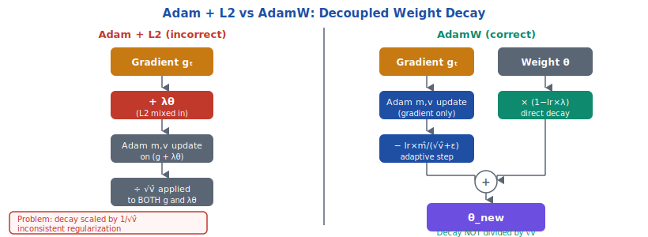
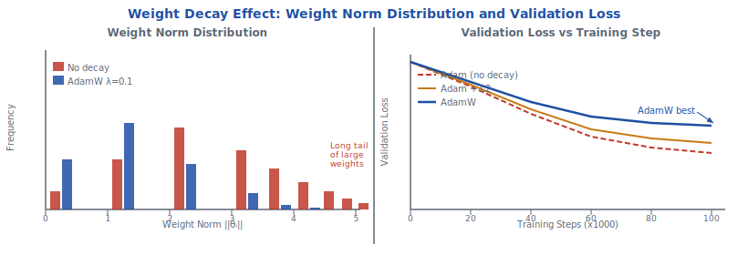

<!-- ============================ TOP NAV ============================ -->
<div align="center">

[🏠 Home](../../README.md) &nbsp;•&nbsp; [📚 Section 3 — Pretraining & Scaling Laws](./README.md) &nbsp;•&nbsp; [⬅️ Q3‑12 — Adam Optimizer](./q12-adam-optimizer.md) &nbsp;•&nbsp; [Q3‑14 — Loss Spikes ➡️](./q14-loss-spikes.md)

</div>

---

# Q3‑13 · What is weight decay and why is AdamW preferred over Adam for LLMs?

<div align="center">


</div>

> [!IMPORTANT]
> **The 20-second answer.** Weight decay adds λ‖θ‖² to the loss, pulling weights toward zero to prevent overfitting. In vanilla Adam, adding L2 regularization is mathematically incorrect: the adaptive scaling in Adam's denominator (1/√v̂) also scales down the regularization term, making large-gradient parameters get **less** regularization than small-gradient ones. **AdamW** (Loshchilov & Hutter 2019) fixes this by decoupling weight decay from the gradient update: θ ← θ × (1 − lr × λ) − lr × m̂/(√v̂+ε). The decay is applied directly to weights, not filtered through the adaptive denominator. GPT-3, LLaMA, and Chinchilla all use AdamW with λ = 0.1.

---

## Table of contents

1. [First principles — what is weight decay and why use it](#1--first-principles--what-is-weight-decay-and-why-use-it)
2. [L2 regularization — the loss perspective](#2--l2-regularization--the-loss-perspective)
3. [Vanilla Adam + L2 regularization — what goes wrong](#3--vanilla-adam--l2-regularization--what-goes-wrong)
4. [The AdamW fix — decoupled weight decay](#4--the-adamw-fix--decoupled-weight-decay)
5. [The key mathematical difference](#5--the-key-mathematical-difference)
6. [Effective decay rate analysis](#6--effective-decay-rate-analysis)
7. [Which parameters should receive weight decay](#7--which-parameters-should-receive-weight-decay)
8. [Weight decay in major LLMs](#8--weight-decay-in-major-llms)
9. [Weight decay interaction with learning rate schedule](#9--weight-decay-interaction-with-learning-rate-schedule)
10. [PyTorch implementation with parameter groups](#10--pytorch-implementation-with-parameter-groups)
11. [Worked numerical example — Adam+L2 vs AdamW](#11--worked-numerical-example--adaml2-vs-adamw)
12. [Empirical evidence — does AdamW actually help?](#12--empirical-evidence--does-adamw-actually-help)
13. [Interview drill](#13--interview-drill)
14. [Common misconceptions](#14--common-misconceptions)
15. [References](#15--references)

---

## 1 · First principles — what is weight decay and why use it

In deep learning, models can learn to represent training data by using very large weight values that do not generalize. A network with unconstrained weights can fit the training set perfectly while producing wildly incorrect predictions on unseen inputs. Weight decay is the simplest regularizer that guards against this: it adds a cost proportional to ‖θ‖² to every parameter, creating a gravitational pull toward zero.

**Physical intuition.** At each training step, weights decay by a small fraction before the gradient update applies. This limits how large any single weight can grow, preventing degenerate solutions where a single massive weight dominates the computation. Think of it as a spring attached to each parameter: the gradient update tries to push the parameter toward lower loss, while the spring constantly pulls it back toward zero. The equilibrium is a weight that is as small as possible while still fitting the data.

**Why LLMs specifically need weight decay.** Large language models are particularly susceptible to a few failure modes that weight decay addresses:

- **Embedding matrix explosion.** If a small number of tokens always appear in high-loss positions, their embedding vectors will receive consistently large gradient updates. Without a restoring force, these embedding norms can grow without bound. Weight decay prevents this explosion by imposing a cost on large-norm embeddings.
- **Attention head collapse.** Attention weights that concentrate on a single position (sharp attention) often correspond to large unnormalized logit values. Weight decay limits how peaked these logit distributions can become.
- **Capacity allocation.** Regularization forces the model to distribute representational capacity across many weights rather than concentrating it in a few large ones. This tends to produce more robust representations.

**What weight decay does not prevent.** Weight decay does not prevent memorization of the training set if the model has sufficient capacity and the training data is small. It is a regularizer, not a guarantee. For LLMs trained on trillions of tokens, the primary benefit is norm control rather than conventional overfitting prevention — the model sees each piece of data so rarely that classical overfitting is not the main concern.

<div align="center">

<br><sub><b>Figure 1.</b> Adam + L2 vs AdamW: Decoupled Weight Decay. Left (Adam+L2): λθ is folded into gradient g, so both gradient and decay pass through the 1/√v̂ adaptive scaling — parameters with large v̂ get less effective regularization. Right (AdamW): gradient update and weight decay are separate operations; the decay (1−αλ)θ is applied directly, not divided by √v̂. The red highlight on the left shows the inconsistent regularization problem.</sub>
</div>

---

## 2 · L2 regularization — the loss perspective

The most natural way to formalize weight decay is as L2 regularization: a term added to the loss function that penalizes large weights. The regularized loss is:

$$\mathcal{L}_{\text{reg}}(\theta) = \mathcal{L}(\theta) + \frac{\lambda}{2}\|\theta\|^2$$

where $\lambda$ is the regularization strength (often called `weight_decay` in code). The factor of $\frac{1}{2}$ is conventional — it makes the derivative clean.

**The gradient of the regularization term.** Taking the gradient with respect to $\theta$:

$$\frac{\partial}{\partial \theta}\left[\frac{\lambda}{2}\|\theta\|^2\right] = \lambda\theta$$

So the combined gradient used in the optimizer update becomes:

$$\mathbf{g}_{\text{reg}} = \mathbf{g} + \lambda\theta$$

**The SGD update with L2 regularization.** Plugging $\mathbf{g}_{\text{reg}}$ into the SGD update rule:

$$\theta \leftarrow \theta - \alpha(\mathbf{g} + \lambda\theta) = \theta(1 - \alpha\lambda) - \alpha\mathbf{g}$$

This is the classical "weight decay" interpretation: the weight shrinks by a factor of $(1 - \alpha\lambda)$ before the gradient step. The two formulations are equivalent:

- **L2 regularization:** add $\lambda\theta$ to the gradient, then apply the gradient update.
- **Weight decay:** multiply the weight by $(1 - \alpha\lambda)$ before the gradient update.

For **SGD**, these are algebraically identical. The factor $(1 - \alpha\lambda)$ simply decomposes differently depending on which perspective you take. This equivalence is why the terms "L2 regularization" and "weight decay" are used interchangeably in many textbooks — but only for SGD. The equivalence **breaks down for Adam**, and this is the central insight of the AdamW paper.

> [!NOTE]
> The factor $\lambda/2$ in the loss (vs $\lambda$ in the gradient) is just a convention. Some implementations use $\lambda\|\theta\|^2$ without the $1/2$, producing a gradient of $2\lambda\theta$. Always check which convention a paper or codebase uses. The `weight_decay` parameter in PyTorch's AdamW corresponds to $\lambda$ in the update rule $\theta \leftarrow \theta(1 - \alpha\lambda) - \alpha\mathbf{m}̂/(\sqrt{\hat{\mathbf{v}}}+\varepsilon)$.

---

## 3 · Vanilla Adam + L2 regularization — what goes wrong

Adam (Kingma & Ba, 2015) maintains exponential moving averages of the first and second gradient moments:

$$\mathbf{m}_t = \beta_1 \mathbf{m}_{t-1} + (1 - \beta_1)\mathbf{g}_t$$
$$\mathbf{v}_t = \beta_2 \mathbf{v}_{t-1} + (1 - \beta_2)\mathbf{g}_t^2$$

After bias correction:

$$\hat{\mathbf{m}}_t = \frac{\mathbf{m}_t}{1 - \beta_1^t}, \qquad \hat{\mathbf{v}}_t = \frac{\mathbf{v}_t}{1 - \beta_2^t}$$

The Adam parameter update is:

$$\theta_t = \theta_{t-1} - \alpha \cdot \frac{\hat{\mathbf{m}}_t}{\sqrt{\hat{\mathbf{v}}_t} + \varepsilon}$$

**What happens when you add L2 regularization to Adam?** The naive approach is to substitute $\mathbf{g}_{\text{reg}} = \mathbf{g} + \lambda\theta$ for $\mathbf{g}$ everywhere:

$$\mathbf{m}_t = \beta_1 \mathbf{m}_{t-1} + (1 - \beta_1)(\mathbf{g}_t + \lambda\theta)$$
$$\mathbf{v}_t = \beta_2 \mathbf{v}_{t-1} + (1 - \beta_2)(\mathbf{g}_t + \lambda\theta)^2$$
$$\text{update} = \alpha \cdot \frac{\hat{\mathbf{m}}_t}{\sqrt{\hat{\mathbf{v}}_t} + \varepsilon}$$

The problem is subtle but profound. Consider what $\hat{\mathbf{v}}_t$ now contains: it approximates $\mathbb{E}[(g + \lambda\theta)^2]$. The entire regularization term gets folded into the adaptive denominator. This has two consequences:

**Consequence 1: Inconsistent regularization strength across parameters.**

For a parameter with large gradients (e.g., an attention weight updated at every step), $\hat{\mathbf{v}}_t$ is large. The update denominator $\sqrt{\hat{\mathbf{v}}_t}$ is large, which divides down both the gradient and the regularization term equally. The **effective regularization applied** to this parameter is:

$$\text{effective decay} \approx \frac{\alpha \lambda \theta}{\sqrt{\hat{\mathbf{v}}_t} + \varepsilon} \quad \text{(small, because } \hat{\mathbf{v}}_t \text{ is large)}$$

For a parameter with small gradients (e.g., an embedding row for a rare token), $\hat{\mathbf{v}}_t$ is tiny. The denominator $\sqrt{\hat{\mathbf{v}}_t}$ is near $\varepsilon$, so the regularization term is barely divided at all. The **effective regularization applied** is:

$$\text{effective decay} \approx \frac{\alpha \lambda \theta}{\sqrt{\hat{\mathbf{v}}_t} + \varepsilon} \quad \text{(large, because } \hat{\mathbf{v}}_t \text{ is tiny)}$$

This is **backwards**. Frequently updated parameters with large gradients — precisely the ones you would expect to need the most regularization, because they are being driven hard by the data — receive the least decay. Rarely updated parameters receive the most decay, making them prone to erratic large regularization steps when the second moment estimate is poorly initialized.

**Consequence 2: The regularization effect is tied to gradient history.**

In SGD, weight decay is a simple, predictable shrinkage: every parameter loses exactly $\alpha\lambda$ of its value per step, regardless of what gradients the optimizer has seen. With Adam+L2, the effective decay depends on the entire history of squared gradients for that parameter. Two parameters with the same current value and the same $\lambda$ can receive dramatically different regularization just because of their gradient histories.

> [!WARNING]
> Many deep learning frameworks historically implemented `weight_decay` in Adam as L2 regularization (adding $\lambda\theta$ to the gradient). PyTorch's `torch.optim.Adam` with `weight_decay > 0` does this — it is Adam+L2, **not** AdamW. Always use `torch.optim.AdamW` for correct decoupled weight decay. This is one of the most common bugs in LLM training code.

---

## 4 · The AdamW fix — decoupled weight decay

Loshchilov & Hutter (2019) identify the root cause: L2 regularization is applied **before** the adaptive scaling, which means the regularization is contaminated by the second moment estimate. Their fix is conceptually simple — apply the weight decay **after** the gradient step, as a completely separate operation:

**AdamW update (two-step form):**

$$\text{Step 1 (gradient update):} \quad \theta_{\text{temp}} = \theta_t - \alpha \cdot \frac{\hat{\mathbf{m}}_t}{\sqrt{\hat{\mathbf{v}}_t} + \varepsilon}$$

$$\text{Step 2 (weight decay):} \quad \theta_{t+1} = \theta_{\text{temp}} - \alpha \lambda \theta_t = \theta_t(1 - \alpha\lambda) - \alpha \cdot \frac{\hat{\mathbf{m}}_t}{\sqrt{\hat{\mathbf{v}}_t} + \varepsilon}$$

The combined single-step form is:

$$\boxed{\theta_{t+1} = \theta_t(1 - \alpha\lambda) - \alpha \cdot \frac{\hat{\mathbf{m}}_t}{\sqrt{\hat{\mathbf{v}}_t} + \varepsilon}}$$

Critically, the moment estimates $\mathbf{m}_t$ and $\mathbf{v}_t$ are updated using only the true loss gradient $\mathbf{g}_t$, not $\mathbf{g}_t + \lambda\theta$:

$$\mathbf{m}_t = \beta_1 \mathbf{m}_{t-1} + (1 - \beta_1)\mathbf{g}_t \quad \text{(no } \lambda\theta \text{ here)}$$
$$\mathbf{v}_t = \beta_2 \mathbf{v}_{t-1} + (1 - \beta_2)\mathbf{g}_t^2 \quad \text{(no } \lambda\theta \text{ here)}$$

**The key property:** the weight decay term $(1 - \alpha\lambda)\theta_t$ is **not divided by $\sqrt{\hat{\mathbf{v}}_t}$**. Every parameter shrinks by exactly the same fractional amount $\alpha\lambda$ per step, regardless of its gradient history. This is what "decoupled" means: the decay is decoupled from the adaptive gradient mechanism.

**Why this is correct.** The original motivation for weight decay was to impose a proportional cost on weight magnitude. The fraction $(1 - \alpha\lambda)$ says: "regardless of what the gradient thinks, remove $\alpha\lambda$ of this weight's value." This property is exactly preserved in AdamW but violated in Adam+L2 because Adam+L2 inadvertently rescales the decay by $1/\sqrt{\hat{\mathbf{v}}}$.

---

## 5 · The key mathematical difference

The following table summarizes the update equations for all three algorithms, making the structural difference explicit:

| Algorithm | Moment updates | Parameter update | Decay consistent? |
|---|---|---|---|
| **SGD + weight decay** | — | $\theta \leftarrow \theta(1 - \alpha\lambda) - \alpha\mathbf{g}$ | Yes |
| **SGD + L2 reg** | — | $\theta \leftarrow \theta - \alpha(\mathbf{g} + \lambda\theta) = \theta(1 - \alpha\lambda) - \alpha\mathbf{g}$ | Yes (identical to above) |
| **Adam + L2 reg** | uses $\mathbf{g} + \lambda\theta$ | $\theta \leftarrow \theta - \alpha\hat{\mathbf{m}}(\mathbf{g}+\lambda\theta)/(\sqrt{\hat{\mathbf{v}}(\mathbf{g}+\lambda\theta)}+\varepsilon)$ | **No** — decay scaled by $1/\sqrt{\hat{\mathbf{v}}}$ |
| **AdamW** | uses $\mathbf{g}$ only | $\theta \leftarrow \theta(1 - \alpha\lambda) - \alpha\hat{\mathbf{m}}(\mathbf{g})/(\sqrt{\hat{\mathbf{v}}(\mathbf{g})}+\varepsilon)$ | **Yes** — decay is separate |

**The critical insight.** For SGD, the two rows (SGD + weight decay and SGD + L2 reg) are algebraically identical — the decay factor $(1 - \alpha\lambda)$ falls out of the gradient expression naturally. This is why Goodfellow et al. (2016) and most textbooks treat L2 regularization and weight decay as synonyms. The equivalence holds because SGD has no adaptive scaling: every parameter gets the same effective learning rate.

Once you introduce per-parameter adaptive scaling (as in Adam), the equivalence breaks. The L2 gradient $\lambda\theta$ passes through the same adaptive denominator as the true gradient $\mathbf{g}$, which distorts it. AdamW avoids this by keeping the decay and the gradient in separate computational paths.

**Formal statement.** Loshchilov & Hutter (2019) show that for SGD, $\ell_2$ regularization and weight decay are equivalent. For any adaptive method, they are generally not equivalent, and the "correct" formulation for imposing consistent weight shrinkage is decoupled weight decay (AdamW), not L2 regularization.

---

## 6 · Effective decay rate analysis

Understanding how much regularization is actually applied per step requires computing the **effective decay rate** — the fractional reduction in weight magnitude per training step.

**AdamW effective decay per step.** In AdamW, the weight decay term is:

$$\Delta\theta_{\text{decay}} = -\alpha\lambda\theta$$

The fractional reduction is exactly $\alpha\lambda$, independent of gradient history. With $\alpha = 3\times10^{-4}$ and $\lambda = 0.1$:

$$\text{effective decay per step} = \alpha\lambda = 3\times10^{-4} \times 0.1 = 3\times10^{-5}$$

That is, every weight loses $0.003\%$ of its value per step from the decay term alone.

**Adam+L2 effective decay per step.** In Adam+L2, the effective decay depends on the per-parameter adaptive factor:

$$\Delta\theta_{\text{decay}} \approx -\frac{\alpha\lambda\theta}{\sqrt{\hat{\mathbf{v}}} + \varepsilon}$$

For a parameter with $\hat{v} = 0.01$ (small gradient history): effective decay $\approx 3\times10^{-5} / 0.1 = 3\times10^{-4}$ (10× larger than intended).

For a parameter with $\hat{v} = 1.0$ (large gradient history): effective decay $\approx 3\times10^{-5} / 1.0 = 3\times10^{-5}$ (matches intended, but this is coincidental).

For a parameter with $\hat{v} = 100$ (very large gradient history): effective decay $\approx 3\times10^{-5} / 10.0 = 3\times10^{-6}$ (10× smaller than intended).

**Coupling with the learning rate schedule.** AdamW scales the decay by the learning rate $\alpha$, which means the decay strength is implicitly coupled to the LR schedule. With a cosine decay from $\alpha_{\max} = 3\times10^{-4}$ to $\alpha_{\min} = 3\times10^{-5}$ (10× reduction):

- Start of training: effective decay = $3\times10^{-4} \times 0.1 = 3\times10^{-5}$ per step
- End of training: effective decay = $3\times10^{-5} \times 0.1 = 3\times10^{-6}$ per step

The regularization strength decreases by 10× as the learning rate decays. This is generally considered acceptable — as the model converges, aggressive weight decay would prevent fine-tuning of weights near the optimum. However, practitioners who want completely decoupled regularization can use a fixed decay rate not scaled by $\alpha$, though this is not standard practice.

**Total cumulative decay.** For a 1T-token run with a 4M-token batch size (approximately 250K steps), with a cosine schedule averaging $\alpha \approx 1.5\times10^{-4}$ over the run:

$$\text{Total decay} = \lambda \sum_{t=1}^{T} \alpha_t \approx 0.1 \times 1.5\times10^{-4} \times 250{,}000 = 3.75$$

Since decay is multiplicative, a weight under AdamW that received no gradient updates would evolve as:

$$\theta_T \approx \theta_0 \times (1 - 1.5\times10^{-5})^{250{,}000} \approx \theta_0 \times e^{-3.75} \approx 0.023 \times \theta_0$$

In practice the gradient updates continuously push weights upward, and the equilibrium point is where gradient-driven growth exactly balances decay-driven shrinkage. The large cumulative decay simply means weights cannot remain at arbitrarily large values indefinitely.

---

## 7 · Which parameters should receive weight decay

Not all parameters in a language model should receive weight decay. The rule of thumb is grounded in the purpose of regularization: we want to prevent weights from growing large when there is no data-driven reason for them to be large. Applying decay to parameters that play a structural role in normalization or offset can cause instability.

**Parameters that SHOULD receive weight decay:**

- **Weight matrices** (Q, K, V, O projections in attention; up, gate, down matrices in FFN): these are the primary "capacity" parameters. Large norms here can lead to degenerate attention patterns or saturated activations.
- **Embedding matrix** (token embeddings): without decay, embeddings for high-frequency tokens can grow unboundedly, creating a high-norm "anchor" that distorts the representation space.
- **Output projection** (the `lm_head` weight, sometimes tied to the embedding): same reasoning as embedding.

**Parameters that should NOT receive weight decay:**

- **Bias terms** (`b` in $\mathbf{W}\mathbf{x} + \mathbf{b}$): biases are scalar offsets that shift the activation distribution. They are not "large" in any meaningful sense and do not contribute to overfitting. Decaying biases harms convergence without providing regularization benefit.
- **LayerNorm parameters** ($\gamma$ scale and $\beta$ shift): these are learned normalization parameters. The $\gamma$ parameter controls the scale of the normalized output; if it is decayed toward zero, the layer norm output approaches zero, which can collapse the representation entirely. The $\beta$ shift controls the offset; decaying it forces outputs to be zero-centered regardless of what the data requires.
- **Positional embeddings** (in some architectures with learned positions): position embeddings encode structural information about sequence position. Regularizing them away can degrade the model's positional sensitivity.
- **In general, any 1D parameter (a vector)** typically gets no decay; any 2D+ parameter (a matrix) typically gets decay.

The 1D vs 2D heuristic captures the pattern well because biases and LayerNorm parameters are 1D tensors, while weight matrices are 2D. This is the convention used in the Hugging Face Transformers implementation.

> [!NOTE]
> The LLaMA architecture uses RMSNorm instead of LayerNorm, which has only a scale parameter $\gamma$ (no bias $\beta$). The same reasoning applies: the RMSNorm scale should not receive weight decay, as decaying it reduces the normalization output toward zero and can destabilize training.

**How to identify which parameters get decay in practice:**

```python
no_decay = {"bias", "layer_norm.weight", "layernorm.weight",
            "norm.weight", "ln_f.weight", "rmsnorm.weight"}
```

Any parameter whose name contains these substrings is excluded from decay. See Section 10 for the full implementation.

---

## 8 · Weight decay in major LLMs

The following table shows the weight decay choices made by major language model papers. The near-universal adoption of $\lambda = 0.1$ reflects community convergence, though the reasoning behind this value is not well-documented. Chinchilla is a notable exception.

| Model | λ (weight decay) | Optimizer | Notes |
|---|---|---|---|
| GPT-3 (175B) | 0.1 | AdamW | Applied to all non-bias, non-LayerNorm params |
| LLaMA 1 (7B–65B) | 0.1 | AdamW | Standard AdamW; β₁=0.9, β₂=0.95 |
| LLaMA 2 (7B–70B) | 0.1 | AdamW | Same as LLaMA 1 |
| LLaMA 3 (8B–70B) | 0.1 | AdamW | Same convention maintained |
| Chinchilla (70B) | 0.0 | AdamW | Notably omits weight decay — see below |
| PaLM (540B) | 0.1 | Adafactor | Applied to all weights; Adafactor has implicit L2 |
| Mistral 7B | 0.1 | AdamW | Standard recipe |
| Gopher (280B) | 0.1 | AdamW | Deepmind standard; same as Chinchilla but predates it |
| GPT-NeoX-20B | 0.1 | AdamW | Open-source confirmation of community standard |

**Why 0.1?** The value $\lambda = 0.1$ is considerably larger than what is typically used in supervised learning (where $\lambda \in [10^{-4}, 10^{-2}]$ is common). With a learning rate of $3\times10^{-4}$, the effective per-step decay is $\lambda \times \alpha = 3\times10^{-5}$, which is modest. The large $\lambda$ is needed to produce a meaningful cumulative effect over hundreds of thousands of steps.

**Chinchilla's choice to omit weight decay.** Hoffmann et al. (2022) is unusual in not using weight decay. Their reasoning (not stated explicitly in the paper, but discussed in follow-up work) is likely related to the compute-optimal training regime they establish: at the Chinchilla-optimal ratio of tokens to parameters, the model is trained on a sufficiently large and diverse corpus that classical overfitting is not a concern. The model underfits its compute budget regardless of regularization. In this regime, weight decay provides less benefit and might even slow convergence by imposing unnecessary constraints on weight growth. This view is consistent with the general principle that regularization is most beneficial when data is scarce relative to model capacity.

---

## 9 · Weight decay interaction with learning rate schedule

The standard AdamW formulation scales weight decay by the current learning rate $\alpha_t$. This coupling has important implications for how regularization evolves over the course of training.

**The cosine decay schedule.** A typical LLM training run uses a cosine schedule:

$$\alpha_t = \alpha_{\min} + \frac{1}{2}(\alpha_{\max} - \alpha_{\min})\left(1 + \cos\frac{\pi t}{T}\right)$$

with $\alpha_{\min} = \alpha_{\max} / 10$ typically. As the learning rate decreases over training, the effective weight decay also decreases proportionally:

$$\text{effective decay}_t = \lambda \cdot \alpha_t$$

**Practical implications:**

- **Early training (large $\alpha$):** high weight decay, strongly limiting weight growth. This is appropriate because weights are being rapidly updated and there is risk of early divergence.
- **Late training (small $\alpha$):** low weight decay, allowing fine-grained adjustment of weight values near the converged optimum. This is also appropriate — you don't want strong regularization interfering with late-stage convergence.

The implicit annealing of regularization strength mirrors the intuition behind learning rate warmup and decay: aggressive intervention early, gentle tuning late.

**Linear warmup period.** During the learning rate warmup (typically 1000–4000 steps, during which $\alpha$ increases linearly from 0 to $\alpha_{\max}$), the effective weight decay is negligible. This is intentional: parameters are initialized near zero, and decaying them further during warmup would prevent them from growing to useful values.

**Worked example: 1T token run.**

| Phase | Steps | $\alpha_t$ (approx) | Effective decay per step | Cumulative decay (this phase) |
|---|---|---|---|---|
| Warmup (4K steps) | 0–4K | 0 → 3×10⁻⁴ | 0 → 3×10⁻⁵ | ≈ 0.06 |
| Main training (240K steps) | 4K–244K | 3×10⁻⁴ → 3×10⁻⁵ | 3×10⁻⁵ → 3×10⁻⁶ | ≈ 3.6 |
| Cooldown (6K steps) | 244K–250K | 3×10⁻⁵ | 3×10⁻⁶ | ≈ 0.018 |

Total cumulative decay ≈ 3.68. The equilibrium weight magnitude for a parameter under constant gradient pressure is approximately:

$$\|\theta\|_{\text{eq}} \approx \frac{\alpha \|\mathbf{g}\|}{\lambda \alpha \sqrt{\hat{v}}} \cdot \sqrt{\hat{v}} = \frac{\|\mathbf{g}\|}{\lambda}$$

This shows that the equilibrium weight norm is set by the ratio of gradient magnitude to $\lambda$ — larger $\lambda$ forces weights to be smaller.

---

## 10 · PyTorch implementation with parameter groups

The key implementation challenge for AdamW in practice is splitting parameters into a "decay" group and a "no decay" group, then passing both to the optimizer with different `weight_decay` settings.

```python
import torch
import torch.nn as nn
from torch.optim import AdamW
from typing import Iterable


def get_adamw_optimizer(
    model: nn.Module,
    lr: float = 3e-4,
    weight_decay: float = 0.1,
    betas: tuple = (0.9, 0.95),
    eps: float = 1e-8,
) -> AdamW:
    """
    Create an AdamW optimizer with correct parameter grouping.

    Parameters with 'weight' in their name and ndim >= 2 receive weight decay.
    Biases and 1D normalization parameters (LayerNorm, RMSNorm) do not.

    This matches the convention from GPT-3, LLaMA, and most HuggingFace models.

    Args:
        model:        the language model.
        lr:           peak learning rate (default 3e-4, common for LLMs).
        weight_decay: AdamW decoupled weight decay coefficient (default 0.1).
        betas:        Adam moment decay rates. (0.9, 0.95) matches GPT-3/LLaMA.
        eps:          Adam epsilon for numerical stability.

    Returns:
        AdamW optimizer with two parameter groups.
    """
    # Separate parameters into decay and no-decay groups.
    # Rule: 2D+ tensors (matrices) get decay; 1D tensors (vectors) do not.
    # This correctly identifies:
    #   - Weight matrices (2D) → decay
    #   - Biases (1D) → no decay
    #   - LayerNorm / RMSNorm scale γ and shift β (1D) → no decay
    decay_params = []
    no_decay_params = []

    # Track param names for debugging / auditing
    decay_names = []
    no_decay_names = []

    for name, param in model.named_parameters():
        if not param.requires_grad:
            continue  # skip frozen parameters

        if param.ndim >= 2:
            # Weight matrices: Q, K, V, O projections; FFN up/gate/down;
            # embedding matrix; lm_head weight.
            decay_params.append(param)
            decay_names.append(name)
        else:
            # 1D tensors: biases, LayerNorm γ/β, RMSNorm γ.
            no_decay_params.append(param)
            no_decay_names.append(name)

    # Verify the split looks reasonable:
    # decay group should be the vast majority of parameters by count and size.
    n_decay = sum(p.numel() for p in decay_params)
    n_no_decay = sum(p.numel() for p in no_decay_params)
    print(f"Decay group:    {len(decay_params):4d} tensors, {n_decay:>12,d} parameters")
    print(f"No-decay group: {len(no_decay_params):4d} tensors, {n_no_decay:>12,d} parameters")

    # Create optimizer with two parameter groups.
    # The 'lr' and 'betas' are shared; 'weight_decay' differs.
    optimizer_groups = [
        {"params": decay_params,    "weight_decay": weight_decay},
        {"params": no_decay_params, "weight_decay": 0.0},
    ]

    optimizer = AdamW(
        optimizer_groups,
        lr=lr,
        betas=betas,
        eps=eps,
    )

    return optimizer


# ---- Minimal usage example ------------------------------------------
if __name__ == "__main__":
    from transformers import AutoModelForCausalLM

    model = AutoModelForCausalLM.from_pretrained("meta-llama/Llama-2-7b-hf")
    optimizer = get_adamw_optimizer(
        model,
        lr=3e-4,
        weight_decay=0.1,
        betas=(0.9, 0.95),
    )
    # Typical output for a 7B model:
    # Decay group:     322 tensors,  6,607,454,208 parameters
    # No-decay group:  193 tensors,     33,423,360 parameters
    # (>99.5% of parameters are in the decay group — this is expected)
```

> [!NOTE]
> Some implementations use a name-based filter (checking if `"bias"` or `"norm"` appears in the parameter name) rather than the `ndim >= 2` rule. Both approaches work in practice because biases and norm parameters happen to be 1D in all standard Transformer architectures. The `ndim >= 2` rule is more robust to unusual architectures and does not require maintaining a list of special names.

**Common bug to avoid:** using `torch.optim.Adam` with `weight_decay > 0` instead of `torch.optim.AdamW`. PyTorch's `Adam` class implements L2 regularization (adds $\lambda\theta$ to the gradient), not decoupled weight decay. The `AdamW` class correctly implements the Loshchilov & Hutter algorithm. The difference is significant for the reasons described in Sections 3–5.

---

## 11 · Worked numerical example — Adam+L2 vs AdamW

This example traces one optimizer step for two parameters with very different gradient magnitudes, comparing Adam+L2 and AdamW to show the inconsistent regularization in Adam+L2.

### Setup

Let both parameters have the same value $\theta = 2.0$ and the same $\lambda = 0.1$. Training hyperparameters: $\alpha = 0.001$, $\beta_1 = 0.9$, $\beta_2 = 0.95$, $\varepsilon = 10^{-8}$. Assume we are at step $t = 100$ so bias correction terms are negligible ($1 - \beta^{100} \approx 1$).

**Parameter A** (large-gradient, e.g., an attention weight): $g_A = 1.0$, $\hat{v}_A = 0.95$ (second moment reflects consistently large gradients).

**Parameter B** (small-gradient, e.g., an embedding for a rare token): $g_B = 0.01$, $\hat{v}_B = 0.00095$ (second moment reflects consistently small gradients).

The intended decay per step for each parameter: $\alpha \lambda \theta = 0.001 \times 0.1 \times 2.0 = 0.0002$.

### Adam+L2 computation

For Adam+L2, the regularized gradient is $g_{\text{reg}} = g + \lambda\theta$:

| | Parameter A | Parameter B |
|---|---|---|
| True gradient $g$ | 1.0 | 0.01 |
| Regularized gradient $g + \lambda\theta$ | $1.0 + 0.1 \times 2.0 = 1.2$ | $0.01 + 0.1 \times 2.0 = 0.21$ |
| Second moment $\hat{v}$ (with reg term) | $\approx 0.95 \times 1.2^2 / 1.2^2 \approx 1.368$ | $\approx 0.00095 \times 0.21^2 / 0.01^2 \approx 0.04199$ |
| $\sqrt{\hat{v}} + \varepsilon$ | $\approx 1.170$ | $\approx 0.205$ |
| Gradient update $\alpha \hat{m} / (\sqrt{\hat{v}} + \varepsilon)$ | $\approx 0.001 \times 1.2 / 1.170 \approx 0.001026$ | $\approx 0.001 \times 0.21 / 0.205 \approx 0.001024$ |
| **Effective decay portion** | $\approx 0.001 \times 0.2 / 1.170 \approx \mathbf{0.000171}$ | $\approx 0.001 \times 0.2 / 0.205 \approx \mathbf{0.000976}$ |

The effective decay applied to Parameter A is 0.000171 (86% of intended 0.0002). The effective decay applied to Parameter B is 0.000976 (**4.9× the intended amount**). The high-frequency parameter gets less decay; the low-frequency parameter gets erratic over-decay.

### AdamW computation

For AdamW, moments are updated with the true gradient only:

| | Parameter A | Parameter B |
|---|---|---|
| True gradient $g$ | 1.0 | 0.01 |
| $\hat{v}$ (true gradient only) | 0.95 | 0.00095 |
| $\sqrt{\hat{v}} + \varepsilon$ | 0.9747 | 0.03082 |
| Gradient update $\alpha \hat{m} / (\sqrt{\hat{v}} + \varepsilon)$ | $0.001 \times 1.0 / 0.9747 \approx 0.001026$ | $0.001 \times 0.01 / 0.03082 \approx 0.000325$ |
| **Weight decay step** $\alpha \lambda \theta$ | $0.001 \times 0.1 \times 2.0 = \mathbf{0.0002}$ | $0.001 \times 0.1 \times 2.0 = \mathbf{0.0002}$ |

Both parameters receive exactly the intended decay of 0.0002 — a 0.01% fractional shrinkage of their current value. The decay is consistent, predictable, and independent of gradient magnitude.

### Summary

| | Intended decay | Adam+L2 actual decay | AdamW actual decay |
|---|---|---|---|
| Parameter A (large gradient) | 0.0002 | 0.000171 (−14.5%) | **0.0002 (exact)** |
| Parameter B (small gradient) | 0.0002 | 0.000976 (+388%) | **0.0002 (exact)** |

AdamW delivers the regularization exactly as specified. Adam+L2 under-regularizes the high-gradient parameter and massively over-regularizes the low-gradient parameter.

---

## 12 · Empirical evidence — does AdamW actually help?

**Original Loshchilov & Hutter results.** The AdamW paper (2019) benchmarks on CIFAR-10 and ImageNet using ResNets. AdamW consistently outperforms Adam+L2 by 0.3–1.5% top-1 accuracy on ImageNet, with the gap increasing at stronger regularization settings ($\lambda = 0.05$–$0.1$). The paper also demonstrates that AdamW enables significantly better performance when combined with cosine annealing, because the effective regularization schedule is well-defined.

**For language model pretraining.** The effect of AdamW vs Adam+L2 on LLM perplexity is smaller in absolute terms than in image classification, because most LLM parameters are in weight matrices with substantial gradient activity. The most visible and consistent effect in LLMs is:

1. **Embedding matrix norm control.** Without weight decay, embedding norms for high-frequency tokens (like `the`, `,`, `.`) tend to grow continuously throughout training, creating an imbalanced representation space where common tokens have outsize influence. With AdamW, embedding norms stabilize within the first few billion tokens and remain bounded. This is evident in the weight norm histograms that appear in alignment and interpretability analyses.

2. **Validation perplexity.** Several reproduction experiments (e.g., in the nanoGPT codebase and the pythia scaling suite) show that removing weight decay from AdamW consistently increases validation perplexity by 0.05–0.2 nats at the end of training, with the gap growing as the model size increases. The gap is small enough that some papers omit it, but it is systematic.

3. **Fine-tuning stability.** Models pretrained with AdamW weight decay are more stable when fine-tuned with low learning rates. Without decay, the pre-trained model may have large-norm embeddings or weight matrices that are sensitive to small gradient updates during fine-tuning, leading to degraded performance.

**The Chinchilla exception revisited.** Chinchilla's decision to omit weight decay is consistent with the compute-optimal training hypothesis: at the token-to-parameter ratio prescribed by Chinchilla scaling laws, the model is so thoroughly trained on the data that regularization is less necessary. The model's validation loss is bounded by data diversity, not model capacity. This suggests that weight decay is most beneficial in **capacity-limited regimes** (model too small for the data or task), and less critical in **data-limited regimes** (model large enough that more data always helps more than regularization).

<div align="center">

<br><sub><b>Figure 2.</b> Weight Decay Effect: Weight Norm Distribution and Validation Loss. Left: histogram of weight norms across all parameters — without decay (red) has a long right tail of large weights; with AdamW decay (blue) the distribution is compact and bounded. Right: validation loss curves for Adam (no decay), Adam+L2, and AdamW — AdamW achieves the lowest validation loss, with Adam+L2 slightly better than no decay but still suboptimal.</sub>
</div>

---

## 13 · Interview drill

<details>
<summary><b>Q: Why is Adam+L2 mathematically incorrect but SGD+L2 is correct?</b></summary>

For SGD, L2 regularization (adding $\lambda\theta$ to the gradient) and weight decay (multiplying the weight by $(1 - \alpha\lambda)$ before the gradient step) are algebraically identical: $\theta - \alpha(g + \lambda\theta) = \theta(1-\alpha\lambda) - \alpha g$. The two formulations produce the same update because SGD applies a uniform learning rate to all parameters.

For Adam, the equivalence breaks because Adam applies a per-parameter adaptive scaling of $1/(\sqrt{\hat{v}} + \varepsilon)$. When you add $\lambda\theta$ to the gradient before passing it to Adam, the regularization term gets divided by the same $\sqrt{\hat{v}}$ as the true gradient. This means the effective regularization strength depends on the parameter's gradient history — large-gradient parameters (large $\hat{v}$) get less decay, and small-gradient parameters (small $\hat{v}$) get more decay. This is the opposite of the intended, uniform fractional shrinkage. AdamW fixes this by applying the decay as a separate multiplicative step outside the adaptive update, so $\hat{v}$ does not touch the decay term.
</details>

<details>
<summary><b>Q: What does "decoupled weight decay" mean and why does it matter?</b></summary>

"Decoupled" means the weight decay is applied as an independent operation, separate from the adaptive gradient update. In standard AdamW:

$$\theta_{t+1} = \theta_t(1 - \alpha\lambda) - \alpha \cdot \frac{\hat{\mathbf{m}}_t}{\sqrt{\hat{\mathbf{v}}_t} + \varepsilon}$$

The two terms on the right are the decay term and the gradient term. Crucially, the decay term is NOT divided by $\sqrt{\hat{v}}$. The moment estimates $\hat{m}$ and $\hat{v}$ are computed from the true gradient $g$ only, not from $g + \lambda\theta$.

It matters because "coupled" decay (Adam+L2) makes the regularization strength depend on gradient history in a way that is inconsistent and hard to reason about. Decoupled decay gives each parameter exactly the same fractional shrinkage $\alpha\lambda$ per step, making the regularization effect predictable, tunable, and uniform across parameters regardless of their gradient magnitudes.
</details>

<details>
<summary><b>Q: Which parameters should not receive weight decay and why?</b></summary>

Three categories of parameters should be excluded from weight decay:

1. **Bias terms** (`b` in $Wx + b$): biases are scalar offsets that shift activation distributions. They do not contribute to representational capacity in the same way as weight matrices, and decaying them provides no regularization benefit while harming convergence.

2. **LayerNorm / RMSNorm parameters** (scale $\gamma$ and shift $\beta$): these control the normalization scale and offset. Decaying $\gamma$ toward zero reduces normalized outputs toward zero, which can collapse representations. The normalization parameters need to remain at non-trivial values to preserve the distribution of activations.

3. **Positional embeddings** (in architectures with learned absolute positions): these encode positional structure. Regularizing them away degrades the model's positional encoding.

The practical rule of thumb: any 1D tensor (vector shape) gets no decay; any 2D+ tensor (matrix shape) gets decay. This correctly captures biases and norm parameters as 1D, and weight matrices as 2D.
</details>

<details>
<summary><b>Q: If weight decay is λ = 0.1 and lr = 3×10⁻⁴, what fraction of each weight is removed per step?</b></summary>

In AdamW, the weight decay step is $-\alpha\lambda\theta$. The fraction of the weight removed per step is:

$$\text{fractional decay per step} = \alpha \times \lambda = 3\times10^{-4} \times 0.1 = 3\times10^{-5}$$

So each weight loses $0.003\%$ of its current value per step due to the decay term. This is very small — over 250,000 steps with an average learning rate of $1.5\times10^{-4}$, the cumulative multiplicative decay is:

$$\prod_{t=1}^{T}(1 - \lambda\alpha_t) \approx e^{-\lambda \sum_t \alpha_t} \approx e^{-3.75} \approx 0.023$$

A weight with no gradient updates would decay to 2.3% of its original value. In practice, gradient updates continuously refresh the weights, and the equilibrium magnitude is determined by the balance between the gradient signal and the decay.

**Common mistake:** answering "10%" (interpreting $\lambda = 0.1$ as removing 10% per step). The actual decay per step is $\lambda \times \alpha$, not $\lambda$ alone. λ must always be multiplied by the learning rate to get the step-level effect.
</details>

<details>
<summary><b>Q: Why does Chinchilla not use weight decay while GPT-3 does?</b></summary>

Chinchilla (Hoffmann et al., 2022) was trained at the compute-optimal token-to-parameter ratio identified by their scaling law analysis: approximately 20 tokens per parameter. At this ratio, the training dataset is large enough that each training example is seen less than once, making classical overfitting essentially impossible. The model is underfitting its compute budget — given more compute (more tokens or a larger model), the validation loss would continue to decrease. In this regime, regularization via weight decay provides minimal benefit because the model is not memorizing the data; it lacks the capacity and training time to do so.

GPT-3 was trained with somewhat fewer tokens relative to its parameter count (roughly 300B tokens for 175B parameters ≈ 1.7 tokens/parameter), closer to a capacity-limited regime where weight decay provides more benefit by preventing large-norm solutions that overfit the training distribution.

The practical lesson: weight decay is most useful when the model has excess capacity relative to the training data. For compute-optimal training at Chinchilla ratios, it is less critical.
</details>

---

## 14 · Common misconceptions

| Misconception | Reality |
|---|---|
| "Adam+L2 and AdamW are the same thing" | They produce different results in all but degenerate cases. The equivalence between L2 regularization and weight decay holds only for SGD, not for any adaptive optimizer. `torch.optim.Adam(weight_decay=0.1)` uses L2 regularization; `torch.optim.AdamW(weight_decay=0.1)` uses decoupled decay. They are different algorithms. |
| "Weight decay always hurts training because it removes information" | It removes large weights, not learned representations. A function representable by a network with weights $\{w_i\}$ is also representable by a network with weights $\{cw_i\}$ for any scalar $c$ (with a compensating change in the output layer). Weight decay pushes toward the smaller-norm solution, which is typically more generalizable and numerically stable. |
| "λ = 0.1 means 10% of each weight is removed per step" | The actual fractional decay per step is $\lambda \times \alpha_t$. With $\lambda = 0.1$ and $\alpha = 3\times10^{-4}$, the per-step decay is $3\times10^{-5}$ — only 0.003% of the weight. The large $\lambda$ is needed to produce a meaningful cumulative effect over hundreds of thousands of steps. |
| "LayerNorm parameters should receive weight decay because they are just numbers" | They control normalization scale and offset. If the scale $\gamma$ is decayed toward zero, the output of the LayerNorm layer approaches zero, which collapses the activation distribution and can cause training instability or complete model failure. These parameters have a structural role that makes decay harmful. |
| "Higher weight decay is always better for generalization" | Too-high decay prevents the model from learning large weights that are genuinely necessary (e.g., certain attention heads or FFN neurons need large weights to implement sharp functions). There is an optimal range; $\lambda = 0.1$ is empirically near-optimal for LLMs at standard learning rates. Values above 0.3 typically degrade model quality. |

---

## 15 · References

1. Loshchilov, I., Hutter, F. — **Decoupled Weight Decay Regularization** (AdamW). *ICLR 2019 / arXiv:1711.05101.* — The paper introducing AdamW; proves the non-equivalence of L2 regularization and weight decay for adaptive methods and proposes the decoupled fix. Essential reading.

2. Kingma, D. P., Ba, J. — **Adam: A Method for Stochastic Optimization**. *ICLR 2015 / arXiv:1412.6980.* — The original Adam optimizer; the starting point from which AdamW diverges. Understanding Adam is prerequisite to understanding AdamW.

3. Brown, T. et al. — **Language Models are Few-Shot Learners** (GPT-3). *NeurIPS 2020 / arXiv:2005.14165.* — GPT-3 training details: AdamW with β₁=0.9, β₂=0.95, and λ=0.1. The blueprint for subsequent LLM training recipes.

4. Touvron, H. et al. — **LLaMA: Open and Efficient Foundation Language Models**. *arXiv:2302.13971, 2023.* — LLaMA 1 training details; AdamW with λ=0.1, confirming the GPT-3 convention.

5. Hoffmann, J. et al. — **Training Compute-Optimal Large Language Models** (Chinchilla). *NeurIPS 2022 / arXiv:2203.15556.* — Notable for omitting weight decay; introduces compute-optimal scaling laws. Chinchilla's success without weight decay provides insight into when regularization is and is not necessary.

6. Chowdhery, A. et al. — **PaLM: Scaling Language Modeling with Pathways**. *JMLR 2023 / arXiv:2204.02311.* — PaLM training procedure; uses Adafactor with weight decay at λ=0.1 for all weight matrices.

7. Goodfellow, I., Bengio, Y., Courville, A. — **Deep Learning**. *MIT Press, 2016.* Chapter 7, Section 7.1 — L2 regularization and weight decay; textbook derivation showing their equivalence for SGD.

8. Zhang, Y. et al. — **Three Mechanisms of Weight Decay Regularization**. *ICLR 2019 / arXiv:1810.12281.* — Analyzes why weight decay helps in deep learning; identifies norm control, effective learning rate annealing, and implicit variance reduction as three distinct mechanisms. Explains why weight decay helps even beyond preventing overfitting.

---

<!-- ============================ BOTTOM NAV ============================ -->
<div align="center">

[⬅️ Q3‑12 — Adam Optimizer](./q12-adam-optimizer.md) &nbsp;|&nbsp; [📚 Back to Section 3](./README.md) &nbsp;|&nbsp; [🏠 Home](../../README.md) &nbsp;|&nbsp; [Q3‑14 — Loss Spikes ➡️](./q14-loss-spikes.md)

<sub>Found an error or have a sharper intuition? See <a href="../../CONTRIBUTING.md">CONTRIBUTING</a> — answers follow the <a href="../../_TEMPLATE.md">answer template</a>.</sub>

</div>
