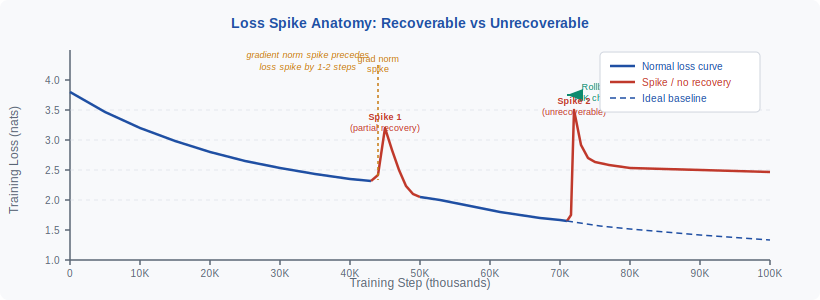
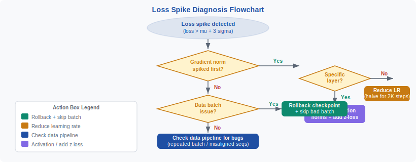

<!-- ============================ TOP NAV ============================ -->
<div align="center">

[🏠 Home](../../README.md) &nbsp;•&nbsp; [📚 Section 3 — Pretraining & Scaling Laws](./README.md) &nbsp;•&nbsp; [⬅️ Q3‑13 — AdamW & Weight Decay](./q13-adamw-weight-decay.md) &nbsp;•&nbsp; [Q3‑15 — Data Quality Filtering ➡️](./q15-data-quality-filtering.md)

</div>

---

# Q3‑14 · What are loss spikes during pretraining? How are they diagnosed and mitigated?

<div align="center">


</div>

> [!IMPORTANT]
> **The 20-second answer.** A loss spike is a sudden, sharp increase in training loss — typically **>0.5 nats** above the smooth curve — that does not immediately self-correct. Unlike normal step-to-step fluctuation, spikes indicate that the optimizer has been pushed far outside the loss basin the model has been converging toward. The standard cause is either a **bad data batch** (corrupted document, unusual token distribution) or a **gradient explosion** that gradient clipping failed to fully contain. The standard recovery is **checkpoint rollback**: detect the spike automatically (loss > μ + 3σ over a rolling window), roll back to the last clean checkpoint, identify and skip the bad batch, and resume. Prevention relies on aggressive data filtering, gradient clipping at 1.0, frequent checkpointing, and optionally **z-loss** (a logZ penalty that stabilises the softmax output distribution).

---

## Table of contents

1. [What is a loss spike?](#1--what-is-a-loss-spike)
2. [Normal fluctuation vs true spikes](#2--normal-fluctuation-vs-true-spikes)
3. [Root cause 1 — bad data batch](#3--root-cause-1--bad-data-batch)
4. [Root cause 2 — learning rate misconfiguration](#4--root-cause-2--learning-rate-misconfiguration)
5. [Root cause 3 — gradient explosion](#5--root-cause-3--gradient-explosion)
6. [Root cause 4 — numerical precision](#6--root-cause-4--numerical-precision)
7. [Root cause 5 — data pipeline bugs](#7--root-cause-5--data-pipeline-bugs)
8. [Diagnosis signals and tooling](#8--diagnosis-signals-and-tooling)
9. [The recovery procedure](#9--the-recovery-procedure)
10. [Prevention techniques](#10--prevention-techniques)
11. [Z-loss: the PaLM stabilisation trick](#11--z-loss-the-palm-stabilisation-trick)
12. [Cost of a rollback](#12--cost-of-a-rollback)
13. [Interview drill](#13--interview-drill)
14. [Common misconceptions](#14--common-misconceptions)
15. [References](#15--references)

---

## 1 · What is a loss spike?

During LLM pretraining, the training loss follows a broadly smooth decreasing curve — noisy at the scale of individual steps, but trending down over thousands of steps. A **loss spike** is a departure from this pattern: an abrupt upward jump in loss that is large enough (typically **>0.5 nats**, though definitions vary) to represent a qualitative change in model state rather than routine batch-to-batch noise.

The defining characteristic is that the jump is **not immediately self-correcting**. In a healthy training run, if the loss for one batch is somewhat higher than expected, the next gradient step typically brings it back. A spike, by contrast, persists across multiple steps — the loss either stays elevated (unrecoverable), or recovers slowly and incompletely over hundreds of steps (partial recovery). This distinction has operational consequences: a partially-recoverable spike may be tolerable, but an unrecoverable spike requires intervention.

<div align="center">

<br><sub><b>Figure 1.</b> Loss spike anatomy. Spike 1 (step ~45K) partially recovers — the loss returns toward baseline but not to the ideal curve. Spike 2 (step ~72K) is unrecoverable without rollback. The gradient norm spikes 1–2 steps before the loss spike, making it an early-warning signal. Dashed line shows the ideal loss trajectory the run would have followed without spike 2.</sub>
</div>

---

## 2 · Normal fluctuation vs true spikes

Understanding loss spikes requires first understanding what normal training noise looks like.

**Normal fluctuation** arises from the fact that mini-batches are sampled randomly and differ in difficulty. A batch containing longer sequences, denser content, or topics the model has seen less often will naturally produce a higher loss. Over a run of hundreds of billions of tokens, the loss at any given step is drawn from a distribution with a mean (the smooth trend) and a standard deviation (batch variance). Typical step-to-step variation is on the order of 0.05–0.15 nats.

**A loss spike**, by contrast, exhibits:

| Feature | Normal fluctuation | Loss spike |
|---|---|---|
| Magnitude | 0.05–0.15 nats above trend | >0.5 nats above trend (often 1–2 nats) |
| Duration | 1 step; next step is back to trend | Multiple steps; recovery is slow or absent |
| Gradient norm | Moderately elevated | Often 3–10× normal, frequently precedes the loss jump |
| Recovers without intervention | Yes | Only for mild cases |
| Indicates structural problem | No | Yes |

A useful operational threshold from industry practice (Chowdhery et al. 2022, PaLM) is: flag any step where `loss > rolling_mean + 3 * rolling_std` over a window of the last 100 steps. This catches genuine spikes while ignoring the top few percent of routine fluctuation.

---

## 3 · Root cause 1 — bad data batch

The most common cause of loss spikes in practice is a **problematic data batch**: a mini-batch that contains one or more documents that are qualitatively different from the training distribution in a way that produces an anomalously large loss gradient.

Sub-cases include:

**Corrupted documents.** A web-scraped page where the HTML extraction has failed, producing garbage token sequences (e.g., base64-encoded binary content, HTML tag soup, or null bytes). The model assigns very low probability to such sequences, producing a large cross-entropy loss for those tokens.

**Very unusual token distributions.** A document consisting largely of rare Unicode characters, special symbols, or a niche script that the tokenizer assigns to low-probability token IDs. The embedding gradients for those rare tokens can be very large because they receive infrequent updates and may have poorly initialized embedding vectors.

**Near-duplicate dense clusters.** If deduplication has failed and a large block of nearly identical documents appears in a single batch, the model effectively receives the same gradient signal repeated dozens of times. This can produce an unusually large effective gradient that pushes parameters away from the general data distribution.

**Mislabelled or adversarial content.** Training data that contains "junk" in the sequence-continuation sense — e.g., a document that begins coherently and then transitions to random characters — can create an inconsistent loss signal.

In all these cases the diagnosis fingerprint is the same: the loss spike is preceded by a large gradient norm, and tracing the gradient back to specific parameter tensors (embedding layer, specific attention heads) points to particular token IDs or sequence positions.

---

## 4 · Root cause 2 — learning rate misconfiguration

The second major cause is a **learning rate that is too high** at some point during training. This most often manifests at:

**The end of the warmup phase.** Standard LLM training uses a linear warmup from 0 to the peak learning rate over the first 1000–4000 steps. If the warmup is too short or the peak LR is too high, the transition from warmup to the main schedule can trigger a loss spike. At the warmup peak, the optimizer is taking its largest steps; if the loss landscape is still relatively curved (as it is early in training), those steps can overshoot a local minimum.

**Schedule transitions.** A cosine decay schedule that reaches its minimum and then either holds flat or restarts (warm restarts, SGDR-style) can produce transient spikes at the transition point. The model has converged toward a local minimum under the current LR; a sudden change in effective step size can perturb it.

**Fine-tuning on a new domain after pretraining.** If a pretrained model is continued on a new domain with an LR that was appropriate for stable pretraining, that same LR may be too large for a model that has converged and is being asked to adapt — the parameters are in a narrow local minimum where large steps cause large jumps in loss.

The diagnosis fingerprint for LR-caused spikes: the gradient norm is elevated but not dramatically so; the spike is correlated with a specific point in the schedule; and reducing the LR typically prevents recurrence.

---

## 5 · Root cause 3 — gradient explosion

Even with gradient clipping enabled at `clip=1.0`, gradient explosions can still cause loss spikes in subtle ways.

**How:** gradient clipping caps the global L2 norm of the gradient at 1.0 per step. However, if the raw gradient norm is extremely large (e.g., 50.0) and clipping rescales it to 1.0, the **direction** of the gradient is preserved — it still points in the "wrong" direction determined by the bad batch. A gradient of norm 1.0 pointing in a very unusual direction can still push parameters out of the converged region if that direction is orthogonal to the loss-reducing direction.

**The Adam interaction:** as discussed in Q3-07, Adam's second moment estimate `v_t` adapts slowly. A gradient that is capped to norm 1.0 but has an unusual component structure may still corrupt Adam's per-parameter adaptive learning rate estimates for several hundred steps, even after the bad batch has passed.

**Persistent high-norm periods:** if the gradient norm is persistently at or above the clip threshold for many consecutive steps (not just one spike), the effective per-step displacement in parameter space is capped but non-zero, and the cumulative displacement can be substantial. This is distinct from a single-step explosion.

The diagnosis fingerprint: the pre-clip gradient norm (which should always be logged) is extremely high (>10×) at the onset of the spike; tracing which layer's gradient is largest often points to the embedding or the final linear layer.

---

## 6 · Root cause 4 — numerical precision

LLM training in BF16 or FP16 can produce precision-related spikes through two mechanisms:

**Intermediate activation overflow.** BF16 has a dynamic range of approximately ±3.4 × 10³⁸ (same exponent range as FP32 but fewer mantissa bits). FP16 has a much smaller range (±65504), making overflow more likely. If an intermediate activation in the forward pass overflows to `inf` or `NaN`, the loss becomes undefined, and the resulting gradient update is garbage.

**Softmax instability.** The attention softmax `softmax(QK^T / sqrt(d))` can produce near-zero denominators when all logits are very large and similar. In FP16 this can lead to 0/0 = NaN. The standard fix is to use **fused softmax kernels** (e.g., Flash Attention) that compute softmax in a numerically stable way in higher precision, and to use BF16 (which has more exponent bits than FP16 despite fewer mantissa bits).

**Loss scaling artifacts.** When using a GradScaler for mixed precision, the loss scale factor (often initialized at 65536) can become too large if the model goes through a phase of small gradients. When the scale is suddenly too large for the actual gradient magnitude, the resulting gradient is `inf` or `NaN`, which manifests as a spike. PyTorch's GradScaler handles this by detecting `inf` and automatically reducing the scale — but this means a step is skipped and the optimizer does not update, which can appear as an anomalous loss value.

---

## 7 · Root cause 5 — data pipeline bugs

**Repeated batches.** A bug in the data loader that causes the same batch (or a very similar one) to be repeated many consecutive times effectively trains on a single example for many steps. This causes the model to overfit to that batch, producing a high loss when it next sees the normal distribution.

**Misaligned sequence boundaries.** In LLM pretraining, documents are concatenated and split into fixed-length sequences (typically 2048 or 4096 tokens). A bug that misaligns the sequence boundaries — e.g., splitting in the middle of a multi-byte UTF-8 character, or failing to insert an EOS token between documents — can create sequences where the context for predicting later tokens is invalid. The model receives contradictory gradient signal for the boundary region.

**Shard-level corruption.** If a data shard is corrupted at the filesystem level, an entire epoch of processing from that shard will produce anomalous batches. This pattern often appears as a cluster of spikes rather than a single event.

---

## 8 · Diagnosis signals and tooling

When a loss spike is detected, a structured diagnosis procedure reduces debugging time from hours to minutes. The key signals are:

**Gradient norm time series.** The pre-clip gradient norm (logged every step) typically spikes **1–2 steps before** the loss spike. This is because the bad gradient has already been applied to the parameters — by the time the loss is computed on the next batch, the parameters have moved. A gradient norm spike without a subsequent loss spike is a near-miss: clipping contained it.

**Per-layer gradient norms.** Break down the global gradient norm by layer. Which layer's gradient is anomalously large? If it is the embedding layer, the cause is almost certainly token-level: a rare token or a bad document. If it is a mid-network attention layer, it may indicate attention sink formation or a numerical precision issue.

**Attention entropy.** Healthy attention distributions are spread across multiple tokens. If the attention entropy in some head **collapses** (one token gets near-100% attention weight), the gradients from that head become concentrated, which can cause instability. This is one of the phenomena that z-loss is designed to prevent.

**Data provenance.** Modern LLM training infrastructure (e.g., Megatron-LM, NeMo) can be configured to log which data shard and which document within a shard was used for each batch. When a spike is detected, tracing back to the specific document often reveals obviously corrupted content.

<div align="center">

<br><sub><b>Figure 2.</b> Loss spike diagnosis flowchart. The first question is always whether the gradient norm spiked before the loss — this distinguishes gradient-driven spikes (follow the left branch) from data-pipeline or LR issues (follow the right branch). Each branch terminates in a concrete action with a color indicating urgency: green = rollback immediately, amber = reduce LR and monitor, navy = investigate pipeline, purple = inspect activations and add z-loss.</sub>
</div>

---

## 9 · The recovery procedure

The industry-standard recovery procedure, as used in PaLM (Chowdhery et al. 2022) and described in multiple large-scale training papers, proceeds as follows:

**Step 1: Automated detection.** During training, compute a rolling mean and standard deviation of the loss over the last N steps (typically N = 100). Flag a spike whenever:

```
loss_t > rolling_mean + 3 * rolling_std
```

This threshold is calibrated to catch genuine spikes (which are typically 1–2 nats above the mean) while ignoring the top 0.3% of routine fluctuation. The detection runs automatically; human intervention is triggered by an alert.

**Step 2: Identify the onset step.** The rollback target is the last checkpoint **before** the gradient norm first elevated. Because gradient norms spike 1–2 steps before the loss, the actual contamination typically begins at the step where `grad_norm > N * baseline_norm` (with N typically 3–5). Count backward from the loss spike to identify this step.

**Step 3: Roll back to the last clean checkpoint.** Checkpoints are typically saved every 1000 steps (or more frequently near known instabilities). Roll back to the checkpoint immediately preceding the onset step. Restore both model weights and optimizer state (Adam's first and second moment estimates must also be restored to the pre-spike state, because they too were corrupted by the bad gradient).

**Step 4: Identify and skip the problematic batch.** Use the data provenance logs to identify which batch caused the spike. The RNG seed for each step is deterministic given the initial seed and step number, so the exact batch can be reproduced. Filter or skip that shard or document.

**Step 5: Resume training from the clean checkpoint.** With the bad batch excluded and the model restored to a clean state, training continues from the checkpoint. Consider temporarily reducing the learning rate by 50% for 500–1000 steps as a precautionary measure.

**Step 6: Investigate the root cause.** Was the batch bad data? If so, add a filter to the data pipeline to prevent similar documents from appearing again. Was it a learning rate issue? Adjust the schedule. A rollback that recurs at the same step without explanation is a serious concern requiring deeper investigation.

---

## 10 · Prevention techniques

The best rollback is the one you never need. Prevention requires multiple layers of defence:

**Aggressive data filtering.** Applying perplexity filtering, heuristic filters (Gopher rules), and deduplication before training significantly reduces the probability that a corrupted or anomalous document reaches the model. See Q3-15 for the full filtering pipeline.

**Gradient clipping at 1.0.** Universal in large LLM training. It does not eliminate spikes but reduces their severity and makes partial recovery much more likely for moderate-sized spikes.

**Smaller learning rate after warmup.** Configuring the peak learning rate conservatively (GPT-3: 6e-5 for 175B, LLaMA: 3e-4 for 7B) limits the magnitude of parameter updates and reduces the probability that a bad gradient moves the model far from the current basin.

**More frequent checkpointing near instability.** Standard checkpointing every 1000 steps is appropriate for stable training. When monitoring signals (elevated gradient norm, elevated loss variance) indicate a risk period, switch to checkpointing every 100–200 steps. This limits the maximum rollback cost.

**Z-loss.** See Section 11.

**Monitoring infrastructure.** Spike prevention requires real-time monitoring of gradient norm, loss, per-layer activation norms, and attention entropy. Without this, a spike may go undetected for hundreds of steps, increasing the rollback cost.

---

## 11 · Z-loss: the PaLM stabilisation trick

Z-loss is a regularization term introduced in PaLM (Chowdhery et al. 2022) specifically to prevent attention instability that can lead to loss spikes.

**Motivation.** In a Transformer's softmax attention, the output is `softmax(z)` where `z = QK^T / sqrt(d)`. The softmax is translation-invariant: `softmax(z + c) = softmax(z)` for any constant `c`. This means the model can increase all logits `z` by a large constant without changing the attention output — but at the cost of pushing the logits far from zero, which causes numerical issues and can produce attention sinks (one token receiving nearly all attention weight).

**The z-loss term.** The penalty added to the main cross-entropy loss is:

$$\mathcal{L}_{z} = w_z \cdot \mathbb{E}\!\left[\left(\log Z\right)^2\right]$$

where $Z = \sum_i e^{z_i}$ is the partition function (the denominator of the softmax), and $w_z$ is a small weight (PaLM uses $w_z = 10^{-4}$). This penalty encourages $\log Z \approx 0$, which means the logits are centered near zero and no single token dominates the softmax.

**Effect:** z-loss does not change the optimal attention distribution (the model still learns the same attention patterns), but it regularizes the scale of the logits, preventing them from growing large and causing numerical instability. PaLM reports that z-loss significantly reduced the frequency of loss spikes in their training run.

---

## 12 · Cost of a rollback

A loss spike is not just a nuisance — it has a concrete compute cost. For a large training run:

**Direct rollback cost.** Rolling back N steps means re-computing those N steps from the checkpoint. For a typical checkpoint interval of 1000 steps at 1 second per step (on a 1000-GPU cluster running ~2 TFLOPS/GPU-second aggregate), 1000 steps represents approximately **17 GPU-hours** of wasted computation, or at $2/GPU-hour approximately **$33,000** of wasted spend for a 1000-GPU cluster.

**More precisely:** 1000 steps × 1 second/step = 1000 seconds = ~0.28 GPU-hours per GPU × 1000 GPUs = **278 GPU-hours** ≈ **$556** at $2/GPU-hour. For a 2048-GPU run, this scales to ~$1,140 per rollback.

**Indirect costs.** A loss spike that is not caught quickly (e.g., if monitoring is insufficient) can run for thousands of steps before detection, requiring a much larger rollback. A spike that corrupts the optimizer state significantly may also cause slightly worse final model quality even after recovery — the model has "forgotten" some of the optimization trajectory.

**Real-world context.** PaLM (Chowdhery et al. 2022) explicitly reports having experienced multiple loss spikes during training of the 540B model and recovering via rollback. The paper describes this as a normal part of large-scale training, not an exceptional failure. The engineering overhead of building robust checkpointing and monitoring infrastructure is fully justified by the cost of a single undetected spike.

---

## 13 · Interview drill

<details>
<summary><b>Q: What distinguishes a loss spike from normal training noise?</b></summary>

Normal training noise is step-to-step variation caused by batch sampling — typically 0.05–0.15 nats. It is self-correcting: the next batch brings the loss back down. A loss spike is larger (>0.5 nats), persistent (does not self-correct immediately), and correlated with an anomalous gradient norm. The operational test is loss > μ + 3σ over a rolling window; this catches real spikes while ignoring the top 0.3% of normal fluctuation.
</details>

<details>
<summary><b>Q: Why does the gradient norm spike before the loss spike?</b></summary>

The gradient is computed and applied to update parameters in step t. By the time step t+1 computes its loss, the parameters are already in the perturbed state caused by the bad gradient. So the gradient is anomalous first, then the parameters are moved, then the next loss evaluation on the now-perturbed model shows the spike. There is a 1–2 step lag between gradient norm anomaly and loss anomaly. This is why logging the pre-clip gradient norm is so valuable — it gives a 1–2 step warning.
</details>

<details>
<summary><b>Q: Can you always recover from a loss spike by rolling back?</b></summary>

Yes, provided you have a clean checkpoint before the spike and can identify and exclude the bad batch. The model is deterministic given the same checkpoint and training data, so resuming from a pre-spike checkpoint with the bad batch excluded exactly recreates the training trajectory as if the spike never happened. The only complication is if the monitoring is insufficient and the spike runs for many steps before detection, requiring a longer rollback — but this is an engineering problem, not a fundamental limitation.
</details>

<details>
<summary><b>Q: What is z-loss and when is it needed?</b></summary>

Z-loss adds a penalty proportional to (log Z)^2 to the training loss, where Z is the softmax partition function. It discourages the softmax logits from growing large in absolute magnitude, which prevents attention sinks and numerical instability. It was introduced in PaLM and is useful in any large-scale training where attention entropy collapse or logit scale instability is a concern. The weight is small (1e-4 in PaLM), so it has negligible effect on the primary optimization objective but significantly reduces spike frequency.
</details>

<details>
<summary><b>Q: Why must optimizer state be rolled back along with model weights?</b></summary>

Adam's first and second moment estimates (m and v) encode the history of gradients up to the current step. If the spike corrupted the gradients at step t, then m_t and v_t are also corrupted: m_t incorporates the bad gradient direction and v_t has an inflated estimate of the variance for some parameters. If you restore model weights to the checkpoint but keep the corrupted optimizer state, the next gradient steps will use incorrect adaptive learning rates. The effective learning rate for some parameters may be far too small (because v_t was inflated by the spike), creating a "ghost" of the spike that slows convergence even after rollback.
</details>

<details>
<summary><b>Q: A training run shows persistent gradient norm at or above the clip threshold (1.0) for thousands of steps but no individual spike. Is this a problem?</b></summary>

Yes. Persistent clipping means the optimizer is being constrained in its updates every step, suggesting the learning rate is too high or the model is in an unstable region of the loss landscape. While no individual step causes a catastrophic spike, the cumulative drift from repeatedly taking maximum-magnitude steps in varying directions is unpredictable. The correct response is to reduce the learning rate. Logging the fraction of steps where clipping fires (clip_fraction) is a useful metric: healthy training has clip_fraction below 5%; persistent clipping above 20% of steps warrants investigation.
</details>

---

## 14 · Common misconceptions

| Misconception | Reality |
|---|---|
| "Gradient clipping prevents loss spikes." | Clipping reduces their severity and frequency but does not prevent them entirely. Even a clipped gradient can cause a spike if its direction is anomalous. |
| "A spike that recovers on its own is fine to ignore." | Partial recovery still leaves the model slightly off the optimal trajectory. More importantly, a "recoverable" spike in one run may be unrecoverable under slightly different conditions. Always log and investigate. |
| "Rolling back just the model weights is sufficient." | Optimizer state (Adam moments m and v) must also be rolled back. Corrupted optimizer state can cause slow convergence for hundreds of steps after rollback. |
| "Loss spikes only happen early in training." | They can happen at any point. PaLM reports spikes occurring mid-run. The risk is elevated near schedule transitions (end of warmup, cosine decay bottom) and when new data sources are encountered. |
| "More gradient clipping (lower clip value) always makes training more stable." | Too-tight clipping (e.g., 0.1) constrains all gradients, slowing learning. The correct approach is 1.0 with frequent checkpointing and monitoring, not aggressive clipping. |
| "BF16 is safe from precision-related spikes." | BF16 is safer than FP16 (more exponent bits, larger dynamic range) but not immune. Very large intermediate activations can still overflow or underflow, particularly in unnormalized attention logits. |

---

## 15 · References

1. Chowdhery, A. et al. — **PaLM: Scaling Language Modeling with Pathways**. *JMLR 2023 / arXiv:2204.02311.* — Primary source for z-loss; explicitly describes multiple loss spikes during 540B training and the checkpoint rollback procedure used to recover.

2. Hoffmann, J. et al. — **Training Compute-Optimal Large Language Models** (Chinchilla). *NeurIPS 2022 / arXiv:2203.15556.* — Describes training stability measures including gradient clipping at 1.0 and monitoring for loss spikes.

3. Rae, J. et al. — **Scaling Language Models: Methods, Analysis & Insights from Training Gopher**. *arXiv:2112.11446, 2021.* — Gopher (280B) training details; discusses stability monitoring and data quality as a cause of training instability.

4. Brown, T. et al. — **Language Models are Few-Shot Learners** (GPT-3). *NeurIPS 2020 / arXiv:2005.14165.* — GPT-3 training procedure including gradient clipping and loss monitoring.

5. Touvron, H. et al. — **LLaMA: Open and Efficient Foundation Language Models**. *arXiv:2302.13971, 2023.* — Reports stable training without major spikes; attributes this to aggressive data filtering and gradient clipping at 1.0.

6. Touvron, H. et al. — **Llama 2: Open Foundation and Fine-Tuned Chat Models**. *arXiv:2307.09288, 2023.* — Confirms LLaMA 2 training stability procedures; same clipping and monitoring regime.

7. Pascanu, R., Mikolov, T., Bengio, Y. — **On the difficulty of training recurrent neural networks**. *ICML 2013 / arXiv:1211.5063.* — Foundational paper on gradient explosion; norm clipping first proposed here.

8. Shoeybi, M. et al. — **Megatron-LM: Training Multi-Billion Parameter Language Models Using Model Parallelism**. *arXiv:1909.08053, 2019.* — Describes the engineering infrastructure (checkpointing, monitoring) used in large-scale training with Megatron-LM.

9. Kingma, D. P., Ba, J. — **Adam: A Method for Stochastic Optimization**. *ICLR 2015 / arXiv:1412.6980.* — Adam's slow second-moment adaptation is key to understanding why gradient spikes can persist in optimizer state across many steps.

10. Wenzek, G. et al. — **CCNet: Extracting High Quality Monolingual Datasets from Web Crawl Data**. *LREC 2020 / arXiv:1911.00359.* — Perplexity-based data filtering; documents the quality correlation between low perplexity and low spike probability.

11. Zeng, A. et al. — **GLM-130B: An Open Bilingual Pre-Trained Model**. *ICLR 2023 / arXiv:2210.02414.* — Reports loss spike events in 130B training; describes monitoring and recovery strategy including embedding gradient norms as an early-warning signal.

---

<!-- ============================ BOTTOM NAV ============================ -->
<div align="center">

[⬅️ Q3‑13 — AdamW & Weight Decay](./q13-adamw-weight-decay.md) &nbsp;|&nbsp; [📚 Back to Section 3](./README.md) &nbsp;|&nbsp; [🏠 Home](../../README.md) &nbsp;|&nbsp; [Q3‑15 — Data Quality Filtering ➡️](./q15-data-quality-filtering.md)

<sub>Found an error or have a sharper intuition? See <a href="../../CONTRIBUTING.md">CONTRIBUTING</a> — answers follow the <a href="../../_TEMPLATE.md">answer template</a>.</sub>

</div>
