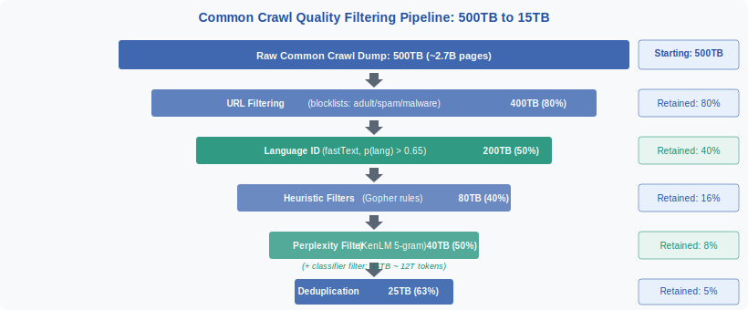
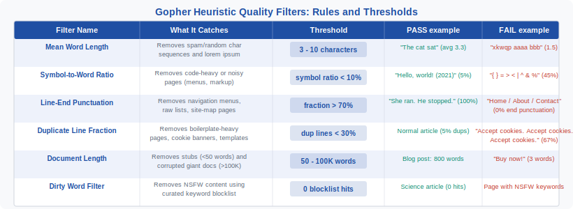

<!-- ============================ TOP NAV ============================ -->

[🏠 Home](../../README.md) &nbsp;•&nbsp; [📚 Section 3 — Pretraining & Scaling Laws](./README.md) &nbsp;•&nbsp; [⬅️ Q3‑14 — Loss Spikes](./q14-loss-spikes.md) &nbsp;•&nbsp; [Q3‑16 — Compute vs Inference Optimal ➡️](./q16-compute-vs-inference-optimal.md)

---

# Q3‑15 · How does the data quality filtering pipeline work? What heuristics are used in Common Crawl processing?

> [!IMPORTANT]
> **The 20-second answer.** Common Crawl is a petabyte-scale web dump (~500TB of raw text) that cannot be used for LLM pretraining as-is — it contains spam, boilerplate, NSFW content, non-English text, and corrupted pages. A multi-stage filtering pipeline reduces this to a **5–15TB high-quality subset (~5–15T tokens)**. The pipeline proceeds: URL blocklist filtering → language identification (fastText, p > 0.65) → heuristic quality rules (Gopher filters: word length, symbol ratio, punctuation fraction, duplicate line fraction, document length, dirty words) → perplexity filtering (KenLM 5-gram trained on Wikipedia, keep bottom 30% by perplexity) → deduplication → classifier-based filtering (fastText or small LM trained on curated high-quality documents). The result — used in FineWeb, Dolma, and similar datasets — removes ~97% of the raw crawl while retaining the highest-quality text.

---

## Table of contents

1. [Common Crawl: scale and raw content](#1--common-crawl-scale-and-raw-content)
2. [Stage 1 — URL filtering](#2--stage-1--url-filtering)
3. [Stage 2 — Language identification](#3--stage-2--language-identification)
4. [Stage 3 — Heuristic quality filters](#4--stage-3--heuristic-quality-filters)
5. [The Gopher heuristics in detail](#5--the-gopher-heuristics-in-detail)
6. [Stage 4 — Perplexity filtering](#6--stage-4--perplexity-filtering)
7. [Stage 5 — Deduplication](#7--stage-5--deduplication)
8. [Stage 6 — Classifier-based filtering](#8--stage-6--classifier-based-filtering)
9. [Pipeline implementations: C4, FineWeb, Dolma](#9--pipeline-implementations-c4-fineweb-dolma)
10. [Trade-offs: filtering aggressiveness vs diversity](#10--trade-offs-filtering-aggressiveness-vs-diversity)
11. [The Pile: domain curation as an alternative](#11--the-pile-domain-curation-as-an-alternative)
12. [Interview drill](#12--interview-drill)
13. [Common misconceptions](#13--common-misconceptions)
14. [One-screen summary](#14--one-screen-summary)
15. [References](#15--references)

---

## 1 · Common Crawl: scale and raw content

[Common Crawl](https://commoncrawl.org/) is a non-profit organization that has been crawling the web since 2008. It releases monthly snapshots of the web, each containing billions of pages in compressed WARC (Web ARChive) format. The cumulative collection as of 2024 comprises approximately **2.7 billion pages** per recent dump, with the full multi-year archive orders of magnitude larger.

**Scale of the raw text:**
- A single monthly dump: ~20TB compressed WARC; ~80TB uncompressed HTML
- After HTML extraction (boilerplate removal, tag stripping) using tools like `trafilatura`, `resiliparse`, or `jusText`: approximately **500TB of raw text** per dump
- After all quality filtering: approximately **5–15TB**, or **5–15 trillion tokens** for the highest-quality subset
- In practice, LLM pretraining corpora draw from multiple dumps to aggregate enough high-quality text

**Why raw Common Crawl cannot be used as-is:**
- Estimated 40–60% is non-English (for English-focused models)
- A substantial fraction consists of boilerplate (navigation menus, cookie banners, footer links, advertising text)
- Significant amounts of spam, SEO-optimized garbage, and machine-generated text
- NSFW and illegal content
- Corrupted pages from failed extraction
- Near-duplicates: the same blog post appearing on dozens of syndicated sites

 <b>Figure 1.</b> Common Crawl quality filtering pipeline. Starting from ~500TB of extracted text, each filtering stage reduces the corpus by 20–60%. The final high-quality corpus is approximately 3% of the raw input by volume, but represents the most informative text for LLM training. Retention rates are approximate and vary across pipelines and dump dates.

---

## 2 · Stage 1 — URL filtering

The first filtering stage operates at the URL level, before any document content is processed. This is the cheapest filter to apply (O(1) per URL lookup) and removes a large fraction of known-bad content.

**Domain blocklists.** Curated lists of known spam, malware, adult content, and low-quality domains. The C4 pipeline (Raffel et al. 2020) uses the UT1 blocklist. FineWeb (HuggingFace 2024) uses a custom blocklist derived from multiple public sources. These lists typically contain millions of domains.

**URL pattern filtering.** Regex-based rules that exclude common garbage patterns:
- URLs ending in `.pdf`, `.png`, `.jpg` etc. (not text documents)
- URLs containing `/feed/`, `/rss/`, `/sitemap.xml` (infrastructure pages)
- IP address URLs (often spam or scrapers)
- Very long URLs (often tracking URLs or URL-encoded binary content)

**Adult content filtering at the URL level.** Even before examining document content, URLs containing specific keywords in the path or domain name (e.g., explicit terms) are excluded. This is a fast pre-filter; the dirty word filter in Stage 3 provides a more thorough content-level check.

**Retention rate:** URL filtering typically retains ~70–85% of documents (many documents in Common Crawl come from legitimate domains; the tail of known-bad domains is large in count but small in total page volume).

---

## 3 · Stage 2 — Language identification

For English-language models, the vast majority of non-English documents must be excluded. For multilingual models, this stage instead partitions documents by language.

**fastText language identification.** The standard tool is the fastText language identification model (Joulin et al. 2016, 2017), which predicts a probability distribution over 176 languages. For each document, the model outputs a confidence score `p(lang)` for the predicted language.

**Threshold selection.** The standard threshold for English is `p(en) > 0.65`. This is deliberately permissive — a threshold of 0.65 retains some borderline documents (e.g., English text with technical terms in other scripts, code-switching) while excluding clearly non-English pages. Higher thresholds (e.g., 0.9) improve purity but risk excluding valid English documents from non-native speakers or documents with mixed content.

**Language ID limitations:**
- Short documents are unreliable (less context for the classifier)
- Domain-specific text (legal, medical, code-heavy) may be misclassified
- Text with many proper nouns from other languages may be flagged as non-English
- Character-level UTF-8 issues can confuse byte-based classifiers

**Retention rate:** approximately 40–60% of documents pass language ID when targeting English only (depending on the crawl; recent crawls tend to have more English content as the web has grown to include more English-language sites).

---

## 4 · Stage 3 — Heuristic quality filters

Heuristic quality filters are hand-crafted rules based on document statistics. They are fast to compute (one pass over the document) and effective at removing the most egregious low-quality content. The most widely cited set is the **Gopher quality filters** (Rae et al. 2021), though C4 and FineWeb have their own variants.

The heuristics operate on document-level statistics computed from the extracted text:

 <b>Figure 2.</b> Gopher heuristic quality filters. Each row shows one filter, what class of low-quality content it targets, its numerical threshold, and concrete examples of documents that pass vs fail. Together these six rules reject roughly 40–60% of documents that survived URL filtering and language ID.

**Why these six statistics are informative:**

- **Mean word length** captures the overall "word-likeness" of the document. Normal English text has an average word length of 4–6 characters. Documents with very short average word length (e.g., 1–2 characters) are likely character-scrambled, emoji-heavy, or non-alphabetic spam. Documents with very long average word length (e.g., >10 characters) are often chemical/pharmaceutical databases, computer-generated text, or documents where spaces have been stripped.

- **Symbol-to-word ratio** separates prose from non-prose. A normal article has symbols (punctuation, currency signs, mathematical operators) comprising less than 5–10% of tokens. Pages that are primarily tables, code, or markup have much higher symbol density.

- **Line-ending punctuation fraction** exploits the observation that well-written prose has most lines ending in sentence-terminating punctuation (period, question mark, exclamation mark, sometimes colon or semicolon). Navigation menus, site maps, product listings, and ingredient lists do not.

- **Duplicate line fraction** targets boilerplate-heavy pages. Legitimate articles may have some repeated boilerplate (bylines, headers), but a page where 50% of lines are identical is almost certainly a template-driven site with minimal original content.

- **Document length** sets absolute bounds. Documents shorter than 50 words are stubs with insufficient text to be useful training examples. Documents longer than 100,000 words are either large books (which would need different handling) or more likely corrupted pages where extraction merged many documents.

- **Dirty word filter** removes NSFW content using a curated keyword blocklist. This is a simple but effective first pass; more sophisticated NSFW classifiers may be applied at later stages.

---

## 5 · The Gopher heuristics in detail

**Gopher (Rae et al. 2021)** introduced a systematic set of quality filters for the 280B parameter model. The full set includes additional rules beyond the six above:

**Fraction of duplicate 2-grams and 3-grams.** Beyond duplicate lines, Gopher checks whether 2-word and 3-word phrases are repeated unusually often within a document. This catches SEO text (which repeats target keywords), generated spam, and formulaic templates that vary only nouns.

**Maximum bullet point fraction.** If more than a threshold fraction (e.g., 90%) of "paragraphs" are single-line bullet points, the document is likely a navigation page, a product feature list, or a listicle with no prose content.

**Presence of specific strings.** Gopher explicitly filters documents containing:
- `"lorem ipsum"` — placeholder text
- `"javascript must be enabled"` — pages rendered by JavaScript that extracted as error messages
- `"cookie"` (in combination with other signals) — cookie consent banners dominating the page

**Additional C4-specific filters (Raffel et al. 2020):**

The C4 dataset (used to train T5) applies a notably aggressive set of additional rules:
- Require at least **5 sentences** per document (removes stubs more aggressively than word count)
- Require that each line ends with a terminal punctuation mark
- Remove pages containing curly braces `{ }` — an effective proxy for HTML, JavaScript, or CSS code that was not properly extracted
- Remove pages that contain the string `"lorem ipsum"`
- Remove lines that contain the string `"javascript"` (typically JS warning messages in scraped pages)

The curly brace filter is particularly notable: it is a simple string operation that effectively removes the vast majority of code pages from a prose-focused corpus.

---

## 6 · Stage 4 — Perplexity filtering

**Perplexity filtering** uses a language model to score document quality. The intuition is that a language model trained on high-quality text (e.g., Wikipedia) will assign lower perplexity (higher probability) to text that resembles that high-quality training data, and higher perplexity to noisy, incoherent, or linguistically unusual text.

**The CCNet approach (Wenzek et al. 2020).** The standard implementation uses a **KenLM 5-gram language model** trained on a filtered Wikipedia dump. KenLM is a simple n-gram model that can be trained in minutes and runs extremely fast at inference time — crucial given that a single Common Crawl dump contains hundreds of millions of documents.

**Procedure:**
1. Train a KenLM 5-gram model on a clean Wikipedia dump for the target language
2. For each document in the filtered corpus, compute its perplexity under the KenLM model
3. Sort documents by perplexity; divide into percentile buckets (CCNet uses terciles: low/medium/high perplexity)
4. Keep the **bottom 30% by perplexity** (i.e., the documents most similar to Wikipedia prose)

**Why 5-gram rather than a neural LM?** Perplexity filtering at Common Crawl scale requires scoring hundreds of millions of documents. A 5-gram KenLM model scores a document in microseconds; even a small neural LM (e.g., 100M parameters) would be orders of magnitude slower. The n-gram model is sufficient to separate clearly bad documents (incoherent, non-fluent, over-noisy) from good ones.

**Controversy: over-indexing on Wikipedia style.** The main criticism of perplexity filtering is that it biases the corpus toward text that resembles Wikipedia — formal, encyclopedic, well-edited prose. This may systematically exclude:
- Informal speech and colloquial writing
- Domain-specific technical text (medical, legal, code documentation)
- Non-standard dialects
- Creative writing with unusual style

FineWeb (HuggingFace 2024) replaces perplexity filtering with a classifier-based approach that avoids this Wikipedia-centric bias while achieving comparable or better quality.

---

## 7 · Stage 5 — Deduplication

After heuristic and perplexity filtering, the corpus still contains a large number of near-duplicate documents: the same article appearing on 50 syndicated news sites, a Wikipedia stub copied to hundreds of educational portals, a viral social media post quoted in thousands of blogs.

Deduplication is covered in detail in Q3-09. For the pipeline context, the key points are:

**Exact deduplication** (URL-level, MD5 hash of document) removes trivially identical copies. This is cheap but misses paraphrased duplicates.

**Fuzzy deduplication** (MinHash + LSH, as used in The Pile, FineWeb, and Dolma) groups documents by approximate content similarity and keeps one representative per cluster. This removes near-duplicates that differ only in minor formatting or paraphrase.

**Substring deduplication** (suffix array method, as used in Lee et al. 2022) finds and removes long repeated passages that appear in multiple documents. This is the most thorough but also most compute-intensive method.

**Why deduplication matters for model quality:** beyond simply removing redundant data, deduplication reduces **memorization** (the model is less likely to memorize exact text when that text appears only once in training) and reduces **overfitting to overrepresented domains** (Wikipedia content is heavily duplicated across the web; without deduplication it can dominate training).

---

## 8 · Stage 6 — Classifier-based filtering

The final stage uses a **trained text classifier** to separate high-quality from low-quality documents. Unlike heuristic filters, a classifier can learn from examples and capture quality signals that are difficult to express as simple rules.

**Training data.** The classifier is trained on:
- **Positive examples (high quality):** Wikipedia articles, books (Project Gutenberg, Books3), academic papers (arXiv, PubMed Central), high-quality journalism (news sites with known-good content)
- **Negative examples (low quality):** a sample of Common Crawl documents that have already passed the heuristic filters but are judged to be low quality

**Classifier architecture.** Two common choices:
- **fastText classifier:** trained on bag-of-words n-gram features; very fast (scores millions of documents per minute); used in FineWeb's initial quality classifier
- **Small LM classifier:** a lightweight transformer or LSTM trained to predict quality; slower but can capture more nuanced patterns; used in Dolma (AI2) and some internal pipelines

**Threshold selection.** The classifier outputs a probability score `p(high_quality)`. Documents above a threshold (e.g., 0.5) are kept. The threshold is tuned empirically: too high a threshold produces a small but very clean corpus; too low a threshold retains more diversity but more noise.

**FineWeb classifier.** HuggingFace's FineWeb (2024) trains an educational quality classifier: "does this text look like something that would appear in an educational textbook?" This framing was found to correlate better with downstream benchmark performance than generic quality classifiers, and avoids the Wikipedia-style bias of perplexity filtering.

---

## 9 · Pipeline implementations: C4, FineWeb, Dolma

Three publicly documented implementations illustrate how these stages are combined in practice:

**C4 (Raffel et al. 2020 — used for T5 and Flan-T5).**
Pipeline: URL filter → language ID (English only) → heuristic filters (terminal punctuation, min 5 sentences, no lorem ipsum, no curly braces) → deduplication (exact sentence-level dedup). No perplexity filter; no classifier. The aggressive sentence-level deduplication makes C4 notably clean but somewhat formulaic. C4 produces approximately **156B tokens** from one Common Crawl dump.

**FineWeb (HuggingFace 2024 — 15T tokens from 95 dumps).**
Pipeline: URL filter (custom blocklist) → language ID (fastText, en > 0.65) → Gopher heuristics + C4 extensions → custom quality classifier (educational content framing) → MinHash deduplication. No perplexity filtering. FineWeb is the largest publicly released high-quality web corpus as of 2024 and achieves state-of-the-art downstream benchmark scores among comparable corpora.

**Dolma (AI2 2024 — used for OLMo).**
Pipeline: URL filter → language ID → Gopher heuristics → classifier-based filtering (trained on multiple quality signal types) → document-level MinHash dedup. Dolma includes multiple domains (web, books, papers, code, social) with separate pipelines and domain weighting rather than a single monolithic filter. This multi-domain approach is closer in spirit to The Pile than to FineWeb.

| Corpus | Pipeline style | Size | Key differentiator |
|---|---|---|---|
| C4 | Heuristic + sentence dedup | 156B tokens | Aggressive sentence dedup; curly brace filter removes code |
| FineWeb | Heuristic + classifier | 15T tokens | Educational quality classifier; 95 CC dumps |
| Dolma | Multi-domain + classifier | 3T tokens | Multi-source; domain weighting |
| The Pile | Curated multi-source | 825GB | No CC heuristic filter; relies on domain curation |

---

## 10 · Trade-offs: filtering aggressiveness vs diversity

**The fundamental tension.** Aggressive filtering produces a cleaner, more consistent corpus that reduces training instability and improves performance on standard benchmarks. However, it also systematically excludes:

- **Linguistic diversity:** dialects, informal speech, code-switching, non-standard grammar
- **Domain diversity:** highly technical domains (legal, medical, engineering) often have unusual token distributions that heuristic filters penalize
- **Style diversity:** creative writing, poetry, transcribed speech do not have standard prose structure
- **Demographic diversity:** text from non-native speakers, text produced by communities with different writing conventions

The result can be a model that performs excellently on academic benchmarks but poorly on diverse real-world user populations. This is a documented concern in model bias research (Bender et al. 2021, Blodgett et al. 2020).

**Empirical evidence.** Longpre et al. (2023) and Xie et al. (2023) both find that aggressive perplexity filtering (using Wikipedia-trained KenLM) reduces performance on diverse evaluation sets covering informal and domain-specific language, even while improving average benchmark scores. FineWeb's educational classifier mitigates this somewhat by targeting "informative" rather than "Wikipedia-like" content.

**The Dolma and The Pile approach.** Rather than aggressive filtering of a single source, these corpora use **domain weighting**: include multiple high-quality sources (books, papers, code, curated web) at controlled sampling rates, with lighter filtering per domain. This preserves diversity while ensuring overall corpus quality.

---

## 11 · The Pile: domain curation as an alternative

**The Pile (Gao et al. 2020)** takes a fundamentally different approach to data quality: rather than filtering a noisy source (Common Crawl), it curates 22 distinct high-quality domains and combines them with careful sampling weights.

**The 22 domains include:** Pile-CC (a lightly filtered Common Crawl subset), PubMed Central, Books3, OpenWebText2, ArXiv, GitHub, FreeLaw, Stack Exchange, USPTO Patents, OpenSubtitles, Wikipedia (English), DM Mathematics, Ubuntu IRC, EuroParl, HackerNews, YoutubeSubtitles, PhilPapers, NIH ExPorter, Enron Emails, and others.

**The Pile's philosophy:** rather than trying to identify and exclude bad content from the web, select sources that are inherently high-quality (scientific papers, books, code). Common Crawl is included but at a lower weight than its raw size would suggest.

**Trade-off vs CC-based pipelines:** The Pile is more diverse and richer in domain-specific content. However, at 825GB (~800B tokens), it is smaller than FineWeb (15T tokens). For Chinchilla-optimal training of large models (which require many trillions of tokens), CC-based pipelines are necessary to achieve sufficient scale.

---

## 12 · Interview drill

<b>Q: What is the perplexity filter and what are its limitations?</b>

The perplexity filter trains a KenLM 5-gram language model on a clean Wikipedia dump and scores each document by its perplexity under this model. Low-perplexity documents (similar to Wikipedia prose) are kept; high-perplexity documents are discarded. The main limitation is Wikipedia-style bias: the filter systematically excludes text that is coherent and informative but stylistically different from Wikipedia — including informal writing, domain-specific technical text, and non-standard dialects. FineWeb addresses this by replacing perplexity filtering with a classifier trained to recognize "educational" content rather than "Wikipedia-like" content.

<b>Q: Why does C4 filter documents containing curly braces?</b>

C4 was designed as a clean natural language text corpus for T5, a model that was not intended to process code. Curly braces `{ }` are extremely rare in well-formed prose but ubiquitous in JavaScript, CSS, JSON, C/C++, and HTML. A simple string check for `{` or `}` effectively removes the vast majority of pages where the HTML/JS extraction failed and left raw markup, as well as pages that are primarily code. This is a brittle heuristic (it would exclude some legitimate prose about curly braces) but extremely fast and effective for the intended purpose.

<b>Q: What is the FineWeb educational quality classifier and why does it work better than perplexity filtering?</b>

FineWeb trains a binary classifier (fastText) to predict whether a document looks like it could appear in an educational textbook. The training positives are Wikipedia, math textbooks, and educational websites; the training negatives are low-quality CC documents. Unlike perplexity filtering with a Wikipedia KenLM, this classifier explicitly targets "informativeness and clarity" rather than "stylistic similarity to Wikipedia". Empirically, FineWeb finds that this framing produces corpora where models trained on them score better on downstream benchmarks (particularly MMLU, HellaSwag) than corpora filtered with perplexity filtering at equivalent sizes.

<b>Q: Why must deduplication happen after heuristic filtering, not before?</b>

Heuristic filtering removes a large fraction of documents (often 80%+). If deduplication were done on the raw corpus first, the deduplication algorithm (MinHash, suffix arrays) would process the full 500TB, which is far more expensive than processing the post-filter 80TB. Additionally, many near-duplicates in the raw corpus are junk (syndicated spam, scraped navigation menus) that would be removed by heuristics anyway. Deduplicating after heuristic filtering means the deduplication algorithm operates on a corpus that is both smaller and higher quality, where the near-duplicates that remain are more likely to be genuine paraphrases of real content.

<b>Q: What is the Gopher line-ending punctuation filter and what does it catch?</b>

The filter checks what fraction of lines in a document end with terminal punctuation (period, question mark, exclamation mark). In well-formed prose, most sentences span one line, so this fraction is high (>70%). Pages that are primarily navigation menus, product listings, ingredient lists, or database dumps consist of single-word or short-phrase lines that do not end in sentence punctuation. This filter is remarkably effective at removing these structured non-prose pages while retaining genuine articles, blog posts, and other prose content.

<b>Q: How does symbol-to-word ratio filtering differ from dirty word filtering?</b>

Symbol-to-word ratio is a structural filter: it measures the proportion of non-alphabetic, non-numeric characters (punctuation, operators, brackets, etc.) across the entire document. A high ratio indicates the document is not primarily prose — it may be code, a financial table, or noisy extracted HTML. Dirty word filtering is a content filter: it checks for specific keywords on a curated NSFW blocklist, regardless of document structure. A page can fail symbol ratio filtering while containing entirely appropriate content (e.g., a financial database), and can fail dirty word filtering while having a perfectly normal symbol ratio (e.g., a human sexuality textbook). The two filters catch entirely different classes of documents.

---

## 13 · Common misconceptions

| Misconception | Reality |
|---|---|
| "More filtering is always better for model quality." | Aggressive filtering reduces noise but also reduces diversity. Models trained on over-filtered corpora tend to be worse on informal language, dialects, and specialized domains, even if they score well on academic benchmarks. |
| "Deduplication only removes identical documents." | Exact deduplication (hash-based) does remove only identical documents. But fuzzy deduplication (MinHash/LSH) removes near-duplicates, and substring deduplication (suffix array) removes repeated passages regardless of document context. Modern pipelines use fuzzy or substring dedup. |
| "The perplexity filter uses a large neural LM." | No — it uses KenLM, a fast statistical 5-gram language model. A neural LM would be orders of magnitude too slow to score hundreds of millions of Common Crawl documents. |
| "C4 and FineWeb use the same pipeline." | No. C4 uses aggressive sentence-level deduplication and a curly brace filter for code removal; it does not use a quality classifier. FineWeb uses Gopher heuristics and a custom educational quality classifier; no perplexity filter. |
| "Language ID with a 0.65 threshold is reliable for all documents." | It is reliable for long documents but unreliable for short ones (<50 words). Short documents are often incorrectly assigned a high confidence score by the fastText classifier when the document is too short to have reliable statistical signal. Many pipelines add a minimum length requirement before language ID. |
| "The Pile is just a filtered version of Common Crawl." | No. The Pile deliberately curates 22 high-quality domains, many of which (scientific papers, books, code) have no connection to Common Crawl. Common Crawl is only one component of The Pile, at a weight roughly proportional to its quality contribution rather than its size. |

---

## 14 · One-screen summary

> **What:** Common Crawl (500TB raw text) is filtered through 6 stages to produce a 5–15TB high-quality corpus (~5–15T tokens) for LLM pretraining.
>
> **Stages:** URL blocklist → language ID (fastText, p > 0.65) → Gopher heuristics (word length, symbol ratio, punctuation fraction, dup lines, doc length, dirty words) → perplexity filter (KenLM 5-gram on Wikipedia, keep bottom 30%) → MinHash deduplication → quality classifier (educational framing in FineWeb; multi-source in Dolma).
>
> **Key trade-off:** aggressive filtering improves benchmark scores but reduces diversity. Perplexity filtering biases toward Wikipedia-like style; classifier-based filtering (FineWeb) mitigates this.
>
> **Key pipelines:** C4 (156B tokens, curly brace filter, sentence dedup), FineWeb (15T tokens, educational classifier), Dolma (3T tokens, multi-domain + classifier), The Pile (825GB, domain curation, minimal filtering).

---

## 15 · References

1. Raffel, C. et al. — **Exploring the Limits of Transfer Learning with a Unified Text-to-Text Transformer** (T5). *JMLR 2020 / arXiv:1910.10683.* — Introduces the C4 dataset and its filtering pipeline; source of the curly brace filter and sentence-count heuristic.

2. Rae, J. et al. — **Scaling Language Models: Methods, Analysis & Insights from Training Gopher**. *arXiv:2112.11446, 2021.* — Primary source for the Gopher quality heuristics: word length, symbol ratio, punctuation fraction, duplicate line fraction, document length, dirty words.

3. Wenzek, G. et al. — **CCNet: Extracting High Quality Monolingual Datasets from Web Crawl Data**. *LREC 2020 / arXiv:1911.00359.* — Introduces the KenLM perplexity filtering approach and the tercile-based bucketing strategy.

4. Penedo, G. et al. — **The FineWeb Datasets: Decanting the Web for the Finest Text Data at Scale**. *HuggingFace 2024 / arXiv:2406.17557.* — FineWeb pipeline documentation; introduces the educational quality classifier and demonstrates superiority over perplexity filtering on downstream benchmarks.

5. Dolma: Soldaini, L. et al. — **Dolma: An Open Corpus of Three Trillion Tokens for Language Model Pretraining Research**. *ACL 2024 / arXiv:2402.00159.* — Dolma dataset, multi-domain pipeline design, and comparison of filtering strategies.

6. Gao, L. et al. — **The Pile: An 800GB Dataset of Diverse Text for Language Modeling**. *arXiv:2101.00027, 2020.* — The Pile dataset; introduces domain curation as an alternative to heuristic CC filtering.

7. Lee, K. et al. — **Deduplicating Training Data Makes Language Models Better**. *ACL 2022 / arXiv:2107.06499.* — Suffix array-based substring deduplication; demonstrates that deduplication improves model quality and reduces memorization.

8. Joulin, A. et al. — **Bag of Tricks for Efficient Text Classification** (fastText). *ACL 2017 / arXiv:1607.01759.* — FastText classifier used for language identification and quality classification in multiple pipelines.

9. Joulin, A. et al. — **FastText.zip: Compressing text classification models**. *arXiv:1612.03651, 2016.* — FastText language identification model; provides the language ID tool used in most CC pipelines.

10. Brown, T. et al. — **Language Models are Few-Shot Learners** (GPT-3). *NeurIPS 2020 / arXiv:2005.14165.* — GPT-3 data pipeline description; uses Common Crawl with quality classifier and WebText as positive training signal for the classifier.

11. Touvron, H. et al. — **LLaMA: Open and Efficient Foundation Language Models**. *arXiv:2302.13971, 2023.* — LLaMA data pipeline: Common Crawl (CCNet pipeline) + C4 + GitHub + Wikipedia + Books + ArXiv + StackExchange; describes quality filtering decisions.

12. Longpre, S. et al. — **A Pretrainer's Guide to Training Data: Measuring the Effects of Data Age, Domain Coverage, Quality, & Toxicity**. *NAACL 2024 / arXiv:2305.13169.* — Systematic study of data quality filtering decisions and their downstream effects; documents the Wikipedia-style bias of KenLM perplexity filtering.

---

<!-- ============================ BOTTOM NAV ============================ -->

[⬅️ Q3‑14 — Loss Spikes](./q14-loss-spikes.md) &nbsp;|&nbsp; [📚 Back to Section 3](./README.md) &nbsp;|&nbsp; [🏠 Home](../../README.md) &nbsp;|&nbsp; [Q3‑16 — Compute vs Inference Optimal ➡️](./q16-compute-vs-inference-optimal.md)

Found an error or have a sharper intuition? See <a href="../../CONTRIBUTING.md">CONTRIBUTING</a> — answers follow the <a href="../../_TEMPLATE.md">answer template</a>.

