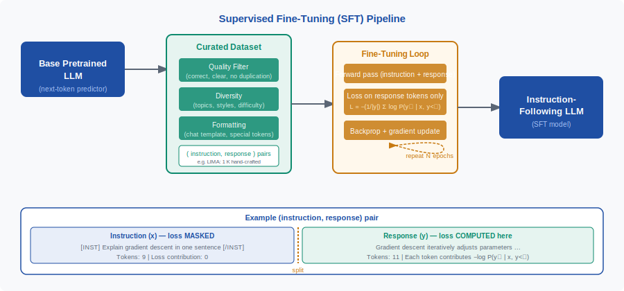
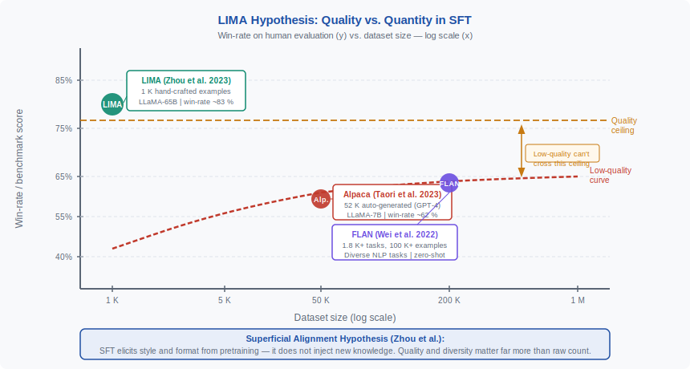

<!-- ============================ TOP NAV ============================ -->
<div align="center">

[🏠 Home](../../README.md) &nbsp;•&nbsp; [📚 Section 4 — Post-training](./README.md) &nbsp;•&nbsp; [Q4‑02 — RLHF Overview ➡️](./q02-rlhf-overview.md)

</div>

---

# Q4‑01 · What is supervised fine-tuning (SFT)? Why is data quality often more important than quantity here (LIMA hypothesis)?

<div align="center">


</div>

> [!IMPORTANT]
> **The 20-second answer.** Supervised fine-tuning (SFT) is a second training phase applied to a pretrained LLM: the model is trained with standard cross-entropy loss on a curated dataset of (instruction, response) pairs, with the loss masked on the instruction tokens so only the response tokens contribute. SFT bridges the gap between raw next-token prediction and helpful, instruction-following behavior. The LIMA hypothesis (Zhou et al., 2023) shows that 1,000 carefully hand-crafted examples beat 52,000 auto-generated ones: alignment is mostly about eliciting style and format the model already absorbed during pretraining, not injecting new knowledge, so data quality and diversity dominate raw count.

---

## Table of contents

1. [First principles](#1--first-principles)
2. [The core mechanism](#2--the-core-mechanism)
3. [Figure 1 — SFT pipeline](#3--figure-1--sft-pipeline)
4. [Step-by-step worked example](#4--step-by-step-worked-example)
5. [Figure 2 — LIMA: quality vs quantity](#5--figure-2--lima-quality-vs-quantity)
6. [Algorithm / pseudocode](#6--algorithm--pseudocode)
7. [PyTorch reference implementation](#7--pytorch-reference-implementation)
8. [Worked numerical example](#8--worked-numerical-example)
9. [Interview drill — follow-up questions](#9--interview-drill--follow-up-questions)
10. [Common misconceptions](#10--common-misconceptions)
11. [Connections to other concepts](#11--connections-to-other-concepts)
12. [One-screen summary](#12--one-screen-summary)
13. [Five-minute refresher](#13--five-minute-refresher)
14. [Further reading](#14--further-reading)
15. [Bottom navigation](#15--bottom-navigation)

---

## 1 · First principles

### What a pretrained LLM can and cannot do

A large language model that has just finished pretraining is an extraordinary statistical machine: it has compressed terabytes of human text into billions of parameters and can continue any passage in a plausible, fluent way. But "plausible continuation" is not the same as "helpful response to a user's question." There are three key gaps.

**Gap 1 — Format mismatch.** A user asks a question like "Explain gradient descent in one sentence." The web contains many plausible continuations of that text (another question, an unrelated paragraph, a search-engine snippet). The pretrained model has no preference for the specific format a conversational assistant would use.

**Gap 2 — Helpfulness.** The pretraining objective rewards probability mass on the next observed token, which means the model learns to mimic the distribution of human text — not to maximise the usefulness of its outputs. Unhelpful but grammatically correct continuations are equally acceptable to the training signal.

**Gap 3 — Safety and refusal.** Nothing in standard next-token prediction teaches the model to decline harmful requests, add caveats, or acknowledge uncertainty. The raw model will happily continue a prompt that begins "Here is how to synthesise…" because such texts appear in its training data.

### Why SFT is the simplest remedy

Supervised fine-tuning addresses all three gaps in one step: show the model examples of exactly the behavior you want. Each training example is a pair $(x, y)$ where $x$ is the user instruction and $y$ is the desired response. The model is updated so that, given $x$, it learns to produce $y$ rather than any arbitrary continuation. No new architecture is needed; no reward model is required. The whole procedure is identical to pretraining at the loss level — the difference is only in the data.

### Why the model is not starting from scratch

A crucial insight: during pretraining the model has already seen instructional, Q&A, and conversational text. Stack Exchange, Reddit, GitHub issues, textbooks, and documentation are full of (question, answer) structure. The knowledge needed to answer "Explain gradient descent" is already encoded in the weights. SFT does not install that knowledge — it teaches the model which style of continuation (the helpful assistant response) to prefer over all the others it learned to generate. This is why a small number of high-quality examples is often sufficient, a fact the LIMA paper formalises.

---

## 2 · The core mechanism

### SFT as masked cross-entropy fine-tuning

SFT is standard autoregressive language-model training on a supervised dataset. The key architectural decision is **loss masking**: the cross-entropy loss is computed only over the response tokens $y$, not over the instruction tokens $x$.

Formally, let:
- $x = (x_1, \ldots, x_m)$ — the instruction token sequence
- $y = (y_1, \ldots, y_n)$ — the response token sequence
- $[x; y]$ — the concatenated sequence fed to the model
- $P_\theta(y_t \mid x, y_{<t})$ — the model's predicted probability of the $t$-th response token

The SFT loss is:

$$\mathcal{L}_{\text{SFT}} = -\frac{1}{|y|} \sum_{t=1}^{|y|} \log P_\theta(y_t \mid x, y_{<t})$$

Instruction tokens still appear in the input (the model reads $x$ as context), but their positions contribute zero gradient signal — only response positions are backpropagated through.

### Why mask the instruction tokens?

If the instruction loss were included, the model would spend capacity fitting instruction text that is almost always template-like (short, similar prompts). Masking keeps the optimization focused on the harder and more variable response tokens, and it prevents the loss from being dominated by long system prompts when short responses follow.

### Relationship to the pretraining objective

During pretraining: $\mathcal{L}_{\text{PT}} = -\sum_t \log P_\theta(w_t \mid w_{<t})$ over raw documents.

SFT is the same functional form, but restricted to the response portion of supervised (instruction, response) pairs. The key differences are:

| Aspect | Pretraining | SFT |
|---|---|---|
| Data | Raw text, unsupervised | Curated (instruction, response) pairs |
| Loss tokens | All tokens | Response tokens only |
| Dataset size | Trillions of tokens | Thousands to millions of examples |
| Learning rate | Full training LR | Smaller LR (e.g., 1e-5 to 2e-5) |
| Epochs | ~1 over the corpus | 2–5 epochs over the SFT dataset |
| Objective | Model world as text | Elicit helpful behavior |

### Chat templates and special tokens

Modern SFT wraps the raw instruction and response in a chat template that marks role boundaries with special tokens. For example, a Llama-3 formatted example looks like:

```
<|begin_of_text|><|start_header_id|>user<|end_header_id|>

Explain gradient descent in one sentence<|eot_id|><|start_header_id|>assistant<|end_header_id|>

Gradient descent iteratively adjusts parameters in the direction of steepest loss decrease.<|eot_id|>
```

The loss mask covers every token up to and including `<|eot_id|>` after "assistant" — everything from `Gradient` onward is supervised.

---

## 3 · Figure 1 — SFT pipeline

<div align="center">

</div>

**Reading the figure.** The base pretrained LLM (navy, left) produces arbitrary text continuations. A data curation step (teal) assembles a dataset of (instruction, response) pairs, applying quality filtering, diversity selection, and chat-template formatting. The fine-tuning loop (amber) runs forward passes on the full concatenated sequence, computes cross-entropy loss restricted to response tokens, and updates model weights via backpropagation. After typically 2–5 epochs the result is an instruction-following model (navy, right) that, given a user instruction, reliably produces a well-formatted, helpful response. The bottom panel illustrates the loss masking: instruction tokens contribute zero loss; every response token contributes $-\log P_\theta(y_t \mid x, y_{<t})$.

---

## 4 · Step-by-step worked example

We trace a single training step through a concrete example.

**Example pair**

- Instruction $x$: `Explain gradient descent in one sentence`
- Response $y$: `Gradient descent iteratively adjusts parameters in the direction of steepest loss decrease.`

**Step 1 — Tokenize and concatenate**

Apply the chat template and tokenize. Suppose the tokenizer yields:

| Segment | Tokens (illustrative) |
|---|---|
| System / user header | `[BOS] [USER] Explain gradient descent in one sentence [/USER]` |
| Instruction token count $m$ | 9 tokens |
| Assistant header | `[ASST]` |
| Response tokens | `Gradient`, `▁descent`, `▁iter`, `atively`, `▁adjusts`, `▁parameters`, `▁in`, `▁the`, `▁direction`, `▁of`, `▁steepest`, `▁loss`, `▁decrease`, `.` |
| Response token count $n$ | 14 tokens |

Total sequence length: 24 tokens (some overlap with header tokens omitted for brevity).

**Step 2 — Build the loss mask**

Create a binary mask $M \in \{0,1\}^{24}$ where $M_t = 1$ for response positions (positions 10–23 in this example) and $M_t = 0$ elsewhere.

**Step 3 — Forward pass**

Run the full sequence through the model. The transformer's causal attention means each response token attends to all prior tokens including the full instruction — no information is hidden. The model produces a probability distribution over the vocabulary at every position.

**Step 4 — Compute the masked loss**

For each response position $t$, extract $P_\theta(y_t \mid x, y_{<t})$ from the softmax output. The loss contribution of token `Gradient` at position 10:

$$\ell_{10} = -\log P_\theta(\text{"Gradient"} \mid x, \text{[ASST]})$$

Suppose the model assigns probability 0.72 to `Gradient`. Then $\ell_{10} = -\log(0.72) = 0.329$.

Average over all $n = 14$ response tokens:

$$\mathcal{L}_{\text{SFT}} = \frac{1}{14} \sum_{t=10}^{23} \ell_t$$

**Step 5 — Backward pass and update**

Backpropagate through the loss — gradients flow to every layer that influenced the response positions, including the key/query/value projections that processed the instruction tokens (since the instruction tokens affected the response via attention). Update parameters with AdamW.

**Step 6 — Repeat over the dataset**

Shuffle all (instruction, response) pairs and repeat for 2–5 epochs. After training, the model's conditional distribution $P_\theta(\cdot \mid x)$ has been shaped toward producing responses that look like the curated examples.

---

## 5 · Figure 2 — LIMA: quality vs quantity

<div align="center">

</div>

**Reading the figure.** The y-axis shows human-evaluation win-rate (higher is better); the x-axis shows dataset size on a log scale. LIMA (teal circle, 1 K examples) sits well above the low-quality curve, close to the quality ceiling. Alpaca (red circle, 52 K auto-generated) and FLAN (purple, 100 K+ diverse NLP tasks) lie on or near the low-quality curve. The amber dashed horizontal line marks the "quality ceiling" — a plateau that low-quality data never crosses no matter how many examples are added. The bidirectional amber arrow between the low-quality curve and the ceiling illustrates the persistent gap even at 1M examples. The insight box at the bottom states the Superficial Alignment Hypothesis: SFT elicits style, not knowledge.

---

## 6 · Algorithm / pseudocode

```
Algorithm: Supervised Fine-Tuning (SFT)

Input:
  θ_0         — pretrained model weights
  D           — curated dataset of (instruction, response) pairs
  lr          — learning rate (e.g. 2e-5)
  n_epochs    — number of training epochs (e.g. 3)
  batch_size  — examples per gradient step (e.g. 32)

Output:
  θ_sft       — fine-tuned (SFT) model weights

Procedure:
  θ ← θ_0
  for epoch in 1..n_epochs:
    shuffle D
    for each mini-batch B ⊂ D:
      loss ← 0
      for each (x, y) in B:
        tokens ← chat_template(x, y)      # concatenate with special tokens
        mask   ← build_loss_mask(tokens, y)# 1 for response positions, 0 elsewhere
        logits ← model_forward(tokens; θ)  # shape: [seq_len, vocab_size]
        loss   += cross_entropy(logits, tokens, mask) / |y|
      loss ← loss / |B|
      θ ← θ - lr · AdamW_step(∇_θ loss)
  return θ

Subroutine: cross_entropy(logits, tokens, mask):
  total ← 0
  for t in 1..len(tokens)-1:
    if mask[t] == 1:
      total += -log softmax(logits[t])[tokens[t+1]]
  return total
```

**Key design choices in practice:**

- **Packing**: multiple short examples are packed into one context window (with attention masks ensuring examples don't attend across boundaries) to improve GPU utilization.
- **Learning rate warm-up**: typically 3–5% of total steps to avoid overshooting from the pretrained initialization.
- **Gradient clipping**: max norm 1.0 is standard to prevent instability on outlier examples.
- **Weight decay**: 0.01–0.1 with AdamW to regularize and reduce overfitting on small SFT datasets.

---

## 7 · PyTorch reference implementation

```python
import torch
import torch.nn.functional as F
from torch.utils.data import DataLoader, Dataset


class SFTDataset(Dataset):
    """Minimal SFT dataset returning input_ids and loss masks."""

    def __init__(self, examples, tokenizer, max_length=2048):
        self.examples = examples
        self.tokenizer = tokenizer
        self.max_length = max_length

    def __len__(self):
        return len(self.examples)

    def __getitem__(self, idx):
        instruction, response = self.examples[idx]

        # Apply chat template; returns full token sequence
        full_text = self.tokenizer.apply_chat_template(
            [
                {"role": "user", "content": instruction},
                {"role": "assistant", "content": response},
            ],
            tokenize=False,
            add_generation_prompt=False,
        )
        encoding = self.tokenizer(
            full_text,
            max_length=self.max_length,
            truncation=True,
            return_tensors="pt",
        )
        input_ids = encoding["input_ids"].squeeze(0)  # [seq_len]

        # Build loss mask: 1 on response tokens, 0 on instruction tokens
        instruction_only = self.tokenizer.apply_chat_template(
            [{"role": "user", "content": instruction}],
            tokenize=False,
            add_generation_prompt=True,  # include the assistant header
        )
        instr_len = self.tokenizer(
            instruction_only, return_tensors="pt"
        )["input_ids"].shape[-1]

        loss_mask = torch.zeros_like(input_ids)
        loss_mask[instr_len:] = 1  # supervise only the response portion

        return input_ids, loss_mask


def sft_loss(logits: torch.Tensor, input_ids: torch.Tensor,
             loss_mask: torch.Tensor) -> torch.Tensor:
    """
    Compute masked cross-entropy loss for SFT.

    Args:
        logits:     [batch, seq_len, vocab_size]  — model output
        input_ids:  [batch, seq_len]              — token IDs
        loss_mask:  [batch, seq_len]              — 1 on response positions

    Returns:
        Scalar mean loss over response tokens.
    """
    # Shift: predict token t+1 from position t
    shift_logits = logits[:, :-1, :].contiguous()   # [B, L-1, V]
    shift_labels = input_ids[:, 1:].contiguous()     # [B, L-1]
    shift_mask   = loss_mask[:, 1:].contiguous()     # [B, L-1]

    # Per-token cross-entropy (no reduction)
    loss_per_token = F.cross_entropy(
        shift_logits.view(-1, shift_logits.size(-1)),
        shift_labels.view(-1),
        reduction="none",
    )  # [B*(L-1)]
    loss_per_token = loss_per_token.view(shift_logits.shape[:2])  # [B, L-1]

    # Apply mask and average over response tokens
    masked_loss = (loss_per_token * shift_mask).sum()
    n_response_tokens = shift_mask.sum().clamp(min=1)
    return masked_loss / n_response_tokens


def train_sft(model, dataset, tokenizer, lr=2e-5, n_epochs=3, batch_size=8):
    """Minimal SFT training loop."""
    optimizer = torch.optim.AdamW(model.parameters(), lr=lr, weight_decay=0.01)

    def collate_fn(batch):
        input_ids_list, mask_list = zip(*batch)
        # Pad to longest in batch (right-padding)
        input_ids = torch.nn.utils.rnn.pad_sequence(
            input_ids_list, batch_first=True,
            padding_value=tokenizer.pad_token_id
        )
        loss_masks = torch.nn.utils.rnn.pad_sequence(
            mask_list, batch_first=True, padding_value=0
        )
        return input_ids, loss_masks

    loader = DataLoader(dataset, batch_size=batch_size,
                        shuffle=True, collate_fn=collate_fn)
    model.train()

    for epoch in range(n_epochs):
        total_loss = 0.0
        for step, (input_ids, loss_mask) in enumerate(loader):
            input_ids = input_ids.to(model.device)
            loss_mask = loss_mask.to(model.device)

            # attention_mask: 1 everywhere except padding
            attention_mask = (input_ids != tokenizer.pad_token_id).long()

            outputs = model(input_ids=input_ids, attention_mask=attention_mask)
            loss = sft_loss(outputs.logits, input_ids, loss_mask)

            optimizer.zero_grad()
            loss.backward()
            torch.nn.utils.clip_grad_norm_(model.parameters(), max_norm=1.0)
            optimizer.step()

            total_loss += loss.item()

        avg = total_loss / max(len(loader), 1)
        print(f"Epoch {epoch + 1}/{n_epochs}  avg loss = {avg:.4f}")

    return model
```

**Notes:**
- `apply_chat_template` with `add_generation_prompt=True` adds the assistant header without the response, which lets us compute the instruction length precisely.
- For efficiency in production, use example packing (bin-packing multiple examples into one sequence) and block-diagonal attention masks to prevent cross-example attention.
- Parameter-efficient methods (LoRA, QLoRA) replace full fine-tuning in practice, but the loss function is identical.

---

## 8 · Worked numerical example

**Setup:** We perform one forward/backward step on a short example.

- Instruction $x$: 5 tokens (already processed; contribute 0 to loss)
- Response $y$: 5 tokens — `Gradient`, `descent`, `iteratively`, `adjusts`, `parameters`
- Model probabilities for each correct next token (after forward pass):

| Position | Token | $P_\theta$ |
|---|---|---|
| 1 | `Gradient` | 0.72 |
| 2 | `descent` | 0.85 |
| 3 | `iteratively` | 0.61 |
| 4 | `adjusts` | 0.78 |
| 5 | `parameters` | 0.69 |

**Step 1 — Per-token negative log-probabilities**

$$-\log P_1 = -\log(0.72) = 0.3285$$
$$-\log P_2 = -\log(0.85) = 0.1625$$
$$-\log P_3 = -\log(0.61) = 0.4943$$
$$-\log P_4 = -\log(0.78) = 0.2485$$
$$-\log P_5 = -\log(0.69) = 0.3711$$

**Step 2 — Average over response tokens**

$$\mathcal{L}_{\text{SFT}} = \frac{1}{5}\bigl(0.3285 + 0.1625 + 0.4943 + 0.2485 + 0.3711\bigr) = \frac{1.6049}{5} = 0.3210$$

**Python verification:**

```python
import math

probs = [0.72, 0.85, 0.61, 0.78, 0.69]
neg_logs = [-math.log(p) for p in probs]
print([round(v, 4) for v in neg_logs])
# [0.3285, 0.1625, 0.4943, 0.2485, 0.3711]

loss = sum(neg_logs) / len(neg_logs)
print(round(loss, 4))
# 0.321
```

**Step 3 — Interpretation**

The loss of 0.321 nats corresponds to a perplexity of $e^{0.321} \approx 1.38$ over the five tokens. A perfectly trained model would achieve loss $\to 0$; a uniform model over a 32,000-token vocabulary would achieve $\log(32000) \approx 10.37$. After fine-tuning on many similar examples, the model will assign higher probability to these tokens and the loss will approach zero.

**Step 4 — Effect of masking**

If we had not masked the instruction tokens and instead included all 5 instruction + 5 response tokens in the denominator:

$$\mathcal{L}_{\text{unmasked}} = \frac{1.6049}{10} = 0.1605$$

This would be half the signal and would give the optimizer a misleading sense of how well the model is doing on the response — especially when instruction tokens are template tokens (near probability 1.0 after enough training), which would drag the average loss artificially low.

---

## 9 · Interview drill — follow-up questions

**Q1: Why don't we include the instruction tokens in the SFT loss?**

The instruction tokens are context, not the target behavior. Including them would dilute the gradient signal from response tokens and encourage the model to memorize specific instruction phrasings rather than generalise across paraphrasings. Practically, instruction tokens are often short, formulaic, and quickly reach near-zero loss after a few steps, which would bias the loss downward and misrepresent model progress on the harder response tokens.

**Q2: How does SFT differ from RLHF?**

SFT is a single supervised step: minimize cross-entropy on (instruction, response) pairs drawn from a fixed dataset. The quality of the SFT model is bounded by the quality of the dataset — if the dataset contains mediocre responses, the model learns mediocre behavior. RLHF adds a second optimization loop: a reward model scores multiple generated responses and the language model is updated (via PPO or a similar RL algorithm) to maximize that reward. RLHF can improve beyond what any single human-written response showed, but is much more complex to implement and tune.

**Q3: What is the "superficial alignment hypothesis"?**

Zhou et al. (2023) propose that almost all the knowledge and capability needed for instruction following was already learned during pretraining. SFT simply teaches the model the surface-level format — how to present that knowledge as a helpful assistant response. Evidence: a 65B LLaMA model fine-tuned on only 1,000 examples (LIMA) matches or outperforms models trained on 52,000 auto-generated examples. The hypothesis implies that the bottleneck is not the amount of SFT data but the breadth and depth of pretraining.

**Q4: What makes a good SFT example? What are the LIMA data-quality criteria?**

Zhou et al. identify four criteria: (1) **Correctness** — the response must be factually accurate; (2) **Clarity** — the writing must be clear and well-structured; (3) **Diversity** — the dataset as a whole must cover a broad range of topics, formats, and difficulty levels; (4) **Non-repetitiveness** — near-duplicate examples waste capacity and skew the distribution. A fifth implicit criterion is **appropriate length** — neither too terse nor padded.

**Q5: Can SFT overfit? What are the signs?**

Yes. With a small dataset (hundreds of examples) and many epochs, the model can memorize exact phrasings, reducing validation perplexity on in-distribution examples but failing on novel instructions (an instruction distribution not covered in the SFT data). Signs include: training loss near zero but high validation loss, degenerate repetition in generated text, rigid output format regardless of instruction phrasing. Mitigations: early stopping, data augmentation, dropout, LoRA regularization, or using a larger/more diverse dataset.

**Q6: What is LoRA and why is it popular for SFT?**

LoRA (Low-Rank Adaptation, Hu et al. 2022) freezes the pretrained weights and inserts small rank-$r$ matrices into selected layers: $W \leftarrow W_0 + \Delta W = W_0 + BA$ where $B \in \mathbb{R}^{d \times r}$, $A \in \mathbb{R}^{r \times k}$, and $r \ll \min(d,k)$. Only $A$ and $B$ are trained, reducing trainable parameters by 100–1000x. This makes SFT feasible on a single GPU for 7B–70B models, lowers memory cost during backpropagation, and provides implicit regularization (the low-rank constraint prevents large deviations from pretraining).

**Q7: How many epochs should you train SFT for?**

Typically 2–5 epochs over the SFT dataset. The right number depends on dataset size: larger datasets (100K+) often need only 1–2 epochs; smaller datasets (1K–10K) can tolerate more. Monitor validation perplexity and held-out generation quality (via GPT-4 judge or human evaluation). LIMA trained for 15 epochs over 1,000 examples with early stopping on a 268-example validation set.

**Q8: What is the difference between SFT and instruction tuning as described in FLAN?**

The terms are often used interchangeably, but there is a historical distinction. FLAN (Wei et al., 2022) reformulated many existing NLP datasets (classification, summarization, QA) into instruction format and showed that this multi-task instruction fine-tuning dramatically improved zero-shot generalization. FLAN focused on breadth across tasks using existing benchmark data. The SFT in InstructGPT and the modern chat-tuning pipeline uses human-written conversational instructions and demonstrations curated specifically for assistant behavior. FLAN is instruction tuning for zero-shot NLP generalization; InstructGPT-style SFT is instruction tuning for conversational helpfulness.

---

## 10 · Common misconceptions

**Misconception 1: SFT teaches the model new factual knowledge.**

False. SFT examples are typically short — often a few hundred tokens each. Learning a new fact would require hundreds or thousands of exposures to it (as in pretraining). The vast pretraining corpus has already encoded most of the knowledge the model will ever have. SFT teaches the model *which of its many capabilities to deploy* in response to a user instruction, and *how to present* that knowledge. This is the core claim of the LIMA superficial alignment hypothesis. If a fact is not in the pretraining data, SFT on a handful of examples will not reliably install it; it may appear to work on the training examples but will fail to generalize.

**Misconception 2: More SFT data is always better.**

False, and this is LIMA's central contribution. Alpaca (52,000 GPT-3.5-generated examples) produces a weaker model than LIMA (1,000 hand-crafted examples) when evaluated by humans. Beyond a certain point, adding low-quality or repetitive examples hurts: it narrows the diversity of the training distribution, wastes compute, and can introduce noise that overwrites well-calibrated behavior learned from better examples. Quality, diversity, and correctness dominate raw count.

**Misconception 3: SFT replaces pretraining.**

False. SFT is the second stage of a two-stage pipeline. Without large-scale pretraining, the model has no world knowledge to draw on and SFT cannot elicit capabilities that were never learned. Attempting to teach a randomly initialized model to follow instructions via SFT would require a full training run's worth of data and compute. The success of SFT depends entirely on the richness of the pretrained representations.

**Misconception 4: The instruction tokens don't matter because they're masked.**

False in a subtle way. The instruction tokens are masked from the *loss*, but they are present in the *input* and influence the model's hidden states via attention. The model reads the full instruction to build the context it needs to generate the correct response. Masking means the instruction tokens don't contribute gradient signal, not that they're invisible to the model.

**Misconception 5: SFT and RLHF are alternatives; you choose one or the other.**

False. In the standard pipeline they are sequential and complementary: SFT comes first to establish basic instruction-following behavior, then RLHF (or DPO) refines the model using preference signals. Running RLHF without a good SFT initialization is harder because the reward model must distinguish between many poor responses. SFT narrows the response distribution to a reasonable region, making RLHF's optimization problem more tractable.

**Misconception 6: A higher-quality base model means SFT can be skipped.**

Not in practice. Even very large pretrained models (GPT-3, LLaMA-65B) without SFT produce erratic, unhelpful outputs when given conversational prompts. They may answer one question correctly and completely ignore the next. SFT consistently reduces this variance and is widely considered a prerequisite for deployment, regardless of base model quality.

**Misconception 7: SFT loss is identical to pretraining loss.**

The loss function has the same mathematical form (cross-entropy), but the data distribution, masking scheme, learning rate, and number of steps are all different. In particular, the loss masking on instruction tokens is absent in pretraining, and the much smaller dataset means training dynamics (overfitting risk, learning rate schedule) differ substantially.

---

## 11 · Connections to other concepts

**RLHF (Reinforcement Learning from Human Feedback)** — SFT is the mandatory first step of the InstructGPT pipeline. A well-tuned SFT model is used to (a) initialize the policy for PPO training and (b) generate response pairs that human raters rank to train the reward model. Poor SFT quality propagates into both downstream components.

**DPO (Direct Preference Optimization)** — DPO (Rafailov et al., 2023) can be applied directly on top of an SFT model, using preference pairs (chosen, rejected) without a separate reward model. The SFT model serves as both the initialization and the reference policy $\pi_{\text{ref}}$ in the DPO objective. The quality of the SFT baseline directly affects the DPO loss landscape.

**Pretraining and the scaling hypothesis** — The LIMA result is consistent with the scaling laws view: at large scale, pretraining absorbs essentially all learnable knowledge; post-training is a lightweight behavioral calibration. This implies the returns to SFT data scale sublinearly beyond a modest coverage threshold.

**Instruction tuning (FLAN, T0)** — FLAN and T0 demonstrated that reformulating diverse NLP tasks as instructions dramatically improves zero-shot generalization. Modern SFT builds on this insight by also including open-ended conversational and coding tasks, not just formatted NLP benchmarks.

**LoRA and parameter-efficient fine-tuning** — SFT with full weight updates on a 70B model requires ~280 GB of optimizer state (in fp32). LoRA reduces this to a few GB by training only low-rank adapters. The SFT objective is unchanged; only the parameter space being optimized is restricted.

**Constitutional AI (CAI) and self-critique** — Anthropic's CAI method uses SFT (on self-critiqued, revised outputs) as a scalable alternative to human labeling of helpful, harmless, honest responses. The SFT mechanism is the same; the data pipeline is automated.

**Data flywheel** — Production systems (ChatGPT, Claude) continuously collect user feedback and use it to generate new SFT examples, creating a data flywheel: better SFT → better user experience → more usage → more feedback → better SFT data.

**Knowledge distillation** — Teacher-student distillation can be framed as SFT where the student learns from teacher-generated responses. Alpaca used GPT-3.5 outputs as the "teacher" responses. This is a form of data augmentation that leverages a stronger model to produce SFT labels for a weaker one.

---

## 12 · One-screen summary

| Concept | Key fact |
|---|---|
| What SFT is | Cross-entropy fine-tuning on (instruction, response) pairs; loss masked to response tokens only |
| Loss formula | $\mathcal{L}_{\text{SFT}} = -\frac{1}{\vert y\vert} \sum_{t=1}^{\vert y\vert} \log P_\theta(y_t \mid x, y_{<t})$ |
| Why mask instructions | Avoids diluting gradients with near-trivial template tokens; focuses optimization on response quality |
| LIMA result | 1,000 hand-crafted examples (LIMA) > 52,000 auto-generated examples (Alpaca) on human eval |
| Superficial alignment hypothesis | SFT elicits style and format; knowledge comes from pretraining |
| Data-quality criteria | Correct, clear, diverse, non-repetitive, appropriate length |
| Typical scale | 1 K–100 K examples; 2–5 epochs; LR ~2e-5 |
| Relation to RLHF | SFT is step 1; RLHF/DPO refines further using preference signals |
| Common pitfall | Mistaking more data for better data; overfitting on small datasets |
| Practical tool | LoRA reduces trainable parameters by 100–1000x; loss is identical |

---

## 13 · Five-minute refresher

1. **The gap:** A pretrained LLM predicts next tokens but has no preference for helpful, instruction-following behavior. SFT bridges this gap by fine-tuning on curated (instruction, response) pairs.

2. **The loss:** Standard cross-entropy, but computed only on response tokens. Instructions are masked because they are context, not targets.

3. **What SFT does NOT do:** It does not inject new factual knowledge. The model's world knowledge is fixed by pretraining. SFT teaches the model which behavioral mode to activate and how to format its outputs.

4. **LIMA (Zhou et al., 2023):** 1,000 carefully hand-crafted examples fine-tuned LLaMA-65B to match or outperform models trained on 52,000 auto-generated examples. The key insight — "superficial alignment hypothesis" — is that alignment is about style elicitation, not knowledge injection.

5. **Data quality criteria:** Correct, clear, diverse topics/formats, no near-duplicates, appropriate response length.

6. **Practical stack:** SFT often uses LoRA for memory efficiency. Learning rate ~2e-5, AdamW with weight decay, gradient clipping at 1.0, 2–5 epochs.

7. **Pipeline position:** SFT → (optionally) reward model training → RLHF/DPO. Every downstream step inherits the SFT model's behavior as a starting point.

---

## 14 · Further reading

| Resource | Why it matters |
|---|---|
| Zhou et al. (2023). **LIMA: Less Is More for Alignment.** *NeurIPS 2023.* | Central paper for the quality > quantity hypothesis; introduces the superficial alignment hypothesis. |
| Ouyang et al. (2022). **Training language models to follow instructions with human feedback.** *NeurIPS 2022.* | The InstructGPT paper; defines the SFT → RM → RLHF pipeline and shows SFT alone is a strong baseline. |
| Wei et al. (2022). **Finetuned Language Models Are Zero-Shot Learners.** *ICLR 2022.* | FLAN: instruction tuning across 60+ NLP tasks; foundational work on why instruction format generalizes. |
| Taori et al. (2023). **Alpaca: A Strong, Replicable Instruction-Following Model.** *Stanford HAI Blog, March 2023.* | 52K self-instruct examples from GPT-3.5; useful contrast with LIMA for understanding data-quantity limits. |
| Wang et al. (2023). **Self-Instruct: Aligning Language Models with Self-Generated Instructions.** *ACL 2023.* | Bootstrapping instruction data from the model itself; basis for Alpaca-style pipelines. |
| Hu et al. (2022). **LoRA: Low-Rank Adaptation of Large Language Models.** *ICLR 2022.* | Parameter-efficient SFT; essential for practical fine-tuning of 7B–70B models. |
| Rafailov et al. (2023). **Direct Preference Optimization: Your Language Model Is Secretly a Reward Model.** *NeurIPS 2023.* | DPO as a simpler post-SFT alignment step; builds directly on SFT outputs. |

---

## 15 · Bottom navigation

<div align="center">

[🏠 Home](../../README.md) &nbsp;•&nbsp; [📚 Section 4 — Post-training](./README.md) &nbsp;•&nbsp; [Q4‑02 — RLHF Overview ➡️](./q02-rlhf-overview.md)

</div>
