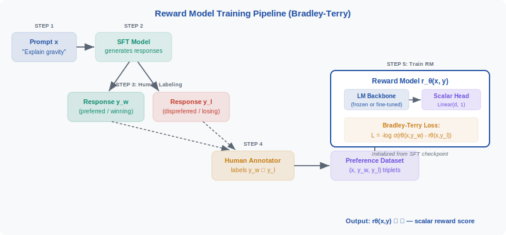
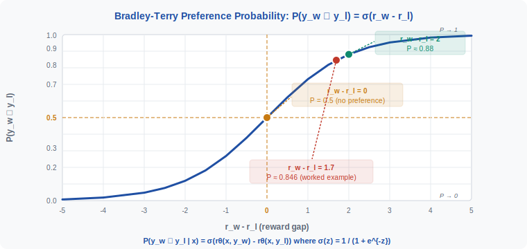

<!-- ============================ TOP NAV ============================ -->
<div align="center">

[🏠 Home](../../README.md) &nbsp;•&nbsp; [📚 Section 4 — Post-training: SFT, RLHF, DPO and Beyond](./README.md) &nbsp;•&nbsp; [⬅️ Q4‑02](./q02-sft.md) &nbsp;•&nbsp; [Q4‑04 ➡️](./q04-ppo-rlhf.md)

</div>

---

# Q4‑03 · What is a reward model? How is it trained from preference pairs (Bradley-Terry model)?

<div align="center">


</div>

> [!IMPORTANT]
> **The 20-second answer.** A **reward model (RM)** is a neural network trained to assign a scalar score to any (prompt, response) pair that correlates with human preference — higher scores for better responses. It is built by taking a pre-trained LM backbone, replacing the final vocabulary projection with a single linear unit (the scalar head), and fine-tuning on human preference data. Training data consists of triplets (x, y_w, y_l) where x is a prompt and y_w is preferred over y_l by a human annotator. The **Bradley-Terry model** provides the probabilistic framework: it models the probability that y_w is preferred as the sigmoid of the reward gap, P(y_w ≻ y_l | x) = σ(r(x, y_w) − r(x, y_l)), which gives the training loss L_RM = −E[(log σ(r_θ(x, y_w) − r_θ(x, y_l)))]. The trained RM then serves as the proxy for human judgment inside the PPO loop of RLHF.

---

## Table of contents

1. [First principles](#1--first-principles)
2. [The core mechanism](#2--the-core-mechanism)
3. [Figure 1 — reward model training pipeline](#3--figure-1--reward-model-training-pipeline)
4. [Step-by-step worked example](#4--step-by-step-worked-example)
5. [Figure 2 — Bradley-Terry probability curve](#5--figure-2--bradley-terry-probability-curve)
6. [Algorithm / pseudocode](#6--algorithm--pseudocode)
7. [PyTorch reference implementation](#7--pytorch-reference-implementation)
8. [Worked numerical example](#8--worked-numerical-example)
9. [Interview drill — follow-up questions](#9--interview-drill--follow-up-questions)
10. [Common misconceptions](#10--common-misconceptions)
11. [Connections to other concepts](#11--connections-to-other-concepts)
12. [One-screen summary](#12--one-screen-summary)
13. [Five-minute refresher](#13--five-minute-refresher)
14. [Further reading](#14--further-reading)
15. [Bottom navigation](#15--bottom-navigation)

---

## 1 · First principles

Large language models are trained on next-token prediction. This objective is well-defined and scalable, but it optimises for **imitating the training distribution** rather than for producing outputs that humans find helpful, harmless, or honest. Fine-tuning on human demonstrations (SFT) partially addresses this, but even high-quality SFT data provides only a weak signal for nuanced quality attributes — helpfulness, honesty, avoiding subtle harms — that are hard to specify in text but easy for humans to judge comparatively.

The key insight behind RLHF is to **replace the unspecified notion of "quality" with a learned proxy**: the reward model. Rather than asking humans to write ideal responses (expensive, inconsistent) or to rate responses on an absolute scale (noisy, rater-dependent), we ask them to answer a much simpler question: **which of these two responses is better?** Pairwise comparisons are faster, more reliable, and more consistent across annotators than absolute ratings.

The reward model learns to predict the outcome of these comparisons. Once trained, it acts as a differentiable stand-in for human judgment, providing a scalar reward signal that can be used to optimise an LLM via reinforcement learning (PPO) or directly in preference optimisation methods (DPO, RAFT, etc.).

Three foundational design decisions define the reward model:

1. **Architecture:** Initialise from the SFT checkpoint, replace the LM head with a scalar head.
2. **Data format:** Preference pairs (x, y_w, y_l) rather than absolute quality labels.
3. **Loss function:** Bradley-Terry log-likelihood of the correct pairwise ordering.

---

## 2 · The core mechanism

### The Bradley-Terry model

Bradley and Terry (1952) introduced a probabilistic model for pairwise comparisons in sports rankings. Each item i has a latent "strength" parameter s_i. The probability that item i beats item j is:

$$P(i \succ j) = \frac{s_i}{s_i + s_j}$$

When strengths are parameterised as exponentials of real-valued scores r_i = log s_i, this becomes:

$$P(i \succ j) = \frac{e^{r_i}}{e^{r_i} + e^{r_j}} = \frac{1}{1 + e^{-(r_i - r_j)}} = \sigma(r_i - r_j)$$

Applied to language model outputs, the reward model r_θ(x, y) plays the role of the log-strength parameter. Given a prompt x, a preferred response y_w, and a dispreferred response y_l:

$$\boxed{P(y_w \succ y_l \mid x) = \sigma\!\left(r_\theta(x, y_w) - r_\theta(x, y_l)\right)}$$

This is the **core modelling assumption** of preference-based reward models. The RM does not need to produce calibrated absolute scores — only the **relative ordering** matters. This is why reward models can be initialised from any LM checkpoint: the scalar head can be trained to produce any affine shift of the true utility, and the sigmoid only sees differences.

### The training loss

The negative log-likelihood of observing the correct preference, averaged over a dataset D of triplets, gives:

$$\mathcal{L}_{\mathrm{RM}} = -\mathbb{E}_{(x,\, y_w,\, y_l) \sim \mathcal{D}} \!\left[\log \sigma\!\left(r_\theta(x, y_w) - r_\theta(x, y_l)\right)\right]$$

This is a **binary cross-entropy loss** between the predicted preference probability and the human label (y_w is always labelled as preferred). The loss is minimised when r_θ(x, y_w) > r_θ(x, y_l) by a large margin for every triplet in D.

### Architecture

The RM is almost always initialised from the SFT model checkpoint. The final linear layer that projects hidden states to the vocabulary (size d_model → V) is discarded and replaced by a new linear layer that projects the last-token hidden state to a scalar (d_model → 1):

```
LM backbone  →  [CLS token / last token hidden state h ∈ ℝ^d]  →  Linear(d, 1)  →  r ∈ ℝ
```

The entire network (or the backbone frozen with only the head trained) is then fine-tuned on preference pairs using the Bradley-Terry loss.

> [!NOTE]
> In practice, extracting the reward from the **last token's** hidden state (for a decoder-only model) is standard. The reward for a response y given prompt x depends on the full sequence [x; y] because the attention mechanism attends to all preceding tokens.

---

## 3 · Figure 1 — reward model training pipeline

<div align="center">

<br><sub><b>Figure 1.</b> The reward model training pipeline. The SFT model generates two candidate responses for each prompt; a human annotator labels the preferred one. The resulting (x, y_w, y_l) triplets train the RM, which consists of the LM backbone (initialised from the SFT checkpoint) with the vocabulary head replaced by a scalar output layer. The Bradley-Terry loss pushes r_θ(x, y_w) above r_θ(x, y_l) for every preference pair.</sub>
</div>

---

## 4 · Step-by-step worked example

**Scenario:** We are training a reward model for a helpful assistant. Consider a single preference triplet.

**Step 1 — Collect a preference pair.**

| Field | Value |
|---|---|
| Prompt x | "Explain why the sky is blue in one sentence." |
| Response y_w (preferred) | "The sky appears blue because molecules in the atmosphere scatter shorter (blue) wavelengths of sunlight more than longer ones — a phenomenon called Rayleigh scattering." |
| Response y_l (dispreferred) | "The sky is blue because of sunlight." |

A human annotator reviews both and marks y_w as preferred (more accurate and informative).

**Step 2 — Forward pass through the RM for y_w.**

Concatenate [x; y_w] as a single token sequence. Feed through the LM backbone. Extract the last-token hidden state h_w ∈ ℝ^d. Apply the scalar head: r_w = W_scalar · h_w + b.

Suppose r_w = 2.1.

**Step 3 — Forward pass through the RM for y_l.**

Similarly concatenate [x; y_l], run the backbone, extract h_l, apply the scalar head.

Suppose r_l = 0.4.

**Step 4 — Compute the Bradley-Terry probability.**

$$P(y_w \succ y_l) = \sigma(r_w - r_l) = \sigma(2.1 - 0.4) = \sigma(1.7)$$

$$= \frac{1}{1 + e^{-1.7}} \approx \frac{1}{1 + 0.1827} = \frac{1}{1.1827} \approx 0.846$$

The model assigns 84.6% probability to the correct preference ordering.

**Step 5 — Compute the loss.**

$$\mathcal{L} = -\log(0.846) \approx 0.167$$

**Step 6 — Backpropagate and update.**

Gradients flow back through the scalar head and into the backbone (or only the head, if the backbone is frozen). The optimizer nudges the parameters so that future forward passes produce a larger gap r_w - r_l for similar inputs.

**Step 7 — Repeat at scale.**

InstructGPT (Ouyang et al., 2022) collected approximately 50,000 preference comparisons across roughly 1,500 prompts. After training, the RM generalises to unseen prompts and serves as the reward signal for PPO fine-tuning.

---

## 5 · Figure 2 — Bradley-Terry probability curve

<div align="center">

<br><sub><b>Figure 2.</b> The Bradley-Terry preference probability σ(r_w − r_l) as a function of the reward gap. When the gap is 0, the model assigns equal probability to both orderings (P = 0.5). At gap = 2, P ≈ 0.88 — a clear but not certain preference. The red annotation marks the worked example (gap = 1.7, P ≈ 0.846). The sigmoid's bounded output ensures the loss is always finite; its monotonicity ensures gradients always push the RM toward the correct ordering.</sub>
</div>

---

## 6 · Algorithm / pseudocode

```text
===== REWARD MODEL TRAINING =====
INPUT : SFT model checkpoint M_sft
        Preference dataset D = { (x_i, y_w_i, y_l_i) }
        Hyperparameters: lr, batch_size, num_epochs

1.  INITIALISE reward model r_θ:
      r_θ.backbone  <-- M_sft.backbone   (copy all weights)
      r_θ.head      <-- Linear(d_model, 1)  (new random weights)

2.  FOR epoch in 1..num_epochs:
      FOR batch B = { (x, y_w, y_l) } in D:

        a.  r_w = r_θ(x CONCAT y_w)     # forward pass: preferred
        b.  r_l = r_θ(x CONCAT y_l)     # forward pass: dispreferred

        c.  loss = -mean( log( sigmoid(r_w - r_l) ) )

        d.  loss.backward()
        e.  optimizer.step()
        f.  optimizer.zero_grad()

3.  RETURN r_θ

===== INFERENCE (scoring a single response) =====
INPUT : prompt x, response y, trained r_θ

1.  tokens = tokenize( x CONCAT y )
2.  h_last = r_θ.backbone(tokens)[-1]   # last token hidden state
3.  score  = r_θ.head(h_last)           # scalar reward
4.  RETURN score
```

---

## 7 · PyTorch reference implementation

```python
"""
Reward model: architecture, forward pass, and Bradley-Terry training loss.
Follows the InstructGPT (Ouyang et al., 2022) design.
"""
from __future__ import annotations
import torch
import torch.nn as nn
import torch.nn.functional as F
from transformers import AutoModel, AutoTokenizer


class RewardModel(nn.Module):
    """
    LM backbone with a scalar head.

    The backbone is a causal language model (e.g. GPT-2, LLaMA).
    The vocabulary head is discarded; a Linear(d_model, 1) replaces it.
    """

    def __init__(self, backbone_name: str) -> None:
        super().__init__()
        self.backbone = AutoModel.from_pretrained(backbone_name)
        d_model = self.backbone.config.hidden_size
        self.scalar_head = nn.Linear(d_model, 1, bias=True)
        # Initialise head near zero for training stability
        nn.init.zeros_(self.scalar_head.weight)
        nn.init.zeros_(self.scalar_head.bias)

    def forward(
        self,
        input_ids: torch.Tensor,          # (B, T)
        attention_mask: torch.Tensor,     # (B, T)
    ) -> torch.Tensor:                    # (B,)
        """Return a scalar reward for each sequence in the batch."""
        outputs = self.backbone(
            input_ids=input_ids,
            attention_mask=attention_mask,
        )
        # Last non-padding token hidden state: shape (B, d_model)
        # For left-padded sequences, last token is always position T-1
        last_hidden = outputs.last_hidden_state[:, -1, :]  # (B, d_model)
        reward = self.scalar_head(last_hidden).squeeze(-1)  # (B,)
        return reward


def bradley_terry_loss(
    reward_model: RewardModel,
    input_ids_w: torch.Tensor,        # (B, T_w) — preferred responses
    attention_mask_w: torch.Tensor,   # (B, T_w)
    input_ids_l: torch.Tensor,        # (B, T_l) — dispreferred responses
    attention_mask_l: torch.Tensor,   # (B, T_l)
) -> torch.Tensor:
    """
    Bradley-Terry pairwise ranking loss.

    L = -E[ log σ(r_w - r_l) ]

    Args:
        reward_model: trained RewardModel instance.
        input_ids_w / attention_mask_w: tokenised (prompt + y_w).
        input_ids_l / attention_mask_l: tokenised (prompt + y_l).

    Returns:
        Scalar loss (mean over the batch).
    """
    r_w = reward_model(input_ids_w, attention_mask_w)  # (B,)
    r_l = reward_model(input_ids_l, attention_mask_l)  # (B,)

    # Bradley-Terry: -log σ(r_w - r_l)
    # Numerically equivalent to binary cross-entropy with label = 1
    loss = -F.logsigmoid(r_w - r_l).mean()
    return loss


# ---------------------------------------------------------------------------
# Training loop (sketch)
# ---------------------------------------------------------------------------
def train_reward_model(
    backbone_name: str = "gpt2",
    lr: float = 1e-5,
    num_epochs: int = 1,
    batch_size: int = 8,
) -> RewardModel:
    """Minimal training loop for illustration."""
    tokenizer = AutoTokenizer.from_pretrained(backbone_name)
    rm = RewardModel(backbone_name)
    optimizer = torch.optim.AdamW(rm.parameters(), lr=lr)

    # preference_dataloader yields batches of (enc_w, enc_l)
    # where enc_w and enc_l are tokenizer outputs for [prompt + response]
    # preference_dataloader = ...  (omitted for brevity)

    rm.train()
    for epoch in range(num_epochs):
        for enc_w, enc_l in []:  # replace [] with real dataloader
            loss = bradley_terry_loss(
                rm,
                enc_w["input_ids"], enc_w["attention_mask"],
                enc_l["input_ids"], enc_l["attention_mask"],
            )
            optimizer.zero_grad()
            loss.backward()
            optimizer.step()

    return rm


# ---------------------------------------------------------------------------
# Quick numerical verification
# ---------------------------------------------------------------------------
if __name__ == "__main__":
    import math

    r_w, r_l = 2.1, 0.4
    gap = r_w - r_l                        # 1.7
    prob = 1.0 / (1.0 + math.exp(-gap))   # σ(1.7)
    loss = -math.log(prob)

    print(f"r_w = {r_w}, r_l = {r_l}")
    print(f"gap = r_w - r_l = {gap}")
    print(f"e^(-1.7) = {math.exp(-gap):.6f}")   # 0.182684
    print(f"P(y_w > y_l) = σ(1.7) = {prob:.6f}") # 0.845535
    print(f"loss = -log({prob:.6f}) = {loss:.6f}") # 0.167549
```

---

## 8 · Worked numerical example

We verify all arithmetic from first principles.

**Given:**
- Reward for preferred response: r(x, y_w) = 2.1
- Reward for dispreferred response: r(x, y_l) = 0.4

**Step 1 — Reward gap.**

$$\Delta r = r(x, y_w) - r(x, y_l) = 2.1 - 0.4 = 1.7$$

**Step 2 — Compute e^{−Δr}.**

$$e^{-1.7} = e^{-1} \cdot e^{-0.7} \approx 0.36788 \times 0.49659 \approx 0.18268$$

**Step 3 — Sigmoid.**

$$\sigma(1.7) = \frac{1}{1 + e^{-1.7}} = \frac{1}{1 + 0.18268} = \frac{1}{1.18268} \approx 0.8455$$

The model assigns 84.6% probability that y_w is preferred over y_l — reasonable given a gap of 1.7 reward units.

**Step 4 — Bradley-Terry loss.**

$$\mathcal{L} = -\log\!\left(0.8455\right) \approx 0.1676$$

**Step 5 — Sanity check via Python.**

```python
import math
gap = 2.1 - 0.4          # 1.7
p   = 1 / (1 + math.exp(-gap))   # 0.84553
L   = -math.log(p)                # 0.16754
print(p, L)  # 0.8455347... 0.1675491...
```

**Interpretation:** With a reward gap of 1.7, the loss per example is about 0.168 nats. For comparison, a gap of 0 (random tie) gives loss = log 2 ≈ 0.693 nats. After many gradient steps, the RM learns to produce gaps large enough that the loss approaches zero on training pairs.

**Gradient direction:** The gradient of the loss with respect to r_w is:

$$\frac{\partial \mathcal{L}}{\partial r_w} = -\left(1 - \sigma(\Delta r)\right) = -(1 - 0.8455) = -0.1545$$

This negative gradient pushes r_w upward (increasing the preferred response's score) on the next gradient step.

---

## 9 · Interview drill — follow-up questions

**Q: Why use pairwise comparisons instead of absolute score ratings?**

Pairwise comparisons are more consistent and less rater-dependent. Humans find it difficult to assign absolute quality scores on a fixed scale but are reliable at comparing two specific outputs side by side. Pairwise comparisons are also cheaper per bit of signal: a single comparison constrains the relative ordering of two responses, whereas getting a calibrated absolute score requires extensive rater training and Likert-scale anchoring.

**Q: The loss only sees (y_w, y_l) pairs — does the RM learn an absolute reward scale?**

No, not from the BT loss alone. The loss is invariant to any constant added to all rewards: r_θ(x, y) + c gives the same sigmoid output as r_θ(x, y). In practice this is acceptable because the downstream PPO algorithm only needs relative rankings. If an absolute scale is needed (e.g. for KL-penalty calibration), it must be imposed via an additional normalisation step or regularisation term.

**Q: How do you handle ties or partial preferences in the annotation data?**

The basic BT model assumes strict pairwise preferences. Extensions include the **Thurstone model** (Gaussian noise on scores, producing a normal CDF preference function instead of sigmoid) and **tie-aware BT** (adding a third outcome). In practice, InstructGPT and most production RMs discard ties and annotate only clear preferences.

**Q: What is reward hacking / reward model over-optimisation?**

Because the RM is a learned proxy, optimising the policy too strongly against the RM eventually finds adversarial inputs that score high on the RM but are not genuinely preferred by humans. Anthropic's papers (Bai et al., 2022) document this empirically: beyond a certain KL distance from the SFT policy, RM scores decouple from human preference. Mitigations include KL penalties, ensemble RMs, and process reward models.

**Q: Should the RM backbone be frozen or fine-tuned?**

Both options are used in practice. Freezing the backbone and training only the scalar head is fast and avoids forgetting the backbone's language representations, but may underfit. Full fine-tuning gives better RM accuracy but is slower and risks catastrophic forgetting. A common middle ground is **LoRA fine-tuning** of the backbone with a fully trained head.

**Q: What is the difference between an outcome reward model (ORM) and a process reward model (PRM)?**

An ORM (the standard reward model) scores the complete response y given x. A PRM scores each intermediate step in a chain-of-thought or reasoning trace, providing fine-grained credit assignment. PRMs are more expensive to label (each step must be annotated) but provide denser feedback signals, important for reasoning-heavy tasks (OpenAI's PRM800K dataset).

---

## 10 · Common misconceptions

**Misconception 1: "The reward model outputs probabilities."**

No. The reward model outputs a real-valued scalar r ∈ ℝ. The sigmoid and the probability interpretation arise only during training when computing the BT loss. At inference time (inside the PPO loop), only the raw scalar score is used.

**Misconception 2: "Higher reward always means better response."**

Only approximately. The RM is a learned approximation of human preference and can be wrong, especially in distribution-shift regimes (prompts unlike the training data) or for subtle quality attributes not well-represented in the annotation data. Treating RM scores as ground truth leads to reward hacking.

**Misconception 3: "The RM is trained from scratch."**

Almost never. Starting from a random backbone would require enormous amounts of preference data to learn basic language understanding. Initialising from the SFT checkpoint (which already understands the task) lets the RM head learn to distinguish quality with far fewer pairs.

**Misconception 4: "The Bradley-Terry loss is a custom RL objective."**

It is a standard maximum-likelihood estimation loss applied to a pairwise comparison model from 1952. The Bradley-Terry model predates reinforcement learning; it was originally used for ranking sports teams and chess players. Its application to LLM reward modelling is a straightforward substitution of log-strength parameters with neural-network-computed scores.

**Misconception 5: "A larger reward gap always indicates a better pair for training."**

Large reward gaps do produce lower loss per step. However, if the gap is already very large (>4–5), the gradient signal is extremely small (σ(5) ≈ 0.993, gradient ≈ 0.007), and that pair contributes little to learning. Hard examples — pairs where the RM currently assigns nearly equal rewards to both — carry most of the gradient signal. This motivates **hard negative mining** and curriculum strategies in RM training.

---

## 11 · Connections to other concepts

**Supervised fine-tuning (SFT):** The RM is initialised from the SFT checkpoint. SFT teaches the model to follow instructions; the RM then learns to distinguish which instruction-following responses are better. The quality of the SFT model directly bounds the diversity of responses the RM will be trained on.

**PPO / RLHF:** The trained RM is frozen and used as the reward function inside PPO. The policy (the model being fine-tuned) receives r_θ(x, y) − β · KL(π || π_sft) as the per-step reward signal. The KL penalty prevents the policy from straying so far from the SFT policy that the RM scores become meaningless.

**DPO (Direct Preference Optimisation):** DPO bypasses the explicit RM training step entirely by deriving a policy objective directly from the BT preference likelihood. The reparameterisation shows that the optimal RM score is log π*(y|x)/π_ref(y|x) + log Z(x), so the policy itself implicitly contains the reward information. DPO is more sample-efficient but loses the modularity of having a separate RM.

**Constitutional AI / RLAIF:** Anthropic's Constitutional AI (Bai et al., 2022) replaces human preference annotations with model-generated preferences: an AI model compares two responses and labels the preferred one, producing synthetic (x, y_w, y_l) triplets for RM training. The BT loss and RM architecture remain identical.

**Process reward models (PRMs):** PRMs extend the scalar reward to per-step rewards in multi-step reasoning chains. Instead of one scalar per (x, y) pair, a PRM produces a score for each (x, step_1, ..., step_k) prefix. The BT loss generalises naturally: annotators label which of two reasoning steps is better, and the loss is computed per step.

**Reward model ensembles:** Training multiple independent RMs on the same preference data and averaging their outputs reduces variance and makes over-optimisation harder. The RL policy must simultaneously fool all RMs, which requires generating genuinely good responses rather than exploiting idiosyncratic RM weaknesses.

---

## 12 · One-screen summary

| Concept | Key formula / value |
|---|---|
| Preference probability | P(y_w ≻ y_l \| x) = σ(r_θ(x, y_w) − r_θ(x, y_l)) |
| Training loss (BT) | L_RM = −E[log σ(r_w − r_l)] |
| Architecture | LM backbone (from SFT) + Linear(d_model, 1) scalar head |
| Training data | Triplets (x, y_w, y_l) from human comparisons |
| Numerical example | r_w=2.1, r_l=0.4 → gap=1.7 → P≈0.846 → loss≈0.168 |
| Downstream use | Reward signal in PPO; frozen during RL fine-tuning |
| Key risk | Reward hacking — policy over-optimises the RM proxy |
| Mitigation | KL penalty β·KL(π \|\| π_sft) added to reward |

**What the RM learns:** Given any (prompt, response) pair, output a real number that correlates with human preference. It does not need to explain its rating or be calibrated on any absolute scale — only relative ordering within pairs matters.

---

## 13 · Five-minute refresher

**What is a reward model?**
A neural network that assigns a scalar "quality score" to any (prompt, response) pair. Higher score = more preferred by humans. Used as a proxy for human judgment during RLHF.

**Architecture?**
LM backbone (initialised from SFT) + a single Linear(d_model, 1) head replacing the vocabulary projection. The last-token hidden state maps to the scalar reward.

**How is it trained?**
On human preference pairs (x, y_w, y_l). The Bradley-Terry model says P(y_w wins) = σ(r_w − r_l). We maximise the log-likelihood of the observed preferences: minimise L = −E[log σ(r_w − r_l)].

**What is the Bradley-Terry model?**
A 1952 pairwise comparison model from statistics. Each item has a latent strength s_i; P(i beats j) = s_i/(s_i + s_j). Parameterising s_i = exp(r_i) gives the sigmoid form. Applied to LLMs: r_i = r_θ(x, y_i).

**Numerical check:**
r_w = 2.1, r_l = 0.4 → Δ = 1.7 → σ(1.7) = 1/(1+e^{-1.7}) ≈ 0.846 → loss = −log(0.846) ≈ 0.168.

**What happens after training?**
The RM is frozen. The LM policy is fine-tuned via PPO to maximise r_θ(x, y) − β·KL(π||π_sft). The KL term prevents reward hacking.

---

## 14 · Further reading

| Reference | Venue | Key contribution |
|---|---|---|
| Bradley & Terry (1952). *Rank Analysis of Incomplete Block Designs.* | Biometrika 39(3):324–345 | Original Bradley-Terry pairwise comparison model |
| Christiano et al. (2017). *Deep Reinforcement Learning from Human Preferences.* | NeurIPS 2017 | First application of preference-based RM to RL; reward model concept |
| Stiennon et al. (2020). *Learning to Summarize from Human Feedback.* | NeurIPS 2020 | BT-trained RM for summarisation; demonstrated RM generalises to unseen prompts |
| Ouyang et al. (2022). *Training Language Models to Follow Instructions with Human Feedback (InstructGPT).* | NeurIPS 2022 | Full RLHF pipeline for instruction following; practical RM training details |
| Bai et al. (2022). *Training a Helpful and Harmless Assistant with Reinforcement Learning from Human Feedback.* | arXiv:2204.05862 | Helpfulness/harmlessness RM; reward hacking characterisation; RLAIF |

---

## 15 · Bottom navigation

<div align="center">

[🏠 Home](../../README.md) &nbsp;•&nbsp; [📚 Section 4 — Post-training: SFT, RLHF, DPO and Beyond](./README.md) &nbsp;•&nbsp; [⬅️ Q4‑02](./q02-sft.md) &nbsp;•&nbsp; [Q4‑04 ➡️](./q04-ppo-rlhf.md)

</div>
