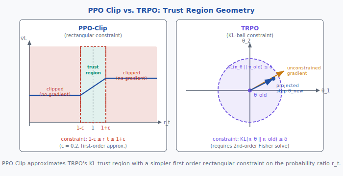

<!-- ============================ TOP NAV ============================ -->
<div align="center">

[🏠 Home](../../README.md) &nbsp;•&nbsp; [📚 Section 4 — Post-training](./README.md) &nbsp;•&nbsp; [⬅️ Q4‑07](./q07-system-user-prompt.md) &nbsp;•&nbsp; [Q4‑09 — DPO ➡️](./q09-dpo-derivation.md)

</div>

---

# Q4‑08 · Derive the PPO objective. What does the clipping ratio prevent?

<div align="center">


</div>

> [!IMPORTANT]
> **The 20-second answer.** PPO (Schulman et al., 2017) replaces the raw policy-gradient objective with a **clipped surrogate**: $L^{\text{CLIP}}(\theta) = \mathbb{E}_t\!\left[\min\!\left(r_t(\theta)\,\hat{A}_t,\; \text{clip}(r_t(\theta), 1{-}\varepsilon, 1{+}\varepsilon)\,\hat{A}_t\right)\right]$ where $r_t(\theta) = \pi_\theta(a_t|s_t)/\pi_{\theta_\text{old}}(a_t|s_t)$ is the **probability ratio** and $\varepsilon = 0.2$. The clip prevents **destructive large updates**: if the new policy has already moved far from the old one ($r_t \gg 1$ or $r_t \ll 1$), the objective flattens and produces zero gradient, stopping further drift. In RLHF, PPO maximizes a reward model signal while a KL penalty term keeps the policy close to the supervised fine-tuned reference model.

---

## Table of contents

1. [First principles: policy gradient and its variance problem](#1--first-principles-policy-gradient-and-its-variance-problem)
2. [The core mechanism: surrogate objective and clipping](#2--the-core-mechanism-surrogate-objective-and-clipping)
3. [Figure 1 — L^CLIP as a function of the probability ratio](#3--figure-1--lclip-as-a-function-of-the-probability-ratio)
4. [Step-by-step derivation of PPO-Clip](#4--step-by-step-derivation-of-ppo-clip)
5. [Figure 2 — PPO-Clip vs. TRPO trust region geometry](#5--figure-2--ppo-clip-vs-trpo-trust-region-geometry)
6. [Algorithm / pseudocode](#6--algorithm--pseudocode)
7. [PyTorch reference implementation](#7--pytorch-reference-implementation)
8. [Worked numerical example](#8--worked-numerical-example)
9. [Interview drill — follow-up questions](#9--interview-drill--follow-up-questions)
10. [Common misconceptions](#10--common-misconceptions)
11. [Connections to other concepts](#11--connections-to-other-concepts)
12. [One-screen summary](#12--one-screen-summary)
13. [Five-minute refresher](#13--five-minute-refresher)
14. [Further reading](#14--further-reading)
15. [Bottom navigation bar](#15--bottom-navigation-bar)

---

## 1 · First principles: policy gradient and its variance problem

### The fundamental RL objective

In reinforcement learning we seek a policy $\pi_\theta$ that maximises expected cumulative reward:

$$J(\theta) = \mathbb{E}_{\tau \sim \pi_\theta}\!\left[\sum_{t=0}^{T} r_t\right]$$

The policy gradient theorem (Williams, 1992) gives the gradient:

$$\nabla_\theta J(\theta) = \mathbb{E}_{\tau \sim \pi_\theta}\!\left[\sum_{t=0}^{T} \nabla_\theta \log \pi_\theta(a_t|s_t)\cdot G_t\right]$$

where $G_t = \sum_{t'=t}^{T} \gamma^{t'-t} r_{t'}$ is the **discounted return from step $t$**.

### REINFORCE and its shortcomings

The REINFORCE estimator samples full trajectories and uses the empirical return:

$$\hat{\nabla}_\theta J = \frac{1}{N}\sum_{n=1}^{N}\sum_{t=0}^{T} \nabla_\theta \log \pi_\theta(a_t^{(n)}|s_t^{(n)}) \cdot G_t^{(n)}$$

**Three fundamental problems:**

| Problem | Cause | Effect |
|---------|-------|--------|
| High variance | $G_t$ averages thousands of future rewards | Noisy gradients, slow convergence |
| Sample inefficiency | On-policy: discard data after each update | Need many environment interactions |
| Destructive updates | Large steps can collapse the policy | Training instability or divergence |

### The variance-reduction fix: advantage function

Instead of raw return $G_t$, use the **advantage** $\hat{A}_t = G_t - V(s_t)$, which measures how much better action $a_t$ is than average. This centres the signal around zero and dramatically reduces variance. Computing advantages requires a **value network** $V_\psi(s_t)$ trained concurrently.

---

## 2 · The core mechanism: surrogate objective and clipping

### From log-probability to probability ratio

Policy gradient uses $\nabla_\theta \log \pi_\theta(a|s)$, which implicitly computes a ratio:

$$\frac{\pi_\theta(a_t|s_t)}{\pi_{\theta_\text{old}}(a_t|s_t)} = r_t(\theta)$$

This is the **importance weight** that corrects for the mismatch between the behaviour policy (which collected data) and the current policy (which we are updating). When $r_t(\theta) = 1$ the two policies agree exactly on action $a_t$.

### The unclipped surrogate (CPI objective)

The Conservative Policy Iteration surrogate is:

$$L^{\text{CPI}}(\theta) = \mathbb{E}_t\!\left[r_t(\theta)\,\hat{A}_t\right]$$

This is a first-order approximation to the true policy objective, valid when $r_t$ is near 1. If we push $r_t$ far from 1 (large update), the approximation breaks down and the true objective may decrease even as the surrogate increases — leading to catastrophic policy degradation.

### PPO-Clip: the clipped surrogate

PPO constrains updates by clipping $r_t$ to the interval $[1{-}\varepsilon,\, 1{+}\varepsilon]$:

$$\boxed{L^{\text{CLIP}}(\theta) = \mathbb{E}_t\!\left[\min\!\left(r_t(\theta)\,\hat{A}_t,\;\text{clip}(r_t(\theta),\, 1{-}\varepsilon,\, 1{+}\varepsilon)\,\hat{A}_t\right)\right]}$$

The $\min$ of the two terms creates a **pessimistic lower bound**:

- **If $\hat{A}_t > 0$** (action was good): we want to increase $\pi_\theta$, raising $r_t$ above 1. But once $r_t > 1{+}\varepsilon$, the clipped term caps at $(1{+}\varepsilon)\hat{A}_t$, and this becomes the minimum — gradient goes to zero.
- **If $\hat{A}_t < 0$** (action was bad): we want to decrease $\pi_\theta$, lowering $r_t$ below 1. Once $r_t < 1{-}\varepsilon$, the clipped term caps at $(1{-}\varepsilon)\hat{A}_t$, and this caps the objective — gradient goes to zero.

**Key insight:** the clip is **asymmetric in effect**. It removes the incentive to move further outside the trust region but does not pull the policy back. This is a soft constraint, not a hard boundary.

### What the clipping ratio prevents

The clipping ratio prevents **policy overshoot** — taking gradient steps so large that the new policy occupies a region far from the data distribution used to estimate advantages. In that out-of-distribution regime, the advantage estimates are unreliable, leading to:

1. **Gradient explosion** — large $r_t$ amplifies already large advantage estimates.
2. **Mode collapse** — the policy concentrates all probability on a single action deemed good under possibly flawed advantages.
3. **Reward hacking** — the policy exploits quirks of the reward model if unconstrained.

The standard choice $\varepsilon = 0.2$ means PPO tolerates up to ±20 % change in action probability before cutting off gradient signal.

### PPO in RLHF: the full objective

In language model RLHF (Ziegler et al., 2019; Stiennon et al., 2020), PPO maximises:

$$J(\theta) = \mathbb{E}_{(x,y)\sim\pi_\theta}\!\left[r_\phi(x, y) - \beta\,\text{KL}\!\left(\pi_\theta(\cdot|x)\,\|\,\pi_{\text{ref}}(\cdot|x)\right)\right]$$

where:
- $r_\phi(x, y)$ is the **reward model** score for response $y$ to prompt $x$
- $\beta$ is the **KL coefficient** (typically $0.01$–$0.2$)
- $\pi_{\text{ref}}$ is the **frozen SFT model** (reference policy)

The KL term $\beta\,\text{KL}(\pi_\theta \| \pi_{\text{ref}})$ serves a parallel role to PPO's clipping: it penalises the model for diverging too far from the SFT reference, preventing reward hacking and preserving language quality. PPO's clipping operates at the token level during the gradient update; the KL operates at the sequence level during rollout scoring.

---

## 3 · Figure 1 — L^CLIP as a function of the probability ratio

<div align="center">

</div>

The figure shows $L^{\text{CLIP}} / |\hat{A}_t|$ versus $r_t(\theta)$ for both signs of advantage. In each case the function is piecewise linear: it rises (or falls) linearly through the trust region $[1{-}\varepsilon, 1{+}\varepsilon]$ and then becomes flat. The flat plateaus produce zero gradient, enforcing the trust region without a Lagrangian solve.

---

## 4 · Step-by-step derivation of PPO-Clip

### Step 1 — Start from the policy gradient objective

The policy gradient update direction is:

$$\nabla_\theta J \approx \mathbb{E}_t\!\left[\nabla_\theta \log \pi_\theta(a_t|s_t)\cdot \hat{A}_t\right]$$

### Step 2 — Rewrite using importance weights

Using the identity $\nabla_\theta \log \pi_\theta = \nabla_\theta \pi_\theta / \pi_\theta$ and a first-order Taylor approximation around $\theta_\text{old}$:

$$L^{\text{CPI}}(\theta) = \mathbb{E}_t\!\left[\frac{\pi_\theta(a_t|s_t)}{\pi_{\theta_\text{old}}(a_t|s_t)}\,\hat{A}_t\right] = \mathbb{E}_t\!\left[r_t(\theta)\,\hat{A}_t\right]$$

This is equivalent to the policy gradient at $\theta = \theta_\text{old}$ (ratio is 1), but allows larger off-policy correction.

### Step 3 — Identify the problem: unconstrained ratio leads to instability

If $r_t(\theta) = 2.0$ and $\hat{A}_t = 5$, the gradient pushes to increase $r_t$ further, even though we are already far from the data distribution. The advantage estimate $\hat{A}_t$ was computed under $\pi_{\theta_\text{old}}$ and may be completely wrong for the new policy.

### Step 4 — TRPO's solution: constrained optimisation

TRPO (Schulman et al., 2015) solves:

$$\max_\theta\; L^{\text{CPI}}(\theta) \quad \text{subject to} \quad \mathbb{E}_t\!\left[\text{KL}(\pi_{\theta_\text{old}}\,\|\,\pi_\theta)\right] \leq \delta$$

This requires computing the **Fisher information matrix** and solving a constrained quadratic program — prohibitively expensive for large neural networks.

### Step 5 — PPO's solution: clip the ratio

PPO replaces the KL constraint with a clip on $r_t$, which is a first-order approximation to the trust region:

$$L^{\text{CLIP}}(\theta) = \mathbb{E}_t\!\left[\min\!\left(r_t(\theta)\,\hat{A}_t,\;\text{clip}(r_t(\theta),\, 1{-}\varepsilon,\, 1{+}\varepsilon)\,\hat{A}_t\right)\right]$$

The gradient of the clipped objective is:

$$\frac{\partial}{\partial\theta} L^{\text{CLIP}} = \begin{cases} \frac{\partial}{\partial\theta}\bigl[r_t(\theta)\,\hat{A}_t\bigr] & \text{if } r_t \in [1{-}\varepsilon,\, 1{+}\varepsilon] \\ 0 & \text{if } r_t > 1{+}\varepsilon \text{ and } \hat{A}_t > 0 \\ 0 & \text{if } r_t < 1{-}\varepsilon \text{ and } \hat{A}_t < 0 \end{cases}$$

### Step 6 — Advantage estimation via GAE

The advantage $\hat{A}_t$ is estimated using **Generalised Advantage Estimation** (Schulman et al., 2015):

$$\hat{A}_t^{\text{GAE}(\gamma, \lambda)} = \sum_{l=0}^{\infty} (\gamma\lambda)^l \,\delta_{t+l}$$

where the TD residual is $\delta_t = r_t + \gamma V_\psi(s_{t+1}) - V_\psi(s_t)$.

- $\gamma \in (0,1)$: **discount factor** (controls future reward horizon)
- $\lambda \in (0,1)$: **GAE parameter** (bias-variance trade-off)
  - $\lambda \to 0$: one-step TD, low variance, high bias
  - $\lambda \to 1$: Monte-Carlo return, low bias, high variance

Typical values: $\gamma = 0.99$, $\lambda = 0.95$.

### Step 7 — Full PPO update

Each PPO iteration:
1. Collect $N$ rollout steps from $\pi_{\theta_\text{old}}$
2. Compute $\hat{A}_t$ for all steps via GAE
3. For $K$ epochs, sample minibatches and minimise:

$$L^{\text{PPO}}(\theta, \psi) = -L^{\text{CLIP}}(\theta) + c_1 L^{\text{VF}}(\psi) - c_2 S[\pi_\theta]$$

where $L^{\text{VF}}(\psi) = \mathbb{E}_t\!\left[\bigl(V_\psi(s_t) - V_t^{\text{target}}\bigr)^2\right]$ and $S[\pi_\theta]$ is an entropy bonus to encourage exploration.

---

## 5 · Figure 2 — PPO-Clip vs. TRPO trust region geometry

<div align="center">

</div>

**Left panel (PPO-Clip):** The trust region is a rectangular box in $r_t$ space — gradient flows only when $r_t \in [1{-}\varepsilon, 1{+}\varepsilon]$. This is a simple first-order constraint requiring no matrix inversion. **Right panel (TRPO):** The trust region is a KL-ball (approximately ellipsoidal) in parameter space. TRPO projects the unconstrained gradient to the boundary of this ball via conjugate gradient on the Fisher information matrix — exact but $O(N^2)$ in parameters.

---

## 6 · Algorithm / pseudocode

```
PPO-Clip Algorithm (Schulman et al., 2017)
==========================================
Input: initial policy π_{θ_0}, value network V_{ψ_0}
       clip ε=0.2, GAE λ=0.95, discount γ=0.99
       epochs K=4, minibatch M, rollout length T

for iteration i = 0, 1, 2, ... do
    # ---- Phase 1: Collect rollouts ----
    Run π_{θ_i} for T steps in environment
    Store (s_t, a_t, r_t, s_{t+1}) for t=0..T-1

    # ---- Phase 2: Compute advantages ----
    Compute δ_t = r_t + γ·V_{ψ}(s_{t+1}) - V_{ψ}(s_t)   for all t
    Compute Â_t = Σ_{l≥0} (γλ)^l · δ_{t+l}               [GAE]
    Normalize Â_t: mean=0, std=1                            [optional]

    # ---- Phase 3: Update policy and value ----
    for epoch k = 1..K do
        for minibatch B sampled from {0..T-1} do
            # Probability ratio
            r_t(θ) = π_θ(a_t|s_t) / π_{θ_i}(a_t|s_t)

            # Clipped surrogate
            L_CLIP = mean[ min( r_t·Â_t,  clip(r_t, 1-ε, 1+ε)·Â_t ) ]

            # Value loss (clipped)
            L_VF  = mean[ (V_ψ(s_t) - V_t^target)^2 ]

            # Entropy bonus
            S     = mean[ H(π_θ(·|s_t)) ]

            # Combined loss (minimise)
            loss  = -L_CLIP + c1·L_VF - c2·S

            gradient step on (θ, ψ) using loss
        end for
    end for

    # Update old policy
    θ_i+1 = θ
end for
```

---

## 7 · PyTorch reference implementation

```python
import torch
import torch.nn.functional as F


def ppo_clip_loss(
    log_probs: torch.Tensor,      # shape (B,): log π_θ(a_t|s_t) under new policy
    log_probs_old: torch.Tensor,  # shape (B,): log π_{θ_old}(a_t|s_t), detached
    advantages: torch.Tensor,     # shape (B,): Â_t, normalised
    clip_eps: float = 0.2,
) -> torch.Tensor:
    """
    PPO clipped surrogate loss (scalar).

    Returns the NEGATIVE of L^CLIP (so you can call .backward() directly
    and minimise, since optimisers minimise by convention).
    """
    # Probability ratio r_t(θ) = π_θ / π_{θ_old}
    # In log space: log r_t = log π_θ - log π_{θ_old}
    log_ratio = log_probs - log_probs_old.detach()
    ratio = log_ratio.exp()                          # shape (B,)

    # Unclipped objective: r_t · Â_t
    unclipped = ratio * advantages

    # Clipped objective: clip(r_t, 1-ε, 1+ε) · Â_t
    ratio_clipped = ratio.clamp(1.0 - clip_eps, 1.0 + clip_eps)
    clipped = ratio_clipped * advantages

    # Pessimistic lower bound
    policy_loss = torch.min(unclipped, clipped).mean()

    return -policy_loss   # negate: we minimise, so minimise -L^CLIP


def gae_advantages(
    rewards: torch.Tensor,   # shape (T,)
    values: torch.Tensor,    # shape (T+1,): V(s_0)..V(s_T)
    gamma: float = 0.99,
    lam: float = 0.95,
) -> torch.Tensor:
    """Generalised Advantage Estimation (GAE)."""
    T = rewards.shape[0]
    advantages = torch.zeros(T)
    gae = 0.0
    for t in reversed(range(T)):
        delta = rewards[t] + gamma * values[t + 1] - values[t]
        gae = delta + gamma * lam * gae
        advantages[t] = gae
    return advantages


# --- Minimal PPO update step ---
def ppo_update_step(
    policy_net,
    value_net,
    optimizer,
    states, actions, log_probs_old, advantages, returns,
    clip_eps=0.2, vf_coef=0.5, ent_coef=0.01,
):
    # New log-probs under current policy
    dist = policy_net(states)          # Categorical or Normal distribution
    log_probs = dist.log_prob(actions)
    entropy = dist.entropy().mean()

    # PPO clip loss
    policy_loss = ppo_clip_loss(log_probs, log_probs_old, advantages, clip_eps)

    # Value function loss
    values = value_net(states).squeeze(-1)
    value_loss = F.mse_loss(values, returns)

    # Total loss
    loss = policy_loss + vf_coef * value_loss - ent_coef * entropy

    optimizer.zero_grad()
    loss.backward()
    torch.nn.utils.clip_grad_norm_(
        list(policy_net.parameters()) + list(value_net.parameters()),
        max_norm=0.5,
    )
    optimizer.step()

    return {
        "policy_loss": policy_loss.item(),
        "value_loss": value_loss.item(),
        "entropy": entropy.item(),
    }
```

**Implementation notes:**
- `log_probs_old` must be `.detach()`ed — otherwise gradients flow back through the reference, breaking the surrogate.
- GAE requires a bootstrap value $V(s_T)$ for the last state; use the value network with `torch.no_grad()`.
- Normalise advantages to mean=0, std=1 per minibatch for stability.
- Gradient clipping (`max_norm=0.5`) is standard in PPO implementations for LLMs.

---

## 8 · Worked numerical example

Consider a single timestep with $\varepsilon = 0.2$.

### Case 1: Clip is active (ratio too large)

$$r_t(\theta) = 1.35, \quad \hat{A}_t = +2.0$$

$$\text{Unclipped} = 1.35 \times 2.0 = 2.70$$

$$\text{clip}(1.35,\; 0.8,\; 1.2) = 1.2 \implies \text{Clipped} = 1.2 \times 2.0 = 2.40$$

$$L^{\text{CLIP}} = \min(2.70,\; 2.40) = \mathbf{2.40} \quad \leftarrow \text{clip is active}$$

The gradient with respect to $\theta$ comes from the clipped branch. The policy cannot gain further objective improvement by increasing $r_t$ beyond 1.2.

### Case 2: Clip is inactive (ratio within trust region)

$$r_t(\theta) = 0.95, \quad \hat{A}_t = +2.0$$

$$\text{Unclipped} = 0.95 \times 2.0 = 1.90$$

$$\text{clip}(0.95,\; 0.8,\; 1.2) = 0.95 \implies \text{Clipped} = 0.95 \times 2.0 = 1.90$$

$$L^{\text{CLIP}} = \min(1.90,\; 1.90) = \mathbf{1.90} \quad \leftarrow \text{clip inactive}$$

Both branches agree; gradient flows normally.

### Case 3: Negative advantage — clip prevents further decrease

$$r_t(\theta) = 0.65, \quad \hat{A}_t = -3.0$$

$$\text{Unclipped} = 0.65 \times (-3.0) = -1.95$$

$$\text{clip}(0.65,\; 0.8,\; 1.2) = 0.80 \implies \text{Clipped} = 0.80 \times (-3.0) = -2.40$$

$$L^{\text{CLIP}} = \min(-1.95,\; -2.40) = \mathbf{-2.40} \quad \leftarrow \text{clip is active}$$

Here the clipped branch is more negative (worse), so it becomes the minimum. The gradient now comes from the clipped branch and prevents further decrease in the action probability — the policy has already moved far enough away from this bad action.

### Summary table

| $r_t$ | $\hat{A}_t$ | Unclipped | Clipped | $L^{\text{CLIP}}$ | Clip active? |
|-------|------------|-----------|---------|-------------------|-------------|
| 1.35  | +2.0       | 2.70      | 2.40    | 2.40              | Yes         |
| 0.95  | +2.0       | 1.90      | 1.90    | 1.90              | No          |
| 0.65  | -3.0       | -1.95     | -2.40   | -2.40             | Yes         |
| 1.05  | -1.5       | -1.575    | -1.575  | -1.575            | No          |

---

## 9 · Interview drill — follow-up questions

**Q1. Why is $r_t$ computed as a ratio of probabilities rather than a difference of log-probabilities?**

The surrogate $L^{\text{CPI}}$ is derived from importance sampling, which requires the likelihood ratio. A log-difference would give $\log r_t$, not $r_t$, and would not produce the correct importance-weighted gradient.

**Q2. PPO is on-policy. Why can we take $K > 1$ gradient steps per rollout?**

With $K$ epochs we are technically reusing data off-policy. The clip $\varepsilon$ bounds how far the policy moves per epoch, keeping the approximation valid. In practice $K = 4$–$10$ epochs with $\varepsilon = 0.2$ is stable. Using many more epochs degrades performance (the old policy diverges too much from the new one).

**Q3. What is the role of the entropy bonus $S[\pi_\theta]$?**

Entropy bonus $-c_2 S$ (added to the minimised loss) prevents premature convergence to a deterministic policy. Without it, the policy can collapse to a single action if the reward is sparse, eliminating exploration.

**Q4. How does the KL penalty in RLHF differ from the PPO clip?**

The PPO clip operates per-token, per-step during gradient updates and prevents large ratio deviations. The KL penalty operates at the **sequence level** in the reward: $r_\phi(x,y) - \beta\,\text{KL}(\pi_\theta \| \pi_{\text{ref}})$. They complement each other: clip for local stability, KL for global proximity to the SFT reference.

**Q5. If $\varepsilon = 0$, what happens?**

$r_t$ is clipped to exactly 1 at all times, so the gradient is identically zero — no learning occurs. $\varepsilon = 0$ is the degenerate case where the trust region collapses to a point.

**Q6. Why do RLHF implementations often use a clipped value loss as well?**

To prevent the value network from changing too rapidly. The value loss clipping mirrors the policy clip: $L^{\text{VF}} = \max\!\left[(V - V^{\text{target}})^2,\, (V_{\text{clip}} - V^{\text{target}})^2\right]$ where $V_{\text{clip}} = V_{\text{old}} + \text{clip}(V - V_{\text{old}}, -\varepsilon, \varepsilon)$.

**Q7. What is the "clip fraction" metric and why do practitioners monitor it?**

Clip fraction = fraction of timesteps where the clip is active. Values above ~0.2 indicate the policy is moving too fast; values near 0 indicate the learning rate or $\varepsilon$ is too small to allow meaningful updates. It is a cheap diagnostic for PPO health.

---

## 10 · Common misconceptions

**Misconception 1: "The clip pulls the policy back inside the trust region."**

The clip does **not** pull the policy back. It only stops the gradient from pushing further outside the region. If the policy has drifted beyond $1{+}\varepsilon$ for some action, the objective flattens — it does not correct the overshoot. Recovery happens indirectly through subsequent rollouts.

**Misconception 2: "PPO is equivalent to TRPO."**

PPO's clip approximates TRPO's KL constraint at first order. The shapes of the trust regions differ (rectangular vs. ellipsoidal), and PPO ignores the curvature of the policy manifold. TRPO has stronger theoretical guarantees (monotonic improvement under its constraint); PPO trades theoretical tightness for computational simplicity.

**Misconception 3: "In RLHF, the KL term makes PPO redundant."**

The KL penalty in the reward function penalises divergence from $\pi_{\text{ref}}$, not from $\pi_{\theta_\text{old}}$. PPO's clip controls the update step size relative to the previous iteration's policy, preventing large gradient steps regardless of how far the current policy has drifted from the SFT reference. Both constraints are necessary.

**Misconception 4: "A larger $\varepsilon$ always trains faster."**

Larger $\varepsilon$ allows larger policy updates per rollout, but this increases the probability of destructive steps and instability. Empirically, $\varepsilon = 0.2$ is a robust default for discrete action spaces; $\varepsilon = 0.1$–$0.2$ for continuous; $\varepsilon = 0.1$ is sometimes used for LLM RLHF where value estimates are especially noisy.

**Misconception 5: "PPO computes the ratio over the full trajectory."**

$r_t(\theta) = \pi_\theta(a_t|s_t) / \pi_{\theta_\text{old}}(a_t|s_t)$ is a **per-token ratio** in LLM settings, not over the full sequence. The full sequence probability ratio would be $\prod_t r_t$, which shrinks exponentially with sequence length — useless in practice.

---

## 11 · Connections to other concepts

**TRPO (§4-08 adjacent):** PPO's direct predecessor. TRPO is exact but expensive ($O(N^2)$ Fisher inverse); PPO replaces it with a cheap clip heuristic that works empirically.

**DPO (Q4-09):** Direct Preference Optimisation eliminates the reward model and PPO entirely, reframing RLHF as a supervised classification on preference pairs. Where PPO requires an online policy + value network + reward model, DPO requires only the policy. The trade-off: DPO assumes the optimal policy corresponds to a closed-form reward; PPO learns the reward explicitly.

**KL Penalty (Q4-04):** The RLHF reward $r_\phi(x,y) - \beta\,\text{KL}(\pi_\theta\|\pi_{\text{ref}})$ is the key connection. The KL prevents reward hacking at the sequence level; PPO's clip prevents it at the update level.

**Reward Model (Q4-03):** PPO requires a trained reward model $r_\phi$ to score completions. The quality of PPO training is bounded by reward model quality — if $r_\phi$ overfits to human preferences, the policy will exploit its blind spots (reward hacking).

**On-policy vs. Off-policy (Q4-05):** PPO is on-policy — it discards rollouts after $K$ epochs. This is expensive (requires generating new text for each update), motivating offline methods like DPO or online variants like online DPO and RAFT.

**SFT (Q4-01):** The SFT model provides $\pi_{\text{ref}}$ and is the starting checkpoint for PPO fine-tuning. A higher-quality SFT model leads to a better RLHF policy, because the KL penalty tethers the PPO policy to the SFT model's distribution.

**Gradient clipping vs. PPO clipping:** Standard gradient norm clipping (`clip_grad_norm_`) operates on the gradient vector in parameter space. PPO clipping operates on the probability ratio in action space. Both address instability but at different levels of abstraction.

---

## 12 · One-screen summary

| Concept | Formula / Value |
|---------|----------------|
| Probability ratio | $r_t(\theta) = \pi_\theta(a_t|s_t) / \pi_{\theta_\text{old}}(a_t|s_t)$ |
| PPO-Clip objective | $L^{\text{CLIP}} = \mathbb{E}_t[\min(r_t\hat{A}_t,\;\text{clip}(r_t,1{-}\varepsilon,1{+}\varepsilon)\hat{A}_t)]$ |
| Standard $\varepsilon$ | 0.2 |
| Clip prevents | Policy overshoot: gradient zeroed when $r_t$ exits $[1{-}\varepsilon, 1{+}\varepsilon]$ |
| vs. TRPO | TRPO uses KL-ball constraint; PPO approximates it with a rectangle |
| RLHF objective | $J(\theta) = \mathbb{E}[r_\phi(x,y) - \beta\,\text{KL}(\pi_\theta\|\pi_\text{ref})]$ |
| Typical $\beta$ | 0.01–0.2 |
| Advantage estimator | GAE: $\hat{A}_t = \sum_{l\geq0}(\gamma\lambda)^l\delta_{t+l}$ |
| GAE parameters | $\gamma=0.99$, $\lambda=0.95$ |
| Epochs per rollout | 4–10 (trade off off-policy error vs. sample efficiency) |
| Clip fraction | Fraction of steps where clip is active; monitor ~0.1–0.2 |

**The clipping ratio prevents destructive updates** by making the surrogate objective flat (zero gradient) whenever the new policy has already moved more than $\varepsilon$ relative probability mass away from the old policy, in whichever direction the advantage signal was pushing.

---

## 13 · Five-minute refresher

1. **REINFORCE** uses full-trajectory returns — high variance, destructive large updates.
2. **Advantage** $\hat{A}_t = G_t - V(s_t)$ reduces variance; computed via GAE with value network.
3. **Probability ratio** $r_t(\theta) = \pi_\theta / \pi_{\theta_\text{old}}$ rewrites the gradient as an importance-weighted objective $L^{\text{CPI}} = \mathbb{E}[r_t\hat{A}_t]$.
4. **Problem:** unconstrained $r_t$ can grow large, making advantage estimates unreliable.
5. **PPO-Clip** constrains updates: $L^{\text{CLIP}} = \mathbb{E}[\min(r_t\hat{A}_t, \text{clip}(r_t,1{-}\varepsilon,1{+}\varepsilon)\hat{A}_t)]$.
6. **Mechanics:** when $\hat{A}>0$ and $r_t>1+\varepsilon$, the clipped term is smaller $\Rightarrow$ it becomes the min $\Rightarrow$ gradient is zero. Mirror logic for $\hat{A}<0$ and $r_t<1-\varepsilon$.
7. **RLHF version** adds $-\beta\,\text{KL}(\pi_\theta\|\pi_\text{ref})$ to the reward to prevent reward hacking and preserve language quality.
8. **vs. TRPO:** TRPO uses an exact KL-ball constraint (expensive Fisher solve); PPO approximates it with a cheap ratio clip.
9. **Clip fraction** (~0.1–0.2) is the key diagnostic metric for PPO health.

---

## 14 · Further reading

1. **Schulman, J., Wolski, F., Dhariwal, P., Radford, A., & Klimov, O. (2017).** *Proximal Policy Optimization Algorithms.* arXiv:1707.06347. — Original PPO paper; Section 3 derives the clipped surrogate directly.

2. **Schulman, J., Levine, S., Abbeel, P., Jordan, M., & Moritz, P. (2015).** *Trust Region Policy Optimization.* ICML 2015. — TRPO precursor; motivates the trust region concept PPO approximates.

3. **Schulman, J., Moritz, P., Levine, S., Jordan, M., & Abbeel, P. (2015).** *High-Dimensional Continuous Control Using Generalized Advantage Estimation.* arXiv:1506.02438. — Derives GAE; essential companion to PPO for understanding advantage estimation.

4. **Ziegler, D. M., Stiennon, N., Wu, J., Brown, T. B., Radford, A., Amodei, D., Christiano, P., & Irving, G. (2019).** *Fine-Tuning Language Models from Human Feedback.* arXiv:1909.08593. — First application of PPO to language model RLHF.

5. **Stiennon, N., Ouyang, L., Wu, J., Ziegler, D. M., Lowe, R., Voss, C., Radford, A., Amodei, D., & Christiano, P. F. (2020).** *Learning to summarize from human feedback.* NeurIPS 2020. — Demonstrates PPO-RLHF at scale on summarisation.

6. **Ouyang, L., Wu, J., Jiang, X., Almeida, D., Wainwright, C. L., Mishkin, P., ... & Lowe, R. (2022).** *Training language models to follow instructions with human feedback.* arXiv:2203.02155. — InstructGPT; canonical PPO-RLHF recipe for instruction-following LLMs.

---

## 15 · Bottom navigation bar

<!-- ============================ BOTTOM NAV ============================ -->
<div align="center">

[🏠 Home](../../README.md) &nbsp;•&nbsp; [📚 Section 4 — Post-training](./README.md) &nbsp;•&nbsp; [⬅️ Q4‑07](./q07-system-user-prompt.md) &nbsp;•&nbsp; [Q4‑09 — DPO ➡️](./q09-dpo-derivation.md)

</div>
