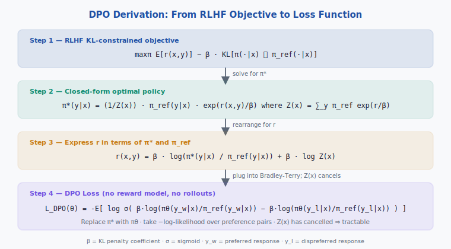
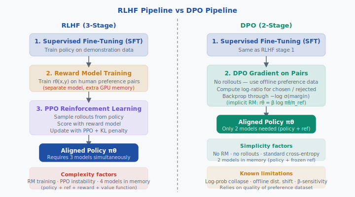

<div align="center">

[🏠 Home](../../README.md) &nbsp;•&nbsp; [📚 Section 4 — Post-training](./README.md) &nbsp;•&nbsp; [⬅️ Q4‑08](./q08-ppo-objective.md) &nbsp;•&nbsp; [Q4‑10 — DPO Variants ➡️](./q10-dpo-variants.md)

</div>

---

# Q4‑09 · Direct Preference Optimization (DPO): Derivation and Why It Eliminates the Reward Model


---

> [!IMPORTANT]
> **DPO rewrites the RLHF objective so the reward model disappears algebraically.**
> Starting from the KL-constrained RL problem, one shows the optimal policy has the
> closed form $\pi^*(y|x) \propto \pi_\text{ref}(y|x)\,e^{r(x,y)/\beta}$.
> Inverting this to express $r$ in terms of $\pi^*$ and substituting into the
> Bradley-Terry preference model causes the intractable partition function $Z(x)$
> to cancel exactly, yielding a simple cross-entropy loss over preferred/dispreferred
> pairs — no reward model, no PPO rollouts, no extra model in memory.

---

## Table of Contents

1. [First principles](#1--first-principles)
2. [The core mechanism](#2--the-core-mechanism)
3. [Figure 1 — derivation flow](#3--figure-1--dpo-derivation-flow)
4. [Step-by-step worked example](#4--step-by-step-worked-example)
5. [Figure 2 — RLHF vs DPO pipeline](#5--figure-2--rlhf-vs-dpo-pipeline)
6. [Algorithm / pseudocode](#6--algorithm--pseudocode)
7. [PyTorch reference implementation](#7--pytorch-reference-implementation)
8. [Worked numerical example](#8--worked-numerical-example)
9. [Interview drill — follow-up questions](#9--interview-drill--follow-up-questions)
10. [Common misconceptions](#10--common-misconceptions)
11. [Connections to other concepts](#11--connections-to-other-concepts)
12. [One-screen summary](#12--one-screen-summary)
13. [Five-minute refresher](#13--five-minute-refresher)
14. [Further reading](#14--further-reading)
15. [Bottom navigation bar](#15--bottom-navigation-bar)

---

## 1 · First principles

### Why alignment requires preferences, not demonstrations alone

Supervised fine-tuning (SFT) teaches a model *what to say* given example
demonstrations. It cannot encode relative quality — that response A is safer,
more helpful, or more honest than response B. Human preference data encodes
exactly this relative judgment, making preference learning the natural next
step after SFT.

### The Bradley-Terry preference model

Given two responses $y_w$ (preferred, "winner") and $y_l$ (dispreferred,
"loser") to prompt $x$, the Bradley-Terry model assumes:

$$p^*(y_w \succ y_l \mid x) = \sigma\!\left(r^*(x, y_w) - r^*(x, y_l)\right)$$

where $r^*(x, y)$ is a latent scalar reward and $\sigma$ is the logistic
sigmoid. The cross-entropy loss for training a parametric reward model
$r_\phi$ on a dataset $\mathcal{D}$ of labeled pairs is:

$$\mathcal{L}_\text{RM}(\phi) = -\mathbb{E}_{(x,y_w,y_l)\sim\mathcal{D}}
\left[\log \sigma\!\left(r_\phi(x,y_w) - r_\phi(x,y_l)\right)\right]$$

### The RLHF objective

With a trained reward $r$, RLHF fine-tunes a policy $\pi_\theta$ via:

$$\max_{\pi}\; \mathbb{E}_{x\sim\mathcal{D},\, y\sim\pi(\cdot|x)}
\!\left[r(x,y)\right] - \beta\,\mathrm{KL}\!\left[\pi(\cdot|x)\,\|\,\pi_\text{ref}(\cdot|x)\right]$$

The KL penalty prevents the policy from drifting too far from the
reference (typically the SFT model), avoiding reward hacking.

---

## 2 · The core mechanism

### Step 1 — solve the KL-constrained objective in closed form

The objective above is a convex functional over probability distributions. Setting
the functional derivative to zero yields the optimal policy:

$$\boxed{\pi^*(y \mid x) = \frac{1}{Z(x)}\,\pi_\text{ref}(y \mid x)\,\exp\!\left(\frac{r(x,y)}{\beta}\right)}$$

where the partition function normalises the distribution:

$$Z(x) = \sum_y \pi_\text{ref}(y \mid x)\,\exp\!\left(\frac{r(x,y)}{\beta}\right)$$

This is the Boltzmann (Gibbs) distribution with energy $-r(x,y)/\beta$.

### Step 2 — invert to express $r$ in terms of $\pi^*$

Taking $\log$ of both sides of the optimal-policy equation:

$$\log \pi^*(y \mid x) = \log \pi_\text{ref}(y \mid x) + \frac{r(x,y)}{\beta} - \log Z(x)$$

Rearranging:

$$r(x,y) = \beta\,\log\frac{\pi^*(y \mid x)}{\pi_\text{ref}(y \mid x)} + \beta\,\log Z(x)$$

### Step 3 — substitute into Bradley-Terry

$$p^*(y_w \succ y_l \mid x) = \sigma\!\left(r(x,y_w) - r(x,y_l)\right)$$

Substituting the expression for $r$:

$$p^*(y_w \succ y_l \mid x) = \sigma\!\left(
\beta\,\log\frac{\pi^*(y_w|x)}{\pi_\text{ref}(y_w|x)} + \cancel{\beta\log Z(x)}
- \beta\,\log\frac{\pi^*(y_l|x)}{\pi_\text{ref}(y_l|x)} - \cancel{\beta\log Z(x)}
\right)$$

The $Z(x)$ terms are **identical in both** and cancel exactly:

$$\boxed{p^*(y_w \succ y_l \mid x)
= \sigma\!\left(\beta\,\log\frac{\pi^*(y_w|x)}{\pi_\text{ref}(y_w|x)}
- \beta\,\log\frac{\pi^*(y_l|x)}{\pi_\text{ref}(y_l|x)}\right)}$$

### Step 4 — the DPO loss

Replace the unknown $\pi^*$ with the learnable policy $\pi_\theta$ and take the
negative log-likelihood over observed preference pairs:

$$\boxed{\mathcal{L}_\text{DPO}(\theta) =
-\mathbb{E}_{(x,y_w,y_l)\sim\mathcal{D}}
\left[\log\sigma\!\left(
\beta\log\frac{\pi_\theta(y_w|x)}{\pi_\text{ref}(y_w|x)}
- \beta\log\frac{\pi_\theta(y_l|x)}{\pi_\text{ref}(y_l|x)}
\right)\right]}$$

This is **pure language-model cross-entropy** on pairs.
No reward model, no rollouts, no value function, no PPO.

### Why $Z(x)$ cancels — and why that matters

$Z(x)$ is a sum over *all* possible continuations of prompt $x$ — an
intractable integral over the output space. Its cancellation is what makes
the DPO objective tractable without sampling.
In contrast, the reward-model-plus-PPO pipeline must estimate $Z(x)$ implicitly
through repeated sampling (rollouts), contributing most of RLHF's computational
cost and instability.

### The implicit reward interpretation

Rearranging Step 2 with $\pi_\theta$ in place of $\pi^*$, the policy itself
defines an implicit reward:

$$r_\theta(x,y) = \beta\,\log\frac{\pi_\theta(y|x)}{\pi_\text{ref}(y|x)}$$

Training the policy IS simultaneously training this implicit reward.
DPO collapses the two-stage RLHF procedure into one.

---

## 3 · Figure 1 — DPO Derivation Flow

<div align="center">

</div>

**Reading the figure.**
Each box corresponds to one algebraic step.
Step 1 is the starting RLHF objective. Step 2 solves it in closed form via
the Gibbs distribution. Step 3 inverts that solution to express $r$ as a
log-ratio plus a $\log Z$ offset. Step 4 inserts this into the Bradley-Terry
model; the two $\log Z(x)$ terms (one from $y_w$, one from $y_l$) are equal
and cancel, leaving the DPO loss that depends only on computable log-probabilities.

---

## 4 · Step-by-step worked example

### Setup

Consider a single preference triple $(x, y_w, y_l)$ with:

| Quantity | Value |
|---|---|
| $\pi_\text{ref}(y_w \mid x)$ | 0.40 |
| $\pi_\text{ref}(y_l \mid x)$ | 0.30 |
| $\pi_\theta(y_w \mid x)$ | 0.55 |
| $\pi_\theta(y_l \mid x)$ | 0.20 |
| $\beta$ | 0.5 |

### Compute log-probabilities

$$\log\pi_\text{ref}(y_w|x) = \ln 0.40 = -0.916$$

$$\log\pi_\text{ref}(y_l|x) = \ln 0.30 = -1.204$$

$$\log\pi_\theta(y_w|x) = \ln 0.55 = -0.598$$

$$\log\pi_\theta(y_l|x) = \ln 0.20 = -1.609$$

### Compute log-ratios

$$\log\frac{\pi_\theta(y_w|x)}{\pi_\text{ref}(y_w|x)} = -0.598 - (-0.916) = +0.318$$

$$\log\frac{\pi_\theta(y_l|x)}{\pi_\text{ref}(y_l|x)} = -1.609 - (-1.204) = -0.405$$

### Compute the margin

$$\Delta = \beta\!\left(0.318 - (-0.405)\right) = 0.5 \times 0.723 = 0.3615 \approx 0.362$$

### Compute the loss

$$\mathcal{L}_\text{DPO} = -\log\sigma(0.362) = -\log(0.5895) = 0.528$$

**Interpretation.** The policy has already shifted in the right direction:
it raised the probability of $y_w$ (0.40 → 0.55) and lowered $y_l$
(0.30 → 0.20). The positive margin (0.362) means the model correctly
ranks the preferred response higher, so the loss is below $\log 2 = 0.693$
(the loss when the model is indifferent). Further training will push the
margin larger, reducing the loss further.

---

## 5 · Figure 2 — RLHF vs DPO Pipeline

<div align="center">

</div>

**Reading the figure.**
Left column: the classical RLHF pipeline — three distinct training stages,
four models held in GPU memory simultaneously (policy, reference, reward,
value function), and online rollout generation. Right column: DPO —
the reward-model training stage is eliminated entirely; preferences are
consumed directly; only the policy and a frozen reference live in memory.

---

## 6 · Algorithm / pseudocode

```
Algorithm: DPO Training

Input:  Reference model π_ref (frozen SFT checkpoint)
        Policy π_θ (initialised from SFT checkpoint)
        Preference dataset D = {(x_i, y_w_i, y_l_i)}
        Hyperparameters: β, learning rate η, batch size B

For each minibatch of B triples from D:
  1. Forward pass (no grad) through π_ref:
       lp_ref_w = log π_ref(y_w | x)   # sum of token log-probs
       lp_ref_l = log π_ref(y_l | x)

  2. Forward pass through π_θ:
       lp_θ_w   = log π_θ(y_w | x)
       lp_θ_l   = log π_θ(y_l | x)

  3. Compute log-ratios:
       ratio_w  = lp_θ_w - lp_ref_w
       ratio_l  = lp_θ_l - lp_ref_l

  4. Compute margin:
       margin   = β * (ratio_w - ratio_l)

  5. DPO loss:
       loss     = -mean( log σ(margin) )

  6. Backprop and update θ via optimizer

Output: Aligned policy π_θ
```

**Gradient of the DPO loss.** Let $h = \beta(\Delta_w - \Delta_l)$ where
$\Delta_w = \log(\pi_\theta(y_w)/\pi_\text{ref}(y_w))$.
The gradient with respect to $\theta$ is:

$$\nabla_\theta \mathcal{L}_\text{DPO} = -\beta\,\sigma(-h)
\left[\nabla_\theta\log\pi_\theta(y_w|x) - \nabla_\theta\log\pi_\theta(y_l|x)\right]$$

The weight $\sigma(-h)$ is large (gradient is strong) when the model gets
the pair wrong ($h < 0$) and small when it already ranks them correctly
— an implicit curriculum.

---

## 7 · PyTorch reference implementation

```python
import torch
import torch.nn.functional as F
from typing import Tuple


def dpo_loss(
    policy_logps_chosen: torch.Tensor,    # (B,)  log π_θ(y_w|x)
    policy_logps_rejected: torch.Tensor,  # (B,)  log π_θ(y_l|x)
    ref_logps_chosen: torch.Tensor,       # (B,)  log π_ref(y_w|x)
    ref_logps_rejected: torch.Tensor,     # (B,)  log π_ref(y_l|x)
    beta: float = 0.5,
) -> Tuple[torch.Tensor, torch.Tensor, torch.Tensor]:
    """
    Direct Preference Optimization loss (Rafailov et al., 2023).

    All logps are *sequence-level* log-probabilities, i.e. the sum of
    per-token log-probs over the response tokens only (not the prompt).

    Returns
    -------
    loss        : scalar, the DPO loss
    chosen_rewards   : (B,) implicit reward for chosen responses
    rejected_rewards : (B,) implicit reward for rejected responses
    """
    # Log-ratio: how much more (or less) likely the policy is vs reference
    log_ratio_chosen   = policy_logps_chosen   - ref_logps_chosen    # (B,)
    log_ratio_rejected = policy_logps_rejected - ref_logps_rejected  # (B,)

    # Margin: scaled difference of log-ratios
    margin = beta * (log_ratio_chosen - log_ratio_rejected)           # (B,)

    # DPO loss: negative log-sigmoid of the margin
    loss = -F.logsigmoid(margin).mean()

    # Implicit rewards (detached — for logging / diagnostics)
    chosen_rewards   = beta * log_ratio_chosen.detach()
    rejected_rewards = beta * log_ratio_rejected.detach()

    return loss, chosen_rewards, rejected_rewards


# ── Helper: compute sequence log-prob from a model and token ids ──────────

def sequence_logprob(
    model,
    input_ids: torch.Tensor,       # (B, L)  prompt + response tokens
    response_mask: torch.Tensor,   # (B, L)  1 for response tokens, 0 for prompt
) -> torch.Tensor:
    """Return sum of log-probs over response tokens only."""
    with torch.no_grad():
        logits = model(input_ids).logits          # (B, L, V)
    # Shift: predict token t+1 from token t
    shift_logits = logits[:, :-1, :]              # (B, L-1, V)
    shift_labels = input_ids[:, 1:]               # (B, L-1)
    shift_mask   = response_mask[:, 1:]           # (B, L-1)
    log_probs = F.log_softmax(shift_logits, dim=-1)
    token_lp  = log_probs.gather(
        dim=-1,
        index=shift_labels.unsqueeze(-1)
    ).squeeze(-1)                                  # (B, L-1)
    return (token_lp * shift_mask).sum(dim=-1)     # (B,)


# ── Minimal training step ─────────────────────────────────────────────────

def dpo_train_step(policy, ref_model, batch, beta=0.5, optimizer=None):
    """Single DPO gradient step.  ref_model must be frozen."""
    # Compute reference log-probs (no grad)
    with torch.no_grad():
        ref_lp_chosen   = sequence_logprob(ref_model, batch["chosen_ids"],   batch["chosen_mask"])
        ref_lp_rejected = sequence_logprob(ref_model, batch["rejected_ids"], batch["rejected_mask"])

    # Compute policy log-probs (with grad)
    pol_lp_chosen   = sequence_logprob(policy, batch["chosen_ids"],   batch["chosen_mask"])
    pol_lp_rejected = sequence_logprob(policy, batch["rejected_ids"], batch["rejected_mask"])

    loss, chosen_r, rejected_r = dpo_loss(
        pol_lp_chosen, pol_lp_rejected,
        ref_lp_chosen, ref_lp_rejected,
        beta=beta,
    )

    if optimizer is not None:
        optimizer.zero_grad()
        loss.backward()
        optimizer.step()

    return {
        "loss": loss.item(),
        "reward_margin": (chosen_r - rejected_r).mean().item(),
        "reward_accuracy": (chosen_r > rejected_r).float().mean().item(),
    }
```

**Key implementation notes:**

- Log-probs must be **sequence-level** (summed over response tokens).
  Sequence length differences bias the loss if you do not normalise; some
  implementations average over tokens instead, which has a different effect
  on long vs short responses.
- The reference model should be the **exact same checkpoint** used to
  initialise the policy (typically the SFT model), kept frozen.
- Use `F.logsigmoid` rather than `torch.log(torch.sigmoid(...))` for
  numerical stability.
- Monitor `reward_accuracy` (fraction of pairs where chosen reward > rejected):
  a healthy run quickly exceeds 0.70 and continues rising.

---

## 8 · Worked numerical example

Verified in Python (see numeric checks above):

| Step | Calculation | Value |
|---|---|---|
| $\log\pi_\text{ref}(y_w\|x)$ | $\ln 0.40$ | $-0.9163$ |
| $\log\pi_\text{ref}(y_l\|x)$ | $\ln 0.30$ | $-1.2040$ |
| $\log\pi_\theta(y_w\|x)$ | $\ln 0.55$ | $-0.5978$ |
| $\log\pi_\theta(y_l\|x)$ | $\ln 0.20$ | $-1.6094$ |
| $\Delta_w = \log\pi_\theta(y_w)/\pi_\text{ref}(y_w)$ | $-0.5978-(-0.9163)$ | $+0.3185$ |
| $\Delta_l = \log\pi_\theta(y_l)/\pi_\text{ref}(y_l)$ | $-1.6094-(-1.2040)$ | $-0.4055$ |
| margin $= \beta(\Delta_w - \Delta_l)$ | $0.5\times 0.7240$ | $0.3620$ |
| $\sigma(\text{margin})$ | $1/(1+e^{-0.362})$ | $0.5895$ |
| $\mathcal{L}_\text{DPO}$ | $-\ln 0.5895$ | $\mathbf{0.528}$ |

**Boundary cases.**

- If $\pi_\theta = \pi_\text{ref}$ (no fine-tuning yet): both log-ratios are 0,
  margin = 0, $\sigma(0) = 0.5$, loss = $\ln 2 \approx 0.693$.
- Perfect separation ($\Delta_w \gg 0$, $\Delta_l \ll 0$): margin $\to \infty$,
  $\sigma \to 1$, loss $\to 0$.
- Reversed ranking ($\Delta_w < \Delta_l$): margin $< 0$, loss $> \ln 2$ — the
  model is penalised for preferring the worse response.

---

## 9 · Interview drill — follow-up questions

1. **Why does $Z(x)$ cancel?** Because it appears with identical sign in the
   reward expressions for both $y_w$ and $y_l$, so the difference eliminates it.

2. **What happens if $\beta \to 0$?**
   The policy becomes unconstrained ($Z(x)$ diverges); the KL penalty vanishes
   and the policy can collapse to deterministic reward-maximising behaviour.
   Practically DPO margins grow without bound and log-prob collapse worsens.

3. **What happens if $\beta \to \infty$?**
   The policy stays pinned to $\pi_\text{ref}$; the KL term dominates and no
   alignment is learned.

4. **Is DPO on-policy or off-policy?**
   Off-policy — preference pairs were collected under some *other* policy
   (e.g., the SFT model or a previous version). Unlike PPO, DPO never samples
   from $\pi_\theta$ during training.

5. **What is log-prob collapse and why does it happen?**
   Both chosen and rejected log-probs tend to decrease during DPO training.
   The model pushes down $\pi_\theta(y_l)$ but often simultaneously pushes down
   $\pi_\theta(y_w)$ faster than expected. Monitoring absolute log-probs
   (not just the ratio) is essential.

6. **If you have an explicit reward model, why might you prefer RLHF over DPO?**
   PPO allows online data collection under the current policy, which helps with
   distribution shift. DPO's offline nature can hurt when the reference model
   is very far from the data-generating distribution.

7. **How do you extract the implicit reward after DPO training?**
   $r_\theta(x,y) = \beta\log\!\left(\pi_\theta(y|x)/\pi_\text{ref}(y|x)\right)$,
   computable from two forward passes.

8. **Can DPO handle non-binary preferences (e.g., ratings 1–5)?**
   Not directly. Extensions such as KTO (Ethayarajh et al., 2024) and
   IPO (Azar et al., 2023) relax the Bradley-Terry assumption.

---

## 10 · Common misconceptions

**"DPO has no reward model at all."**
Partially true. There is no *explicit* separate reward model, but
$r_\theta(x,y) = \beta\log\pi_\theta/\pi_\text{ref}$ is an *implicit* reward.
DPO trains the policy and the implicit reward jointly.

**"DPO avoids the KL penalty."**
No — the derivation starts from the KL-penalised RLHF objective. DPO merely
reparameterises it so the KL term is absorbed into the log-ratio.
The penalty strength $\beta$ plays exactly the same role in DPO as in RLHF.

**"DPO is always cheaper than RLHF."**
DPO avoids rollout generation and the reward-model forward pass during training,
which is cheaper. However, it requires large high-quality preference datasets
and can be brittle to $\beta$ tuning. For domains where online data collection
is feasible, RLHF with PPO can outperform DPO in final policy quality.

**"The partition function $Z(x)$ is approximated."**
No — it cancels *exactly*. This is the mathematical elegance of DPO; no
approximation of $Z(x)$ is required.

**"You can use any reference model."**
In practice, the reference must be the SFT model that generated (or was close
to) the preference data. A mismatched reference breaks the distributional
assumptions and causes distribution shift artefacts.

---

## 11 · Connections to other concepts

| Concept | Connection |
|---|---|
| **KL divergence** | $\beta$-scaled KL to $\pi_\text{ref}$ is the regulariser that makes the closed-form solution possible and that $\beta$ controls in DPO |
| **Bradley-Terry model** | The preference probability model whose log-likelihood DPO maximises |
| **Gibbs/Boltzmann distribution** | $\pi^*(y|x) \propto \pi_\text{ref}\exp(r/\beta)$ is exactly a Gibbs distribution with temperature $\beta$ |
| **PPO / RLHF** | DPO is mathematically equivalent to the RLHF objective solved offline; PPO implements the same objective online via rollouts |
| **SFT (supervised fine-tuning)** | Precondition for DPO — the reference model must already be instruction-following |
| **Contrastive learning** | DPO loss structure (push up chosen, push down rejected) resembles contrastive objectives; the log-ratio plays the role of a similarity score |
| **IPO / KTO / SimPO** | Variants that replace Bradley-Terry with other preference models or eliminate the reference model |
| **Log-likelihood calibration** | DPO's log-prob collapse is related to the known issue of LLM log-prob miscalibration after fine-tuning |

---

## 12 · One-screen summary

```
RLHF objective:   max_π E[r(x,y)] - β·KL[π || π_ref]

Closed-form π*:   π*(y|x) = π_ref(y|x)·exp(r(x,y)/β) / Z(x)

Invert for r:     r(x,y)  = β·log(π*(y|x)/π_ref(y|x)) + β·log Z(x)

Bradley-Terry:    p*(y_w > y_l|x) = σ(r(x,y_w) - r(x,y_l))
                                   → Z(x) terms cancel

DPO loss:         L = -E[ log σ( β·log(π_θ(y_w|x)/π_ref(y_w|x))
                                - β·log(π_θ(y_l|x)/π_ref(y_l|x)) ) ]

Implicit reward:  r_θ(x,y) = β·log(π_θ(y|x)/π_ref(y|x))

Why no RM needed: reward is absorbed into the policy log-ratio; Z(x) cancels

Key hyperparameter: β (0.05–0.5 typical)
Main failure modes: log-prob collapse · offline dist. shift · β-sensitivity
```

---

## 13 · Five-minute refresher

**The problem.** RLHF aligns a language model to human preferences but requires
three training stages: SFT, reward-model training, and PPO fine-tuning.
The PPO stage is computationally expensive, requires four models in GPU memory,
and is notoriously unstable.

**The insight.** The KL-penalised RLHF problem has a known closed-form solution:
$\pi^* \propto \pi_\text{ref}\,e^{r/\beta}$.
Inverting this gives $r = \beta\log(\pi^*/\pi_\text{ref}) + \beta\log Z$.
Plugging into the Bradley-Terry model, the $\log Z$ terms cancel because they
are equal for both responses in the pair.

**The result.** A cross-entropy loss over preference pairs that depends only on
log-probs of the policy and reference model — computable from two forward passes.
No reward model training, no rollout generation, no value function.

**What $\beta$ does.** Small $\beta$ allows large KL deviations (strong alignment
but risk of reward hacking / log-prob collapse). Large $\beta$ keeps the policy
close to the reference (stable but less alignment).

**When to prefer RLHF.** When online data collection is feasible, when the
preference dataset is small, or when the distribution gap between reference
and optimal policy is large.

---

## 14 · Further reading

1. **Rafailov, R., Sharma, A., Mitchell, E., Manning, C. D., Ermon, S., & Finn, C.** (2023).
   *Direct Preference Optimization: Your Language Model is Secretly a Reward Model.*
   NeurIPS 2023. [arXiv:2305.18290](https://arxiv.org/abs/2305.18290)

2. **Ziegler, D. M., Stiennon, N., Wu, J., Brown, T. B., Radford, A., Amodei, D., Christiano, P., & Irving, G.** (2019).
   *Fine-Tuning Language Models from Human Preferences.*
   [arXiv:1909.08593](https://arxiv.org/abs/1909.08593)

3. **Ouyang, L., Wu, J., Jiang, X., Almeida, D., Wainwright, C. L., Mishkin, P., ... & Lowe, R.** (2022).
   *Training language models to follow instructions with human feedback.*
   NeurIPS 2022. [arXiv:2203.02155](https://arxiv.org/abs/2203.02155)

4. **Bradley, R. A., & Terry, M. E.** (1952).
   *Rank Analysis of Incomplete Block Designs: I. The Method of Paired Comparisons.*
   Biometrika, 39(3/4), 324–345.

5. **Azar, M. G., Rowland, M., Piot, B., Guo, D., Calandriello, D., Valko, M., & Munos, R.** (2023).
   *A General Theoretical Paradigm to Understand Learning from Human Feedback.*
   (IPO) [arXiv:2310.12036](https://arxiv.org/abs/2310.12036)

6. **Ethayarajh, K., Xu, W., Muennighoff, N., Jurafsky, D., & Kiela, D.** (2024).
   *KTO: Model Alignment as Prospect Theoretic Optimization.*
   ICML 2024. [arXiv:2402.01306](https://arxiv.org/abs/2402.01306)

---

## 15 · Bottom navigation bar

<div align="center">

[🏠 Home](../../README.md) &nbsp;•&nbsp; [📚 Section 4 — Post-training](./README.md) &nbsp;•&nbsp; [⬅️ Q4‑08](./q08-ppo-objective.md) &nbsp;•&nbsp; [Q4‑10 — DPO Variants ➡️](./q10-dpo-variants.md)

</div>
