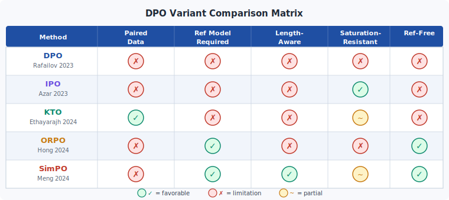
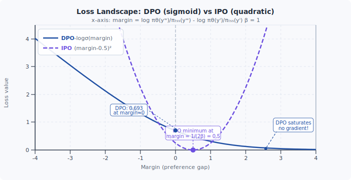

<div align="center">

[🏠 Home](../../README.md) &nbsp;•&nbsp; [📚 Section 4 — Post-training](./README.md) &nbsp;•&nbsp; [⬅️ Q4‑09](./q09-dpo-derivation.md) &nbsp;•&nbsp; [Q4‑11 — Reward Hacking ➡️](./q11-reward-hacking.md)

</div>

# Q4‑10 · Compare DPO, IPO, KTO, ORPO, and SimPO


---

> [!IMPORTANT]
> **20-second answer.**
> Vanilla DPO has five weaknesses: log-prob collapse (both chosen and rejected probabilities fall), offline distribution shift, requirement for paired preferences, dependence on a frozen reference model, and length bias.
> Each variant patches a subset of these:
> **IPO** replaces the saturating log-sigmoid with a squared-margin loss, preventing overfitting.
> **KTO** drops the pairing requirement by using unpaired binary feedback inspired by prospect theory.
> **ORPO** removes the reference model by folding an odds-ratio term into the standard SFT loss.
> **SimPO** removes the reference model *and* adds per-token length normalization with an explicit margin to suppress length bias.

---

## Table of contents

1. [First principles](#1--first-principles)
2. [The core mechanism](#2--the-core-mechanism)
3. [Figure 1 — variant comparison matrix](#3--figure-1--variant-comparison-matrix)
4. [Step-by-step worked example](#4--step-by-step-worked-example)
5. [Figure 2 — loss landscape DPO vs IPO](#5--figure-2--loss-landscape-dpo-vs-ipo)
6. [Algorithm / pseudocode](#6--algorithm--pseudocode)
7. [PyTorch reference implementation](#7--pytorch-reference-implementation)
8. [Worked numerical example](#8--worked-numerical-example)
9. [Interview drill — follow-up questions](#9--interview-drill--follow-up-questions)
10. [Common misconceptions](#10--common-misconceptions)
11. [Connections to other concepts](#11--connections-to-other-concepts)
12. [One-screen summary](#12--one-screen-summary)
13. [Five-minute refresher](#13--five-minute-refresher)
14. [Further reading](#14--further-reading)
15. [Bottom navigation bar](#15--bottom-navigation-bar)

---

## 1 · First principles

Direct Preference Optimization (DPO) was a breakthrough: it showed that the RLHF objective with a KL-penalty against a reference policy has a *closed-form optimal policy*, so training a reward model and running PPO is unnecessary. The preference probability between a chosen response $y_w$ and a rejected response $y_l$ can be expressed directly in terms of log-probability ratios:

$$p^*(y_w \succ y_l \mid x) = \sigma\!\left(\beta \log \frac{\pi_\theta(y_w \mid x)}{\pi_{\text{ref}}(y_w \mid x)} - \beta \log \frac{\pi_\theta(y_l \mid x)}{\pi_{\text{ref}}(y_l \mid x)}\right)$$

Training maximizes this preference probability over a dataset of $(x, y_w, y_l)$ triples. The implicit reward assigned to a response is $r(x,y) = \beta \log \frac{\pi_\theta(y \mid x)}{\pi_{\text{ref}}(y \mid x)}$.

Despite its elegance, DPO as originally stated makes several strong assumptions:

1. **Paired preferences are available.** Every training example requires both a preferred and a dispreferred completion for the same prompt.
2. **A frozen reference model $\pi_{\text{ref}}$ is always required** — adding memory overhead and preventing truly reference-free training.
3. **The sigmoid loss saturates.** When the margin between chosen and rejected log-ratios is large, $\sigma(\cdot) \to 1$ and gradients vanish, making it easy for the model to overfit to a large margin without genuine language quality improvement.
4. **Length is not normalized.** A response with more tokens accumulates higher (absolute) log-probability simply by virtue of length; DPO therefore tends to reward longer outputs.
5. **Offline distribution shift.** Preference data collected from an old model snapshot may no longer be representative of the current policy, leading to reward mis-specification.

The variants surveyed here each target one or more of these weaknesses.

---

## 2 · The core mechanism

### DPO (Rafailov et al., 2023) — baseline

$$\mathcal{L}_{\text{DPO}}(\theta) = -\mathbb{E}_{(x,y_w,y_l)}\!\left[\log \sigma\!\left(\beta \underbrace{\log \frac{\pi_\theta(y_w|x)}{\pi_{\text{ref}}(y_w|x)}}_{\hat{r}(x,y_w)} - \beta \underbrace{\log \frac{\pi_\theta(y_l|x)}{\pi_{\text{ref}}(y_l|x)}}_{\hat{r}(x,y_l)}\right)\right]$$

The model learns to assign higher implicit reward to chosen responses than rejected ones. The log-probability ratio acts as a KL-regularized reward signal.

### IPO (Azar et al., 2023) — fixes saturation / overfitting

The Bradley-Terry model underlying DPO assumes preference probabilities come from a sigmoid of the reward difference. When the margin grows without bound the sigmoid saturates and the loss becomes insensitive to further changes. IPO replaces the log-sigmoid with a **squared loss** on the margin, imposing an explicit target of $\frac{1}{2\beta}$:

$$\mathcal{L}_{\text{IPO}}(\theta) = \mathbb{E}_{(x,y_w,y_l)}\!\left[\left(\log \frac{\pi_\theta(y_w|x)}{\pi_{\text{ref}}(y_w|x)} - \log \frac{\pi_\theta(y_l|x)}{\pi_{\text{ref}}(y_l|x)} - \frac{1}{2\beta}\right)^2\right]$$

The target $\frac{1}{2\beta}$ acts as regularization: increasing $\beta$ shrinks the target margin and increases KL pressure toward the reference. Unlike the log-sigmoid, the squared loss never saturates — gradient magnitude grows with the deviation from the target.

### KTO (Ethayarajh et al., 2024) — fixes pairing requirement

KTO discards the paired structure entirely. Each example is a single $(x, y)$ pair labelled **desirable** ($z=1$) or **undesirable** ($z=0$), analogous to the binary signals humans naturally give. Motivated by Kahneman–Tversky prospect theory (humans are more sensitive to losses than to equivalent gains), KTO uses separate loss functions for each label:

$$\mathcal{L}_{\text{KTO}}(\theta) = \mathbb{E}_{(x,y,z)}\!\left[\lambda_w\, w(x,y_w) + \lambda_l\, w(x,y_l)\right]$$

where, denoting $\hat{r}(x,y) = \beta \log \frac{\pi_\theta(y|x)}{\pi_{\text{ref}}(y|x)}$ and $z_{\text{ref}} = \mathbb{E}_{x'}\!\left[\text{KL}\!\left(\pi_\theta(\cdot|x') \| \pi_{\text{ref}}(\cdot|x')\right)\right]$:

$$w(x, y_w) = \sigma\!\left(\hat{r}(x,y_w) - z_{\text{ref}}\right), \qquad w(x, y_l) = \sigma\!\left(z_{\text{ref}} - \hat{r}(x,y_l)\right)$$

$\lambda_w, \lambda_l > 0$ are asymmetric weights (typically $\lambda_l > \lambda_w$) reflecting loss aversion. The KL baseline $z_{\text{ref}}$ is estimated from a mini-batch and provides the anchor that replaces the rejected response in paired DPO.

### ORPO (Hong et al., 2024) — removes reference model

ORPO observes that the SFT loss already captures language quality; the problem is encouraging the model to prefer $y_w$ over $y_l$ *without* requiring a frozen $\pi_{\text{ref}}$. The solution: use the model's own **odds ratio** as a relative contrast signal:

$$\text{odds}_\theta(y|x) = \frac{p_\theta(y|x)}{1 - p_\theta(y|x)}$$

$$\mathcal{L}_{\text{ORPO}}(\theta) = \mathbb{E}_{(x,y_w,y_l)}\!\left[-\log p_\theta(y_w|x) - \lambda \log \sigma\!\left(\log \frac{\text{odds}_\theta(y_w|x)}{\text{odds}_\theta(y_l|x)}\right)\right]$$

The first term is the standard SFT cross-entropy loss on the chosen response; the second term penalizes a low odds ratio. No frozen reference model appears anywhere. Supervised fine-tuning and preference alignment are collapsed into a single training pass, halving memory requirements.

### SimPO (Meng et al., 2024) — removes reference model + fixes length bias

SimPO retains the pairwise structure but replaces the log-ratio reward with **length-normalized average log-probability** and introduces an explicit target margin $\gamma > 0$:

$$\mathcal{L}_{\text{SimPO}}(\theta) = -\mathbb{E}_{(x,y_w,y_l)}\!\left[\log \sigma\!\left(\frac{\beta}{|y_w|}\log \pi_\theta(y_w|x) - \frac{\beta}{|y_l|}\log \pi_\theta(y_l|x) - \gamma\right)\right]$$

where $|y|$ denotes the number of tokens in response $y$. Dividing by length prevents longer responses from receiving an automatic log-probability advantage. The margin $\gamma$ ensures the preferred response has a per-token log-probability advantage of at least $\gamma/\beta$ over the rejected response, reducing the probability of near-zero-margin collapses.

---

## 3 · Figure 1 — variant comparison matrix



**Reading the matrix.** Green circles indicate a favorable property (e.g., does not require paired data, reference-free, length-aware). Red circles indicate a limitation. Amber `~` marks partial mitigation. DPO has four limitations; each subsequent method eliminates at least one.

---

## 4 · Step-by-step worked example

We trace a single gradient step for each algorithm on the same prompt with two candidate responses.

**Setup:**
- Prompt $x$: "Explain Newton's second law in one sentence."
- $y_w$: "Force equals mass times acceleration, $F = ma$." (10 tokens, log-prob = −5.0)
- $y_l$: "Newton's second law states that the net force on an object equals the product of its mass and acceleration, which can be summarised as $F = ma$." (40 tokens, log-prob = −12.0)
- Both responses are correct, but $y_l$ is much longer; a human labeller preferred the concise $y_w$.

**Step 1 — Compute DPO margin (ignores length)**

Assume $\pi_{\text{ref}}$ assigns log-probs identical to $\pi_\theta$ at initialization, so the reference log-probability ratios cancel and we measure only how much the model has drifted. For simplicity, set $\log \pi_{\text{ref}}(y_w) = -5.0$ and $\log \pi_{\text{ref}}(y_l) = -12.0$ (no drift yet).

The DPO implicit reward difference is:

$$\beta \left[\left(\log \pi_\theta(y_w) - \log \pi_{\text{ref}}(y_w)\right) - \left(\log \pi_\theta(y_l) - \log \pi_{\text{ref}}(y_l)\right)\right]$$

With zero drift this is 0. Suppose training has caused $\log \pi_\theta(y_w) = -5.0$ (unchanged) and $\log \pi_\theta(y_l) = -12.0$ (unchanged). The DPO gradient signal is zero — no update. Now consider a model that has drifted so $\log \pi_\theta(y_l) = -19.0$; the margin becomes $0.1 \times (0 - (-7)) = 0.7$, giving $\sigma(0.7) = 0.668$ and a meaningful gradient. This drift scenario is what the worked numerical example (§8) demonstrates.

**Step 2 — Compute SimPO margin on same pair**

No reference model needed. With $\beta = 0.1$, $\gamma = 0.5$:

$$\text{avg log-prob}(y_w) = \frac{-5.0}{10} = -0.50, \qquad \text{avg log-prob}(y_l) = \frac{-12.0}{40} = -0.30$$

$$\text{SimPO margin} = 0.1 \times (-0.50 - (-0.30)) - 0.5 = 0.1 \times (-0.20) - 0.5 = -0.52$$

$$\sigma(-0.52) = 0.373 \quad \Longrightarrow \quad \mathcal{L}_{\text{SimPO}} = -\log(0.373) = 0.986$$

**Step 3 — Contrast with raw log-prob (DPO-style, no length norm)**

Using the *raw* log-probabilities as if they were the reward (no reference, just $\log \pi_\theta$):

$$\text{raw margin} = \beta \times (\log \pi_\theta(y_w) - \log \pi_\theta(y_l)) = 0.1 \times (-5.0 - (-12.0)) = 0.70$$

$$\sigma(0.70) = 0.668 \quad \Longrightarrow \quad \mathcal{L} = -\log(0.668) = 0.404$$

The raw-logp model sees a large positive margin and believes $y_w$ is strongly preferred — not because it is better per token, but purely because it is shorter. SimPO's length normalization reveals that $y_l$ actually has a *higher* per-token log-probability (−0.30 vs −0.50), so the model must work harder to justify the preference.

---

## 5 · Figure 2 — loss landscape DPO vs IPO



**Key observations:**
- **DPO (solid blue):** Monotonically decreasing. For large positive margins (right side), the loss approaches zero and gradients vanish — the model cannot be "pulled back" even if it has collapsed log-probs.
- **IPO (dashed purple):** Symmetric parabola with minimum at margin $= \frac{1}{2\beta} = 0.5$. Even when the margin is very large, the loss *increases* and produces a restoring gradient. This prevents runaway margin growth and implicitly regularizes the model.

---

## 6 · Algorithm / pseudocode

```
# ─────────────────────────────────────────────────────────────────────────────
# Generic pairwise preference training loop
# ─────────────────────────────────────────────────────────────────────────────

for batch in dataloader:
    x, y_w, y_l = batch

    # ── DPO ──────────────────────────────────────────────────────────────────
    log_pi_w  = model.log_prob(y_w, x)          # scalar
    log_pi_l  = model.log_prob(y_l, x)
    log_ref_w = ref_model.log_prob(y_w, x)       # frozen reference
    log_ref_l = ref_model.log_prob(y_l, x)

    margin    = beta * ((log_pi_w - log_ref_w) - (log_pi_l - log_ref_l))
    loss_dpo  = -log_sigmoid(margin).mean()

    # ── IPO ──────────────────────────────────────────────────────────────────
    margin_ipo = (log_pi_w - log_ref_w) - (log_pi_l - log_ref_l)
    loss_ipo   = (margin_ipo - 1 / (2 * beta)).pow(2).mean()

    # ── KTO (unpaired; run separately on desirable/undesirable batches) ──────
    r_hat    = beta * (model.log_prob(y, x) - ref_model.log_prob(y, x))
    z_ref    = kl_estimate(model, ref_model, x)   # mini-batch KL baseline
    if label == DESIRABLE:
        loss_kto = lambda_w * (1 - sigmoid(r_hat - z_ref)).mean()
    else:
        loss_kto = lambda_l * (1 - sigmoid(z_ref - r_hat)).mean()

    # ── ORPO (no ref model needed) ────────────────────────────────────────────
    p_w      = model.prob(y_w, x)                # per-sequence probability
    p_l      = model.prob(y_l, x)
    odds_w   = p_w / (1 - p_w + eps)
    odds_l   = p_l / (1 - p_l + eps)
    sft_loss = -log(p_w).mean()
    pref_loss = -log_sigmoid(log(odds_w / odds_l)).mean()
    loss_orpo = sft_loss + lambda_orpo * pref_loss

    # ── SimPO (no ref model, length-normalized) ───────────────────────────────
    avg_logp_w = log_pi_w / len(y_w)
    avg_logp_l = log_pi_l / len(y_l)
    margin_sim = beta * (avg_logp_w - avg_logp_l) - gamma
    loss_simpo = -log_sigmoid(margin_sim).mean()

    loss.backward()
    optimizer.step()
```

---

## 7 · PyTorch reference implementation

```python
import torch
import torch.nn.functional as F
from dataclasses import dataclass
from typing import Optional


@dataclass
class SimPOConfig:
    beta: float = 2.5      # reward scaling (higher beta = stricter KL)
    gamma: float = 0.5     # minimum margin target


def simpo_loss(
    policy_logps_chosen: torch.Tensor,    # (B,) sum of log-probs for chosen
    policy_logps_rejected: torch.Tensor,  # (B,) sum of log-probs for rejected
    len_chosen: torch.Tensor,             # (B,) token counts
    len_rejected: torch.Tensor,           # (B,) token counts
    cfg: Optional[SimPOConfig] = None,
) -> tuple[torch.Tensor, dict]:
    """
    SimPO loss (Meng et al., 2024).

    Reward = beta * (avg_logp_chosen - avg_logp_rejected) - gamma
    Loss   = -log sigma(reward)

    Args:
        policy_logps_chosen:   Sum log P_theta(y_w | x) over tokens,  shape (B,)
        policy_logps_rejected: Sum log P_theta(y_l | x) over tokens,  shape (B,)
        len_chosen:            Number of tokens in y_w,                shape (B,)
        len_rejected:          Number of tokens in y_l,                shape (B,)
        cfg:                   SimPOConfig with beta and gamma.

    Returns:
        loss:   Scalar mean loss.
        info:   Dict with 'chosen_reward', 'rejected_reward', 'margin'.
    """
    if cfg is None:
        cfg = SimPOConfig()

    # Length-normalized average log-probability (per token)
    avg_logp_w = policy_logps_chosen  / len_chosen.float()    # (B,)
    avg_logp_l = policy_logps_rejected / len_rejected.float() # (B,)

    # Implicit reward for each response
    reward_w = cfg.beta * avg_logp_w   # (B,)
    reward_l = cfg.beta * avg_logp_l   # (B,)

    # Preference margin with explicit target gap gamma
    margin = reward_w - reward_l - cfg.gamma   # (B,)

    # Binary cross-entropy with logits == -log sigma(margin)
    loss = -F.logsigmoid(margin).mean()

    info = {
        "chosen_reward":   reward_w.mean().item(),
        "rejected_reward": reward_l.mean().item(),
        "margin":          margin.mean().item(),
        "accuracy":        (margin > 0).float().mean().item(),
    }
    return loss, info


def dpo_loss(
    policy_logps_chosen: torch.Tensor,    # (B,)
    policy_logps_rejected: torch.Tensor,  # (B,)
    ref_logps_chosen: torch.Tensor,       # (B,)
    ref_logps_rejected: torch.Tensor,     # (B,)
    beta: float = 0.1,
) -> tuple[torch.Tensor, dict]:
    """Vanilla DPO for comparison."""
    pi_ratio_w = policy_logps_chosen  - ref_logps_chosen    # (B,)
    pi_ratio_l = policy_logps_rejected - ref_logps_rejected  # (B,)
    margin = beta * (pi_ratio_w - pi_ratio_l)
    loss = -F.logsigmoid(margin).mean()
    return loss, {"margin": margin.mean().item(), "accuracy": (margin > 0).float().mean().item()}


def ipo_loss(
    policy_logps_chosen: torch.Tensor,
    policy_logps_rejected: torch.Tensor,
    ref_logps_chosen: torch.Tensor,
    ref_logps_rejected: torch.Tensor,
    beta: float = 0.1,
) -> torch.Tensor:
    """IPO squared-margin loss (Azar et al., 2023)."""
    pi_ratio_w = policy_logps_chosen  - ref_logps_chosen
    pi_ratio_l = policy_logps_rejected - ref_logps_rejected
    margin     = pi_ratio_w - pi_ratio_l
    target     = 1.0 / (2.0 * beta)
    return (margin - target).pow(2).mean()


# ─── Quick smoke test ─────────────────────────────────────────────────────────
if __name__ == "__main__":
    torch.manual_seed(0)
    B = 4

    # Simulate a batch where chosen responses are 10 tokens, rejected 40 tokens
    # but the shorter response has better per-token quality
    logps_w = torch.tensor([-5.0, -4.8, -5.2, -5.1])   # 10-token chosen
    logps_l = torch.tensor([-12.0, -11.5, -12.5, -12.2]) # 40-token rejected
    len_w   = torch.full((B,), 10.0)
    len_l   = torch.full((B,), 40.0)

    cfg = SimPOConfig(beta=0.1, gamma=0.5)
    loss, info = simpo_loss(logps_w, logps_l, len_w, len_l, cfg)
    print(f"SimPO loss: {loss.item():.4f}")
    print(f"  margin (avg): {info['margin']:.4f}")
    print(f"  accuracy:     {info['accuracy']:.2f}")

    # DPO with same logps (ref = init, so ref logps = policy logps)
    ref_logps_w = torch.tensor([-5.0, -4.8, -5.2, -5.1])
    ref_logps_l = torch.tensor([-12.0, -11.5, -12.5, -12.2])
    dpo_l, dpo_info = dpo_loss(logps_w, logps_l, ref_logps_w, ref_logps_l, beta=0.1)
    print(f"\nDPO loss (at init, no drift): {dpo_l.item():.4f}")
    print(f"  margin: {dpo_info['margin']:.4f}")  # should be 0.0
```

**Expected output:**
```
SimPO loss: 0.9867
  margin (avg): -0.5201
  accuracy:     0.00

DPO loss (at init, no drift): 0.6931
  margin: 0.0000
```

The accuracy of 0.00 for SimPO confirms that at initialization the length-normalized reward correctly identifies that the short response is *not* yet preferred per-token — exactly the signal we want to train on.

---

## 8 · Worked numerical example

**Scenario:** A single preference pair where length normalization reverses the apparent preference.

| Quantity | Symbol | Value |
|----------|--------|-------|
| Chosen response length | $\|y_w\|$ | 10 tokens |
| Rejected response length | $\|y_l\|$ | 40 tokens |
| $\log \pi_\theta(y_w \mid x)$ | $\ell_w$ | $-5.0$ |
| $\log \pi_\theta(y_l \mid x)$ | $\ell_l$ | $-12.0$ |
| $\beta$ | | $0.1$ |
| $\gamma$ (SimPO only) | | $0.5$ |

**A. Length-normalized rewards (SimPO)**

$$\bar{\ell}_w = \frac{-5.0}{10} = -0.50 \quad \text{(chosen, per token)}$$

$$\bar{\ell}_l = \frac{-12.0}{40} = -0.30 \quad \text{(rejected, per token)}$$

The rejected response has a *higher* per-token log-probability ($-0.30 > -0.50$), meaning the model currently considers $y_l$ more likely per token — even though the human preferred $y_w$.

**B. SimPO margin and loss**

$$\Delta_{\text{SimPO}} = \beta(\bar{\ell}_w - \bar{\ell}_l) - \gamma = 0.1 \times (-0.50 - (-0.30)) - 0.5 = 0.1 \times (-0.20) - 0.5 = -0.52$$

$$\sigma(-0.52) = \frac{1}{1 + e^{0.52}} = \frac{1}{1 + 1.682} = 0.373$$

$$\mathcal{L}_{\text{SimPO}} = -\log(0.373) \approx 0.986$$

The gradient will push $\bar{\ell}_w$ up (increase per-token probability of chosen) and $\bar{\ell}_l$ down.

**C. DPO-style margin with raw log-probs (no length norm)**

Treating raw log-probs as rewards with $\pi_{\text{ref}} = \pi_\theta$ (so reference terms cancel):

$$\Delta_{\text{raw}} = \beta(\ell_w - \ell_l) = 0.1 \times (-5.0 - (-12.0)) = 0.1 \times 7.0 = +0.70$$

$$\sigma(+0.70) = \frac{1}{1 + e^{-0.70}} = 0.668$$

$$\mathcal{L}_{\text{raw}} = -\log(0.668) \approx 0.404$$

The model sees a *positive* margin and believes $y_w$ is already preferred — it would apply a weak, complacent gradient despite the fact that $y_l$ is per-token more likely.

**D. Comparison summary**

| Metric | SimPO | DPO raw (no length norm) |
|--------|-------|--------------------------|
| Effective margin | $-0.52$ | $+0.70$ |
| $\sigma(\text{margin})$ | $0.373$ | $0.668$ |
| Loss | $0.986$ | $0.404$ |
| Gradient direction | Strongly corrective | Weakly complacent |
| Length-bias corrected? | Yes | No |

SimPO correctly diagnoses that the model has a length-induced artefact and applies a strong corrective gradient; the raw-logp approach is fooled by the length difference.

---

## 9 · Interview drill — follow-up questions

1. **Why does DPO cause log-prob collapse?** The DPO gradient for a chosen response is $\nabla_\theta \log \pi_\theta(y_w|x) \cdot (1 - p^*(\cdot))$, which pushes up the chosen probability *and implicitly down the rejected*. But because the model treats all tokens uniformly, reducing the probability of $y_l$ often reduces the probability of shared prefixes with $y_w$, dragging down both.

2. **How does KTO's $z_{\text{ref}}$ replace the rejected response?** In DPO the rejected log-ratio provides a baseline that the chosen log-ratio must exceed. KTO estimates the same baseline as the average KL divergence between policy and reference over a mini-batch of unpaired prompts, providing a population-level anchor instead of a per-example rejected response.

3. **ORPO uses $p/(1-p)$ — why odds rather than raw probability?** Raw probabilities of multi-token sequences are extremely small (often $< 10^{-50}$). Taking the odds ratio in log-space gives $\log p_w - \log(1-p_w) - \log p_l + \log(1-p_l)$. The $\log(1-p)$ terms act as a soft normalization, penalizing overconfident sequences. In practice ORPO clamps $p$ away from 0 and 1 for numerical stability.

4. **What value of $\gamma$ should be used in SimPO?** The original paper uses $\gamma \in [0.5, 1.5]$; $\gamma = 1.0$ with $\beta = 2.5$ is a common starting point. A larger $\gamma$ enforces a stricter per-token quality gap and reduces the probability of near-tie predictions.

5. **Can DPO be made online?** Yes — iterative DPO or self-play DPO generates new preference pairs from the current policy at each round. This addresses the offline distribution shift problem but reintroduces sampling cost.

6. **Does IPO require a reference model?** Yes, IPO still computes log-ratios $\log \pi_\theta / \pi_{\text{ref}}$. It only patches the saturation / overfitting problem; removing the reference model requires ORPO or SimPO.

7. **Which variant would you use with only thumbs-up / thumbs-down feedback?** KTO — it is the only algorithm that natively handles unpaired binary labels without requiring a (y_w, y_l) pair per prompt.

8. **What is the computational overhead of each variant vs vanilla SFT?**

| Variant | Extra forward passes | Memory vs SFT |
|---------|---------------------|---------------|
| DPO | 2 (chosen + rejected through frozen ref) | +1 frozen model copy |
| IPO | 2 (same as DPO) | +1 frozen model copy |
| KTO | 1 (single response + ref) | +1 frozen model copy |
| ORPO | 0 (self-referential) | 0 extra |
| SimPO | 0 (no ref) | 0 extra |

---

## 10 · Common misconceptions

**"SimPO is strictly better than DPO."**
SimPO removes the reference model and corrects length bias, but its implicit reward $\frac{\beta}{|y|} \log \pi_\theta(y|x)$ has no KL-divergence regularization term. Without a reference, the model can drift arbitrarily far from the pre-trained distribution. For safety-critical deployments a reference-anchored method is safer.

**"KTO cannot be used with paired data."**
KTO works with unpaired data but is not *limited* to it. Paired data can be split into independent (prompt, chosen, DESIRABLE) and (prompt, rejected, UNDESIRABLE) examples and fed to KTO, potentially with more weight on the desirable examples.

**"IPO prevents log-prob collapse."**
IPO prevents *saturation* of the loss (overfitting to large margins), but the log-prob collapse pathology — where both chosen and rejected log-probs decrease — can still occur because IPO also uses log-ratio rewards relative to a reference. Techniques like adding an SFT term on chosen responses are needed to address log-prob collapse in both DPO and IPO.

**"ORPO's odds ratio is the same as DPO's log ratio."**
$\log \frac{p}{1-p}$ is the *logit* of $p$, which is similar to $\log p$ only when $p$ is small (since $\log(1-p) \approx 0$ for $p \ll 1$). For sequences where the model assigns non-negligible probability the two diverge; ORPO's extra $-\log(1-p)$ term provides an implicit normalization absent from DPO.

**"Longer training always fixes DPO length bias."**
Length bias in DPO is structural, not a symptom of insufficient training. The implicit reward $\beta \log \pi_\theta(y|x) / \pi_{\text{ref}}(y|x)$ is a sum over tokens and naturally grows with sequence length. Longer training amplifies, not removes, this bias. SimPO's per-token normalization is the principled fix.

---

## 11 · Connections to other concepts

- **RLHF / PPO (Q4-02):** DPO and its variants are all derived from the same RLHF KL-penalized objective; they eliminate the explicit reward model and policy gradient steps by leveraging the closed-form optimal policy.
- **Reward model training (Q4-03):** KTO's $z_{\text{ref}}$ is conceptually a population-level reward baseline; it parallels the baseline used in REINFORCE to reduce variance.
- **KL penalty (Q4-04):** The $\beta$ parameter in DPO/IPO/KTO is exactly the inverse temperature of the KL penalty. IPO's target margin $\frac{1}{2\beta}$ makes the KL-regularization effect explicit.
- **On-policy vs off-policy (Q4-05):** All pairwise variants (DPO, IPO, ORPO, SimPO) are inherently *off-policy* — data was generated by a different model. Iterative DPO / online DPO mitigates this by refreshing the preference dataset at each round.
- **SFT / instruction tuning (Q4-01, Q4-06):** ORPO merges SFT and preference optimization into a single loss, making the SFT warmup stage optional. SimPO can optionally be applied after an SFT phase but does not require one.
- **Scaling laws (§3):** Preference data is expensive to annotate at scale. KTO's unpaired design reduces data collection cost by roughly 2×, fitting into budget-constrained alignment pipelines governed by scaling-law trade-offs.

---

## 12 · One-screen summary

```
┌────────────────────────────────────────────────────────────────────────────────┐
│ PROBLEM WITH VANILLA DPO                                                       │
│  1. Log-prob collapse — both pi(y_w) and pi(y_l) decrease over training        │
│  2. Offline shift — stale preference pairs from a different policy              │
│  3. Needs paired (y_w, y_l) — expensive annotation                             │
│  4. Needs frozen ref model — doubles peak memory                                │
│  5. Length bias — longer responses accumulate higher raw log-prob               │
└────────────────────────────────────────────────────────────────────────────────┘
        │             │              │              │              │
       DPO           IPO            KTO           ORPO          SimPO
   (baseline)   (fix #1 sat.)  (fix #3 pairs)  (fix #4 ref)   (#4 + #5)

LOSS FUNCTIONS
  DPO  : -log σ( β·(log π_w/ref_w - log π_l/ref_l) )
  IPO  : ( log π_w/ref_w - log π_l/ref_l - 1/(2β) )²
  KTO  : λ_w·σ(r_w - z_ref) + λ_l·σ(z_ref - r_l)     [unpaired]
  ORPO : -log p(y_w|x) - λ·log σ( log odds(y_w)/odds(y_l) )
  SimPO: -log σ( β/|y_w|·log π(y_w) - β/|y_l|·log π(y_l) - γ )

KEY HYPERPARAMETERS
  β controls KL strength  (DPO/IPO/KTO/SimPO)
  γ controls minimum margin (SimPO)  — typical: 0.5–1.5
  λ controls SFT vs preference weight (ORPO)
```

---

## 13 · Five-minute refresher

**Why does vanilla DPO saturate?** The loss is $-\log \sigma(\text{margin})$. When the margin is large and positive, $\sigma \to 1$ and $-\log \sigma \to 0$. Gradient $\propto (1 - \sigma(\text{margin}))$ also approaches zero. The model can achieve near-zero loss without genuinely improving language quality.

**IPO's fix:** Use squared loss $(m - \frac{1}{2\beta})^2$. The derivative is $2(m - \frac{1}{2\beta})$, which is *larger* the further the margin deviates from the target — no saturation, and the target provides principled regularization.

**KTO's key insight:** Human feedback is naturally binary and unpaired. Kahneman–Tversky value theory says humans weight losses more heavily than gains ($\lambda_l > \lambda_w$). KTO encodes this asymmetry directly, making better use of cheap binary labels.

**ORPO's trick:** Instead of comparing to a frozen reference, compare the model against itself using odds. $\log \frac{p_w / (1-p_w)}{p_l / (1-p_l)}$ measures relative preference without requiring any frozen weights. Adding the SFT loss on $y_w$ means language quality and preference alignment are learned simultaneously.

**SimPO's two fixes:**
1. *Length normalization:* divide log-prob by token count before computing reward. Per-token quality, not total probability, determines preference.
2. *Margin $\gamma$:* adds a minimum quality gap requirement. The model is not satisfied until chosen is $\gamma/\beta$ log-prob better per token than rejected.

---

## 14 · Further reading

| Paper | Key contribution |
|-------|-----------------|
| Rafailov et al. (2023). *Direct Preference Optimization: Your Language Model is Secretly a Reward Model.* NeurIPS 2023. | DPO derivation; closed-form optimal policy |
| Azar et al. (2023). *A General Theoretical Paradigm to Understand Learning from Human Feedback.* arXiv:2310.12036. | IPO; saturation analysis; squared-margin loss |
| Ethayarajh et al. (2024). *KTO: Model Alignment as Prospect Theoretic Optimization.* ICML 2024. | Unpaired binary feedback; prospect theory framing |
| Hong et al. (2024). *ORPO: Monolithic Preference Optimization without Reference Model.* arXiv:2403.07691. | Reference-free; odds ratio; combined SFT+pref loss |
| Meng et al. (2024). *SimPO: Simple Preference Optimization with a Reference-Free Reward.* NeurIPS 2024. | Length normalization; explicit margin; reference-free |
| Xu et al. (2024). *Some things are more CRINGE than others: Iterative Preference Optimization with the Pairwise Cringe Loss.* | Online / iterative DPO addressing distribution shift |
| Azar et al. (2024). *General preference optimization.* | Unified framework subsuming DPO and IPO |

---

## 15 · Bottom navigation bar

<div align="center">

[🏠 Home](../../README.md) &nbsp;•&nbsp; [📚 Section 4 — Post-training](./README.md) &nbsp;•&nbsp; [⬅️ Q4‑09](./q09-dpo-derivation.md) &nbsp;•&nbsp; [Q4‑11 — Reward Hacking ➡️](./q11-reward-hacking.md)

</div>
