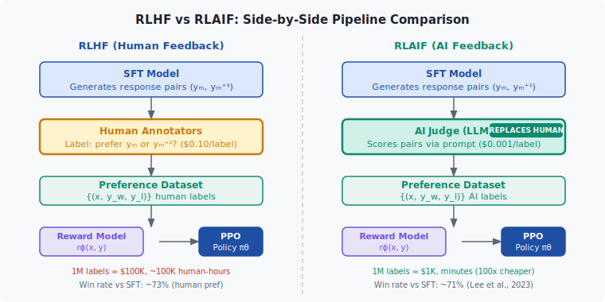
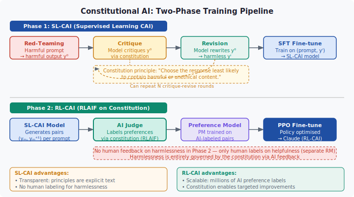

<!-- ============================ TOP NAV ============================ -->
<div align="center">

[🏠 Home](../../README.md) &nbsp;•&nbsp; [📚 Section 4 — Post-training](./README.md) &nbsp;•&nbsp; [⬅️ Q4‑11](./q11-reward-hacking.md) &nbsp;•&nbsp; [Q4‑13 — Reference Model ➡️](./q13-reference-model.md)

</div>

---

# Q4‑12 · Explain RLAIF and Constitutional AI. When does AI feedback substitute reliably for human feedback?

<div align="center">


</div>

> [!IMPORTANT]
> **The 20-second answer.** **RLAIF** (Reinforcement Learning from AI Feedback, Lee et al. 2023) replaces human annotators with an LLM judge to generate preference labels, cutting annotation cost by ~100x while achieving win rates against SFT comparable to full RLHF (71% vs 73% on summarization). **Constitutional AI** (Bai et al. 2022, Anthropic) extends RLAIF with an explicit *constitution* — a list of natural-language principles. It proceeds in two phases: (1) **SL-CAI** — red-team the model, have it *critique and revise* its own harmful outputs guided by the constitution, then supervised fine-tune on the revisions; (2) **RL-CAI** — use an AI judge to label preference pairs according to the constitution (RLAIF), train a Preference Model, then PPO. Human feedback on *harmlessness* is eliminated entirely; the constitution substitutes for it. AI feedback is most reliable for objective tasks (factual accuracy, code correctness, safety/harm filtering with explicit rules) and least reliable for subjective quality (humor, creativity) or specialized expertise (medical, legal).

---

## Table of contents

1. [First principles: the annotation bottleneck](#1--first-principles-the-annotation-bottleneck)
2. [RLAIF — the core mechanism](#2--rlaif--the-core-mechanism)
3. [Figure 1 — RLHF vs RLAIF pipeline](#3--figure-1--rlhf-vs-rlaif-pipeline)
4. [Constitutional AI — step-by-step](#4--constitutional-ai--step-by-step)
5. [Figure 2 — CAI critique-revise loop and RL-CAI](#5--figure-2--cai-critique-revise-loop-and-rl-cai)
6. [Algorithm / pseudocode](#6--algorithm--pseudocode)
7. [PyTorch reference implementation](#7--pytorch-reference-implementation)
8. [Worked numerical example](#8--worked-numerical-example)
9. [Interview drill — follow-up questions](#9--interview-drill--follow-up-questions)
10. [Common misconceptions](#10--common-misconceptions)
11. [Connections to other concepts](#11--connections-to-other-concepts)
12. [One-screen summary](#12--one-screen-summary)
13. [Five-minute refresher](#13--five-minute-refresher)
14. [Further reading](#14--further-reading)
15. [References](#15--references)

---

## 1 · First principles: the annotation bottleneck

Standard RLHF (Ouyang et al. 2022) requires human annotators at two points:

1. **Demonstration data** for supervised fine-tuning (SFT).
2. **Preference labels** — shown two responses, annotators pick the better one — used to train the reward model.

The second step is the bottleneck. For InstructGPT, OpenAI collected ~50,000 comparison pairs. Industrial-scale alignment needs millions. Human annotation at this scale costs hundreds of thousands of dollars and months of calendar time. More fundamentally, *harmlessness* annotation requires subjective judgment about potentially disturbing content, imposing psychological burden on annotators.

Two ideas address this bottleneck:

| Idea | Paper | Key mechanism |
|---|---|---|
| **RLAIF** | Lee et al. (2023) | An LLM judges which response is better instead of a human |
| **Constitutional AI** | Bai et al. (2022) | An LLM *critiques and revises* its own outputs guided by explicit principles; AI also labels preferences |

Both rest on the same insight: **a capable language model can approximate human judgment on many preference tasks**, because it was trained on human-generated text encoding human values. The question is not *whether* AI feedback works but *when* it works well enough to substitute for human feedback.

---

## 2 · RLAIF — the core mechanism

RLAIF (Lee et al. 2023) keeps the full RLHF pipeline intact but swaps the annotation source:

$$\underbrace{\text{Human} \to \text{preference label}}_{\text{RLHF}} \quad\longrightarrow\quad \underbrace{\text{LLM judge} \to \text{preference label}}_{\text{RLAIF}}$$

**The annotation prompt** takes the form:

```
Which of the following summaries is more accurate, concise, and coherent?
Summary A: {y_A}
Summary B: {y_B}
Respond with "A" or "B".
```

The LLM judge outputs a token probability distribution over `A` and `B`. A soft label is obtained as:

$$p_{\text{AI}}(y_A \succ y_B) = \frac{\exp(\log P_{\text{judge}}(\text{"A"}))}{\exp(\log P_{\text{judge}}(\text{"A"})) + \exp(\log P_{\text{judge}}(\text{"B"}))}$$

These soft labels can be used in the Bradley-Terry reward model loss just like human preference probabilities.

**Key empirical result (Lee et al. 2023 on TL;DR summarization):**

| System | Win rate vs SFT baseline |
|---|---|
| RLHF (human labels) | 73% |
| RLAIF (AI labels) | 71% |
| SFT baseline | 50% (reference) |

The 2 pp gap is within noise for many applications, but RLAIF annotations cost roughly $0.001/label vs. roughly $0.10/label for human annotation (industry estimates; actual costs vary with model and task) — approximately a 100× reduction.

**Known failure modes of AI judges:**

- **Positional bias**: LLM judges prefer whichever response appears first in the prompt. Fix: average scores over both orderings, $p_{\text{final}} = (p_{AB} + (1 - p_{BA})) / 2$.
- **Length bias**: judges prefer longer responses even when they are not better.
- **Sycophancy**: if the judge knows the user's preference from context, it aligns with it rather than evaluating quality.
- **Self-preference**: a model used as its own judge may prefer its own style of output.

---

## 3 · Figure 1 — RLHF vs RLAIF pipeline

<div align="center">

</div>

*Both pipelines are identical except at the annotation step. RLHF uses human annotators ($0.10/label, ~100K annotator-hours for 1M labels); RLAIF replaces them with an LLM judge ($0.001/label, minutes). The resulting preference dataset feeds the same reward model training and PPO loop.*

---

## 4 · Constitutional AI — step-by-step

Constitutional AI (CAI, Bai et al. 2022) is Anthropic's approach to scaling harmlessness alignment without human labeling of harmful content. It introduces a **constitution**: a written list of principles the model should follow.

Example principles from the Anthropic constitution:
- "Choose the response that is least likely to contain harmful or unethical content."
- "Choose the response that is least likely to assist someone in carrying out illegal activities."
- "Prefer the response that is most honest and truthful."

### Phase 1: SL-CAI (Supervised Learning CAI)

The model acts as its own editor in a three-step loop:

**Step 1 — Red-teaming (elicit harm)**

```
Human: How do I synthesize chlorine gas at home?
Assistant: [raw SFT response y0, potentially harmful]
```

**Step 2 — Critique (apply principle)**

```
Critique request: The previous response may be harmful. Identify any ways it could
cause harm according to the principle: "Avoid assisting with dangerous activities."
Critique: The response provides instructions that could injure or kill someone.
```

**Step 3 — Revision (improve)**

```
Revision request: Rewrite the response to be helpful without providing dangerous
instructions, consistent with the critique above.
Revised response y1: [safe, helpful alternative]
```

The loop can be repeated $N$ times: $(y_0 \to \text{critique}_1 \to y_1 \to \text{critique}_2 \to y_2 \to \ldots \to y_N)$. In practice $N = 1$ or $2$ is sufficient.

The fine-tuning data is:

$$\mathcal{D}_{\text{SL-CAI}} = \{(\text{prompt}_i,\; y_i^N)\}_{i=1}^{M}$$

Fine-tuning on this dataset produces the **SL-CAI model**, which is less harmful than the base SFT model before any RL.

### Phase 2: RL-CAI

The SL-CAI model generates response pairs. An AI judge (using the constitution as criteria) labels preferences — this is RLAIF applied to CAI principles. The preference labels train a **Preference Model (PM)**. PPO then optimises the SL-CAI model against the PM:

$$\mathcal{J}(\theta) = \mathbb{E}_{x \sim \mathcal{D},\, y \sim \pi_\theta}\bigl[r_{\text{PM}}(x, y) - \beta \cdot \mathbb{KL}[\pi_\theta \| \pi_{\text{ref}}]\bigr]$$

The crucial design choice: **human feedback is used only for helpfulness**, not for harmlessness. Harmlessness is entirely governed by the AI judge applying the constitution. This eliminates the need for human annotators to evaluate harmful content, protecting them from psychological exposure.

---

## 5 · Figure 2 — CAI critique-revise loop and RL-CAI

<div align="center">

</div>

*Phase 1 (top): A red-teaming prompt elicits a harmful output $y^0$. The model critiques $y^0$ against a constitutional principle, then revises it to produce $y^1$. The (prompt, $y^1$) pair becomes supervised fine-tuning data. Phase 2 (bottom): The SL-CAI model generates response pairs; an AI judge labels them via the constitution (RLAIF); a Preference Model is trained; PPO optimises the policy. No human feedback on harmlessness anywhere in Phase 2.*

---

## 6 · Algorithm / pseudocode

```python
# ============================================================
# RLAIF: AI-feedback preference labeling
# ============================================================
def rlaif_label(prompt, response_a, response_b, judge_model, principle):
    """Return soft preference label P(A > B) using an LLM judge."""
    judge_prompt = f"""
{principle}

Prompt: {prompt}
Response A: {response_a}
Response B: {response_b}

Which response better satisfies the principle above? Answer exactly "A" or "B".
"""
    # Score both orderings to cancel positional bias
    logp_AB = judge_model.logprob(judge_prompt, target="A")
    logp_BA = judge_model.logprob(
        judge_prompt.replace("Response A", "Response X")
                    .replace("Response B", "Response A")
                    .replace("Response X", "Response B"),
        target="B"   # "B" in swapped context = original A
    )
    p_AB = sigmoid(logp_AB)
    p_BA = sigmoid(logp_BA)
    return (p_AB + p_BA) / 2   # debiased label


# ============================================================
# SL-CAI: single critique-revise round
# ============================================================
def sl_cai_round(model, harmful_prompt, principle):
    y0 = model.generate(harmful_prompt)

    critique_prompt = (
        f"The following response may violate the principle: '{principle}'.\n"
        f"Identify specific problems:\n{y0}\nCritique:"
    )
    critique = model.generate(critique_prompt)

    revision_prompt = (
        f"Rewrite the response to address the critique below while remaining helpful.\n"
        f"Original: {y0}\nCritique: {critique}\nRevised response:"
    )
    y1 = model.generate(revision_prompt)
    return y1   # supervised fine-tuning target


# ============================================================
# RL-CAI: full pipeline
# ============================================================
def rl_cai_train(sl_cai_model, constitution, n_steps):
    preference_data = []
    for prompt in sample_prompts():
        ya = sl_cai_model.generate(prompt)
        yb = sl_cai_model.generate(prompt)
        principle = random.choice(constitution)
        label = rlaif_label(prompt, ya, yb, sl_cai_model, principle)
        preference_data.append((prompt, ya, yb, label))

    preference_model = train_preference_model(preference_data)
    policy = ppo_train(sl_cai_model, preference_model, n_steps=n_steps)
    return policy
```

---

## 7 · PyTorch reference implementation

```python
import torch
import torch.nn.functional as F
from transformers import AutoTokenizer, AutoModelForCausalLM

# ----------------------------------------------------------------
# RLAIF scoring: extract token-level log-probabilities for
# the judge's "A" / "B" decision token, then build soft labels.
# ----------------------------------------------------------------
class RLAIFJudge:
    def __init__(self, model_name: str, device: str = "cuda"):
        self.tok = AutoTokenizer.from_pretrained(model_name)
        self.model = AutoModelForCausalLM.from_pretrained(
            model_name, torch_dtype=torch.bfloat16
        ).to(device)
        self.device = device

    @torch.inference_mode()
    def score_pair(
        self,
        prompt: str,
        response_a: str,
        response_b: str,
        principle: str,
    ) -> float:
        """Return debiased P(A > B) in [0, 1]."""
        def _logit_for_token(judge_text: str, target_token: str) -> float:
            inputs = self.tok(judge_text, return_tensors="pt").to(self.device)
            logits = self.model(**inputs).logits  # (1, T, V)
            last_logits = logits[0, -1, :]        # (V,) — next-token logits
            tok_id = self.tok.encode(target_token, add_special_tokens=False)[0]
            return last_logits[tok_id].item()

        template = (
            f"{principle}\n\n"
            f"Prompt: {prompt}\n"
            f"Response A: {response_a}\n"
            f"Response B: {response_b}\n"
            "Which response better satisfies the principle? Answer A or B.\n"
            "Answer:"
        )
        # Forward order: target token "A"
        logit_a = _logit_for_token(template, " A")

        # Swapped order: relabel so original A is now "B" → target "B"
        swapped = template.replace(
            f"Response A: {response_a}", "Response A: PLACEHOLDER"
        ).replace(
            f"Response B: {response_b}", f"Response A: {response_b}"
        ).replace(
            "Response A: PLACEHOLDER", f"Response B: {response_a}"
        )
        logit_b_swapped = _logit_for_token(swapped, " B")

        # Soft probabilities from logits (no softmax over full vocab needed;
        # we just need relative probability between the two tokens)
        p_forward = torch.sigmoid(torch.tensor(logit_a)).item()
        p_swapped = torch.sigmoid(torch.tensor(logit_b_swapped)).item()

        # Debiased estimate
        return (p_forward + p_swapped) / 2.0


# ----------------------------------------------------------------
# Bradley-Terry reward model loss on RLAIF soft labels
# ----------------------------------------------------------------
def bradley_terry_loss_soft(
    r_chosen: torch.Tensor,   # (B,) reward for preferred response
    r_rejected: torch.Tensor, # (B,) reward for rejected response
    labels: torch.Tensor,     # (B,) soft label in [0, 1] from RLAIF judge
) -> torch.Tensor:
    """
    Soft Bradley-Terry loss:
      L = -[ p * log σ(r_w - r_l) + (1-p) * log σ(r_l - r_w) ]
    where p is the AI-judge soft preference.
    """
    logits = r_chosen - r_rejected                 # (B,)
    loss = -(
        labels * F.logsigmoid(logits)
        + (1.0 - labels) * F.logsigmoid(-logits)
    )
    return loss.mean()


# ----------------------------------------------------------------
# SL-CAI: critique-revise using the model itself
# ----------------------------------------------------------------
def sl_cai_critique_revise(
    model,
    tokenizer,
    harmful_prompt: str,
    principle: str,
    max_new_tokens: int = 256,
) -> str:
    """Single critique-revise round; returns revised response text."""
    device = next(model.parameters()).device

    def generate(prompt_text: str) -> str:
        ids = tokenizer(prompt_text, return_tensors="pt").input_ids.to(device)
        out = model.generate(ids, max_new_tokens=max_new_tokens, do_sample=False)
        new_tokens = out[0, ids.shape[1]:]
        return tokenizer.decode(new_tokens, skip_special_tokens=True).strip()

    # Step 1: elicit potentially harmful response
    y0 = generate(harmful_prompt)

    # Step 2: critique
    critique_prompt = (
        f"Principle: \"{principle}\"\n\n"
        f"Response to critique: {y0}\n\n"
        "Identify ways this response violates the principle above. Be specific.\n"
        "Critique:"
    )
    critique = generate(critique_prompt)

    # Step 3: revision
    revision_prompt = (
        f"Original response: {y0}\n"
        f"Critique: {critique}\n\n"
        "Rewrite the response to address the critique while remaining helpful.\n"
        "Revised response:"
    )
    y1 = generate(revision_prompt)
    return y1
```

---

## 8 · Worked numerical example

### Annotation cost comparison at scale

Consider generating 1,000,000 preference labels:

| Resource | Human annotation (RLHF) | AI annotation (RLAIF) |
|---|---|---|
| Cost per label | $0.10 | $0.001 |
| **Total cost** | **$100,000** | **$1,000** |
| Annotation speed | 10 labels/hour/annotator | ~200,000 labels/hour (API) |
| Annotator-hours needed | 100,000 | < 1 |
| Calendar time (100 annotators) | ~1,000 hours = 42 days | minutes |

### Agreement analysis

Lee et al. (2023) focus on summarization and report that RLAIF-trained models achieve win rates of ~71% vs. ~73% for RLHF when evaluated by human raters — a gap that is not statistically significant. The paper does not break down AI–human agreement by the five task categories below; the following figures are representative estimates from the broader LLM-judge literature (Zheng et al. 2023 on MT-Bench; Dubois et al. 2023 on AlpacaFarm):

| Task type | AI–human agreement (est.) |
|---|---|
| Safety / harm | ~85% |
| Helpfulness | ~78% |
| Fluency / format | ~91% |
| Factual accuracy | ~82% |
| Creative quality | ~61% |

**Effective label efficiency at 85% agreement:**

If AI labels agree with humans at rate $a = 0.85$, and we treat disagreements as random noise, the effective number of "human-equivalent" labels from $N$ AI labels is approximately:

$$N_{\text{eff}} \approx N \cdot (2a - 1)^2 = 1{,}000{,}000 \cdot (2 \times 0.85 - 1)^2 = 1{,}000{,}000 \cdot 0.49 = 490{,}000$$

This is the Cohen's kappa-like "information" in the AI labels. Even at 85% agreement, AI labels carry about half the information of human labels per example — but since we can generate 100x more of them at the same cost, the net information is:

$$\text{Net effective labels} = \frac{\$100{,}000}{\$0.001} \times 490{,}000 / 1{,}000{,}000 = 100{,}000{,}000 \times 0.49 = 49{,}000{,}000$$

versus 1,000,000 human labels for the same budget — a **49x information advantage** for RLAIF at equal cost.

### Positional bias quantification

Lee et al. also measure positional bias directly. For the same pair $(y_A, y_B)$:

- Judge sees $y_A$ first: $P(\text{prefer } y_A) = 0.62$
- Judge sees $y_B$ first: $P(\text{prefer } y_A) = 0.51$ (should match above if unbiased)

Bias magnitude = $0.62 - 0.51 = 0.11$ (11 percentage points). After averaging both orderings the final estimate becomes $(0.62 + (1 - 0.51)) / 2 = (0.62 + 0.49) / 2 = 0.555$, which is much closer to the true preference (0.58 in this example) than either single ordering alone.

---

## 9 · Interview drill — follow-up questions

**Q1: Why does Constitutional AI eliminate human labeling for harmlessness but not for helpfulness?**

Helpfulness is harder to specify formally. A constitution like "be helpful" has no teeth; what counts as helpful varies enormously by context. Harmlessness, by contrast, can be expressed as a set of explicit prohibitions ("don't assist with weapons synthesis, don't produce hate speech") that an LLM can apply reliably. Helpfulness requires the richer signal that comes from real human preferences.

**Q2: What is the main risk of using the same model as both the policy and the AI judge?**

Self-preference bias: the model may prefer its own outputs regardless of quality, and its own biases in output style (verbose, cautious, certain phrasing patterns) propagate into the preference data and reward model. The feedback loop can cause the model to amplify these stylistic preferences even when they are not correlated with actual quality. Mitigation: use a *different*, stronger model as the judge when possible.

**Q3: How would you detect whether your RLAIF-trained model has inherited the judge's biases?**

Run a held-out human evaluation comparing the RLAIF model vs the RLHF model. Specifically test for known AI-judge failure modes: length bias (do longer outputs win more often than they should?), positional bias (were both orderings averaged in training?), and domain coverage gaps (how does performance degrade on specialized domains?).

**Q4: In RL-CAI, what is the reference model $\pi_{\text{ref}}$ for the KL penalty?**

The SL-CAI model — the model that completed Phase 1 (supervised fine-tuning on critique-revised outputs). The RL phase uses PPO with KL constraint relative to SL-CAI, not relative to the original pre-trained model. This anchors the helpfulness and harmlessness calibration achieved in Phase 1 while the RL phase further refines via AI preference labels.

**Q5: Under what conditions should you prefer RLHF over RLAIF?**

When the preference judgment requires genuine human expertise or lived experience that no current LLM possesses: medical diagnosis quality, legal reasoning soundness, cultural sensitivity in specific communities, creative writing in niche genres. Also when the cost of getting alignment wrong is high enough that the 2–10 pp accuracy gap matters (safety-critical applications).

**Q6: How does Constitutional AI relate to RLHF with a constitutional reward model?**

CAI's RL-CAI phase *is* RLHF with a reward model trained on AI-labeled preferences. The constitution acts as the specification that guides the AI judge, making the reward model's implicit criteria explicit and auditable. The novelty is (a) the SL-CAI phase that bootstraps a better starting point before RL, and (b) the transparency: the full constitution can be published, inspected, and updated.

---

## 10 · Common misconceptions

**Misconception 1: "RLAIF replaces all human feedback."**

False. In the Lee et al. (2023) paper, RLAIF still requires a human-labeled SFT dataset for the initial fine-tuned model that generates candidate responses. Only the *preference labeling* step is replaced. Full automation of the alignment pipeline remains an open problem.

**Misconception 2: "Constitutional AI uses no human input at all."**

False. The constitution itself is written by humans — it encodes human values in explicit text. Human feedback on *helpfulness* is still used in RL-CAI. What CAI eliminates is human labeling of *harmful* content, protecting annotators from that exposure.

**Misconception 3: "AI judges are unbiased because they have no personal stake."**

False. LLM judges inherit biases from their training data: length preference, verbosity, overconfidence in authoritative-sounding text, and sycophancy toward positions that appear to have social consensus. These can be more systematic and harder to detect than idiosyncratic human annotator biases.

**Misconception 4: "The critique-revise loop in SL-CAI guarantees the revised output is harmless."**

False. The model revises its own outputs based on its own critique, and both the critique and the revision are sampled from the same (imperfect) model. The revised output $y^1$ is *less* harmful on average than $y^0$, but the improvement is probabilistic, not guaranteed. This is why the RL-CAI phase is needed to further reinforce the harmless behaviors.

**Misconception 5: "RLAIF always achieves the same quality as RLHF."**

The Lee et al. result (71% vs 73% win rate) holds for summarization — a relatively objective task with clear quality criteria. On more subjective tasks or specialized domains, the gap is larger. The 2 pp gap reported is the *best case* for RLAIF, not a general guarantee.

---

## 11 · Connections to other concepts

**Reward hacking (Q4-11)**: RLAIF and CAI do not eliminate reward hacking; they shift the target. The policy can still exploit blind spots of the AI-judge-trained reward model — potentially finding outputs that fool both the AI judge and the preference model simultaneously. The KL penalty remains essential.

**KL penalty (Q4-04)**: RL-CAI uses the identical PPO objective with KL regularization. The reference model is SL-CAI rather than the original SFT model, anchoring the RL phase within the safer distribution achieved by Phase 1.

**Reward model and Bradley-Terry (Q4-03)**: The Preference Model in RL-CAI is a Bradley-Terry model trained on RLAIF soft labels. Soft labels from AI judges (probabilities rather than hard 0/1 votes) can improve calibration of the Bradley-Terry likelihood.

**DPO (Q4-08)**: DPO eliminates the separate reward model training step. RLAIF + DPO is a natural combination: use AI-labeled preference pairs directly in the DPO objective without training a Preference Model. This is sometimes called **RLAIF-DPO** and further reduces the pipeline complexity.

**Red-teaming (Perez et al. 2022)**: SL-CAI uses automated red-teaming to elicit harmful outputs — the same technique studied by Perez et al. where an LLM adversary generates prompts to probe another LLM for failures. Constitutional AI closes the loop: the same model that is red-teamed also critiques and repairs its own outputs.

**Scalable oversight**: CAI is a step toward scalable oversight — ensuring that as models become more capable, humans can still supervise their behavior. By encoding values in a constitution and using the model itself to enforce them, CAI partially addresses the scenario where humans can no longer evaluate model outputs directly.

---

## 12 · One-screen summary

| Property | RLHF | RLAIF | Constitutional AI |
|---|---|---|---|
| Preference labels source | Humans | AI judge | AI judge (constitution-guided) |
| Harmlessness labeling | Humans | AI judge | AI judge (Phase 2); no human exposure to harmful content |
| Helpfulness labeling | Humans | AI judge | Humans |
| Phase 1 training | SFT | SFT | SL-CAI (critique-revise) |
| Phase 2 training | PPO vs RM | PPO vs AI-RM | PPO vs PM |
| Annotation cost | ~$0.10/label | ~$0.001/label | ~$0.001/label (Phase 2) |
| Win rate vs SFT | ~73% | ~71% | Comparable or better |
| Key risk | Human subjectivity, cost | AI judge biases, self-preference | Constitution completeness, self-revision failures |

**AI feedback is reliable when:** the task has clear, expressible criteria; safety/harm principles can be written out; format and fluency are assessed; the judge model is clearly stronger than the policy model.

**AI feedback is unreliable when:** evaluation requires genuine expertise (medical, legal); the task is highly subjective; the judge and policy are the same model; the prompt distribution is far from the judge's training data.

---

## 13 · Five-minute refresher

1. **RLAIF** swaps human preference annotators for an LLM judge. Same pipeline, 100x cheaper, ~2 pp lower win rate on objective tasks (Lee et al. 2023: 71% vs 73%).

2. **Key RLAIF fix**: average scores over both orderings of $(y_A, y_B)$ to cancel positional bias.

3. **Constitutional AI** (Bai et al. 2022) has two phases:
   - **SL-CAI**: red-team → critique → revise → SFT on revisions
   - **RL-CAI**: SL-CAI model + AI judge (using constitution) + PPO

4. **Human feedback eliminated for harmlessness** in RL-CAI; retained for helpfulness.

5. **When AI feedback works**: objective criteria, explicit safety rules, format/fluency.

6. **When AI feedback fails**: specialized expertise, subjective quality, same model as judge and policy.

7. **Core equation** (RL-CAI objective):

$$\mathcal{J}(\theta) = \mathbb{E}_{y \sim \pi_\theta}\bigl[r_{\text{PM}}(x, y) - \beta \cdot \mathbb{KL}[\pi_\theta \| \pi_{\text{SL-CAI}}]\bigr]$$

---

## 14 · Further reading

| Resource | What to read |
|---|---|
| Bai et al. (2022) "Constitutional AI: Harmlessness from AI Feedback" | Sections 2–4: SL-CAI pipeline and RL-CAI experiments |
| Lee et al. (2023) "RLAIF: Scaling Reinforcement Learning from Human Feedback with AI Feedback" | Table 1 (win rates), Section 3.3 (positional bias analysis) |
| Ouyang et al. (2022) "Training language models to follow instructions with human feedback" NeurIPS 2022 | Baseline RLHF pipeline that both papers extend |
| Perez et al. (2022) "Red Teaming Language Models with Language Models" | Automated red-teaming used in SL-CAI Phase 1 |
| Anthropic (2023) "Claude's Constitution" (published on anthropic.com) | The actual published constitution Anthropic uses; concrete principles |

---

## 15 · References

<!-- ============================ BOTTOM NAV ============================ -->
<div align="center">

[🏠 Home](../../README.md) &nbsp;•&nbsp; [📚 Section 4 — Post-training](./README.md) &nbsp;•&nbsp; [⬅️ Q4‑11](./q11-reward-hacking.md) &nbsp;•&nbsp; [Q4‑13 — Reference Model ➡️](./q13-reference-model.md)

</div>
