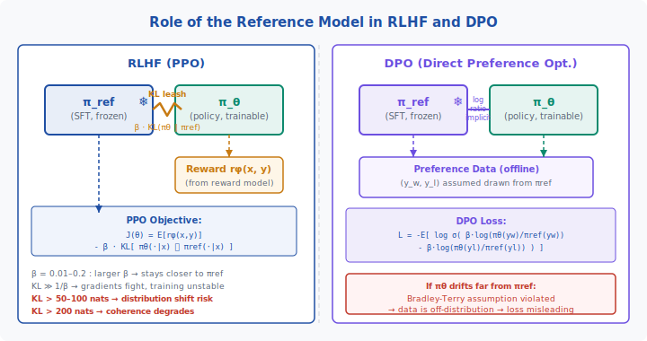
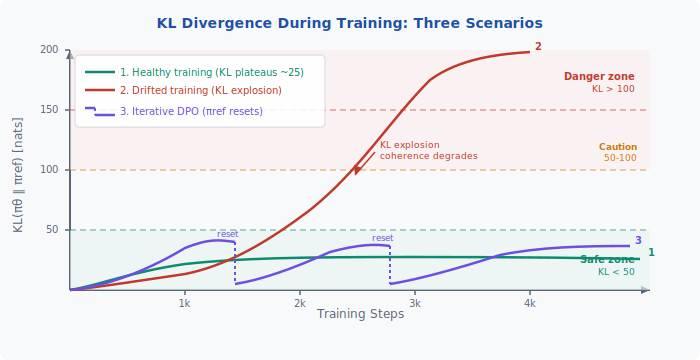

<div align="center">

[🏠 Home](../../README.md) &nbsp;•&nbsp; [📚 Section 4 — Post-training](./README.md) &nbsp;•&nbsp; [⬅️ Q4‑12](./q12-rlaif-constitutional-ai.md) &nbsp;•&nbsp; [Q4‑14 — Rejection Sampling ➡️](./q14-rejection-sampling.md)

</div>

# Q4-13 · The Role of the Reference Model in DPO/RLHF


> [!IMPORTANT]
> The reference model $\pi_\text{ref}$ is the **frozen SFT checkpoint** that acts as a behavioural anchor throughout post-training.
> In **RLHF/PPO** it appears as an explicit KL penalty in the objective.
> In **DPO** it serves as the implicit baseline inside the log-ratio loss — without it, the loss has a degenerate flat direction where increasing both $\log\pi_\theta(y_w)$ and $\log\pi_\theta(y_l)$ jointly leaves the objective unchanged, causing the model to unlearn language rather than learn preferences.
> When the policy $\pi_\theta$ drifts too far from $\pi_\text{ref}$ (KL ≫ 50 nats), the Bradley-Terry assumption underlying DPO breaks, training becomes off-distribution, and log-prob collapse or coherence degradation follows.
> Remedies include iterative DPO (periodic $\pi_\text{ref}$ resets), SFT anchoring loss, and β scheduling.

---

## Table of contents

1. [First principles](#1--first-principles)
2. [The core mechanism](#2--the-core-mechanism)
3. [Figure 1 — Reference model role in RLHF and DPO](#3--figure-1--reference-model-role-in-rlhf-and-dpo)
4. [Step-by-step worked example](#4--step-by-step-worked-example)
5. [Figure 2 — KL drift effect on training](#5--figure-2--kl-drift-effect-on-training)
6. [Algorithm / pseudocode](#6--algorithm--pseudocode)
7. [PyTorch reference implementation](#7--pytorch-reference-implementation)
8. [Worked numerical example](#8--worked-numerical-example)
9. [Interview drill — follow-up questions](#9--interview-drill--follow-up-questions)
10. [Common misconceptions](#10--common-misconceptions)
11. [Connections to other concepts](#11--connections-to-other-concepts)
12. [One-screen summary](#12--one-screen-summary)
13. [Five-minute refresher](#13--five-minute-refresher)
14. [Further reading](#14--further-reading)
15. [Bottom navigation bar](#15--bottom-navigation-bar)

---

## 1 · First principles

Post-training takes a pretrained (or SFT'd) language model and shifts its output distribution towards human-preferred behaviour.
The core tension is:

- **Reward maximisation** pushes the policy to generate responses that score high on the reward model.
- **Unconstrained maximisation** leads to *reward hacking*: degenerate outputs that exploit weaknesses in the reward model rather than being genuinely useful.

The reference model resolves this tension by acting as a **regularisation anchor**:
the policy is allowed to improve, but is penalised for straying too far from its starting distribution.

This idea traces back to KL-constrained RL, where the optimal policy under a KL budget has a clean analytic form:

$$
\pi^*(y \mid x) \propto \pi_\text{ref}(y \mid x) \exp\!\left(\frac{r(x, y)}{\beta}\right)
$$

This equation says: the ideal policy up-weights responses by how much extra reward they provide (normalised by the temperature $\beta$), starting from the reference distribution as the prior.
Both RLHF and DPO are different algorithmic routes to approximating this same $\pi^*$.

---

## 2 · The core mechanism

### 2.1 Reference model in RLHF (PPO)

The RLHF training objective is:

$$
J(\theta) = \mathbb{E}_{x \sim \mathcal{D},\, y \sim \pi_\theta(\cdot|x)}\!\left[ r_\phi(x, y) \right] - \beta \cdot D_\text{KL}\!\left[ \pi_\theta(\cdot \mid x) \;\|\; \pi_\text{ref}(\cdot \mid x) \right]
$$

Key properties:
- $\pi_\text{ref}$ is the **frozen SFT model** — its weights never change during PPO.
- The KL term is computed token-by-token as $\sum_t \log \frac{\pi_\theta(y_t | x, y_{<t})}{\pi_\text{ref}(y_t | x, y_{<t})}$ and summed over the response.
- $\beta \in [0.01, 0.2]$: larger $\beta$ pulls the policy closer to the SFT reference; smaller $\beta$ allows more exploration but increases reward hacking risk.
- In PPO implementations the KL penalty is often supplemented by a **KL coefficient schedule**: $\beta$ is increased if KL exceeds a target, decreased if KL is below it.

### 2.2 Reference model in DPO

DPO eliminates the reward model by re-expressing the optimal policy condition in terms of preference pairs.
Starting from the analytic optimal policy, the reward can be written as:

$$
r(x, y) = \beta \log \frac{\pi^*(y \mid x)}{\pi_\text{ref}(y \mid x)} + \beta \log Z(x)
$$

Substituting into the Bradley-Terry preference model and cancelling $Z(x)$, the DPO loss becomes:

$$
\mathcal{L}_\text{DPO}(\theta) = -\mathbb{E}_{(x, y_w, y_l) \sim \mathcal{D}}\!\left[
  \log \sigma\!\left(
    \beta \log \frac{\pi_\theta(y_w \mid x)}{\pi_\text{ref}(y_w \mid x)}
    - \beta \log \frac{\pi_\theta(y_l \mid x)}{\pi_\text{ref}(y_l \mid x)}
  \right)
\right]
$$

Here $\pi_\text{ref}$ serves as a **per-response baseline**:
- It normalises the log-probability of each response relative to what the SFT model would assign.
- Without $\pi_\text{ref}$, the model can minimise $\mathcal{L}_\text{DPO}$ trivially by increasing $\log \pi_\theta(y_w | x)$ and $\log \pi_\theta(y_l | x)$ together (a degenerate solution that violates the derivation).
- $\pi_\text{ref}$ is **frozen**: it is evaluated in forward-pass-only mode over each batch; no gradients flow through it.

### 2.3 What the reference model is NOT

- It is not a separate *critic* network (that is the value function in PPO).
- It is not updated during training (unlike the policy head).
- It is not the reward model (which is a separate classification head predicting scalar reward).

---

## 3 · Figure 1 — Reference model role in RLHF and DPO



**Left panel (RLHF):** $\pi_\text{ref}$ is frozen (❄) and connected to the trainable policy $\pi_\theta$ by an explicit KL leash weighted by $\beta$.
The reward signal enters only through the PPO objective; the KL penalty keeps $\pi_\theta$ anchored.

**Right panel (DPO):** $\pi_\text{ref}$ is still frozen, but the KL is *implicit* — it is encoded in the log-ratio terms inside the loss.
Preference pairs $(y_w, y_l)$ are assumed to have been sampled from $\pi_\text{ref}$; if $\pi_\theta$ drifts far from this assumption, the Bradley-Terry model is violated.

---

## 4 · Step-by-step worked example

We trace a single DPO gradient step to show concretely what $\pi_\text{ref}$ does.

**Setup:** prompt $x$ = "Summarise quantum entanglement in one sentence."
Preferred response $y_w$: "Two entangled particles share quantum state instantaneously."
Rejected response $y_l$: "Quantum entanglement is when particles are connected somehow."

**Step 1 — Forward pass through both models.**
Compute log-probabilities from both $\pi_\theta$ and $\pi_\text{ref}$ (no grad for $\pi_\text{ref}$):

| Response | $\log \pi_\theta$ | $\log \pi_\text{ref}$ | Log-ratio |
|----------|------------------:|----------------------:|----------:|
| $y_w$ (preferred) | −12.4 | −13.1 | +0.7 |
| $y_l$ (rejected)  | −14.0 | −13.6 | −0.4 |

**Step 2 — Compute the implicit reward margin.**

$$
\Delta = \beta \cdot \left[
  \underbrace{(−12.4 − (−13.1))}_{+0.7,\; y_w}
  - \underbrace{(−14.0 − (−13.6))}_{−0.4,\; y_l}
\right]
= \beta \cdot (0.7 - (-0.4)) = \beta \cdot 1.1
$$

With $\beta = 0.1$: $\Delta = 0.11$.

**Step 3 — Compute loss.**

$$
\mathcal{L} = -\log \sigma(0.11) = -\log(0.5275) = 0.640
$$

**Step 4 — Gradient interpretation.**
A positive $\Delta$ means the policy already prefers $y_w$ relative to $\pi_\text{ref}$.
The gradient will push $\pi_\theta(y_w)$ higher and $\pi_\theta(y_l)$ lower, but the *magnitude* is modulated by $\pi_\text{ref}$ — responses that $\pi_\text{ref}$ found equally (un)likely get equal baseline credit.

**Without $\pi_\text{ref}$:** the loss becomes $-\log\sigma(\beta(\log\pi_\theta(y_w) - \log\pi_\theta(y_l)))$. Adding any constant $C$ to both $\log\pi_\theta(y_w)$ and $\log\pi_\theta(y_l)$ leaves the loss unchanged — a degenerate flat direction that lets the model increase overall log-probabilities without learning preferences, eventually violating the probability simplex.

---

## 5 · Figure 2 — KL drift effect on training



**Curve 1 (teal) — Healthy training:** KL rises quickly in early steps then plateaus around 25 nats, well inside the safe zone (< 50 nats). Reward continues to improve because the policy has room to move.

**Curve 2 (red) — Drifted training:** KL rises past 100 nats by step ~2 000 and keeps climbing. In this regime, PPO gradients fighting the KL penalty become numerically unstable; DPO data becomes off-distribution. Coherence typically degrades visibly at KL > 200 nats.

**Curve 3 (purple) — Iterative DPO with resets:** Periodically (vertical dashed drops), $\pi_\text{ref}$ is reset to the current $\pi_\theta$ and new preference data is collected from the updated policy. Each reset drops the KL back to near zero and begins a fresh fine-tuning pass. This keeps the distribution shift bounded while allowing progressive improvement.

---

## 6 · Algorithm / pseudocode

### 6.1 Standard DPO training loop

```
Algorithm: Standard DPO with KL monitoring
──────────────────────────────────────────
Input:  π_ref (frozen SFT weights)
        D = {(x_i, y_w_i, y_l_i)} (offline preference dataset)
        β (temperature), α (SFT anchor weight), K (reset interval)
Output: π_θ (aligned policy)

1. Initialise π_θ ← π_ref
2. For each batch B ⊆ D:
   a. With torch.no_grad():
        lp_ref_w ← log π_ref(y_w | x) for each (x, y_w) in B
        lp_ref_l ← log π_ref(y_l | x) for each (x, y_l) in B
   b. lp_w ← log π_θ(y_w | x)
      lp_l ← log π_θ(y_l | x)
   c. log_ratio_w ← lp_w − lp_ref_w
      log_ratio_l ← lp_l − lp_ref_l
   d. margin ← β · (log_ratio_w − log_ratio_l)
   e. L_DPO ← −mean(log σ(margin))
   f. L_SFT ← −mean(lp_w)          # SFT anchor (optional)
   g. L_total ← L_DPO + α · L_SFT
   h. L_total.backward(); optimiser.step()
   i. Monitor KL ← mean(log_ratio_w + log_ratio_l) / 2  # proxy
      If KL > KL_threshold: warn / early stop
```

### 6.2 Iterative DPO with reference resets

```
Algorithm: Iterative DPO
────────────────────────
1. Initialise π_θ ← π_ref_0 (initial SFT)
2. For iteration t = 1, 2, ..., T:
   a. Generate preference dataset D_t by sampling from π_θ
      and annotating with reward model or human labellers.
   b. Set π_ref ← π_θ  (reset reference to current policy)
   c. Run standard DPO for K steps on D_t.
3. Return π_θ
```

---

## 7 · PyTorch reference implementation

```python
import torch
import torch.nn.functional as F
from torch import Tensor


def dpo_loss(
    policy_logps_chosen: Tensor,    # (B,)  log π_θ(y_w | x)
    policy_logps_rejected: Tensor,  # (B,)  log π_θ(y_l | x)
    ref_logps_chosen: Tensor,       # (B,)  log π_ref(y_w | x)
    ref_logps_rejected: Tensor,     # (B,)  log π_ref(y_l | x)
    beta: float = 0.1,
    sft_weight: float = 0.0,        # α; set > 0 to add SFT anchor
) -> tuple[Tensor, dict]:
    """
    Compute the DPO loss.

    Args:
        policy_logps_chosen:   per-sequence log-probs of chosen responses
                               under the current policy (with grad).
        policy_logps_rejected: per-sequence log-probs of rejected responses
                               under the current policy (with grad).
        ref_logps_chosen:      same, but under the frozen reference model
                               (no_grad, precomputed).
        ref_logps_rejected:    same for rejected responses.
        beta:                  KL temperature.
        sft_weight:            weight of the SFT anchor loss (α).

    Returns:
        loss:   scalar training loss
        metrics: dict with reward estimates and KL proxy
    """
    # Log-ratios: how much more likely is the policy vs reference?
    log_ratio_w = policy_logps_chosen - ref_logps_chosen       # (B,)
    log_ratio_l = policy_logps_rejected - ref_logps_rejected   # (B,)

    # Implicit reward margin
    margin = beta * (log_ratio_w - log_ratio_l)                # (B,)

    # DPO loss: negative log-sigmoid of the margin
    loss_dpo = -F.logsigmoid(margin).mean()

    # Optional SFT anchor on chosen responses
    if sft_weight > 0.0:
        loss_sft = -policy_logps_chosen.mean()
        loss = loss_dpo + sft_weight * loss_sft
    else:
        loss = loss_dpo

    # Monitoring metrics
    with torch.no_grad():
        reward_chosen   = beta * log_ratio_w   # implicit reward for chosen
        reward_rejected = beta * log_ratio_l   # implicit reward for rejected
        kl_proxy = (log_ratio_w + log_ratio_l).mean() / 2  # rough KL proxy
        accuracy = (reward_chosen > reward_rejected).float().mean()

    metrics = {
        "loss_dpo": loss_dpo.item(),
        "reward_chosen_mean": reward_chosen.mean().item(),
        "reward_rejected_mean": reward_rejected.mean().item(),
        "reward_margin_mean": (reward_chosen - reward_rejected).mean().item(),
        "kl_proxy": kl_proxy.item(),
        "accuracy": accuracy.item(),
    }
    return loss, metrics


def compute_sequence_logprobs(
    model,
    input_ids: Tensor,   # (B, L)
    labels: Tensor,      # (B, L)  — -100 for prompt tokens (ignored)
) -> Tensor:
    """
    Sum log-probs over non-masked tokens to get per-sequence log P(y|x).
    """
    with torch.no_grad() if model.training is False else torch.enable_grad():
        logits = model(input_ids).logits          # (B, L, V)
        log_probs = F.log_softmax(logits, dim=-1) # (B, L, V)
        # Gather the log-prob of the actual next token
        token_logps = log_probs[:, :-1, :].gather(
            dim=-1,
            index=labels[:, 1:].unsqueeze(-1).clamp(min=0)
        ).squeeze(-1)                              # (B, L-1)
        # Mask out prompt tokens and padding
        mask = (labels[:, 1:] != -100).float()    # (B, L-1)
        return (token_logps * mask).sum(dim=-1)    # (B,)
```

**Usage pattern:**

```python
# Reference model: load once, freeze, precompute on CPU / separate GPU
ref_model.eval()
with torch.no_grad():
    ref_logps_w = compute_sequence_logprobs(ref_model, input_chosen, labels_chosen)
    ref_logps_l = compute_sequence_logprobs(ref_model, input_rejected, labels_rejected)

# Policy model: compute with gradients
policy_logps_w = compute_sequence_logprobs(policy_model, input_chosen, labels_chosen)
policy_logps_l = compute_sequence_logprobs(policy_model, input_rejected, labels_rejected)

loss, metrics = dpo_loss(
    policy_logps_w, policy_logps_l,
    ref_logps_w, ref_logps_l,
    beta=0.1, sft_weight=0.1,
)
loss.backward()
```

---

## 8 · Worked numerical example

We compute the KL divergence between the current policy and the reference over a simplified 3-token vocabulary to build intuition for the "safe" vs "danger" regimes.

**Scenario A — Healthy policy (modest drift):**

| Token | $\pi_\text{ref}$ | $\pi_\theta$ |
|-------|-----------------|-------------|
| $t_1$ | 0.50 | 0.70 |
| $t_2$ | 0.30 | 0.20 |
| $t_3$ | 0.20 | 0.10 |

$$
D_\text{KL}(\pi_\theta \| \pi_\text{ref})
= 0.70 \ln\!\frac{0.70}{0.50}
+ 0.20 \ln\!\frac{0.20}{0.30}
+ 0.10 \ln\!\frac{0.10}{0.20}
$$

$$
= 0.70 \times 0.3365 + 0.20 \times (-0.4055) + 0.10 \times (-0.6931)
$$

$$
= 0.2356 - 0.0811 - 0.0693 = \boxed{0.0852 \text{ nats}}
$$

At 0.0852 nats per token, a 500-token response accumulates roughly **43 nats** total — comfortably inside the safe zone.

---

**Scenario B — Drifted policy:**

The policy has catastrophically shifted towards $t_3$ (perhaps reward hacking a metric rewarding length by producing a rare token).

| Token | $\pi_\text{ref}$ | $\pi_\theta$ |
|-------|-----------------|-------------|
| $t_1$ | 0.50 | 0.05 |
| $t_2$ | 0.30 | 0.05 |
| $t_3$ | 0.20 | 0.90 |

$$
D_\text{KL}(\pi_\theta \| \pi_\text{ref})
= 0.05 \ln\!\frac{0.05}{0.50}
+ 0.05 \ln\!\frac{0.05}{0.30}
+ 0.90 \ln\!\frac{0.90}{0.20}
$$

$$
= 0.05 \times (-2.3026) + 0.05 \times (-1.7918) + 0.90 \times 1.5041
$$

$$
= -0.1151 - 0.0896 + 1.3537 = \boxed{1.1490 \text{ nats per token}}
$$

At 1.1490 nats per token, a 500-token response accumulates approximately $1.1490 \times 500 \approx \mathbf{575}$ **nats** — well into the danger zone (> 200 nats indicates coherence degradation).

**Interpretation:**
- Scenario A KL = 0.0852 nats/token: gradient signal is reliable; data is near-distribution.
- Scenario B KL = 1.149 nats/token: the policy is generating tokens the reference almost never would. DPO preference data collected under $\pi_\text{ref}$ is now drastically off-distribution for $\pi_\theta$, and the implicit reward estimates are unreliable.

**Threshold rules of thumb:**

| Accumulated KL | Regime |
|---------------|--------|
| < 50 nats | Safe — gradient signal reliable |
| 50–100 nats | Caution — monitor reward model accuracy |
| 100–200 nats | Danger — distribution shift likely, reset $\pi_\text{ref}$ |
| > 200 nats | Critical — coherence degrades, restart required |

---

## 9 · Interview drill — follow-up questions

**Q1. Why can't you just remove the reference model from DPO to simplify the algorithm?**
Without $\pi_\text{ref}$, the loss has a degenerate flat direction: jointly increasing $\log\pi_\theta(y_w)$ and $\log\pi_\theta(y_l)$ by the same amount leaves the objective unchanged. The log-ratio is what converts absolute log-probabilities into a *relative* preference signal anchored to the SFT distribution.

**Q2. What is the relationship between β in RLHF and β in DPO?**
They play the same conceptual role (temperature controlling KL budget) and share the same analytic origin from the KL-constrained RL optimal policy. In RLHF β multiplies the explicit KL penalty; in DPO β scales the log-ratios, implicitly setting how strongly the policy can deviate from the reference.

**Q3. How does iterative DPO differ from online RLHF?**
Iterative DPO still uses an offline loss at each round (frozen $\pi_\text{ref}$, frozen preference data), but resets $\pi_\text{ref}$ and regenerates data between rounds. True online RLHF (PPO) updates the policy continuously with on-policy rollouts and an adaptive KL coefficient, giving stronger guarantees but requiring a reward model and more compute.

**Q4. What is the SFT anchor loss and when should you use it?**
$\mathcal{L}_\text{SFT} = -\log \pi_\theta(y_w | x)$ added alongside DPO prevents *log-prob collapse* — the pathology where DPO training makes the policy less fluent by reducing both chosen and rejected log-probs. Use it when you observe chosen log-probs decreasing during training (track via metrics). Typical weight $\alpha \in [0.1, 1.0]$.

**Q5. How would you detect in practice that the policy has drifted too far?**
Monitor: (1) per-batch mean log-ratio $\hat{r}(y_w) - \hat{r}(y_l)$; stalling indicates distribution shift. (2) Chosen log-probs $\log \pi_\theta(y_w)$; a sustained decrease signals collapse. (3) Proxy KL via $\frac{1}{N}\sum_i (\log \pi_\theta(y_i) - \log \pi_\text{ref}(y_i))$ — a quick estimate without a full KL evaluation. (4) Held-out benchmark scores; the strongest signal of all.

**Q6. Could you use a reference model from a different model family?**
Theoretically no — the log-ratio is meaningful only if both distributions cover the same token vocabulary and similar semantics. In practice, using a reference from a different checkpoint of the same model but different size is rare and generally not recommended. The most common variant is using the SFT checkpoint of the same base model.

---

## 10 · Common misconceptions

**Misconception 1: "The reference model is updated slowly, like a target network in DQN."**
False. $\pi_\text{ref}$ is completely frozen for the duration of a training run (or until an explicit iterative reset). It is not an exponential moving average of $\pi_\theta$.

**Misconception 2: "DPO has no KL regularisation."**
False. DPO has *implicit* KL regularisation via the log-ratio terms. The derivation shows it is equivalent to minimising the reward under a KL constraint, with $\beta$ controlling the budget. The difference from RLHF is that the KL is not a separate term but is baked into the loss structure.

**Misconception 3: "A large β always makes training safer."**
Partially true. A large $\beta$ keeps the policy close to $\pi_\text{ref}$ and reduces distribution shift, but it also limits how much alignment can actually be achieved — the policy cannot move far enough to fix bad behaviours learned during pretraining/SFT. There is a tradeoff.

**Misconception 4: "The reference model prevents catastrophic forgetting entirely."**
The KL penalty strongly discourages moving away from the reference, which helps preserve general language capabilities. But catastrophic forgetting can still occur if the learning rate is high, data is narrow, or $\beta$ is too small. The SFT anchor loss on chosen responses provides additional protection for in-distribution language quality.

**Misconception 5: "KL in DPO is computed over whole sequences."**
The KL can be decomposed as a sum of per-token KL divergences (because the language model factorises autoregressively). In practice, DPO uses the *sequence-level* log-probability (sum of per-token log-probs), which is equivalent to the sequence-level KL contribution.

---

## 11 · Connections to other concepts

**KL divergence (Q4-04):** The KL penalty in RLHF is the direct application of KL as a divergence measure. Q4-04 covers KL geometry, asymmetry, and why forward KL ($\pi_\text{ref} \| \pi_\theta$) and reverse KL ($\pi_\theta \| \pi_\text{ref}$) behave differently in optimisation; RLHF uses reverse KL.

**PPO and the RLHF objective (Q4-08):** PPO is the optimiser used to maximise $J(\theta)$; the reference model enters PPO as a per-step KL penalty applied to the generated response tokens on top of the standard clipped surrogate loss.

**Reward hacking (Q4-11):** When $\beta$ is too small or the reference model constraint is too loose, the policy exploits the reward model — reward hacking. The reference model constraint is the primary defence.

**DPO derivation (Q4-09):** The log-ratio form of DPO is derived by substituting the optimal policy $\pi^*(y|x) \propto \pi_\text{ref}(y|x) \exp(r/\beta)$ into the Bradley-Terry model. $\pi_\text{ref}$ cancels from the partition function $Z(x)$, enabling a reward-model-free objective.

**RLAIF / Constitutional AI (Q4-12):** When the preference labels come from a model (not humans), the reference model's role is unchanged — it still anchors the policy to avoid distributional collapse regardless of where annotations originate.

**Rejection sampling fine-tuning (Q4-14):** An alternative alignment method that avoids explicit KL penalties by filtering rollouts from the policy itself. The reference model can still appear implicitly if the filtering criterion uses log-ratios.

---

## 12 · One-screen summary

| Aspect | RLHF (PPO) | DPO |
|--------|------------|-----|
| $\pi_\text{ref}$ role | Explicit KL penalty in objective | Implicit baseline in log-ratio loss |
| $\pi_\text{ref}$ updated? | Never (frozen) | Never (frozen); reset in iterative DPO |
| KL form | $\beta \cdot D_\text{KL}[\pi_\theta \| \pi_\text{ref}]$ | Implicit via $\beta(\log\frac{\pi_\theta(y_w)}{\pi_\text{ref}(y_w)} - \log\frac{\pi_\theta(y_l)}{\pi_\text{ref}(y_l)})$ |
| β range | 0.01–0.2 | 0.01–0.5 |
| Drift symptom | KL explosion, gradient conflict | Off-distribution data, log-prob collapse |
| Safe KL range | < 50 nats (accumulated) | < 50 nats |
| Fix 1 | Increase $\beta$, KL coefficient schedule | Iterative DPO + reference reset |
| Fix 2 | Reduce learning rate, clip gradients | SFT anchor loss ($\alpha \approx 0.1$–1.0) |

**One-sentence answer:** The reference model is the frozen SFT checkpoint that prevents reward hacking and log-prob collapse by anchoring the policy's distribution — explicitly (PPO KL penalty) or implicitly (DPO log-ratio baseline) — and when it drifts past ~50–100 accumulated nats, the alignment signal becomes unreliable.

---

## 13 · Five-minute refresher

1. **The anchoring problem:** Without a reference, reward maximisation leads to degenerate outputs. The reference model is the prior the policy should stay close to.

2. **RLHF:** Explicit KL penalty $\beta \cdot D_\text{KL}[\pi_\theta \| \pi_\text{ref}]$ subtracted from reward. $\pi_\text{ref}$ = frozen SFT.

3. **DPO:** $\pi_\text{ref}$ appears inside the loss as log-ratios $\log \frac{\pi_\theta(y)}{\pi_\text{ref}(y)}$. These are the implicit reward estimates. The KL budget is still controlled by $\beta$.

4. **Both share the optimal-policy form:** $\pi^*(y|x) \propto \pi_\text{ref}(y|x) \exp(r/\beta)$. RLHF and DPO approximate this via different algorithms.

5. **Drift symptoms:** KL explosion (> 100 nats accumulated) → unstable PPO gradients; off-distribution preference data in DPO → loss measures wrong thing; log-prob collapse → chosen responses become less fluent.

6. **Fixes:** Iterative DPO (reset $\pi_\text{ref}$), SFT anchor loss, $\beta$ scheduling, lower learning rate.

---

## 14 · Further reading

- **Rafailov et al. (2023)** "Direct Preference Optimization: Your Language Model is Secretly a Reward Model." *NeurIPS 2023.* — Original DPO paper; derives the log-ratio form and discusses the role of $\pi_\text{ref}$. [arXiv:2305.18290](https://arxiv.org/abs/2305.18290)

- **Ziegler et al. (2019)** "Fine-Tuning Language Models from Human Feedback." — Introduces the KL-regularised RLHF objective with $\pi_\text{ref}$. [arXiv:1909.08593](https://arxiv.org/abs/1909.08593)

- **Guo et al. (2024)** "Direct Language Model Alignment from Online AI Feedback." — Introduces iterative DPO with periodic reference resets; empirically validates the distribution shift concern. [arXiv:2402.04792](https://arxiv.org/abs/2402.04792)

- **Azar et al. (2023)** "A General Theoretical Paradigm to Understand Learning from Human Feedback." — Analyses the KL budget, optimal policy derivation, and failure modes of DPO under large distribution shift. [arXiv:2310.12036](https://arxiv.org/abs/2310.12036)

- **Xu et al. (2023)** "Some Things Are More CRINGE than Others: Preference Optimization with the Pairwise Cringe Loss." — Explores alternatives to the log-ratio baseline and discusses when the standard $\pi_\text{ref}$ assumption breaks. [arXiv:2312.16682](https://arxiv.org/abs/2312.16682)

---

<div align="center">

[🏠 Home](../../README.md) &nbsp;•&nbsp; [📚 Section 4 — Post-training](./README.md) &nbsp;•&nbsp; [⬅️ Q4‑12](./q12-rlaif-constitutional-ai.md) &nbsp;•&nbsp; [Q4‑14 — Rejection Sampling ➡️](./q14-rejection-sampling.md)

</div>
