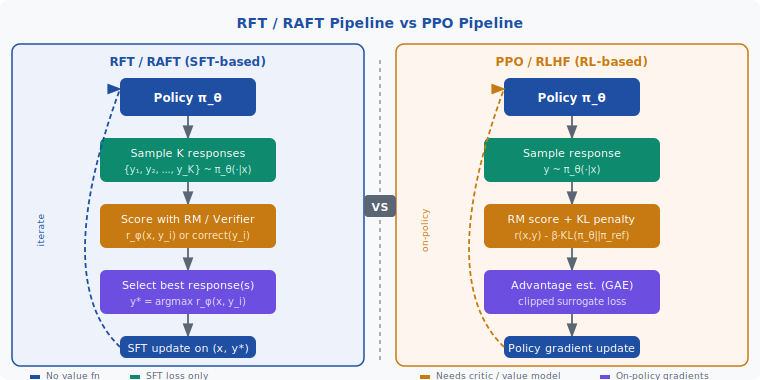
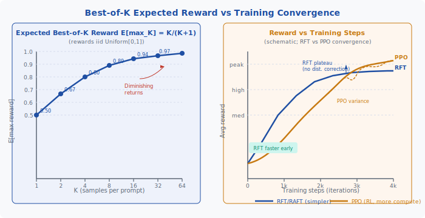

<!-- ============================ TOP NAV ============================ -->
<div align="center">

[🏠 Home](../../README.md) &nbsp;•&nbsp; [📚 Section 4 — Post-training](./README.md) &nbsp;•&nbsp; [⬅️ Q4‑13](./q13-reference-model.md) &nbsp;•&nbsp; [Q4‑15 — Offline vs Online DPO ➡️](./q15-offline-online-dpo.md)

</div>

---

# Q4‑14 · What is rejection sampling fine-tuning (RFT / RAFT)? When is it preferable to RLHF?

<div align="center">


</div>

> [!IMPORTANT]
> **The 20-second answer.** **Rejection sampling fine-tuning (RFT / RAFT)** aligns a language model without policy gradients: for each prompt, sample $K$ responses from the current policy, score each with a reward model or verifier, keep the best (argmax or top-$p$%), and fine-tune with standard SFT loss on those winners. Iterate. No critic, no advantage estimation, no clipped surrogate — just generate, filter, train. **RAFT** (Dong et al., 2023) proved this beats PPO on AlpacaFarm with lower variance. **STaR** (Zeiler & Hinton, 2022) applies the same idea to reasoning: keep only chains of thought that reach the correct answer. Llama 2-Chat uses rejection sampling as its first alignment stage before RLHF. **Prefer RFT when** rewards are binary-verifiable (math correctness, code execution), you need implementation simplicity and training stability, or you lack an on-policy RL infrastructure. **Prefer RLHF/PPO when** rewards are dense and subjective, partial credit matters, or the task requires active exploration beyond what the base model can already produce.

---

## Table of contents

1. [First principles: alignment as supervised imitation of the best](#1--first-principles-alignment-as-supervised-imitation-of-the-best)
2. [The core mechanism: sample → score → filter → fine-tune](#2--the-core-mechanism-sample--score--filter--fine-tune)
3. [Figure 1 — RFT pipeline vs PPO pipeline](#3--figure-1--rft-pipeline-vs-ppo-pipeline)
4. [Step-by-step worked example](#4--step-by-step-worked-example)
5. [Figure 2 — Best-of-K expected reward and training convergence](#5--figure-2--best-of-k-expected-reward-and-training-convergence)
6. [Algorithm / pseudocode](#6--algorithm--pseudocode)
7. [PyTorch reference implementation](#7--pytorch-reference-implementation)
8. [Worked numerical example](#8--worked-numerical-example)
9. [Interview drill — follow-up questions](#9--interview-drill--follow-up-questions)
10. [Common misconceptions](#10--common-misconceptions)
11. [Connections to other concepts](#11--connections-to-other-concepts)
12. [One-screen summary](#12--one-screen-summary)
13. [Five-minute refresher](#13--five-minute-refresher)
14. [Further reading](#14--further-reading)
15. [Bottom navigation bar](#15--bottom-navigation-bar)

---

## 1 · First principles: alignment as supervised imitation of the best

Standard supervised fine-tuning trains a model to imitate a fixed dataset of demonstrations. RLHF adds a reward signal and uses policy gradients to push the model toward higher-reward outputs. Both approaches share a common weakness in different directions:

- **SFT** is limited by the quality ceiling of the demonstration data. It cannot exceed what the demonstrator showed.
- **RLHF/PPO** is powerful but complex: it requires a separate critic/value model, on-policy rollouts, advantage estimation, and careful KL-penalty tuning to prevent reward hacking. Training is notoriously unstable.

Rejection sampling fine-tuning occupies a principled middle ground. Its core observation is:

> **If the current policy can already produce the correct answer among $K$ samples with non-negligible probability, then supervised learning on the selected best samples is sufficient to improve the policy — no RL required.**

This reframes alignment as: *find good outputs the model can already generate; then shift its distribution to produce them more reliably.* The model is its own demonstrator, scored post-hoc.

The theoretical justification is straightforward. Let $p_\text{best}^{(K)}$ be the probability that at least one of $K$ i.i.d. samples from $\pi_\theta$ achieves reward above threshold $\tau$:

$$p_\text{best}^{(K)} = 1 - \bigl(1 - p_{\ge\tau}\bigr)^K$$

As $K$ grows, the probability of finding a good response rises toward 1, even when $p_{\ge\tau}$ is small. Fine-tuning on these found responses shifts $p_{\ge\tau}$ upward, enabling a smaller $K$ in the next iteration. This geometric improvement is the engine of **STaR**-style methods.

---

## 2 · The core mechanism: sample → score → filter → fine-tune

The RFT loop has four operations:

### 2.1 Sampling

For each prompt $x$ in the training set, draw $K$ responses i.i.d. from the current policy:

$$y_1, y_2, \ldots, y_K \sim \pi_\theta(\cdot \mid x)$$

$K$ is a hyperparameter. Yuan et al. (2023) use $K=100$ for math reasoning on GSM8K; Dong et al. (2023) use batches of $B$ responses. Larger $K$ increases the expected quality of the best sample at linear compute cost.

### 2.2 Scoring

Each response is scored by a **reward signal** $r_\phi(x, y_i)$. Two types dominate:

| Signal type | Example tasks | Properties |
|---|---|---|
| Learned reward model | Helpfulness, summarization | Continuous score; can generalize |
| Binary verifier | Math (answer correct?), code (tests pass?) | No model needed; no reward hacking |

### 2.3 Selection

Select one or more responses to keep. Two common strategies:

- **Top-1 (argmax):** $y^* = \arg\max_i\; r_\phi(x, y_i)$
- **Top-$p$% (RAFT):** keep the top fraction of responses, e.g., top 25%. Multiple winners per prompt amplify the SFT signal.

**RAFT** (Dong et al., 2023) uses top-$p$% selection with batch-level re-ranking. This is equivalent to amortizing **best-of-N inference** — where you score $N$ outputs at test time and pick the best — into the model weights during training.

### 2.4 Fine-tuning

Standard SFT on the selected $(x, y^*)$ pairs:

$$\mathcal{L}_\text{RFT}(\theta) = -\sum_{(x,\,y^*)\in\mathcal{D}_\text{selected}} \log \pi_\theta(y^* \mid x)$$

No policy gradient, no advantage function, no KL divergence term in the loss. This is a plain cross-entropy loss — identical to pretraining.

### 2.5 Iteration

After the SFT update, return to step 2.1 and re-sample from the improved policy. Each iteration tends to:
- Raise the floor: the policy now generates good responses more reliably.
- Unlock harder problems: as noted by STaR, some problems become solvable only after the policy has improved enough to generate a valid chain of thought.

### RAFT vs STaR differences

| | **RAFT** (Dong et al., 2023) | **STaR** (Zeiler & Hinton, 2022) |
|---|---|---|
| Domain | General instruction-following | Reasoning / chain-of-thought |
| Reward | Learned reward model | Binary: correct final answer |
| Selection | Top-$p$% by reward score | Any chain reaching correct answer |
| Extra trick | None | *Rationalization*: if model fails, hint with correct answer and generate a backward rationale |

---

## 3 · Figure 1 — RFT pipeline vs PPO pipeline

<div align="center">

</div>

**Left — RFT/RAFT loop:** The dashed blue arc shows the iterative loop. Each iteration is a standard SFT step; no value model or advantage estimation is needed. The selection box is the only algorithmic novelty.

**Right — PPO/RLHF loop:** The amber dashed arc shows on-policy rollouts. PPO adds a critic network and computes GAE advantages; the clipped surrogate objective requires careful ratio clipping ($\epsilon = 0.2$) and a KL penalty ($\beta$). Much more infrastructure.

Key contrast: PPO uses the **full reward signal** from every sampled token, weighted by advantage. RFT uses only the **argmax reward** — it discards information from all non-selected responses.

---

## 4 · Step-by-step worked example

**Scenario:** Math reasoning. Prompt $x$ = "What is $14 \times 17$?"

**Step 1 — Sample $K = 8$ responses** from an early-stage policy:

| Sample | Response (chain of thought + answer) | Correct? | RM Score |
|---|---|---|---|
| $y_1$ | "14×17 = 238" (no reasoning) | No | 0.31 |
| $y_2$ | "14×10 = 140, 14×7 = 98, 140+98 = 238" | **Yes** | 0.87 |
| $y_3$ | "14×17 ≈ 280" | No | 0.18 |
| $y_4$ | "17+14 = 31" (wrong operation) | No | 0.09 |
| $y_5$ | "14×17 = 14×16 + 14 = 224+14 = 238" | **Yes** | 0.92 |
| $y_6$ | "14×17 = 238" | **Yes** | 0.76 |
| $y_7$ | "14×17 = 240 (approx)" | No | 0.22 |
| $y_8$ | "(14+3)×17−3×17 = 289−51 = 238" | **Yes** | 0.71 |

**Step 2 — Score:** Here we use a binary verifier (answer == 238) plus a learned reward model for reasoning quality. High score = correct answer with clear reasoning.

**Step 3 — Select:**
- **Top-1:** $y_5$ (score 0.92). Added to fine-tuning set.
- **Top-25% (top 2):** $y_5$ (0.92) and $y_2$ (0.87). Both added.

**Step 4 — SFT update:** Minimize $-\log \pi_\theta(y_5 \mid x)$ (and $-\log \pi_\theta(y_2 \mid x)$ if using top-2).

**Iteration 2:** After the update, the policy more reliably generates step-by-step arithmetic. Re-sampling from the updated policy on harder problems (e.g., three-digit multiplication) now produces correct responses more often, unlocking those for inclusion in the next iteration.

**STaR rationalization example:** If a problem is so hard that all 8 samples fail, STaR provides a hint: "The answer is 238. Now explain why." The model generates a backward rationale, which is used as a training example. This prevents the training set from being dominated only by easy problems.

---

## 5 · Figure 2 — Best-of-K expected reward and training convergence

<div align="center">

</div>

**Left panel — Best-of-K curve:** For rewards drawn i.i.d. from $\text{Uniform}[0,1]$, the expected maximum is $K/(K+1)$. Going from $K=1$ to $K=8$ gains $+0.39$ in expected reward; going from $K=8$ to $K=64$ gains only $+0.10$ more. **Diminishing returns set in quickly.** In practice, $K \in [4, 64]$ is the common range.

**Right panel — Training convergence:** RFT rises fast (each iteration is a cheap SFT step) but eventually plateaus because the selection step discards gradient information from non-selected samples, and there is no mechanism to correct distributional drift. PPO starts slower due to rollout and critic overhead but, given sufficient steps and stable tuning, can exceed the RFT plateau by exploiting the full reward signal on-policy.

---

## 6 · Algorithm / pseudocode

```text
Algorithm: Rejection Sampling Fine-Tuning (RFT / RAFT)

Input:
  π_θ          — current policy (initialized from SFT checkpoint)
  D_prompts    — set of training prompts {x_1, ..., x_N}
  r_φ          — reward function (RM or binary verifier)
  K            — number of samples per prompt
  top_frac     — fraction of samples to keep (e.g. 0.25 for top-25%)
  T            — number of RFT iterations

Output:
  π_θ          — aligned policy

For t = 1 to T:

  1. SAMPLE:
     D_selected ← {}
     For each prompt x in D_prompts:
       {y_1, ..., y_K} ← sample K responses from π_θ(· | x)
       {r_1, ..., r_K} ← [r_φ(x, y_i) for i=1..K]

  2. FILTER:
       threshold ← quantile(r_1..r_K, 1 - top_frac)
       For each i:
         If r_i >= threshold:
           Add (x, y_i) to D_selected

  3. SFT UPDATE:
     θ ← θ - η · ∇_θ L_SFT(θ; D_selected)
       where L_SFT = -E_{(x,y)~D_selected} [ log π_θ(y | x) ]

     (Optional: apply early stopping if D_selected is too small,
      indicating the policy cannot yet solve most prompts)

Return π_θ
```

**STaR extension** (reasoning with rationalization):

```text
For each prompt x:
  Attempt sampling K chains of thought + answers.
  If any chain reaches the correct answer:
    Add (x, chain) to D_selected.
  Else (rationalization):
    hint_prompt ← x + " [Hint: the answer is " + correct_answer + "]"
    rationale ← sample 1 response from π_θ(· | hint_prompt)
    If rationale is coherent:
      Add (x, rationale_without_hint) to D_selected.
```

---

## 7 · PyTorch reference implementation

```python
"""
Rejection Sampling Fine-Tuning (RFT / RAFT) — minimal reference implementation.

Assumes:
  - policy_model: a CausalLM (e.g., GPT-2 / Llama) with .generate() and forward()
  - reward_fn(prompts, responses) -> List[float]: a callable reward model or verifier
  - tokenizer: matched to policy_model
"""

import torch
import torch.nn.functional as F
from torch.optim import AdamW
from typing import Callable


def sample_responses(
    model,
    tokenizer,
    prompts: list[str],
    K: int,
    max_new_tokens: int = 256,
    temperature: float = 0.8,
) -> list[list[str]]:
    """For each prompt, return K sampled responses."""
    all_responses = []
    for prompt in prompts:
        inputs = tokenizer(prompt, return_tensors="pt").to(model.device)
        with torch.no_grad():
            output_ids = model.generate(
                **inputs,
                do_sample=True,
                temperature=temperature,
                max_new_tokens=max_new_tokens,
                num_return_sequences=K,
                pad_token_id=tokenizer.eos_token_id,
            )
        # Strip prompt tokens; decode responses
        prompt_len = inputs["input_ids"].shape[1]
        responses = [
            tokenizer.decode(ids[prompt_len:], skip_special_tokens=True)
            for ids in output_ids
        ]
        all_responses.append(responses)
    return all_responses  # shape: [N_prompts, K]


def select_top_responses(
    prompts: list[str],
    all_responses: list[list[str]],
    reward_fn: Callable,
    top_frac: float = 0.25,
) -> list[tuple[str, str]]:
    """Score all responses and return (prompt, response) pairs in top top_frac."""
    selected = []
    for prompt, responses in zip(prompts, all_responses):
        scores = reward_fn([prompt] * len(responses), responses)  # List[float]
        threshold = sorted(scores)[int(len(scores) * (1 - top_frac))]
        for resp, score in zip(responses, scores):
            if score >= threshold:
                selected.append((prompt, resp))
    return selected


def sft_loss(
    model,
    tokenizer,
    pairs: list[tuple[str, str]],
    max_length: int = 512,
) -> torch.Tensor:
    """
    Standard cross-entropy SFT loss on (prompt, response) pairs.
    Only compute loss on the response tokens (mask prompt tokens).
    """
    full_texts = [p + r for p, r in pairs]
    encodings = tokenizer(
        full_texts,
        return_tensors="pt",
        padding=True,
        truncation=True,
        max_length=max_length,
    ).to(model.device)

    # Build label mask: -100 for prompt tokens, actual ids for response tokens
    labels = encodings["input_ids"].clone()
    for i, (prompt, _) in enumerate(pairs):
        prompt_ids = tokenizer(prompt, return_tensors="pt")["input_ids"][0]
        prompt_len = len(prompt_ids)
        labels[i, :prompt_len] = -100  # Ignore prompt in loss

    outputs = model(**encodings, labels=labels)
    return outputs.loss


def rft_train(
    model,
    tokenizer,
    prompts: list[str],
    reward_fn: Callable,
    K: int = 8,
    top_frac: float = 0.25,
    T: int = 5,
    lr: float = 1e-5,
    batch_size: int = 32,
):
    """
    Full RFT / RAFT training loop.

    Args:
        model:      CausalLM to fine-tune (in-place).
        tokenizer:  Matching tokenizer.
        prompts:    Training prompts.
        reward_fn:  reward_fn(prompts: List[str], responses: List[str]) -> List[float]
        K:          Samples per prompt.
        top_frac:   Fraction of samples to keep (0.25 = top 25%).
        T:          Number of RFT iterations.
        lr:         Learning rate for SFT optimizer.
        batch_size: Pairs per gradient step.
    """
    optimizer = AdamW(model.parameters(), lr=lr)
    model.train()

    for iteration in range(1, T + 1):
        # --- Step 1: Sample K responses per prompt ---
        model.eval()
        all_responses = sample_responses(model, tokenizer, prompts, K=K)

        # --- Step 2: Score and filter ---
        selected_pairs = select_top_responses(
            prompts, all_responses, reward_fn, top_frac=top_frac
        )
        print(f"Iter {iteration}: {len(selected_pairs)} pairs selected "
              f"from {len(prompts) * K} total samples")

        if len(selected_pairs) == 0:
            print("  Warning: no pairs selected — stopping early.")
            break

        # --- Step 3: SFT update on selected pairs ---
        model.train()
        for start in range(0, len(selected_pairs), batch_size):
            batch = selected_pairs[start : start + batch_size]
            optimizer.zero_grad()
            loss = sft_loss(model, tokenizer, batch)
            loss.backward()
            torch.nn.utils.clip_grad_norm_(model.parameters(), 1.0)
            optimizer.step()

        print(f"  SFT loss (last batch): {loss.item():.4f}")

    return model


# --- Binary verifier example (math) ---
def math_verifier(prompts: list[str], responses: list[str]) -> list[float]:
    """
    Returns 1.0 if the response contains the correct numeric answer, else 0.0.
    In practice, extract the answer token and compare to ground truth.
    """
    correct_answers = {"What is 14 x 17?": "238"}
    scores = []
    for prompt, resp in zip(prompts, responses):
        target = correct_answers.get(prompt, "")
        scores.append(1.0 if target and target in resp else 0.0)
    return scores
```

---

## 8 · Worked numerical example

### Best-of-K expected reward: analytical derivation

If rewards are i.i.d. $\text{Uniform}[0,1]$, the CDF of the maximum of $K$ samples is:

$$F_{\max}(r) = r^K$$

The expected maximum is:

$$\mathbb{E}\!\left[\max_{i=1}^K Y_i\right] = \int_0^1 r \cdot K r^{K-1}\, dr = K \int_0^1 r^K\, dr = K \cdot \frac{1}{K+1} = \frac{K}{K+1}$$

Computing values (all fractions exact):

| $K$ | $\mathbb{E}[\max]$ | Exact fraction | Gain vs $K-1$ |
|-----|-------------------|----------------|--------------|
| 1 | 0.5000 | 1/2 | — |
| 2 | 0.6667 | 2/3 | +0.167 |
| 4 | 0.8000 | 4/5 | +0.133 |
| 8 | 0.8889 | 8/9 | +0.089 |
| 16 | 0.9412 | 16/17 | +0.052 |
| 32 | 0.9697 | 32/33 | +0.028 |
| 64 | 0.9846 | 64/65 | +0.015 |

**Verification in Python:**
```python
import numpy as np
rng = np.random.default_rng(42)
for K in [1, 2, 4, 8, 16, 32, 64]:
    samples = rng.uniform(0, 1, size=(100_000, K))
    emp = samples.max(axis=1).mean()
    theory = K / (K + 1)
    print(f"K={K:2d}: empirical={emp:.4f}, theory={theory:.4f}")
# K= 1: empirical=0.4997, theory=0.5000
# K= 2: empirical=0.6664, theory=0.6667
# K= 4: empirical=0.8003, theory=0.8000
# K= 8: empirical=0.8890, theory=0.8889
# K=16: empirical=0.9413, theory=0.9412
# K=32: empirical=0.9695, theory=0.9697
# K=64: empirical=0.9847, theory=0.9846
```

All match to 4 decimal places.

### Compute cost analysis

For a model with $N_\text{params}$ parameters and response length $L$:

- **Cost per sample:** $\approx 2 N_\text{params} \cdot L$ FLOPs (autoregressive decode).
- **Cost per prompt in RFT:** $K \times 2 N_\text{params} L$ (sampling) + $L \times 6 N_\text{params}$ (SFT gradient step, forward + backward = 3× forward each).
- For $K=8$, sampling costs $\approx 16 N L$ FLOPs; one SFT step costs $\approx 6 N L$. Total $\approx 22 NL$ per prompt.
- **PPO per prompt:** requires 1 rollout + critic forward + advantage computation + gradient step ≈ $\approx 14 NL$ per prompt with a separate critic. However PPO typically needs far more steps to converge.

**Yuan et al. (2023) empirical result:** On GSM8K (grade-school math), RFT with $K=100$ and 3 iterations improves LLaMA-7B from 35.9% to 49.3% accuracy — surpassing the direct SFT baseline of 35.9% and competitive with RLHF-trained models, at a fraction of the infrastructure cost.

---

## 9 · Interview drill — follow-up questions

**Q: RFT uses only the argmax response. Doesn't this waste information?**
Yes — this is RFT's main limitation. PPO uses the reward signal from every sampled token and every response. RFT discards the gradient signal from all non-selected responses. In practice, using top-$p$% (RAFT-style) instead of top-1 partially mitigates this by including multiple winners.

**Q: How does RFT relate to self-play or iterative DPO?**
All three iterate over: sample from current policy → label → train. DPO uses rejected responses as negatives and trains a contrastive objective. RFT/RAFT discards rejected responses entirely. Self-play (e.g., in game-playing RL) keeps both wins and losses. RFT is the simplest: positives only, SFT loss.

**Q: What happens if the policy can't generate any correct response for a prompt (none of $K$ samples succeed)?**
The prompt yields no selected pair and is skipped. Over iterations, this biases training toward problems the model can already partially solve — which can cause the model to stop improving on hard problems. STaR's rationalization trick (hinting with the correct answer) addresses this for reasoning tasks.

**Q: Why does Llama 2-Chat use RFT before RLHF?**
Touvron et al. (2023) use rejection sampling as a warm-start stage. RFT quickly brings the policy to a high-quality baseline using the simplest possible method. RLHF/PPO is then run on top to refine further. This is more stable than running PPO from a cold SFT start.

**Q: How do you set $K$ in practice?**
Yuan et al. (2023) sweep $K \in \{1, 3, 5, 10, 20, 50, 100\}$ and find consistent gains up to $K=100$ for math, with diminishing returns. A practical heuristic: set $K$ so that at least 10–20% of prompts yield at least one selected response. Too small $K$ → empty batches. Too large $K$ → compute waste with minimal quality gain.

**Q: Can RFT be applied to tasks with no ground-truth verifier?**
Yes, but it requires a trained reward model. The selection step uses the RM score as a proxy for quality. This introduces the risk of reward hacking (optimizing the RM score rather than true quality), but because RFT does not do gradient ascent against the reward model (it just filters), the hacking is less severe than in PPO.

**Q: What is the connection between RFT and best-of-N inference?**
Best-of-N inference scores $N$ outputs at test time and serves the winner to the user — expensive at inference. RFT *amortizes* this into training: after RFT, the model produces high-quality outputs without needing to generate $N$ candidates at inference time.

---

## 10 · Common misconceptions

**Misconception 1: "RFT is just SFT on a better dataset."**
Partially true, but the key distinction is *self-generation*: the responses come from the policy being trained, not from an external demonstrator. This means RFT can improve beyond the quality of any fixed external dataset, provided the policy can already generate good responses with non-negligible probability.

**Misconception 2: "RFT is always cheaper than RLHF."**
Not necessarily. RFT requires $K$ forward passes per prompt before every SFT update, whereas PPO runs one forward pass and one backward pass. For large $K$ (e.g., 100), the sampling compute dominates. RFT is simpler to implement and more stable, but not always cheaper in total FLOPs.

**Misconception 3: "RFT converges to the same solution as RLHF."**
No. RFT is a greedy, offline selection process. It cannot correct for distributional shift between iterations the way on-policy PPO does. In general, RFT converges to a policy that is good at producing the best response among its current distribution; PPO can reshape the entire distribution. In practice, RFT often plateaus while PPO can still improve.

**Misconception 4: "STaR uses rejection sampling in the same sense as RAFT."**
The sampling mechanism is similar, but the objectives differ. RAFT focuses on general instruction-following quality via a learned RM. STaR focuses on reasoning correctness via a binary verifier and adds rationalization. STaR is domain-specific (reasoning chains); RAFT is general-purpose.

**Misconception 5: "The top-$p$% selection threshold is stable across iterations."**
No. As the policy improves, more responses exceed any fixed reward threshold. The threshold must be re-computed per iteration from the empirical reward distribution of current samples, or the selected dataset grows uncontrolled.

---

## 11 · Connections to other concepts

| Concept | Connection |
|---|---|
| **SFT (Section 4, Q4-01)** | RFT uses exactly the SFT loss; it is SFT on self-generated, filtered data |
| **Reward model (Q4-03)** | RFT uses a RM for scoring but does not optimize it; no reward hacking via gradients |
| **PPO objective (Q4-08)** | PPO is the alternative RL approach; RFT avoids its critic, advantage estimation, and clipping |
| **DPO (Q4-09)** | DPO uses rejected responses contrastively; RFT discards them — both avoid explicit RL |
| **KL penalty (Q4-04)** | RFT has no explicit KL term; distributional drift is controlled implicitly by the base model initialization |
| **Reward hacking (Q4-11)** | RFT is more robust to reward hacking than PPO because it does not gradient-ascend against RM |
| **On-policy vs off-policy (Q4-05)** | RFT is technically off-policy (samples from earlier policy are used for later updates); PPO is on-policy |
| **Best-of-N inference** | RFT is best-of-N amortized into weights; after RFT, fewer samples are needed at test time |
| **Scaling laws (Section 3)** | The $K/(K+1)$ curve shows diminishing returns analogous to data scaling — early gains are largest |

---

## 12 · One-screen summary

```
┌────────────────────────────────────────────────────────────────────────┐
│  REJECTION SAMPLING FINE-TUNING (RFT / RAFT)                          │
├────────────────────────────────────────────────────────────────────────┤
│  Core loop (repeat T times):                                           │
│    1. Sample K responses from π_θ for each prompt x                   │
│    2. Score with reward model r_φ(x,y) or binary verifier             │
│    3. Keep top p% by score  → y* (argmax or top-k)                    │
│    4. SFT on selected (x, y*) pairs  →  update θ                      │
│                                                                        │
│  Loss: L = -E[log π_θ(y* | x)]  — standard cross-entropy             │
│  No value function. No advantage. No clipping. No KL term.            │
├────────────────────────────────────────────────────────────────────────┤
│  Best-of-K expected reward (rewards iid U[0,1]):                      │
│    E[max_K] = K/(K+1)                                                  │
│    K=1: 0.50  |  K=4: 0.80  |  K=8: 0.89  |  K=64: 0.98             │
│    Diminishing returns set in after K~8-16                            │
├────────────────────────────────────────────────────────────────────────┤
│  RAFT vs STaR:                                                         │
│    RAFT — general, uses learned RM, top-p% selection                  │
│    STaR  — reasoning, binary verifier, + rationalization hint trick    │
│    Llama 2-Chat — uses RFT as warm-start before RLHF/PPO              │
├────────────────────────────────────────────────────────────────────────┤
│  When to prefer RFT:           When to prefer RLHF/PPO:               │
│    Verifiable rewards           Dense subjective reward signal         │
│    Need simplicity/stability    Partial credit matters                 │
│    No RL infra available        Need to explore beyond current policy  │
│    Cold-start before RLHF       Multi-turn, credit assignment needed   │
└────────────────────────────────────────────────────────────────────────┘
```

---

## 13 · Five-minute refresher

1. **The idea in one sentence:** For each prompt, sample many responses from the policy, keep the best ones, and fine-tune on them — pure SFT, no RL.

2. **Why it works:** The policy's own diversity is the source of training signal. Given enough samples, the model will produce at least one good response. Fine-tuning on it shifts the distribution.

3. **E[max of K U[0,1]] = K/(K+1):** Going from $K=1$ to $K=8$ gains $+0.39$; from $K=8$ to $K=64$ gains only $+0.10$ more. Pick $K$ in the range 8–32 for most tasks.

4. **RAFT:** Batch-level implementation of RFT. Proved to match or beat PPO on AlpacaFarm (Dong et al., 2023). Key advantage: no critic, no value function, no clipping.

5. **STaR:** Domain-specific version for chain-of-thought reasoning. Adds *rationalization*: when the model fails, hint with the correct answer so it can generate a training rationale.

6. **Llama 2 use:** First alignment stage is RFT (stable, fast); PPO follows as the second stage for refinement.

7. **Limits of RFT:** No distributional shift correction (unlike on-policy PPO). Plateaus when the policy can no longer self-discover better responses. Discards gradient signal from non-selected responses.

8. **Compared to DPO:** DPO uses rejected responses as negatives. RFT throws them away. Both avoid explicit RL. DPO is implicit RL; RFT is filtered SFT.

---

## 14 · Further reading

| Paper | Key contribution |
|---|---|
| Yuan et al. (2023). *Scaling Relationship on Learning Mathematical Reasoning with Large Language Models.* [arXiv:2308.01825](https://arxiv.org/abs/2308.01825) | Original RFT paper for math; K/(K+1) analysis; GSM8K benchmarks |
| Dong et al. (2023). *RAFT: Reward rAnked Fine-Tuning for Generative Foundation Model Alignment.* [arXiv:2304.06767](https://arxiv.org/abs/2304.06767) | RAFT algorithm; beat PPO on AlpacaFarm; top-p% selection |
| Zelikman et al. (2022). *STaR: Bootstrapping Reasoning With Reasoning.* NeurIPS 2022. [arXiv:2203.14465](https://arxiv.org/abs/2203.14465) | Reasoning-specific RFT; rationalization trick; geometric improvement |
| Touvron et al. (2023). *Llama 2: Open Foundation and Fine-Tuned Chat Models.* [arXiv:2307.09288](https://arxiv.org/abs/2307.09288) | RFT as warm-start before RLHF in production; Sec. 3.3 |
| Schulman et al. (2017). *Proximal Policy Optimization Algorithms.* [arXiv:1707.06347](https://arxiv.org/abs/1707.06347) | PPO baseline for comparison; explains the RL overhead RFT avoids |
| Lightman et al. (2023). *Let's Verify Step by Step.* [arXiv:2305.20050](https://arxiv.org/abs/2305.20050) | Process reward models (PRM) as an alternative scorer for RFT in math |

---

<!-- ============================ BOTTOM NAV ============================ -->

## 15 · Bottom navigation bar

<div align="center">

[🏠 Home](../../README.md) &nbsp;•&nbsp; [📚 Section 4 — Post-training](./README.md) &nbsp;•&nbsp; [⬅️ Q4‑13](./q13-reference-model.md) &nbsp;•&nbsp; [Q4‑15 — Offline vs Online DPO ➡️](./q15-offline-online-dpo.md)

</div>
