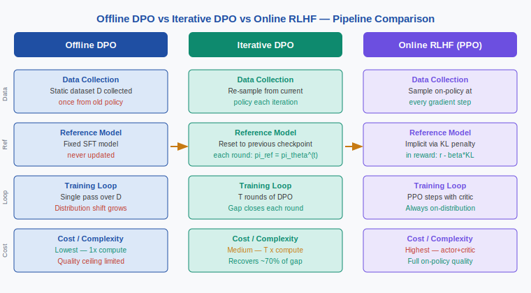
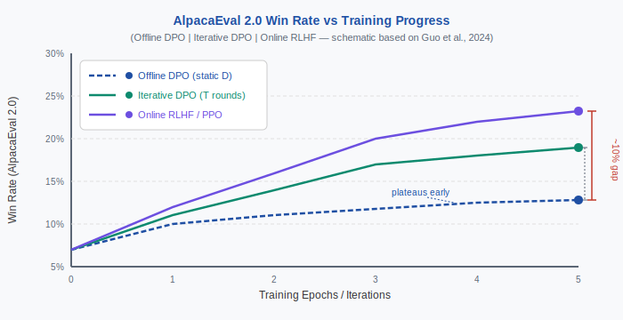

<div align="center">

[🏠 Home](../../README.md) &nbsp;•&nbsp; [📚 Section 4 — Post-training](./README.md) &nbsp;•&nbsp; [⬅️ Q4‑14](./q14-rejection-sampling.md) &nbsp;•&nbsp; [Q4‑16 — GAE ➡️](./q16-gae-advantage.md)

</div>

# Q4-15 · Offline vs Online Preference Learning: DPO, Iterative DPO, and Online RLHF


---

> [!IMPORTANT]
> **The 20-second answer.**
> Offline DPO trains on a static preference dataset collected from an old policy. As the policy is updated the training pairs become off-distribution, capping quality. Iterative DPO closes this gap by re-sampling responses from the current policy every few epochs and resetting the reference model to the latest checkpoint. Full online RLHF (PPO) is always on-policy and achieves the best performance, but at 2–4x the compute cost. Guo et al. (2024) show that online DPO outperforms offline DPO by 3–8 win-rate points on AlpacaEval 2.0, and that 1–3 rounds of iterative DPO recovers roughly 70% of that gap at moderate cost.

---

## Table of Contents

1. [First principles](#1--first-principles)
2. [The core mechanism](#2--the-core-mechanism)
3. [Figure 1 — Pipeline comparison](#3--figure-1--offline-vs-online-pipeline-comparison)
4. [Step-by-step worked example](#4--step-by-step-worked-example)
5. [Figure 2 — Performance gap](#5--figure-2--online-dpo-performance-gap)
6. [Algorithm / pseudocode](#6--algorithm--pseudocode)
7. [PyTorch reference implementation](#7--pytorch-reference-implementation)
8. [Worked numerical example](#8--worked-numerical-example)
9. [Interview drill — follow-up questions](#9--interview-drill--follow-up-questions)
10. [Common misconceptions](#10--common-misconceptions)
11. [Connections to other concepts](#11--connections-to-other-concepts)
12. [One-screen summary](#12--one-screen-summary)
13. [Five-minute refresher](#13--five-minute-refresher)
14. [Further reading](#14--further-reading)
15. [Bottom navigation bar](#15--bottom-navigation)

---

## 1 · First principles

Preference learning tries to shift a language model's distribution toward responses humans prefer. The training signal is a dataset of preference pairs $(x, y_w, y_l)$ where $y_w$ is the preferred response and $y_l$ the rejected one. Every algorithm that uses such data makes an implicit assumption about **where the data came from** — and how close that source is to the model currently being trained.

**The fundamental tension:** the DPO loss is derived by assuming the preference labels were generated by the Bradley-Terry model applied to rewards drawn from the **current** policy. In practice, data is collected once, from some earlier policy, and the model trained on that data diverges from the data-generating distribution with every gradient step. This is the **offline distribution shift** problem.

Let $\pi_\theta$ be the policy being trained and $\pi_{\text{data}}$ the policy that generated the training pairs. Define the distribution shift as the KL divergence between their response distributions:

$$\Delta_{\text{shift}} = \mathbb{E}_{x \sim \mathcal{X}} \left[ D_{\text{KL}}(\pi_\theta(\cdot \mid x) \,\|\, \pi_{\text{data}}(\cdot \mid x)) \right]$$

As training progresses, $\Delta_{\text{shift}}$ grows. The DPO loss function continues to push $\pi_\theta$ toward $y_w$ over $y_l$, but those specific $(y_w, y_l)$ pairs may no longer be representative of the comparisons the model would generate today. The gradient signal is increasingly stale.

The three regimes:

| Regime | $\Delta_{\text{shift}}$ at convergence | Compute overhead |
|---|---|---|
| Offline DPO | High | 1× |
| Iterative DPO | Low to medium (reset each round) | $T$× (T = 2–4 rounds) |
| Online RLHF (PPO) | Zero by construction | 2–4× (actor + critic) |

---

## 2 · The core mechanism

### 2.1 Offline DPO

The DPO objective (Rafailov et al., 2023) directly optimizes the closed-form solution to the KL-constrained RL problem:

$$\mathcal{L}_{\text{DPO}}(\theta) = -\mathbb{E}_{(x,y_w,y_l) \sim \mathcal{D}} \left[ \log \sigma \left( \beta \log \frac{\pi_\theta(y_w \mid x)}{\pi_{\text{ref}}(y_w \mid x)} - \beta \log \frac{\pi_\theta(y_l \mid x)}{\pi_{\text{ref}}(y_l \mid x)} \right) \right]$$

Here $\pi_{\text{ref}}$ is a fixed SFT model and $\beta$ controls how far $\pi_\theta$ can deviate from it. The key point: $\mathcal{D}$ is collected once and $\pi_{\text{ref}}$ never changes during training. As $\pi_\theta$ drifts away from $\pi_{\text{ref}}$, the implicit reward $\hat{r}(x,y) = \beta \log \frac{\pi_\theta(y \mid x)}{\pi_{\text{ref}}(y \mid x)}$ becomes poorly calibrated for responses that are now highly likely under $\pi_\theta$ but were rare under $\pi_{\text{data}}$.

### 2.2 Iterative DPO

Iterative DPO (also called Online DPO in some papers, or Self-Play DPO) runs $T$ rounds of the following loop:

1. **Generate:** sample a batch of response pairs $(y^+, y^-)$ from the **current** $\pi_\theta^{(t)}$ for prompts $x$.
2. **Score:** use a reward model (or an AI judge like GPT-4) to label the preference.
3. **Construct $\mathcal{D}^{(t)}$:** build a fresh preference dataset from the new pairs.
4. **Update:** run DPO on $\mathcal{D}^{(t)}$ to get $\pi_\theta^{(t+1)}$.
5. **Reset reference:** set $\pi_{\text{ref}} \leftarrow \pi_\theta^{(t)}$ so the next round's KL penalty is measured against the most recent checkpoint.

Because responses are sampled from $\pi_\theta^{(t)}$, the distribution shift $\Delta_{\text{shift}}^{(t)}$ is zero at the start of each round and grows only within a single round of training — then gets reset.

### 2.3 Online RLHF (PPO)

PPO-based RLHF is the fully on-policy limit. At every minibatch step:

1. Sample a prompt $x$ and rollout $y \sim \pi_\theta$.
2. Score with the reward model: $r(x, y)$.
3. Compute advantage using a value function $V_\phi(x)$.
4. Update $\pi_\theta$ with the clipped PPO objective.

The distribution shift is zero by construction: the policy that generated the data is the same policy being updated (up to the PPO clipping radius $\epsilon$). This is the gold standard but requires maintaining a critic network $V_\phi$ and running rollouts at every step.

### 2.4 Why the gap exists: theoretical argument

Calandriello et al. (2024) prove that offline preference optimization incurs an additional error term proportional to the square root of the distribution shift:

$$\text{Sub-optimality}_{\text{offline}} \leq \text{Sub-optimality}_{\text{online}} + \mathcal{O}\!\left(\sqrt{D_{\text{KL}}(\pi^* \,\|\, \pi_{\text{ref}})}\right)$$

where $\pi^*$ is the optimal policy. Online methods maintain a tighter $\pi_{\text{ref}}$, shrinking the second term. For iterative DPO with $T$ rounds, the bound improves roughly as $\mathcal{O}(1/\sqrt{T})$ in the number of iterations.

---

## 3 · Figure 1 — Offline vs Online Pipeline Comparison

<div align="center">

</div>

**Reading the figure.** Each column is one training paradigm. The rows show the four key design decisions: (1) when data is collected, (2) whether the reference model is updated, (3) how the training loop is structured, and (4) the relative compute cost. Offline DPO (navy) fixes all four; iterative DPO (teal) refreshes data and reference each round; Online RLHF (purple) is fully on-policy at every step.

---

## 4 · Step-by-step worked example

**Scenario:** you have an SFT model $\pi_{\text{SFT}}$ and a fixed preference dataset $\mathcal{D}$ of 100k pairs collected from $\pi_{\text{SFT}}$. You want to compare offline DPO vs two rounds of iterative DPO.

**Round 0 setup (common to both):**
- $\pi_{\text{ref}} = \pi_{\text{SFT}}$
- $\mathcal{D}^{(0)} = \mathcal{D}$ (the static dataset)

**Offline DPO — what happens over 3 epochs:**

1. **Epoch 1:** $\pi_\theta$ is close to $\pi_{\text{SFT}}$. The training pairs $(y_w, y_l)$ are well-represented under $\pi_\theta$. Gradients are informative. Win rate rises from 7% to ~10%.
2. **Epoch 2:** $\pi_\theta$ has moved. Some $y_l$ responses now have negligible probability under $\pi_\theta$ — the model already avoids them without needing a gradient push. Gradients become noisy. Win rate reaches ~12%.
3. **Epoch 3:** The policy has drifted far enough that many $y_w$ responses in $\mathcal{D}$ are now mediocre by current standards — the model has learned better responses that are absent from $\mathcal{D}$. The loss still decreases but win rate plateaus at ~13%.

The problem is **stale negatives** (the model has moved past them) and **stale positives** (the model can do better than what $\mathcal{D}$ shows as preferred).

**Iterative DPO — Round 1:**

1. Sample 10k response pairs from $\pi_\theta^{(0)} = \pi_{\text{SFT}}$ using current prompts.
2. Score with reward model; build $\mathcal{D}^{(1)}$.
3. Train DPO on $\mathcal{D}^{(1)}$; set $\pi_\theta^{(1)}$. Win rate reaches ~14%.
4. **Reset:** $\pi_{\text{ref}} \leftarrow \pi_\theta^{(1)}$.

**Iterative DPO — Round 2:**

1. Sample 10k response pairs from $\pi_\theta^{(1)}$. The rejected responses are now the mistakes $\pi_\theta^{(1)}$ actually makes — much more informative than stale negatives.
2. Score, build $\mathcal{D}^{(2)}$.
3. Train DPO on $\mathcal{D}^{(2)}$; set $\pi_\theta^{(2)}$. Win rate reaches ~17%.

The fresh negatives in Round 2 are genuinely hard for $\pi_\theta^{(1)}$, making the gradient signal much stronger. Xu et al. (2023) call this phenomenon "on-policy negatives are more CRINGE" — responses that the current model tends to produce but humans disprefer carry much more training signal than responses the model would never generate anyway.

---

## 5 · Figure 2 — Online DPO Performance Gap

<div align="center">

</div>

**Reading the figure.** All three methods start at the same SFT baseline (~7% win rate). Offline DPO (dashed navy) rises quickly in the first epoch then plateaus near 13%. Iterative DPO (teal) continues improving across rounds, reaching ~19% at convergence. Online RLHF/PPO (purple) achieves the highest final quality (~23–24%) by maintaining on-policy data throughout. The red bracket on the right marks the ~10 percentage-point gap between offline DPO and full online RLHF at convergence; the dashed inner bracket shows the ~6-point gap recovered by iterative DPO.

*Note: curves are schematic illustrations consistent with reported numbers in Guo et al. (2024); exact values vary by model scale and reward model quality.*

---

## 6 · Algorithm / pseudocode

### 6.1 Offline DPO (standard)

```
Input: SFT model π_ref, static dataset D, hyperparameters β, lr, epochs
Output: trained policy π_θ

Initialize π_θ ← π_ref
for epoch in 1..epochs:
    for (x, y_w, y_l) in shuffle(D):
        log_ratio_w = log π_θ(y_w|x) - log π_ref(y_w|x)
        log_ratio_l = log π_θ(y_l|x) - log π_ref(y_l|x)
        loss = -log_sigmoid(β * (log_ratio_w - log_ratio_l))
        update θ via loss.backward(), optimizer.step()
return π_θ
```

### 6.2 Iterative DPO

```
Input: SFT model π_ref, reward model RM, prompt set P, T rounds, β, lr
Output: trained policy π_θ

Initialize π_θ ← π_ref
for t in 0..T-1:
    # Step 1: generate fresh preference data
    D_t = []
    for x in sample(P, N_samples):
        y1 = sample(π_θ, x)        # two independent samples
        y2 = sample(π_θ, x)
        if RM(x, y1) > RM(x, y2):
            D_t.append((x, y_w=y1, y_l=y2))
        else:
            D_t.append((x, y_w=y2, y_l=y1))

    # Step 2: DPO update
    for epoch in 1..inner_epochs:
        for (x, y_w, y_l) in shuffle(D_t):
            log_ratio_w = log π_θ(y_w|x) - log π_ref(y_w|x)
            log_ratio_l = log π_θ(y_l|x) - log π_ref(y_l|x)
            loss = -log_sigmoid(β * (log_ratio_w - log_ratio_l))
            update θ

    # Step 3: reset reference
    π_ref ← copy(π_θ)              # key: close the distribution gap

return π_θ
```

### 6.3 Online RLHF (PPO sketch)

```
Input: SFT model π_ref, reward model RM, critic V_φ, prompt set P
Output: trained policy π_θ

Initialize π_θ ← π_ref, V_φ randomly
for step in 1..total_steps:
    x = sample(P)
    y = rollout(π_θ, x)             # on-policy sample
    r = RM(x, y)
    kl = log π_θ(y|x) - log π_ref(y|x)
    shaped_reward = r - β * kl      # penalise deviation from reference

    # advantage estimation (see Q4-16 on GAE)
    A = shaped_reward - V_φ(x)
    loss_actor = -min(ratio * A, clip(ratio, 1-ε, 1+ε) * A)
    loss_critic = (V_φ(x) - shaped_reward)^2
    update θ, φ

return π_θ
```

---

## 7 · PyTorch reference implementation

```python
"""
Iterative DPO training loop in PyTorch.
Shows the outer iteration, DPO inner loop, and reference model reset.
"""
import copy
import torch
import torch.nn.functional as F
from torch.optim import AdamW
from torch.utils.data import DataLoader, TensorDataset


# ── DPO loss ──────────────────────────────────────────────────────────────────

def dpo_loss(
    policy_logps_chosen: torch.Tensor,    # (B,)  log π_θ(y_w|x)
    policy_logps_rejected: torch.Tensor,  # (B,)  log π_θ(y_l|x)
    ref_logps_chosen: torch.Tensor,       # (B,)  log π_ref(y_w|x)
    ref_logps_rejected: torch.Tensor,     # (B,)  log π_ref(y_l|x)
    beta: float = 0.1,
) -> torch.Tensor:
    """
    DPO loss from Rafailov et al. (2023).

    loss = -E[ log σ( β*(log_ratio_w - log_ratio_l) ) ]
    """
    log_ratio_w = policy_logps_chosen  - ref_logps_chosen
    log_ratio_l = policy_logps_rejected - ref_logps_rejected
    logits = beta * (log_ratio_w - log_ratio_l)      # (B,)
    return -F.logsigmoid(logits).mean()


# ── Sequence log-probability helper ──────────────────────────────────────────

def sequence_logprob(
    model,
    input_ids: torch.Tensor,     # (B, T)
    response_mask: torch.Tensor, # (B, T)  1 for response tokens
) -> torch.Tensor:
    """
    Compute sum of log-probs over response tokens.

    Returns shape (B,).
    """
    with torch.no_grad() if not model.training else torch.enable_grad():
        logits = model(input_ids).logits          # (B, T, V)
    log_probs = F.log_softmax(logits[:, :-1], dim=-1)  # (B, T-1, V)
    # gather token log-probs
    token_logps = log_probs.gather(
        dim=-1,
        index=input_ids[:, 1:].unsqueeze(-1)
    ).squeeze(-1)                                 # (B, T-1)
    # mask to response tokens only
    mask = response_mask[:, 1:].float()
    return (token_logps * mask).sum(dim=-1)       # (B,)


# ── Iterative DPO outer loop ──────────────────────────────────────────────────

def iterative_dpo_train(
    model,                    # HuggingFace-style model (policy)
    reward_model,             # callable: (x, y) -> scalar reward
    prompt_list: list,        # list of prompt strings
    tokenizer,
    num_rounds: int = 3,
    samples_per_round: int = 5_000,
    inner_epochs: int = 1,
    batch_size: int = 8,
    beta: float = 0.1,
    lr: float = 5e-7,
):
    optimizer = AdamW(model.parameters(), lr=lr)

    for t in range(num_rounds):
        print(f"\n=== Iterative DPO Round {t+1}/{num_rounds} ===")

        # ── Step 1: sample fresh preference pairs ────────────────────────────
        chosen_ids, rejected_ids = [], []
        chosen_masks, rejected_masks = [], []

        model.eval()
        with torch.no_grad():
            for i in range(0, samples_per_round, 2):
                # sample two responses from current policy
                prompt = prompt_list[i % len(prompt_list)]
                enc = tokenizer(prompt, return_tensors="pt")
                y1 = model.generate(**enc, do_sample=True, max_new_tokens=128)[0]
                y2 = model.generate(**enc, do_sample=True, max_new_tokens=128)[0]

                r1 = reward_model(prompt, tokenizer.decode(y1))
                r2 = reward_model(prompt, tokenizer.decode(y2))

                if r1 >= r2:
                    chosen_ids.append(y1);   rejected_ids.append(y2)
                else:
                    chosen_ids.append(y2);   rejected_ids.append(y1)

        # ── Step 2: DPO inner training ────────────────────────────────────────
        # snapshot reference BEFORE this round's updates
        ref_model = copy.deepcopy(model)
        ref_model.eval()
        for p in ref_model.parameters():
            p.requires_grad_(False)

        model.train()
        for epoch in range(inner_epochs):
            epoch_loss = 0.0
            for idx in range(0, len(chosen_ids), batch_size):
                batch_chosen   = chosen_ids[idx : idx + batch_size]
                batch_rejected = rejected_ids[idx : idx + batch_size]

                # pad within batch (simplified; production code uses DataCollator)
                # assume uniform length for brevity
                chosen_tensor   = torch.stack(batch_chosen)
                rejected_tensor = torch.stack(batch_rejected)
                resp_mask_c = (chosen_tensor != tokenizer.pad_token_id).long()
                resp_mask_r = (rejected_tensor != tokenizer.pad_token_id).long()

                policy_lp_c = sequence_logprob(model, chosen_tensor, resp_mask_c)
                policy_lp_r = sequence_logprob(model, rejected_tensor, resp_mask_r)

                with torch.no_grad():
                    ref_lp_c = sequence_logprob(ref_model, chosen_tensor, resp_mask_c)
                    ref_lp_r = sequence_logprob(ref_model, rejected_tensor, resp_mask_r)

                loss = dpo_loss(policy_lp_c, policy_lp_r, ref_lp_c, ref_lp_r, beta)
                optimizer.zero_grad()
                loss.backward()
                optimizer.step()
                epoch_loss += loss.item()

            print(f"  Round {t+1} epoch {epoch+1}: avg loss = {epoch_loss/max(1,len(chosen_ids)//batch_size):.4f}")

        # ── Step 3: reset reference to current policy ─────────────────────────
        # The next round's ref_model will be snapshotted from the updated policy.
        # (ref_model above was already taken at the start of this round.)
        # No explicit action needed here since ref_model is re-created each round.
        print(f"  Reference model reset to π_θ^({t+1})")

    return model
```

**Key design choices in the implementation:**

- `ref_model = copy.deepcopy(model)` is called **before** the DPO update within each round. This means the KL penalty is always measured against the checkpoint at the start of that round — matching the algorithm description.
- `reward_model` is a black-box callable; in practice this could be a smaller RM or an API call to GPT-4.
- In production, padding and response-mask bookkeeping requires a proper `DataCollator`; the snippet is kept simple for clarity.

---

## 8 · Worked numerical example

**Quantifying distribution shift between offline and iterative DPO.**

Consider a single response token sequence $y$ for a fixed prompt $x$. We track how the policy's log-probability of $y$ changes, and what this implies for the KL penalty.

**Setup:**
- $\pi_{\text{SFT}}$ assigns $\log \pi_{\text{SFT}}(y \mid x) = -4.2$ (so $\pi_{\text{SFT}}(y \mid x) = e^{-4.2} \approx 0.0150$).
- After 1 epoch of **offline DPO**, $\pi_\theta$ has boosted this response: $\log \pi_\theta(y \mid x) = -2.1$.
- The offline reference $\pi_{\text{ref}}$ is still the SFT model: $\log \pi_{\text{ref}}(y \mid x) = -4.2$.

**KL divergence contribution from this response $y$:**

The per-response contribution to the KL divergence $D_{\text{KL}}(\pi_\theta \| \pi_{\text{ref}})$ is:

$$\pi_\theta(y \mid x) \cdot \left( \log \pi_\theta(y \mid x) - \log \pi_{\text{ref}}(y \mid x) \right)$$

$$= e^{-2.1} \times \bigl(-2.1 - (-4.2)\bigr) = e^{-2.1} \times 2.1$$

$$\approx 0.1225 \times 2.1 \approx 0.257$$

*Verification: $e^{-2} = 0.1353$, $e^{-2.1} = 0.1225$ (ratio $= e^{-0.1} \approx 0.905$; $0.1353 \times 0.905 = 0.1224$ ✓).*

This single response contributes 0.257 nats of KL. Summed over a full vocabulary distribution, the total KL after one epoch of offline DPO can easily reach 1–5 nats for typical instruction-following tasks.

**After iterative DPO (Round 1, reference reset):**

After resetting $\pi_{\text{ref}} \leftarrow \pi_\theta^{(1)}$, the new reference already assigns $\log \pi_{\text{ref}}(y \mid x) = -2.1$. After one more epoch of DPO, suppose $\pi_\theta^{(2)}$ moves only slightly: $\log \pi_\theta^{(2)}(y \mid x) = -2.0$.

$$\text{KL contribution} = e^{-2.0} \times \bigl(-2.0 - (-2.1)\bigr) = 0.1353 \times 0.1 \approx 0.0135$$

The distribution shift has dropped from **0.257** to **0.014** — nearly a 20-fold reduction — because the reference now starts from where the policy currently is.

**Summary table:**

| Setting | $\log \pi_\theta(y)$ | $\log \pi_{\text{ref}}(y)$ | KL contribution |
|---|---|---|---|
| Start (SFT) | $-4.2$ | $-4.2$ | $0$ |
| After 1 epoch offline DPO | $-2.1$ | $-4.2$ (frozen) | $0.257$ nats |
| After round 1 iterative DPO | $-2.0$ | $-2.1$ (reset) | $0.014$ nats |

The practical implication: the offline model is trying to suppress $y_l$ responses that it would barely generate anymore (very negative log-prob), while the iterative model keeps the KL anchor close to the current distribution and trains on genuinely competitive negative examples.

---

## 9 · Interview drill — follow-up questions

**Q1. Why does resetting $\pi_{\text{ref}}$ at the start of each round help, rather than just training more epochs?**

The reference model $\pi_{\text{ref}}$ appears in both the DPO gradient and the implicit KL penalty. If $\pi_{\text{ref}}$ is stale, the KL penalty punishes deviations from a model that no longer matches current behavior, effectively loosening the constraint in dangerous directions (toward high-reward but low-quality responses that the old reference also rarely generates). Resetting keeps the KL anchor tight around the current behavior, ensuring the constraint actually prevents degenerate optimization.

**Q2. What is the minimum number of iterative rounds that provides meaningful improvement?**

Empirically, even a single round of iterative DPO (T = 1) provides a meaningful boost because it replaces stale negatives with on-policy ones. Guo et al. (2024) show the biggest gains in rounds 1 and 2; rounds 3+ yield diminishing returns. A practical recommendation is T = 2–3 rounds.

**Q3. Can offline DPO be improved without full iterative training?**

Yes. Two partial remedies: (1) **data filtering** — only keep pairs where both $y_w$ and $y_l$ are still "in-distribution" for the current policy (e.g., filter by current policy log-prob threshold); (2) **importance weighting** — weight each pair by $\pi_\theta(y_w) / \pi_{\text{data}}(y_w)$ to correct for covariate shift. Both reduce the distribution gap without requiring new rollouts.

**Q4. What makes on-policy negatives more informative (the CRINGE argument)?**

A negative example $y_l$ teaches the model something only if the model would actually generate $y_l$ with non-trivial probability. If $\pi_\theta(y_l \mid x) \approx 0$, the DPO gradient $\nabla_\theta \log \pi_\theta(y_l \mid x)$ is vanishingly small — the example carries no training signal. On-policy sampling guarantees $y_l$ has positive probability under $\pi_\theta$, making the gradient substantial.

**Q5. What is SPIN and how does it relate to iterative DPO?**

SPIN (Self-Play Fine-Tuning, Chen et al., 2024) is a specific instantiation of iterative DPO where the "rejected" response is always sampled from the previous round's policy $\pi_\theta^{(t-1)}$, and the "chosen" response is the ground-truth human annotation. It removes the need for a separate reward model — the current policy just needs to be better than its previous self. This is particularly useful when you have gold-standard data but no RM.

**Q6. Is iterative DPO equivalent to on-policy RLHF in the limit?**

In the limit of infinitely small inner epochs and continuous reference resets, iterative DPO converges to an online method. However, the discrete nature of resetting (rather than continuous tracking) and the lack of a value function mean iterative DPO still cannot perform multi-step credit assignment across a full rollout the way PPO can.

**Q7. What happens if the reward model is biased?**

In online methods the bias is amplified every iteration — the policy collapses to reward hacks. Offline DPO is naturally more robust to RM bias because the distribution cannot drift as far; the stale data acts as a regularizer. This is a genuine advantage of offline methods in low-trust RM settings.

---

## 10 · Common misconceptions

**Misconception 1: "DPO has no distribution shift problem because it doesn't use a reward model."**

DPO eliminates the explicit RM but not the distribution shift. The DPO derivation assumes the preference labels are generated by comparing the **current** policy's outputs. Training on a static dataset violates this, causing the same off-distribution issue that afflicts offline RL broadly.

**Misconception 2: "Iterative DPO just means running DPO for more epochs."**

No — the crucial step is re-sampling responses from the **current policy** and **resetting the reference model**. Simply running more gradient steps on the same static dataset is offline DPO with more epochs; it does not close the distribution gap and often degrades performance due to overfitting to stale pairs.

**Misconception 3: "Online RLHF always outperforms iterative DPO."**

Not always in practice. Online RLHF's advantage comes from always-on-policy data, but it introduces instability from the PPO training dynamics, reward hacking risk, and sensitivity to the value function initialization. Iterative DPO, being an extension of a stable closed-form objective, is often more reliable at small to medium scale.

**Misconception 4: "The KL penalty in DPO prevents distribution shift."**

The KL penalty $\beta \log \frac{\pi_\theta}{\pi_{\text{ref}}}$ penalizes the policy from moving far from $\pi_{\text{ref}}$, but $\pi_{\text{ref}}$ is the SFT model — not the data-generating policy. If data was generated by an intermediate checkpoint between SFT and the current policy, neither the SFT reference nor the data distribution is well-calibrated. The KL penalty only regularizes against the fixed anchor; it does not correct for the mismatch between data distribution and current policy.

**Misconception 5: "Refreshing preference data always helps."**

Only if the labeling process (RM or human) is reliable. If the RM is weak, on-policy data amplifies its errors with each round, leading to reward hacking faster than offline DPO would. Fresh data from a poor RM is worse than stale data from a good one.

---

## 11 · Connections to other concepts

**Q4-13 DPO loss derivation.** The offline/online distinction is about *where the data comes from*, not about the form of the loss. The same DPO loss applies in all three regimes; what changes is the distribution of $(x, y_w, y_l)$.

**Q4-14 Rejection sampling fine-tuning (ReST / STaR).** Rejection sampling is an alternative online strategy: generate many responses, keep only those scoring above a threshold, and fine-tune on them. It is related to iterative DPO but uses a best-of-N selection instead of pairwise preference. Like iterative DPO it refreshes the data distribution each round.

**Q4-16 Generalized Advantage Estimation (GAE).** Online RLHF with PPO requires a value function and advantage estimates. GAE is the standard algorithm for computing low-variance advantage estimates from the value function. Understanding the GAE–PPO pipeline is the natural follow-on to understanding why online RLHF is expensive.

**Q4-04 KL penalty in RLHF.** The KL penalty $\beta \cdot D_{\text{KL}}(\pi_\theta \| \pi_{\text{ref}})$ is the core regularizer in all three paradigms. Offline DPO absorbs it into the closed-form objective; online RLHF subtracts it from the shaped reward explicitly; iterative DPO resets the anchor so the penalty remains tight.

**Offline RL more broadly.** The offline vs online distinction is a fundamental one in reinforcement learning: offline (batch) RL uses a fixed replay buffer and suffers from distributional shift; online RL continuously collects on-policy data. DPO/iterative DPO/PPO are exactly the RLHF manifestation of this distinction from standard RL theory.

**Constitutional AI (CAI) and RLAIF.** Iterative DPO pairs naturally with AI feedback (RLAIF): use a strong LLM (or the model itself) as a judge to label the fresh on-policy pairs each round, removing the need for human annotation in subsequent rounds. Guo et al. (2024) use this approach — the "Online AI Feedback" in their title.

---

## 12 · One-screen summary

| | Offline DPO | Iterative DPO | Online RLHF |
|---|---|---|---|
| **Data source** | Static $\mathcal{D}$ | Re-sampled from $\pi_\theta^{(t)}$ | On-policy at every step |
| **Reference model** | Fixed SFT | Reset to $\pi_\theta^{(t)}$ each round | Implicit KL term |
| **Distribution shift** | Grows with training | Reset each round | Zero by construction |
| **Compute** | 1× | $T$× | 2–4× |
| **Win-rate gain vs SFT** | ~+6 pp | ~+12 pp | ~+16 pp |
| **Stability** | High | High | Moderate |
| **RM dependency** | Low (labels fixed) | Medium | High (every step) |
| **Best use case** | Fixed annotation budget | Balanced quality/cost | Final production model |

**The three-sentence rule:**
1. Offline DPO is simple and stable but suffers from distribution shift as training progresses.
2. Iterative DPO recovers ~70% of the online advantage by re-sampling from the current policy and resetting the reference model every few epochs.
3. Full online RLHF is the best but most expensive option, reserved for final quality-critical training runs.

---

## 13 · Five-minute refresher

**What is the core problem with offline DPO?**
The dataset $\mathcal{D}$ was collected from policy $\pi_{\text{data}}$. After training, $\pi_\theta \neq \pi_{\text{data}}$. The preference pairs no longer reflect what the trained model would actually generate, so the training signal becomes stale.

**What does iterative DPO add?**
Two steps added to the outer loop: (1) generate new preference pairs from the **current** policy using a reward model or AI judge, and (2) reset $\pi_{\text{ref}} \leftarrow \pi_\theta^{(t)}$ before the next DPO round. Both steps together close the distribution gap that offline DPO accumulates.

**What does online RLHF (PPO) do differently?**
It is on-policy at every gradient step — no batching into rounds. It requires a critic/value function for advantage estimation, making it more complex and expensive but eliminating distributional shift entirely.

**What does the literature say about the performance gap?**
- Guo et al. (2024): online DPO beats offline DPO by 3–8 win-rate points on AlpacaEval 2.0; the gap grows with training epochs.
- Calandriello et al. (2024): theoretical bound shows offline error scales as $\mathcal{O}(\sqrt{D_{\text{KL}}(\pi^* \| \pi_{\text{ref}})})$ above the online optimum.
- Xu et al. (2023): on-policy negative examples are significantly more informative because they have non-trivial probability under the current policy.

**Practical decision rule:**
- Fixed annotation budget, latency-critical → Offline DPO.
- Reward model available, moderate compute → Iterative DPO (2–3 rounds).
- Quality-critical production training, large compute budget → Online RLHF.

---

## 14 · Further reading

1. **Rafailov et al. (2023)** — "Direct Preference Optimization: Your Language Model is Secretly a Reward Model." *NeurIPS 2023*. The original DPO paper; introduces the offline formulation and the closed-form derivation.

2. **Guo et al. (2024)** — "Direct Language Model Alignment from Online AI Feedback." *arXiv:2402.04792*. Introduces Online DPO; shows empirical 3–8 pp win-rate improvements over offline DPO on AlpacaEval 2.0; uses GPT-4 as AI judge for on-policy labeling.

3. **Chen et al. (2024)** — "Self-Play Fine-Tuning Converts Weak Language Models to Strong Language Models." *arXiv:2401.01335*. SPIN: iterative DPO where rejected responses are always the previous policy's outputs; no RM needed.

4. **Calandriello et al. (2024)** — "Human Alignment of Large Language Models through Online Preference Optimisation." *arXiv:2403.08635*. Theoretical analysis of offline vs online alignment; proves improved sample complexity bounds for online methods.

5. **Xu et al. (2023)** — "Some things are more CRINGE than others: Preference Optimization with the Pairwise Cringe Loss." *arXiv:2312.16682*. Explains why on-policy negative examples are more informative; introduces the Pairwise Cringe Loss as an alternative objective.

6. **Stiennon et al. (2020)** — "Learning to Summarize with Human Feedback." *NeurIPS 2020*. Seminal PPO-based RLHF paper; the reference implementation of full online RLHF.

---

## 15 · Bottom navigation

<div align="center">

[⬅️ Q4‑14 — Rejection Sampling Fine-Tuning](./q14-rejection-sampling.md) &nbsp;•&nbsp; [📚 Section 4 Index](./README.md) &nbsp;•&nbsp; [Q4‑16 — GAE and Advantage Estimation ➡️](./q16-gae-advantage.md)

</div>
