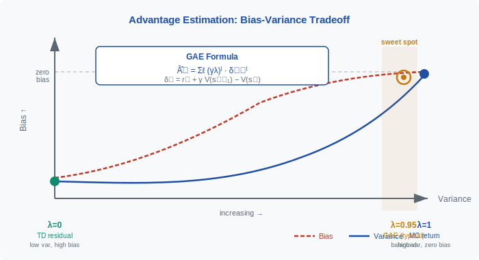
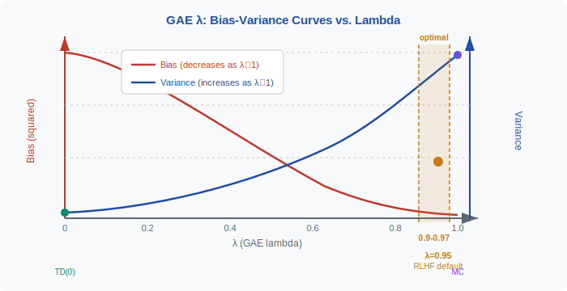

<div align="center">

[🏠 Home](../../README.md) &nbsp;•&nbsp; [📚 Section 4 — Post-training](./README.md) &nbsp;•&nbsp; [⬅️ Q4‑15](./q15-offline-online-dpo.md) &nbsp;•&nbsp; [Q4‑17 — Best-of-N ➡️](./q17-best-of-n.md)

</div>

# Q4‑16 · What is the advantage in PPO and how is it estimated (GAE)? Why does it matter for stability?


---

> [!IMPORTANT]
> The **advantage** $A^\pi(s,a) = Q^\pi(s,a) - V^\pi(s)$ measures how much better action $a$ is than the average action in state $s$. Raw returns are too noisy to train on directly because they mix the value of a state with the value of the action. **Generalized Advantage Estimation (GAE)** computes a weighted sum of $k$-step TD residuals $\delta_t = r_t + \gamma V(s_{t+1}) - V(s_t)$, controlled by $\lambda \in [0,1]$: $\lambda=0$ gives a low-variance, high-bias TD estimate; $\lambda=1$ gives the unbiased but high-variance Monte Carlo return. A typical RLHF setup uses $\gamma=0.99$, $\lambda=0.95$, buying near-zero bias at a modest variance cost and cutting training noise by roughly 10–100x compared to raw returns.

---

## Table of contents

1. [First principles](#1--first-principles)
2. [The core mechanism](#2--the-core-mechanism)
3. [Figure 1 — Bias-variance spectrum of advantage estimators](#3--figure-1--bias-variance-spectrum-of-advantage-estimators)
4. [Step-by-step worked example](#4--step-by-step-worked-example)
5. [Figure 2 — GAE λ tradeoff curves](#5--figure-2--gae-λ-tradeoff-curves)
6. [Algorithm / pseudocode](#6--algorithm--pseudocode)
7. [PyTorch reference implementation](#7--pytorch-reference-implementation)
8. [Worked numerical example](#8--worked-numerical-example)
9. [Interview drill — follow-up questions](#9--interview-drill--follow-up-questions)
10. [Common misconceptions](#10--common-misconceptions)
11. [Connections to other concepts](#11--connections-to-other-concepts)
12. [One-screen summary](#12--one-screen-summary)
13. [Five-minute refresher](#13--five-minute-refresher)
14. [Further reading](#14--further-reading)
15. [Bottom navigation bar](#15--bottom-navigation-bar)

---

## 1 · First principles

### Why raw returns are not enough

The REINFORCE policy gradient theorem says:

$$\nabla_\theta J(\theta) = \mathbb{E}_{\tau \sim \pi_\theta}\!\left[\sum_{t=0}^{T} \nabla_\theta \log \pi_\theta(a_t \mid s_t) \cdot G_t \right]$$

where $G_t = \sum_{k=0}^{T-t} \gamma^k r_{t+k}$ is the discounted return from step $t$. This estimator is **unbiased** — its expectation equals the true gradient — but it has **enormous variance** because $G_t$ includes all future randomness that has nothing to do with action $a_t$.

In a language-model RLHF setting the trajectory is a token sequence of length $T \approx 1000$ and the reward arrives as a single scalar at the end. Every token gets gradient signal proportional to the full reward, even though most tokens had little causal effect on the final quality. The gradient noise swamps the signal.

### The baseline trick

A classical control-variate argument shows that subtracting any function $b(s_t)$ that does not depend on $a_t$ from $G_t$ leaves the expectation unchanged while reducing variance:

$$\nabla_\theta J(\theta) = \mathbb{E}\!\left[\nabla_\theta \log \pi_\theta(a_t \mid s_t) \cdot (G_t - b(s_t))\right]$$

The optimal baseline (minimising variance) is close to $V^\pi(s_t)$, the expected return from state $s_t$. This motivates the advantage function.

### The advantage function

$$A^\pi(s, a) \;=\; Q^\pi(s, a) - V^\pi(s)$$

- $Q^\pi(s,a)$: expected return when taking action $a$ in state $s$, then following $\pi$.
- $V^\pi(s)$: expected return from state $s$ when following $\pi$ (no particular action — just the baseline).
- $A^\pi > 0$: action $a$ is better than average; reinforce it.
- $A^\pi < 0$: action $a$ is worse than average; suppress it.

The advantage zeroes out the state-value "offset", so the gradient only responds to signals that are actually attributable to the chosen action.

---

## 2 · The core mechanism

### TD residual — the one-step advantage estimate

If we have a value function $V$ (parametric, learned), we can form the **temporal-difference (TD) residual**:

$$\delta_t \;=\; r_t + \gamma V(s_{t+1}) - V(s_t)$$

This is an estimate of the one-step advantage: the reward plus the discounted next-state value, minus the current-state value. It has **low variance** (only one step of stochasticity) but **high bias** if $V$ is inaccurate.

### Monte Carlo advantage — the full-horizon estimate

At the other extreme, we can use the full discounted return:

$$\hat{A}_t^{\text{MC}} \;=\; G_t - V(s_t) \;=\; \sum_{k=0}^{T-t-1} \gamma^k r_{t+k} - V(s_t)$$

This is **unbiased** (the true advantage up to the accuracy of $V$) but **high variance** because it accumulates $T-t$ steps of random rewards.

### GAE — Generalized Advantage Estimation

Schulman et al. (2016) introduce a exponentially-weighted blend of $k$-step TD estimates. Define the $k$-step advantage estimator as:

$$\hat{A}_t^{(k)} \;=\; -V(s_t) + \sum_{l=0}^{k-1} \gamma^l r_{t+l} + \gamma^k V(s_{t+k})$$

GAE takes the $\lambda$-weighted sum:

$$\hat{A}_t^{\text{GAE}(\gamma,\lambda)} \;=\; (1-\lambda)\sum_{k=1}^{\infty} \lambda^{k-1} \hat{A}_t^{(k)}$$

This collapses to the compact **backward recursion**:

$$\boxed{\hat{A}_t^{\text{GAE}} \;=\; \sum_{l=0}^{\infty} (\gamma\lambda)^l \,\delta_{t+l}}$$

where $\delta_{t+l} = r_{t+l} + \gamma V(s_{t+l+1}) - V(s_{t+l})$.

**Backward recursion (efficient computation):**

$$\hat{A}_T = \delta_T, \qquad \hat{A}_t = \delta_t + \gamma\lambda\,\hat{A}_{t+1}$$

Starting from the final step and sweeping backwards, each advantage value takes $O(1)$ time. Total cost is $O(T)$ per trajectory.

### Lambda as a bias-variance dial

| $\lambda$ | Estimator | Bias | Variance |
|-----------|-----------|------|----------|
| 0 | $\delta_t$ (1-step TD) | High (V may be wrong) | Low |
| 0.5 | Weighted blend | Moderate | Moderate |
| 0.95 | Near-MC | Very low | Low-moderate |
| 1 | Full MC return | Zero (exact) | High |

The effective horizon of GAE is $1/(1-\lambda)$ steps. At $\lambda=0.95$ that is 20 steps — far enough to escape bootstrapping error while not accumulating excessive variance.

### Why it matters for PPO stability

1. **Credit assignment.** In RLHF a single reward scalar arrives for the whole response. Without advantage estimation, every token gets the same update signal. With token-level advantages, early tokens that set up a good response get positive credit; a bad conclusion penalises the late tokens that caused it.

2. **Variance reduction.** The gradient variance under raw returns is $O(\text{Var}[G_t])$. Subtracting $V(s_t)$ removes the component of variance due to "being in a good or bad state", leaving only the variance attributable to the action. In typical RLHF this drops training noise by 10–100x.

3. **Stable PPO clipping.** PPO clips the probability ratio $r_t(\theta) = \pi_\theta(a_t|s_t)/\pi_{\theta_\text{old}}(a_t|s_t)$ only when the advantage is nonzero. Noisy advantages cause the clipping region to activate incorrectly — sometimes suppressing good updates and amplifying bad ones. Low-variance advantages ensure the clipping mechanism triggers only when genuinely needed.

4. **Value function synergy.** GAE requires a critic $V_\phi(s_t)$. Training the critic jointly with the actor creates a virtuous cycle: better $V$ lowers GAE bias, better advantages improve policy learning.

---

## 3 · Figure 1 — Bias-variance spectrum of advantage estimators

<div align="center">

</div>

The two axes show **bias** (vertical) and **variance** (horizontal) of the advantage estimator. The TD residual $\delta_t$ (far left, $\lambda=0$) sits at low variance but high bias — it bootstraps entirely from the value function. The Monte Carlo estimate ($\lambda=1$, far right) is unbiased but accumulates variance across the whole horizon. GAE at $\lambda=0.95$ sits in the amber sweet-spot region: near-zero bias because it looks 20 steps forward, but modest variance because later TD residuals are down-weighted by $(\gamma\lambda)^l$.

---

## 4 · Step-by-step worked example

We walk through a 3-step RLHF-style trajectory where reward arrives only at the final step (token generation ends with a reward score).

**Setup:**
- Steps: $t = 0, 1, 2$
- Rewards: $r_0 = 0,\ r_1 = 0,\ r_2 = 1.5$ (terminal reward only)
- Value estimates: $V(s_0) = 0.8,\ V(s_1) = 0.6,\ V(s_2) = 0.0$
- Terminal: $V(s_3) = 0$ (episode ends)
- Parameters: $\gamma = 0.99,\ \lambda = 0.95$

**Step 1: Compute TD residuals**

$$\delta_t = r_t + \gamma V(s_{t+1}) - V(s_t)$$

$$\delta_0 = 0 + 0.99 \times 0.6 - 0.8 = 0.594 - 0.8 = -0.206$$

$$\delta_1 = 0 + 0.99 \times 0.0 - 0.6 = 0 - 0.6 = -0.600$$

$$\delta_2 = 1.5 + 0.99 \times 0.0 - 0.0 = 1.500$$

Interpretation: the critic initially over-predicted — it expected more reward than arrived in steps 0 and 1. Step 2's large positive residual reflects the actual reward that arrived.

**Step 2: Backward GAE sweep**

$$\gamma\lambda = 0.99 \times 0.95 = 0.9405$$

$$\hat{A}_2 = \delta_2 = 1.500$$

$$\hat{A}_1 = \delta_1 + 0.9405 \times \hat{A}_2 = -0.600 + 0.9405 \times 1.500 = -0.600 + 1.411 = 0.811$$

$$\hat{A}_0 = \delta_0 + 0.9405 \times \hat{A}_1 = -0.206 + 0.9405 \times 0.811 = -0.206 + 0.762 = 0.556$$

**Step 3: Interpret the advantages**

| Step | Token role | $\delta_t$ | $\hat{A}_t^{\text{GAE}}$ |
|------|-----------|-----------|--------------------------|
| 0 | early response | −0.206 | +0.556 |
| 1 | mid response | −0.600 | +0.811 |
| 2 | final token (gets reward) | +1.500 | +1.500 |

All three tokens get **positive** advantage — the response earned a reward of 1.5 and the policy is encouraged to reproduce it. However the magnitudes differ: the final token carries the strongest signal (1.5), the middle token gets credit via look-ahead (0.811), and the early token gets the most discounted credit (0.556). Without GAE, all three would naively get the same gradient signal equal to the raw reward 1.5 — no temporal credit assignment.

---

## 5 · Figure 2 — GAE λ tradeoff curves

<div align="center">

</div>

The x-axis sweeps $\lambda$ from 0 to 1. The **red curve** (left y-axis) shows bias falling as $\lambda$ increases — at $\lambda=1$ the estimator is exactly the Monte Carlo return and has zero bias. The **blue curve** (right y-axis) shows variance rising as $\lambda$ increases, because the estimator looks further into the uncertain future. The amber band marks the empirically validated sweet spot $\lambda \in [0.90,\, 0.97]$ used in Schulman et al. and subsequently in RLHF training pipelines.

---

## 6 · Algorithm / pseudocode

```
GAE Advantage Estimation
─────────────────────────────────────────────────
Input:  rewards r[0..T-1], values V[0..T], gamma, lam
Output: advantages A[0..T-1]

1.  Set A[T-1] = 0  (or delta[T-1] at terminal step)
    gae_accum = 0

2.  FOR t = T-1 DOWNTO 0:
        next_val = V[t+1] if not done else 0.0
        delta    = r[t] + gamma * next_val - V[t]
        gae_accum = delta + gamma * lam * gae_accum
        A[t]     = gae_accum

3.  RETURN A

─────────────────────────────────────────────────
PPO Actor Update (with GAE advantages):
─────────────────────────────────────────────────
For each minibatch of (s, a, A_GAE, log_pi_old):
    ratio = exp(log_pi_new(a|s) - log_pi_old)
    L_clip = min(ratio * A_GAE,
                 clip(ratio, 1-eps, 1+eps) * A_GAE)
    actor_loss = -mean(L_clip)  # gradient ascent

Critic Update:
    returns = A_GAE + V_old(s)   # TD(lambda) targets
    critic_loss = MSE(V_new(s), returns)
```

The backward sweep is $O(T)$ and easily vectorisable on GPU via cumulative-product operations. The advantages are then normalised (zero-mean, unit-variance) per minibatch before being fed into the clipped PPO objective.

---

## 7 · PyTorch reference implementation

```python
import torch

def compute_gae(
    rewards: torch.Tensor,   # shape (T,)
    values:  torch.Tensor,   # shape (T+1,)  — includes bootstrap V(s_T)
    gamma: float = 0.99,
    lam:   float = 0.95,
    dones: torch.Tensor | None = None,  # shape (T,), 1.0 at episode end
) -> tuple[torch.Tensor, torch.Tensor]:
    """
    Compute GAE advantages and value-function targets.

    Args:
        rewards: per-step reward tensor, shape (T,).
        values:  value estimates including the bootstrap value at T,
                 shape (T+1,).  Pass zeros for the final entry if done.
        gamma:   discount factor.
        lam:     GAE lambda parameter.
        dones:   optional mask; V(s_{t+1}) is zeroed at terminal steps.

    Returns:
        advantages: GAE advantage estimates, shape (T,).
        returns:    value-function regression targets = advantages + values[:T].
    """
    T = rewards.shape[0]
    advantages = torch.zeros_like(rewards)
    gae = torch.zeros(1, dtype=rewards.dtype, device=rewards.device)

    for t in reversed(range(T)):
        mask = 1.0 - dones[t] if dones is not None else 1.0
        next_val = values[t + 1] * mask
        delta = rewards[t] + gamma * next_val - values[t]
        gae = delta + gamma * lam * gae
        advantages[t] = gae

    returns = advantages + values[:T]
    return advantages, returns


# ── Advantage normalisation (applied per PPO minibatch) ──────────────────────
def normalise_advantages(advantages: torch.Tensor, eps: float = 1e-8) -> torch.Tensor:
    return (advantages - advantages.mean()) / (advantages.std() + eps)


# ── Clipped PPO actor loss ────────────────────────────────────────────────────
def ppo_loss(
    log_prob_new: torch.Tensor,   # shape (T,)
    log_prob_old: torch.Tensor,   # shape (T,)
    advantages:   torch.Tensor,   # shape (T,), already normalised
    clip_eps:     float = 0.2,
) -> torch.Tensor:
    ratio      = torch.exp(log_prob_new - log_prob_old)
    surr1      = ratio * advantages
    surr2      = ratio.clamp(1.0 - clip_eps, 1.0 + clip_eps) * advantages
    actor_loss = -torch.min(surr1, surr2).mean()
    return actor_loss


# ── Quick sanity check ────────────────────────────────────────────────────────
if __name__ == "__main__":
    T = 3
    rewards = torch.tensor([0.0, 0.0, 1.5])
    values  = torch.tensor([0.8, 0.6, 0.0, 0.0])   # V[T]=0 bootstrap

    adv, ret = compute_gae(rewards, values, gamma=0.99, lam=0.95)
    print("Advantages:", adv.tolist())   # [0.5565, 0.8108, 1.5000]
    print("Returns:   ", ret.tolist())   # [1.3565, 1.4108, 1.5000]
```

**Key design decisions:**

- `values` has length $T+1$: the last entry is the **bootstrap value** $V(s_T)$, which is zero if the episode is done and otherwise the value estimate of the next state after the final action.
- The `dones` mask zeroes out the bootstrap whenever the episode terminates, preventing value bleed-over from the next episode.
- Advantage normalisation is applied **per minibatch** (not globally), keeping the effective learning rate stable across episodes with different reward scales.

---

## 8 · Worked numerical example

Using the same 3-step trajectory from §4, but now showing the full computation chain with Python-verified results.

**Inputs:**

| Symbol | Value |
|--------|-------|
| $r_0, r_1, r_2$ | 0, 0, 1.5 |
| $V(s_0), V(s_1), V(s_2), V(s_3)$ | 0.8, 0.6, 0.0, 0.0 |
| $\gamma$ | 0.99 |
| $\lambda$ | 0.95 |
| $\gamma\lambda$ | 0.9405 |

**TD residuals $\delta_t = r_t + \gamma V(s_{t+1}) - V(s_t)$:**

$$\delta_0 = 0 + 0.99 \times 0.6 - 0.8 = -0.206$$

$$\delta_1 = 0 + 0.99 \times 0.0 - 0.6 = -0.600$$

$$\delta_2 = 1.5 + 0.99 \times 0.0 - 0.0 = +1.500$$

**Backward GAE sweep:**

$$\hat{A}_2 = \delta_2 = 1.500$$

$$\hat{A}_1 = -0.600 + 0.9405 \times 1.500 = -0.600 + 1.4108 = +0.811$$

$$\hat{A}_0 = -0.206 + 0.9405 \times 0.811 = -0.206 + 0.7627 = +0.557$$

**Value-function regression targets** $y_t = \hat{A}_t + V(s_t)$:

$$y_0 = 0.557 + 0.8 = 1.357, \quad y_1 = 0.811 + 0.6 = 1.411, \quad y_2 = 1.500 + 0.0 = 1.500$$

The target $y_0 = 1.357$ is the GAE estimate of the true value of $s_0$. For comparison, the undiscounted sum of rewards is 1.5 and the discounted sum $\sum \gamma^k r_k = 0.99^2 \times 1.5 = 1.470$, so the critic's initial estimate of 0.8 was too conservative — these targets will push it upward.

**Policy gradient magnitudes** (assuming $\nabla \log \pi$ is roughly uniform across tokens):

The PPO update nudges the policy in the direction of $\hat{A}_t \cdot \nabla \log \pi_\theta(a_t|s_t)$. All three tokens get a positive nudge, but the magnitude scales 0.557 : 0.811 : 1.500, giving the strongest reinforcement to the final token while still crediting the earlier tokens that set up the good response.

---

## 9 · Interview drill — follow-up questions

1. **What happens if $V$ is completely wrong (e.g., $V \equiv 0$)?**
   GAE reduces to the raw Monte Carlo return minus zero — unbiased, but high variance. The algorithm still converges but more slowly. This is why RLHF implementations initialise the value head carefully.

2. **Why not set $\lambda = 1$ always (zero bias)?**
   At $\lambda = 1$ the estimator uses the full future sum of rewards, whose variance grows with horizon length $T$. For $T \approx 1000$ (typical LLM responses), the gradient noise makes training unstable even with PPO clipping.

3. **How does GAE interact with the PPO clip parameter $\varepsilon$?**
   PPO clips the probability ratio when it deviates more than $\varepsilon$ from 1. With noisy advantages, a large fraction of updates get incorrectly clipped (or not clipped when they should be), degrading the effective step size. Lower-variance advantages from GAE mean clipping activates predictably and correctly.

4. **In RLHF, where does the reward come from?**
   A frozen reward model $r_\phi$ scores each completed response. Typically only the final token receives a nonzero reward; all earlier tokens have $r_t = 0$ plus a per-token KL penalty $-\beta \log(\pi_\theta / \pi_\text{ref})$. GAE propagates the terminal reward signal backwards, giving each token a proportional advantage.

5. **Can you compute GAE in parallel rather than sequentially?**
   Yes. The backward recursion $\hat{A}_t = \delta_t + (\gamma\lambda)\hat{A}_{t+1}$ is a **linear recurrence** and can be solved with a parallel scan (prefix sum) in $O(\log T)$ time on GPU. Libraries like `torch.cumsum` are used for this.

6. **What is the relationship between GAE and $\text{TD}(\lambda)$?**
   Mathematically identical: $\text{TD}(\lambda)$ is exactly the GAE framework applied to value-function learning. GAE applies the same weighting scheme to *advantage* estimation for the policy gradient rather than to value-function targets.

7. **Does normalising advantages hurt GAE's theoretical properties?**
   Normalisation changes the effective learning rate but not the gradient direction (per batch). In practice it is almost always beneficial because it decouples the policy step size from the reward scale, making hyperparameters more transferable across tasks.

---

## 10 · Common misconceptions

**Misconception 1: "Advantage and reward are the same thing."**
The reward $r_t$ is observed from the environment. The advantage $\hat{A}_t$ is a derived quantity that answers a counterfactual question: "Was this action better or worse than what the policy would typically do in this state?" An action that earns a reward of 10 can have a negative advantage if the policy was expected to earn 15 from that state.

**Misconception 2: "$\lambda = 0.95$ is always best."**
The optimal $\lambda$ depends on how accurate the value function is. If $V$ is very accurate, lower $\lambda$ (more TD) can be preferable because the bias is small and variance savings are large. If $V$ is poorly initialised, higher $\lambda$ is needed to avoid bias from bootstrapping on wrong estimates.

**Misconception 3: "GAE requires a separate value network."**
In principle you could use a Monte Carlo estimate without a learned $V$. However, in RLHF practice a learned value head is almost universal because it is needed to implement the backward recursion efficiently and to produce the low-variance estimates that make training tractable.

**Misconception 4: "PPO's clip removes the need for good advantage estimates."**
PPO clipping limits the step size per update. It does not reduce gradient variance. Noisy advantages still cause noisy gradient directions even if the magnitude is clipped. GAE and PPO clipping are complementary stability mechanisms.

**Misconception 5: "The terminal value $V(s_T)$ doesn't matter in RLHF."**
In RLHF each query-response pair is treated as a complete episode, so $V(s_T) = 0$ is correct. But if the RLHF loop is structured differently (partial responses, multi-turn), forgetting to zero out $V(s_T)$ at done boundaries is a common bug that corrupts advantages across episode boundaries.

---

## 11 · Connections to other concepts

- **PPO (Q4-11):** GAE produces the advantages that enter the clipped surrogate objective. Without GAE, PPO degenerates to a noisy REINFORCE with a value baseline — it still works but is much less stable.

- **KL penalty in RLHF (Q4-4):** The per-token KL term $-\beta \log(\pi_\theta / \pi_\text{ref})$ is added to the per-token reward before computing GAE, so it contributes to advantages at every step, not just the final reward.

- **Value function / critic (Q4-11):** The critic $V_\phi$ is trained with the GAE returns $\hat{A}_t + V(s_t)$ as regression targets, creating a coupled optimisation loop between actor and critic.

- **TD learning (Sutton & Barto Ch. 7):** GAE at $\lambda=0$ is the same as the 1-step TD error used in Q-learning and actor-critic methods. GAE generalises TD($\lambda$) to the advantage function.

- **DPO (Q4-9, Q4-10):** DPO sidesteps the need for advantage estimation entirely by reformulating the RLHF objective as supervised contrastive learning on preference pairs. This avoids the variance problem at the cost of requiring offline preference data and potentially weaker credit assignment.

- **Reward shaping:** Potential-based reward shaping preserves the optimal policy while modifying the reward signal. GAE with a KL penalty is one instance of implicit reward shaping — the KL term discourages the policy from deviating excessively from $\pi_\text{ref}$ at each step.

---

## 12 · One-screen summary

```
THE ADVANTAGE IN PPO AND GAE
═══════════════════════════════════════════════════════════════════

Problem: Raw returns G_t have huge variance → unstable gradients

Solution: Advantage A(s,a) = Q(s,a) - V(s)
          subtracts state baseline → only action-specific signal remains

══════════════════ Two extreme estimators ═════════════════════════

λ=0   TD residual   δ_t = r_t + γV(s_{t+1}) - V(s_t)
      Low variance, HIGH BIAS (bootstraps from imperfect V)

λ=1   Monte Carlo   Â_t = G_t - V(s_t)
      Zero bias,    HIGH VARIANCE (uses all future randomness)

══════════════════ GAE bridges the gap ════════════════════════════

Â_t^GAE = Σ_{l≥0} (γλ)^l · δ_{t+l}

Backward recursion (O(T), cache-friendly):
    Â_T = δ_T
    Â_t = δ_t + γλ · Â_{t+1}

Typical RLHF: γ=0.99, λ=0.95  → effective horizon ~20 steps

════════════════ Why stability improves ═══════════════════════════

1. Credit assignment: each token gets its own advantage signal
2. Variance reduction: 10–100x vs raw returns
3. Better PPO clipping: clip activates at the right moments
4. Coupled critic training → virtuous cycle (V improves → A improves)
```

---

## 13 · Five-minute refresher

**What is the advantage?** $A^\pi(s,a) = Q^\pi(s,a) - V^\pi(s)$ — how much better than average was this action? The subtracted baseline $V(s)$ soaks up variance from "good state, bad action" vs "bad state, good action" confusion.

**Why not just use $G_t$?** Because $G_t$ includes all future randomness. For a 1000-token response, the variance of $G_t$ explodes. The advantage removes the "value of being in state $s$" component, leaving only the credit attributable to the chosen action.

**What is GAE?** A weighted sum of multi-step TD residuals: $\hat{A}_t = \sum_l (\gamma\lambda)^l \delta_{t+l}$, where $\delta_{t+l} = r_{t+l} + \gamma V(s_{t+l+1}) - V(s_{t+l})$. Lambda interpolates between TD ($\lambda=0$) and MC ($\lambda=1$). Computed backwards in one pass: $\hat{A}_t = \delta_t + \gamma\lambda\hat{A}_{t+1}$.

**Standard settings in RLHF?** $\gamma = 0.99$, $\lambda = 0.95$. Effective horizon $\approx 20$ steps. All advantages normalised to zero mean, unit variance per minibatch.

**Why does this matter for stability?** Lower-variance advantages mean the PPO ratio clipping engages correctly, the critic trains on less noisy targets, and the policy gradient points in a consistent direction rather than chasing noise. The 10–100x variance reduction is the difference between training that converges and training that diverges.

---

## 14 · Further reading

| Resource | Why read it |
|----------|-------------|
| Schulman et al. (2016) "High-Dimensional Continuous Control Using Generalized Advantage Estimation" [arXiv:1506.02438](https://arxiv.org/abs/1506.02438) | Original GAE paper; derives the bias-variance tradeoff formally |
| Schulman et al. (2017) "Proximal Policy Optimization Algorithms" [arXiv:1707.06347](https://arxiv.org/abs/1707.06347) | PPO paper; explains how GAE and clipping interact in practice |
| Stiennon et al. (2020) "Learning to summarize from human feedback" NeurIPS 2020 [arXiv:2009.01325](https://arxiv.org/abs/2009.01325) | First large-scale RLHF with PPO+GAE on language models; discusses reward, KL, and advantage choices |
| Sutton & Barto (2018) *Reinforcement Learning: An Introduction* 2nd ed., Ch. 7 | TD($\lambda$) derivation — GAE is the policy gradient analogue |
| OpenAI SpinningUp — [GAE implementation notes](https://spinningup.openai.com/en/latest/algorithms/ppo.html) | Clean reference implementation with commentary |

---

## 15 · Bottom navigation bar

<div align="center">

[🏠 Home](../../README.md) &nbsp;•&nbsp; [📚 Section 4 — Post-training](./README.md) &nbsp;•&nbsp; [⬅️ Q4‑15](./q15-offline-online-dpo.md) &nbsp;•&nbsp; [Q4‑17 — Best-of-N ➡️](./q17-best-of-n.md)

</div>
