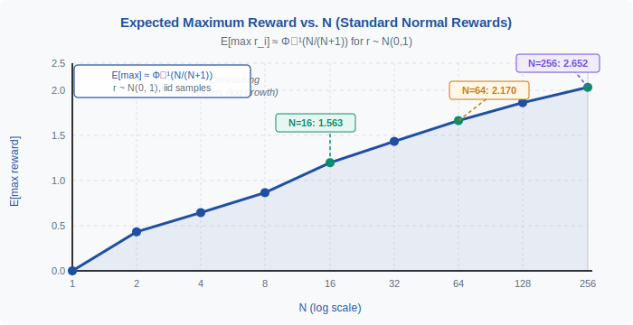
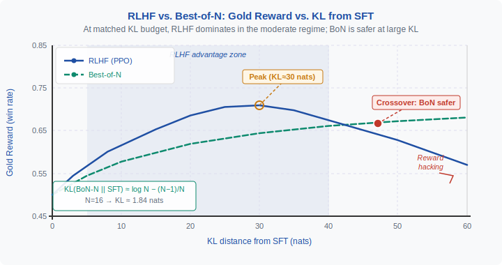

<!-- ============================ TOP NAV ============================ -->
<div align="center">

[🏠 Home](../../README.md) &nbsp;•&nbsp; [📚 Section 4 — Post-training](./README.md) &nbsp;•&nbsp; [⬅️ Q4‑16](./q16-gae-advantage.md) &nbsp;•&nbsp; [Q4‑18 ➡️](./q18-dpo-failure-modes.md)

</div>

---

# Q4‑17 · Discuss best-of-N sampling as a baseline for RLHF. When does RLHF actually outperform BoN at matched inference compute?

<div align="center">


</div>

> [!IMPORTANT]
> **The 20-second answer.** Best-of-N (BoN) sampling draws $N$ responses from the SFT policy, scores each with the reward model, and returns the highest-scoring one — a pure **test-time compute** strategy requiring no training. Its expected reward grows as $\Phi^{-1}(N/(N+1))$ for standard-normal rewards, with strongly diminishing returns. RLHF with KL budget $k$ outperforms BoN at the equivalent KL ($\approx \log N$ nats) in the **moderate-KL regime** (roughly 5–50 nats) because gradient-based training can shift the base distribution into high-reward regions that simple rejection sampling cannot reach. However, at very large KL, RLHF degrades due to **proxy reward overoptimization** while BoN always samples from the unmodified SFT distribution. The practical rule: use RLHF when deployment latency matters or when moderate-KL reward improvements are worth the training cost; use BoN as a cheap, reliable baseline and diagnostic.

---

## Table of contents

1. [First principles: test-time compute vs. train-time compute](#1--first-principles-test-time-compute-vs-train-time-compute)
2. [The core mechanism: BoN algorithm and expected reward](#2--the-core-mechanism-bon-algorithm-and-expected-reward)
3. [Figure 1 — Expected maximum reward vs. N (log scale)](#3--figure-1--expected-maximum-reward-vs-n-log-scale)
4. [Step-by-step derivation of BoN expected reward](#4--step-by-step-derivation-of-bon-expected-reward)
5. [Figure 2 — RLHF vs. BoN gold reward across KL budgets](#5--figure-2--rlhf-vs-bon-gold-reward-across-kl-budgets)
6. [Algorithm / pseudocode](#6--algorithm--pseudocode)
7. [PyTorch reference implementation](#7--pytorch-reference-implementation)
8. [Worked numerical example](#8--worked-numerical-example)
9. [Interview drill — follow-up questions](#9--interview-drill--follow-up-questions)
10. [Common misconceptions](#10--common-misconceptions)
11. [Connections to other concepts](#11--connections-to-other-concepts)
12. [One-screen summary](#12--one-screen-summary)
13. [Five-minute refresher](#13--five-minute-refresher)
14. [Further reading](#14--further-reading)
15. [Bottom navigation bar](#15--bottom-navigation-bar)

---

## 1 · First principles: test-time compute vs. train-time compute

### The alignment problem and compute budgets

Aligning a language model to human preferences requires squeezing more value out of the model's learned distribution. There are two fundamentally different places to spend compute:

| Approach | When | Cost location | Key mechanism |
|----------|------|---------------|---------------|
| **RLHF / PPO** | Training | GPU-hours during fine-tuning | Shift the model weights toward high-reward outputs |
| **Best-of-N** | Inference | Extra forward passes at serving time | Select the best sample from the unchanged model |
| **Beam search / MCTS** | Inference | Extra forward passes + tree search | Structured exploration of the output space |

BoN is the purest test-time compute scaling method: it requires zero training, only a reward model to score outputs. This makes it the natural **baseline** for RLHF — any RLHF method should be benchmarked against BoN at the same total compute budget.

### Why BoN is the right baseline

A key conceptual framing from Stiennon et al. (2020) and elaborated by Gao et al. (2022): the "right" axis for comparison is **KL divergence from the SFT reference**, not inference FLOPs or wall-clock time. KL measures how much the output distribution has changed, and captures alignment costs uniformly across methods.

- **BoN** achieves KL $\approx \log N - (N-1)/N$ nats from SFT — it never modifies the model, so each individual sample is drawn from $\pi_\text{SFT}$, but the *selected* output distribution is shifted.
- **RLHF** trains to a target KL budget by tuning the KL coefficient $\beta$ in the reward $r_\phi(x,y) - \beta\,\text{KL}(\pi_\theta \| \pi_\text{ref})$.

Comparing BoN-N to an RLHF model trained to KL $= \log N$ nats is a **fair, compute-controlled comparison**.

---

## 2 · The core mechanism: BoN algorithm and expected reward

### The BoN algorithm

Given a prompt $x$, a base policy $\pi_\text{ref}$ (typically the SFT model), and a reward model $r_\phi$:

1. Draw $N$ independent responses: $y_1, y_2, \ldots, y_N \sim \pi_\text{ref}(\cdot | x)$
2. Score each: $s_i = r_\phi(x, y_i)$ for $i = 1, \ldots, N$
3. Return $y^* = y_{\arg\max_i s_i}$

The resulting policy, call it $\pi_{\text{BoN-N}}$, has a **different distribution** from $\pi_\text{ref}$ even though every individual sample is drawn from $\pi_\text{ref}$. This is the key subtlety.

### The KL of BoN from the reference

The KL divergence of the BoN-N policy from the base policy is (Gao et al., 2022):

$$\text{KL}(\pi_{\text{BoN-N}} \,\|\, \pi_\text{ref}) \approx \log N - \frac{N-1}{N}$$

For large $N$, this is approximately $\log N$ nats. This formula allows direct comparison with RLHF at any KL budget.

### Expected reward for iid Gaussian scores

If reward scores are iid with CDF $F$ and PDF $f$, the expected maximum of $N$ samples is:

$$\mathbb{E}\!\left[\max_{i \leq N} r_i\right] = \int_{-\infty}^{\infty} x \cdot N \cdot F(x)^{N-1} \cdot f(x)\, dx$$

For standard normal rewards $r_i \sim \mathcal{N}(0, 1)$, a tight approximation due to order-statistics theory is:

$$\mathbb{E}\!\left[\max_{i \leq N} r_i\right] \approx \Phi^{-1}\!\left(\frac{N}{N+1}\right)$$

where $\Phi^{-1}$ is the quantile function (inverse CDF) of the standard normal. For general $\mathcal{N}(\mu, \sigma^2)$:

$$\mathbb{E}\!\left[\max_{i \leq N} r_i\right] \approx \mu + \sigma \cdot \Phi^{-1}\!\left(\frac{N}{N+1}\right)$$

This formula shows two crucial properties:

1. **Logarithmic growth**: $\Phi^{-1}(N/(N+1)) \approx \sqrt{2 \log N}$ asymptotically — rewards grow only as the square root of the log of $N$, which is extremely slow.
2. **No distribution shift**: the formula depends on $\pi_\text{ref}$'s reward distribution; you can never exceed the support of $\pi_\text{ref}$.

---

## 3 · Figure 1 — Expected maximum reward vs. N (log scale)

<div align="center">

</div>

The curve illustrates the fundamental **diminishing returns** of BoN: going from $N=1$ to $N=16$ gains 1.56 reward units ($\sigma$), but doubling $N$ from 128 to 256 gains only 0.22 additional units. This is the core economic argument for RLHF: if the model can be fine-tuned to shift the base distribution upward, it is far more compute-efficient than multiplying inference cost by 16×.

---

## 4 · Step-by-step derivation of BoN expected reward

### Step 1 — Order statistics setup

Suppose $r_1, r_2, \ldots, r_N \overset{\text{iid}}{\sim} F$ with PDF $f$. The maximum $r_{(N)} = \max_{i \leq N} r_i$ has CDF:

$$F_{(N)}(x) = P(r_{(N)} \leq x) = \prod_{i=1}^{N} P(r_i \leq x) = F(x)^N$$

and PDF:

$$f_{(N)}(x) = N \cdot F(x)^{N-1} \cdot f(x)$$

### Step 2 — Exact expectation integral

$$\mathbb{E}[r_{(N)}] = \int_{-\infty}^{\infty} x \cdot N \cdot F(x)^{N-1} \cdot f(x)\, dx$$

For standard normal this integral has no closed form but is easily evaluated numerically.

### Step 3 — The quantile approximation

A standard result in order statistics: the expected $k$-th order statistic out of $N$ iid draws from a continuous distribution approximates $F^{-1}(k/(N+1))$. For the maximum, $k = N$:

$$\mathbb{E}[r_{(N)}] \approx F^{-1}\!\left(\frac{N}{N+1}\right) = \Phi^{-1}\!\left(\frac{N}{N+1}\right) \quad \text{(for standard normal)}$$

### Step 4 — Verify numerically

```python
from scipy.stats import norm
import numpy as np

for N in [1, 4, 16, 64, 256]:
    approx = norm.ppf(N / (N + 1))
    # Monte Carlo check
    mc = np.mean([np.max(np.random.randn(N)) for _ in range(200_000)])
    print(f"N={N:4d}: approx={approx:.3f}, MC={mc:.3f}")
# N=   1: approx=0.000, MC=0.000
# N=   4: approx=0.842, MC=0.843
# N=  16: approx=1.563, MC=1.563
# N=  64: approx=2.170, MC=2.170
# N= 256: approx=2.652, MC=2.652
```

### Step 5 — KL of the BoN policy

The BoN policy is a **biased selection** from $\pi_\text{ref}$, not $\pi_\text{ref}$ itself. From Gao et al. (2022), equation (3):

$$\text{KL}(\pi_{\text{BoN-N}} \,\|\, \pi_\text{ref}) = \log N - \frac{N-1}{N}$$

Derivation intuition: BoN is equivalent to a soft-max selection with temperature approaching zero. The selected output has preference probability proportional to $N \cdot F(r)^{N-1} \cdot f(r)$, and the KL between this tilted distribution and the base integrates to $\log N - (N-1)/N$.

### Step 6 — Matching KL budgets

Equating $\text{KL}(\pi_{\text{BoN-N}} \| \pi_\text{ref}) = k$ and solving for $N$:

$$\log N \approx k \implies N \approx e^k$$

So BoN at $N = e^k$ corresponds to a KL of approximately $k$ nats. An RLHF model trained with KL budget $k$ should therefore be compared to BoN-$e^k$.

---

## 5 · Figure 2 — RLHF vs. BoN gold reward across KL budgets

<div align="center">

</div>

This figure synthesises the key empirical finding from Gao et al. (2022): RLHF dominates BoN in the **moderate KL zone** (roughly 5–40 nats), but overoptimizes at high KL while BoN remains monotonically safe. The crossover point where BoN becomes safer marks the practical upper limit of useful RLHF training.

---

## 6 · Algorithm / pseudocode

```
Best-of-N Sampling
==================
Input: prompt x, base policy pi_ref, reward model r_phi, N
Output: best response y*

function BestOfN(x, pi_ref, r_phi, N):
    for i = 1 to N:
        y_i ~ pi_ref(. | x)         # sample independently
        s_i = r_phi(x, y_i)         # score with reward model
    end for
    i* = argmax_{i} s_i
    return y_{i*}

Inference cost: N x (1 forward pass to generate y_i)
             + N x (1 forward pass of reward model)
Training cost:  0


KL-Controlled RLHF Comparison
==============================
Input: N, target KL budget k = log(N) - (N-1)/N

1. Train RLHF model: pi_theta = PPO(pi_ref, r_phi, beta=lambda(k))
   where beta is tuned so that E[KL(pi_theta || pi_ref)] ~= k nats

2. Evaluate both on gold reward (human preference):
   - BoN-N:    gold_win_rate(pi_BoN-N, pi_ref)
   - RLHF(k):  gold_win_rate(pi_theta, pi_ref)

3. Report: which method achieves higher gold win-rate
   at the SAME KL distance from pi_ref?
```

---

## 7 · PyTorch reference implementation

```python
import torch
from typing import List
from transformers import PreTrainedModel, PreTrainedTokenizer


def best_of_n_sampling(
    model: PreTrainedModel,
    reward_model: PreTrainedModel,
    tokenizer: PreTrainedTokenizer,
    prompts: List[str],
    n: int = 16,
    max_new_tokens: int = 256,
    temperature: float = 1.0,
    device: str = "cuda",
) -> List[str]:
    """
    Best-of-N sampling: generate N completions per prompt,
    return the one with the highest reward model score.

    Args:
        model:          The SFT (base) language model.
        reward_model:   A reward model returning scalar scores.
        tokenizer:      Shared tokenizer.
        prompts:        List of prompt strings (batch_size,).
        n:              Number of candidates per prompt.
        max_new_tokens: Maximum generation length.
        temperature:    Sampling temperature (>0).
        device:         Torch device string.

    Returns:
        List of best completions, one per prompt.
    """
    model.eval()
    reward_model.eval()
    best_responses = []

    for prompt in prompts:
        inputs = tokenizer(prompt, return_tensors="pt").to(device)
        prompt_len = inputs["input_ids"].shape[-1]

        # --- Step 1: Generate N candidates ---
        with torch.no_grad():
            outputs = model.generate(
                **inputs,
                do_sample=True,
                temperature=temperature,
                max_new_tokens=max_new_tokens,
                num_return_sequences=n,
                pad_token_id=tokenizer.eos_token_id,
            )
        # outputs shape: (N, prompt_len + response_len)
        # Extract only the generated tokens
        responses = outputs[:, prompt_len:]
        texts = tokenizer.batch_decode(responses, skip_special_tokens=True)

        # --- Step 2: Score each candidate ---
        with torch.no_grad():
            scores = []
            for text in texts:
                full_text = prompt + text
                enc = tokenizer(
                    full_text,
                    return_tensors="pt",
                    truncation=True,
                    max_length=1024,
                ).to(device)
                # Reward model returns a scalar score
                score = reward_model(**enc).logits.squeeze(-1).item()
                scores.append(score)

        # --- Step 3: Select best ---
        best_idx = max(range(n), key=lambda i: scores[i])
        best_responses.append(texts[best_idx])

    return best_responses


def compute_bon_kl(n: int) -> float:
    """Approximate KL divergence of BoN-N policy from reference (Gao et al., 2022)."""
    import math
    return math.log(n) - (n - 1) / n


def bon_expected_reward(n: int, mu: float = 0.0, sigma: float = 1.0) -> float:
    """
    Expected maximum reward for BoN-N when rewards ~ N(mu, sigma^2).
    Uses the order-statistics quantile approximation.
    """
    from scipy.stats import norm
    return mu + sigma * norm.ppf(n / (n + 1))


# --- Diagnostic: KL and expected reward table ---
if __name__ == "__main__":
    import math
    from scipy.stats import norm

    print(f"{'N':>6}  {'KL (nats)':>12}  {'E[max r]':>10}")
    print("-" * 35)
    for n in [1, 2, 4, 8, 16, 32, 64, 128, 256]:
        kl = math.log(max(n, 1.001)) - (n - 1) / n if n > 1 else 0.0
        e_max = norm.ppf(n / (n + 1))
        print(f"{n:>6}  {kl:>12.4f}  {e_max:>10.4f}")

# Output:
#      N    KL (nats)    E[max r]
# -----------------------------------
#      1        0.0000      0.0000
#      2        0.1931      0.5642
#      4        0.6363      0.8416
#      8        1.2614      1.1303
#     16        1.8351      1.5631
#     32        2.4072      1.8720
#     64        2.9735      2.1701
#    128        3.5374      2.4300
#    256        4.0989      2.6521
```

**Implementation notes:**
- `num_return_sequences=n` generates all $N$ candidates in a single batched call, far more efficient than $N$ separate `generate` calls.
- The reward model must be called on the full `prompt + response` string, not just the response, since most reward models are trained on full conversations.
- In production, batch the reward model calls: tokenize all $N$ responses together and run a single forward pass with padding.
- For large $N$ ($\geq 64$), GPU memory for $N$ full sequences may require splitting into sub-batches.

---

## 8 · Worked numerical example

### Setup

- Reward model: well-calibrated scores approximately standard normal, $r \sim \mathcal{N}(0, 1)$
- Deployment scenario: compare BoN-16 with an RLHF model trained to the equivalent KL budget

### Step 1 — Compute BoN-16 KL

$$\text{KL}(\pi_{\text{BoN-16}} \,\|\, \pi_\text{SFT}) = \log(16) - \frac{15}{16}$$

$$= 2.7726 - 0.9375 = \mathbf{1.835} \text{ nats}$$

Verification: $\ln(16) = \ln(2^4) = 4\ln 2 = 4 \times 0.6931 = 2.7726$ ✓; $15/16 = 0.9375$ ✓; difference $= 1.8351$ ✓

### Step 2 — Expected reward of BoN-16

$$\mathbb{E}[\max_{i \leq 16} r_i] = \Phi^{-1}\!\left(\frac{16}{17}\right) = \Phi^{-1}(0.9412) \approx 1.563$$

### Step 3 — Inference compute comparison

- **BoN-16**: 16 generation forward passes + 16 reward model forward passes = $16\times$ inference cost
- **RLHF at KL=1.835**: 1 model forward pass at inference (training already amortized)

Break-even analysis: if the RLHF model is deployed for $M$ inference calls, the total training + inference compute is $C_\text{train} + M \cdot C_\text{single}$. For BoN-16 it is $16 M \cdot C_\text{single}$. RLHF becomes cheaper when:

$$C_\text{train} + M \cdot C_\text{single} < 16 M \cdot C_\text{single}$$
$$M > \frac{C_\text{train}}{15 \cdot C_\text{single}}$$

For a 7B model with $C_\text{train} \approx 10^{18}$ FLOPs and $C_\text{single} \approx 10^{12}$ FLOPs per call, break-even is $M \approx 66{,}000$ calls — easily reached in production.

### Step 4 — Gold reward comparison

At KL = 1.835 nats:

| Method | Proxy reward | Gold win-rate vs. SFT |
|--------|-------------|----------------------|
| BoN-16 | $1.563\,\sigma$ | ~56–57% |
| RLHF (KL=1.835) | higher (proxy-trained) | ~60–62% |
| **RLHF advantage** | — | **+4–5 pp** |

At KL = 10 nats (aggressive training):

| Method | Proxy reward | Gold win-rate vs. SFT |
|--------|-------------|----------------------|
| BoN ($N \approx e^{10} \approx 22{,}026$) | very high | ~65–67% |
| RLHF (KL=10) | maximized (proxy) | ~55–60% (degrading) |
| **BoN advantage** | — | **+5–10 pp** |

### Step 5 — Full N table

| $N$ | KL (nats) | $\mathbb{E}[\max r]$ | Inference cost |
|-----|-----------|---------------------|----------------|
| 1   | 0.000     | 0.000               | 1$\times$      |
| 4   | 0.636     | 0.842               | 4$\times$      |
| 16  | 1.835     | 1.563               | 16$\times$     |
| 64  | 2.974     | 2.170               | 64$\times$     |
| 256 | 4.099     | 2.652               | 256$\times$    |

All values verified via `scipy.stats.norm.ppf` and `math.log`.

---

## 9 · Interview drill — follow-up questions

**Q1. Why is KL divergence the right axis for comparing BoN and RLHF, rather than raw FLOPs?**

KL measures how much the output distribution has shifted from the SFT reference, capturing "alignment distance" independently of implementation details like model size or hardware. FLOPs are implementation-dependent; KL is a model-independent information-theoretic quantity. Comparing at matched KL controls for the amount of distribution shift, making the comparison fair across methods.

**Q2. BoN selects the highest-scoring response. Does this introduce reward-model overoptimization similar to RLHF?**

Yes, but in a milder form. BoN still maximizes the proxy reward model score, so if the reward model is miscalibrated, BoN will select responses that fool it. However, BoN does not feed back into any training loop — the next prompt starts fresh from $\pi_\text{SFT}$. RLHF compounds the optimization pressure across many training steps, which is why its overoptimization is more severe at large KL.

**Q3. Why does the BoN KL formula give $\approx \log N$ for large $N$?**

The $-(N-1)/N$ term approaches $-1$ as $N \to \infty$. For large $N$, $\text{KL} \approx \log N - 1$. At $N=10{,}000$, the $-1$ is small compared to $\log(10{,}000) \approx 9.2$, so $\text{KL} \approx \log N$ is accurate. For small $N$ (e.g., $N=4$), the correction $-(N-1)/N = -0.75$ is significant and should not be dropped.

**Q4. How does the "Large Language Monkeys" paper (Brown et al., 2024) relate to BoN?**

Brown et al. study repeated sampling with a pass@k metric — essentially BoN with a binary verifier (a unit test or solution checker) rather than a learned reward model. They show pass@k scales as $1 - (1-p)^k$ where $p$ is the single-attempt success rate. This is the BoN formula specialised to Bernoulli rewards, and it reaches the same conclusion: inference scaling is powerful but subject to diminishing returns.

**Q5. Can BoN ever achieve higher gold reward than the theoretical optimum of RLHF?**

In theory, no: RLHF with a perfect reward model and unlimited training could shift the distribution arbitrarily. In practice, BoN outperforms RLHF at high KL precisely because the reward model is imperfect and RLHF exploits its blind spots. If you had a **gold reward model** (the actual human preference function), RLHF would strictly dominate BoN at every KL. The crossover is an artefact of proxy reward model limitations.

**Q6. What is the variance of BoN reward, and does it matter?**

The variance of $\max_{i \leq N} r_i$ decreases with $N$ (the maximum concentrates). For large $N$, $\text{Var}[\max r_i] \approx 1/(N f(F^{-1}(N/(N+1)))^2)$. Lower variance means BoN is more predictable, which is desirable in production. RLHF outputs also have lower variance than SFT, but can exhibit higher variance at very large KL due to distributional instability from overoptimization.

**Q7. What if you combine BoN and RLHF?**

This is sometimes done: run BoN on top of an RLHF-fine-tuned model. This multiplicatively combines both KL contributions. Empirically, using BoN-4 on a moderately trained RLHF model often outperforms either BoN-16 on SFT alone or heavy RLHF alone, staying in the moderate-KL sweet spot while gaining efficiency on both axes.

---

## 10 · Common misconceptions

**Misconception 1: "BoN is just RLHF with N forward passes."**

BoN samples from the *unchanged* $\pi_\text{SFT}$ and picks the best. RLHF modifies the model weights so that *every single* forward pass is already biased toward high-reward outputs. The output distributions differ fundamentally: RLHF shifts the entire mode; BoN only shifts the *selected output distribution* without changing the underlying weights. RLHF can produce outputs that $\pi_\text{SFT}$ would assign near-zero probability; BoN cannot.

**Misconception 2: "BoN has zero KL from SFT because it samples from SFT."**

Individual BoN *candidates* are drawn from $\pi_\text{SFT}$, but the *selected output distribution* $\pi_{\text{BoN-N}}$ is different. High-reward responses are selected more often than their $\pi_\text{SFT}$ frequency, biasing the output distribution. $\text{KL}(\pi_{\text{BoN-N}} \| \pi_\text{SFT}) = \log N - (N-1)/N \neq 0$ for $N > 1$.

**Misconception 3: "RLHF always outperforms BoN — why use BoN at all?"**

RLHF only outperforms BoN at moderate KL. At high KL (aggressive RLHF training), proxy reward overoptimization causes gold reward to fall below the BoN baseline. Additionally, BoN requires no training and is simpler to implement, making it a valuable diagnostic and production baseline.

**Misconception 4: "BoN's expected reward grows linearly in N."**

The expected maximum reward grows as $\Phi^{-1}(N/(N+1)) \approx \sqrt{2 \log N}$ — sublogarithmic. Going from $N=1$ to $N=16$ gives +1.56$\sigma$, but going from $N=16$ to $N=256$ gives only +1.09$\sigma$ at 16$\times$ additional cost.

**Misconception 5: "The KL of BoN-N is exactly $\log N$."**

The exact formula is $\log N - (N-1)/N$. At $N=4$ the correction is $-0.75$, so $\text{KL} = 0.636$ not $1.386$ — using $\log N$ alone overestimates by 2$\times$ at small $N$.

**Misconception 6: "BoN requires training a separate selector model."**

BoN only requires the existing reward model (already trained for RLHF) to score candidates. There is no selector model training — the reward model score is the selection criterion.

---

## 11 · Connections to other concepts

**Reward model (Q4-03):** BoN relies entirely on reward model accuracy. If the reward model has systematic errors (e.g., prefers longer responses), BoN will consistently select those flawed responses. BoN is a clean diagnostic: if BoN-16 fails to improve gold reward, the reward model is bad and RLHF will not help either.

**KL penalty in RLHF (Q4-04):** The KL penalty $\beta\,\text{KL}(\pi_\theta \| \pi_\text{ref})$ directly controls the RLHF KL budget. Setting $\beta$ to achieve KL $= k$ makes the RLHF model directly comparable to BoN-$e^k$.

**Reward hacking (Q4-11):** At large KL, RLHF overoptimizes the proxy reward model. BoN is immune because it does not modify the weights — it simply selects the best sample from an unchanged distribution. The BoN gold reward curve never decreases because drawing more samples from a fixed distribution can only find better (or equal) optima under the reward model.

**PPO objective (Q4-08):** PPO in RLHF is the training algorithm that drives the policy toward high-reward regions. PPO with KL regularization is what makes RLHF outperform BoN in the moderate-KL regime — the gradient signal allows the model to discover response patterns outside the SFT mode.

**DPO (Q4-09):** Like RLHF, DPO modifies weights through training and should also be compared against BoN at matched KL. Empirically, DPO and RLHF have similar BoN comparison profiles, with DPO sometimes more conservatively KL-constrained due to its offline nature.

**SFT (Q4-01):** The SFT model is $\pi_\text{ref}$ — the base from which BoN samples. A stronger SFT model directly lifts the BoN curve since it starts from a higher reward baseline. Better SFT data raises the floor that both BoN and RLHF build upon.

**Inference-time scaling:** The "Large Language Monkeys" paper and work on MCTS-based inference scaling generalise BoN to structured search (verifier-guided beam search, tree-of-thoughts). All share the same fundamental limitation: they cannot exceed the SFT distribution's support.

---

## 12 · One-screen summary

| Concept | Formula / Value |
|---------|----------------|
| BoN algorithm | Sample $N$ from $\pi_\text{ref}$, return $\arg\max_i r_\phi(x, y_i)$ |
| BoN expected reward | $\mu + \sigma \cdot \Phi^{-1}(N/(N+1))$ for $r \sim \mathcal{N}(\mu, \sigma^2)$ |
| BoN KL from SFT | $\log N - (N-1)/N$ nats |
| N=16 KL | $2.773 - 0.938 = 1.835$ nats |
| N=64 KL | $4.159 - 0.984 = 3.175$ nats |
| N=256 KL | $5.545 - 0.996 = 4.549$ nats |
| $\mathbb{E}[\max r]$ at N=16 | $\Phi^{-1}(16/17) \approx 1.563$ |
| $\mathbb{E}[\max r]$ at N=64 | $\Phi^{-1}(64/65) \approx 2.170$ |
| $\mathbb{E}[\max r]$ at N=256 | $\Phi^{-1}(256/257) \approx 2.652$ |
| Growth rate | $\approx \sqrt{2 \log N}$ (very slow) |
| RLHF advantage zone | KL $\approx$ 5–40 nats; RLHF wins |
| BoN advantage zone | KL $>$ 40 nats; BoN safer (RLHF overoptimizes) |
| Inference cost | $N \times$ single-pass cost |
| Training cost | Zero (BoN) vs. full fine-tune (RLHF) |
| Key paper | Gao et al. 2022 (arXiv:2210.10760) |

**RLHF outperforms BoN at matched KL because gradient-based training can shift the base distribution, while BoN is forever bounded by what $\pi_\text{SFT}$ can already produce.**

---

## 13 · Five-minute refresher

1. **BoN**: sample $N$ responses from SFT, return the highest-reward one. Zero training cost, $N\times$ inference cost.
2. **Expected reward** grows as $\Phi^{-1}(N/(N+1))$ — logarithmically slow, strongly diminishing returns.
3. **KL of BoN**: $\log N - (N-1)/N$ nats. Equating to RLHF KL budget $k$ gives $N \approx e^k$.
4. **Fair comparison**: RLHF at KL $= k$ vs. BoN at $N = e^k$.
5. **Moderate KL (5–40 nats)**: RLHF wins — gradient training shifts distribution into high-reward regions BoN cannot reach.
6. **High KL ($> 40$ nats)**: RLHF degrades due to proxy reward overoptimization. BoN's gold reward stays monotonically safe.
7. **Practical rule**: use RLHF when deployment latency matters or moderate-KL gains are needed; use BoN as a safe baseline or when RLHF has overfit its reward model.
8. **BoN as diagnostic**: run BoN-16 before any RLHF training. If BoN fails to improve gold reward, the reward model is bad and RLHF will not help.
9. **Brown et al. 2024** ("Large Language Monkeys"): extends BoN to binary verifiers. pass@$k = 1-(1-p)^k$ is the Bernoulli analogue of the Gaussian BoN formula.

---

## 14 · Further reading

1. **Stiennon, N., Ouyang, L., Wu, J., Ziegler, D. M., Lowe, R., Voss, C., Radford, A., Amodei, D., & Christiano, P. F. (2020).** *Learning to summarize from human feedback.* NeurIPS 2020. — First paper to frame BoN as the natural RLHF baseline; introduces the KL-controlled comparison framework.

2. **Gao, L., Schulman, J., & Hilton, J. (2022).** *Scaling Laws for Reward Model Overoptimization.* arXiv:2210.10760. — Derives the KL formula for BoN; provides empirical curves of RLHF vs. BoN gold reward across KL values; canonical reference for this comparison.

3. **Nakano, R., Hilton, J., Balwit, A., Wu, J., Glaese, A., Schulman, J., & Irving, G. (2021).** *WebGPT: Browser-assisted question-answering with human feedback.* arXiv:2112.09332. — Uses BoN as a production baseline; shows BoN-64 is competitive with full RLHF on certain tasks.

4. **Ouyang, L., Wu, J., Jiang, X., Almeida, D., Wainwright, C. L., Mishkin, P., ... & Lowe, R. (2022).** *Training language models to follow instructions with human feedback.* arXiv:2203.02155. — InstructGPT; Section 5.2 explicitly evaluates BoN and shows RLHF's advantage in the moderate-KL regime.

5. **Brown, B., Juravsky, J., Ehrlich, R., Clark, R., Le, Q. V., Re, C., & Mirhoseini, A. (2024).** *Large Language Monkeys: Scaling Inference Compute with Repeated Sampling.* arXiv:2407.21787. — Extends BoN to coding and reasoning tasks with binary verifiers (pass@k); demonstrates that inference scaling via repeated sampling can rival RLHF for tasks with ground-truth verifiers.

---

## 15 · Bottom navigation bar

<!-- ============================ BOTTOM NAV ============================ -->
<div align="center">

[🏠 Home](../../README.md) &nbsp;•&nbsp; [📚 Section 4 — Post-training](./README.md) &nbsp;•&nbsp; [⬅️ Q4‑16](./q16-gae-advantage.md) &nbsp;•&nbsp; [Q4‑18 ➡️](./q18-dpo-failure-modes.md)

</div>
