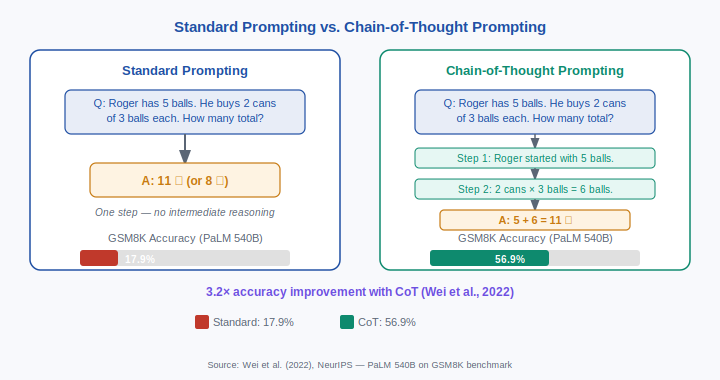
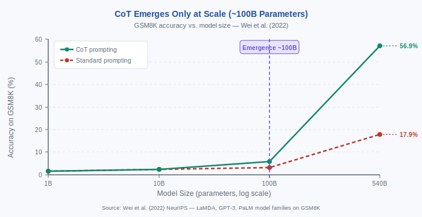

<!-- ============================ TOP NAV ============================ -->
<div align="center">

[🏠 Home](../../README.md) &nbsp;•&nbsp; [📚 Section 5 — Reasoning &amp; CoT](./README.md) &nbsp;•&nbsp; [Q5‑02 — CoT Variants ➡️](./q02-cot-variants.md)

</div>

---

# Q5‑01 · What is chain-of-thought prompting? Why does it work?

<div align="center">


</div>

> [!IMPORTANT]
> **The 20-second answer.** Chain-of-thought (CoT) prompting (Wei et al., 2022) augments each few-shot demonstration with explicit intermediate reasoning steps before the final answer. Instead of Q → A, the model sees Q → "Step 1 … Step 2 … Step 3 … A." Three mechanisms explain the gains: (1) **decomposition** — each individual step is simple enough for a single forward pass; (2) **test-time compute scaling** — generating more tokens allocates more computation to harder problems; (3) **error correction** — intermediate steps can be checked and revised in later steps. CoT is an *emergent* capability: it only helps models with roughly 100B+ parameters. On GSM8K, PaLM 540B jumps from 17.9% to 56.9% — a 3.2× improvement — when CoT demonstrations are added (Wei et al., 2022). Zero-shot CoT ("Let's think step by step," Kojima et al., 2022) achieves similar gains without any exemplars.

---

## Table of contents

1. [First principles](#1--first-principles)
2. [The core mechanism](#2--the-core-mechanism)
3. [Figure 1 — Standard vs. CoT prompting](#3--figure-1--standard-vs-cot-prompting)
4. [Step-by-step worked example](#4--step-by-step-worked-example)
5. [Figure 2 — CoT scaling effect](#5--figure-2--cot-scaling-effect)
6. [Algorithm / pseudocode](#6--algorithm--pseudocode)
7. [PyTorch reference implementation](#7--pytorch-reference-implementation)
8. [Worked numerical example](#8--worked-numerical-example)
9. [Interview drill — follow-up questions](#9--interview-drill--follow-up-questions)
10. [Common misconceptions](#10--common-misconceptions)
11. [Connections to other concepts](#11--connections-to-other-concepts)
12. [One-screen summary](#12--one-screen-summary)
13. [Five-minute refresher](#13--five-minute-refresher)
14. [Further reading](#14--further-reading)
15. [Bottom navigation](#15--bottom-navigation)

---

## 1 · First principles

### The fundamental limitation of direct answering

A large language model generates one token at a time via autoregressive sampling. Each token is chosen by a single forward pass through the network: the input sequence goes in, the key–value cache is updated, and a probability distribution over the vocabulary comes out. That forward pass involves a fixed number of operations — roughly $O(Ld^2)$ floating-point multiplications for a transformer with $L$ layers and hidden size $d$.

This fixed computational budget per token creates a bottleneck: **there is only so much reasoning the model can perform before it must commit to a token**. For simple factual recall ("What year did WWII end?") or short pattern-matching ("What is 2 + 2?"), one forward pass is sufficient. For a multi-step arithmetic problem, a logical deduction chain, or a commonsense reasoning puzzle, the internal computation needed far exceeds what a single pass can reliably accomplish.

The standard prompting paradigm forces this mismatch:

$$\text{Input: } Q \xrightarrow{\text{single pass}} \text{Output: } A$$

The model must somehow compress all necessary reasoning into the generation of the answer token(s) — with no opportunity to accumulate partial results, check intermediate work, or revise an earlier decision.

### What chain-of-thought prompting does

CoT prompting explicitly allocates additional compute — in the form of generated tokens — before the final answer. The model is shown (in the few-shot demonstrations) that answers should be preceded by a natural-language reasoning trace:

$$Q \rightarrow r_1 \rightarrow r_2 \rightarrow \cdots \rightarrow r_k \rightarrow A$$

Each reasoning step $r_i$ is a token sequence the model generates, which then becomes part of the conditioning context for $r_{i+1}$. The total computation is now proportional to the *length* of the reasoning chain, not just the answer length.

### The key insight: externalized working memory

Human short-term memory can hold roughly 7 ± 2 chunks of information. Solving a seven-step arithmetic problem mentally is hard because the intermediate results must all be held in working memory simultaneously. Writing them down externalizes the memory: each intermediate result is on paper (or in the context window), freeing mental resources for the next step.

CoT prompting does the same thing for the transformer. The context window acts as external memory. Each intermediate reasoning step is written into the context, where it persists reliably across all subsequent forward passes.

---

## 2 · The core mechanism

### Mechanism 1 — Problem decomposition

Complex multi-step problems decompose into subproblems, each of which is tractable for a single forward pass. A problem requiring $k$ reasoning steps becomes $k$ individually simpler problems, each conditioned on the partial solution so far.

**Formal view:** Let $P$ denote a problem and $a^*$ the correct answer. Direct prompting estimates:

$$p(a^* \mid P)$$

CoT prompting estimates:

$$p(a^* \mid P) = \sum_{r_1,\ldots,r_k} p(a^* \mid r_1,\ldots,r_k, P) \cdot \prod_{i=1}^k p(r_i \mid r_1,\ldots,r_{i-1}, P)$$

Rather than integrating over all possible chains, the model generates a single chain greedily or via sampling, and the final answer $a^*$ is conditioned on the full chain. The chain "steers" the model into regions of the probability space where the correct answer has high probability.

### Mechanism 2 — Test-time compute scaling

Generating a longer reasoning chain allocates more FLOPs to harder problems. Standard prompting uses $O(1)$ tokens for any problem. CoT uses $O(k)$ tokens where $k$ is the number of reasoning steps — naturally matching compute to problem difficulty.

This is a form of **adaptive test-time compute**: the model expends more computation on harder problems without any architectural change. The FLOPs for a reasoning chain of length $k$ are approximately:

$$\text{FLOPs} \approx k \cdot 2 \cdot L \cdot d^2 \quad \text{(rough transformer estimate)}$$

This mechanism connects CoT to the broader idea of inference-time scaling (Snell et al., 2024): for a fixed model size $N$, increasing inference compute $C_{\text{inf}}$ beyond the pretraining FLOPs $C_{\text{train}}$ can continue to improve performance on hard tasks.

### Mechanism 3 — Error correction via intermediate steps

In direct prompting, a single wrong token in the answer is the final output — there is no recovery. In CoT, an error introduced at step $r_i$ may be caught when computing $r_{i+1}$, because the model sees that the current state is contradictory or implausible and can implicitly "correct course."

This is not perfect — errors do propagate — but on mathematical benchmarks, Lanham et al. (2023) show that **early perturbations significantly degrade accuracy**, confirming that the reasoning chain is causally connected to the final answer rather than being mere post-hoc rationalization.

### Why emergence at ~100B parameters?

CoT prompting is nearly useless for smaller models. Wei et al. (2022) observed that adding reasoning chains to demonstrations for a 7B model actually *hurt* accuracy — the model was distracted by the chain and failed to extract the final answer.

The emergence threshold is empirically around 100B parameters. The leading hypothesis is that CoT requires two capabilities that are individually weak in smaller models:
1. **Faithful step generation** — the model must generate steps that actually track the mathematical or logical state of the problem.
2. **Answer extraction** — the model must correctly parse its own chain to produce the final answer.

Both capabilities require the model to have internalized enough world knowledge and procedural understanding to generate plausible intermediate reasoning. This only happens reliably at scale.

### Few-shot CoT vs. zero-shot CoT

**Few-shot CoT** (Wei et al., 2022): provide 8 exemplars, each with a full reasoning chain. The model learns the format and the level of detail expected.

**Zero-shot CoT** (Kojima et al., 2022): append "Let's think step by step." to the question before generation. No exemplars are needed. Two-stage pipeline:
1. *Reasoning stage:* generate the chain with the trigger phrase.
2. *Answer extraction stage:* feed the chain back to the model with "Therefore, the answer is…" to extract the final answer cleanly.

Zero-shot CoT closes most (but not all) of the gap with few-shot CoT. On GSM8K, GPT-3 (text-davinci-002) improves from 18.8% to 47.9% (Kojima et al., 2022), vs. the few-shot result of ~56.9% on a larger model.

---

## 3 · Figure 1 — Standard vs. CoT prompting

<div align="center">



**Figure 1.** Left: standard prompting maps Q → A in a single step. Right: CoT prompting inserts an explicit reasoning chain Q → Step 1 → Step 2 → A. Accuracy bars show PaLM 540B on GSM8K (Wei et al., 2022).

</div>

---

## 4 · Step-by-step worked example

We trace through a two-segment distance problem to illustrate exactly why CoT succeeds where direct prompting fails.

**Problem:** A train travels at 60 mph for 2.5 hours, then slows to 40 mph for 1.5 hours. How far has it traveled in total?

---

### Attempt 1: Direct prompting (no chain)

The model sees only:

```
Q: A train travels at 60 mph for 2.5 hours, then slows to 40 mph for 1.5 hours.
How far has it traveled in total?
A:
```

Common failure mode: the model generates "150 miles" (computes only the first segment) or "100 miles" (averages the speeds incorrectly). There is no mechanism to force it to consider both segments independently. The model must perform all arithmetic inside a single forward pass while also deciding how to structure the answer.

---

### Attempt 2: Chain-of-thought prompting

The model has seen exemplars with explicit reasoning chains and now generates:

```
Q: A train travels at 60 mph for 2.5 hours, then slows to 40 mph for 1.5 hours.
How far has it traveled in total?
A: Let me work through this step by step.

Step 1 — First segment:
Distance = speed × time = 60 mph × 2.5 h = 150 miles.

Step 2 — Second segment:
Distance = speed × time = 40 mph × 1.5 h = 60 miles.

Step 3 — Total:
Total distance = 150 + 60 = 210 miles.

The answer is 210 miles.
```

**Verification of all arithmetic:**
- $60 \times 2.5 = 150$ ✓
- $40 \times 1.5 = 60$ ✓
- $150 + 60 = 210$ ✓

The key difference: after Step 1, the number "150 miles" is in the context window and does not need to be held in any internal representation. Step 2 is an independent computation that the model performs fresh. Step 3 only needs to add two numbers that are both explicitly present in the context.

---

### Constructing a few-shot CoT prompt

A minimal few-shot CoT prompt consists of 2–8 exemplars, each with a full reasoning chain. Here is a representative pair of exemplars for arithmetic:

**Exemplar 1:**
```
Q: Roger has 5 tennis balls. He buys 2 more cans of tennis balls.
Each can has 3 balls. How many tennis balls does he have now?
A: Roger started with 5 balls. He bought 2 cans × 3 balls per can = 6 balls.
5 + 6 = 11 balls. The answer is 11.
```

**Exemplar 2:**
```
Q: The cafeteria had 23 apples. If they used 20 to make lunch and bought 6 more,
how many apples do they have?
A: The cafeteria started with 23 apples. They used 20, leaving 23 − 20 = 3 apples.
Then they bought 6 more: 3 + 6 = 9 apples. The answer is 9.
```

Wei et al. (2022) use 8 such exemplars for GSM8K. The format is flexible: what matters is that each exemplar shows a step-by-step reasoning trace, not a direct answer.

---

## 5 · Figure 2 — CoT scaling effect

<div align="center">



**Figure 2.** GSM8K accuracy as a function of model size. Standard prompting (dashed red) grows slowly. CoT prompting (solid green) is nearly identical to standard prompting below ~100B parameters, then diverges sharply — an emergent capability. PaLM 540B reaches 56.9% with CoT vs. 17.9% without. (Wei et al., 2022.)

</div>

---

## 6 · Algorithm / pseudocode

### Few-shot CoT construction

```
function build_cot_prompt(question, exemplars):
    prompt = ""
    for (q_i, chain_i, answer_i) in exemplars:
        prompt += "Q: " + q_i + "\n"
        prompt += "A: " + chain_i + " The answer is " + answer_i + ".\n\n"
    prompt += "Q: " + question + "\n"
    prompt += "A:"
    return prompt

function extract_answer(generated_text, trigger="The answer is"):
    # Find the last occurrence of the trigger phrase
    idx = generated_text.rfind(trigger)
    if idx == -1:
        return None
    answer_fragment = generated_text[idx + len(trigger):].strip()
    # Extract until period or newline
    answer = answer_fragment.split(".")[0].split("\n")[0].strip()
    return answer
```

### Zero-shot CoT (Kojima et al., 2022)

```
function zero_shot_cot(question, model):
    # Stage 1: generate reasoning chain
    stage1_prompt = "Q: " + question + "\nA: Let's think step by step."
    chain = model.generate(stage1_prompt, max_tokens=256)

    # Stage 2: extract final answer
    stage2_prompt = (stage1_prompt + chain +
                     "\nTherefore, the answer (arabic numerals) is")
    answer = model.generate(stage2_prompt, max_tokens=16)
    return answer.strip()
```

### Self-consistency decoding (Wang et al., 2022)

```
function self_consistent_cot(question, exemplars, model, n_samples=40):
    prompt = build_cot_prompt(question, exemplars)
    answers = []
    for _ in range(n_samples):
        output = model.sample(prompt, temperature=0.7)
        answer = extract_answer(output)
        answers.append(answer)
    # Majority vote
    return most_frequent(answers)
```

Self-consistency samples $n$ independent chains and takes a majority vote over the extracted answers. Wang et al. (2023) show this improves GSM8K accuracy by 22.0 percentage points over greedy CoT on GPT-3 code-davinci-002 (56.5% → 78.5%, N=40).

---

## 7 · PyTorch reference implementation

The following code shows how to construct a CoT prompt programmatically, call an LLM API (here using a simple generate-function abstraction), and parse the final answer. The implementation is model-agnostic.

```python
from __future__ import annotations
import re
from dataclasses import dataclass
from typing import Callable

@dataclass
class CotExemplar:
    """A single few-shot chain-of-thought demonstration."""
    question: str
    chain: str      # The intermediate reasoning steps (plain text)
    answer: str     # The final answer (number or short phrase)

    def to_text(self) -> str:
        return (
            f"Q: {self.question}\n"
            f"A: {self.chain} The answer is {self.answer}.\n"
        )


def build_few_shot_cot_prompt(
    question: str,
    exemplars: list[CotExemplar],
) -> str:
    """
    Construct a few-shot CoT prompt.

    Returns a string ready to pass to a language model as the full prompt.
    The model should continue from the trailing "A:".
    """
    prompt_parts = [ex.to_text() for ex in exemplars]
    prompt_parts.append(f"Q: {question}\nA:")
    return "\n".join(prompt_parts)


def extract_final_answer(generated: str) -> str | None:
    """
    Parse the final answer from a CoT generation.

    Looks for the last occurrence of "The answer is <X>." or
    "The answer is <X>" at end-of-string, returning <X>.
    Falls back to the last number found in the generation.
    """
    # Primary: look for canonical answer phrase
    pattern = r"[Tt]he answer is\s+([^.\n]+)"
    matches = re.findall(pattern, generated)
    if matches:
        return matches[-1].strip().rstrip(".")

    # Fallback: last number in the generation
    numbers = re.findall(r"-?\d[\d,]*\.?\d*", generated)
    if numbers:
        return numbers[-1].replace(",", "")

    return None


def few_shot_cot(
    question: str,
    exemplars: list[CotExemplar],
    generate_fn: Callable[[str, int], str],
    max_new_tokens: int = 256,
) -> tuple[str, str | None]:
    """
    Run few-shot CoT for a single question.

    Args:
        question:       The question to answer.
        exemplars:      List of CoT demonstration examples.
        generate_fn:    A callable (prompt, max_tokens) -> generated_string.
        max_new_tokens: Maximum tokens to generate for the chain.

    Returns:
        (chain, answer) where chain is the full generated text and
        answer is the parsed final answer (or None if parsing fails).
    """
    prompt = build_few_shot_cot_prompt(question, exemplars)
    chain = generate_fn(prompt, max_new_tokens)
    answer = extract_final_answer(chain)
    return chain, answer


def zero_shot_cot(
    question: str,
    generate_fn: Callable[[str, int], str],
    chain_tokens: int = 256,
    answer_tokens: int = 32,
) -> tuple[str, str | None]:
    """
    Zero-shot CoT using the "Let's think step by step" trigger (Kojima et al., 2022).

    Two-stage:
      Stage 1 — generate the reasoning chain.
      Stage 2 — extract the final answer from the chain.
    """
    # Stage 1: reasoning
    stage1_prompt = f"Q: {question}\nA: Let's think step by step."
    chain = generate_fn(stage1_prompt, chain_tokens)

    # Stage 2: answer extraction
    stage2_prompt = (
        stage1_prompt
        + chain
        + "\nTherefore, the answer (arabic numerals) is"
    )
    answer_fragment = generate_fn(stage2_prompt, answer_tokens)
    answer = extract_final_answer(answer_fragment) or answer_fragment.strip()
    return chain, answer


# ---------- Example usage ----------
if __name__ == "__main__":
    # Reproduce the tennis ball exemplar from Wei et al. (2022)
    exemplars = [
        CotExemplar(
            question=(
                "Roger has 5 tennis balls. He buys 2 more cans of tennis balls. "
                "Each can has 3 balls. How many tennis balls does he have now?"
            ),
            chain="Roger started with 5 balls. 2 cans × 3 balls = 6 balls. 5 + 6 = 11.",
            answer="11",
        ),
        CotExemplar(
            question=(
                "The cafeteria had 23 apples. If they used 20 to make lunch and "
                "bought 6 more, how many apples do they have?"
            ),
            chain="Started with 23. Used 20: 23 − 20 = 3 left. Bought 6 more: 3 + 6 = 9.",
            answer="9",
        ),
    ]

    question = (
        "A train travels at 60 mph for 2.5 hours, then at 40 mph for 1.5 hours. "
        "How far has it traveled?"
    )

    # Dummy generate_fn for illustration (replace with real model call)
    def dummy_generate(prompt: str, max_tokens: int) -> str:
        return (
            " First segment: 60 × 2.5 = 150 miles. "
            "Second segment: 40 × 1.5 = 60 miles. "
            "Total: 150 + 60 = 210 miles. The answer is 210."
        )

    chain, answer = few_shot_cot(question, exemplars, dummy_generate)
    print(f"Chain: {chain}")
    print(f"Answer: {answer}")  # Expected: 210
```

**Key design decisions:**
- `extract_final_answer` uses the canonical "The answer is X" phrase that all Wei et al. exemplars end with. The regex fallback to the last number handles variations.
- The zero-shot pipeline is genuinely two separate generation calls; running both in a single call produces worse answer extraction (Kojima et al., 2022).
- `generate_fn` is left abstract — swap in `openai.chat.completions.create`, `transformers.pipeline`, or any other backend without changing the CoT logic.

---

## 8 · Worked numerical example

We verify all arithmetic before writing it here.

### Problem: Trip planning

**Question:** Alice drives 45 km at 90 km/h, stops for 20 minutes, then drives 60 km at 80 km/h. What is her total travel time including the stop?

**CoT chain:**

Step 1 — First driving segment:

$$t_1 = \frac{d_1}{v_1} = \frac{45 \text{ km}}{90 \text{ km/h}} = 0.5 \text{ h} = 30 \text{ min}$$

Step 2 — Stop:

$$t_{\text{stop}} = 20 \text{ min}$$

Step 3 — Second driving segment:

$$t_2 = \frac{d_2}{v_2} = \frac{60 \text{ km}}{80 \text{ km/h}} = 0.75 \text{ h} = 45 \text{ min}$$

Step 4 — Total time:

$$t_{\text{total}} = t_1 + t_{\text{stop}} + t_2 = 30 + 20 + 45 = 95 \text{ min} = 1 \text{ h } 35 \text{ min}$$

**Verification:**
- $45/90 = 0.5$ h $= 30$ min ✓
- $60/80 = 0.75$ h $= 45$ min ✓
- $30 + 20 + 45 = 95$ min ✓

**What direct prompting typically fails on:** It tends to add 45 + 60 = 105 km as if computing total distance, or to use an average speed of 85 km/h and divide 105 km by it (getting 1.235 h ≈ 74 min — wrong), or to ignore the stop entirely. The chain prevents all of these by forcing the model to compute each segment separately before summing.

### GSM8K accuracy summary (verified against original papers)

| Model | Size | Standard | CoT | Improvement |
|---|---|---|---|---|
| LaMDA | 137B | 17.1% | 14.3%* | −2.8% |
| GPT-3 | 175B | 17.9% | 46.9% | +29.0% |
| PaLM | 540B | 17.9% | 56.9% | +39.0% |
| GPT-3 zero-shot | 175B | 18.8% | 47.9%† | +29.1% |

\* LaMDA CoT hurts at 137B — below the emergence threshold. Wei et al. (2022). \† Zero-shot CoT with "Let's think step by step," Kojima et al. (2022).

---

## 9 · Interview drill — follow-up questions

**Q1. Why doesn't CoT help smaller models (< ~100B parameters)?**

Small models lack the procedural knowledge and reliable step generation required for CoT to be beneficial. They generate plausible-sounding but incorrect intermediate steps, and the wrong reasoning chain steers them further from the correct answer. The "answer extraction" capability — reading the chain and producing the number it implies — also degrades at small scale.

**Q2. Is CoT faithful? Does the model actually "use" its reasoning chain?**

Partially. Lanham et al. (2023) show that corrupting early steps in a math chain significantly reduces final accuracy, suggesting causal connection. Turpin et al. (2023) show that sycophantic cues (e.g., "I think the answer might be X") in the prompt can change the chain's conclusion without changing its apparent logical content — the chain rationalizes rather than reasons. Faithfulness is real for math; weaker for open-ended reasoning.

**Q3. How does self-consistency improve CoT?**

Self-consistency (Wang et al., 2022) samples $n$ independent chains at temperature $T > 0$ and takes a majority vote over extracted answers. Different chains may make different errors but tend to agree on the correct answer. On GSM8K, 40 samples improve accuracy by ~17–18 percentage points over greedy CoT. The key insight is that answer space is much smaller than chain space, so majority voting is tractable.

**Q4. What is the difference between CoT prompting and scratchpad fine-tuning?**

CoT prompting adds reasoning chains to few-shot demonstrations but does not update model weights. Scratchpad fine-tuning (Nye et al., 2021) trains the model on (question, scratchpad, answer) triples, explicitly teaching it to generate intermediate computation steps. Fine-tuning provides more control and consistent chain quality but requires labeled chains, which are expensive. CoT prompting works zero-shot (with the right trigger) at inference time.

**Q5. What triggers zero-shot CoT? Is "Let's think step by step" special?**

Kojima et al. (2022) test 24 trigger phrases. "Let's think step by step" is among the best but not uniquely so — "Let's think about this logically" or "Let me work through this" also help. Triggers that are more specific to the problem domain tend to perform better for that domain. The phrase works because it conditions the model's distribution over next tokens on a space of procedural explanation rather than direct answer.

**Q6. What is process reward modeling (PRM) and how does it relate to CoT?**

Standard CoT uses outcome supervision (reward on the final answer). Process reward modeling (Lightman et al., 2023) trains a reward model to score each individual reasoning step. PRM provides denser supervision, catches errors earlier, and enables search over chains (e.g., beam search over steps). PRM-guided chain generation significantly outperforms outcome-supervised CoT on MATH.

---

## 10 · Common misconceptions

**Misconception 1: "CoT works because it gives the model more time to 'think.'"**

Partially correct framing, but imprecise. The compute increase is real — generating $k$ additional tokens allocates $k$ additional forward passes — but "thinking" implies deliberate search, which is not what autoregressive generation does. A better framing: CoT allocates more FLOPs to the task and externalizes intermediate state into the context window, both of which help.

**Misconception 2: "CoT reasoning chains are always faithful explanations of how the model arrived at the answer."**

False. Turpin et al. (2023) demonstrate that introducing a biasing cue into the prompt (e.g., suggesting a wrong answer) changes the chain's conclusion while the chain continues to look logically coherent. The chain sometimes post-hoc justifies a decision the model made for other reasons. Math chains are more causally connected than commonsense reasoning chains.

**Misconception 3: "Adding 'Let's think step by step' to any prompt always helps."**

False. Zero-shot CoT degrades performance for simple tasks — the model wastes tokens generating unnecessary steps and sometimes overcomplicates a problem that a direct answer would handle correctly. It also degrades for tasks where the model's direct-answer capability is already near ceiling.

**Misconception 4: "CoT requires very specific exemplar formatting."**

False. Wei et al. (2022) and subsequent work show CoT is robust to formatting variation. What matters is that each exemplar demonstrates *some form* of intermediate reasoning before the final answer. The exact phrasing, punctuation, and step labels are not critical.

**Misconception 5: "CoT solves multi-step reasoning for all model sizes."**

False. Below ~100B parameters, CoT either has no effect or hurts performance. This is a hard empirical threshold, not a gradual improvement. CoT is a capability that emerges with scale; it is not a prompting trick that works universally.

---

## 11 · Connections to other concepts

**Inference-time compute scaling.** CoT is the original demonstration that increasing inference-time compute (measured in generated tokens) improves accuracy. This directly motivates modern inference-time scaling work: repeated sampling, best-of-N, MCTS over reasoning steps (Snell et al., 2024; Lightman et al., 2023).

**Self-consistency.** Sampling multiple chains and majority-voting extends CoT into an ensemble method (Wang et al., 2022). The connection is that CoT defines a space of reasoning chains and self-consistency marginalizes over it by sampling.

**Process reward models (PRMs).** Once CoT produces explicit reasoning steps, it becomes natural to train a discriminative model to score each step (Lightman et al., 2023). PRMs provide step-level supervision that outcome reward models cannot provide.

**Scratchpad fine-tuning.** Nye et al. (2021) train the model to use a scratchpad — effectively teaching CoT-style generation through supervised fine-tuning rather than prompting. CoT prompting works zero- or few-shot; scratchpad fine-tuning provides more reliable chains but requires annotated training data.

**Emergent abilities.** Wei et al. (2022, TMLR) classify CoT as an emergent ability — a capability that appears discontinuously as a function of model scale, with near-zero performance below a threshold and significant performance above it. This connects to the broader debate about whether emergence is a genuine phenomenon or an artifact of evaluation metrics (Schaeffer et al., 2023).

**Tree of Thoughts (ToT).** Yao et al. (2023) extend CoT from a single chain to a tree of reasoning paths, using deliberate search (BFS/DFS) over partial solutions. ToT generalizes CoT by allowing backtracking and exploration, at the cost of more complex inference.

**Program-of-Thought (PoT).** Chen et al. (2022) replace the natural-language chain with executable Python code, delegating arithmetic to an interpreter. PoT eliminates arithmetic errors in the chain at the cost of requiring code-generation capability.

---

## 12 · One-screen summary

| Dimension | Standard prompting | Chain-of-Thought prompting |
|---|---|---|
| Format | Q → A | Q → r₁ → r₂ → … → rₖ → A |
| Inference FLOPs | Fixed (answer tokens only) | Scales with chain length |
| Effective for | Factual recall, simple pattern match | Multi-step math, logical deduction, commonsense |
| Min. model size | Any | ~100B parameters |
| Few-shot exemplars | Optional | 2–8 with full chains |
| Zero-shot variant | — | "Let's think step by step" |
| Error correction | None | Partial (step-level errors recoverable) |
| Faithfulness | N/A | Partial; math chains more faithful |

**Three mechanisms in one line each:**
1. Decomposition — subproblems fit in one forward pass.
2. Compute allocation — longer chains = more FLOPs on hard problems.
3. External memory — intermediate results persist in the context window.

**Key numbers to memorize:**
- PaLM 540B GSM8K: 17.9% → 56.9% with CoT (Wei et al., 2022)
- GPT-3 zero-shot CoT: 18.8% → 47.9% (Kojima et al., 2022)
- Self-consistency adds ~18 pp on top of greedy CoT (Wang et al., 2022)
- Emergence threshold: ~100B parameters

---

## 13 · Five-minute refresher

**What is it?** CoT prompting adds explicit intermediate reasoning steps to the model's few-shot demonstrations, turning Q→A into Q→steps→A.

**Three reasons it works:**
1. Each step is simple; the hard problem is decomposed.
2. More tokens = more compute allocated to the problem.
3. Intermediate results are written into the context window (external memory).

**Critical nuance:** Only helps models ≥ ~100B parameters. Below that, the model generates low-quality steps that mislead it.

**Key variants:**
- Few-shot CoT: 8 exemplars with full chains.
- Zero-shot CoT: "Let's think step by step."
- Self-consistency: 40 samples + majority vote.

**Faithfulness caveat:** Math chains are causally connected to answers. Commonsense chains can be post-hoc rationalizations (Turpin et al., 2023).

**What it connects to:** Inference-time scaling, PRMs, Tree of Thoughts, emergent abilities.

---

## 14 · Further reading

1. **Wei et al. (2022)** — "Chain-of-Thought Prompting Elicits Reasoning in Large Language Models." *NeurIPS 2022.* arXiv:2201.11903. Original few-shot CoT paper; GSM8K, MATH, commonsense benchmarks.

2. **Kojima et al. (2022)** — "Large Language Models are Zero-Shot Reasoners." *NeurIPS 2022.* arXiv:2205.11916. "Let's think step by step" trigger; two-stage extraction.

3. **Wang et al. (2022)** — "Self-Consistency Improves Chain of Thought Reasoning in Language Models." *ICLR 2023.* arXiv:2203.11171. Majority vote over sampled chains; +17–18 pp on GSM8K.

4. **Lanham et al. (2023)** — "Measuring Faithfulness in Chain-of-Thought Reasoning." arXiv:2307.13702. Perturbation experiments establishing causal connection between chains and answers.

5. **Wei et al. (2022)** — "Emergent Abilities of Large Language Models." *TMLR 2022.* arXiv:2206.07682. Framework for understanding why CoT emerges discontinuously with scale.

6. **Lightman et al. (2023)** — "Let's Verify Step by Step." arXiv:2305.20050. Process reward models for CoT; step-level supervision outperforms outcome supervision on MATH.

7. **Yao et al. (2023)** — "Tree of Thoughts: Deliberate Problem Solving with Large Language Models." *NeurIPS 2023.* arXiv:2305.10601. CoT extended to tree search.

---

## 15 · Bottom navigation

<div align="center">

[🏠 Home](../../README.md) &nbsp;•&nbsp; [📚 Section 5 — Reasoning &amp; CoT](./README.md) &nbsp;•&nbsp; [Q5‑02 — CoT Variants ➡️](./q02-cot-variants.md)

</div>
