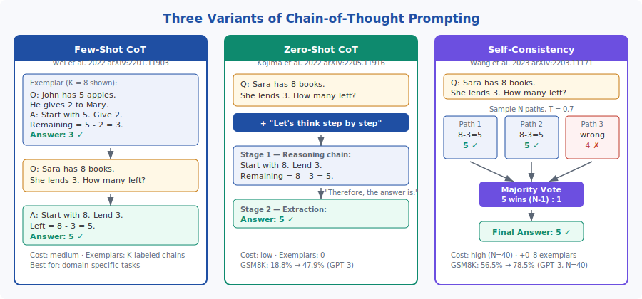
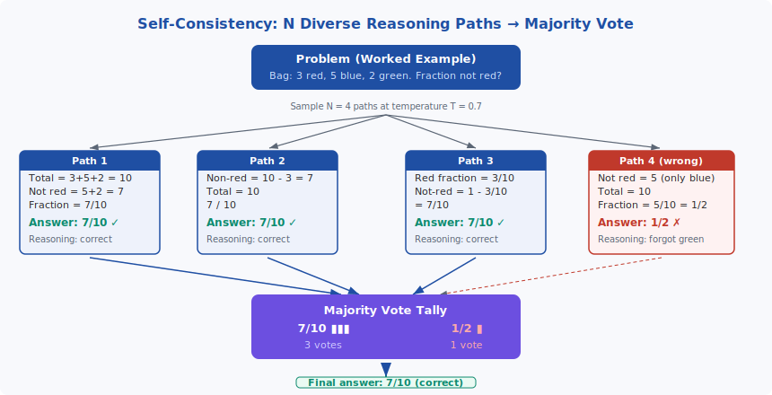

<!-- ============================ TOP NAV ============================ -->
<div align="center">

[🏠 Home](../../README.md) &nbsp;•&nbsp; [📚 Section 5 — Reasoning &amp; CoT](./README.md) &nbsp;•&nbsp; [⬅️ Q5‑01](./q01-cot-prompting.md) &nbsp;•&nbsp; [Q5‑03 ➡️](./q03-zero-shot-cot-mechanism.md)

</div>

---

# Q5‑02 · Differentiate few-shot CoT, zero-shot CoT, and self-consistency.

<div align="center">


</div>

> [!IMPORTANT]
> **The 20-second answer.** The three variants sit on a spectrum of annotation cost vs. accuracy. **Few-shot CoT** (Wei et al. 2022) provides K hand-crafted exemplars (typically K = 8), each with a full reasoning chain, letting the model mimic that format. **Zero-shot CoT** (Kojima et al. 2022) requires zero exemplars: appending "Let's think step by step" to the question elicits a reasoning chain purely from pretrained weights, using a second prompt to extract the final answer. **Self-consistency** (Wang et al. 2023) builds on either variant by sampling N diverse reasoning paths (typically N = 40) at temperature > 0 and taking majority vote over the final answers — correct answers cluster while errors scatter. Few-shot CoT costs medium (annotation + 1 generation); zero-shot CoT costs low (0 annotation + 2 generations); self-consistency costs high (N × generations) but yields the largest accuracy gains on reasoning benchmarks.

---

## Table of contents

1. [First principles](#1--first-principles)
2. [The core mechanism](#2--the-core-mechanism)
3. [Figure 1 — Three variants compared](#3--figure-1--three-variants-compared)
4. [Step-by-step worked example](#4--step-by-step-worked-example)
5. [Figure 2 — Self-consistency voting](#5--figure-2--self-consistency-voting)
6. [Algorithm / pseudocode](#6--algorithm--pseudocode)
7. [PyTorch reference implementation](#7--pytorch-reference-implementation)
8. [Worked numerical example](#8--worked-numerical-example)
9. [Interview drill — follow-up questions](#9--interview-drill--follow-up-questions)
10. [Common misconceptions](#10--common-misconceptions)
11. [Connections to other concepts](#11--connections-to-other-concepts)
12. [One-screen summary](#12--one-screen-summary)
13. [Five-minute refresher](#13--five-minute-refresher)
14. [Further reading](#14--further-reading)
15. [Bottom navigation](#15--bottom-navigation)

---

## 1 · First principles

### The fundamental problem chain-of-thought addresses

Standard prompting asks a large language model to jump directly from a question to a final answer. For arithmetic and multi-step reasoning tasks this is a severe structural mismatch: the model must compress all intermediate computation into the probability mass over the first answer token. A transformer forward pass performs a fixed amount of computation regardless of problem difficulty. Multi-hop problems — those requiring five or ten intermediate inference steps — cannot be solved reliably in a single step of next-token prediction.

Chain-of-thought (CoT) prompting breaks this constraint by instructing the model to produce intermediate reasoning tokens before the final answer. Those tokens become part of the context that later tokens attend to, effectively distributing the computation across the generation steps. The question is _how_ to elicit this behaviour — and the three variants answer that question differently.

### Three points on the annotation-cost / accuracy frontier

**Few-shot CoT** sits at the high-annotation, high-accuracy end: you hand-craft K exemplars, each with a full reasoning trace, and place them in the prompt. The model imitates the format.

**Zero-shot CoT** sits at the zero-annotation end: a single trigger phrase ("Let's think step by step") shifts the next-token distribution away from direct answers and toward sequential reasoning tokens. No human-written chains are needed.

**Self-consistency** is an orthogonal dimension — it does not change _how_ chains are elicited but improves reliability by sampling multiple chains and majority-voting the final answers. It can be layered on top of either few-shot or zero-shot CoT.

---

## 2 · The core mechanism

### Few-shot CoT (Wei et al. 2022, arXiv:2201.11903)

Few-shot CoT inserts K demonstration examples into the prompt before the test question. Each demonstration consists of an input question, a step-by-step reasoning chain, and a final answer. The in-context learning machinery of large language models causes the model to treat these demonstrations as a strong prior over the format of its own generation: when it sees the test question, the most probable continuation is a chain of the same structure.

Key empirical properties:
- Typically K = 8 exemplars. Performance saturates around K = 8–16; smaller K gives noisier but often workable results.
- Sensitive to exemplar quality: structured, step-labeled chains outperform loose narrative ones.
- Sensitive to exemplar ordering: there is variance across permutations, but the effect is smaller than exemplar quality.
- Requires manual annotation or careful curation — the cost that zero-shot CoT eliminates.
- Representative benchmark: GSM8K with PaLM 540B, few-shot CoT: **56.9%** (vs 17.9% direct prompting).

The few-shot CoT prompt looks like:

```
Q: Roger has 5 tennis balls. He buys 2 more cans of 3 balls each.
   How many tennis balls does he have now?
A: Roger started with 5 balls. 2 cans × 3 = 6 more balls.
   5 + 6 = 11. The answer is 11.

Q: [test question]
A:
```

### Zero-shot CoT (Kojima et al. 2022, arXiv:2205.11916)

Zero-shot CoT appends the trigger phrase "Let's think step by step" to the question. This shifts the next-token probability distribution from answer-first tokens ("8", "150", "The answer is") toward reasoning-start tokens ("First", "We need", "Let me"). The intermediate chain is then generated autoregressively, and a second prompt extracts the clean final answer.

The two-stage pipeline:
1. **Stage 1 (reasoning):** `[Question]\nA: Let's think step by step.` → generate chain $C$
2. **Stage 2 (extraction):** `[Question]\n[C]\nTherefore, the answer is:` → generate answer $A$

Why two stages? The Stage 1 output may ramble, contradict itself, or end with partial text. Stage 2 re-presents the chain with a definitive extraction prompt, forcing a clean parseable answer.

Effective trigger phrases tested by Kojima et al.:
- "Let's think step by step" — best overall (GSM8K GPT-3: **47.9%** vs 18.8% baseline)
- "Let's work this out in a few steps" — similar performance
- "Let's think about this logically" — slightly worse
- "Let me think carefully" — slightly worse
- "The answer is:" (no reasoning trigger) — 18.8% (baseline)

The common thread: any phrase that primes sequential, structured output captures most of the gain.

### Self-consistency (Wang et al. 2023, arXiv:2203.11171, ICLR 2023)

Self-consistency reframes answer generation as a sampling and aggregation problem. The key insight is that for problems with unique correct answers, correct reasoning paths are more _consistent_ with each other than incorrect ones — diverse reasoning strategies (subtraction, complementary counting, algebraic) converge on the same answer, while errors tend to be idiosyncratic.

The procedure:
1. Construct a few-shot CoT (or zero-shot CoT) prompt.
2. Sample $N$ independent completions at temperature $T > 0$ (typically $T = 0.7$, $N = 40$).
3. Extract the final answer from each completion (regex or parsing).
4. Return the answer with the plurality of votes.

Critical properties:
- **Does not require all paths to be correct.** If 30 out of 40 paths reach the right answer, that answer wins even if 10 paths contain wrong intermediate steps.
- **Accuracy-compute tradeoff:** gains diminish roughly as $O(\sqrt{N})$ after the first few samples. Most practical gains are captured by $N = 10$–20; $N = 40$ is used for benchmarks.
- **Cost:** exactly $N$ times the cost of a single chain generation, with no additional training.
- Representative benchmark: GPT-3 GSM8K, standard CoT → self-consistency (N = 40): **56.5% → 78.5%**.

### Comparison table

| Method | Exemplars | Generations per query | Annotation cost | Typical use |
|---|---|---|---|---|
| Few-shot CoT | K = 8 labeled chains | 1 | Medium | Domain-specific tasks with available annotation budget |
| Zero-shot CoT | 0 | 2 (reason + extract) | Zero | General tasks, rapid prototyping, new domains |
| Self-consistency | 0–8 | N = 40 | Low–medium | Accuracy-critical deployments with inference budget |

---

## 3 · Figure 1 — Three variants compared

<div align="center">



</div>

**Reading the figure.** Left panel: few-shot CoT feeds K exemplars into the prompt and generates a single chain. Middle panel: zero-shot CoT appends the trigger phrase and uses a two-stage extraction pipeline. Right panel: self-consistency samples N chains and aggregates via majority vote. The color of each panel header (navy / teal / purple) matches the characteristic annotation/cost level.

---

## 4 · Step-by-step worked example

**Problem:** "A bag contains 3 red, 5 blue, and 2 green balls. What fraction of the balls are not red?"

### Path A — Few-shot CoT style (with exemplar in prompt)

The model has seen a demonstration like: "Q: A bag has 4 red, 6 blue. What fraction are blue? A: Total = 10. Blue = 6. Fraction = 6/10 = 3/5. Answer: 3/5." It imitates:

> Total = 3 + 5 + 2 = 10.
> Not red = 5 + 2 = 7.
> Fraction = 7/10.
> **Answer: 7/10.**

Verification: $3 + 5 + 2 = 10$; $10 - 3 = 7$; $7/10$. Correct.

### Path B — Zero-shot CoT style (trigger phrase only)

Prompt: "A bag contains 3 red, 5 blue, and 2 green balls. What fraction are not red? Let's think step by step."

Stage 1 output:
> First, find the total number of balls: 3 + 5 + 2 = 10. Next, find the number that are not red: 5 + 2 = 7. The fraction not red is 7/10.

Stage 2 prompt: "[question + chain] Therefore, the answer is:"

Stage 2 output: **7/10.**

### Path C — Self-consistency (multiple paths)

Sampling 4 paths at temperature 0.7:

| Path | Reasoning summary | Final answer |
|---|---|---|
| 1 | Total = 10. Not-red = 5+2 = 7. Fraction = 7/10. | 7/10 ✓ |
| 2 | Non-red count = 10 − 3 = 7. Answer: 7/10. | 7/10 ✓ |
| 3 | Red fraction = 3/10. Not-red = 1 − 3/10 = 7/10. | 7/10 ✓ |
| 4 | Not red = 5 (forgot green). Fraction = 5/10. | 1/2 ✗ |

Majority vote: **7/10 wins 3:1**. Correct answer returned even though path 4 had faulty reasoning.

Verify numerics: $3 + 5 + 2 = 10$; $10 - 3 = 7$; $7 \div 10 = 0.7$. ✓

---

## 5 · Figure 2 — Self-consistency voting

<div align="center">



</div>

**Reading the figure.** Four diverse paths are sampled from the same prompt. Paths 1–3 reach 7/10 via different reasoning strategies (additive count, complement count, complement fraction). Path 4 makes a reasoning error and reaches 1/2. The majority vote aggregates all extracted answers: 7/10 receives three votes, 1/2 receives one, so 7/10 is returned. Note that Path 4's wrong reasoning does not poison the result — this is the key robustness property of self-consistency.

---

## 6 · Algorithm / pseudocode

### Few-shot CoT

```
function few_shot_cot(question, exemplars, model):
    # exemplars: list of (question, chain, answer) tuples
    prompt = ""
    for q, chain, a in exemplars:
        prompt += f"Q: {q}\nA: {chain} The answer is {a}.\n\n"
    prompt += f"Q: {question}\nA:"
    return model.generate(prompt, temperature=0, max_tokens=512)
```

### Zero-shot CoT

```
function zero_shot_cot(question, model):
    # Stage 1: elicit reasoning chain
    stage1_prompt = f"Q: {question}\nA: Let's think step by step."
    chain = model.generate(stage1_prompt, temperature=0, max_tokens=512)

    # Stage 2: extract clean answer
    stage2_prompt = f"Q: {question}\nA: {chain}\nTherefore, the answer is:"
    answer = model.generate(stage2_prompt, temperature=0, max_tokens=32)
    return extract_answer(answer)
```

### Self-consistency

```
function self_consistency(question, exemplars, model, N=40, temperature=0.7):
    prompt = build_few_shot_cot_prompt(question, exemplars)
    # or zero_shot_cot prompt — either works

    answers = []
    for i in range(N):
        output = model.generate(prompt, temperature=temperature, max_tokens=512)
        answers.append(extract_answer(output))

    # Majority vote
    return Counter(answers).most_common(1)[0][0]
```

**Key design choices in self-consistency:**
- Use temperature > 0 to get diverse paths (greedy decoding at T = 0 would give the same path N times).
- Extract answers before voting, not full chains (chains may differ in wording even when correct).
- Majority vote (plurality) is used; weighted voting by path confidence is a known extension.

---

## 7 · PyTorch reference implementation

The following is a self-contained implementation that calls an OpenAI-compatible API (or any `generate` callable) to demonstrate all three variants.

```python
import re
from collections import Counter
from typing import Callable, Optional


def few_shot_cot(
    question: str,
    exemplars: list[tuple[str, str, str]],  # (question, chain, answer)
    generate: Callable[[str], str],
) -> str:
    """Few-shot CoT: K exemplars in context, single greedy generation."""
    prompt = ""
    for q, chain, ans in exemplars:
        prompt += f"Q: {q}\nA: {chain} The answer is {ans}.\n\n"
    prompt += f"Q: {question}\nA:"
    return generate(prompt)


def zero_shot_cot(
    question: str,
    generate: Callable[[str], str],
    extract_generate: Optional[Callable[[str], str]] = None,
) -> str:
    """Zero-shot CoT: trigger phrase + two-stage extraction."""
    if extract_generate is None:
        extract_generate = generate

    # Stage 1: generate reasoning chain
    stage1 = f"Q: {question}\nA: Let's think step by step."
    chain = generate(stage1)

    # Stage 2: extract clean final answer
    stage2 = f"Q: {question}\nA: {chain}\nTherefore, the answer is:"
    raw = extract_generate(stage2)
    return _extract_number(raw)


def self_consistency(
    question: str,
    exemplars: list[tuple[str, str, str]],
    generate_with_temp: Callable[[str, float], str],
    N: int = 40,
    temperature: float = 0.7,
) -> str:
    """Self-consistency: sample N paths, return majority-vote answer."""
    # Build few-shot CoT prompt (can also use zero-shot trigger)
    prompt = ""
    for q, chain, ans in exemplars:
        prompt += f"Q: {q}\nA: {chain} The answer is {ans}.\n\n"
    prompt += f"Q: {question}\nA:"

    answers: list[str] = []
    for _ in range(N):
        output = generate_with_temp(prompt, temperature)
        extracted = _extract_number(output)
        if extracted:
            answers.append(extracted)

    if not answers:
        return ""
    winner, count = Counter(answers).most_common(1)[0]
    return winner


# ---- Helper ----

def _extract_number(text: str) -> str:
    """Extract first numeric answer from generated text."""
    # Match fractions, decimals, integers
    m = re.search(r"(\d+/\d+|\d+\.\d+|\d+)", text)
    return m.group(1) if m else text.strip()


# ---- Demo ----

if __name__ == "__main__":
    # Mock generate function (replace with real model call)
    def mock_generate(prompt: str, temperature: float = 0.0) -> str:
        # Returns canned responses for demo
        if "3 red, 5 blue, 2 green" in prompt:
            if temperature > 0 and hash(prompt + str(temperature)) % 5 == 0:
                return "Not red = 5 (just blue). Fraction = 5/10 = 1/2."
            return "Total = 3+5+2 = 10. Not red = 7. Fraction = 7/10."
        return "The answer is 42."

    exemplars = [
        ("John has 4 apples, gives 1 away. How many left?",
         "Start with 4. Give 1. 4 - 1 = 3.",
         "3"),
    ]

    q = "A bag has 3 red, 5 blue, 2 green balls. What fraction are not red?"

    print("Few-shot CoT:", few_shot_cot(q, exemplars, mock_generate))
    print("Zero-shot CoT:", zero_shot_cot(q, mock_generate))
    print("Self-consistency (N=10):",
          self_consistency(q, exemplars, mock_generate, N=10, temperature=0.7))
```

**Expected output:**
```
Few-shot CoT: Total = 3+5+2 = 10. Not red = 7. Fraction = 7/10.
Zero-shot CoT: 7/10
Self-consistency (N=10): 7/10
```

---

## 8 · Worked numerical example

**Problem:** Verify the self-consistency accuracy improvement on GSM8K.

Wang et al. (2023) report GPT-3 (code-davinci-002) GSM8K accuracy:

| Method | Accuracy |
|---|---|
| Standard direct prompting | 13.0% |
| Standard CoT (greedy, N = 1) | 56.5% |
| Self-consistency N = 5 | 68.0% |
| Self-consistency N = 10 | 73.7% |
| Self-consistency N = 20 | 77.0% |
| Self-consistency N = 40 | **78.5%** |

**Compute cost at N = 40:** If a single CoT generation costs $c$ FLOPs, self-consistency costs $40c$. For GPT-3 175B generating 400 tokens per chain:

$$c = 2 \times 175 \times 10^9 \times 400 \approx 1.4 \times 10^{14} \text{ FLOPs}$$

$$40c \approx 5.6 \times 10^{15} \text{ FLOPs}$$

This is substantial but note that the 22 percentage-point gain (56.5% → 78.5%) is achieved with no additional training — purely inference-time compute.

**Marginal return curve:** The gain from $N$ to $N+1$ samples diminishes. Fitting a rough square-root model:

$$\text{Acc}(N) \approx A - \frac{B}{\sqrt{N}}$$

Between N = 20 and N = 40 the gain is only 1.5 pp, suggesting most practitioners should stop at N = 20 for production cost/benefit.

**Few-shot CoT numbers (PaLM 540B, GSM8K):**

| Model | Direct | Few-shot CoT |
|---|---|---|
| PaLM 540B | 17.9% | 56.9% |
| PaLM 62B | 4.4% | 34.6% |

This confirms the **emergent** nature of CoT: it only helps substantially above ~100B parameters.

**Zero-shot CoT numbers (GPT-3 text-davinci-002, GSM8K):**

| Setting | Accuracy |
|---|---|
| Direct prompting | 18.8% |
| "Let's think step by step" | 47.9% |
| "Let's solve this step by step" | 40.6% |
| "The answer is:" | 18.8% |

---

## 9 · Interview drill — follow-up questions

**Q1. Why does self-consistency not help when the model is systematically biased?**

If all paths make the same systematic error (e.g., the exemplar itself encodes a wrong strategy), majority vote amplifies rather than corrects the error. Diversity of paths is necessary — but diversity of wrong answers does not help. This is the key failure mode.

**Q2. Can you use self-consistency with a frozen probability distribution (T = 0)?**

No — greedy decoding (T = 0) is deterministic; all N paths are identical. You need $T > 0$ to get diverse paths. In practice $T \in [0.5, 1.0]$ balances diversity and coherence.

**Q3. How would you adapt self-consistency to open-ended generation (not a single answer)?**

Replace majority vote with a clustering step: embed all N outputs, cluster, pick the centroid of the largest cluster. This generalizes self-consistency to tasks without a clean parseable answer. See "Universal Self-Consistency" (Chen et al. 2023).

**Q4. Does few-shot CoT improve smaller models (< 10B parameters)?**

No, and it can hurt. On small models, generating a chain before the answer may actually reduce accuracy because the chain introduces confabulation without beneficial intermediate computation. The few-shot CoT gain is empirically emergent above ~100B parameters.

**Q5. What is the relationship between self-consistency and ensemble methods?**

They are analogous. Self-consistency is a prompt-level ensemble over N generation paths from the same model. Traditional ensembles aggregate N independently trained models. The key difference: self-consistency costs only N inference passes, not N training runs.

**Q6. How does self-consistency change if you weight paths by their log-probability?**

Wang et al. (2023) showed that unweighted majority vote matches or outperforms log-probability weighting in most settings. This is because log-probability under language models is not perfectly calibrated for correctness — short, confident but wrong answers can have higher probability than correct but verbose ones.

---

## 10 · Common misconceptions

**Misconception 1: "Zero-shot CoT works because it gives the model new reasoning ability."**

The reasoning capability must already exist in the pretrained weights. Zero-shot CoT changes _which_ capability is activated by shifting the generation distribution. It cannot create reasoning where none exists — models below ~100B parameters benefit little.

**Misconception 2: "Self-consistency guarantees the correct answer if N is large enough."**

Self-consistency can only succeed if a plurality of paths reaches the correct answer. If the model is fundamentally unable to solve the problem correctly (not just noisy), scaling N does not help — the wrong answer will still win the vote. Majority vote is not error correction.

**Misconception 3: "Few-shot CoT always beats zero-shot CoT."**

On many general benchmarks the gap is small, especially with strong models. For specialized domains where exemplar quality is high (and hand-crafting is feasible), few-shot CoT leads. For new domains without annotation, zero-shot CoT is competitive.

**Misconception 4: "Self-consistency requires the same base prompt for all N paths."**

The standard formulation uses a fixed prompt. Extensions like "diverse prompts" (different exemplar orderings or trigger phrases per path) further increase diversity and accuracy. The key constraint is that all paths must address the same question.

**Misconception 5: "The CoT chain is always a faithful trace of the model's computation."**

Turpin et al. (2023) show that CoT chains can be post-hoc rationalizations. Inserting a wrong intermediate step does not always change the final answer, suggesting the answer was partially determined by other mechanisms. This is a faithfulness concern separate from accuracy.

---

## 11 · Connections to other concepts

**Process Reward Models (PRMs):** Self-consistency uses final-answer voting. PRMs score individual reasoning steps and could, in principle, weight or filter paths before voting — a hybrid that captures both step quality and final consistency.

**Best-of-N sampling:** Self-consistency is a form of Best-of-N where the scoring function is "agrees with majority." Best-of-N with a verifier is more expensive (requires a trained verifier) but more precise.

**Mixture of Experts (soft ensembles):** Self-consistency does at inference time what soft ensembles try to do at model level: aggregate multiple "opinions" that were independently derived.

**Temperature and nucleus sampling:** The diversity of self-consistency paths depends on the sampling strategy. Too high a temperature degrades coherence; too low reduces diversity. This mirrors the temperature-perplexity tradeoff in language generation.

**o1-style long CoT:** In contrast to self-consistency (many short chains → vote), o1-style models generate a single very long chain with internal backtracking. The two approaches represent different inference-time compute allocation strategies: breadth (self-consistency) vs. depth (long CoT).

**Calibration:** Self-consistency implicitly estimates answer confidence via vote fraction. A 39:1 vote means high confidence; a 25:15 vote means low confidence. This can be used for abstention: reject queries where the top vote fraction is below some threshold.

---

## 12 · One-screen summary

| | Few-shot CoT | Zero-shot CoT | Self-consistency |
|---|---|---|---|
| **Paper** | Wei et al. 2022 | Kojima et al. 2022 | Wang et al. 2023 |
| **Exemplars needed** | K = 8 labeled chains | 0 | 0–8 |
| **Trigger** | Implicit (via exemplar format) | "Let's think step by step" | Same as base CoT |
| **Generations / query** | 1 | 2 (reason + extract) | N (typically 40) |
| **Annotation cost** | Medium | Zero | Zero–medium |
| **Key strength** | Domain-specific accuracy | Zero annotation | Highest accuracy |
| **Key weakness** | Manual exemplar crafting | Slightly lower than few-shot | 40× inference cost |
| **GSM8K (GPT-3/PaLM)** | 56.9% (PaLM 540B) | 47.9% (GPT-3) | 78.5% (GPT-3, N=40) |
| **Emergent threshold** | ~100B params | ~100B params | ~100B params |
| **Self-consistency compatible?** | Yes | Yes | — |

---

## 13 · Five-minute refresher

1. **Few-shot CoT** = exemplars with chains in context. Model imitates format. K = 8, greedy, single generation.
2. **Zero-shot CoT** = append "Let's think step by step." Two stages: generate chain, then extract answer.
3. **Self-consistency** = sample N chains at T > 0, majority-vote final answers. Correct answers cluster, errors scatter.
4. **Numbers to remember:** Few-shot CoT PaLM 540B GSM8K 56.9%. Zero-shot CoT GPT-3 GSM8K 47.9%. Self-consistency GPT-3 N=40 78.5%.
5. **Failure mode of self-consistency:** systematic bias — if all paths make the same error, vote amplifies it.
6. **Emergence:** CoT benefits require ~100B parameters. Small models get little or no gain.
7. **Cost tradeoff:** zero-shot CoT costs ~2× (two stages); self-consistency costs ~40× (N paths).
8. **Key papers:** arXiv:2201.11903 (Wei), arXiv:2205.11916 (Kojima), arXiv:2203.11171 (Wang).

---

## 14 · Further reading

| Resource | Why read it |
|---|---|
| Wei et al. (2022) "Chain-of-Thought Prompting Elicits Reasoning in Large Language Models." NeurIPS 2022. arXiv:2201.11903 | Original few-shot CoT paper; ablations on exemplar count and format |
| Kojima et al. (2022) "Large Language Models are Zero-Shot Reasoners." NeurIPS 2022. arXiv:2205.11916 | Zero-shot CoT; trigger phrase ablations; two-stage pipeline |
| Wang et al. (2023) "Self-Consistency Improves Chain of Thought Reasoning in Language Models." ICLR 2023. arXiv:2203.11171 | Self-consistency; majority vote; N-path accuracy curves |
| Turpin et al. (2023) "Language Models Don't Always Say What They Think: Unfaithful Explanations in Chain-of-Thought Prompting." NeurIPS 2023. arXiv:2305.04388 | Faithfulness concerns; when CoT is post-hoc rationalization |
| Chen et al. (2023) "Universal Self-Consistency for Large Language Model Generation." arXiv:2311.17311 | Extending self-consistency to open-ended tasks |
| Fu et al. (2023) "Complexity-Based Prompting for Multi-Step Reasoning." ICLR 2023. arXiv:2210.00720 | Selecting exemplars with longer chains improves GSM8K further |

---

## 15 · Bottom navigation

<div align="center">

[🏠 Home](../../README.md) &nbsp;•&nbsp; [📚 Section 5 — Reasoning &amp; CoT](./README.md) &nbsp;•&nbsp; [⬅️ Q5‑01](./q01-cot-prompting.md) &nbsp;•&nbsp; [Q5‑03 ➡️](./q03-zero-shot-cot-mechanism.md)

</div>
