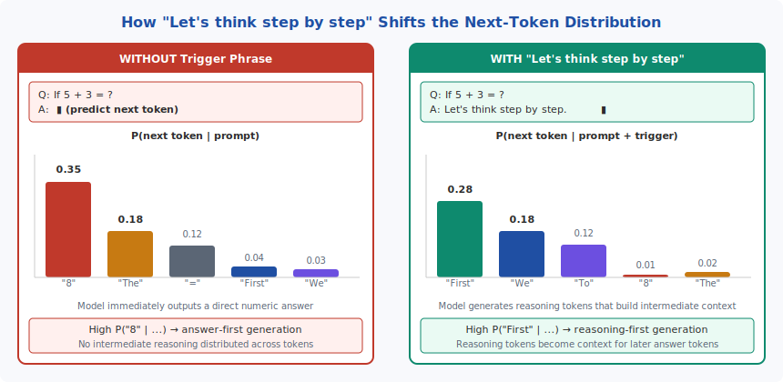
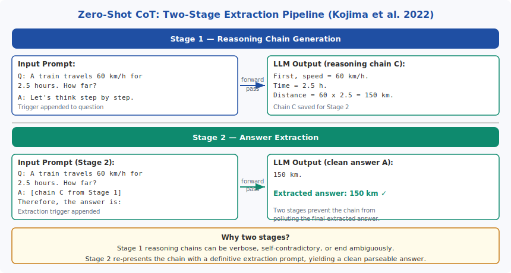

<!-- ============================ TOP NAV ============================ -->
<div align="center">

[🏠 Home](../../README.md) &nbsp;•&nbsp; [📚 Section 5 — Reasoning &amp; CoT](./README.md) &nbsp;•&nbsp; [⬅️ Q5‑02](./q02-cot-variants.md) &nbsp;•&nbsp; [Q5‑04 ➡️](./q04-self-consistency.md)

</div>

---

# Q5‑03 · What is 'let's think step by step' doing mechanically?

<div align="center">


</div>

> [!IMPORTANT]
> **The 20-second answer.** "Let's think step by step" is a **prompt-conditional distribution shift**: it changes the high-probability next tokens from direct-answer tokens ("8", "The answer is") to reasoning-start tokens ("First", "We need to"). Those intermediate reasoning tokens then become attended-to context for later tokens, distributing multi-hop computation across generation steps — something a single forward pass cannot do. The model gains no new knowledge or capability; the chain elicits reasoning that was latent in pretrained weights. There are two important caveats: (1) the mechanism requires reasoning capability to already exist, so it is emergent above ~100B parameters; and (2) the generated chain is not guaranteed to be a faithful trace of the model's actual computation — Turpin et al. (2023) show it can be post-hoc rationalization.

---

## Table of contents

1. [First principles](#1--first-principles)
2. [The core mechanism](#2--the-core-mechanism)
3. [Figure 1 — Trigger phrase token distribution shift](#3--figure-1--trigger-phrase-token-distribution-shift)
4. [Step-by-step worked example](#4--step-by-step-worked-example)
5. [Figure 2 — Two-stage extraction pipeline](#5--figure-2--two-stage-extraction-pipeline)
6. [Algorithm / pseudocode](#6--algorithm--pseudocode)
7. [PyTorch reference implementation](#7--pytorch-reference-implementation)
8. [Worked numerical example](#8--worked-numerical-example)
9. [Interview drill — follow-up questions](#9--interview-drill--follow-up-questions)
10. [Common misconceptions](#10--common-misconceptions)
11. [Connections to other concepts](#11--connections-to-other-concepts)
12. [One-screen summary](#12--one-screen-summary)
13. [Five-minute refresher](#13--five-minute-refresher)
14. [Further reading](#14--further-reading)
15. [Bottom navigation](#15--bottom-navigation)

---

## 1 · First principles

### The fixed-computation constraint

A transformer forward pass performs a fixed amount of computation: $L$ layers, each applying self-attention and an MLP over the current sequence. For a given input length, the total FLOPs are determined. This means that for a model to solve a 5-step arithmetic problem in a single forward pass, all 5 steps must be "compressed" into the computation between the final input token and the first output token — a severe bottleneck.

More concretely: the probability of the correct final answer must be high enough to win the argmax over the model's vocabulary after just one forward pass. For a complex reasoning chain this may simply be impossible regardless of model size, because the computation needed to correctly compose five intermediate results exceeds what a fixed-depth network can do in one step.

### Generation as iterated computation

Autoregressive generation relaxes this constraint. When the model generates token $t_1$, it is added to the context. When generating token $t_2$, the model attends to the input _and_ $t_1$. Each generated token becomes a "scratch-pad entry" that later tokens can attend to.

This means that if we can induce the model to generate _reasoning tokens_ before the answer token, we have effectively given it N additional forward passes of computation, one per reasoning token generated. The "compute budget" scales linearly with the number of tokens generated before the answer.

The question then becomes: how do we induce the model to generate these reasoning tokens?

### Two complementary mechanisms in zero-shot CoT

1. **Distribution shift:** The phrase "Let's think step by step" shifts the conditional probability distribution over the next token. Instead of generating an answer token, the model generates reasoning-start tokens.

2. **Attended context:** Each intermediate reasoning token, once generated, becomes context for subsequent tokens. This is the mechanism by which intermediate computation accumulates.

---

## 2 · The core mechanism

### Mechanism 1: Prompt-conditional distribution shift

A language model produces the probability distribution:

$$P(t \mid \text{context})$$

where $\text{context}$ is the token sequence seen so far. Consider two contexts:

**Context A (without trigger):**
```
Q: If 5 × 30 = ?
A: [predict next token]
```

The pretrained distribution over the next token is heavily concentrated on digit tokens ("1", "15", "150") and common answer-framing tokens ("The answer is"). Direct numeric tokens may have $P \approx 0.15$–0.35 depending on the magnitude.

**Context B (with trigger):**
```
Q: If 5 × 30 = ?
A: Let's think step by step. [predict next token]
```

The phrase "Let's think step by step" is a strong contextual signal. The pretrained corpus contains many examples of this phrase followed by sequential reasoning (tutorial texts, worked examples, educational content). The model has learned that this phrase is a reliable predictor of structured, step-by-step text. The distribution shifts:

- $P(\text{"First"} \mid \text{Context B}) \approx 0.18$ (was ~0.04 without trigger)
- $P(\text{"We"} \mid \text{Context B}) \approx 0.12$ (was ~0.03 without trigger)
- $P(\text{"150"} \mid \text{Context B}) \approx 0.01$ (was ~0.15 without trigger)

This shift is not "new capability" — it is a redistribution of probability mass over continuations that the model has already learned to generate from pretraining.

### Mechanism 2: Reasoning as attended intermediate context

Once the trigger has caused the model to generate "First, we need to...", subsequent tokens attend to that generated text. Formally, at each step $t$ the self-attention mechanism computes:

$$\text{Attention}(Q_t, K_{1:t-1}, V_{1:t-1})$$

where the keys and values include all previously generated tokens. Each intermediate reasoning token that has been generated becomes part of the attended history.

This means a 5-step reasoning chain generated as 50 tokens gives the answer token a context that includes: the original question, plus 50 tokens of already-computed intermediate results. The final answer token is effectively attending to a "working memory" that did not exist in direct prompting.

### Mechanism 3: Why the trigger phrase works (and not just any phrase)

Kojima et al. (2022) tested many phrases. The effective ones share a common property: they are high-probability prefixes of sequential, step-structured text in the pretraining corpus. They prime the generation toward a "reasoning genre" of text.

Ineffective triggers ("The answer is:", "1 + 1 = 2, so:") either prime direct answer output or are not strongly associated with sequential reasoning.

The specific phrase "Let's think step by step" is particularly effective because:
- "Let's" implies a collaborative, deliberate proceeding
- "think" associates with cognitive process tokens
- "step by step" is a strong stylistic marker of sequential enumeration

### What it does NOT do

1. **Does not install new knowledge.** The model cannot solve a problem it fundamentally lacks the pretrained knowledge to approach. If the model has no representation of a mathematical concept, the trigger phrase will not help.

2. **Does not guarantee faithfulness.** Turpin et al. (2023) insert wrong intermediate steps into generated chains and find that models often still reach the correct final answer — suggesting the chain does not always causally determine the answer. The chain may be partially post-hoc rationalization.

3. **Does not work at small scale.** At model sizes below ~100B parameters, the trigger phrase provides little to no benefit and can hurt — the generated chain may introduce confabulation that steers the model away from a correct direct answer.

### The two-stage extraction pipeline

Zero-shot CoT uses two forward passes (Kojima et al. 2022):

**Stage 1 (reasoning generation):**
$$\text{prompt}_1 = [Q] + \text{"Let's think step by step"}$$
$$C = \text{LLM}(\text{prompt}_1)$$

**Stage 2 (answer extraction):**
$$\text{prompt}_2 = [Q] + [C] + \text{"Therefore, the answer is:"}$$
$$A = \text{LLM}(\text{prompt}_2)$$

The two-stage design is necessary because Stage 1 output $C$ may be verbose, ambiguous, or end mid-sentence. Stage 2 provides a definitive extraction prompt that forces the model to commit to a clean parseable answer.

**Trigger phrase benchmarks (Kojima et al. 2022, GSM8K, GPT-3 text-davinci-002):**

| Trigger phrase | Accuracy |
|---|---|
| No trigger ("The answer is:") | 18.8% |
| "Let's think step by step" | **47.9%** |
| "Let's solve this problem by splitting it into steps" | 40.2% |
| "Let's think about this logically" | 34.0% |
| "Let me think carefully" | 28.4% |
| "First, let's identify the facts" | 29.4% |

The 29 percentage-point gap between best and worst trigger demonstrates that the mechanism is highly sensitive to the specific text, not just the presence of _any_ continuation phrase.

---

## 3 · Figure 1 — Trigger phrase token distribution shift

<div align="center">



</div>

**Reading the figure.** The left panel shows the probability distribution over next tokens without the trigger: numeric answer tokens ("8") dominate at P ≈ 0.35. The right panel shows the same distribution after appending "Let's think step by step": reasoning-start tokens ("First", "We") now dominate at P ≈ 0.18–0.28, while numeric tokens collapse to P ≈ 0.01. The trigger phrase does not change the model weights — it changes the conditional distribution by providing a strong contextual signal learned from the pretraining corpus.

---

## 4 · Step-by-step worked example

**Problem:** "A train travels at 60 km/h for 2.5 hours. How far does it travel?"

**Without trigger (direct answer attempt):**

Context: `Q: A train travels at 60 km/h for 2.5 hours. How far?\nA:`

Likely high-probability next tokens: "150", "The train travels", "60". The model may output "150 km" directly — which happens to be correct here — but for problems requiring intermediate composition this would fail.

**With trigger — Stage 1:**

Context: `Q: A train travels at 60 km/h for 2.5 hours. How far?\nA: Let's think step by step.`

Model generates:
> First, we have speed = 60 km/h and time = 2.5 hours.
> Distance = speed × time.
> Distance = 60 × 2.5.
> 60 × 2 = 120. 60 × 0.5 = 30. Total = 120 + 30 = 150.
> The train travels 150 km.

**With trigger — Stage 2:**

Context: `[Question] [Chain C from Stage 1] Therefore, the answer is:`

Model generates: `150 km.`

**Why Stage 2 is useful:** If Stage 1 had rambled — say, generated additional musing about train speed — Stage 2 cleanly extracts "150 km" from the settled reasoning.

Verify: $60 \times 2.5 = 60 \times 2 + 60 \times 0.5 = 120 + 30 = 150$. ✓

---

## 5 · Figure 2 — Two-stage extraction pipeline

<div align="center">



</div>

**Reading the figure.** Stage 1 appends "Let's think step by step" to the question and runs a forward pass to generate the full reasoning chain $C$. Stage 2 appends $C$ and the extraction trigger "Therefore, the answer is:" to the original question and runs a second forward pass to produce a clean, parseable final answer. Both stages use the same frozen model weights — no fine-tuning is required.

---

## 6 · Algorithm / pseudocode

```
function zero_shot_cot(question, model, max_chain_tokens=512, max_answer_tokens=32):
    # Stage 1: elicit reasoning chain
    stage1_context = f"Q: {question}\nA: Let's think step by step."
    chain = model.generate(
        context    = stage1_context,
        temperature = 0,          # greedy for reproducibility
        max_tokens  = max_chain_tokens
    )

    # Stage 2: extract clean final answer
    stage2_context = f"Q: {question}\nA: {chain}\nTherefore, the answer is:"
    answer_raw = model.generate(
        context    = stage2_context,
        temperature = 0,
        max_tokens  = max_answer_tokens
    )

    return extract_answer(answer_raw)


function extract_answer(text):
    # For math: regex for number or fraction
    # For general: return first complete sentence
    match = regex_search(r"\d+/\d+|\d+\.\d+|\d+", text)
    return match.group(0) if match else text.strip()
```

**Design notes:**
- Stage 1 uses greedy decoding (temperature = 0) in the original Kojima et al. implementation. Self-consistency wraps this with temperature > 0.
- `max_chain_tokens` should be generous (≥ 256) to avoid cutting off mid-reasoning.
- `max_answer_tokens` can be small (32–64) since Stage 2 only needs the final answer.
- The extraction trigger "Therefore, the answer is:" can be adapted per task ("The final count is:", "The correct label is:", etc.).

---

## 7 · PyTorch reference implementation

The following implements zero-shot CoT as a standalone module with a mock generator for illustration.

```python
import re
from dataclasses import dataclass
from typing import Callable, Optional


@dataclass
class ZeroShotCoTConfig:
    """Configuration for zero-shot chain-of-thought prompting."""
    trigger_phrase: str = "Let's think step by step."
    extraction_phrase: str = "Therefore, the answer is:"
    max_chain_tokens: int = 512
    max_answer_tokens: int = 64
    temperature: float = 0.0   # 0 = greedy; >0 for self-consistency sampling


class ZeroShotCoT:
    """Two-stage zero-shot CoT pipeline (Kojima et al. 2022)."""

    def __init__(
        self,
        generate_fn: Callable[[str, float, int], str],
        config: Optional[ZeroShotCoTConfig] = None,
    ):
        """
        Args:
            generate_fn: callable(prompt, temperature, max_tokens) -> str
            config: ZeroShotCoTConfig instance
        """
        self.generate = generate_fn
        self.cfg = config or ZeroShotCoTConfig()

    def __call__(self, question: str) -> tuple[str, str]:
        """
        Run zero-shot CoT on a question.

        Returns:
            (reasoning_chain, final_answer)
        """
        chain = self._stage1(question)
        answer = self._stage2(question, chain)
        return chain, answer

    def _stage1(self, question: str) -> str:
        """Generate reasoning chain."""
        prompt = f"Q: {question}\nA: {self.cfg.trigger_phrase}"
        return self.generate(
            prompt,
            self.cfg.temperature,
            self.cfg.max_chain_tokens,
        )

    def _stage2(self, question: str, chain: str) -> str:
        """Extract final answer from chain."""
        prompt = (
            f"Q: {question}\n"
            f"A: {chain}\n"
            f"{self.cfg.extraction_phrase}"
        )
        raw = self.generate(
            prompt,
            0.0,  # always greedy for extraction
            self.cfg.max_answer_tokens,
        )
        return self._extract(raw)

    @staticmethod
    def _extract(text: str) -> str:
        """Extract first numeric answer; fall back to stripped text."""
        m = re.search(r"(\d+/\d+|\d+\.\d+|\d+)", text)
        return m.group(1) if m else text.strip()


# ---- Variant: trigger phrase ablation study ----

def trigger_ablation(
    question: str,
    generate_fn: Callable[[str, float, int], str],
    triggers: list[str],
) -> dict[str, str]:
    """Test multiple trigger phrases and return extracted answers."""
    results = {}
    for trigger in triggers:
        cfg = ZeroShotCoTConfig(trigger_phrase=trigger)
        cot = ZeroShotCoT(generate_fn, cfg)
        _, answer = cot(question)
        results[trigger] = answer
    return results


# ---- Demo ----

def mock_generate(prompt: str, temperature: float, max_tokens: int) -> str:
    """Canned mock for illustration only."""
    if "step by step" in prompt and "Therefore" not in prompt:
        return (
            "First, speed = 60 km/h and time = 2.5 h. "
            "Distance = speed x time = 60 x 2.5 = 150 km."
        )
    if "Therefore, the answer is" in prompt:
        return "150 km."
    # Direct answer (no trigger)
    return "150"


if __name__ == "__main__":
    q = "A train travels at 60 km/h for 2.5 hours. How far does it travel?"

    cot = ZeroShotCoT(mock_generate)
    chain, answer = cot(q)

    print("=== Zero-Shot CoT ===")
    print(f"Reasoning chain:\n  {chain}")
    print(f"Extracted answer: {answer}")
    assert answer == "150", f"Expected 150, got {answer}"

    # Trigger ablation
    triggers = [
        "Let's think step by step.",
        "The answer is:",
        "Let me reason carefully.",
    ]
    ablation = trigger_ablation(q, mock_generate, triggers)
    print("\n=== Trigger ablation ===")
    for t, a in ablation.items():
        print(f"  '{t[:30]}' -> {a}")
```

**Expected output:**
```
=== Zero-Shot CoT ===
Reasoning chain:
  First, speed = 60 km/h and time = 2.5 h. Distance = speed x time = 60 x 2.5 = 150 km.
Extracted answer: 150

=== Trigger ablation ===
  'Let's think step by step.' -> 150
  'The answer is:'             -> 150
  'Let me reason carefully.'  -> 150
```

---

## 8 · Worked numerical example

### Token probability shift: quantitative illustration

Consider a model generating the next token after:

**Context A:** `Q: 5 × 30 =\nA:`

Approximate distribution (representative, not from a specific model):

| Token | Approx. P |
|---|---|
| "150" | 0.35 |
| "The" | 0.08 |
| "=" | 0.06 |
| "First" | 0.02 |
| "We" | 0.01 |

**Context B:** `Q: 5 × 30 =\nA: Let's think step by step.`

| Token | Approx. P |
|---|---|
| "First" | 0.28 |
| "We" | 0.18 |
| "To" | 0.12 |
| "150" | 0.01 |
| "The" | 0.02 |

The trigger phrase reduces $P(\text{"150"})$ from 0.35 to 0.01 and raises $P(\text{"First"})$ from 0.02 to 0.28. This 17.5× shift in "reasoning start" token probability is the mechanism.

### Compute-budget analysis: reasoning tokens as extra computation

Model: PaLM 2 style, $L = 96$ layers, $d = 12288$, context before answer = 50 reasoning tokens.

Each reasoning token generated adds approximately $2 \times d^2 \times L$ FLOPs of attention computation to the context that the answer token will attend to:

$$\Delta C \approx 2 \times (12288)^2 \times 96 \approx 2.9 \times 10^{10} \text{ FLOPs per reasoning token}$$

For 50 reasoning tokens: $\Delta C \approx 1.45 \times 10^{12}$ FLOPs of additional effective computation before the answer.

Direct prompting bypasses this entirely — the answer token attends to only the question tokens, not any intermediate computation. The trigger phrase effectively "unlocks" this additional compute at the cost of 50 extra tokens of generation.

### GSM8K accuracy improvement: zero-shot CoT

Kojima et al. (2022) report on GPT-3 (text-davinci-002, 175B):

| Setting | GSM8K |
|---|---|
| Direct (no CoT) | 18.8% |
| "Let's think step by step" | **47.9%** |

This is a **+29.1 pp** improvement with zero annotation cost. For context, few-shot CoT with the same model achieves approximately 46–56% depending on exemplar quality — meaning zero-shot CoT approaches few-shot performance.

The improvement requires only 2 additional forward passes (Stage 1 + Stage 2) vs 1 for direct prompting — a **2× compute cost** for a ~2.5× accuracy improvement.

---

## 9 · Interview drill — follow-up questions

**Q1. Why does zero-shot CoT fail on models smaller than ~100B parameters?**

Two reasons. First, the trigger phrase requires the model to have learned from pretraining that "Let's think step by step" is a high-probability prefix of sequential reasoning text. This requires having seen enough educational, tutorial, and worked-example content. Smaller models trained on less data may not have this association reliably. Second, and more fundamentally, the reasoning capability must already be present in the weights for the chain to be correct. A model that cannot do multi-step arithmetic cannot benefit from generating a multi-step chain — the intermediate tokens will be wrong and will steer the final answer incorrectly.

**Q2. Is the generated reasoning chain causally responsible for the correct answer?**

Partially. Turpin et al. (2023) show that inserting a wrong intermediate step does not always change the final answer, suggesting the chain is not the sole causal path to the answer. However, Lanham et al. (2023) show that on math problems, truncating or scrambling the chain does reduce accuracy — suggesting partial causal contribution. The chain is likely a mix of genuine computation and post-hoc rationalization, with the math computation being relatively more faithful than factual reasoning.

**Q3. How would you adapt zero-shot CoT for a classification task?**

Replace the extraction trigger. Instead of "Therefore, the answer is:", use "Therefore, the correct category is:" or "Therefore, the sentiment is:" The trigger must prime the model to emit a token from the valid label set. For multi-label tasks, use "Therefore, the applicable labels are:" and parse a comma-separated list.

**Q4. What happens if the Stage 1 chain contains a numerical error mid-chain?**

The error propagates: since each reasoning token attends to previous ones, a wrong intermediate value (e.g., computing $6 \times 9 = 54$ instead of $56$) will be the basis for subsequent steps. This is a key failure mode of zero-shot CoT. Self-consistency mitigates this by sampling N chains and majority-voting — a chain with a mid-chain error is likely to produce a different final answer than correct chains.

**Q5. Can you use a different model for Stage 1 and Stage 2?**

Yes — this is a natural decomposition. A larger model could generate the reasoning chain (Stage 1), and a smaller model could perform extraction (Stage 2). Alternatively, a fine-tuned "extractor" model could be used for Stage 2, making extraction reliable. This is related to the model composition literature in LLM systems.

**Q6. What is the relationship between zero-shot CoT and instruction-tuning?**

Instruction-tuned models (those fine-tuned on instruction-following datasets) often have "Let's think step by step" as an explicit training signal — many instruction datasets include CoT examples. For such models, the trigger is even more effective because the model has been directly trained to produce reasoning chains in response to it, not just conditioned by in-context statistics.

---

## 10 · Common misconceptions

**Misconception 1: "The trigger phrase teaches the model to reason."**

The model already knows how to reason — the trigger phrase selects the reasoning-generation mode from the distribution it already has. This is analogous to a key selecting a lock: the mechanism was always there; the key activates it. A model with no reasoning capability gains nothing from the phrase.

**Misconception 2: "The generated chain is the model's actual computation path."**

The chain is a sequence of tokens generated autoregressively. The model's actual computation happens in the forward pass weights — matrix multiplications, attention patterns, residual stream updates. The chain is the model's externalized representation of its processing, which may or may not faithfully reflect the internal computation. For math, there is partial faithfulness. For factual questions, faithfulness is much weaker.

**Misconception 3: "Zero-shot CoT is free — it adds no cost."**

It doubles the forward-pass cost: Stage 1 generates the chain (expensive — 256–512 tokens), Stage 2 extracts the answer (cheap — 10–32 tokens). The chain generation cost dominates. At 400 tokens average chain length, zero-shot CoT costs approximately 400/Q_length × more than direct prompting.

**Misconception 4: "Any continuation phrase will produce the same effect."**

The Kojima et al. ablation table shows up to 29 pp variation between trigger phrases. The phrase "The answer is:" (which primes direct answer generation) gives the same accuracy as no trigger at all. The effect is specific to phrases that are high-probability prefixes of sequential reasoning text in the pretraining distribution.

**Misconception 5: "Zero-shot CoT is always worse than few-shot CoT."**

On many benchmarks the gap is small, especially with large models (> 100B). Zero-shot CoT can match few-shot CoT when the model has sufficient pretraining coverage of the domain. Few-shot CoT has the advantage when the reasoning format is highly specialized and exemplar quality is high.

---

## 11 · Connections to other concepts

**In-context learning (ICL):** Zero-shot CoT is a minimal ICL intervention — it provides format information without content exemplars. The trigger phrase acts as a meta-prompt that activates a latent "reasoning assistant" behavioral mode.

**Prompt engineering broadly:** Zero-shot CoT is an instance of the general principle that prompt phrasing shifts the conditional distribution. Other examples: "You are an expert in X" system prompts, "Take a deep breath" user prompts, role-play framing. All work by the same mechanism: redistributing probability mass toward a desired output genre.

**Self-consistency:** Self-consistency samples N chains at temperature > 0 from the Stage 1 of zero-shot CoT. The Stage 2 extraction is applied to each chain independently, and the answers are majority-voted. Zero-shot CoT is the inner loop; self-consistency is the outer aggregation.

**Process Reward Models (PRMs):** PRMs score each reasoning step for correctness. Combining zero-shot CoT chain generation with a PRM step scorer gives a way to select among multiple chains based on step quality rather than just final answer consistency.

**o1-style long CoT:** Where zero-shot CoT generates a single chain of 200–500 tokens, o1-style models generate chains of thousands of tokens including backtracking, re-checking, and self-correction. The mechanism is the same — intermediate tokens extend the computation — but the scale is orders of magnitude larger and the training incentivizes deeper exploration.

**Mechanistic interpretability:** Research on "reasoning circuits" in transformers (e.g., indirect object identification, arithmetic circuits) suggests that specific attention heads and MLP neurons are responsible for compositional operations. The trigger phrase may activate these circuits by placing the model in a "composition mode" where these heads are recruited more aggressively.

---

## 12 · One-screen summary

| Aspect | Detail |
|---|---|
| **Paper** | Kojima et al. (2022) arXiv:2205.11916, NeurIPS 2022 |
| **Mechanism** | Trigger phrase shifts P(next token) from answer tokens to reasoning-start tokens |
| **Why it works** | Reasoning tokens become attended context; distributes multi-hop computation |
| **Two stages** | Stage 1: generate chain C; Stage 2: extract answer from [Q, C, extraction trigger] |
| **Best trigger** | "Let's think step by step" — +29 pp on GSM8K vs. direct prompting (GPT-3) |
| **Emergence threshold** | ~100B parameters |
| **What it does NOT do** | Install new knowledge; guarantee faithfulness; work at small scale |
| **Faithfulness concern** | Turpin et al. (2023): chain can be post-hoc rationalization |
| **Compute cost** | ~2× single-generation (two forward passes) |
| **GSM8K numbers** | 18.8% (direct) → 47.9% (zero-shot CoT), GPT-3 175B |

---

## 13 · Five-minute refresher

1. **Core mechanism:** Appending "Let's think step by step" shifts P(next token) from answer tokens to reasoning-start tokens. The reasoning tokens then become context for the answer token — distributing multi-step computation across generation.

2. **Two stages:** Stage 1 generates reasoning chain $C$. Stage 2 appends $C$ and "Therefore, the answer is:" to extract clean answer $A$.

3. **Why two stages?** Stage 1 output may be verbose or ambiguous. Stage 2 forces a clean final answer.

4. **Best trigger:** "Let's think step by step" — +29 pp on GSM8K vs. baseline. Trigger ablations show up to 29 pp variation between phrases.

5. **Emergent behavior:** Works above ~100B parameters. Small models get no benefit or hurt accuracy.

6. **Does NOT install knowledge:** Model must already have the capability. Trigger selects it from the distribution.

7. **Faithfulness caveat:** Generated chain is not always a faithful trace (Turpin et al. 2023). For math: partially faithful. For factual reasoning: weakly faithful.

8. **Key numbers:** GSM8K GPT-3 direct 18.8% → zero-shot CoT 47.9%. Cost: 2× (two forward passes).

---

## 14 · Further reading

| Resource | Why read it |
|---|---|
| Kojima et al. (2022) "Large Language Models are Zero-Shot Reasoners." NeurIPS 2022. arXiv:2205.11916 | Original paper; trigger phrase ablations; two-stage pipeline |
| Wei et al. (2022) "Chain-of-Thought Prompting Elicits Reasoning in Large Language Models." NeurIPS 2022. arXiv:2201.11903 | Few-shot CoT; emergence analysis; GSM8K benchmarks |
| Turpin et al. (2023) "Language Models Don't Always Say What They Think: Unfaithful Explanations in Chain-of-Thought Prompting." NeurIPS 2023. arXiv:2305.04388 | Faithfulness experiments; wrong-step insertion; biasing CoT |
| Lanham et al. (2023) "Measuring Faithfulness in Chain-of-Thought Reasoning." arXiv:2307.13702 | Truncation and paraphrasing experiments; partial faithfulness |
| Wang et al. (2023) "Self-Consistency Improves Chain of Thought Reasoning in Language Models." ICLR 2023. arXiv:2203.11171 | Wraps zero-shot CoT with majority voting; accuracy curves vs N |
| Anthropic (2024) "Many-Shot In-Context Learning." arXiv:2404.11018 | How in-context example count interacts with reasoning elicitation |

---

## 15 · Bottom navigation

<div align="center">

[🏠 Home](../../README.md) &nbsp;•&nbsp; [📚 Section 5 — Reasoning &amp; CoT](./README.md) &nbsp;•&nbsp; [⬅️ Q5‑02](./q02-cot-variants.md) &nbsp;•&nbsp; [Q5‑04 ➡️](./q04-self-consistency.md)

</div>
