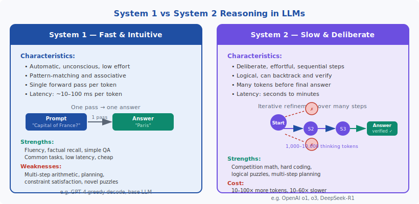
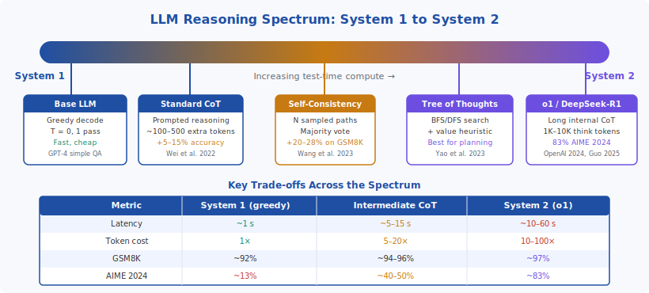

<!-- ============================ TOP NAV ============================ -->
<div align="center">

[🏠 Home](../../README.md) &nbsp;•&nbsp; [📚 Section 5 — Reasoning &amp; CoT](./README.md) &nbsp;•&nbsp; [⬅️ Q5‑05](./q05-tree-of-thoughts.md) &nbsp;•&nbsp; [Q5‑07 — Test-Time Compute Scaling ➡️](./q07-test-time-compute-scaling.md)

</div>

---

# Q5‑06 · What is the difference between system 1 and system 2 reasoning in the LLM context?

<div align="center">


</div>

> [!IMPORTANT]
> **The 20-second answer.** Kahneman's dual-process theory distinguishes System 1 (fast, automatic, pattern-driven) from System 2 (slow, deliberate, logical). In the LLM context, **every transformer forward pass is intrinsically System 1**: one fixed computation maps a context to the next token. System 2 behavior is **emulated** by generating long chains of reasoning tokens before committing to a final answer — each token is still a System 1 operation, but the sequence of tokens implements search, backtracking, and verification. Models like OpenAI o1 and DeepSeek-R1 produce 1,000–10,000 "thinking" tokens on hard problems, yielding ~83% on AIME 2024 (with 64-sample consensus; single-pass o1 ~74%) vs ~12% for standard GPT-4o greedy — at the cost of 10–100× more tokens and 10–60× higher latency.

---

## Table of contents

1. [First principles: Kahneman's dual-process theory](#1--first-principles-kahnemans-dual-process-theory)
2. [Mapping to LLMs: the core asymmetry](#2--mapping-to-llms-the-core-asymmetry)
3. [Figure 1 — System 1 vs System 2 in LLMs](#3--figure-1--system-1-vs-system-2-in-llms)
4. [Step-by-step worked example](#4--step-by-step-worked-example)
5. [Figure 2 — The LLM reasoning spectrum](#5--figure-2--the-llm-reasoning-spectrum)
6. [Algorithm / pseudocode](#6--algorithm--pseudocode)
7. [PyTorch reference implementation](#7--pytorch-reference-implementation)
8. [Worked numerical example](#8--worked-numerical-example)
9. [Interview drill — follow-up questions](#9--interview-drill--follow-up-questions)
10. [Common misconceptions](#10--common-misconceptions)
11. [Connections to other concepts](#11--connections-to-other-concepts)
12. [One-screen summary](#12--one-screen-summary)
13. [Five-minute refresher](#13--five-minute-refresher)
14. [Further reading](#14--further-reading)
15. [References](#15--references)

---

## 1 · First principles: Kahneman's dual-process theory

Daniel Kahneman's 2011 book *Thinking, Fast and Slow* popularized the **dual-process model of cognition**, which describes two qualitatively different modes of thought:

**System 1** operates automatically and rapidly, with little or no effort and no sense of voluntary control. It is associative, pattern-driven, and largely unconscious. System 1 handles familiar, routine tasks: recognizing a face, reading a word, catching a ball, answering "What is 2 + 2?" It draws on compiled knowledge accumulated through experience and executes without deliberation.

**System 2** allocates attention to effortful mental activities that demand it. It is slow, sequential, and conscious. System 2 handles novel or difficult tasks: verifying a complex argument, solving a multi-step algebra problem, planning a route through an unfamiliar city. It can apply rules, decompose problems into subproblems, and override the fast intuitive answers produced by System 1.

The key relationship: **System 2 supervision is expensive**. Humans default to System 1 and invoke System 2 only when the stakes are high or the problem is clearly beyond quick pattern-matching. Much of human error stems from trusting System 1 when System 2 was needed.

For example, answer quickly: "A bat and a ball cost $1.10. The bat costs $1 more than the ball. How much does the ball cost?" Most people's System 1 immediately says "$0.10" — wrong. System 2, working it through: if ball = $x, bat = $x + $1, total = $2x + $1 = $1.10, so $x = $0.05. The ball costs five cents.

---

## 2 · Mapping to LLMs: the core asymmetry

### Why LLMs are intrinsically System 1

A transformer's forward pass is a **fixed-depth, highly parallel computation**. Given a context of $n$ tokens, the model applies $L$ transformer layers, each involving attention and feed-forward operations, and outputs a probability distribution over the next token. This computation has no loops, no branching, no ability to "think longer" within a single forward pass.

$$\text{next token} = \arg\max_v P(v \mid x_1, \ldots, x_n; \theta)$$

This is quintessentially System 1: **one input, one output, fixed cost**. The model cannot slow down to deliberate on hard problems any more than a CPU can run a fixed function faster by trying harder.

Yann LeCun has argued precisely this point: "LLMs are fundamentally System 1 machines. They do not reason; they produce plausible-sounding text based on pattern matching over training data." While this is a provocation rather than a complete description, it captures a deep truth about the architecture.

### How System 2 is emulated

The key insight of modern reasoning models is that **autoregressive generation itself is a loop**. Although each forward pass is fixed-cost and System 1, the model can generate many tokens before producing a final answer — and those intermediate tokens can encode deliberation, verification, and backtracking.

Formally, standard greedy decoding generates the answer $a$ as:

$$a = \text{LLM}(\text{prompt})$$

System 2-emulating generation instead produces a reasoning trace $r$ first:

$$r, a = \text{LLM}(\text{prompt} + \text{``Let me think step by step...''})$$

where $r$ contains $T$ intermediate tokens. The key formula for compute consumption is:

$$\text{Compute}_{\text{System 2}} = \text{Compute}_{\text{System 1}} \times T_{\text{thinking}}$$

For o1 on competition math, $T_{\text{thinking}} \approx 1\,000\text{–}10\,000$, so the model is spending roughly 10,000 times more compute per problem than a single forward pass would allow.

### The crucial distinction: emulation vs. true System 2

This framing reveals a subtle but important point. In human cognition, System 2 genuinely has different computational properties from System 1 — it is slower, sequential, and can backtrack. In LLMs, System 2 is **emulated by concatenating System 1 outputs**. Each thinking token is produced by the same fixed System 1 mechanism. The "deliberation" emerges from the structure of the generated text, not from any fundamentally different computational process.

François Chollet (2024) argues that true System 2 reasoning requires **genuine search** — exploring a branching space of possibilities and evaluating them against an objective. Mere sequential token generation that looks like reasoning may still be sophisticated pattern completion rather than true logical inference. This remains an open research question.

### The compute asymmetry

| Mode | Compute per query | Latency | Token cost |
|------|-------------------|---------|------------|
| System 1 (greedy) | $O(L \cdot n)$ | ~1 s | 1× |
| System 2 (long CoT) | $O(L \cdot (n + T))$ | ~10–60 s | 10–100× |

Here $L$ = model depth, $n$ = prompt length, $T$ = number of reasoning tokens generated. The asymmetry is entirely in $T$: investing more test-time compute buys more "thinking steps."

---

## 3 · Figure 1 — System 1 vs System 2 in LLMs

<div align="center">

</div>

**Left panel (System 1):** A prompt flows through a single forward pass to an immediate answer. Fast, cheap, fluent — but unable to deliberate. Failures on multi-step problems are catastrophic because there is no mechanism for self-correction.

**Right panel (System 2):** A prompt triggers a multi-step search process. Some paths are pruned (wrong turns), the model continues along promising paths, and produces a verified final answer. Each node in the tree is itself a System 1 forward pass; the search structure is what provides System 2-like behavior. Cost: 1,000–10,000 extra thinking tokens.

---

## 4 · Step-by-step worked example

Consider the same arithmetic problem under both modes.

### Problem: What is 177 × 238?

**System 1 approach — greedy decode:**

The model sees "177 × 238 =" and immediately produces the next most-probable token. If 177 × 238 appeared in training data or is close to seen examples, the model might output "42126" correctly. But for novel large multiplications, the probability of a direct recall error is substantial — the model is guessing from a distribution over plausible-looking numbers.

**System 2 approach — explicit reasoning trace:**

```
Let me compute 177 × 238 step by step.

177 × 238
= 177 × (200 + 38)
= 177 × 200 + 177 × 38

177 × 200 = 35,400

177 × 38:
= 177 × (40 − 2)
= 177 × 40 − 177 × 2
= 7,080 − 354
= 6,726

Total: 35,400 + 6,726 = 42,126
```

**Verification:** $177 \times 200 = 35{,}400$. $177 \times 40 = 7{,}080$. $177 \times 2 = 354$. $7{,}080 - 354 = 6{,}726$. $35{,}400 + 6{,}726 = 42{,}126$. ✓

**Why the System 2 path is more reliable for novel problems:**

The reasoning trace decomposes the problem into sub-problems that are each well within the model's direct recall ability: multiplying by 200 (trivial), multiplying by 40 (doable), multiplying by 2 (trivial), and adding. Even if no training example showed "177 × 238" explicitly, the compositional path uses primitives the model has seen millions of times.

For the simpler case, 17 × 23: System 1 likely recalls this directly because such products appear often in training data. System 2 would decompose: $17 \times 23 = 17 \times 20 + 17 \times 3 = 340 + 51 = 391$. ✓ Both give the right answer, but System 2 is more robust to distribution shift to larger or unfamiliar numbers.

---

## 5 · Figure 2 — The LLM reasoning spectrum

<div align="center">

</div>

The spectrum illustrates that there is no binary distinction — rather a continuum of test-time compute investment. Moving left to right:

1. **Base LLM (greedy):** Purest System 1. Single path, no deliberation, minimal tokens.
2. **Standard CoT:** Adds a reasoning preamble, but still single-path and temperature-zero. Modest cost increase, meaningful accuracy gain on medium-difficulty problems.
3. **Self-consistency:** Samples $N$ chains, takes a majority vote. Still no explicit search, but sampling variance averages out errors. 10–30% improvement on grade-school math.
4. **Tree of Thoughts:** Explicit BFS/DFS with a value heuristic. True branching search, expensive but best for combinatorial planning tasks.
5. **o1 / DeepSeek-R1:** End-to-end trained to produce long internal reasoning chains (sometimes hidden from the user). Achieves ~83% on AIME 2024 (with 64-sample consensus; single-pass ~74%) — state-of-the-art on competition math. Genuinely System 2-like in its allocation of compute.

The metrics row at the bottom makes the trade-off concrete: latency and token cost grow monotonically left-to-right, while hard-problem accuracy also improves. For simple questions ("What is the capital of France?"), spending 10,000 tokens is pure waste; for AIME 2024 problems, it is necessary.

---

## 6 · Algorithm / pseudocode

### System 1: standard greedy decode

```
function system1_decode(prompt, model, max_new_tokens):
    tokens = tokenize(prompt)
    for t in 1 .. max_new_tokens:
        logits = model.forward(tokens)           # one forward pass
        next_token = argmax(logits[-1])           # greedy selection
        tokens.append(next_token)
        if next_token == EOS: break
    return detokenize(tokens[len(prompt):])
```

**Compute:** $O(L \cdot n_t)$ per step, $O(L \cdot n_{\text{final}}^2)$ total (KV cache reduces this to $O(L \cdot n_{\text{final}})$ amortized).

### System 2: long chain-of-thought decode

```
function system2_decode(prompt, model, think_budget, max_final_tokens):
    # Phase 1: generate reasoning trace
    think_prompt = prompt + "<think>\n"
    thinking_tokens = system1_decode(think_prompt, model, think_budget)
    
    # Phase 2: generate final answer conditioning on trace
    full_context = think_prompt + thinking_tokens + "</think>\n"
    answer = system1_decode(full_context, model, max_final_tokens)
    
    return answer, thinking_tokens   # caller may hide thinking_tokens
```

**Key insight:** `system2_decode` calls `system1_decode` twice, and the first call is allowed to be very long (large `think_budget`). The entire System 2 effect comes from conditioning the final answer on a long, structured internal monologue.

### Adaptive compute allocation

A more sophisticated variant allocates compute based on estimated problem difficulty:

```
function adaptive_decode(prompt, model, difficulty_estimator):
    difficulty = difficulty_estimator(prompt)   # e.g. perplexity, length, category
    if difficulty < THRESHOLD_EASY:
        return system1_decode(prompt, model, max_new_tokens=256)
    elif difficulty < THRESHOLD_HARD:
        return system2_decode(prompt, model, think_budget=1000, ...)
    else:
        return system2_decode(prompt, model, think_budget=8000, ...)
```

This mirrors the human heuristic of reserving System 2 for problems that merit the cost.

---

## 7 · PyTorch reference implementation

```python
import torch
from transformers import AutoTokenizer, AutoModelForCausalLM

class DualProcessLLM:
    """
    Demonstrates System 1 vs System 2 decoding with a causal LM.
    
    System 1: greedy single-pass decode.
    System 2: generate a reasoning trace first, then produce the final answer.
    """

    def __init__(self, model_name: str = "gpt2", device: str = "cpu"):
        self.tokenizer = AutoTokenizer.from_pretrained(model_name)
        self.model = AutoModelForCausalLM.from_pretrained(model_name).to(device)
        self.model.eval()
        self.device = device

        # Ensure pad token exists (needed for batched generation)
        if self.tokenizer.pad_token is None:
            self.tokenizer.pad_token = self.tokenizer.eos_token

    @torch.inference_mode()
    def system1_decode(self, prompt: str, max_new_tokens: int = 50) -> str:
        """
        Pure System 1: greedy decode, single autoregressive pass.
        O(max_new_tokens) forward passes with KV-cache.
        """
        inputs = self.tokenizer(prompt, return_tensors="pt").to(self.device)
        input_len = inputs["input_ids"].shape[1]

        outputs = self.model.generate(
            **inputs,
            max_new_tokens=max_new_tokens,
            do_sample=False,        # greedy
            temperature=1.0,
            pad_token_id=self.tokenizer.pad_token_id,
        )
        # Decode only newly generated tokens
        new_tokens = outputs[0, input_len:]
        return self.tokenizer.decode(new_tokens, skip_special_tokens=True)

    @torch.inference_mode()
    def system2_decode(
        self,
        prompt: str,
        think_budget: int = 512,
        max_final_tokens: int = 100,
        think_prefix: str = "Let me think step by step:\n",
    ) -> tuple[str, str]:
        """
        System 2 emulation:
          1. Generate a reasoning trace (think_budget tokens).
          2. Condition the final answer on that trace.
        
        Returns (final_answer, reasoning_trace).
        """
        # Phase 1: generate reasoning trace
        think_prompt = prompt + "\n" + think_prefix
        reasoning_trace = self.system1_decode(think_prompt, max_new_tokens=think_budget)

        # Phase 2: final answer conditioned on trace
        full_context = think_prompt + reasoning_trace + "\nFinal answer:"
        final_answer = self.system1_decode(full_context, max_new_tokens=max_final_tokens)

        return final_answer, reasoning_trace

    def compare(self, prompt: str) -> dict:
        """Run both modes and report token counts and outputs."""
        # System 1
        s1_answer = self.system1_decode(prompt, max_new_tokens=20)
        s1_tokens = len(self.tokenizer.encode(s1_answer))

        # System 2
        s2_answer, trace = self.system2_decode(prompt, think_budget=200)
        s2_tokens = len(self.tokenizer.encode(trace)) + len(self.tokenizer.encode(s2_answer))

        return {
            "system1_answer": s1_answer,
            "system1_tokens": s1_tokens,
            "system2_answer": s2_answer,
            "system2_reasoning_trace": trace,
            "system2_total_tokens": s2_tokens,
            "token_overhead": s2_tokens / max(s1_tokens, 1),
        }


# Example usage
if __name__ == "__main__":
    llm = DualProcessLLM()
    problem = "What is 17 times 23?"
    result = llm.compare(problem)

    print(f"System 1 answer ({result['system1_tokens']} tokens):")
    print(f"  {result['system1_answer']}")
    print()
    print(f"System 2 answer ({result['system2_total_tokens']} tokens, "
          f"{result['token_overhead']:.1f}x overhead):")
    print(f"  Trace: {result['system2_reasoning_trace'][:120]}...")
    print(f"  Final: {result['system2_answer']}")
```

**Notes on the implementation:**

- `system1_decode` wraps `model.generate` with `do_sample=False` (greedy), which is the canonical System 1 configuration.
- `system2_decode` is a two-phase call: generate a long chain first, then append a final-answer marker and generate the short conclusion. This mirrors how o1-style models work, except that in production those models are fine-tuned specifically to populate the reasoning trace effectively.
- The `token_overhead` ratio quantifies the System 2 cost. For GPT-2 on toy problems, this is modest; for o1 on competition math, it is 10–100×.
- Real o1-style models hide the thinking trace from users (`<think>…</think>` tokens are stripped from the API response) but include them in the KV cache during generation.

---

## 8 · Worked numerical example

### Problem: Compute 177 × 238.

#### System 1 (direct recall / pattern completion)

The model generates the next token after seeing "177 × 238 =". If this product is not in training data, the model interpolates from nearby multiplications seen during pretraining. Common failure modes: outputting "42,126" correctly by luck, or producing a plausible but wrong number like "42,186". No guarantee of correctness.

#### System 2 (explicit decomposition)

Step 1 — decompose into easier multiplications:

$$177 \times 238 = 177 \times (200 + 38)$$

Step 2 — distribute:

$$= 177 \times 200 \;+\; 177 \times 38$$

Step 3 — compute the first term:

$$177 \times 200 = 35{,}400$$

Step 4 — decompose the second term:

$$177 \times 38 = 177 \times (40 - 2) = 177 \times 40 - 177 \times 2$$

Step 5 — compute sub-terms:

$$177 \times 40 = 7{,}080 \qquad 177 \times 2 = 354$$

Step 6 — combine:

$$177 \times 38 = 7{,}080 - 354 = 6{,}726$$

Step 7 — final sum:

$$177 \times 200 + 177 \times 38 = 35{,}400 + 6{,}726 = \boxed{42{,}126}$$

**Verification (Python):** `177 * 238 = 42126` ✓

#### Compute budget comparison

| | System 1 | System 2 |
|---|---|---|
| Tokens generated | ~3 (the digits) | ~60–80 (the steps above) |
| Forward passes | ~3 | ~70 |
| Compute ratio | 1× | ~23× |
| Correctness guarantee | None | High (each step is elementary) |

The System 2 path is ~23× more expensive in this example, but has a strong correctness guarantee because each sub-operation (multiply by 200, subtract small numbers, add four-digit numbers) is well within the model's direct recall ability.

---

## 9 · Interview drill — follow-up questions

**Q1: Is the System 1 / System 2 dichotomy exactly right for LLMs, or is it a metaphor?**

It is a useful metaphor with limits. The real distinction is **fixed-cost inference vs. variable-cost inference**: a transformer forward pass has fixed depth and cannot be made "deeper" within a single call. System 2 is emulated by running many fixed-cost passes and chaining their outputs. The metaphor is productive but one should not overextend it — LLMs do not have a literal "System 2" module; they have autoregressive generation with variable-length context.

**Q2: If every thinking token is still a System 1 forward pass, how is chain-of-thought really different from greedy decoding?**

The difference is **state representation**. In greedy decoding, the model must compress its entire "working memory" into the attention over the prompt tokens — which is fixed and limited. In chain-of-thought, intermediate reasoning steps are written out as tokens, creating an external scratchpad that the model can attend back to. This scratchpad effectively gives the model unlimited working memory at the cost of more tokens.

**Q3: Why does longer CoT sometimes hurt performance (over-thinking)?**

Longer chains introduce more opportunities for errors to compound. If an early step goes wrong and the model commits to that direction (rather than backtracking), subsequent steps build on a flawed foundation. Additionally, very long chains may lead the model away from the correct answer it would have given with shorter reasoning (the "distraction effect"). This is why o1-style models are trained specifically to know when to stop deliberating.

**Q4: What training signal teaches o1 to generate good reasoning traces?**

Reinforcement learning from outcome rewards. The model is rewarded for correct final answers on problems with verifiable solutions (math, coding). Through RL (similar to GRPO in DeepSeek-R1 or PPO in o1), the model learns to generate reasoning traces that lead to correct answers — not because a human labeled good vs. bad traces, but because the outcome signal propagates back through the chain.

**Q5: Is there a formal connection between System 2 reasoning and search algorithms?**

Yes. Tree-of-Thoughts (Yao et al., 2023) explicitly frames System 2 as BFS/DFS over a tree of partial solutions. Monte Carlo Tree Search (MCTS) has been applied to LLM reasoning by using the model as both a policy (generating candidate next steps) and a value function (evaluating partial solutions). AlphaProof (DeepMind, 2024) combined LLM generation with formal proof search to solve IMO problems, achieving a hybrid of neural System 1 and symbolic System 2.

**Q6: What is the relationship between System 2 reasoning and calibration?**

System 2 reasoning tends to improve calibration on hard problems: when the model generates an explicit chain, it is more likely to arrive at an answer it can verify. Greedy System 1 models are often overconfident on problems they "guess" via pattern completion. This is an active research area — chain-of-thought reasoning appears to correlate with better uncertainty estimates, though not perfectly.

---

## 10 · Common misconceptions

**Misconception 1: "o1 has a separate reasoning engine / different architecture."**

False. OpenAI o1 uses the same transformer architecture as GPT-4. The difference is entirely in training (RL to produce long CoT) and generation (long context before the answer). There is no architectural System 2 module.

**Misconception 2: "Chain-of-thought makes LLMs reason correctly; they now have true logical inference."**

Misleading. CoT substantially improves accuracy but does not guarantee logical soundness. Models can generate plausible-looking reasoning traces that contain errors, reach correct answers through wrong steps, or fail on problems that require truly novel reasoning chains not seen during training. Chollet's ARC-AGI benchmark was specifically designed to test generalization that pattern-matching CoT cannot solve.

**Misconception 3: "System 1 is always worse; we should always use System 2."**

Wrong. For the vast majority of queries — factual lookup, summarization, translation, creative writing — System 1 is optimal. Adding 10,000 thinking tokens to answer "What year was the Eiffel Tower built?" wastes compute and adds latency without improving quality. Adaptive compute allocation (routing easy questions to System 1 and hard ones to System 2) is the practical design target.

**Misconception 4: "The thinking tokens are faithful reasoning — they show exactly how the model arrived at its answer."**

Not necessarily. Research on chain-of-thought faithfulness (Lanham et al., 2023; Turpin et al., 2023) has shown that LLM reasoning traces can be post-hoc rationalization: the model produces a plausible-sounding chain, but the chain is not the causal mechanism that determined the answer. The model's "real" computation happens in the weights and residual stream activations, not in the text. However, the empirical finding is that longer chains *correlate* with correct answers, suggesting the chain does provide useful scaffolding even if not perfectly faithful.

**Misconception 5: "System 2 LLMs are slower to train."**

Partly true but the framing is off. The cost is at *inference* time, not training time. Training an o1-style model requires generating and evaluating long reasoning chains during RL, which is more expensive than standard SFT — but this is a one-time training cost. The per-query inference cost is what scales with test-time compute.

---

## 11 · Connections to other concepts

**Chain-of-thought prompting (Q5-01):** CoT is the enabling mechanism for System 2 emulation. By prompting the model to "think step by step," we induce generation of reasoning tokens before the final answer. Without CoT, the model reverts to System 1 behavior even if it has the capacity to reason longer.

**Self-consistency (Q5-04):** Self-consistency applies System 2 thinking at the level of *multiple independent System 1 samples*. Rather than one long chain, it runs $N$ shorter chains and aggregates. This is a different point on the System 2 spectrum — broader but shallower than a single deep chain.

**Tree of Thoughts (Q5-05):** ToT makes the search structure of System 2 explicit, adding a value function to guide exploration. It is the most direct instantiation of "genuine search" in the Chollet sense.

**Test-time compute scaling (Q5-07):** The System 2 emulation insight motivates the test-time compute scaling hypothesis: accuracy on hard problems improves as a power law with additional thinking tokens. This is the foundation of the o1 training paradigm.

**RLHF and RLAIF (§4):** o1-style models are trained using reinforcement learning on outcome rewards, not supervised imitation of human-written CoT. The RL signal teaches the model to generate reasoning traces that are instrumentally useful for reaching correct answers.

**KV-cache efficiency (§6):** System 2 generation produces very long sequences, making KV-cache management critical. Techniques like sliding window attention, sparse attention, and paged KV-caches (vLLM) become important infrastructure concerns when deploying o1-style models.

**Scaling laws (§3):** The original Chinchilla scaling laws describe training compute trade-offs: $C \approx 6ND$. System 2 introduces a new axis — **inference compute** — that is absent from the training-time scaling literature. Snell et al. (2024) and Muennighoff et al. (2025) establish analogous scaling laws for test-time compute.

---

## 12 · One-screen summary

| Dimension | System 1 | System 2 |
|---|---|---|
| **Origin** | Kahneman 2011: fast, automatic | Kahneman 2011: slow, deliberate |
| **LLM implementation** | Single forward pass, greedy | Long chain of thinking tokens |
| **Compute** | $O(n)$ tokens | $O(n + T)$ tokens, $T \gg n$ |
| **Latency** | ~1 s | ~10–60 s |
| **Token cost** | 1× | 10–100× |
| **GSM8K** | ~92% | ~97% |
| **AIME 2024** | ~12% | ~83%† |
| **Strengths** | Fluency, recall, low latency | Multi-step math, hard puzzles |
| **Weaknesses** | Novel reasoning, planning | Cost, over-thinking, latency |
| **Examples** | GPT-4o greedy, base LLM | OpenAI o1, DeepSeek-R1 |
| **Training signal** | Standard CE loss | RL on outcome rewards |
| **Key insight** | Each token is System 1 | Chains of tokens emulate System 2 |

† o1 AIME 2024 83% uses 64-sample consensus (majority@64); single-pass o1 ≈ 74%. GPT-4o greedy ≈ 12%. Source: OpenAI "Learning to Reason with LLMs" (2024).

**The fundamental equation:**

$$\text{Test-time compute} = \text{Training-time compute} \times \frac{T_{\text{thinking}}}{T_{\text{training}}}$$

Investing more compute at inference time (larger $T_{\text{thinking}}$) can compensate for less training compute — or can push beyond what training alone can achieve. This trade-off defines the frontier of current LLM reasoning research.

---

## 13 · Five-minute refresher

1. **Kahneman:** System 1 = fast/automatic; System 2 = slow/deliberate. Humans mostly run System 1 and invoke System 2 for hard problems.

2. **LLMs are System 1 by design:** One forward pass = one "thought." A transformer cannot think harder within a single pass.

3. **System 2 is emulated via token generation:** Generate many reasoning tokens before the final answer. Each token is System 1; the chain implements System 2.

4. **The cost is linear in thinking tokens:** $T = 1{,}000\text{–}10{,}000$ tokens means 1,000–10,000× more inference compute than a single token. This is the test-time compute trade-off.

5. **Evidence:** o1 gets ~83% on AIME 2024 (64-sample consensus) vs ~12% for greedy GPT-4o. Self-consistency gets +22 pp on GSM8K over single CoT for GPT-3 code-davinci-002.

6. **Use System 1 for easy problems, System 2 for hard ones.** Adaptive routing is the practical engineering solution.

7. **Faithfulness caveat:** Reasoning traces may be post-hoc rationalization, not literal computation. Empirically they correlate with correct answers, but this is an active research question.

---

## 14 · Further reading

| Resource | What you will learn |
|---|---|
| Kahneman (2011) *Thinking, Fast and Slow* | Original dual-process theory — accessible and influential |
| Wei et al. (2022) *Chain-of-Thought Prompting* arXiv:2201.11903 | First demonstration that CoT prompting elicits System 2-like reasoning |
| Wang et al. (2023) *Self-Consistency* arXiv:2203.11171 | Majority voting over N chains as a lightweight System 2 mechanism |
| Snell et al. (2024) *Scaling LLM Test-Time Compute* arXiv:2408.03314 | Empirical scaling laws for inference compute — foundational o1-era paper |
| OpenAI (2024) *Learning to Reason with LLMs* openai.com/index/learning-to-reason-with-llms | o1 model card and methodology overview |
| Guo et al. (2025) *DeepSeek-R1* arXiv:2501.12948 | Open-source System 2 model using GRPO; full training recipe |
| Lanham et al. (2023) *Measuring Faithfulness in CoT* arXiv:2307.13702 | Are reasoning traces causally faithful? Mostly no, empirically interesting |
| Chollet (2019) *On the Measure of Intelligence* arXiv:1911.01547 | Argues true System 2 requires genuine search beyond pattern matching |

---

## 15 · References

1. Kahneman, D. (2011). *Thinking, Fast and Slow*. Farrar, Straus and Giroux.
2. Wei, J., Wang, X., Schuurmans, D., Bosma, M., Ichter, B., Xia, F., Chi, E., Le, Q., & Zhou, D. (2022). Chain-of-thought prompting elicits reasoning in large language models. *NeurIPS 2022*. arXiv:2201.11903.
3. Wang, X., Wei, J., Schuurmans, D., Le, Q., Chi, E., Narang, S., Chowdhery, A., & Zhou, D. (2023). Self-consistency improves chain of thought reasoning in language models. *ICLR 2023*. arXiv:2203.11171.
4. OpenAI. (2024). Learning to reason with LLMs. openai.com/index/learning-to-reason-with-llms.
5. Snell, C., Lee, J., Xu, K., & Kumar, A. (2024). Scaling LLM test-time compute optimally improves performance on hard problems. arXiv:2408.03314.
6. Guo, D., Yang, D., Zhang, H., Song, J., Zhang, R., Xu, R., Zhu, Q., Ma, S., Wang, P., Bi, X., et al. (2025). DeepSeek-R1: Incentivizing reasoning capability in LLMs via reinforcement learning. arXiv:2501.12948.
7. Yao, S., Yu, D., Zhao, J., Shafran, I., Griffiths, T. L., Cao, Y., & Narasimhan, K. (2023). Tree of thoughts: Deliberate problem solving with large language models. *NeurIPS 2023*. arXiv:2305.10601.
8. Lanham, T., Chen, A., Rawal, A., Maly, J., Hernandez, D., Hubinger, E., & Perez, E. (2023). Measuring faithfulness in chain-of-thought reasoning. arXiv:2307.13702.
9. Chollet, F. (2019). On the measure of intelligence. arXiv:1911.01547.

---

<!-- ============================ BOTTOM NAV ============================ -->
<div align="center">

[🏠 Home](../../README.md) &nbsp;•&nbsp; [📚 Section 5 — Reasoning &amp; CoT](./README.md) &nbsp;•&nbsp; [⬅️ Q5‑05](./q05-tree-of-thoughts.md) &nbsp;•&nbsp; [Q5‑07 — Test-Time Compute Scaling ➡️](./q07-test-time-compute-scaling.md)

</div>
